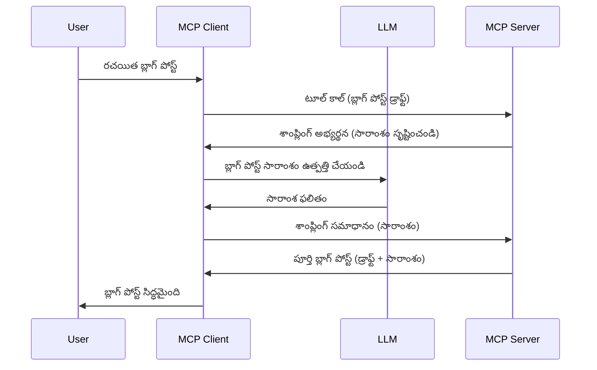

# శాంప్లింగ్ - ఫీచర్లు క్లయింట్‌కు అప్పగించాలి

> **నిషేధ సంబోధన:** `2026-07-28` MCP స్పెసిఫికేషన్ విడుదల రకమార్కుకు శాంప్లింగ్‌ని నిషేధిస్తూ LLM ప్రొవైడర్ APIs తో ప్రత్యక్ష సమీకరణకు అవసరం అని సూచిస్తోంది. శాంప్లింగ్ `2025-11-25`లో మరియు అధికారిక నిషేధం వచ్చిన తరువాత కనీసం ఒక సంవత్సరం పాటు పని చేస్తుంది, కనుక ఈ పాఠం అంతా చెల్లుబాటు ఉంది — కానీ కొత్త సర్వర్ డిజైన్లు ప్రత్యామ్నాయ నమూనాను పరిశీలించాలి. [MCPలో ఏమి మారుతున్నది: 2026-07-28 విడుదల రకమార్కు](../../01-CoreConcepts/mcp-2026-07-28-release-candidate.md) చూడండి.

మీరు అలాంటి సందర్భాలు ఉంటాయి, సర్వర్ మరియు క్లయింట్ కలిసి సాధించాల్సిన లక్ష్యము ఉంటాయి. ఒక సందర్భంలో సర్వర్ క్లయింట్ పైన ఉన్న LLM సహాయం కోరవలసి రావచ్చు. అప్పుడు మీరు శాంప్లింగ్ ఉపయోగించాలి.

కొన్ని ఉపయోగకరమైన సందర్భాలు మరియు శాంప్లింగ్ సహాయంతో పరిష్కారం ఎలా రూపొందించాలో చూద్దాం.

## అవలోకనం

ఈ పాఠంలో, శాంప్లింగ్ ఎప్పుడు, ఎక్కడ ఉపయోగించాలో మరియు దానిని ఎలా కాన్ఫిగర్ చేయాలో స్పష్టంగా చేస్తాము.

## నేర్చుకోవాల్సిన లక్ష్యాలు

ఈ అధ్యాయంలో, మనం:

- శాంప్లింగ్ అంటే ఏమిటి, ఎప్పుడు ఉపయోగించాలో వివరించాలి.
- MCPలో శాంప్లింగ్‌ను ఎలా కాన్ఫిగర్ చేయాలో చూపించాలి.
- శాంప్లింగ్ యొక్క క్రియాశీల ఉదాహరణ ఇవ్వాలి.

## శాంప్లింగ్ అంటే ఏమిటి మరియు దాని ఉపయోగం?

శాంప్లింగ్ అనేది ఈ విధంగా పనిచేసే అధునాతన ఫీచర్:



### శాంప్లింగ్ అభ్యర్థన

సరే, ఇప్పుడు ఒక విశ్వసనీయ పరిస్థితి పై మేము ఒక సమగ్ర దృష్టిని పొందుకున్నాము, సర్వర్ క్లయింట్‌కు పంపించే శాంప్లింగ్ అభ్యర్థన గురించి మాట్లాడుకుందాం. JSON-RPC ఫార్మాట్ లో ఈ అభ్యర్థన ఇలా ఉండవచ్చు:

```json
{
  "jsonrpc": "2.0",
  "id": 1,
  "method": "sampling/createMessage",
  "params": {
    "messages": [
      {
        "role": "user",
        "content": {
          "type": "text",
          "text": "Create a blog post summary of the following blog post: <BLOG POST>"
        }
      }
    ],
    "modelPreferences": {
      "hints": [
        {
          "name": "claude-3-sonnet"
        }
      ],
      "intelligencePriority": 0.8,
      "speedPriority": 0.5
    },
    "systemPrompt": "You are a helpful assistant.",
    "maxTokens": 100
  }
}
```

ఇక్కడ కొన్ని ముఖ్యాంశాలు:

- ప్రాంప్ట్, content -> text కింద, మన ప్రాంప్ట్ LLMకి బ్లాగ్ పోస్టు సంగ్రహం కోసం సూచన.

- **modelPreferences**. ఈ విభాగం LLMతో ఉపయోగించే కాన్ఫిగరేషన్ పై ఒక అభిరుచి, సిఫార్సు మాత్రమే. యూజర్ ఈ సిఫార్సులను అంగీకరించవచ్చు లేదా మార్చవచ్చు. ఈ సందర్భంలో మోడల్, వేగం, మేధస్సు ప్రాధాన్యతలపై సూచనలు ఉన్నాయి.
- **systemPrompt**, ఇది మీ సాధారణ సిస్టమ్ ప్రాంప్ట్, ఇది మీ LLMకి వ్యక్తిత్వాన్ని ఇస్తోంది మరియు మార్గదర్శక సూచనలు కలిగి ఉంది.
- **maxTokens**, ఈ ప్రాపర్టీ ఈ పనికి ఎంత టోకెన్లను ఉపయోగించాలనే సూచన.

### శాంప్లింగ్ స్పందన

ఈ స్పందన MCP క్లయింట్ MCP సర్వర్‌కు పంపుతుంది, అది క్లయింట్ LLMను కాల్ చేసి, స్పందన కోసం వేచి, ఆ స్పందనతో ఈ మెసేజ్‌ను తయారుచేస్తుంది. JSON-RPCలో ఇలా ఉండవచ్చు:

```json
{
  "jsonrpc": "2.0",
  "id": 1,
  "result": {
    "role": "assistant",
    "content": {
      "type": "text",
      "text": "Here's your abstract <ABSTRACT>"
    },
    "model": "gpt-5",
    "stopReason": "endTurn"
  }
}
```

సంఖ్యగా దీని స్పందన బ్లాగ్ పోస్టు సారాంశం వలె ఉంది, మనం అడిగినట్టు. అలాగే మనం అడిగిన వాడిన మోడల్ కాకుండా "gpt-5" ను "claude-3-sonnet" కంటే ఎక్కువగా వాడినట్లు గమనించండి. ఇది యూజర్ తన ఇష్టాన్ని మార్చవచ్చు అని మరియు శాంప్లింగ్ అభ్యర్థన ఒక సిఫార్సు మాత్రమే అని చూపించడానికి.

సరే, ఇప్పుడు ప్రధాన ప్రవాహం అర్థం చేసుకున్నాము, మరియు ఉపయోగకరమైన పని "బ్లాగ్ పోస్టు సృష్టి + సారాంశం" కోసం ఉపయోగించాము, ఇప్పుడు దీన్ని పని చేయడానికి మనం చేయాల్సేదేమిటో చూద్దాం.

### సందేశ రకాలు

శాంప్లింగ్ సందేశాలు కేవలం వచనం మాత్రమే కాకుండా చిత్రాలు మరియు ఆడియో కూడా పంపవచ్చు. JSON-RPC ఎలా వేరు ఉంటుందో ఇలా:

**వచనం**

```json
{
  "type": "text",
  "text": "The message content"
}
```

**చిత్ర కంటెంట్**

```json
{
  "type": "image",
  "data": "base64-encoded-image-data",
  "mimeType": "image/jpeg"
}
```

**ఆడియో కంటెంట్**

```json
{
  "type": "audio",
  "data": "base64-encoded-audio-data",
  "mimeType": "audio/wav"
}
```

> NOTE: శాంప్లింగ్ మీద మరిన్ని వివరాలకు, [అధికారిక డాక్యుమెంట్స్](https://modelcontextprotocol.io/specification/2025-11-25/client/sampling) చూడండి

## క్లయింట్లో శాంప్లింగ్ ఎలా కాన్ఫిగర్ చేయాలి

> గమనిక: మీరు కేవలం సర్వర్ మాత్రమే తయారు చేస్తుంటే, ఇక్కడ ఎక్కువ చేయాల్సిన పనిలేదు.

క్లయింట్‌లో, ఈ ఫీచర్‌ను కింది విధంగా స్పెసిఫై చేయాలి:

```json
{
  "capabilities": {
    "sampling": {}
  }
}
```

దీన్ని మీ ఎంచుకున్న క్లయింట్ సర్వర్ ప్రారంభించే సమయంలో తీసుకుంటుంది.

## శాంప్లింగ్ ఉదాహరణ - ఒక బ్లాగ్ పోస్ట్ సృష్టించు

మనం కలిసి ఒక శాంప్లింగ్ సర్వర్ కోడ్ చేద్దాం, మేము ఈ క్రింది పనులు చేయాలి:

1. సర్వర్ పై ఒక టూల్ సృష్టించండి.
1. ఆ టూల్ ఒక శాంప్లింగ్ అభ్యర్థన తయారుచేయాలి.
1. టూల్ క్లయింట్ యొక్క శాంప్లింగ్ అభ్యర్థన సమాధానానికి వేచివుండాలి.
1. తరువాత టూల్ ఫలితం ఉత్పత్తి చేయాలి.

దశలవారీగా కోడ్ చూద్దాం:

### -1- టూల్ సృష్టించు

**python**

```python
@mcp.tool()
async def create_blog(title: str, content: str, ctx: Context[ServerSession, None]) -> str:
    """Create a blog post and generate a summary"""

```

### -2- శాంప్లింగ్ అభ్యర్థన సృష్టించు

మీ టూల్‌ను కింది కోడ్‌తో పొడగించండి:

**python**

```python
post = BlogPost(
        id=len(posts) + 1,
        title=title,
        content=content,
        abstract=""
    )

prompt = f"Create an abstract of the following blog post: title: {title} and draft: {content} "

result = await ctx.session.create_message(
        messages=[
            SamplingMessage(
                role="user",
                content=TextContent(type="text", text=prompt),
            )
        ],
        max_tokens=100,
)

```

### -3- స్పందన కోసం వేచివుండి, స్పందనను తిరిగి ఇవ్వండి

**python**

```python
post.abstract = result.content.text

posts.append(post)

# పూర్తి ఉత్పత్తిని తిరిగి ఇవ్వండి
return json.dumps({
    "id": post.title,
    "abstract": post.abstract
})
```

### -4- పూర్తి కోడ్

**python**

```python
from starlette.applications import Starlette
from starlette.routing import Mount, Host

from mcp.server.fastmcp import Context, FastMCP

from mcp.server.session import ServerSession
from mcp.types import SamplingMessage, TextContent

import json


from uuid import uuid4
from typing import List
from pydantic import BaseModel


mcp = FastMCP("Blog post generator")

# app = FastAPI()

posts = []

class BlogPost(BaseModel):
    id: int
    title: str
    content: str
    abstract: str

posts: List[BlogPost] = []

@mcp.tool()
async def create_blog(title: str, content: str, ctx: Context[ServerSession, None]) -> str:
    """Create a blog post and generate a summary"""

    post = BlogPost(
        id=len(posts) + 1,
        title=title,
        content=content,
        abstract=""
    )

    prompt = f"Create an abstract of the following blog post: title: {title} and draft: {content} "

    result = await ctx.session.create_message(
        messages=[
            SamplingMessage(
                role="user",
                content=TextContent(type="text", text=prompt),
            )
        ],
        max_tokens=100,
    )

    post.abstract = result.content.text

    posts.append(post)

    # పూర్తి బ్లాగ్ పోస్ట్ ని రిటర్న్ చేయండి
    return json.dumps({
        "id": post.title,
        "abstract": post.abstract
    })

if __name__ == "__main__":
    print("Starting server...")
    # mcp.run()
    mcp.run(transport="streamable-http")

# అప్లికేషన్ ను ఇలా రన్ చేయండి: python server.py
```

### -5- Visual Studio Code లో పరీక్షించు

Visual Studio Code లో పరీక్షించడానికి, ఇలా చేయండి:

1. టెర్మినల్ లో సర్వర్ ప్రారంభించండి
1. *mcp.json*లో దీనిని జోడించండి (మరియు ప్రారంభం అయ్యిందని నిర్ధారించండి), ఉదాహరణకి ఇలా:

   ```json
   "servers": {
      "blog-server": {
        "type": "http",
        "url": "http://localhost:8000/mcp"
      }
   }
   ```

1. ఒక ప్రాంప్ట్ టైపు చేయండి:

   ```text
   create a blog post named "Where Python comes from", the content is "Python is actually named after Monty Python Flying Circus"
   ```

1. శాంప్లింగ్ సెషన్ అధికారాన్ని ఇవ్వండి. మొదటి సారి మీరు అదనపు డైలాగ్ చూడవచ్చు, దానిని అంగీకరించాలి, తర్వాత సాధారణ టూల్ అమలు అడిగే డైలాగ్ కనిపిస్తుంది

1. ఫలితాలను పరిశీలించండి. GitHub Copilot Chat లో అద్భుతంగా చూపబడుతుంది, మీరు రా JSON కూడా చూడవచ్చు.

**బోనస్**. Visual Studio Code సాధనాలు శాంప్లింగ్‌కు మంచి మద్దతును కలిగి ఉంటాయి. మీరు మీ ఇన్‌స్టాల్ చేసిన సర్వర్‌లో శాంప్లింగ్ యాక్సెస్‌ను ఇలాగే కన్ఫిగర్ చేయవచ్చు:

1. ఎక్స్‌టెన్షన్ భాగానికి వెళ్ళండి.
1. "MCP SERVERS - INSTALLED" విభాగంలో మీ వెళ్తున్న సర్వర్ కోసం కాగ్ ఐకాన్ ఎంచుకోండి.
1 "Configure Model Access" ఎంచుకోండి, ఇక్కడ మీరు శాంప్లింగ్ చేస్తారో అప్పుడప్పుడు GitHub Copilot ఉపయోగించడానికి అనుమతించే మోడల్స్ ఎంచుకోవచ్చు. అలాగే "Show Sampling requests" ఎంచుకుని ఇటీవల జరిగిన అన్ని శాంప్లింగ్ అభ్యర్థనలను చూడవచ్చు.

## అసైన్మెంట్

ఈ అసైన్మెంట్ లో మీరు ఒక తేడాగా ఉన్న శాంప్లింగ్ నిర్మించాలి, అంటే ఒక శాంప్లింగ్ ఇంటిగ్రేషన్ ఇది ఉత్పత్తి వివరణని రూపొందించడానికి సాయం చేస్తుంది. మీరు పరిస్థితి ఇలా ఉంది:

**సన్నివేశం**: e-commerce లో బ్యాక్ ఆఫీస్ ఉద్యోగికి ఉత్పత్తి వివరణలు తయారుచేయడం చాలా సమయం పడుతుంది. అందువల్ల, మీరు ఒక పరిష్కారం తయారు చేయాలి, అక్కడ మీరు "create_product" అనే టూల్ కాల్ చేస్తారు "title" మరియు "keywords" ఆర్గ్యుమెంట్స్ తో, ఇది పూర్తి ఉత్పత్తిని ఉత్పత్తి చేస్తుంది, ఇందులో "description" క్షేత్రం ఉంటుంది, ఇది క్లయింట్ LLM ద్వారా విలువపరచబడాలి.

TIP: మీరు ముందుగా నేర్చుకున్న దాన్ని ఉపయోగించి ఈ సర్వర్ మరియు దాని టూల్‌ను శాంప్లింగ్ అభ్యర్థన ద్వారా నిర్మించండి.

## పరిష్కారం

[పరిష్కారం](./solution/README.md)

## ముఖ్యాంశాలు

శాంప్లింగ్ అనేది శక్తివంతమైన ఫీచర్, ఇది సర్వర్ LLM సహాయం అవసరం అయినప్పుడు పనులు క్లయింట్‌కు అప్పగించగలదు.

## తదుపరి ఏమి ఉంది

- [అధ్యాయము 4 - ప్రాక్టికల్ అమలు](../../04-PracticalImplementation/README.md)

---

<!-- CO-OP TRANSLATOR DISCLAIMER START -->
**అస్వీకరణ**:
ఈ పత్రం AI అనువాద సేవ [Co-op Translator](https://github.com/Azure/co-op-translator) ఉపయోగించి అనువదించబడింది. మేము ఖచ్చితత్వానికి ప్రయత్నిస్తున్నప్పటికీ, ఆటోమేటెడ్ అనువాదాలు తప్పులు లేదా అసమగ్రతలను కలిగి ఉండవచ్చు. దాని స్వదేశ భాషలో ఉన్న అసలు పత్రాన్ని అధికారం కలిగిన మూలంగా పరిగణించాలి. కీలకమైన సమాచారం కోసం, ప్రొఫెషనల్ మానవ అనువాదాన్ని సిఫారసు చేస్తాము. ఈ అనువాదం ఉపయోగం వల్ల కలిగే ఏవైనా అపార్థాలు లేదా తప్పుదారులు కోసం మేము బాధ్యత వహించము.
<!-- CO-OP TRANSLATOR DISCLAIMER END -->