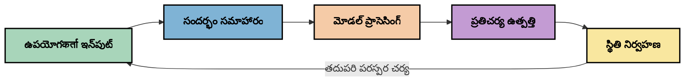
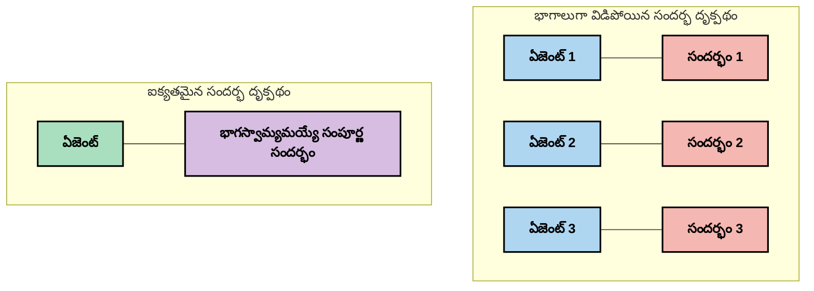
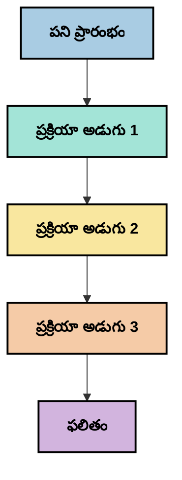
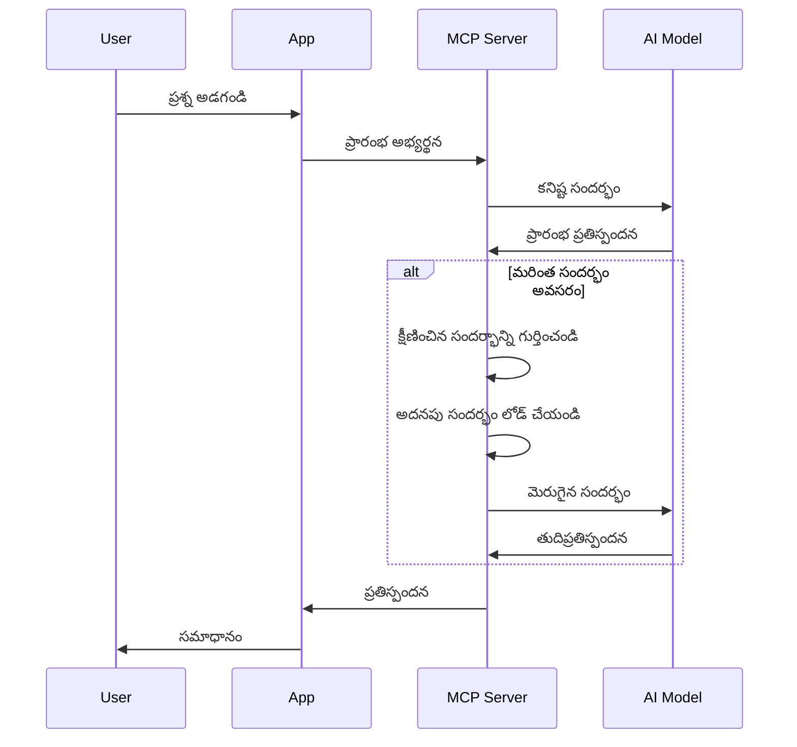
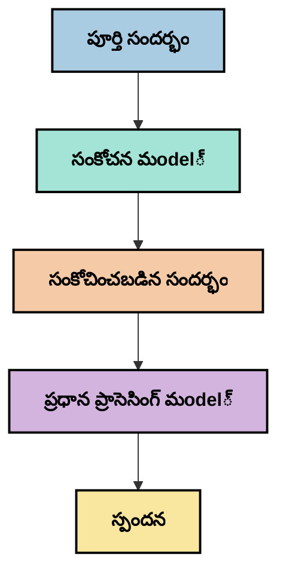
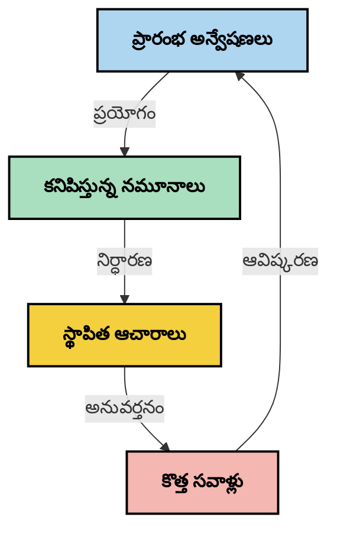

# సందర్భ ఇంజనీరింగ్: MCP ఎకోసిస్టంలో ఒక ఉద్భవిస్తున్న ఆలోచన

## అవలోకనం

సందర్భ ఇంజనీరింగ్ అనేది AI విభాగంలో ఒక ఉద్భవిస్తుంది కాన్సెప్ట్, ఇది క్లయింట్లు మరియు AI సర్వీసుల మధ్య ఇంటరాక్షన్ల సమయంలో సమాచారం ఎలా నిర్మించబడుతుందో, అందించబడుతుందో, నిర్వహించబడుతుందో అనేది అన్వేషిస్తుంది. మోడల్ సందర్భ ప్రోటోకాల్ (MCP) ఎకోసిస్టం అభివృద్ధి చెందుతున్నందున, సందర్భాన్ని సమర్థవంతంగా నిర్వహించడం ఎలా చేయాలో అర్ధం చేసుకోవడం మరింత ముఖ్యమవుతోంది. ఈ మాడ్యూల్ సందర్భ ఇంజనీరింగ్ యొక్క సంకల్పాన్ని పరిచయం చేస్తుంది మరియు MCP అమలులో దాని భవిష్యత్తు అనువర్తనాలను అన్వేషిస్తుంది.

## నేర్చుకోబోయే లక్ష్యాలు

ఈ మాడ్యూల్ అంతే వరకు, మీరు చేయగలుగుతారు:

- సందర్భ ఇంజనీరింగ్ ఉద్భవిస్తున్న ఆలోచనను మరియు దాని MCP అనువర్తనాలలో పాత్రను అవగాహన చేసుకోండి
- MCP ప్రోటోకాల్ డిజైన్ పరిష్కరించే సందర్భ నిర్వహణలో ముఖ్యంగా ఉన్న సవాళ్లను గుర్తించండి
- మెరుగైన సందర్భ నిర్వహణ ద్వారా మోడల్ పనితీరును మెరుగుపరచడానికి పద్ధతులను అన్వేషించండి
- సందర్భ ప్రభావాన్ని కొలవడానికి, అంచనా వేయడానికి విధానాలను పరిగణించండి
- MCP ఫ్రేమ్‌వర్క్ ద్వారా AI అనుభవాలను మెరుగుపరచడానికి ఈ ఉద్భవిస్తున్న సంకల్పాలు వర్తింపజేయండి

## సందర్భ ఇంజనీరింగ్ కు పరిచయం

సందర్భ ఇంజనీరింగ్ అనేది వాడుకరులు, అనువర్తనాలు మరియు AI మోడల్స్ మధ్య సమాచారం ప్రవాహాన్ని ఉద్దేశపూర్వకంగా రూపకల్పన మరియు నిర్వహణపై దృష్టి సారించిన ఒక ఉద్భవిస్తున్న ఆలోచన. ప్రాంప్ట్ ఇంజనీరింగ్ వంటి స్థాపితమైన రంగాల నుండి భిన్నంగా, సందర్భ ఇంజనీరింగ్ ఇంకా నిర్వచించబడుతోంది, ఇందులో వృత్తిపరులు AI మోడల్స్ కు సరైన సమయానికి సరైన సమాచారం ఇవ్వడంలో ఎదురయ్యే ప్రత్యేక సవాళ్లను పరిష్కరిస్తున్నారు.

పెద్ద భాషా మోడల్స్ (LLMs) అభివృద్ధి చెందినందున, సందర్భం యొక్క ప్రాముఖ్యత మరింత స్పష్టమైంది. మనం అందించే సందర్భం యొక్క నాణ్యత, సంబంధం మరియు నిర్మాణం మోడల్ ఫలితాలను నేరుగా ప్రభావితం చేస్తాయి. సందర్భ ఇంజనీరింగ్ ఈ సంబంధాన్ని అన్వేషించి సమర్థవంతమైన సందర్భ నిర్వహణకు సూత్రాలను అభివృద్ధి చేయడానికి చూస్తుంది.

> "2025లో, అక్కడి మోడల్స్ చాలా తెలివైనవిగా ఉంటాయి. కానీ అతి తెలివైన మనిషి కూడా వాళ్ళ పని సమర్ధవంతంగా చేయలేవు, వాళ్ళకు ఏమి చేయమని అడుగుతున్నారో అనే సందర్భం లేకుండా... 'సందర్భ ఇంజనీరింగ్' అంటే ప్రాంప్ట్ ఇంజనీరింగ్ యొక్క తదుపరి స్థాయి. ఇది డైనమిక్ సిస్టంలో ఆటోమేటిక్‌గా చేయడం గురించే." — వాల్డెన్ యాన్, కాగ్నిషన్ AI

సందర్భ ఇంజనీరింగ్ లో ఈ విషయాలు ఉండవచ్చు:

1. **సందర్భ ఎంపిక**: ఇచ్చిన పనికి సంబంధించిన సమాచారం నిర్ణయం చేసుకోవడం
2. **సందర్భ నిర్మాణం**: మోడల్ అవగాహన మరింతగా పెరుగుదల కావటం కోసం సమాచారాన్ని వర్గీకరించడం
3. **సందర్భ సపూర్తి**: సమాచారం మోడల్స్ కు ఎప్పుడు మరియు ఎలా పంపించాలో మెరుగుపరచడం
4. **సందర్భ నిర్వహణ**: సందర్భం యొక్క స్థితి మరియు మార్పులను సమయం తో నిర్వహించడం
5. **సందర్భ మూల్యాంకనం**: సందర్భ ప్రభావాన్ని కొలవడం మరియు మెరుగుపరచడం

ఈ దృష్టాంతాలు MCP ఎకోసిస్టానికి ప్రత్యేకంగా సంబంధించి ఉన్నవి, ఇది అనువర్తనాలకు LLMలకు సందర్భం అందించేందుకు ప్రమాణీకృత విధానాన్ని అందిస్తుంది.


## సందర్భ ప్రయాణం దృష్టికోణం

సందర్భ ఇంజనీరింగ్ ని మీసుకోగలిగే ఒక మార్గం MCP సిస్టంలో సమాచారం ఎంతటుప్రయాణిస్తుంది అనేది అనుసరించడం:



### సందర్భ ప్రయాణంలో ముఖ్య దశలు:

1. **వాడుకరి ఇన్‌పుట్**: వాడుకరి నుండి క్యాచింది సమాచారం (టెక్స్ట్, చిత్రాలు, డాక్యూమెంట్లు)
2. **సందర్భ సమీకరణ**: వాడుకరి ఇన్‌పుట్ తో సిస్టమ్ సందర్భం, సంభాషణ చరిత్ర మరియు ఇతర పొందిన సమాచారాన్ని కలపడం
3. **మోడల్ ప్రాసెసింగ్**: AI మోడల్ ఈ సమీకరించిన సందర్భాన్ని ప్రాసెస్ చేయడం
4. **ప్రతిస్పందన ఉత్పత్తి**: మోడల్ అందించిన సందర్భం ఆధారంగా ఫలితాలను ఉత్పత్తి చేయడం
5. **స్థితి నిర్వహణ**: ఈ ఇంటరాక్షన్ ఆధారంగా సిస్టమ్ లో అంతర్గత స్థితిని నవీకరించడం

ఈ దృష్టికోణం AI సిస్టమ్స్ లో సందర్భం డైనమిక్ స్వభావాన్ని హై లైట్ చేస్తుంది మరియు ప్రతి దశలో సమాచారాన్ని ఎలా సమర్థవంతంగా నిర్వహించాలి అనే ముఖ్య ప్రశ్నలను రేఖాకల్పన చేస్తుంది.

## ఉద్భవిస్తున్న సందర్భ ఇంజనీరింగ్ సూత్రాలు

సందర్భ ఇంజనీరింగ్ రంగం రూపాన్ని వచ్చే సమయంలో కొంతమంది వృత్తిపరుల నుండి ప్రారంభ సూత్రాలు బయటకు వస్తున్నాయి. ఈ సూత్రాలు MCP అమలు ఎంపికలకు దిశనిర్దేశం చేయగలవు:

### సూత్రం 1: సందర్భాన్ని పూర్తిగా పంచుకోండి

ఒక సిస్టమ్ లో అన్ని భాగాల మధ్య సందర్భం పూర్తిగా పంచుకోవాలి, ఎక్కువ ఏజెంట్లు లేదా ప్రాసెస్‌ల మధ్య విభజింప బడకూడదు. సందర్భం పంపిణీ అయినప్పుడు, సిస్టమ్ పనితీరులో ఒక భాగం తీసుకునే నిర్ణయాలు ఇతర భాగాల నిర్ణయాలతో విరుద్ధంగా ఉండవచ్చు.



MCP అనువర్తనాలలో, ఈ భావన అనేది సందర్భం మొత్తం ప్లై పైన సౌకర్యవంతంగా ప్రవహించేలా డిజైన్ చేయడాన్ని సూచిస్తుంది, విడిపోతూ ఉండకుండా.

### సూత్రం 2: చర్యలు అర్థవంతమైన నిర్ణయాలను తీసుకుంటాయని గుర్తించండి

మోడల్ తీసుకునే ప్రతి చర్య సందర్భాన్ని ఎ interpret చెయ్యటానికి అర్థవంతమైన నిర్ణయాలను కలిగి ఉంటుంది. ఒకేసారి వేర్వేరు సందర్భాలపై ఎన్నో భాగాలు పని చేస్తే, ఈ అంతర్లీన నిర్ణయాలు విరుద్ధంగా ఉండవచ్చు, దాంతో చిత్రం సुसంపన్నంగా లేని ఫలితాలు వస్తాయి.

ఈ సూత్రం MCP అనువర్తనాలకు ముఖ్యమైన ప్రభావాలను కలిగి ఉంటుంది:
- క్లిష్టమైన పనులను ప్యారలల్ గా నడిపించే బదులు సజావుగా లీనియర్ ప్రాసెసింగ్ చేయుటకు ప్రాధాన్యం ఇవ్వండి
- అన్ని నిర్ణయమయ్యే బిందువులు ఒకే సందర్భ సమాచారాన్ని అందుకోవాలని నిర్ధారించండి
- తర్వాతి దశలు మొన్నటి నిర్ణయపు పూర్తి సందర్భాన్ని చూడగలిగేలా వ్యవస్థలను రూపకల్పన చేయండి

### సూత్రం 3: సందర్భ లోతును విండో పరిమితులతో సమతుల్యం చేయండి

సంభాషణలు మరియు ప్రక్రియలు పొడవవలే కానీ, సందర్భ విండోలు అంగీకృత పరిమితి దాటి పోతాయి. సమర్థవంతమైన సందర్భ ఇంజనీరింగ్ సమగ్ర సందర్భం మరియు సాంకేతిక పరిమితుల మధ్య ఈ త ఉంటుంది ఎలా నిర్వహించాలో అన్వేషిస్తుంది.

ప్రస్తుతం అన్వేషిస్తున్న ప్రాధాన్య విధానాలు:
- సూచికల వినియోగం తగ్గిస్తూ అవసరమైన సమాచారాన్ని నిలుపుకునే సందర్భ కంప్రెషన్
- ప్రస్తుత అవసరాలకు అనుగుణంగా ప్రోగ్రెసివ్‌గా సందర్భాన్ని లోడ్ చేయడం
- కీలక నిర్ణయాలు, వాస్తవాలతో పాటు గత సంభాషణలను సారాంశం చేయడం

## సందర్భ సవాళ్లు మరియు MCP ప్రోటోకాల్ డిజైన్

మోడల్ సందర్భ ప్రోటోకాల్ (MCP) ప్రత్యేక సందర్భ నిర్వహణ సవాళ్లను తెలుసుకుని డిజైన్ చేయబడింది. ఈ సవాళ్లను అర్థం చేసుకోవడం MCP ప్రోటోకాల్ డిజైన్ యొక్క ముఖ్య అంశాలను వివరిస్తుంది:


### సవాలు 1: సందర్భ విండో పరిమితులు
చాలా AI మోడల్స్ కి నిర్ధారించిన సందర్భ విండో పరిమాణాలు ఉన్నాయి, ఒకేసారి ఎంత సమాచారం ప్రాసెస్ చేయగలవో పరిమితం.

**MCP డిజైన్ ప్రతిస్పందన:**
- ప్రోటోకాల్ సముచిత రీతిలో, వనరుల ఆధారిత సందర్భాన్ని సమర్థవంతంగా సూచించగలిగేలా డిజైన్ చేశారు
- వనరులు పేజినేషన్ చేసి, ఆవశ్యకత ఆధారంగా ప్రోగ్రెసివ్ గా లోడ్ చేయవచ్చు

### సవాలు 2: సబబైన సమాచారాన్ని నిర్ణయించడం
ఏ సమాచారాన్ని సందర్భంలో చేర్చాలి అనేది ఎంచుకోవడం కష్టం.

**MCP డిజైన్ ప్రతిస్పందన:**
- డైనమిక్ గా అవసరం ఉన్న సమాచారం తేవడానికి సాఫ్ట్‌వేర్ సాధనాల వినియోగానికి అనుమతిస్తారు
- సూత్రబద్ధమైన ప్రాంప్ట్‌లు సందర్భాన్ని స్థిరంగా నిర్వహించడానికి సహాయపడతాయ్

### సవాలు 3: సందర్భ నిలుపుదనం
ఇంటరాక్షన్‌లలో స్థితిని నిర్వహించడం కోసం సందర్భాన్ని జాగ్రత్తగా ట్రాక్ చేయాలి.

**MCP డిజైన్ ప్రతిస్పందన:**
- ప్రమాణీకరించిన సెషన్ నిర్వహణ
- సందర్భ మార్పుకు స్పష్టంగా నిర్వచించిన ఇంటరాక్షన్ నమూనాలు

### సవాలు 4: బహుముఖ సమాచార సందర్భం
వేర్వేరు రకాల సమాచారం (టెక్స్ట్, చిత్రాలు, నిర్మిత డేటా) వేరే విధంగా నిర్వహించాలి.

**MCP డిజైన్ ప్రతిస్పందన:**
- ప్రోటోకాల్ డిజైన్ వివిధ కంటెంట్ రకాలను అనుకూలంగా చూసుకోవడం
- బహుముఖ సమాచారానికి ప్రమాణీకృత ప్రాతినిధ్యం

### సవాలు 5: భద్రత మరియు గోప్యత
సందర్భంలో సున్నితమైన సమాచారం ఉండవచ్చు, దాన్ని రక్షించడం అవసరం.

**MCP డిజైన్ ప్రతిస్పందన:**
- క్లయింట్ మరియు సర్వర్ బాధ్యతల మధ్య స్పష్టమైన సరిహద్దులు
- డేటా ప్రదర్శన తగ్గించేందుకు స్థానిక ప్రాసెసింగ్ ఎంపికలు

ఈ సవాళ్లను అర్థం చేసుకోవడం మరియు MCP వాటిని ఎలా పరిష్కరిస్తుంది తెలుసుకోవడం సాంకేతిక పరిజ్ఞానంపై క్రమబద్ధమైన వ్యవస్థాపన కోసం మూలస్తంభం ఉంటుంది.

## ఉద్భవిస్తున్న సందర్భ ఇంజనీరింగ్ పద్ధతులు

సందర్భ ఇంజనీరింగ్ రంగం అభివృద్ధి చెందుతున్నప్పుడు, కొన్ని ఆశాజనకమైన పద్ధతులు బయటకు వస్తున్నాయి. ఇవి స్థిరమైన ఉత్తమ పద్ధతుల కంటే ప్రస్తుత ఆలోచనలు మాత్రమే, MCP అమలుతో అనుభవం పెరిగే కొద్దీ అభివృద్ధి చెందుతుంది.

### 1. సింగిల్-థ్రెడ్ లీనియర్ ప్రాసెసింగ్

ఒకేసారి వేర్వేరు ఏజెంట్లు సందర్భాన్ని పంపిణీ చేసే స్థానంలో, కొంతమంది వృత్తిపరులు ఒకే సారి లీనియర్ ప్రాసెసింగ్ మరింత స్థిరమైన ఫలితాలు అందిస్తుందని గుర్తిస్తున్నారు. ఇది ఏకీకృత సందర్భం నిర్వహణ సూత్రానికి సరిపోతుంది.



ఈ విధానం ప్యారలల్ ప్రాసెసింగ్ కన్నా తక్కువ సమర్ధవంతంగా అనిపించవచ్చు, కానీ ప్రతీ దశ ముందు నిర్ణయాల పూర్తి అవగాహనతో మిళితమవ్వడంతో దీనివల్ల మరింత అనుసరణీయమైన ఫలితాలు వస్తాయి.

### 2. సందర్భ భాగాల వర్గీకరణ మరియు ప్రాధాన్యత

పెద్ద సందర్భాన్ని నిర్వహించదగిన చిన్న భాగాలుగా విభజించి, అత్యంత ముఖ్యమైన వాటికి ప్రాధాన్యత ఇచ్చడం.

```python
# భావనాత్మక ఉదాహరణ: సందర్భం భాగాలుగా విభజన మరియు ప్రాధాన్యత ఇవ్వడం
def process_with_chunked_context(documents, query):
    # 1. డాక్యుమెంట్లను చిన్న భాగాలుగా విడగొట్టు
    chunks = chunk_documents(documents)
    
    # 2. ప్రతి భాగానికి సంబంధిత స్కోర్లను లెక్కించు
    scored_chunks = [(chunk, calculate_relevance(chunk, query)) for chunk in chunks]
    
    # 3. సంబంధిత స్కోర్ల ద్వారా భాగాలను క్రమబద్దీకరించండి
    sorted_chunks = sorted(scored_chunks, key=lambda x: x[1], reverse=True)
    
    # 4. అత్యంత సంబంధిత భాగాలను సందర్భంగా ఉపయోగించండి
    context = create_context_from_chunks([chunk for chunk, score in sorted_chunks[:5]])
    
    # 5. ప్రాధాన్యత పొందిన సందర్భంతో ప్రాసెస్ చేయండి
    return generate_response(context, query)
```

పై భావన బహుళ పెద్ద డాక్యుమెంట్లను చిన్న భాగాలుగా విభజించడం, మరియు సందర్భానుసారంగా మాత్రమే అత్యంత సంబంధిత భాగాలను ఎంచుకోవడం ఎలా జరుగుతుందో చూపిస్తుంది. ఈ విధానం సందర్భ విండో పరిమితుల్లో పని చేయడానికి సహాయపడుతుంది మరియు పెద్ద జ్ఞానభాండారాలను ఉపయోగించడాన్ని తేలికచేస్తుంది.

### 3. ప్రోగ్రెసివ్ సందర్భ లోడింగ్

అవసరం వచ్చినప్పుడు మాత్రమే ఒకేసారి సంభ్రమంగా కాకుండా దశలవారీగా సందర్భాన్ని లోడ్ చేయడం.



ప్రోగ్రెసివ్ సందర్భ లోడింగ్ కనీస అంశాలతో ప్రారంభించి అవసరమైనప్పుడు మాత్రమే విస్తరించబడుతుంది. సాధారణ ప్రశ్నలకు ఇది టోకెన్ వినియోగాన్ని గణనీయంగా తగ్గిస్తుంది, మరింత క్లిష్టమైన ప్రశ్నలను కూడా పరిష్కరించగల సామర్థ్యం నిలుపుతుంది.

### 4. సందర్భ కంప్రెషన్ మరియు సారాంశం

అవసరమైన సమాచారాన్ని భద్రపరచుకుంటూ సందర్భం పరిమాణాన్ని తగ్గించడం.



సందర్భ కంప్రెషన్ మీద దృష్టి:
- అదనపు సమాచారాన్ని తొలగించడం
- పొడవైన విషయాలను సారాంశం చేయడం
- కీలక వాస్తవాలు మరియు వివరాలు వెలికితీయడం
- ముఖ్యమైన సందర్భ అంశాలను నిలుపుకోవడం
- టోకెన్ సామర్ధ్యత కోసం ఆప్టిమైజ్ చేయడం

ఈ విధానం సందర్భ విండోలలో పొడవైన సంభాషణలను నిర్వహించడంలో లేదా పెద్ద డాక్యుమెంట్లను సమర్థవంతంగా ప్రాసెస్ చేయడంలో ముఖ్యంగా విలువైనది. కొంతమంది వృత్తిపరులు చరిత్ర కలిగి సంభాషణ సారాంశం మరియు సందర్భ కంప్రెషన్ కోసం ప్రత్యేక మోడల్స్ ఉపయోగిస్తున్నారు.


## అన్వేషణాత్మక సందర్భ ఇంజనీరింగ్ పరిగణనలు

సందర్భ ఇంజనీరింగ్ యొక్క ఉద్భవిస్తున్న రంగాన్ని అన్వేషిస్తూనే, MCP అమలు సమయంలో గుర్తించదగిన కొన్ని పరిగణనలు ఉన్నాయి. ఇవి నిర్ణీత ఉత్తమ పద్ధతులు కాకపోతే, మీ ప్రత్యేక వినియోగంలో మెరుగుదలకి దారితీయగల ప్రాంతాలుగా ఉన్నాయి.

### మీ సందర్భ లక్ష్యాలను పరిగణించండి

క్లిష్టమైన సందర్భ నిర్వహణ పరిష్కారాలను అమలు చేయేముందు, మీరు సాధించదలచుకున్నదేంటి స్పష్టంగా తెలియజేయండి:
- మోడల్ విజయవంతం కావడానికి ఏ నిర్దిష్ట సమాచారం అవసరం?
- ఏ సమాచారం ముఖ్యమైనది, ఏదైతే ఉపకరణీయమైనది?
- మీ పనితీరు పరిమితులు ఏమిటి (విలంబన, టోకెన్ పరిమితులు, ఖర్చులు)?

### స్థరాల వారీగా సందర్భ పద్ధతులను అన్వేషించండి

కొంతమంది వృత్తిపరులు భావిస్తారు, సందర్భాన్ని భావనాత్మక స్థరాల్లో ఏర్పాటు చేస్తే విజయవంతం సాధించవచ్చు:
- **మూల స్థరం**: మోడల్ ఎల్లప్పుడూ అవసరపడే అనివార్య సమాచారం
- **ఘటనా స్థరం**: ప్రస్తుత ఇంటరాక్షన్ కి ప్రత్యేకమైన సందర్భం
- **పరిరక్షణ స్థరం**: అదనపు సహాయక సమాచారం
- **వెనుక పడటం స్థరం**: అవసరమైనప్పుడు మాత్రమే చేరుకునే సమాచారం

### సమాచార తీసుకోవడంకెక ప్రత్యేక దృష్టి ఇవ్వండి

మీ సందర్భ ప్రభావం ఎక్కువగా మీరు ఎలా సమాచారాన్ని పొందుతున్నారో ఆధారపడుతుంది:
- భావాత్మక శోధన మరియు ఎంబెడింగ్స్ ద్వారా సాంకేతికంగా సంబంధమైన సమాచారాన్ని కనుగొనడం
- నిర్దిష్ట వాస్తవ వివరాలకు కీవర్డ్ ఆధారిత శోధన
- బహుళ తరహాల ఉపాయాలను కలిపే హైబ్రిడ్ పద్ధతులు
- వర్గాలు, తేదీలు, మూలాల ఆధారంగా వెయ్యి ఫిల్టర్ ద్వారా పరిధిని తగ్గించడం

### సందర్భ అనుసరణను పరీక్షించండి

మీ సందర్భ నిర్మాణం మరియు ప్రవాహం మోడల్ అవగాహనపై ప్రభావం చూపవచ్చు:
- సంబంధిత సమాచారాన్ని సమూహీకరించడం
- స్థిరమైన ఆకృతి మరియు సంస్థలు ఉపయోగించడం
- అవసరమనిపించే చోట తాత్కాలిక లేదా కాలానుక్రమ శ్రేణి నిర్వహణ
- వ్యతిరేక సమాచారాన్ని నివారించడం

### బహుళ ఏజెంట్ నిర్మాణాలకి తలంపులు వేయండి

బహుళ ఏజెంట్ నిర్మాణాలు చాలో AI ఫ్రేమ్‌వర్క్స్ లో ప్రజాదరణ పొందినప్పటికీ, వీటికి సందర్భ నిర్వహణలో గట్టి సవాళ్లు ఉన్నాయి:
- సందర్భ విభజన కారణంగా ఏజెంట్ల మధ్య అసమ్మత నిర్ణయాలు రావచ్చు
- ప్యారలల్ ప్రాసెసింగ్ విరుద్ధతలను తీసుకోకి రావచ్చు, వీటిని కలిసి పరిష్కరించడం కష్టం
- ఏజెంట్ల మధ్య సంభాషణ అధిక భారం పనితీరు లాభాలను తగ్గిస్తాయి
- సహజత్వం కోసం క్లిష్ట స్థితి నిర్వహణ అవసరం

చాల సందర్భాలలో, విభజిత సందర్భం కలిగిన ప్రత్యేక ఏజెంట్ల కన్నా సమగ్ర సందర్భం నిర్వహణతో కూడిన ఏక ఏజెంట్ పద్ధతి మరింత నమ్మదగిన ఫలితాలు ఇవ్వవచ్చు.

### మూల్యాంకన విధానాల అభివృద్ధి

సందర్భ ఇంజనీరింగ్ క్రమంగా మెరుగుపరిచేందుకు, విజయాన్ని ఎలాగూ కొలవాలో పరిగణించండి:
- విభిన్న సందర్భ నిర్మాణాలను A/B పరీక్ష
- టోకెన్ ఉపయోగం మరియు ప్రత్యుత్తర సమయాలను పరిశీలన
- వినియోగరి సంతృప్తి మరియు పనితీరు పూర్తి రేట్లను ట్రాక్ చేయడం
- సందర్భ వ్యూహాలు విఫలమయ్యే సందర్భాలు విశ్లేషణ

ఈ పరిగణనలు సందర్భ ఇంజనీరింగ్ రంగంలో క్రియాశీల అన్వేషణా ప్రాంతాలు. రంగం పకడ్బందీగా ఏర్పడాక, మరింత నిర్వచిత రూపాలు మరియు పద్ధతులు అభివృద్ధి చెందే అవకాశముంది.

## సందర్భ ప్రభావాన్ని కొలవడం: అభివృద్ధి చెందుతున్న ఫ్రేమ్‌వర్క్

సందర్భ ఇంజనీరింగ్ ఉద్భవించగా, వృత్తిపరులు దాని ప్రభావాన్ని ఎలా కొలవవచ్చో పరిశీలిస్తున్నారు. ఇప్పటివరకు స్థిరమైన ఫ్రేమ్‌వర్క్ లేదుగానీ, రాబోయే పనికి మార్గదర్శకంగా ఉండగల వివిధ మెట్రిక్స్ పరిగణించబడ్డాయి.

### కొలవడంలో భావ్య పరిధులు


#### 1. ఇన్‌పుట్ సమర్ధత పరిగణనలు

- **సందర్భం-ప్రతిస్పందన నిష్పత్తి**: ప్రతిస్పందన పరిమాణానికి సంబంధించి ఎంత సందర్భం అవసరమో?
- **టోకెన్ వినియోగం**: అందించిన సందర్భ టోకెన్‌లలో ఎంత శాతం ప్రతిస్పందనపై ప్రభావం చూపుతుందో?
- **సందర్భం తగ్గింపు**: ముట్టడి సమాచారాన్ని ఎంత సమర్థవంతంగా కుదించడం సాధ్యమో?

#### 2. పనితీరు పరిగణనలు

- **విలంబన ప్రభావం**: సందర్భ నిర్వహణ ప్రతిస్పందన సమయాన్ని ఎలా ప్రభావితం చేస్తుంది?
- **టోకెన్ ఆర్థిక శాస్త్రం**: టోకెన్ వినియోగం సమర్థవంతంగా ఉందా?
- **అభినందన ఖచ్చితత్వం**: తీసుకున్న సమాచారం ఎంత వరకూ సంబంధితమో?
- **వనరుల వినియోగం**: అవసరమైన గణన వనరులు ఏమిటి?

#### 3. నాణ్యత పరిగణనలు

- **ప్రతిస్పందన సంబంధితత**: ప్రశ్నను ఎంత బాగా సమాధానమిస్తుంది?
- **వాస్తవ ఖచ్చితత్వం**: సందర్భ నిర్వహణ వాస్తవాలు ఎంత మెరుగుపరుస్తుందో?
- **సంతులనం**: సారూప్య ప్రశ్నలకు ప్రతిస్పందనలు అనుసరణీయంగా ఉంటాయా?
- **విచిత్రత రేటు**: మెరుగైన సందర్భం మోడల్ హల్యూసినేషన్లను తగ్గిస్తుందా?

#### 4. వినియోగరి అనుభవ పరిగణనలు

- **ఫాలో-అప్ రేటు**: వినియోగులు ఎంతసార్లు స్పష్టత కోరుతారో?
- **పనితీరు పూర్తి**: వినియోగులు విజయవంతంగా తమ లక్ష్యాలను సాధిస్తారా?
- **సంతృప్తి సూచికలు**: వినియోగులు తమ అనుభవాన్ని ఎలా రేటు చేస్తారు?

### కొలవటానికి అన్వేషణాత్మక పద్ధతులు

MCP అమలులో సందర్భ ఇంజనీరింగ్ తో ప్రయోగాలు చేస్తూ ఉన్నప్పుడు, ఈ అన్వేషణాత్మక పద్ధతులను పరిగణించండి:

1. **బేస్లైన్ తులనాలు**: సామాన్య సందర్భ విధానాలతో బేస్లైన్ నెలకొల్పి, తర్వాత మరింత సుపరిచిత పద్ధతులు నుండి పరీక్షించండి

2. **కొద్దిపాటి మార్పులు**: ఒకేసారి ఒక్క అంశం మాత్రమే మార్చి దాని ప్రభావాలు తెలుసుకోండి

3. **వినియోగరి-కేంద్రిత మూల్యాంకనం**: గణాంకాలతో పాటు నాణ్యమైన వినియోగరి అభిప్రాయాలను కలపండి

4. **విఫలంపరిశోధన**: సందర్భ వ్యూహాలు విఫలమయ్యే సందర్భాలను పరిక్షించి మెరుగుదలలు కోసం కొన్ని సూచనలు సేకరించు

5. **బహుముఖ మూల్యాంకనం**: సమర్ధత, నాణ్యత మరియు వినియోగరి అనుభవపు మధ్య ప్రతిపాదనలు పరిగణించండి

ఈ ప్రయోగాత్మక, బహు మూల్యాంకన విధానం సందర్భ ఇంజనీరింగ్ యొక్క ఉదయించిన స్వభావానికి సరిపోతుంది.

## ముగింపు ఆలోచనలు

సందర్భ ఇంజనీరింగ్ అనేది ఒక ఉద్భవిస్తున్న పరిశోధన ప్రాంతం, ఇది సమర్థవంతమైన MCP అనువర్తనాలకు కేంద్రంగా మారవచ్చు. మీ సిస్టమ్లో సమాచారం ఎలా ప్రవహిస్తుందో జాగ్రత్తగా పరిగణించటం ద్వారా, మీరు మరింత సమర్థవంతమైన, ఖచ్చితమైన, మరియు వినియోగదారులకు విలువైన AI అనుభవాలను సృష్టించవచ్చు.

ఈ మాడ్యూల్లో వివరించబడిన పద్ధతులు మరియు దృక్పథాలు ఈ రంగంలో ప్రారంభ ఆలోచనలు మాత్రమే, స్థిరమైన పద్ధతులు కాదు. AI సామర్థ్యాలు అభివృద్ధి చెందడం మరియు మన అవగాహన లోతైనపుడు, సందర్భ ఇంజనీరింగ్ మరింత నిర్వచిత శాస్త్రంగా మారవచ్చు. ఇప్పటివరకు, ప్రయోగాలు మరియు జాగ్రత్తగా కొలివడం అత్యంత ఫలవంతమైన దిశగా కనిపిస్తాయి.

## భవిష్యత్తు దిశలు

సందర్భ ఇంజనీరింగ్ రంగం ఇంకా ప్రారంభ దశలలో ఉండగా, కొన్ని ఆశాజనక దారులు వెలిబుచ్కుతున్నాయి:

- సందర్భ ఇంజనీరింగ్ సూత్రాలు మోడల్ పనితీరు, సమర్ధత, వినియోగరి అనుభవం మరియు నమ్మకదారత్వంపై గణనీయమైన ప్రభావం చూపవచ్చు
- బహుళ ఏజెంట్ నిర్మాణాలతో పోలిస్తే, సమగ్ర సందర్భ నిర్వహణతో కూడిన సింగిల్-థ్రెడ్ విధానాలు చాలామంది వినియోగాలు కోసం మెరుగైన ఫలితాలు ఇవ్వవచ్చు
- ప్రత్యేక సందర్భ కంప్రెషన్ మోడల్స్ AI పైప్‌లైన్లలో ప్రామాణిక భాగాలు గా మారవచ్చు
- సందర్భ సంపూర్ణత మరియు టోకెన్ పరిమితుల మధ్య ఉన్న త్రెంక్షన్ సందర్భ నిర్వహణలో వినూత్నతలకు దారితీయవచ్చు
- మోడల్స్ మానవుల్లాగా సమర్థవంతమైన కమ్యూనికేషన్ లో మరింత నైపుణ్యం సాధించగలిగితే, నిజమైన బహుళ ఏజెంట్ సహకారం మరింత సాధ్యమే అవుతుంది
- MCP అమలులు ప్రస్తుత ప్రయోగాల నుంచి వెలువడుతున్న సందర్భ నిర్వహణ నమూనాలను ప్రమాణీకరించడానికి అభివృద్ధి చెందవచ్చు



## వనరులు

### అధికారిక MCP వనరులు
- [Model Context Protocol Website](https://modelcontextprotocol.io/)
- [Model Context Protocol Specification](https://github.com/modelcontextprotocol/modelcontextprotocol)

- [MCP డాక్యుమెంటేషన్](https://modelcontextprotocol.io/docs)
- [MCP C# SDK](https://github.com/modelcontextprotocol/csharp-sdk)
- [MCP Python SDK](https://github.com/modelcontextprotocol/python-sdk)
- [MCP TypeScript SDK](https://github.com/modelcontextprotocol/typescript-sdk)
- [MCP ఇన్స్పెక్టర్](https://github.com/modelcontextprotocol/inspector) - MCP సర్వర్ల కోసం విజువల్ టెస్టింగ్ టూల్

### సందర్భ ఇంజనీరింగ్ వ్యాసాలు
- [బహుళ ఏజెంట్లను నిర్మించకండి: సందర్భ ఇంజనీరింగ్ సూత్రాలు](https://cognition.ai/blog/dont-build-multi-agents) - వరల్డెన్ యాన్ యొక్క సందర్భ ఇంజనీరింగ్ సూత్రాలపై అవగాహన
- [ఏజెంట్ల నిర్మాణానికి ఉపయోగపడే ప్రయోగాత్మక మార్గదర్శకము](https://cdn.openai.com/business-guides-and-resources/a-practical-guide-to-building-agents.pdf) - ఎఫెక్టివ్ ఏజెంట్ డిజైన్ పై OpenAI గైడ్
- [ప్రభావవంతమైన ఏజెంట్లను నిర్మించడం](https://www.anthropic.com/engineering/building-effective-agents) - ఏజెంట్ అభివృద్ధిపై Anthropic దృష్టి

### సంబంధిత పరిశోధనలు
- [పెద్ద భాషా మోడల్స్ కోసం డైనమిక్ రిట్రీవల్ ఆగ్మెంటేషన్](https://arxiv.org/abs/2310.01487) - డైనమిక్ రిట్రీవల్ విధానాలపై పరిశోధన
- [మధ్యలో మిస్: భాషా మోడల్స్ ఎలా పొడవైన సందర్భాలను ఉపయోగిస్తాయి](https://arxiv.org/abs/2307.03172) - సందర్భం ప్రాసెసింగ్ నమూనాలపై ముఖ్యమైన పరిశోధన
- [CLIP లాటెంట్లతో శ్రేణీకృత టెక్స్ట్-ఆధారిత చిత్ర సృష్టి](https://arxiv.org/abs/2204.06125) - డాల్-ఈ 2 పేపర్ మరియు సందర్భ నిర్మాణంపై అవగాహన
- [పెద్ద భాషా మోడల్ ఆర్కిటెక్చర్లలో సందర్భ పాత్రను అన్వేషణ](https://aclanthology.org/2023.findings-emnlp.124/) - సందర్భ నిర్వహణపై తాజా పరిశోధన
- [బహుసంఖ్య ఏజెంట్ సహకారం: ఒక సర్వే](https://arxiv.org/abs/2304.03442) - బహుళ ఏజెంట్ వ్యవస్థల మరియు వాటి సవాళ్ల పరిశోధన

### అదనపు వనరులు
- [సందర్భ విండో ఆప్టిమైజేషన్ సాంకేతికతలు](https://learn.microsoft.com/en-us/azure/ai-services/openai/concepts/context-window)
- [అడ్వాన్స్‌డ్ RAG సాంకేతికతలు](https://www.microsoft.com/en-us/research/blog/retrieval-augmented-generation-rag-and-frontier-models/)
- [సెమాంటిక్ కర్నెల్ డాక్యుమెంటేషన్](https://github.com/microsoft/semantic-kernel)
- [సందర్భ నిర్వహణ కోసం AI టూల్‌కిట్](https://github.com/microsoft/aitoolkit)

## తర్వాత ఏమి ఉంది 

- [5.15 MCP కస్టమ్ ట్రాన్స్‌పోర్ట్](../mcp-transport/README.md)

---

<!-- CO-OP TRANSLATOR DISCLAIMER START -->
**అస్వీకరణ**:
ఈ పత్రం AI అనువాద సేవ [Co-op Translator](https://github.com/Azure/co-op-translator) ఉపయోగించి అనువదించబడింది. మేము ఖచ్చితత్వానికి ప్రయత్నిస్తున్నప్పటికీ, ఆటోమేటెడ్ అనువాదాలు తప్పులు లేదా అసమగ్రతలను కలిగి ఉండవచ్చు. దాని స్వదేశ భాషలో ఉన్న అసలు పత్రాన్ని అధికారం కలిగిన మూలంగా పరిగణించాలి. కీలకమైన సమాచారం కోసం, ప్రొఫెషనల్ మానవ అనువాదాన్ని సిఫారసు చేస్తాము. ఈ అనువాదం ఉపయోగం వల్ల కలిగే ఏవైనా అపార్థాలు లేదా తప్పుదారులు కోసం మేము బాధ్యత వహించము.
<!-- CO-OP TRANSLATOR DISCLAIMER END -->