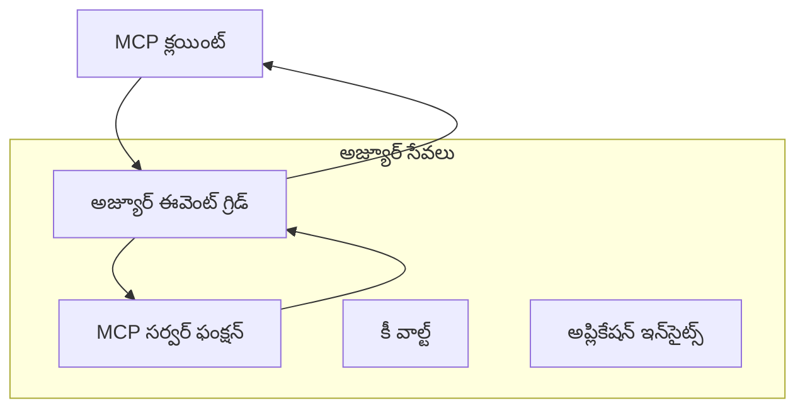
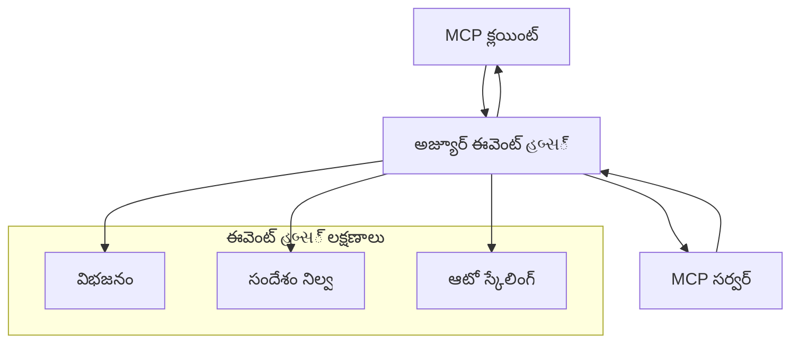

# MCP అనుకూల రవాణా - ఆధునిక అమలు మార్గదర్శకం

మోడల్ కాంటెక్స్ట్ ప్రోటోకాల్ (MCP) రవాణా మెకానిజాలలో సరళతను అందిస్తుంది, ప్రత్యేక సంస్థ పరిసరాలకు అనుకూలమైన అమలులను అనుమతిస్తుంది. ఈ అధునిక మార్గదర్శకము Azure ఈవెంట్ గ్రిడ్ మరియు Azure ఈవెంట్ హబ్‌లను ఉపయోగించి పనితీరు అభివృద్ధి కోసం అనుకూల రవాణా అమలులపై పరిశీలన చేస్తుంది, క్లౌడ్-సాధారణ MCP పరిష్కారాలను నిర్మించడానికి.

> **ఇది ముందస్తు స్మరణ:** ఈ మార్గదర్శకం **MCP స్పెసిఫికేషన్ 2025-11-25** ఆధారంగా రాయబడింది, ఇందులో సెషన్ ఆర్డరింగ్ ప్రతి సెషన్‌కు నిలుపుకోవాలి (కింద మెసేజ్ ప్రోటోకాల్ చూడండి). `2026-07-28` విడుదల అభ్యర్థి ప్రోటోకాల్ స్థాయి సెషన్‌ను పూర్తిగా తొలగించి, గేట్వేలు మరియు అనుకూల రవాణాలు ప్రతి అభ్యర్థనకు అనుగుణంగా మార్గదర్శకాలు చేయడానికి `Mcp-Method`/`Mcp-Name` హెడ్డర్లను అవసరం చేస్తుంది. [MCPలో మార్పులు: 2026-07-28 రిలీజ్ అభ్యర్థి](../../01-CoreConcepts/mcp-2026-07-28-release-candidate.md) చూడండి.

## పరిచయం

MCP యొక్క ప్రామాణిక రవాణాలు (stdio మరియు HTTP స్ట్రీమింగ్) చాలా వినియోగకేసులకు ఉపయుక్తమైనప్పటికీ, సంస్థ పరిసరాలు విస్తృత స్థాయి, విశ్వసనీయత మరియు ఉన్న క్లౌడ్ మౌలిక సదుపాయాలతో సమన্বయం కోసం ప్రత్యేక రవాణా మెకానిజాలను అవసరం చేస్తాయి. అనుకూల రవాణాలు MCPకు అసింక్రనస్ కమ్యూనికేషన్, ఈవెంట్ చలనాత్మక వేశాల మరియు విస్తృత ప్రాసెసింగ్ కోసం క్లౌడ్-సాధారణ సందేశ సేవలను వినియోగించడానికి సహాయపడతాయి.

ఈ పాఠం తాజా MCP స్పెసిఫికేషన్ (2025-11-25), Azure సందేశ సేవలు మరియు స్థాపిత సంస్థ సమన్వయ నమూనాల ఆధారంగా ఆధునిక రవాణా అమలులను పరిశీలిస్తుంది.

### **MCP రవాణా నిర్మాణం**

**MCP స్పెసిఫికేషన్ (2025-11-25) నుండి:**

- **ప్రామాణిక రవాణాలు** : stdio (సిఫార్సు), HTTP స్ట్రీమింగ్ (దూరప్రాంత సందర్భాలకు)
- **అనుకూల రవాణాలు** : MCP సందేశ మార్పిడి ప్రోటోకాల్ అమలు చేసే ఏ రవాణా
- **సందేశ ఫార్మాట్** : JSON-RPC 2.0 మరియు MCP-విశిష్ట పొడతలు
- **రెపక్ష సంభాషణ** : నోటిఫికేషన్లు మరియు ప్రతిస్పందనలకు పూర్తి డూప్లెక్స్ సంభాషణ అవసరం

## నేర్చుకోండి లక్ష్యాలు

ఈ ఆధునిక పాఠం చివరికి మీరు చేయగలరు:

- **అనుకూల రవాణా అవసరాలు అర్థం చేసుకోండి** : MCP ప్రోటోకాల్‌ను ఏ రవాణా పొరపై అమలు చేయండి, పాటించటం కొనసాగించండి
- **Azure ఈవెంట్ గ్రిడ్ రవాణాను నిర్మించండి** : సర్వర్‌లెస్ విస్తరణ కోసం ఈవెంట్-చలన MCP సర్వర్లు సృష్టించండి
- **Azure ఈవెంట్ హబ్బులు రవాణా అమలు చేయండి** : ఉన్నత ద్వారాభిమాన MCP పరిష్కారాలను రూపకల్పన చేయండి
- **ఇంటర్ప్రైజ్ నమూనాలను వర్తించండి** : అనుకూల రవాణాలను Azure మౌలిక సదుపాయాలతో సమన్వయం చేయండి
- **రవాణా విశ్వసనీయతను నిర్వహించండి** : సందేశ స్థిరత్వం, క్రమం మరియు లోప నిర్వహణ అమలు చేయండి
- **ప్రదర్శనను మెరుగుపరచండి** : విస్తరణ, ఆలస్యం, మరియు ద్వారాభిమాన అవసరాలకు అనుగుణంగా రవాణా పరిష్కారాలు రూపకల్పన చేయండి

## **రవాణా అవసరాలు**

### **MCP స్పెసిఫికేషన్ (2025-11-25) నుండి ప్రాథమిక అవసరాలు:**

```yaml
Message Protocol:
  format: "JSON-RPC 2.0 with MCP extensions"
  bidirectional: "Full duplex communication required"
  ordering: "Message ordering must be preserved per session"
  
Transport Layer:
  reliability: "Transport MUST handle connection failures gracefully"
  security: "Transport MUST support secure communication"
  identification: "Each session MUST have unique identifier"
  
Custom Transport:
  compliance: "MUST implement complete MCP message exchange"
  extensibility: "MAY add transport-specific features"
  interoperability: "MUST maintain protocol compatibility"
```

## **Azure ఈవెంట్ గ్రిడ్ రవాణా అమలు**

Azure ఈవెంట్ గ్రిడ్ ఈవెంట్-చలన MCP నిర్మాణాలకు అనుకూలమైన సర్వర్‌లెస్ ఈవెంట్ రూటింగ్ సేవని అందిస్తుంది. ఈ అమలు విస్తరించదగిన, స్వతంత్ర MCP వ్యవస్థలను నిర్మించటానికి ప్రదర్శిస్తుంది.

### **నిర్మాణం అవలోకనం**



### **C# అమలు - ఈవెంట్ గ్రిడ్ రవాణా**

```csharp
using Azure.Messaging.EventGrid;
using Microsoft.Extensions.Azure;
using System.Text.Json;

public class EventGridMcpTransport : IMcpTransport
{
    private readonly EventGridPublisherClient _publisher;
    private readonly string _topicEndpoint;
    private readonly string _clientId;
    
    public EventGridMcpTransport(string topicEndpoint, string accessKey, string clientId)
    {
        _publisher = new EventGridPublisherClient(
            new Uri(topicEndpoint), 
            new AzureKeyCredential(accessKey));
        _topicEndpoint = topicEndpoint;
        _clientId = clientId;
    }
    
    public async Task SendMessageAsync(McpMessage message)
    {
        var eventGridEvent = new EventGridEvent(
            subject: $"mcp/{_clientId}",
            eventType: "MCP.MessageReceived",
            dataVersion: "1.0",
            data: JsonSerializer.Serialize(message))
        {
            Id = Guid.NewGuid().ToString(),
            EventTime = DateTimeOffset.UtcNow
        };
        
        await _publisher.SendEventAsync(eventGridEvent);
    }
    
    public async Task<McpMessage> ReceiveMessageAsync(CancellationToken cancellationToken)
    {
        // Event Grid is push-based, so implement webhook receiver
        // This would typically be handled by Azure Functions trigger
        throw new NotImplementedException("Use EventGridTrigger in Azure Functions");
    }
}

// Azure Function for receiving Event Grid events
[FunctionName("McpEventGridReceiver")]
public async Task<IActionResult> HandleEventGridMessage(
    [EventGridTrigger] EventGridEvent eventGridEvent,
    ILogger log)
{
    try
    {
        var mcpMessage = JsonSerializer.Deserialize<McpMessage>(
            eventGridEvent.Data.ToString());
        
        // Process MCP message
        var response = await _mcpServer.ProcessMessageAsync(mcpMessage);
        
        // Send response back via Event Grid
        await _transport.SendMessageAsync(response);
        
        return new OkResult();
    }
    catch (Exception ex)
    {
        log.LogError(ex, "Error processing Event Grid MCP message");
        return new BadRequestResult();
    }
}
```

### **TypeScript అమలు - ఈవెంట్ గ్రిడ్ రవాణా**

```typescript
import { EventGridPublisherClient, AzureKeyCredential } from "@azure/eventgrid";
import { McpTransport, McpMessage } from "./mcp-types";

export class EventGridMcpTransport implements McpTransport {
    private publisher: EventGridPublisherClient;
    private clientId: string;
    
    constructor(
        private topicEndpoint: string,
        private accessKey: string,
        clientId: string
    ) {
        this.publisher = new EventGridPublisherClient(
            topicEndpoint,
            new AzureKeyCredential(accessKey)
        );
        this.clientId = clientId;
    }
    
    async sendMessage(message: McpMessage): Promise<void> {
        const event = {
            id: crypto.randomUUID(),
            source: `mcp-client-${this.clientId}`,
            type: "MCP.MessageReceived",
            time: new Date(),
            data: message
        };
        
        await this.publisher.sendEvents([event]);
    }
    
    // ఈవెంట్-ఆధారిత రిసీవ్ Azure Functions ద్వారా
    onMessage(handler: (message: McpMessage) => Promise<void>): void {
        // అమలు Azure Functions ఈవెంట్ గ్రిడ్ ట్రిగ్గర్ ఉపయోగిస్తుంది
        // ఇది webhook రిసీవర్ కోసం భావాధార పరిచయం
    }
}

// Azure Functions అమలు
import { app, InvocationContext, EventGridEvent } from "@azure/functions";

app.eventGrid("mcpEventGridHandler", {
    handler: async (event: EventGridEvent, context: InvocationContext) => {
        try {
            const mcpMessage = event.data as McpMessage;
            
            // MCP సందేశం ప్రాసెస్ చేయండి
            const response = await mcpServer.processMessage(mcpMessage);
            
            // ఈవెంట్ గ్రిడ్ ద్వారా స్పందన పంపండి
            await transport.sendMessage(response);
            
        } catch (error) {
            context.error("Error processing MCP message:", error);
            throw error;
        }
    }
});
```

### **Python అమలు - ఈవెంట్ గ్రిడ్ రవాణా**

```python
from azure.eventgrid import EventGridPublisherClient, EventGridEvent
from azure.core.credentials import AzureKeyCredential
import asyncio
import json
from typing import Callable, Optional
import uuid
from datetime import datetime

class EventGridMcpTransport:
    def __init__(self, topic_endpoint: str, access_key: str, client_id: str):
        self.client = EventGridPublisherClient(
            topic_endpoint, 
            AzureKeyCredential(access_key)
        )
        self.client_id = client_id
        self.message_handler: Optional[Callable] = None
    
    async def send_message(self, message: dict) -> None:
        """Send MCP message via Event Grid"""
        event = EventGridEvent(
            data=message,
            subject=f"mcp/{self.client_id}",
            event_type="MCP.MessageReceived",
            data_version="1.0"
        )
        
        await self.client.send(event)
    
    def on_message(self, handler: Callable[[dict], None]) -> None:
        """Register message handler for incoming events"""
        self.message_handler = handler

# అజ్యూర్ ఫంక్షన్స్ అమలు
import azure.functions as func
import logging

def main(event: func.EventGridEvent) -> None:
    """Azure Functions Event Grid trigger for MCP messages"""
    try:
        # ఈవెంట్ గ్రిడ్ ఈవెంట్ నుండి MCP సందేశాన్ని పార్స్ చేయండి
        mcp_message = json.loads(event.get_body().decode('utf-8'))
        
        # MCP సందేశాన్ని ప్రాసెస్ చేయండి
        response = process_mcp_message(mcp_message)
        
        # ఈవెంట్ గ్రిడ్ ద్వారా స్పందనను తిరిగి పంపండి
        # (అమలు కొత్త ఈవెంట్ గ్రిడ్ క్లయింట్‌ను సృష్టిస్తుంది)
        
    except Exception as e:
        logging.error(f"Error processing MCP Event Grid message: {e}")
        raise
```

## **Azure ఈవెంట్ హబ్బులు రవాణా అమలు**

Azure ఈవెంట్ హబ్బులు తక్కువ ఆలస్యం మరియు అధిక సందేశ పరిమాణం అవసరమయ్యే MCP సందర్భాలకు ఉన్నత-ద్వారాభిమాన, రియల్-టైమ్ స్ట్రీమింగ్ సామర్ధ్యాలు అందిస్తాయి.

### **నిర్మాణం అవలోకనం**



### **C# అమలు - ఈవెంట్ హబ్బులు రవాణా**

```csharp
using Azure.Messaging.EventHubs;
using Azure.Messaging.EventHubs.Producer;
using Azure.Messaging.EventHubs.Consumer;
using System.Text;

public class EventHubsMcpTransport : IMcpTransport, IDisposable
{
    private readonly EventHubProducerClient _producer;
    private readonly EventHubConsumerClient _consumer;
    private readonly string _consumerGroup;
    private readonly CancellationTokenSource _cancellationTokenSource;
    
    public EventHubsMcpTransport(
        string connectionString, 
        string eventHubName,
        string consumerGroup = "$Default")
    {
        _producer = new EventHubProducerClient(connectionString, eventHubName);
        _consumer = new EventHubConsumerClient(
            consumerGroup, 
            connectionString, 
            eventHubName);
        _consumerGroup = consumerGroup;
        _cancellationTokenSource = new CancellationTokenSource();
    }
    
    public async Task SendMessageAsync(McpMessage message)
    {
        var messageBody = JsonSerializer.Serialize(message);
        var eventData = new EventData(Encoding.UTF8.GetBytes(messageBody));
        
        // Add MCP-specific properties
        eventData.Properties.Add("MessageType", message.Method ?? "response");
        eventData.Properties.Add("MessageId", message.Id);
        eventData.Properties.Add("Timestamp", DateTimeOffset.UtcNow);
        
        await _producer.SendAsync(new[] { eventData });
    }
    
    public async Task StartReceivingAsync(
        Func<McpMessage, Task> messageHandler)
    {
        await foreach (PartitionEvent partitionEvent in _consumer.ReadEventsAsync(
            _cancellationTokenSource.Token))
        {
            try
            {
                var messageBody = Encoding.UTF8.GetString(
                    partitionEvent.Data.EventBody.ToArray());
                var mcpMessage = JsonSerializer.Deserialize<McpMessage>(messageBody);
                
                await messageHandler(mcpMessage);
            }
            catch (Exception ex)
            {
                // Handle deserialization or processing errors
                Console.WriteLine($"Error processing message: {ex.Message}");
            }
        }
    }
    
    public void Dispose()
    {
        _cancellationTokenSource?.Cancel();
        _producer?.DisposeAsync().AsTask().Wait();
        _consumer?.DisposeAsync().AsTask().Wait();
        _cancellationTokenSource?.Dispose();
    }
}
```

### **TypeScript అమలు - ఈవెంట్ హబ్బులు రవాణా**

```typescript
import { 
    EventHubProducerClient, 
    EventHubConsumerClient, 
    EventData 
} from "@azure/event-hubs";

export class EventHubsMcpTransport implements McpTransport {
    private producer: EventHubProducerClient;
    private consumer: EventHubConsumerClient;
    private isReceiving = false;
    
    constructor(
        private connectionString: string,
        private eventHubName: string,
        private consumerGroup: string = "$Default"
    ) {
        this.producer = new EventHubProducerClient(
            connectionString, 
            eventHubName
        );
        this.consumer = new EventHubConsumerClient(
            consumerGroup,
            connectionString,
            eventHubName
        );
    }
    
    async sendMessage(message: McpMessage): Promise<void> {
        const eventData: EventData = {
            body: JSON.stringify(message),
            properties: {
                messageType: message.method || "response",
                messageId: message.id,
                timestamp: new Date().toISOString()
            }
        };
        
        await this.producer.sendBatch([eventData]);
    }
    
    async startReceiving(
        messageHandler: (message: McpMessage) => Promise<void>
    ): Promise<void> {
        if (this.isReceiving) return;
        
        this.isReceiving = true;
        
        const subscription = this.consumer.subscribe({
            processEvents: async (events, context) => {
                for (const event of events) {
                    try {
                        const messageBody = event.body as string;
                        const mcpMessage: McpMessage = JSON.parse(messageBody);
                        
                        await messageHandler(mcpMessage);
                        
                        // కనీసం ఒకసారి డెలివరీ కోసం చెక్పాయింట్‌ను నవీకరించండి
                        await context.updateCheckpoint(event);
                    } catch (error) {
                        console.error("Error processing Event Hubs message:", error);
                    }
                }
            },
            processError: async (err, context) => {
                console.error("Event Hubs error:", err);
            }
        });
    }
    
    async close(): Promise<void> {
        this.isReceiving = false;
        await this.producer.close();
        await this.consumer.close();
    }
}
```

### **Python అమలు - ఈవెంట్ హబ్బులు రవాణా**

```python
from azure.eventhub import EventHubProducerClient, EventHubConsumerClient
from azure.eventhub import EventData
import json
import asyncio
from typing import Callable, Dict, Any
import logging

class EventHubsMcpTransport:
    def __init__(
        self, 
        connection_string: str, 
        eventhub_name: str,
        consumer_group: str = "$Default"
    ):
        self.producer = EventHubProducerClient.from_connection_string(
            connection_string, 
            eventhub_name=eventhub_name
        )
        self.consumer = EventHubConsumerClient.from_connection_string(
            connection_string,
            consumer_group=consumer_group,
            eventhub_name=eventhub_name
        )
        self.is_receiving = False
    
    async def send_message(self, message: Dict[str, Any]) -> None:
        """Send MCP message via Event Hubs"""
        event_data = EventData(json.dumps(message))
        
        # MCP-స్పెసిఫిక్ గుణాలను జోడించండి
        event_data.properties = {
            "messageType": message.get("method", "response"),
            "messageId": message.get("id"),
            "timestamp": "2025-01-14T10:30:00Z"  # వాస్తవ టైమ్‌స్టాంప్ ఉపయోగించండి
        }
        
        async with self.producer:
            event_data_batch = await self.producer.create_batch()
            event_data_batch.add(event_data)
            await self.producer.send_batch(event_data_batch)
    
    async def start_receiving(
        self, 
        message_handler: Callable[[Dict[str, Any]], None]
    ) -> None:
        """Start receiving MCP messages from Event Hubs"""
        if self.is_receiving:
            return
        
        self.is_receiving = True
        
        async with self.consumer:
            await self.consumer.receive(
                on_event=self._on_event_received(message_handler),
                starting_position="-1"  # ప్రారంభం నుండి మొదలు పెట్టండి
            )
    
    def _on_event_received(self, handler: Callable):
        """Internal event handler wrapper"""
        async def handle_event(partition_context, event):
            try:
                # ఈవెంట్ హబ్స్ ఈవెంట్ నుండి MCP సందేశాన్ని పార్స్ చేయండి
                message_body = event.body_as_str(encoding='UTF-8')
                mcp_message = json.loads(message_body)
                
                # MCP సందేశాన్ని 프로సెస్ చేయండి
                await handler(mcp_message)
                
                # కనీసం ఒకసారి డెలివరీ కోసం చెక్పాయింట్ ని నవీకరించండి
                await partition_context.update_checkpoint(event)
                
            except Exception as e:
                logging.error(f"Error processing Event Hubs message: {e}")
        
        return handle_event
    
    async def close(self) -> None:
        """Clean up transport resources"""
        self.is_receiving = False
        await self.producer.close()
        await self.consumer.close()
```

## **ఆధునిక రవాణా నమూనాలు**

### **సందేశ స్థిరత్వం మరియు విశ్వసనీయత**

```csharp
// Implementing message durability with retry logic
public class ReliableTransportWrapper : IMcpTransport
{
    private readonly IMcpTransport _innerTransport;
    private readonly RetryPolicy _retryPolicy;
    
    public async Task SendMessageAsync(McpMessage message)
    {
        await _retryPolicy.ExecuteAsync(async () =>
        {
            try
            {
                await _innerTransport.SendMessageAsync(message);
            }
            catch (TransportException ex) when (ex.IsRetryable)
            {
                // Log and retry
                throw;
            }
        });
    }
}
```

### **రవాణా భద్రత సమన్వయం**

```csharp
// Integrating Azure Key Vault for transport security
public class SecureTransportFactory
{
    private readonly SecretClient _keyVaultClient;
    
    public async Task<IMcpTransport> CreateEventGridTransportAsync()
    {
        var accessKey = await _keyVaultClient.GetSecretAsync("EventGridAccessKey");
        var topicEndpoint = await _keyVaultClient.GetSecretAsync("EventGridTopic");
        
        return new EventGridMcpTransport(
            topicEndpoint.Value.Value,
            accessKey.Value.Value,
            Environment.MachineName
        );
    }
}
```

### **రవాణా మానిటరింగ్ మరియు పర్యవేక్షణ**

```csharp
// Adding telemetry to custom transports
public class ObservableTransport : IMcpTransport
{
    private readonly IMcpTransport _transport;
    private readonly ILogger _logger;
    private readonly TelemetryClient _telemetryClient;
    
    public async Task SendMessageAsync(McpMessage message)
    {
        using var activity = Activity.StartActivity("MCP.Transport.Send");
        activity?.SetTag("transport.type", "EventGrid");
        activity?.SetTag("message.method", message.Method);
        
        var stopwatch = Stopwatch.StartNew();
        
        try
        {
            await _transport.SendMessageAsync(message);
            
            _telemetryClient.TrackDependency(
                "EventGrid",
                "SendMessage",
                DateTime.UtcNow.Subtract(stopwatch.Elapsed),
                stopwatch.Elapsed,
                true
            );
        }
        catch (Exception ex)
        {
            _telemetryClient.TrackException(ex);
            throw;
        }
    }
}
```

## **సంస్థ సమన్వయ పరిసరాలను**

### **సందర్భం 1: పంపిణీ చేసిన MCP ప్రాసెసింగ్**

Azure ఈవెంట్ గ్రిడ్ ఉపయోగించి MCP అభ్యర్థనలను బహుళ ప్రాసెసింగ్ నోడ్లకు పంపిణీ చేయడం:

```yaml
Architecture:
  - MCP Client sends requests to Event Grid topic
  - Multiple Azure Functions subscribe to process different tool types
  - Results aggregated and returned via separate response topic
  
Benefits:
  - Horizontal scaling based on message volume
  - Fault tolerance through redundant processors
  - Cost optimization with serverless compute
```

### **సందర్భం 2: రియల్-టైమ్ MCP స్ట్రీమింగ్**

Azure ఈవెంట్ హబ్బులు ఉపయోగించి అధిక-ఫ్రీక్వెన్సీ MCP చెలామణులు:

```yaml
Architecture:
  - MCP Client streams continuous requests via Event Hubs
  - Stream Analytics processes and routes messages
  - Multiple consumers handle different aspect of processing
  
Benefits:
  - Low latency for real-time scenarios
  - High throughput for batch processing
  - Built-in partitioning for parallel processing
```

### **సందర్భం 3: హైబ్రిడ్ రవాణా నిర్మాణం**

వివిధ వినియోగాల కోసం బహుళ రవాణాలను కలపడం:

```csharp
public class HybridMcpTransport : IMcpTransport
{
    private readonly IMcpTransport _realtimeTransport; // Event Hubs
    private readonly IMcpTransport _batchTransport;    // Event Grid
    private readonly IMcpTransport _fallbackTransport; // HTTP Streaming
    
    public async Task SendMessageAsync(McpMessage message)
    {
        // Route based on message characteristics
        var transport = message.Method switch
        {
            "tools/call" when IsRealtime(message) => _realtimeTransport,
            "resources/read" when IsBatch(message) => _batchTransport,
            _ => _fallbackTransport
        };
        
        await transport.SendMessageAsync(message);
    }
}
```

## **ప్రదర్శన tốiర్చు**

### **ఈవెంట్ గ్రిడ్ కోసం సందేశ బ్యాచింగ్**

```csharp
public class BatchingEventGridTransport : IMcpTransport
{
    private readonly List<McpMessage> _messageBuffer = new();
    private readonly Timer _flushTimer;
    private const int MaxBatchSize = 100;
    
    public async Task SendMessageAsync(McpMessage message)
    {
        lock (_messageBuffer)
        {
            _messageBuffer.Add(message);
            
            if (_messageBuffer.Count >= MaxBatchSize)
            {
                _ = Task.Run(FlushMessages);
            }
        }
    }
    
    private async Task FlushMessages()
    {
        List<McpMessage> toSend;
        lock (_messageBuffer)
        {
            toSend = new List<McpMessage>(_messageBuffer);
            _messageBuffer.Clear();
        }
        
        if (toSend.Any())
        {
            var events = toSend.Select(CreateEventGridEvent);
            await _publisher.SendEventsAsync(events);
        }
    }
}
```

### **ఈవెంట్ హబ్బులకు విభజన వ్యూహం**

```csharp
public class PartitionedEventHubsTransport : IMcpTransport
{
    public async Task SendMessageAsync(McpMessage message)
    {
        // Partition by client ID for session affinity
        var partitionKey = ExtractClientId(message);
        
        var eventData = new EventData(JsonSerializer.SerializeToUtf8Bytes(message))
        {
            PartitionKey = partitionKey
        };
        
        await _producer.SendAsync(new[] { eventData });
    }
}
```

## **అనుకూల రవాణాలు పరీక్షించటం**

### **టెస్ట్ డబుల్స్‌తో యూనిట్ టెస్టింగ్**

```csharp
[Test]
public async Task EventGridTransport_SendMessage_PublishesCorrectEvent()
{
    // Arrange
    var mockPublisher = new Mock<EventGridPublisherClient>();
    var transport = new EventGridMcpTransport(mockPublisher.Object);
    var message = new McpMessage { Method = "tools/list", Id = "test-123" };
    
    // Act
    await transport.SendMessageAsync(message);
    
    // Assert
    mockPublisher.Verify(
        x => x.SendEventAsync(
            It.Is<EventGridEvent>(e => 
                e.EventType == "MCP.MessageReceived" &&
                e.Subject == "mcp/test-client"
            )
        ),
        Times.Once
    );
}
```

### **Azure టెస్ట్ కంటైనర్లతో సమన్వయ పరీక్షలు**

```csharp
[Test]
public async Task EventHubsTransport_IntegrationTest()
{
    // Using Testcontainers for integration testing
    var eventHubsContainer = new EventHubsContainer()
        .WithEventHub("test-hub");
    
    await eventHubsContainer.StartAsync();
    
    var transport = new EventHubsMcpTransport(
        eventHubsContainer.GetConnectionString(),
        "test-hub"
    );
    
    // Test message round-trip
    var sentMessage = new McpMessage { Method = "test", Id = "123" };
    McpMessage receivedMessage = null;
    
    await transport.StartReceivingAsync(msg => {
        receivedMessage = msg;
        return Task.CompletedTask;
    });
    
    await transport.SendMessageAsync(sentMessage);
    await Task.Delay(1000); // Allow for message processing
    
    Assert.That(receivedMessage?.Id, Is.EqualTo("123"));
}
```

## **ఉత్తమ ఆచరణలు మరియు మార్గదర్శకాలు**

### **రవాణా రూపకల్పన సూత్రాలు**

1. **ఐడంపోటెన్సీ** : ప్రతిసారి సందేశ ప్రాసెసింగ్‌లో డూప్లికేట్ లను నిర్వహించేటట్లుగా ఉండాలి
2. **లోప నిర్వహణ** : సమగ్రమైన లోప నిర్వహణ మరియు డెడ్ లెటర్ క్యూలను అమలు చేయండి
3. **మానిటరింగ్** : వివరమైన టెలిమెట్రి మరియు ఆరోగ్య తనిఖీలను చేర్చండి
4. **భద్రత** : నిర్వహిత ఐడెంటిటీలను మరియు కనీస అంకిత్దాత దిశానిర్దేశాలను ఉపయోగించండి
5. **పనితీరు** : మీ నిర్దిష్ట ఆలస్యం మరియు ద్వారాభిమాన అవసరాలకు అనుగుణంగా రూపకల్పన చేయండి

### **Azure-విశేష సూచనలు**

1. **నిర్వహిత ఐడెంటిటీ ఉపయోగించండి** : ఉత్పత్తిలో కనెక్షన్ స్ట్రింగ్‌లను నివారించండి
2. **సర్క్యూట్ బ్రేకర్లు అమలు చేయండి** : Azure సేవ ఆటంకాల నుండి రక్షించండి
3. **ఖర్చులను పర్యవేక్షించండి** : సందేశ పరిమాణం మరియు ప్రాసెసింగ్ ఖర్చులను ట్రాక్ చేయండి
4. **విస్తరణ కోసం ప్రణాళికా రూపొందించండి** : తొలుత విభజన మరియు స్కేలింగ్ వ్యూహాలను రూపొందించండి
5. **పూర్తిగా పరీక్షించండి** : Azure DevTest ల్యాబ్స్ ద్వారా సమగ్రమైన పరీక్ష నిర్వహించండి

## **సంక్షిప్తం**

అనుకూల MCP రవాణాలు Azure సందేశ సేవలను ఉపయోగించి శక్తివంతమైన సంస్థ పరిపరిష్కారాలను సాధించడానికి సహాయపడతాయి. ఈవెంట్ గ్రిడ్ లేదా ఈవెంట్ హబ్బులు రవాణాలను అమలు చేయడం ద్వారా, మీరు విస్తరించదగిన, విశ్వసనీయ MCP పరిష్కారాలను నిర్మించవచ్చు, అవి ఉన్న Azure మౌలిక సదుపాయాలతో సజావుగా సమన్వయితం అవుతాయి.

అందించిన ఉదాహరణలు అనుకూల రవాణాలు MCP ప్రోటోకాల్ అనుగుణతను మరియు Azure ఉత్తమ ఆచరణలను పాటిస్తూ ఉత్పత్తి-సిద్ధ నమూనాలను చూపుతాయి.

## **అదనపు వనరులు**

- [MCP స్పెసిఫికేషన్ 2025-11-25](https://modelcontextprotocol.io/specification/2025-11-25/)
- [Azure ఈవెంట్ గ్రిడ్ డాక్యుమెంటేషన్](https://docs.microsoft.com/azure/event-grid/)
- [Azure ఈవెంట్ హబ్బులు డాక్యుమెంటేషన్](https://docs.microsoft.com/azure/event-hubs/)
- [Azure ఫంక్షన్ ఈవెంట్ గ్రిడ్ ట్రిగ్గర్](https://docs.microsoft.com/azure/azure-functions/functions-bindings-event-grid)
- [Azure SDK .NET కోసం](https://github.com/Azure/azure-sdk-for-net)
- [Azure SDK TypeScript కోసం](https://github.com/Azure/azure-sdk-for-js)
- [Azure SDK Python కోసం](https://github.com/Azure/azure-sdk-for-python)

---

> *ఈ మార్గదర్శకం ఉత్పత్తి MCP వ్యవస్థల కోసం ప్రాక్టికల్ అమలు నమూనాలపై దృష్టి పెట్టుకుంది. ఎప్పుడూ మీ నిర్దిష్ట అవసరాలు మరియు Azure సేవ మితులతో రవాణా అమలులను ధృవీకరించండి.*
> **ప్రస్తుత ప్రామాణికం** : ఈ మార్గదర్శకం [MCP స్పెసిఫికేషన్ 2025-11-25](https://modelcontextprotocol.io/specification/2025-11-25/) రవాణా అవసరాలు మరియు సంస్థ పరిమాణ పరిసరాల కోసం ఆధునిక రవాణా నమూనాలను ప్రతిబింబిస్తుంది.


## తదుపరి ఏమిటి
- [6. కమ్యూనిటీ కాంట్రిబ్యూషన్లు](../../06-CommunityContributions/README.md)

---

<!-- CO-OP TRANSLATOR DISCLAIMER START -->
**అస్వీకరణ**:
ఈ పత్రం AI అనువాద సేవ [Co-op Translator](https://github.com/Azure/co-op-translator) ఉపయోగించి అనువదించబడింది. మేము ఖచ్చితత్వానికి ప్రయత్నిస్తున్నప్పటికీ, ఆటోమేటెడ్ అనువాదాలు తప్పులు లేదా అసమగ్రతలను కలిగి ఉండవచ్చు. దాని స్వదేశ భాషలో ఉన్న అసలు పత్రాన్ని అధికారం కలిగిన మూలంగా పరిగణించాలి. కీలకమైన సమాచారం కోసం, ప్రొఫెషనల్ మానవ అనువాదాన్ని సిఫారసు చేస్తాము. ఈ అనువాదం ఉపయోగం వల్ల కలిగే ఏవైనా అపార్థాలు లేదా తప్పుదారులు కోసం మేము బాధ్యత వహించము.
<!-- CO-OP TRANSLATOR DISCLAIMER END -->