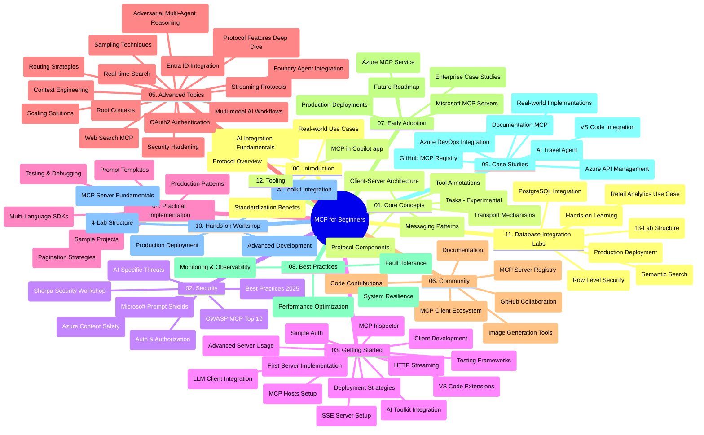

# ప్రారంభకర్తల కోసం మోడ్‌ల్ కాంటెక్స్ట్ ప్రోటోకాల్ (MCP) - అధ్యయన గైడ్

ఈ అధ్యయన గైడ్ "ప్రారంభకర్తల కోసం మోడ్‌ల్ కాంటెక్స్ట్ ప్రోటోకాల్ (MCP)" కార్యక్రమానికి సంబంధించిన రిపాజిటరీ నిర్మాణం మరియు విషయాల అవలోకనాన్ని అందిస్తుంది. రిపాజిటరీని సమర్థవంతంగా నావిగేట్ చేయడానికి మరియు అందుబాటులో ఉన్న వనరులను ఉత్తమంగా వినియోగించుకోవడానికి ఈ గైడ్‌ను ఉపయోగించండి.

## రిపాజిటరీ అవలోకనం

మోడ్‌ల్ కాంటెక్స్ట్ ప్రోటోకాల్ (MCP) అనేది AI మోడల్స్ మరియు క్లయింట్ అప్లికేషన్ల మధ్య పరస్పర చర్యల కోసం ఒక ప్రమాణీకృత ఫ్రేమ్‌వర్క్. తొలుత Anthropic ద్వారా సృష్టించబడిన MCP ను ఇప్పుడు అధికారిక GitHub సంస్థ ద్వారా విస్తృత MCP కమ్యూనిటీ నిర్వహిస్తుంది. ఈ రిపాజిటరీ AI డెవలపర్లు, సిస్టమ్ ఆర్కిటెక్ట్లు మరియు సాఫ్ట్వేర్ ఇంజనీర్ల కోసం రూపొందించిన C#, Java, JavaScript, Python, మరియు TypeScript లో హ్యాండ్స్-ఆన్ కోడ్ ఉదాహరణలతో సమగ్రమైన పాఠ్యक्रमాన్ని అందిస్తుంది.

## దృష్టాంత పాఠ్య క్రమం మ్యాప్

## రిపాజిటరీ నిర్మాణం

రిపాజిటరీను పన్నెండు ప్రధాన విభాగాలుగా విభజించారు, ప్రతి ఒక్కటి MCP యొక్క వేర్వేరు అంశాలపై దృష్టి పెట్టింది:

1. **పరిచయం (00-Introduction/)**
   - మోడ్‌ల్ కాంటెక్స్ట్ ప్రోటోకాల్ యొక్క అవలోకనం
   - AI పైప్లైన్లలో ప్రమాణీకరణ కారణాలు
   - వాస్తవ ఉపయో​గాల మరియు లాభాలు

2. **మూల భావనలు (01-CoreConcepts/)**
   - క్లయింట్-సర్వర్ ఆర్కిటెక్చర్
   - ప్రధాన ప్రోటోకాల్ భాగాలు
   - MCP లో సందేశ నమూనాలు
   - భవిష్యత్తుకి దృష్టి: [MCPలో మార్పులు: 2026-07-28 విడుదల అభ్యర్థి](./01-CoreConcepts/mcp-2026-07-28-release-candidate.md) — తదుపరి స్పెసిఫికేషన్ సంచికలో అణగరాలు లేని ప్రోటోకాల్ కోర్, విస్తరణల ఫ్రేమ్‌వర్క్, మరియు Roots/Sampling/Logging తొలగింపులు

3. **భద్రత (02-Security/)**
   - MCP ఆధారిత వ్యవస్థల భద్రతా ముప్పులు
   - అమలు భద్రత కోసంఉత్తమ ఆచారాలు
   - ధృవీకరణ మరియు అధికారణ వ్యూహాలు
   - **వివరణాత్మక భద్రతా డాక్యుమెంటేషన్**:
     - MCP భద్రత ఉత్తమ విధానాలు 2025
     - Azure Content Safety అమలు గైడ్
     - MCP భద్రతా నియంత్రణలు మరియు సాంకేతికతలు
     - MCP ఉత్తమ ఆచారాలు త్వరిత సూచిక
   - **ప్రధాన భద్రతా అంశాలు**:
     - ప్రాంప్ట్ ఇంజెక్షన్ మరియు టూల్ విషపూరణా దాడులు
     - సెషన్ హీజాకింగ్ మరియు గందరగోళ డిప్యూటీ సమస్యలు
     - టోకెన్ పంపిణీ లోపాలు
     - అధిక అనుమతులు మరియు నిప్పనియంత్రణ
     - AI భాగాల సరఫరా గొలుసు భద్రత
     - Microsoft ప్రాంప్ట్ షీల్డ్స్ అనుసంధానం

4. **ప్రారంభం (03-GettingStarted/)**
   - పరిసరాలు ఏర్పాటు మరియు కాన్ఫిగరేషన్
   - ప్రాథమిక MCP సర్వర్లు మరియు క్లయింట్ల సృష్టి
   - ఉన్న అప్లికేషన్లతో సమ్మేళనం
   - ఇందులో విభాగాలు ఉన్నాయి:
     - మొదటి సర్వర్ అమలు
     - క్లయింట్ అభివృద్ధి
     - LLM క్లయింట్ సమ్మేళనం
     - VS కోడ్ సమ్మేళనం
     - సర్వర్-సెంట్స్ ఈవెంట్స్ (SSE) సర్వర్
     - అభివృద్ధి సర్వర్ వాడుక
     - HTTP స్ట్రీమింగ్
     - AI టూల్‌కిట్ సమ్మేళనం
     - పరీక్ష విధానాలు
     - డిప్లాయ్మెంట్ మార్గదర్శకాలు

5. **ప్రాయోగిక అమలు (04-PracticalImplementation/)**
   - వివిధ ప్రోగ్రామింగ్ భాషలతో SDK వాడకం
   - డీబగ్, పరీక్ష, మరియు ధృవీకరణ సాంకేతికతలు
   - పునర్వినియోగించగల ప్రాంప్ట్ టెంప్లేట్లు మరియు వర్క్‌ఫ్లోల రూపకల్పన
   - అమలు ఉదాహరణలతో నమూనా ప్రాజెక్టులు

6. **అధిక స్థాయి అంశాలు (05-AdvancedTopics/)**
   - కాంటెక్స్ట్ ఇంజినీరింగ్ సాంకేతికతలు
   - ఫౌండ్రి ఏజెంట్ సమ్మేళనం
   - బహు-మాధ్యమ AI వర్క్‌ఫ్లోలు 
   - OAuth2 ధృవీకరణ డెమోలు
   - రియల్-టైమ్ సెర్చ్ సామర్థ్యాలు
   - రియల్-టైమ్ స్ట్రీమింగ్
   - రూట్ కాంటెక్స్ట్ అమలు
   - రూటింగ్ వ్యూహాలు
   - శాంప్లింగ్ సాంకేతికతలు
   - స్కేలింగ్ విధానాలు
   - భద్రతా విషయాలు
   - ఎంట్రా ID భద్రత సమ్మేళనం
   - వెబ్ సెర్చ్ సమ్మేళనం
   - ప్రత్యర్థి బహుఏజెంట్ తర్కం (వాదన నమూనాలు)

7. **కమ్యూనిటీ భాగస్వామ్యాలు (06-CommunityContributions/)**
   - కోడ్ మరియు డాక్యుమెంటేషన్‌కు ఎలా సహకరించాలి
   - GitHub ద్వారా సహకారం
   - కమ్యూనిటీ ఆధారిత అభివృద్ధులు మరియు స్పందనలు
   - వివిధ MCP క్లయింట్ల వాడకం (Claude డెస్క్‌టాప్, Cline, VSCode)
   - చిత్ర ఉత్పత్తి సహా ప్రముఖ MCP సర్వర్లతో పని చేయడం

8. **ప్రారంభ ఆమోదం నుండి పాఠాలు (07-LessonsfromEarlyAdoption/)**
   - నిజమైన అమలు మరియు విజయ కథలు
   - MCP ఆధారిత పరిష్కారాల నిర్మాణం మరియు డిప్లాయ్‌మెంట్
   - పరిణామాలు మరియు భవిష్యత్ మార్గనిర్దేశకం
   - **Microsoft MCP సర్వర్ల గైడ్**: 10 తయారీకు సిద్ధమైన Microsoft MCP సర్వర్ల సమగ్రమైన గైడ్, ఇందులో:
     - Microsoft Learn Docs MCP సర్వర్
     - Azure MCP సర్వర్ (15+ ప్రత్యేక కనెక్టర్లు)
     - GitHub MCP సర్వర్
     - Azure DevOps MCP సర్వర్
     - MarkItDown MCP సర్వర్
     - SQL సర్వర్ MCP సర్వర్
     - Playwright MCP సర్వర్
     - Dev Box MCP సర్వర్
     - Microsoft Foundry MCP సర్వర్
     - Microsoft 365 ఏజెంట్స్ టూల్‌కిట్ MCP సర్వర్

9. **ఉత్తమ ఆచారాలు (08-BestPractices/)**
   - పనితీరు సవరింపు మరియు ఆప్టిమైజేషన్
   - తప్పులు సహించే MCP వ్యవస్థల రూపకల్పన
   - పరీక్ష మరియు పునరుద్ధరణ వ్యూహాలు

10. **కేస్ స్టడీలు (09-CaseStudy/)**
    - MCP సౌకర్యాలను విభిన్న పరిస్థితులలో ప్రదర్శించే **ఏడు సమగ్ర కేసు అధ్యయనాలు**:
    - **Azure AI ట్రావెల్ ఏజెంట్లు**: Azure OpenAI మరియు AI సెర్చ్ సహా బహుఏజెంట్ సమన్వయం
    - **Azure DevOps సమ్మేళనం**: YouTube డేటా నవీకరణలతో వర్క్‌ఫ్లో ప్రಕ್ರియలను ఆటోమేటింగ్
    - **రియల్-టైమ్ డాక్యుమెంటేషన్ రిట్రీవల్**: స్ట్రీమింగ్ HTTP తో Python కన్సోల్ క్లయింట్
    - **ఇంటరాక్టివ్ స్టడీ ప్లాన్ జనిరేటర్**: Chainlit వెబ్ యాప్ సంభాషణాత్మక AI తో
    - **సంపాదకలో డాక్యుమెంటేషన్**: GitHub Copilot వర్క్‌ఫ్లోలతో VS Code సమ్మేళనం
    - **Azure API మేనేజ్మెంట్**: MCP సర్వర్ సృష్టితో సంస్థ API సమ్మేళనం
    - **GitHub MCP రిజిస్ట్రీ**: ఎకోసిస్టమ్ అభివృద్ధి మరియు ఏజెంటిక్ సమ్మేళన ప్లాట్‌ఫార్మ్
    - సంస్థ సమ్మేళనం, డెవలపర్ ఉత్పాదకత, మరియు ఎకోసిస్టమ్ అభివృద్ధి వాటిని కలిగి అమలుకు ఉదాహరణలు

11. **హ్యాండ్స్-ఆన్ వర్క్‌షాప్ (10-StreamliningAIWorkflowsBuildingAnMCPServerWithAIToolkit/)**
    - MCP మరియు AI టూల్‌కిట్ కలిపిన సమగ్ర హ్యాండ్స్-ఆన్ వర్క్‌షాప్
    - AI మోడల్స్‌ను నిజ జీవిత టూల్స్‌తో కలిపే తెలివైన అప్లికేషన్ల నిర్మాణం
    - వ్యవహారిక మాడ్యూల్స్ మూలాల నుండి కస్టమ్ సర్వర్ అభివృద్ధి, మరియు తయారీ డిప్లాయ్‌మెంట్ వ్యూహాలు కవరింగ్
    - **ల్యాబ్ నిర్మాణం**:
      - ల్యాబ్ 1: MCP సర్వర్ మూలాలు
      - ల్యాబ్ 2: అధిక స్థాయి MCP సర్వర్ అభివృద్ధి
      - ల్యాబ్ 3: AI టూల్‌కిట్ సమ్మేళనం
      - ల్యాబ్ 4: తయారీ డిప్లాయ్‌మెంట్ మరియు స్కేలింగ్
    - దశలవారీగా సూచనలతో ల్యాబ్ ఆధారిత అభ్యాసం

12. **MCP సర్వర్ డేటాబేస్ సమ్మేళనం ల్యాబ్స్ (11-MCPServerHandsOnLabs/)**
    - తయారీ-సిద్ధమైన MCP సర్వర్లను PostgreSQL సమ్మేళనంతో నిర్మించడానికి సమగ్ర 13-ల్యాబ్ అభ్యాస మార్గం
    - Zava రిటైల్ ఉపయోగ కేసుతో నిజ ప్రపంచ రిటైల్ విశ్లేషణ అమలు
    - రో లెవల్ సెక్యూరిటీ (RLS), సేమాంటిక్ సెర్చ్, మరియు బహు-టెనెంట్ డేటా యాక్సెస్ వంటి సంస్థ ప్రమాణాల నమూనాలు
    - **పూర్తి ల్యాబ్ నిర్మాణం**:
      - **ల్యాబ్స్ 00-03: పునాదులు** - పరిచయం, ఆర్కిటెక్చర్, భద్రత, పరిసర సెటప్
      - **ల్యాబ్స్ 04-06: MCP సర్వర్ నిర్మాణం** - డేటాబేస్ డిజైన్, MCP సర్వర్ అమలు, టూల్ అభివృద్ధి
      - **ల్యాబ్స్ 07-09: అధిక ఫీచర్లు** - సేమాంటిక్ సెర్చ్, పరీక్ష & డీబగ్, VS కోడ్ సమ్మేళనం
      - **ల్యాబ్స్ 10-12: తయారీ & ఉత్తమ ఆచారాలు** - డిప్లాయ్‌మెంట్, మానిటరింగ్, ఆప్టిమైజేషన్
    - **కవర్ చేసిన సాంకేతికతలు**: FastMCP ఫ్రేమ్‌వర్క్, PostgreSQL, Azure OpenAI, Azure కంటైనర్ అప్స్, అప్లికేషన్ ఇన్సైట్స్
    - **అభ్యాస ఫలితాలు**: తయారీ-సిద్ధమైన MCP సర్వర్లు, డేటాబేస్ సమ్మేళన నమూనాలు, AI-శక్తివంతమైన విశ్లేషణ, సంస్థ భద్రత

13. **టూలింగ్ (12-tooling/)**
    - MCP ను Copilot యాప్ మరియు ఇతర టూల్స్ లో ఎలా వాడాలో నేర్చుకోండి

## అదనపు వనరులు

రిపాజిటరీ సహాయక వనరులను కలిగి ఉంది:

- **Images ఫోల్డర్**: పాఠ్యక్రమంలో ఉపయోగించే చిత్రాలు మరియు వివరణలు
- **అనువాదాలు**: డాక్యుమెంటేషన్ యొక్క బహుభాషా ఆటోమేటెడ్ అనువాదములతో మద్దతు
- **అధికారిక MCP వనరులు**:
  - [MCP డాక్యుమెంటేషన్](https://modelcontextprotocol.io/)
  - [MCP స్పెసిఫికేషన్](https://spec.modelcontextprotocol.io/)
  - [MCP GitHub రిపాజిటరీ](https://github.com/modelcontextprotocol)

## ఈ రిపాజిటరీను ఎలా ఉపయోగించాలి

1. **ఆమోదనీయమైన నేర్చుకోవడం**: సంకల్పిత అభ్యాస అనుభవం కోసం అధ్యాయాలు వరుసగా (00 నుండి 11 వరకు) అనుసరించండి.
2. **భాష-ప్రత్యేక దృష్టి**: మీరు ప్రత్యేక ప్రోగ్రామింగ్ భాషలో ఆసక్తి ఉంటే, మీ ప్రాధాన్యత భాషలో అమలులకు నమూనా ఫోల్డర్‌లను అన్వేషించండి.
3. **ప్రతి యోగ్యమైన అమలు**: మీ పరిసరాలను సెటప్ చేసి మొదటి MCP సర్వర్ మరియు క్లయింట్‌ను సృష్టించడానికి "ప్రారంభం" విభాగంతో మొదలుపెట్టండి.
4. **అధిక స్థాయి అన్వేషణ**: ప్రాథమికాలను బాగా అర్థం చేసుకున్న తర్వాత, మీ జ్ఞానాన్ని విస్తరించేందుకు అధిక స్థాయి అంశాలకు దిగండి.
5. **కమ్యూనిటీ పాలుపంచుకోవడం**: నిపుణులు మరియు సహ డెవలపర్లతో కలవడానికి GitHub చర్చలు మరియు Discord ఛానెల్‌ల ద్వారా MCP కమ్యూనిటీలో చేరండి.

## MCP క్లయింట్లు మరియు టూల్స్

పాఠ్యక్రమం వివిధ MCP క్లయింట్లు మరియు టూల్స్ ను కవర్ చేస్తుంది:

1. **అధికారిక క్లయింట్లు**:
   - Visual Studio Code 
   - Visual Studio Codeలో MCP
   - Claude డెస్క్‌టాప్
   - VSCodeలో Claude 
   - Claude API

2. **కమ్యూనిటీ క్లయింట్లు**:
   - Cline (టెర్మినల్ ఆధారిత)
   - Cursor (కోడ్ ఎడిటర్)
   - ChatMCP
   - Windsurf

3. **MCP నిర్వహణ టూల్స్**:
   - MCP CLI
   - MCP మేనేజర్
   - MCP లింకర్
   - MCP రూటర్

## ప్రముఖ MCP సర్వర్లు

రిపాజిటరీ వివిధ MCP సర్వర్లను పరిచయం చేస్తుంది, వాటిలో:

1. **అధికారిక మైక్రోసాఫ్ట్ MCP సర్వర్లు**:
   - Microsoft Learn Docs MCP సర్వర్
   - Azure MCP సర్వర్ (15+ ప్రత్యేక కనెక్టర్లు)
   - GitHub MCP సర్వర్
   - Azure DevOps MCP సర్వర్
   - MarkItDown MCP సర్వర్
   - SQL సర్వర్ MCP సర్వర్
   - Playwright MCP సర్వర్
   - Dev Box MCP సర్వర్
   - Microsoft Foundry MCP సర్వర్
   - Microsoft 365 ఏజెంట్స్ టూల్‌కిట్ MCP సర్వర్

2. **అధికారిక రిఫరెన్స్ సర్వర్లు**:
   - Filesystem
   - Fetch
   - Memory
   - Sequential Thinking

3. **చిత్ర ఉత్పత్తి**:
   - Azure OpenAI DALL-E 3
   - Stable Diffusion WebUI
   - Replicate

4. **అభివృద్ధి టూల్స్**:
   - Git MCP
   - టెర్మినల్ నియంత్రణ
   - కోడ్ అసిస్టెంట్

5. **ప్రత్యేక సర్వర్లు**:
   - Salesforce
   - Microsoft Teams
   - Jira & Confluence

## సహకారం

ఈ రిపాజిటరీ కమ్యూనిటీ నుండి సహకారాలను స్వాగతిస్తుంది. MCP ఎకోసిస్టమ్‌కు సమర్థవంతంగా ఎలా సహకరించాలో గైడ్ కోసం కమ్యూనిటీ సహకారం విభాగాన్ని చూడండి.

----

*ఈ అధ్యయన గైడ్ చివరిసారిగా ఫిబ్రవరి 5, 2026 న నవీకరించబడింది, తాజా MCP స్పెసిఫికేషన్ 2025-11-25 ను ప్రతిబింబిస్తోంది మరియు ఆ తేదీ వరకు రిపాజిటరీ అవలోకనాన్ని అందిస్తుంది. ఆ తేదీ తరువాత రిపాజిటరీ విషయాలు నవీకరించబడవచ్చు.*

*సంకలనం (జూలై 2, 2026): 2026-07-28 MCP స్పెసిఫికేషన్ విడుదల అభ్యర్థి పై పాఠం [01-CoreConcepts](./01-CoreConcepts/mcp-2026-07-28-release-candidate.md) క్రింద జోడించబడింది; కొత్త స్పెసిఫికేషన్ విడుదల వరకు పాఠ్యక్రమ ఆధారం 2025-11-25 గా ఉంటుంది.*

---

<!-- CO-OP TRANSLATOR DISCLAIMER START -->
**అస్వీకరణ**:
ఈ పత్రం AI అనువాద సేవ [Co-op Translator](https://github.com/Azure/co-op-translator) ఉపయోగించి అనువదించబడింది. మేము ఖచ్చితత్వానికి ప్రయత్నిస్తున్నప్పటికీ, ఆటోమేటెడ్ అనువాదాలు తప్పులు లేదా అసమగ్రతలను కలిగి ఉండవచ్చు. దాని స్వదేశ భాషలో ఉన్న అసలు పత్రాన్ని అధికారం కలిగిన మూలంగా పరిగణించాలి. కీలకమైన సమాచారం కోసం, ప్రొఫెషనల్ మానవ అనువాదాన్ని సిఫారసు చేస్తాము. ఈ అనువాదం ఉపయోగం వల్ల కలిగే ఏవైనా అపార్థాలు లేదా తప్పుదారులు కోసం మేము బాధ్యత వహించము.
<!-- CO-OP TRANSLATOR DISCLAIMER END -->