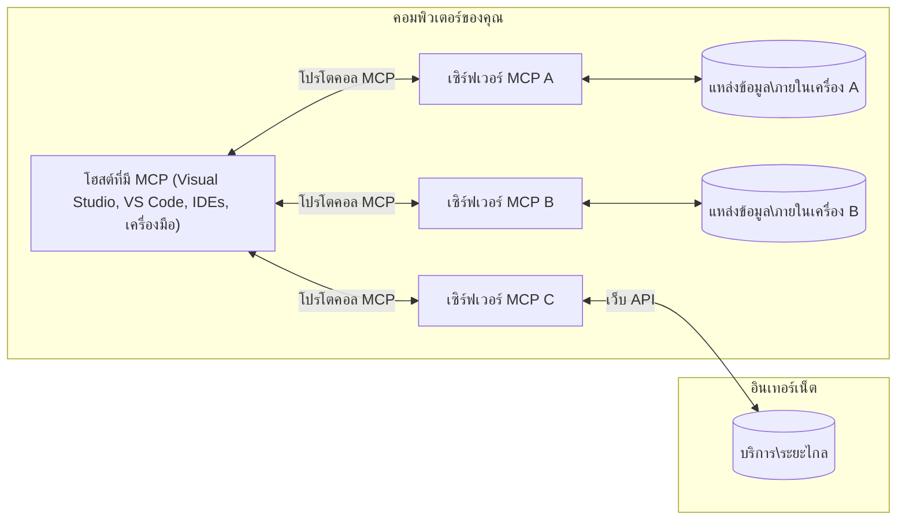

# แนวคิดแกนหลักของ MCP: การเป็นเจ้าของโปรโตคอลบริบทโมเดลสำหรับการผสานรวม AI

[](https://youtu.be/earDzWGtE84)

_(คลิกที่รูปภาพด้านบนเพื่อดูวิดีโอของบทเรียนนี้)_

[Model Context Protocol (MCP)](https://github.com/modelcontextprotocol) เป็นกรอบการทำงานมาตรฐานที่มีประสิทธิภาพซึ่งเพิ่มประสิทธิผลในการสื่อสารระหว่าง Large Language Models (LLMs) กับเครื่องมือ ภายใต้โปรแกรม และแหล่งข้อมูลภายนอก
คู่มือนี้จะนำคุณผ่านแนวคิดหลักของ MCP คุณจะได้เรียนรู้เกี่ยวกับสถาปัตยกรรมไคลเอนต์-เซิร์ฟเวอร์ ส่วนประกอบที่จำเป็น กลไกการสื่อสาร และแนวทางปฏิบัติที่ดีที่สุดในการนำไปใช้งาน

- **การยินยอมของผู้ใช้ที่ชัดเจน**: การเข้าถึงข้อมูลและการดำเนินการทั้งหมดต้องได้รับการอนุมัติจากผู้ใช้อย่างชัดเจนก่อนการดำเนินการ ผู้ใช้ต้องเข้าใจอย่างชัดเจนว่าจะเข้าถึงข้อมูลอะไรและจะดำเนินการอะไร พร้อมด้วยการควบคุมสิทธิ์และการอนุญาตอย่างละเอียด

- **การปกป้องความเป็นส่วนตัวของข้อมูล**: ข้อมูลผู้ใช้จะถูกเปิดเผยเฉพาะเมื่อได้รับความยินยอมอย่างชัดเจนและต้องได้รับการปกป้องด้วยการควบคุมการเข้าถึงที่เข้มงวดตลอดวงจรการโต้ตอบทั้งหมด การนำไปใช้งานต้องป้องกันการส่งข้อมูลโดยไม่ได้รับอนุญาตและรักษาขอบเขตความเป็นส่วนตัวอย่างเข้มงวด

- **ความปลอดภัยในการดำเนินการเครื่องมือ**: ทุกการเรียกใช้เครื่องมือต้องได้รับการยินยอมจากผู้ใช้อย่างชัดแจ้ง พร้อมความเข้าใจในฟังก์ชัน พารามิเตอร์ และผลกระทบที่อาจเกิดขึ้น ขอบเขตความปลอดภัยที่แข็งแกร่งต้องป้องกันการดำเนินการเครื่องมือที่ไม่ตั้งใจ ไม่ปลอดภัย หรือเป็นอันตราย

- **ความปลอดภัยในชั้นการขนส่ง**: ช่องทางการสื่อสารทั้งหมดควรใช้กลไกการเข้ารหัสและการยืนยันตัวตนที่เหมาะสม การเชื่อมต่อระยะไกลควรใช้โปรโตคอลการขนส่งที่ปลอดภัยและการจัดการข้อมูลประจำตัวที่เหมาะสม

#### แนวทางการนำไปใช้:

- **การจัดการสิทธิ์**: นำระบบสิทธิ์ละเอียดมาใช้ที่ช่วยให้ผู้ใช้ควบคุมเซิร์ฟเวอร์ เครื่องมือ และทรัพยากรที่เข้าถึงได้
- **การยืนยันตัวตนและการอนุมัติ**: ใช้วิธีการยืนยันตัวตนที่ปลอดภัย (OAuth, กุญแจ API) พร้อมการจัดการโทเค็นที่เหมาะสมและใช้งานหมดอายุ
- **การตรวจสอบข้อมูลเข้ามา**: ตรวจสอบพารามิเตอร์และข้อมูลเข้าทั้งหมดตามสคีมาที่กำหนดเพื่อป้องกันการโจมตีเชิงแทรกซึม
- **การบันทึกตรวจสอบ**: เก็บบันทึกการดำเนินงานทั้งหมดอย่างครบถ้วนเพื่อการตรวจสอบความปลอดภัยและการปฏิบัติตามข้อกำหนด

## ภาพรวม

บทเรียนนี้เจาะลึกสถาปัตยกรรมพื้นฐานและส่วนประกอบที่ประกอบขึ้นเป็นระบบนิเวศ Model Context Protocol (MCP) คุณจะได้เรียนรู้เกี่ยวกับสถาปัตยกรรมไคลเอนต์-เซิร์ฟเวอร์ ส่วนประกอบหลัก และกลไกการสื่อสารที่ขับเคลื่อนการโต้ตอบของ MCP

## วัตถุประสงค์การเรียนรู้หลัก

เมื่อเรียนจบบทนี้ คุณจะ:

- เข้าใจสถาปัตยกรรมไคลเอนต์-เซิร์ฟเวอร์ของ MCP
- ระบุบทบาทและความรับผิดชอบของ Hosts, Clients และ Servers
- วิเคราะห์คุณลักษณะหลักที่ทำให้ MCP เป็นชั้นผสานรวมที่ยืดหยุ่น
- เรียนรู้วิธีการไหลของข้อมูลภายในระบบนิเวศ MCP
- รับข้อมูลเชิงลึกเชิงปฏิบัติผ่านตัวอย่างโค้ดใน .NET, Java, Python, และ JavaScript

## สถาปัตยกรรม MCP: การดูรายละเอียดมากขึ้น

ระบบนิเวศ MCP สร้างบนโมเดลไคลเอนต์-เซิร์ฟเวอร์ โครงสร้างโมดูลาร์นี้ช่วยให้แอปพลิเคชัน AI สามารถโต้ตอบกับเครื่องมือ ฐานข้อมูล APIs และทรัพยากรบริบทได้อย่างมีประสิทธิภาพ มาดูส่วนประกอบหลักของสถาปัตยกรรมนี้กัน

MCP ใช้สถาปัตยกรรมไคลเอนต์-เซิร์ฟเวอร์ที่แอปพลิเคชันโฮสต์สามารถเชื่อมต่อกับเซิร์ฟเวอร์หลายตัว:



- **MCP Hosts**: โปรแกรม เช่น VSCode, Claude Desktop, IDEs หรือเครื่องมือ AI ที่ต้องการเข้าถึงข้อมูลผ่าน MCP
- **MCP Clients**: ไคลเอนต์โปรโตคอลที่รักษาการเชื่อมต่อ 1:1 กับเซิร์ฟเวอร์
- **MCP Servers**: โปรแกรมน้ำหนักเบาที่เผยแพร่ความสามารถเฉพาะผ่าน Model Context Protocol มาตรฐาน
- **แหล่งข้อมูลภายในเครื่อง**: ไฟล์ ฐานข้อมูล และบริการของคอมพิวเตอร์คุณที่เซิร์ฟเวอร์ MCP สามารถเข้าถึงได้อย่างปลอดภัย
- **บริการระยะไกล**: ระบบภายนอกที่เชื่อมต่อผ่านอินเทอร์เน็ตซึ่งเซิร์ฟเวอร์ MCP สามารถเชื่อมต่อผ่าน API

โปรโตคอล MCP เป็นมาตรฐานที่พัฒนาตามวันที่ (รูปแบบ YYYY-MM-DD) เวอร์ชันปัจจุบันคือ **2025-11-25** คุณสามารถดูการอัปเดตล่าสุดได้ที่ [ข้อกำหนดโปรโตคอล](https://modelcontextprotocol.io/specification/2025-11-25/)

> **มองไปข้างหน้า:** ตัวอย่างรุ่นปล่อยสำหรับเวอร์ชันข้อกำหนดถัดไป **2026-07-28** ได้ประกาศในเดือนพฤษภาคม 2026 และมีกำหนดส่งในวันที่ 28 กรกฎาคม 2026 ทำให้โปรโตคอลเป็นแบบ stateless ในชั้นการขนส่ง (เอาการจับมือ `initialize` และ session IDs ออก) สร้างกรอบขยาย (Extensions framework) อย่างเป็นทางการ และเลิกใช้ Roots, Sampling และ Logging เพื่อแทนที่ด้วยรูปแบบใหม่ ดูที่ [สิ่งที่จะเปลี่ยนแปลงใน MCP: ตัวอย่างรุ่นปล่อย 2026-07-28](./mcp-2026-07-28-release-candidate.md) เพื่อดูรายละเอียดทั้งหมด

### 1. Hosts

ใน Model Context Protocol (MCP) **Hosts** คือแอปพลิเคชัน AI ที่ทำหน้าที่เป็นอินเทอร์เฟซหลักสำหรับผู้ใช้โต้ตอบกับโปรโตคอล Hosts ประสานงานและจัดการการเชื่อมต่อกับเซิร์ฟเวอร์ MCP หลายตัวโดยสร้างไคลเอนต์ MCP แยกสำหรับแต่ละการเชื่อมต่อเซิร์ฟเวอร์ ตัวอย่างของ Hosts รวมถึง:

- **แอปพลิเคชัน AI**: Claude Desktop, Visual Studio Code, Claude Code
- **สภาพแวดล้อมการพัฒนา**: IDEs และตัวแก้ไขโค้ดที่รวม MCP
- **แอปพลิเคชันเฉพาะกิจ**: เอเจนต์ AI และเครื่องมือที่สร้างขึ้นโดยเฉพาะ

**Hosts** คือแอปพลิเคชันที่ประสานงานการโต้ตอบกับโมเดล AI พวกเขา:

- **การจัดการโมเดล AI**: ดำเนินการหรือโต้ตอบกับ LLMs เพื่อสร้างการตอบสนองและประสานงานเวิร์กโฟลว์ AI
- **จัดการการเชื่อมต่อไคลเอนต์**: สร้างและรักษาไคลเอนต์ MCP หนึ่งตัวต่อการเชื่อมต่อเซิร์ฟเวอร์ MCP หนึ่งตัว
- **ควบคุมอินเทอร์เฟซผู้ใช้**: จัดการกระแสการสนทนา การโต้ตอบกับผู้ใช้ และการนำเสนอการตอบสนอง
- **บังคับใช้ความปลอดภัย**: ควบคุมสิทธิ์ ข้อจำกัดด้านความปลอดภัย และการพิสูจน์ตัวตน
- **จัดการการยินยอมของผู้ใช้**: จัดการการอนุมัติของผู้ใช้สำหรับการแชร์ข้อมูลและการดำเนินการเครื่องมือ


### 2. Clients

**Clients** เป็นส่วนประกอบสำคัญที่รักษาการเชื่อมต่อเฉพาะตัวแบบหนึ่งต่อหนึ่งระหว่าง Hosts กับเซิร์ฟเวอร์ MCP ไคลเอนต์ MCP แต่ละตัวถูกสร้างโดย Host เพื่อเชื่อมต่อกับเซิร์ฟเวอร์ MCP เฉพาะตัว เพื่อให้ช่องทางการสื่อสารเป็นระเบียบและปลอดภัย การมีไคลเอนต์หลายตัวช่วยให้ Hosts สามารถเชื่อมต่อกับเซิร์ฟเวอร์หลายตัวพร้อมกันได้

**Clients** ทำหน้าที่เป็นส่วนประกอบเชื่อมต่อภายในแอปพลิเคชัน Host พวกเขา:

- **การสื่อสารโปรโตคอล**: ส่งคำขอ JSON-RPC 2.0 ไปยังเซิร์ฟเวอร์พร้อมคำกระตุ้นและคำสั่ง
- **การเจรจาความสามารถ**: เจรจาคุณลักษณะที่รองรับและเวอร์ชันโปรโตคอลกับเซิร์ฟเวอร์ขณะเริ่มต้น
- **การดำเนินการเครื่องมือ**: จัดการคำขอการดำเนินการเครื่องมือจากโมเดลและประมวลผลการตอบสนอง
- **อัปเดตเรียลไทม์**: จัดการการแจ้งเตือนและอัปเดตเรียลไทม์จากเซิร์ฟเวอร์
- **การประมวลผลการตอบสนอง**: ประมวลผลและจัดรูปแบบการตอบสนองจากเซิร์ฟเวอร์เพื่อแสดงแก่ผู้ใช้

### 3. Servers

**Servers** คือโปรแกรมที่ให้บริบท เครื่องมือ และความสามารถแก่ไคลเอนต์ MCP พวกเขาสามารถทำงานได้ทั้งในเครื่อง (เครื่องเดียวกับ Host) หรือจากระยะไกล (บนแพลตฟอร์มภายนอก) และมีหน้าที่รับคำขอจากไคลเอนต์และให้คำตอบที่มีโครงสร้าง เซิร์ฟเวอร์จะเปิดเผยฟังก์ชันเฉพาะผ่าน Model Context Protocol มาตรฐาน

**Servers** คือบริการที่ให้บริบทและความสามารถ พวกเขา:

- **การลงทะเบียนคุณลักษณะ**: ลงทะเบียนและเปิดเผย primitives ที่มี (ทรัพยากร, คำกระตุ้น, เครื่องมือ) ให้ไคลเอนต์
- **การประมวลผลคำขอ**: รับและดำเนินการเรียกเครื่องมือ คำขอทรัพยากร และคำขอคำกระตุ้นจากไคลเอนต์
- **การจัดเตรียมบริบท**: จัดหาข้อมูลบริบทและข้อมูลเพื่อเพิ่มประสิทธิภาพการตอบของโมเดล
- **การจัดการสถานะ**: รักษาสถานะเซสชันและจัดการการโต้ตอบที่ต้องเก็บสถานะเมื่อจำเป็น
- **การแจ้งเตือนเรียลไทม์**: ส่งการแจ้งเตือนเกี่ยวกับการเปลี่ยนแปลงความสามารถและอัปเดตให้กับไคลเอนต์ที่เชื่อมต่อ

เซิร์ฟเวอร์สามารถพัฒนาโดยใครก็ได้เพื่อขยายความสามารถของโมเดลด้วยฟังก์ชันเฉพาะ และรองรับการใช้งานทั้งแบบในเครื่องและระยะไกล

### 4. Server Primitives

เซิร์ฟเวอร์ใน Model Context Protocol (MCP) ให้สาม **primitives** หลักซึ่งกำหนดบล็อกพื้นฐานสำหรับการโต้ตอบที่ลึกซึ้งระหว่างไคลเอนต์ โฮสต์ และโมเดลภาษา primitives เหล่านี้ระบุชนิดของข้อมูลบริบทและการกระทำที่สามารถทำผ่านโปรโตคอลได้

เซิร์ฟเวอร์ MCP สามารถเปิดเผยผสมผสาน primitives สามตัวหลักต่อไปนี้:

#### Resources 

**Resources** คือแหล่งข้อมูลที่ให้ข้อมูลบริบทแก่แอปพลิเคชัน AI พวกมันเป็นเนื้อหาสถิตย์หรือไดนามิกที่ช่วยเพิ่มความเข้าใจและการตัดสินใจของโมเดล:

- **ข้อมูลบริบท**: ข้อมูลโครงสร้างและบริบทสำหรับการใช้ของโมเดล AI
- **ฐานความรู้**: ที่เก็บเอกสาร, บทความ, คู่มือ และเอกสารวิจัย
- **แหล่งข้อมูลภายในเครื่อง**: ไฟล์ ฐานข้อมูล และข้อมูลระบบในเครื่อง
- **ข้อมูลภายนอก**: การตอบสนอง API, บริการเว็บ และข้อมูลระบบระยะไกล
- **เนื้อหาไดนามิก**: ข้อมูลเรียลไทม์ที่อัปเดตตามสภาวะภายนอก

แหล่งข้อมูลถูกระบุด้วย URI และรองรับการค้นพบผ่านวิธี `resources/list` และดึงผ่านวิธี `resources/read`:

```text
file://documents/project-spec.md
database://production/users/schema
api://weather/current
```

#### Prompts

**Prompts** คือเทมเพลตที่ใช้ซ้ำได้เพื่อช่วยจัดโครงสร้างการโต้ตอบกับโมเดลภาษา พวกมันให้รูปแบบการโต้ตอบมาตรฐานและเวิร์กโฟลว์แบบเทมเพลต:

- **การโต้ตอบแบบเทมเพลต**: ข้อความและจุดเริ่มต้นการสนทนาที่มีโครงสร้างล่วงหน้า
- **เทมเพลตเวิร์กโฟลว์**: ลำดับมาตรฐานสำหรับงานและการโต้ตอบทั่วไป
- **ตัวอย่างแบบ few-shot**: เทมเพลตแบบใช้ตัวอย่างสำหรับคำสั่งโมเดล
- **System Prompts**: คำกระตุ้นพื้นฐานที่กำหนดพฤติกรรมและบริบทของโมเดล
- **เทมเพลตไดนามิก**: คำกระตุ้นที่มีพารามิเตอร์ซึ่งปรับตามบริบทเฉพาะ

Prompts รองรับการแทนที่ตัวแปรและสามารถค้นพบผ่านวิธี `prompts/list` และดึงด้วย `prompts/get`:

```markdown
Generate a {{task_type}} for {{product}} targeting {{audience}} with the following requirements: {{requirements}}
```

#### Tools

**Tools** คือฟังก์ชันที่สามารถดำเนินการได้ซึ่งโมเดล AI สามารถเรียกใช้เพื่อทำการกระทำเฉพาะ พวกมันเป็น "กริยา" ของระบบนิเวศ MCP ช่วยให้โมเดลโต้ตอบกับระบบภายนอก:

- **ฟังก์ชันที่สามารถดำเนินการได้**: การดำเนินการแยกต่างหากที่โมเดลสามารถเรียกด้วยพารามิเตอร์เฉพาะ
- **การผสานระบบภายนอก**: เรียก API, คำสืบค้นฐานข้อมูล, การดำเนินการไฟล์, การคำนวณ
- **ตัวตนเฉพาะ**: แต่ละเครื่องมือมีชื่อ คำอธิบาย และสคีมาพารามิเตอร์เฉพาะ
- **การรับส่งข้อมูลแบบมีโครงสร้าง**: เครื่องมือรับพารามิเตอร์ที่ผ่านการตรวจสอบและส่งคืนการตอบสนองที่มีโครงสร้างและประเภทชัดเจน
- **ความสามารถในการกระทำ**: ช่วยให้โมเดลทำงานในโลกจริงและดึงข้อมูลสดได้

เครื่องมือจะถูกกำหนดด้วย JSON Schema เพื่อการตรวจสอบพารามิเตอร์และค้นพบผ่าน `tools/list` และดำเนินการผ่าน `tools/call` เครื่องมือยังสามารถรวม **ไอคอน** เป็นเมตาดาต้าเพิ่มเติมเพื่อการนำเสนอ UI ที่ดีขึ้น

**คำอธิบายเครื่องมือ**: เครื่องมือรองรับคำอธิบายพฤติกรรม (เช่น `readOnlyHint`, `destructiveHint`) ที่บอกว่าเครื่องมือเป็นแบบอ่านอย่างเดียวหรือทำลายได้ ช่วยให้ไคลเอนต์ตัดสินใจได้ดีขึ้นเกี่ยวกับการดำเนินการเครื่องมือ

ตัวอย่างการกำหนดเครื่องมือ:

```typescript
server.tool(
  "search_products", 
  {
    query: z.string().describe("Search query for products"),
    category: z.string().optional().describe("Product category filter"),
    max_results: z.number().default(10).describe("Maximum results to return")
  }, 
  async (params) => {
    // ดำเนินการค้นหาและคืนค่าผลลัพธ์ที่มีโครงสร้าง
    return await productService.search(params);
  }
);
```

## Client Primitives

ใน Model Context Protocol (MCP), **clients** สามารถเปิดเผย primitives ที่ช่วยให้เซิร์ฟเวอร์ขอความสามารถเพิ่มเติมจากแอปพลิเคชันโฮสต์ primitives ฝั่งไคลเอนต์เหล่านี้ช่วยให้การนำไปใช้เซิร์ฟเวอร์ที่สมบูรณ์และโต้ตอบได้มากขึ้นสามารถเข้าถึงความสามารถของโมเดล AI และการโต้ตอบของผู้ใช้

### Sampling

> **ประกาศเลิกใช้งาน:** ตัวอย่างรุ่นปล่อย `2026-07-28` ระบุว่า Sampling ถูกเลิกใช้งานเพื่อเปลี่ยนเป็นการผสานรวมโดยตรงกับ API ผู้ให้บริการ LLM มันยังทำงานใน `2025-11-25` และอย่างน้อยหนึ่งปีหลังจากเลิกใช้งาน แต่การออกแบบใหม่ควรใช้รูปแบบทดแทน ดู [สิ่งที่จะเปลี่ยนแปลงใน MCP: ตัวอย่างรุ่นปล่อย 2026-07-28](./mcp-2026-07-28-release-candidate.md)

**Sampling** ช่วยให้เซิร์ฟเวอร์ขอการเติมข้อความโมเดลภาษาจากแอปพลิเคชัน AI ของไคลเอนต์ primitives นี้ช่วยให้เซิร์ฟเวอร์เข้าถึงความสามารถของ LLM โดยไม่ต้องฝังการพึ่งพาโมเดลของตัวเอง:

- **การเข้าถึงอิสระจากโมเดล**: เซิร์ฟเวอร์สามารถขอเติมข้อความโดยไม่ต้องรวม SDK LLM หรือจัดการการเข้าถึงโมเดล
- **AI ที่เซิร์ฟเวอร์เป็นผู้ริเริ่ม**: ช่วยให้เซิร์ฟเวอร์สร้างเนื้อหาอัตโนมัติด้วยโมเดล AI ของไคลเอนต์
- **การโต้ตอบ LLM แบบเรียกซ้ำ**: รองรับสถานการณ์ซับซ้อนที่เซิร์ฟเวอร์ต้องการความช่วยเหลือ AI ในการประมวลผล
- **การสร้างเนื้อหาไดนามิก**: ช่วยให้เซิร์ฟเวอร์สร้างการตอบสนองบริบทโดยใช้โมเดลของโฮสต์
- **รองรับการเรียกเครื่องมือ**: เซิร์ฟเวอร์สามารถรวมพารามิเตอร์ `tools` และ `toolChoice` เพื่อให้โมเดลไคลเอนต์เรียกใช้เครื่องมือในระหว่างการ sampling

Sampling เริ่มต้นผ่านวิธี `sampling/complete` ที่เซิร์ฟเวอร์ส่งคำขอเติมข้อความไปยังไคลเอนต์

### Roots

> **ประกาศเลิกใช้งาน:** ตัวอย่างรุ่นปล่อย `2026-07-28` ประกาศเลิกใช้ Roots เพื่อแทนที่ด้วยพารามิเตอร์เครื่องมือ URI ของทรัพยากร หรือการกำหนดค่าของเซิร์ฟเวอร์ มันยังทำงานใน `2025-11-25` และอย่างน้อยหนึ่งปีหลังการเลิกใช้งาน ดู [สิ่งที่จะเปลี่ยนแปลงใน MCP: ตัวอย่างรุ่นปล่อย 2026-07-28](./mcp-2026-07-28-release-candidate.md)

**Roots** ให้วิธีมาตรฐานสำหรับไคลเอนต์ในการเผยแพร่ขอบเขตระบบแฟ้มให้เซิร์ฟเวอร์เข้าใจว่าเซิร์ฟเวอร์สามารถเข้าถึงไดเรกทอรีและไฟล์ใดได้บ้าง:

- **ขอบเขตระบบแฟ้ม**: กำหนดขอบเขตที่เซิร์ฟเวอร์สามารถดำเนินงานในระบบแฟ้มได้
- **การควบคุมการเข้าถึง**: ช่วยให้เซิร์ฟเวอร์เข้าใจได้ว่าไดเรกทอรีและไฟล์ใดที่ได้รับอนุญาตให้เข้าถึง
- **การอัปเดตไดนามิก**: ไคลเอนต์สามารถแจ้งเซิร์ฟเวอร์เมื่อรายการ roots เปลี่ยนแปลง
- **การระบุด้วย URI**: Roots ใช้ URI `file://` เพื่อระบุไดเรกทอรีและไฟล์ที่เข้าถึงได้

Roots ค้นพบผ่านวิธี `roots/list` โดยไคลเอนต์ส่งคำแจ้ง `notifications/roots/list_changed` เมื่อ roots เปลี่ยนแปลง

### Elicitation  

**Elicitation** ช่วยให้เซิร์ฟเวอร์ร้องขอข้อมูลเพิ่มเติมหรือการยืนยันจากผู้ใช้ผ่านอินเทอร์เฟซของไคลเอนต์:

- **คำขอข้อมูลจากผู้ใช้**: เซิร์ฟเวอร์สามารถขอข้อมูลเพิ่มเติมเมื่อจำเป็นสำหรับการดำเนินการเครื่องมือ
- **หน้าต่างยืนยัน**: ขออนุมัติจากผู้ใช้สำหรับการดำเนินการที่ละเอียดอ่อนหรือมีผลกระทบ
- **เวิร์กโฟลว์โต้ตอบได้**: ช่วยให้เซิร์ฟเวอร์สร้างการโต้ตอบผู้ใช้ทีละขั้นตอน
- **การเก็บพารามิเตอร์ไดนามิก**: รวบรวมพารามิเตอร์ที่ขาดหรือไม่บังคับในระหว่างการดำเนินการเครื่องมือ

คำขอ elicitation ถูกทำโดยใช้วิธี `elicitation/request` เพื่อรวบรวมข้อมูลจากผู้ใช้ผ่านอินเทอร์เฟซของไคลเอนต์

**โหมด URL สำหรับ Elicitation**: เซิร์ฟเวอร์ยังสามารถขอการโต้ตอบผ่าน URL ช่วยให้เซิร์ฟเวอร์นำผู้ใช้ไปยังหน้าเว็บภายนอกเพื่อการพิสูจน์ตัวตน การยืนยัน หรือการป้อนข้อมูล

### Logging


> **ประกาศเลิกใช้:** ตัวอย่างรุ่นสำหรับการปล่อย `2026-07-28` ถือเป็นการเลิกใช้ Logging และแนะนำให้ใช้ `stderr` สำหรับการขนส่ง stdio และ OpenTelemetry สำหรับการสังเกตการณ์เชิงโครงสร้าง โดย Logging จะยังคงทำงานใน `2025-11-25` และอย่างน้อยหนึ่งปีหลังจากการเลิกใช้ ดูเพิ่มเติมที่ [What's Changing in MCP: The 2026-07-28 Release Candidate](./mcp-2026-07-28-release-candidate.md)

**Logging** ช่วยให้เซิร์ฟเวอร์ส่งข้อความบันทึกเชิงโครงสร้างไปยังลูกค้าเพื่อการดีบัก การตรวจสอบ และมองเห็นการดำเนินงาน:

- **สนับสนุนการดีบัก**: เปิดให้เซิร์ฟเวอร์สามารถให้บันทึกรายละเอียดการทำงานเพื่อแก้ไขปัญหา
- **ตรวจสอบการดำเนินงาน**: ส่งการอัปเดตสถานะและค่าตัวชี้วัดประสิทธิภาพไปยังลูกค้า
- **รายงานข้อผิดพลาด**: ให้บริบทข้อผิดพลาดและข้อมูลวินิจฉัยอย่างละเอียด
- **บันทึกตรวจสอบ**: สร้างบันทึกครอบคลุมของการดำเนินงานและการตัดสินใจของเซิร์ฟเวอร์

ข้อความ Logging ถูกส่งไปยังลูกค้าเพื่อให้เข้าใจการดำเนินงานของเซิร์ฟเวอร์และช่วยในการดีบัก

## การไหลของข้อมูลใน MCP

โปรโตคอล Model Context Protocol (MCP) กำหนดการไหลของข้อมูลเชิงโครงสร้างระหว่างโฮสต์ ลูกค้า เซิร์ฟเวอร์ และโมเดล การทำความเข้าใจการไหลนี้ช่วยชัดเจนว่าคำขอของผู้ใช้ถูกประมวลผลอย่างไร และเครื่องมือภายนอกและข้อมูลถูกรวมเข้ากับการตอบสนองของโมเดลอย่างไร

- **โฮสต์เริ่มการเชื่อมต่อ**  
  แอปพลิเคชันโฮสต์ (เช่น IDE หรืออินเทอร์เฟซแชท) สร้างการเชื่อมต่อกับเซิร์ฟเวอร์ MCP โดยปกติผ่าน STDIO, WebSocket หรือการขนส่งที่รองรับอื่น

- **ต่อรองความสามารถ**  
  ลูกค้า (ฝังในโฮสต์) และเซิร์ฟเวอร์แลกเปลี่ยนข้อมูลเกี่ยวกับคุณลักษณะ เครื่องมือ ทรัพยากร และเวอร์ชันของโปรโตคอลที่รองรับ เพื่อให้ทั้งสองฝ่ายเข้าใจว่ามีความสามารถใดบ้างสำหรับเซสชันนั้น

- **คำขอของผู้ใช้**  
  ผู้ใช้โต้ตอบกับโฮสต์ (เช่น ป้อนคำสั่งหรือข้อความ) โฮสต์รวบรวมอินพุตนี้และส่งต่อไปยังลูกค้าเพื่อประมวลผล

- **การใช้ทรัพยากรหรือเครื่องมือ**  
  - ลูกค้าอาจขอบริบทเพิ่มเติมหรือทรัพยากรจากเซิร์ฟเวอร์ (เช่น ไฟล์ ข้อมูลฐานข้อมูล หรือบทความในฐานความรู้) เพื่อเสริมความเข้าใจของโมเดล
  - หากโมเดลพิจารณาว่าเครื่องมือจำเป็น (เช่น เพื่อดึงข้อมูล ทำการคำนวณ หรือเรียก API) ลูกค้าจะส่งคำขอเรียกใช้เครื่องมือไปยังเซิร์ฟเวอร์ ระบุชื่อเครื่องมือและพารามิเตอร์

- **การดำเนินการของเซิร์ฟเวอร์**  
  เซิร์ฟเวอร์ได้รับคำขอทรัพยากรหรือเครื่องมือ ดำเนินการที่จำเป็น (เช่น รันฟังก์ชัน สืบค้นฐานข้อมูล หรือดึงไฟล์) และส่งผลลัพธ์กลับไปยังลูกค้าในรูปแบบเชิงโครงสร้าง

- **การสร้างการตอบสนอง**  
  ลูกค้าผนวกการตอบสนองของเซิร์ฟเวอร์ (ข้อมูลทรัพยากร ผลลัพธ์เครื่องมือ ฯลฯ) เข้ากับการโต้ตอบกับโมเดลที่กำลังดำเนินอยู่ โมเดลใช้ข้อมูลนี้เพื่อสร้างการตอบสนองที่ครอบคลุมและเหมาะสมตามบริบท

- **การนำเสนอผลลัพธ์**  
  โฮสต์รับผลลัพธ์สุดท้ายจากลูกค้าและนำเสนอแก่ผู้ใช้ โดยมักจะรวมทั้งข้อความที่โมเดลสร้างขึ้นและผลลัพธ์จากการใช้เครื่องมือหรือการค้นหาทรัพยากร

การไหลนี้ช่วยให้ MCP สนับสนุนแอปพลิเคชัน AI ที่ซับซ้อน โต้ตอบได้ และตระหนักถึงบริบทโดยการเชื่อมต่อโมเดลกับเครื่องมือและแหล่งข้อมูลภายนอกได้อย่างไร้รอยต่อ

## สถาปัตยกรรมและชั้นของโปรโตคอล

MCP ประกอบด้วยสองชั้นสถาปัตยกรรมที่แตกต่างกันที่ทำงานร่วมกันเพื่อให้กรอบการสื่อสารที่สมบูรณ์:

### ชั้นข้อมูล

ชั้น **Data Layer** ใช้โปรโตคอล MCP หลักโดยใช้ **JSON-RPC 2.0** เป็นฐาน ชั้นนี้กำหนดโครงสร้างข้อความ ความหมาย และรูปแบบการโต้ตอบ:

#### องค์ประกอบหลัก:

- **โปรโตคอล JSON-RPC 2.0**: การสื่อสารทั้งหมดใช้รูปแบบข้อความ JSON-RPC 2.0 มาตรฐานสำหรับการเรียกเมทอด การตอบกลับ และการแจ้งเตือน
- **การจัดการวงจรชีวิต**: ดูแลการเริ่มต้นการเชื่อมต่อ การต่อรองความสามารถ และการยุติการเชื่อมต่อระหว่างลูกค้าและเซิร์ฟเวอร์
- **Server Primitives**: เปิดให้เซิร์ฟเวอร์ให้ฟังก์ชันหลักผ่านเครื่องมือ ทรัพยากร และพรอมต์
- **Client Primitives**: เปิดให้เซิร์ฟเวอร์ขอการสุ่มตัวอย่างจาก LLM ดึงข้อมูลจากผู้ใช้ และส่งข้อความล็อก
- **การแจ้งเตือนเรียลไทม์**: รองรับการแจ้งเตือนแบบอะซิงโครนัสสำหรับการอัปเดตแบบไดนามิกโดยไม่ต้อง polling

#### คุณสมบัติสำคัญ:

- **การต่อรองเวอร์ชันโปรโตคอล**: ใช้การตั้งเวอร์ชันตามวันที่ (YYYY-MM-DD) เพื่อความเข้ากันได้
- **การค้นพบความสามารถ**: ลูกค้าและเซิร์ฟเวอร์แลกเปลี่ยนข้อมูลฟีเจอร์ที่รองรับในขั้นตอนเริ่มต้น
- **เซสชันที่มีสถานะ**: รักษาสถานะการเชื่อมต่อระหว่างการโต้ตอบหลายครั้งเพื่อความต่อเนื่องของบริบท

### ชั้นการขนส่ง

ชั้น **Transport Layer** จัดการช่องทางการสื่อสาร การสร้างเฟรมข้อความ และการตรวจสอบตัวตนระหว่างผู้เข้าร่วม MCP:

#### กลไกการขนส่งที่รองรับ:

1. **การขนส่ง STDIO**:
   - ใช้สตรีมอินพุต/เอาต์พุตมาตรฐานสำหรับการสื่อสารกระบวนการโดยตรง
   - เหมาะสำหรับกระบวนการในเครื่องเดียวกันโดยไม่มีต้นทุนเครือข่าย
   - มักใช้สำหรับการใช้งานเซิร์ฟเวอร์ MCP ในเครื่องท้องถิ่น

2. **การขนส่ง HTTP แบบสตรีม**:
   - ใช้ HTTP POST สำหรับข้อความจากลูกค้าไปเซิร์ฟเวอร์  
   - มีตัวเลือก Server-Sent Events (SSE) สำหรับสตรีมจากเซิร์ฟเวอร์ไปลูกค้า
   - ช่วยให้สื่อสารกับเซิร์ฟเวอร์จากระยะไกลผ่านเครือข่าย
   - รองรับการตรวจสอบตัวตน HTTP มาตรฐาน (bearer tokens, API keys, headers แบบกำหนดเอง)
   - MCP แนะนำให้ใช้ OAuth สำหรับการตรวจสอบตัวตนด้วยโทเค็นที่ปลอดภัย

#### การดึงรายละเอียดการขนส่ง:

ชั้นการขนส่งแยกรายละเอียดการสื่อสารออกจากชั้นข้อมูล ทำให้รูปแบบข้อความ JSON-RPC 2.0 เดียวกันใช้ได้กับกลไกการขนส่งทุกรูปแบบ การแยกรายละเอียดนี้ช่วยให้แอปพลิเคชันสลับระหว่างเซิร์ฟเวอร์ท้องถิ่นและระยะไกลได้อย่างราบรื่น

### ข้อควรพิจารณาด้านความปลอดภัย

การนำ MCP ไปใช้ต้องปฏิบัติตามหลักความปลอดภัยสำคัญหลายประการเพื่อให้มั่นใจว่าการโต้ตอบทั้งหมดในโปรโตคอลมีความปลอดภัย เชื่อถือได้ และปลอดภัย:

- **ความยินยอมและการควบคุมของผู้ใช้**: ผู้ใช้ต้องให้ความยินยอมอย่างชัดเจนก่อนเข้าถึงข้อมูลหรือทำการดำเนินการใด ๆ พวกเขาควรมีการควบคุมที่ชัดเจนว่าจะแชร์ข้อมูลใดและอนุญาตกิจกรรมใด โดยมีอินเทอร์เฟซที่ช่วยให้ตรวจสอบและอนุมัติกิจกรรมได้อย่างง่ายดาย

- **ความเป็นส่วนตัวของข้อมูล**: ข้อมูลของผู้ใช้ควรเปิดเผยได้เฉพาะเมื่อได้รับความยินยอมอย่างชัดเจน และต้องได้รับการปกป้องด้วยการควบคุมการเข้าถึงที่เหมาะสม การนำ MCP ไปใช้ต้องป้องกันการส่งข้อมูลโดยไม่ได้รับอนุญาตและรักษาความเป็นส่วนตัวตลอดการโต้ตอบทั้งหมด

- **ความปลอดภัยของเครื่องมือ**: ก่อนเรียกใช้เครื่องมือใด ๆ ต้องได้รับความยินยอมจากผู้ใช้อย่างชัดเจน ผู้ใช้ควรเข้าใจฟังก์ชันของแต่ละเครื่องมืออย่างชัดเจน และต้องมีการบังคับขอบเขตความปลอดภัยที่เข้มงวดเพื่อป้องกันการเรียกใช้เครื่องมือที่ไม่ตั้งใจหรือไม่ปลอดภัย

การปฏิบัติตามหลักความปลอดภัยเหล่านี้ทำให้ MCP สร้างความเชื่อมั่น ความเป็นส่วนตัว และความปลอดภัยของผู้ใช้ในทุกการโต้ตอบของโปรโตคอล ในขณะเดียวกันก็เปิดโอกาสให้เกิดการผสานรวม AI ที่ทรงพลัง

## ตัวอย่างโค้ด: องค์ประกอบหลัก

ด้านล่างนี้เป็นตัวอย่างโค้ดในหลายภาษาโปรแกรมยอดนิยมที่แสดงวิธีการใช้องค์ประกอบหลักของเซิร์ฟเวอร์ MCP และเครื่องมือ

### ตัวอย่าง .NET: การสร้างเซิร์ฟเวอร์ MCP อย่างง่ายพร้อมเครื่องมือ

ตัวอย่างโค้ด .NET ที่ใช้งานได้จริงนี้แสดงวิธีการสร้างเซิร์ฟเวอร์ MCP อย่างง่ายด้วยเครื่องมือที่กำหนดเอง ตัวอย่างนี้สาธิตวิธีการกำหนดนิยามและสมัครเครื่องมือ จัดการคำขอ และเชื่อมต่อเซิร์ฟเวอร์โดยใช้โปรโตคอล Model Context Protocol

```csharp
using System;
using System.Threading.Tasks;
using ModelContextProtocol.Server;
using ModelContextProtocol.Server.Transport;
using ModelContextProtocol.Server.Tools;

public class WeatherServer
{
    public static async Task Main(string[] args)
    {
        // Create an MCP server
        var server = new McpServer(
            name: "Weather MCP Server",
            version: "1.0.0"
        );
        
        // Register our custom weather tool
        server.AddTool<string, WeatherData>("weatherTool", 
            description: "Gets current weather for a location",
            execute: async (location) => {
                // Call weather API (simplified)
                var weatherData = await GetWeatherDataAsync(location);
                return weatherData;
            });
        
        // Connect the server using stdio transport
        var transport = new StdioServerTransport();
        await server.ConnectAsync(transport);
        
        Console.WriteLine("Weather MCP Server started");
        
        // Keep the server running until process is terminated
        await Task.Delay(-1);
    }
    
    private static async Task<WeatherData> GetWeatherDataAsync(string location)
    {
        // This would normally call a weather API
        // Simplified for demonstration
        await Task.Delay(100); // Simulate API call
        return new WeatherData { 
            Temperature = 72.5,
            Conditions = "Sunny",
            Location = location
        };
    }
}

public class WeatherData
{
    public double Temperature { get; set; }
    public string Conditions { get; set; }
    public string Location { get; set; }
}
```

### ตัวอย่าง Java: องค์ประกอบเซิร์ฟเวอร์ MCP

ตัวอย่างนี้แสดงเซิร์ฟเวอร์ MCP และการลงทะเบียนเครื่องมือเดียวกับตัวอย่าง .NET ข้างต้น แต่เขียนด้วยภาษา Java

```java
import io.modelcontextprotocol.server.McpServer;
import io.modelcontextprotocol.server.McpToolDefinition;
import io.modelcontextprotocol.server.transport.StdioServerTransport;
import io.modelcontextprotocol.server.tool.ToolExecutionContext;
import io.modelcontextprotocol.server.tool.ToolResponse;

public class WeatherMcpServer {
    public static void main(String[] args) throws Exception {
        // สร้างเซิร์ฟเวอร์ MCP
        McpServer server = McpServer.builder()
            .name("Weather MCP Server")
            .version("1.0.0")
            .build();
            
        // ลงทะเบียนเครื่องมือสภาพอากาศ
        server.registerTool(McpToolDefinition.builder("weatherTool")
            .description("Gets current weather for a location")
            .parameter("location", String.class)
            .execute((ToolExecutionContext ctx) -> {
                String location = ctx.getParameter("location", String.class);
                
                // รับข้อมูลสภาพอากาศ (แบบง่าย)
                WeatherData data = getWeatherData(location);
                
                // คืนค่าตอบกลับที่จัดรูปแบบแล้ว
                return ToolResponse.content(
                    String.format("Temperature: %.1f°F, Conditions: %s, Location: %s", 
                    data.getTemperature(), 
                    data.getConditions(), 
                    data.getLocation())
                );
            })
            .build());
        
        // เชื่อมต่อเซิร์ฟเวอร์โดยใช้การขนส่ง stdio
        try (StdioServerTransport transport = new StdioServerTransport()) {
            server.connect(transport);
            System.out.println("Weather MCP Server started");
            // รักษาเซิร์ฟเวอร์ให้อยู่ในสถานะทำงานจนกว่ากระบวนการจะถูกยุติ
            Thread.currentThread().join();
        }
    }
    
    private static WeatherData getWeatherData(String location) {
        // การใช้งานจริงจะเรียก API สภาพอากาศ
        // แบบง่ายเพื่อวัตถุประสงค์ตัวอย่าง
        return new WeatherData(72.5, "Sunny", location);
    }
}

class WeatherData {
    private double temperature;
    private String conditions;
    private String location;
    
    public WeatherData(double temperature, String conditions, String location) {
        this.temperature = temperature;
        this.conditions = conditions;
        this.location = location;
    }
    
    public double getTemperature() {
        return temperature;
    }
    
    public String getConditions() {
        return conditions;
    }
    
    public String getLocation() {
        return location;
    }
}
```

### ตัวอย่าง Python: การสร้างเซิร์ฟเวอร์ MCP

ตัวอย่างนี้ใช้ fastmcp กรุณาติดตั้งก่อน:

```python
pip install fastmcp
```
Code Sample:

```python
#!/usr/bin/env python3
import asyncio
from fastmcp import FastMCP
from fastmcp.transports.stdio import serve_stdio

# สร้างเซิร์ฟเวอร์ FastMCP
mcp = FastMCP(
    name="Weather MCP Server",
    version="1.0.0"
)

@mcp.tool()
def get_weather(location: str) -> dict:
    """Gets current weather for a location."""
    return {
        "temperature": 72.5,
        "conditions": "Sunny",
        "location": location
    }

# วิธีทางเลือกโดยใช้คลาส
class WeatherTools:
    @mcp.tool()
    def forecast(self, location: str, days: int = 1) -> dict:
        """Gets weather forecast for a location for the specified number of days."""
        return {
            "location": location,
            "forecast": [
                {"day": i+1, "temperature": 70 + i, "conditions": "Partly Cloudy"}
                for i in range(days)
            ]
        }

# ลงทะเบียนเครื่องมือคลาส
weather_tools = WeatherTools()

# เริ่มเซิร์ฟเวอร์
if __name__ == "__main__":
    asyncio.run(serve_stdio(mcp))
```

### ตัวอย่าง JavaScript: การสร้างเซิร์ฟเวอร์ MCP

ตัวอย่างนี้แสดงการสร้างเซิร์ฟเวอร์ MCP ใน JavaScript และวิธีการลงทะเบียนเครื่องมือสองอย่างเกี่ยวกับสภาพอากาศ

```javascript
// ใช้ SDK ของโปรโตคอลโมเดล Context อย่างเป็นทางการ
import { McpServer } from "@modelcontextprotocol/sdk/server/mcp.js";
import { StdioServerTransport } from "@modelcontextprotocol/sdk/server/stdio.js";
import { z } from "zod"; // สำหรับการตรวจสอบพารามิเตอร์

// สร้างเซิร์ฟเวอร์ MCP
const server = new McpServer({
  name: "Weather MCP Server",
  version: "1.0.0"
});

// กำหนดเครื่องมือสภาพอากาศ
server.tool(
  "weatherTool",
  {
    location: z.string().describe("The location to get weather for")
  },
  async ({ location }) => {
    // ปกติจะเรียกใช้ API สภาพอากาศ
    // ทำให้ง่ายขึ้นเพื่อสาธิต
    const weatherData = await getWeatherData(location);
    
    return {
      content: [
        { 
          type: "text", 
          text: `Temperature: ${weatherData.temperature}°F, Conditions: ${weatherData.conditions}, Location: ${weatherData.location}` 
        }
      ]
    };
  }
);

// กำหนดเครื่องมือพยากรณ์
server.tool(
  "forecastTool",
  {
    location: z.string(),
    days: z.number().default(3).describe("Number of days for forecast")
  },
  async ({ location, days }) => {
    // ปกติจะเรียกใช้ API สภาพอากาศ
    // ทำให้ง่ายขึ้นเพื่อสาธิต
    const forecast = await getForecastData(location, days);
    
    return {
      content: [
        { 
          type: "text", 
          text: `${days}-day forecast for ${location}: ${JSON.stringify(forecast)}` 
        }
      ]
    };
  }
);

// ฟังก์ชันช่วยเหลือ
async function getWeatherData(location) {
  // จำลองการเรียก API
  return {
    temperature: 72.5,
    conditions: "Sunny",
    location: location
  };
}

async function getForecastData(location, days) {
  // จำลองการเรียก API
  return Array.from({ length: days }, (_, i) => ({
    day: i + 1,
    temperature: 70 + Math.floor(Math.random() * 10),
    conditions: i % 2 === 0 ? "Sunny" : "Partly Cloudy"
  }));
}

// เชื่อมต่อเซิร์ฟเวอร์โดยใช้การขนส่ง stdio
const transport = new StdioServerTransport();
server.connect(transport).catch(console.error);

console.log("Weather MCP Server started");
```

ตัวอย่าง JavaScript นี้แสดงวิธีสร้างเซิร์ฟเวอร์ MCP โดยใช้ Model Context Protocol SDK แสดงการลงทะเบียนเครื่องมือสองเครื่องมือชื่อ `weatherTool` และ `forecastTool` และทำให้เครื่องมือเหล่านี้พร้อมใช้งานกับลูกค้า MCP ผ่าน `StdioServerTransport`

## ความปลอดภัยและการอนุญาต

MCP รวมแนวคิดและกลไกในตัวหลายอย่างสำหรับการจัดการความปลอดภัยและการอนุญาตตลอดโปรโตคอล:

1. **การควบคุมสิทธิ์เครื่องมือ**:  
  ลูกค้าสามารถระบุว่าโมเดลได้รับอนุญาตใช้เครื่องมือใดบ้างในระหว่างเซสชัน เพื่อให้แน่ใจว่าเครื่องมือที่เข้าถึงได้เป็นเครื่องมือที่ได้รับอนุญาตอย่างชัดเจนเท่านั้น ลดความเสี่ยงจากการดำเนินการที่ไม่ตั้งใจหรือไม่ปลอดภัย การตั้งค่าสิทธิ์สามารถทำได้แบบไดนามิกตามความชอบของผู้ใช้ นโยบายองค์กร หรือบริบทของการโต้ตอบ

2. **การตรวจสอบตัวตน**:  
  เซิร์ฟเวอร์อาจต้องการการตรวจสอบตัวตนก่อนให้สิทธิ์ในการเข้าถึงเครื่องมือ ทรัพยากร หรือการดำเนินการที่มีความละเอียดอ่อน อาจใช้คีย์ API, โทเค็น OAuth หรือระบบตรวจสอบตัวตนอื่น ๆ การตรวจสอบตัวตนที่เหมาะสมช่วยให้มั่นใจว่าเฉพาะลูกค้าและผู้ใช้ที่เชื่อถือได้เท่านั้นที่สามารถเรียกใช้ความสามารถของเซิร์ฟเวอร์ได้

3. **การตรวจสอบความถูกต้อง**:  
  มีการบังคับใช้การตรวจสอบพารามิเตอร์สำหรับการเรียกใช้เครื่องมือทุกครั้ง เครื่องมือแต่ละตัวกำหนดชนิด รูปแบบ และข้อจำกัดของพารามิเตอร์ที่คาดหวัง และเซิร์ฟเวอร์จะตรวจสอบคำขอที่เข้ามาตามนั้น เพื่อป้องกันอินพุตที่ผิดรูปแบบหรือเป็นอันตรายไม่ให้เข้าถึงการใช้งานเครื่องมือและช่วยรักษาความสมบูรณ์ของการดำเนินการ

4. **การจำกัดอัตรา**:  
  เพื่อป้องกันการใช้งานในทางที่ผิดและรักษาความยุติธรรมในการใช้ทรัพยากรเซิร์ฟเวอร์ เซิร์ฟเวอร์ MCP สามารถตั้งค่าการจำกัดอัตราการเรียกใช้เครื่องมือและการเข้าถึงทรัพยากรได้ การจำกัดอัตราสามารถกำหนดตามผู้ใช้ ตามเซสชัน หรือแบบทั่วทั้งระบบ และช่วยป้องกันการโจมตีแบบปฏิเสธการให้บริการหรือการใช้ทรัพยากรเกินความจำเป็น

โดยการผสานกลไกเหล่านี้ MCP มอบฐานความปลอดภัยสำหรับการผสานรวมโมเดลภาษาเข้ากับเครื่องมือและแหล่งข้อมูลภายนอก ในขณะที่ให้ผู้ใช้และนักพัฒนาควบคุมการเข้าถึงและการใช้งานอย่างละเอียด

## ข้อความโปรโตคอลและการไหลของการสื่อสาร

การสื่อสารของ MCP ใช้ข้อความ **JSON-RPC 2.0** เชิงโครงสร้างเพื่ออำนวยความสะดวกในการโต้ตอบที่ชัดเจนและเชื่อถือได้ระหว่างโฮสต์ ลูกค้า และเซิร์ฟเวอร์ โปรโตคอลกำหนดรูปแบบข้อความเฉพาะสำหรับการดำเนินการประเภทต่าง ๆ:

### ประเภทข้อความหลัก:

#### **ข้อความการเริ่มต้น**
- **คำขอ `initialize`**: สร้างการเชื่อมต่อและต่อรองเวอร์ชันโปรโตคอลและความสามารถ
- **การตอบกลับ `initialize`**: ยืนยันฟีเจอร์ที่รองรับและข้อมูลเซิร์ฟเวอร์  
- **`notifications/initialized`**: แจ้งว่าเริ่มต้นเสร็จสมบูรณ์และพร้อมใช้งานเซสชัน

#### **ข้อความการค้นพบ**
- **คำขอ `tools/list`**: ค้นหาเครื่องมือที่มีจากเซิร์ฟเวอร์
- **คำขอ `resources/list`**: แสดงรายการทรัพยากรที่มี (แหล่งข้อมูล)
- **คำขอ `prompts/list`**: ดึงแม่แบบพรอมต์ที่มี

#### **ข้อความการดำเนินงาน**  
- **คำขอ `tools/call`**: เรียกใช้เครื่องมือเฉพาะพร้อมพารามิเตอร์ที่ให้
- **คำขอ `resources/read`**: ดึงเนื้อหาจากทรัพยากรเฉพาะ
- **คำขอ `prompts/get`**: ดึงแม่แบบพรอมต์พร้อมพารามิเตอร์ตัวเลือก

#### **ข้อความฝั่งลูกค้า**
- **คำขอ `sampling/complete`**: เซิร์ฟเวอร์ขอการเติมข้อความจาก LLM ผ่านลูกค้า
- **คำขอ `elicitation/request`**: เซิร์ฟเวอร์ขอข้อมูลจากผู้ใช้ผ่านอินเทอร์เฟซลูกค้า
- **ข้อความ Logging**: เซิร์ฟเวอร์ส่งข้อความล็อกเชิงโครงสร้างไปยังลูกค้า

#### **ข้อความแจ้งเตือน**
- **`notifications/tools/list_changed`**: เซิร์ฟเวอร์แจ้งลูกค้าเกี่ยวกับการเปลี่ยนแปลงเครื่องมือ
- **`notifications/resources/list_changed`**: เซิร์ฟเวอร์แจ้งลูกค้าเกี่ยวกับการเปลี่ยนแปลงทรัพยากร  
- **`notifications/prompts/list_changed`**: เซิร์ฟเวอร์แจ้งลูกค้าเกี่ยวกับการเปลี่ยนแปลงพรอมต์

### โครงสร้างข้อความ:

ข้อความ MCP ทั้งหมดเป็นไปตามรูปแบบ JSON-RPC 2.0 โดย:
- **ข้อความคำขอ**: รวม `id` `method` และ `params` แบบเลือกได้
- **ข้อความตอบกลับ**: รวม `id` และ `result` หรือ `error`  
- **ข้อความแจ้งเตือน**: รวม `method` และ `params` แบบเลือกได้ (ไม่มี `id` และไม่คาดหวังการตอบกลับ)

การสื่อสารเชิงโครงสร้างนี้ทำให้มั่นใจได้ว่าการโต้ตอบเป็นไปอย่างน่าเชื่อถือ ตรวจสอบได้ และขยายได้ รองรับสถานการณ์ขั้นสูง เช่น การอัปเดตแบบเรียลไทม์ การเชื่อมต่อเครื่องมือหลายตัว และการจัดการข้อผิดพลาดที่แข็งแกร่ง

### งาน (ทดลองใช้)

> **มองไปข้างหน้า:** ตัวอย่างรุ่นสำหรับการปล่อย `2026-07-28` ย้ายฟีเจอร์ Tasks ออกจากข้อกำหนดหลักแบบทดลอง ไปยังส่วนขยาย Tasks ที่แยกต่างหากโดยมีวงจรชีวิตใหม่ (`tasks/get`, `tasks/update`, `tasks/cancel`; ลบ `tasks/list`) หากคุณพัฒนาด้วย API แบบทดลองข้างล่างนี้ ให้วางแผนการย้าย ดูเพิ่มเติมที่ [What's Changing in MCP: The 2026-07-28 Release Candidate](./mcp-2026-07-28-release-candidate.md)

**Tasks** คือฟีเจอร์ทดลองที่ให้บรรจุภัณฑ์การดำเนินงานแบบทนทาน ซึ่งช่วยให้ดึงผลลัพธ์ล่าช้าและติดตามสถานะสำหรับคำขอ MCP:

- **การดำเนินงานระยะยาว**: ติดตามการคำนวณที่ใช้เวลามาก, การทำงานอัตโนมัติแบบเวิร์กโฟลว์, และการประมวลผลชุดข้อมูล
- **ผลลัพธ์ล่าช้า**: โหวตสอบถามสถานะงานและดึงผลลัพธ์เมื่อการดำเนินงานเสร็จสมบูรณ์
- **ติดตามสถานะ**: ตรวจสอบความก้าวหน้าของงานผ่านสถานะวงจรชีวิตที่กำหนด
- **การดำเนินงานหลายขั้นตอน**: รองรับเวิร์กโฟลว์ซับซ้อนที่ครอบคลุมหลายการโต้ตอบ

งานจะห่อหุ้มคำขอ MCP มาตรฐานเพื่อสนับสนุนรูปแบบการดำเนินงานแบบอะซิงโครนัสสำหรับงานที่ไม่สามารถเสร็จได้ทันที

## ข้อสรุปสำคัญ

- **สถาปัตยกรรม**: MCP ใช้สถาปัตยกรรมแบบไคลเอนต์-เซิร์ฟเวอร์ ที่โฮสต์จัดการการเชื่อมต่อไคลเอนต์หลายรายการไปยังเซิร์ฟเวอร์
- **ผู้เข้าร่วม**: ระบบนิเวศประกอบด้วยโฮสต์ (แอป AI) ไคลเอนต์ (ตัวเชื่อมโปรโตคอล) และเซิร์ฟเวอร์ (ผู้ให้ความสามารถ)
- **กลไกการขนส่ง**: การสื่อสารรองรับ STDIO (ในเครื่อง) และ HTTP แบบสตรีมพร้อม SSE ตัวเลือก (ระยะไกล)
- **คำสั่งหลัก**: เซิร์ฟเวอร์เปิดเผยเครื่องมือ (ฟังก์ชันที่รันได้), ทรัพยากร (แหล่งข้อมูล), และพรอมต์ (แม่แบบ)
- **คำสั่งไคลเอนต์**: เซิร์ฟเวอร์สามารถร้องขอการสุ่มตัวอย่าง (เติมข้อความ LLM พร้อมการเรียกใช้เครื่องมือ), การเรียกข้อมูล (ข้อมูลผู้ใช้รวมโหมด URL), ราก (ขอบเขตระบบไฟล์), และการบันทึกจากไคลเอนต์ได้
- **ฟีเจอร์ทดลอง**: Tasks ให้บรรจุภัณฑ์การดำเนินงานที่ทนทานสำหรับงานระยะยาว
- **พื้นฐานโปรโตคอล**: สร้างบน JSON-RPC 2.0 ด้วยการตั้งเวอร์ชันตามวันที่ (ปัจจุบัน: 2025-11-25)
- **ความสามารถเรียลไทม์**: รองรับการแจ้งเตือนสำหรับการอัปเดตแบบไดนามิกและการซิงค์แบบเรียลไทม์
- **ความปลอดภัยเป็นหลักแรก**: ความยินยอมผู้ใช้ชัดเจน การปกป้องความเป็นส่วนตัว และการขนส่งที่ปลอดภัยคือข้อกำหนดหลัก

## แบบฝึกหัด

ออกแบบเครื่องมือ MCP อย่างง่ายที่มีประโยชน์ในโดเมนของคุณ กำหนด:
1. ชื่อของเครื่องมือ
2. พารามิเตอร์ที่รับ
3. ผลลัพธ์ที่ส่งกลับ
4. วิธีที่โมเดลอาจใช้เครื่องมือนี้เพื่อแก้ปัญหาของผู้ใช้


---

## ต่อไป

ถัดไป: [บทที่ 2: ความปลอดภัย](../02-Security/README.md)


อยากรู้ว่าจะมีอะไรเกิดขึ้นหลังจาก `2025-11-25` หรือไม่? อ่าน [สิ่งที่เปลี่ยนแปลงใน MCP: ตัวอย่างการเปิดตัว 2026-07-28](./mcp-2026-07-28-release-candidate.md)  

---

<!-- CO-OP TRANSLATOR DISCLAIMER START -->
**ปฏิเสธความรับผิดชอบ**:
เอกสารนี้ได้รับการแปลโดยใช้บริการแปลภาษา AI [Co-op Translator](https://github.com/Azure/co-op-translator) ขณะที่เราพยายามให้ความถูกต้อง โปรดทราบว่าการแปลโดยอัตโนมัติอาจมีข้อผิดพลาดหรือความไม่ถูกต้อง เอกสารต้นฉบับในภาษาต้นทางควรถูกพิจารณาเป็นแหล่งข้อมูลที่เชื่อถือได้ สำหรับข้อมูลที่สำคัญ แนะนำให้ใช้การแปลโดยมนุษย์มืออาชีพ เราไม่รับผิดชอบต่อความเข้าใจผิดหรือการตีความที่ผิดพลาดที่เกิดขึ้นจากการใช้การแปลนี้
<!-- CO-OP TRANSLATOR DISCLAIMER END -->