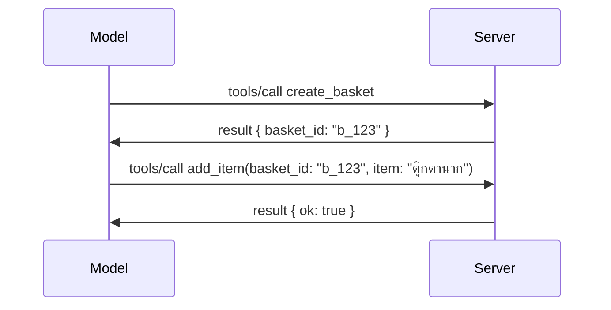

# อะไรที่เปลี่ยนแปลงใน MCP: ตัวอย่างการปล่อยเวอร์ชัน 2026-07-28

> **สถานะ:** ตัวอย่างการปล่อยเวอร์ชัน ตัวกำหนด `2026-07-28` ยังไม่เป็นฉบับสมบูรณ์ในขณะเขียน ประกาศเมื่อ 21 พฤษภาคม 2026 และมีกำหนดส่งมอบวันที่ 28 กรกฎาคม 2026 ทุกอย่างในบทเรียนนี้อธิบายถึงตัวอย่างการปล่อยเวอร์ชัน; โปรดตรวจสอบ [ร่างข้อกำหนด](https://modelcontextprotocol.io/specification/draft) และ [บันทึกการเปลี่ยนแปลง](https://modelcontextprotocol.io/specification/draft/changelog) สำหรับสถานะล่าสุดก่อนที่คุณจะพัฒนาตามเวอร์ชันนี้ ส่วนที่เหลือของหลักสูตรนี้ถูกเขียนขึ้นโดยอ้างอิงจากเวอร์ชันเสถียรปัจจุบันคือ **MCP Specification 2025-11-25** และจะได้รับการอัปเดตเมื่อ `2026-07-28` ออกใช้งาน

## ภาพรวม

`2026-07-28` คือการแก้ไข MCP ครั้งใหญ่ที่สุดตั้งแต่เปิดตัว มีข้อเสนอการปรับปรุงสเปก (SEP) หกรายการที่ยกเลิกการใช้เซสชันระดับโปรโตคอลและทำให้ MCP เป็นแบบไม่มีสถานะที่ระดับชั้นขนส่ง, ส่วนขยายกลายเป็นกลไกหลักที่มีเวอร์ชัน และฟีเจอร์หลายอย่างที่คุณได้เรียนรู้ในหลักสูตรนี้ก่อนหน้านี้ (Roots, Sampling, Logging) ถูกทำเครื่องหมายว่าเลิกใช้ภายใต้นโยบายวงจรชีวิตใหม่ บทเรียนนี้สรุปสิ่งที่เปลี่ยนแปลง เหตุใดจึงสำคัญ และหมายความว่ายังไงสำหรับโค้ดที่คุณเขียนตาม `2025-11-25` ไปแล้ว

แหล่งที่มา: [The 2026-07-28 MCP Specification Release Candidate](https://blog.modelcontextprotocol.io/posts/2026-07-28-release-candidate/) (บล็อก Model Context Protocol, David Soria Parra และ Den Delimarsky)

## วัตถุประสงค์การเรียนรู้

เมื่อจบบทเรียนนี้ คุณจะสามารถ:

- อธิบายว่าทำไม MCP ถึงเปลี่ยนไปเป็นโปรโตคอลแบบไม่มีสถานะ และปัญหาใดที่มันแก้ไขได้สำหรับการปรับขนาดระบบแบบแนวนอน
- อธิบายว่า `initialize`/`initialized` handshake และ header `Mcp-Session-Id` ถูกแทนที่อย่างไร
- ระบุ header ใหม่ `Mcp-Method` และ `Mcp-Name` รวมถึงเมตาดาต้าการแคช `ttlMs`/`cacheScope`
- ทำความเข้าใจกับโครงสร้าง Extensions และสองส่วนขยายที่จะมากับเวอร์ชันนี้: MCP Apps และ Tasks
- ระบุหก SEP ด้านการอนุญาตที่เพิ่มความเข้มงวดให้สอดคล้องกับ OAuth 2.0 / OIDC มากขึ้น
- ระบุว่า ฟีเจอร์หลักไหน (Roots, Sampling, Logging) ถูกเลิกใช้ และหมายความว่ายังไงในทางปฏิบัติ
- อธิบายการเปลี่ยนแปลง Full JSON Schema 2020-12 สำหรับเครื่องมือ `inputSchema`/`outputSchema`

## โปรโตคอลแบบไม่มีสถานะ

การเปลี่ยนแปลงหลัก: MCP กลายเป็นโปรโตคอลแบบไม่มีสถานะที่ชั้นโปรโตคอล

### ก่อนหน้า (2025-11-25): เซสชันผูกคุณไว้กับการใช้งานเซิร์ฟเวอร์ตัวเดียว

การเรียกใช้งานเครื่องมือผ่าน Streamable HTTP เริ่มต้นด้วยการ handshake แบบ `initialize` เซิร์ฟเวอร์ตอบกลับด้วย header `Mcp-Session-Id` ที่ทุกคำขอต่อไปต้องส่งมาด้วย:

```http
POST /mcp HTTP/1.1
Mcp-Session-Id: 1868a90c-3a3f-4f5b
Content-Type: application/json

{"jsonrpc":"2.0","id":2,"method":"tools/call",
 "params":{"name":"search","arguments":{"q":"otters"}}}
```

เพราะเซสชันถูกผูกไว้กับเซิร์ฟเวอร์ตัวที่ออกให้ การปรับขนาดระบบแบบแนวนอนต้องการ **การจัดเส้นทางแบบยึดเหนี่ยว (sticky routing)** ที่ตัวกระจายโหลด และ **ที่เก็บเซสชันร่วม** ระหว่างเซิร์ฟเวอร์

### หลังจากนี้ (2026-07-28): คำขอแต่ละรายการมีข้อมูลครบถ้วนในตัวเอง

```http
POST /mcp HTTP/1.1
MCP-Protocol-Version: 2026-07-28
Mcp-Method: tools/call
Mcp-Name: search
Content-Type: application/json

{"jsonrpc":"2.0","id":1,"method":"tools/call",
 "params":{"name":"search","arguments":{"q":"otters"},
           "_meta":{"io.modelcontextprotocol/clientInfo":{"name":"my-app","version":"1.0"}}}}
```

เซิร์ฟเวอร์ตัวใดก็สามารถจัดการคำขอนี้ได้ การเปลี่ยนแปลงสำคัญ:

- **การ handshake `initialize`/`initialized` ถูกยกเลิก** ([SEP-2575](https://github.com/modelcontextprotocol/modelcontextprotocol/pull/2575)) เวอร์ชันโปรโตคอล, ข้อมูลไคลเอนต์ และความสามารถของไคลเอนต์ ถูกย้ายไป `_meta` ในทุกคำขอ วิธีการใหม่ `server/discover` ช่วยให้ไคลเอนต์ดึงข้อมูลความสามารถของเซิร์ฟเวอร์ได้ล่วงหน้าเมื่อต้องการ
- **Header `Mcp-Session-Id` และเซสชันระดับโปรโตคอลถูกยกเลิก** ([SEP-2567](https://github.com/modelcontextprotocol/modelcontextprotocol/pull/2567)) การจัดเส้นทางแบบยึดเหนี่ยวและที่เก็บเซสชันร่วมไม่จำเป็นอีกต่อไปที่ชั้นโปรโตคอล

### โปรโตคอลแบบไม่มีสถานะ แต่องค์กรยังบันทึกสถานะได้

การยกเลิกเซสชันระดับโปรโตคอลไม่ได้หมายความว่าเซิร์ฟเวอร์ของคุณเป็นแบบไม่มีสถานะ รูปแบบที่แนะนำเหมือนกับ API HTTP ปกติคือสร้างตัวจับ (handle) ชัดเจน (เช่น `basket_id`, `browser_id`) จากการเรียกเครื่องมือหนึ่งครั้ง และส่งตัวจับนั้นกลับไปที่โมเดลเป็นอาร์กิวเมนต์ธรรมดาในคำขอถัดไป



วิธีนี้ทำให้สถานะเป็นสิ่งที่มองเห็นได้และเหมาะสมกับโมเดล แทนที่จะซ่อนอยู่ในเมตาดาต้าชั้นขนส่ง และช่วยให้เซิร์ฟเวอร์ตัวใดก็จัดการคำขอได้ทั้งหมด

### คำขอจากเซิร์ฟเวอร์ถึงไคลเอนต์ ถูกจัดโครงสร้างใหม่

โปรโตคอลแบบไม่มีสถานะยังต้องการวิธีที่เซิร์ฟเวอร์จะขอข้อมูลจากไคลเอนต์ระหว่างคำขอ (เช่น การขอให้กรอกข้อมูล):

- **คำขอที่เริ่มโดยเซิร์ฟเวอร์สามารถส่งได้เฉพาะขณะที่เซิร์ฟเวอร์กำลังดำเนินการคำขอจากไคลเอนต์อยู่เท่านั้น** ([SEP-2260](https://github.com/modelcontextprotocol/modelcontextprotocol/pull/2260)) — ซึ่งก่อนหน้านี้เป็นเพียงคำแนะนำ แต่ตอนนี้จำเป็นต้องทำตาม ผู้ใช้จะไม่ถูกขอข้อมูลแบบไม่ทันตั้งตัว
- **คำขอแบบ round-trip หลายรอบ** ([SEP-2322](https://github.com/modelcontextprotocol/modelcontextprotocol/pull/2322)) แทนการเปิดสตรีม SSE ค้างไว้ เซิร์ฟเวอร์จะส่ง `InputRequiredResult` กลับมา:

  ```json
  {
    "resultType": "inputRequired",
    "inputRequests": {
      "confirm": {
        "type": "elicitation",
        "message": "Delete 3 files?",
        "schema": { "type": "boolean" }
      }
    },
    "requestState": "eyJzdGVwIjoxLCJmaWxlcyI6WyJhIiwiYiIsImMiXX0="
  }
  ```

  ไคลเอนต์รวบรวมคำตอบ และส่งคำขอเดิมใหม่พร้อมกับ `inputResponses` และ `requestState` ที่สะท้อนกลับ เซิร์ฟเวอร์ตัวใดก็สามารถจัดการการลองใหม่ได้เพราะข้อมูลทั้งหมดอยู่ในเพย์โหลด

### สามารถกำหนดเส้นทาง แคช และติดตามได้

การเปลี่ยนแปลงเล็ก ๆ สามรายการช่วยให้การจัดการทราฟฟิกแบบไม่มีสถานะง่ายขึ้น:

- **ต้องมี header `Mcp-Method` และ `Mcp-Name` ใน Streamable HTTP** ([SEP-2243](https://github.com/modelcontextprotocol/modelcontextprotocol/pull/2243)) เพื่อให้ตัวกระจายโหลด, เกตเวย์ และตัวจำกัดอัตราสามารถกำหนดเส้นทางตามการดำเนินการโดยไม่ต้องเปิดดู body JSON เซิร์ฟเวอร์จะปฏิเสธคำขอที่ header กับ body ขัดแย้งกัน
- **ผลลัพธ์ของ `tools/list` และการอ่านทรัพยากรมี `ttlMs` และ `cacheScope`** ([SEP-2549](https://github.com/modelcontextprotocol/modelcontextprotocol/pull/2549)) โดยได้แรงบันดาลใจจาก HTTP `Cache-Control` ไคลเอนต์รู้ได้ว่าผลลัพธ์ของรายการใหม่แค่ไหน และว่าปลอดภัยที่จะแชร์กับผู้ใช้รายอื่นหรือไม่ โดยไม่ต้องพึ่งพาสตรีม SSE ยาวนาน
- **มีการระบุการส่งต่อ W3C Trace Context ใน `_meta`** ([SEP-414](https://github.com/modelcontextprotocol/modelcontextprotocol/pull/414)) แก้ไขชื่อคีย์ `traceparent`, `tracestate`, และ `baggage` เพื่อให้การติดตามแบบกระจายเชื่อมโยงคำขอได้ข้ามไคลเอนต์ SDK MCP เซิร์ฟเวอร์ และระบบข้างเคียงใน backend ที่รองรับ [OpenTelemetry](https://opentelemetry.io/)

## ส่วนขยายกลายเป็นกลไกหลัก

ส่วนขยายเคยมีในรูปแบบไม่เป็นทางการใน `2025-11-25` [SEP-2133](https://github.com/modelcontextprotocol/modelcontextprotocol/pull/2133) เป็นการทำให้เป็นทางการ:

- ส่วนขยายระบุโดยใช้ไอดีแบบ reverse-DNS
- เจรจาต่อรองผ่านแผนที่ `extensions` บนความสามารถของไคลเอนต์และเซิร์ฟเวอร์
- อยู่ในรีโพสitory `ext-*` ของตนเองที่มีผู้ดูแลที่ได้รับมอบหมาย และมีเวอร์ชันอิสระจากข้อกำหนดหลัก
- มีเส้นทาง Extensions Track ใหม่ในกระบวนการ SEP ที่ทำให้ส่วนขยายผ่านจากสถานะทดลองไปเป็นทางการ

เวอร์ชันนี้มาพร้อมกับสองส่วนขยายที่เป็นทางการ

### MCP Apps: อินเทอร์เฟซผู้ใช้ที่เรนเดอร์โดยเซิร์ฟเวอร์

[MCP Apps](https://blog.modelcontextprotocol.io/posts/2026-01-26-mcp-apps/) ([SEP-1865](https://github.com/modelcontextprotocol/modelcontextprotocol/pull/1865)) เปิดโอกาสให้เซิร์ฟเวอร์ส่งอินเทอร์เฟซ HTML แบบโต้ตอบ ที่โฮสต์เรนเดอร์ใน iframe sandboxed เครื่องมือประกาศแม่แบบ UI ล่วงหน้าเพื่อให้โฮสต์สามารถดึงข้อมูลล่วงหน้า, แคช, และตรวจสอบความปลอดภัยก่อนรันได้ คุณได้เรียนรู้พื้นฐานนี้แล้วใน [บทเรียน 15: MCP Apps](../03-GettingStarted/15-mcp-apps/README.md) — ภายใต้กรอบ Extensions, MCP Apps ตอนนี้กลายเป็นส่วนขยายอย่างเป็นทางการแทนที่จะเป็นฟีเจอร์หลักแบบทดลอง

### Tasks ก้าวขึ้นเป็นส่วนขยาย

Tasks ส่งมาพร้อมกับฟีเจอร์หลักแบบทดลองใน `2025-11-25` การใช้งานจริงพบว่าออกแบบใหม่เพื่อให้เหมาะสมกว่า จะย้ายไปเป็นส่วนขยาย: [Tasks extension](https://github.com/modelcontextprotocol/modelcontextprotocol/pull/2663) จัดโครงสร้างวงจรชีวิตใหม่รอบ ๆ โมเดลแบบไม่มีสถานะ — เซิร์ฟเวอร์สามารถตอบ `tools/call` ด้วย handle ของงาน และไคลเอนต์ขับเคลื่อนมันด้วย `tasks/get`, `tasks/update`, และ `tasks/cancel` การสร้างงานถูกควบคุมโดยเซิร์ฟเวอร์: ไคลเอนต์ประกาศส่วนขยาย และเซิร์ฟเวอร์ตัดสินใจว่าเมื่อใดการเรียกจะทำเป็นงาน `tasks/list` ถูกลบออกทั้งหมดเพราะไม่สามารถกำหนดขอบเขตอย่างปลอดภัยได้หากไม่มีเซสชัน

> **หมายเหตุการโยกย้าย:** หากคุณใช้ API Tasks แบบทดลองใน `2025-11-25` คุณจำเป็นต้องย้ายไปใช้วงจรชีวิตส่วนขยายใหม่ — ซึ่งไม่สามารถใช้งานร่วมกับเวอร์ชันก่อนหน้าได้

## การเพิ่มความเข้มงวดด้านการอนุญาต

SEPs หกรายการเพิ่มความเข้มงวดให้กับ [ข้อกำหนดการอนุญาต](https://modelcontextprotocol.io/specification/draft/basic/authorization) เพื่อสอดคล้องกับการใช้งาน OAuth 2.0 / OpenID Connect ในโลกจริงมากขึ้น:

| SEP | การเปลี่ยนแปลง |
|---|---|
| [SEP-2468](https://github.com/modelcontextprotocol/modelcontextprotocol/pull/2468) | ลูกค้าต้องตรวจสอบพารามิเตอร์ `iss` ในการตอบสนองการอนุญาตตาม [RFC 9207](https://www.rfc-editor.org/rfc/rfc9207) เพื่อลดความเสี่ยงจากการโจมตีแบบสลับสับเปลี่ยนซึ่งพบในแนวทาง MCP แบบไคลเอนต์เดียว เซิร์ฟเวอร์หลายตัว รุ่นในอนาคตจะบังคับปฏิเสธการตอบสนองที่ไม่มี `iss` |
| [SEP-837](https://github.com/modelcontextprotocol/modelcontextprotocol/pull/837) | ลูกค้าประกาศ `application_type` ของ OpenID Connect เมื่อสมัคร Dynamic Client Registration เพื่อหลีกเลี่ยงการที่เซิร์ฟเวอร์อนุญาตตั้งค่าไคลเอนต์ desktop/CLI เป็น `"web"` โดยค่าเริ่มต้นและปฏิเสธ URI สำหรับ redirect localhost |
| [SEP-2352](https://github.com/modelcontextprotocol/modelcontextprotocol/pull/2352) | ลูกค้าผูกข้อมูลรับรองที่ลงทะเบียนกับ `issuer` ของเซิร์ฟเวอร์อนุญาตที่ออก และลงทะเบียนใหม่เมื่อทรัพยากรย้ายไปเซิร์ฟเวอร์อนุญาตอื่น |
| [SEP-2207](https://github.com/modelcontextprotocol/modelcontextprotocol/pull/2207) | เอกสารอธิบายวิธีการขอโทเค็นรีเฟรชจากเซิร์ฟเวอร์อนุญาตแบบ OpenID Connect |
| [SEP-2350](https://github.com/modelcontextprotocol/modelcontextprotocol/pull/2350) | ชี้แจงการสะสม scope ระหว่างการเพิ่มระดับสิทธิ์ (step-up authorization) |
| [SEP-2351](https://github.com/modelcontextprotocol/modelcontextprotocol/pull/2351) | ชี้แจงส่วนต่อท้าย `.well-known` สำหรับการค้นหา |

หากคุณกำลังสร้างเซิร์ฟเวอร์อนุญาตสำหรับ MCP วันนี้ เริ่มใส่ `iss` ในการตอบสนองการอนุญาตได้แล้ว — ดู [02-Security](../02-Security/README.md) สำหรับแนวทางอนุญาตปัจจุบันที่ใช้เป็นฐานการพัฒนานี้

## Roots, Sampling, และ Logging ถูกเลิกใช้

ภายใต้นโยบายวงจรชีวิตฟีเจอร์ใหม่ [feature lifecycle policy](https://github.com/modelcontextprotocol/modelcontextprotocol/pull/2577) ([SEP-2577](https://github.com/modelcontextprotocol/modelcontextprotocol/pull/2577)) สามฟีเจอร์หลักสำหรับลูกค้าที่คุณได้เรียนรู้ใน [Core Concepts](./README.md#roots) ถูกเปลี่ยนสถานะเป็น **เลิกใช้ (Deprecated)**

| ฟีเจอร์ | ตัวเลือกทดแทนที่แนะนำ |
|---|---|
| Roots | พารามิเตอร์เครื่องมือ, URIs ของทรัพยากร, หรือการตั้งค่าเซิร์ฟเวอร์ |
| Sampling | การผสานโดยตรงกับ API ผู้ให้บริการ LLM |
| Logging | `stderr` สำหรับการขนส่ง stdio; OpenTelemetry สำหรับการสังเกตการณ์เชิงโครงสร้าง |

นี่เป็นการเลิกใช้ในรูปแบบการแสดงคำเตือนเท่านั้น: เมทอด, ชนิดข้อมูล, และธงความสามารถยังคงใช้งานได้ในเวอร์ชันนี้และทุกเวอร์ชันที่เผยแพร่ภายในหนึ่งปีต่อจากนี้ การลบออกจริง ๆ จะต้องใช้ SEP แยกต่างหากภายใต้นโยบายวงจรชีวิต — ดังนั้นตัวอย่าง [Sampling](../03-GettingStarted/14-sampling/README.md) ที่คุณมีอยู่จึงไม่เสียหายในวันนี้ แต่เซิร์ฟเวอร์ใหม่ควรใช้รูปแบบทดแทนที่แนะนำข้างต้น

## JSON Schema 2020-12 ตัวเต็มสำหรับเครื่องมือ

`inputSchema` และ `outputSchema` ของเครื่องมือถูกยกขึ้นไปใช้ [JSON Schema 2020-12](https://json-schema.org/draft/2020-12) ตัวเต็ม ([SEP-2106](https://github.com/modelcontextprotocol/modelcontextprotocol/pull/2106)):

- สคีม่าอินพุตยังคงข้อจำกัดราก `type: "object"` แต่ตอนนี้อนุญาตการประกอบ (composition) เช่น `oneOf`, `anyOf`, `allOf`, เงื่อนไข, และการอ้างอิง (`$ref`, `$defs`)
- สคีม่าเอาต์พุตไม่มีข้อจำกัด และ `structuredContent` สามารถเป็นค่า JSON ใด ๆ แทนที่จะเป็นแค่ออบเจ็กต์เท่านั้น
- การใช้งานต้องไม่ทำการอ้างอิงอัตโนมัติไปยัง URI ภายนอก `$ref` และควรกำหนดความลึกของสคีม่าและเวลาการตรวจสอบให้เหมาะสม (เพื่อป้องกันการโจมตีแบบปฏิเสธการให้บริการหากตรวจสอบสคีม่าเซิร์ฟเวอร์ไซด์)

นอกจากนี้ รหัสข้อผิดพลาดสำหรับทรัพยากรที่หายไปเปลี่ยนจากรหัสเฉพาะของ MCP `-32002` เป็นรหัส JSON-RPC มาตรฐาน `-32602` (Invalid Params) ([SEP-2164](https://github.com/modelcontextprotocol/modelcontextprotocol/pull/2164)) หากไคลเอนต์ของคุณจับคู่กับค่าตรงตัว `-32002` จะต้องอัปเดต

## วิธีการพัฒนาของโปรโตคอลจากนี้

เวอร์ชันนี้มีการเปลี่ยนแปลงที่ทำให้เกิดความเข้ากันไม่ได้ ซึ่งทีมผู้ดูแลของ MCP ไม่ต้องการให้เป็นปกติในอนาคต มี SEP ด้านการกำกับดูแลสามรายการที่มุ่งหวังป้องกันไม่ให้เกิดซ้ำ:

- **นโยบายวงจรชีวิตฟีเจอร์** กำหนดเส้นทางสำหรับทุกฟีเจอร์ที่ต้องผ่านสถานะ Active → Deprecated → Removed โดยมีระยะเวลาไม่น้อยกว่าหนึ่งปีระหว่างการเลิกใช้และการลบออกอย่างเป็นทางการ
- **กรอบ Extensions** ช่วยให้ความสามารถใหม่ถูกปล่อยออกมาเป็นส่วนขยายแบบสมัครใจและมีเสถียรภาพ ก่อน (ถ้าเกิดทำจริง) จะย้ายเข้าสู่ข้อกำหนดหลัก

- SEP สำหรับเส้นทางมาตรฐานไม่สามารถเข้าสู่สถานะสุดท้ายได้จนกว่าจะมีสถานการณ์ที่ตรงกันปรากฏใน [ชุดการทดสอบความสอดคล้อง](https://github.com/modelcontextprotocol/conformance) ([SEP-2484](https://github.com/modelcontextprotocol/modelcontextprotocol/pull/2484)) — ชุดเดียวกับที่ [ระบบระดับ SDK](https://github.com/modelcontextprotocol/modelcontextprotocol/pull/1777) ใช้ประเมิน SDK อย่างเป็นทางการ

## ตารางเวลาการปล่อยและการตรวจสอบความถูกต้อง

- ตัวอย่างสำหรับการปล่อยถูกล็อกในวันที่ 21 พฤษภาคม 2026
- กำหนดการสเปคขั้นสุดท้ายคือวันที่ 28 กรกฎาคม 2026
- ช่วงเวลาสิบสัปดาห์ระหว่างสองวันนั้นเปิดโอกาสให้รักษา SDK และผู้พัฒนาฝั่งลูกค้าตรวจสอบการเปลี่ยนแปลงกับภาระงานจริง; SDK ระดับ 1 คาดว่าจะรองรับภายในช่วงเวลานี้ภายใต้ [ระบบระดับ SDK](https://modelcontextprotocol.io/docs/sdk)
- ติดตามชุดการเปลี่ยนแปลงทั้งหมดใน [สเปคฉบับร่าง](https://modelcontextprotocol.io/specification/draft) และ [บันทึกการเปลี่ยนแปลง](https://modelcontextprotocol.io/specification/draft/changelog)

## สิ่งนี้หมายถึงหลักสูตรนี้อย่างไร

ทุกสิ่งที่คุณได้เรียนรู้ในหลักสูตรนี้มุ่งเป้าไปที่ **2025-11-25** ซึ่งยังคงเป็นสเปคเสถียรปัจจุบันจนถึงวันที่ `2026-07-28` เปิดตัว อย่างชัดเจน:

- **เซสชันและการจับมือ `initialize`** (ครอบคลุมใน [แนวคิดหลัก](./README.md) และ [บทที่ 6: การสตรีม HTTP](../03-GettingStarted/06-http-streaming/README.md)) ยังคงทำงานตามที่ระบุไว้ในปัจจุบัน แต่คาดว่าจะถูกแทนที่ด้วยโมเดลคำขอแบบสถานะไม่มีในทันทีที่คุณอัปเกรดเป็น SDK ที่เข้ากันได้กับ `2026-07-28`
- **การสุ่มตัวอย่างและราก** (ครอบคลุมใน [แนวคิดหลัก](./README.md)) ยังคงใช้งานได้เต็มที่แต่ถูกเลิกใช้ — การออกแบบใหม่ควรเลือกใช้แบบแผนทดแทนที่ระบุไว้ข้างต้น
- **ฟีเจอร์ Tasks แบบทดลอง**, หากคุณใช้ฟีเจอร์นี้ จะต้องย้ายไปใช้วงจรชีวิตใหม่ของส่วนขยาย Tasks
- **แอป MCP** ([บทที่ 15](../03-GettingStarted/15-mcp-apps/README.md)) ไม่ได้รับผลกระทบในทางปฏิบัติ; มันเพียงแค่ย้ายไปอยู่ภายใต้กรอบส่วนขยายอย่างเป็นทางการ

## แหล่งข้อมูลเพิ่มเติม

- [ตัวอย่างสำหรับการปล่อยสเปค MCP 2026-07-28 (โพสต์บล็อก)](https://blog.modelcontextprotocol.io/posts/2026-07-28-release-candidate/)
- [อนาคตของ MCP Transports](https://blog.modelcontextprotocol.io/posts/2025-12-19-mcp-transport-future/)
- [ร่างสเปค MCP](https://modelcontextprotocol.io/specification/draft)
- [บันทึกการเปลี่ยนแปลงร่าง MCP](https://modelcontextprotocol.io/specification/draft/changelog)
- [แนวทาง SEP](https://modelcontextprotocol.io/community/sep-guidelines)
- [ระบบระดับ SDK MCP](https://modelcontextprotocol.io/docs/sdk)

## ขั้นตอนถัดไป

กลับไปที่ [แนวคิดหลัก](./README.md) หรือไปต่อที่ [ความปลอดภัย](../02-Security/README.md) เพื่อดูว่าคำแนะนำ `2025-11-25` ของวันนี้เชื่อมโยงกับสิ่งที่จะมาถึงอย่างไร

---

<!-- CO-OP TRANSLATOR DISCLAIMER START -->
**ปฏิเสธความรับผิดชอบ**:
เอกสารนี้ได้รับการแปลโดยใช้บริการแปลภาษา AI [Co-op Translator](https://github.com/Azure/co-op-translator) ขณะที่เราพยายามให้ความถูกต้อง โปรดทราบว่าการแปลโดยอัตโนมัติอาจมีข้อผิดพลาดหรือความไม่ถูกต้อง เอกสารต้นฉบับในภาษาต้นทางควรถูกพิจารณาเป็นแหล่งข้อมูลที่เชื่อถือได้ สำหรับข้อมูลที่สำคัญ แนะนำให้ใช้การแปลโดยมนุษย์มืออาชีพ เราไม่รับผิดชอบต่อความเข้าใจผิดหรือการตีความที่ผิดพลาดที่เกิดขึ้นจากการใช้การแปลนี้
<!-- CO-OP TRANSLATOR DISCLAIMER END -->