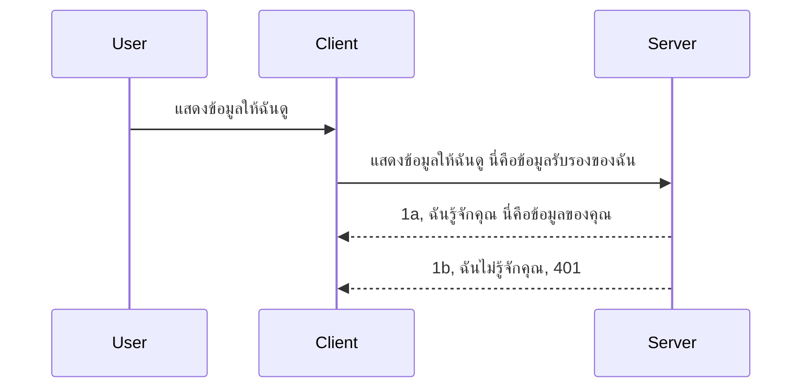

# การยืนยันตัวตนแบบง่าย  

MCP SDKs รองรับการใช้ OAuth 2.1 ซึ่งเป็นกระบวนการที่ค่อนข้างซับซ้อนเกี่ยวข้องกับแนวคิดเช่น เซิร์ฟเวอร์การยืนยันตัวตน, เซิร์ฟเวอร์ทรัพยากร, การส่งข้อมูลรับรอง, การรับรหัส, การแลกรหัสเป็นโทเค็นผู้ถือสิทธิ์จนกระทั่งสามารถเข้าถึงข้อมูลทรัพยากรได้ หากคุณไม่คุ้นเคยกับ OAuth ซึ่งเป็นสิ่งที่ดีที่จะนำมาใช้ เป็นความคิดที่ดีที่จะเริ่มต้นด้วยระดับพื้นฐานของการยืนยันตัวตนและพัฒนาไปสู่ความปลอดภัยที่ดีขึ้นกว่าเดิม นี่คือเหตุผลที่บทนี้มีอยู่ เพื่อสร้างความเข้าใจของคุณไปสู่การยืนยันตัวตนที่ซับซ้อนมากขึ้น  

## การยืนยันตัวตน หมายถึงอะไร?  

การยืนยันตัวตนย่อมาจาก authentication และ authorization แนวคิดคือเราต้องทำสองสิ่ง:  

- **Authentication** คือกระบวนการตรวจสอบว่าเราจะอนุญาตให้บุคคลเข้าสู่บ้านของเราได้หรือไม่ ว่าพวกเขามีสิทธิ์อยู่ที่นี่หรือไม่ คือการเข้าถึงเซิร์ฟเวอร์ทรัพยากรที่ฟีเจอร์ MCP Server ของเราใช้งานอยู่  
- **Authorization** คือกระบวนการตรวจสอบว่าผู้ใช้ควรเข้าถึงทรัพยากรเฉพาะที่พวกเขาขอหรือไม่ เช่น คำสั่งซื้อเหล่านี้ หรือสินค้าบางรายการ หรือว่าพวกเขาสามารถอ่านเนื้อหาได้แต่ไม่สามารถลบได้ เป็นตัวอย่างหนึ่ง  

## ข้อมูลรับรอง: วิธีที่เราบอกระบบว่าเราเป็นใคร  

นักพัฒนาเว็บส่วนใหญ่เริ่มคิดในแง่ของการส่งข้อมูลรับรองไปยังเซิร์ฟเวอร์ มักจะเป็นความลับที่บ่งบอกว่าพวกเขาถูกอนุญาตให้อยู่ที่นี่หรือไม่ "Authentication" ข้อมูลรับรองนี้มักเป็นเวอร์ชัน base64 ของชื่อผู้ใช้และรหัสผ่าน หรือคีย์ API ที่ระบุผู้ใช้เฉพาะเจาะจง  

สิ่งนี้เกี่ยวข้องกับการส่งผ่านทาง header ที่เรียกว่า "Authorization" ดังนี้:  

```json
{ "Authorization": "secret123" }
```
  
สิ่งนี้มักเรียกว่าการยืนยันตัวตนแบบพื้นฐาน (basic authentication) วิธีการทำงานทั้งหมดดำเนินไปดังนี้:  


  
ตอนนี้ที่เราเข้าใจวิธีการทำงานในแง่ของ flow แล้ว เราจะนำไปใช้ได้อย่างไร? เซิร์ฟเวอร์เว็บส่วนใหญ่มีกลไกที่เรียกว่า middleware เป็นโค้ดที่ทำงานในส่วนของคำขอซึ่งสามารถตรวจสอบข้อมูลรับรอง และหากข้อมูลรับรองถูกต้องก็จะอนุญาตให้คำขอผ่านไปได้ หากคำขอไม่มีข้อมูลรับรองที่ถูกต้อง คุณจะได้รับข้อผิดพลาดด้านการยืนยันตัวตน ลองดูการนำไปใช้ดังนี้:  

**Python**  

```python
class AuthMiddleware(BaseHTTPMiddleware):
    async def dispatch(self, request, call_next):

        has_header = request.headers.get("Authorization")
        if not has_header:
            print("-> Missing Authorization header!")
            return Response(status_code=401, content="Unauthorized")

        if not valid_token(has_header):
            print("-> Invalid token!")
            return Response(status_code=403, content="Forbidden")

        print("Valid token, proceeding...")
       
        response = await call_next(request)
        # เพิ่มหัวข้อใด ๆ ของลูกค้าหรือเปลี่ยนแปลงในคำตอบในบางวิธี
        return response


starlette_app.add_middleware(CustomHeaderMiddleware)
```
  
ที่นี่เรามี:  

- สร้าง middleware ที่ชื่อ `AuthMiddleware` โดยมีเมธอด `dispatch` ที่ถูกเรียกโดยเว็บเซิร์ฟเวอร์  
- เพิ่ม middleware เข้าไปในเว็บเซิร์ฟเวอร์:  

    ```python
    starlette_app.add_middleware(AuthMiddleware)
    ```
  
- เขียนตรรกะการตรวจสอบว่า header Authorization มีหรือไม่ และความลับที่ส่งมาตรงคือถูกต้องหรือไม่:  

    ```python
    has_header = request.headers.get("Authorization")
    if not has_header:
        print("-> Missing Authorization header!")
        return Response(status_code=401, content="Unauthorized")

    if not valid_token(has_header):
        print("-> Invalid token!")
        return Response(status_code=403, content="Forbidden")
    ```
  
    ถ้าความลับถูกต้อง เราจะปล่อยให้คำขอผ่านโดยเรียก `call_next` และคืนค่าคำตอบ  

    ```python
    response = await call_next(request)
    # เพิ่มส่วนหัวของลูกค้าหรือเปลี่ยนแปลงการตอบกลับในบางวิธี
    return response
    ```
  
วิธีการทำงานคือ หากมีคำขอเว็บมายังเซิร์ฟเวอร์ middleware จะถูกเรียกและตามการทำงานของมันจะปล่อยคำขอผ่านหรือส่งข้อผิดพลาดกลับว่าลูกค้าไม่ได้รับอนุญาตให้ดำเนินการต่อ  

**TypeScript**  

ที่นี่เราสร้าง middleware ด้วยเฟรมเวิร์กยอดนิยม Express และดักจับคำขอก่อนจะถึง MCP Server โค้ดดังนี้:  

```typescript
function isValid(secret) {
    return secret === "secret123";
}

app.use((req, res, next) => {
    // 1. มีส่วนหัวการอนุญาตหรือไม่?
    if(!req.headers["Authorization"]) {
        res.status(401).send('Unauthorized');
    }
    
    let token = req.headers["Authorization"];

    // 2. ตรวจสอบความถูกต้อง
    if(!isValid(token)) {
        res.status(403).send('Forbidden');
    }

   
    console.log('Middleware executed');
    // 3. ส่งคำขอต่อไปยังขั้นตอนถัดไปในกระบวนการคำขอ
    next();
});
```
  
ในโค้ดนี้ เรา:  

1. ตรวจสอบว่า header Authorization มีหรือไม่ ถ้าไม่มีส่งข้อผิดพลาด 401  
2. ตรวจสอบความถูกต้องของข้อมูลรับรอง/โทเค็น ถ้าไม่ถูกต้องส่งข้อผิดพลาด 403  
3. ผ่านคำขอใน pipeline คำขอและส่งคืนทรัพยากรที่ร้องขอ  

## แบบฝึกหัด: การนำการยืนยันตัวตนไปใช้  

มาลองใช้ความรู้และสร้างการยืนยันตัวตนกัน มีแผนดังนี้:  

เซิร์ฟเวอร์  

- สร้างเว็บเซิร์ฟเวอร์และอินสแตนซ์ MCP  
- นำ middleware ไปใช้กับเซิร์ฟเวอร์  

ลูกค้า  

- ส่งคำขอเว็บพร้อมข้อมูลรับรองผ่าน header  

### -1- สร้างเว็บเซิร์ฟเวอร์และอินสแตนซ์ MCP  

> **มองล่วงหน้า:** ตัวอย่าง TypeScript ด้านล่างนี้ติดตาม HTTP transports ในแผนที่ `transports` ที่ใช้ `mcp-session-id` เป็น key ตาม **MCP Specification 2025-11-25** รุ่น release candidate `2026-07-28` จะลบการ handshake และ session ID ออก ดังนั้นแผนที่ transport ต่อต่อ session จะหายไป ใช้คำขอแบบ stateless ที่บรรจุข้อมูลด้วยตนเอง แนะนำดู [What’s Changing in MCP: The 2026-07-28 Release Candidate](../../01-CoreConcepts/mcp-2026-07-28-release-candidate.md)  

ในขั้นตอนแรก เราจำเป็นต้องสร้างอินสแตนซ์เว็บเซิร์ฟเวอร์และ MCP Server  

**Python**  

ที่นี่เราสร้างอินสแตนซ์ MCP Server, สร้างแอปเว็บ starlette และโฮสต์ด้วย uvicorn  

```python
# กำลังสร้างเซิร์ฟเวอร์ MCP

app = FastMCP(
    name="MCP Resource Server",
    instructions="Resource Server that validates tokens via Authorization Server introspection",
    host=settings["host"],
    port=settings["port"],
    debug=True
)

# กำลังสร้างเว็บแอป starlette
starlette_app = app.streamable_http_app()

# ให้บริการแอปผ่าน uvicorn
async def run(starlette_app):
    import uvicorn
    config = uvicorn.Config(
            starlette_app,
            host=app.settings.host,
            port=app.settings.port,
            log_level=app.settings.log_level.lower(),
        )
    server = uvicorn.Server(config)
    await server.serve()

run(starlette_app)
```
  
ในโค้ดนี้เรา:  

- สร้าง MCP Server  
- สร้างแอปเว็บ starlette จาก MCP Server โดยใช้ `app.streamable_http_app()`  
- โฮสต์และเซิร์ฟเวอร์แอปด้วย uvicorn `server.serve()`  

**TypeScript**  

ที่นี่เราสร้างอินสแตนซ์ MCP Server  

```typescript
const server = new McpServer({
      name: "example-server",
      version: "1.0.0"
    });

    // ... ตั้งค่าแหล่งข้อมูลเซิร์ฟเวอร์ เครื่องมือ และพร้อมท์ ...
```
  
การสร้าง MCP Server นี้จะต้องเกิดขึ้นภายในคำจำกัดความเส้นทาง POST /mcp ดังนั้นเราจะย้ายโค้ดข้างบนมาดังนี้:  

```typescript
import express from "express";
import { randomUUID } from "node:crypto";
import { McpServer } from "@modelcontextprotocol/sdk/server/mcp.js";
import { StreamableHTTPServerTransport } from "@modelcontextprotocol/sdk/server/streamableHttp.js";
import { isInitializeRequest } from "@modelcontextprotocol/sdk/types.js"

const app = express();
app.use(express.json());

// แผนที่สำหรับเก็บข้อมูลการขนส่งตามรหัสเซสชัน
const transports: { [sessionId: string]: StreamableHTTPServerTransport } = {};

// จัดการคำขอ POST สำหรับการสื่อสารจากไคลเอนต์ไปยังเซิร์ฟเวอร์
app.post('/mcp', async (req, res) => {
  // ตรวจสอบว่ามีรหัสเซสชันอยู่แล้วหรือไม่
  const sessionId = req.headers['mcp-session-id'] as string | undefined;
  let transport: StreamableHTTPServerTransport;

  if (sessionId && transports[sessionId]) {
    // ใช้การขนส่งที่มีอยู่เดิมซ้ำ
    transport = transports[sessionId];
  } else if (!sessionId && isInitializeRequest(req.body)) {
    // คำขอเริ่มต้นใหม่
    transport = new StreamableHTTPServerTransport({
      sessionIdGenerator: () => randomUUID(),
      onsessioninitialized: (sessionId) => {
        // เก็บการขนส่งตามรหัสเซสชัน
        transports[sessionId] = transport;
      },
      // การป้องกัน DNS rebinding ปิดการใช้งานโดยค่าเริ่มต้นเพื่อความเข้ากันได้ย้อนหลัง หากคุณกำลังรันเซิร์ฟเวอร์นี้
      // ภายในเครื่อง ให้แน่ใจว่าได้ตั้งค่า:
      // enableDnsRebindingProtection: true,
      // allowedHosts: ['127.0.0.1'],
    });

    // ทำความสะอาดการขนส่งเมื่อปิด
    transport.onclose = () => {
      if (transport.sessionId) {
        delete transports[transport.sessionId];
      }
    };
    const server = new McpServer({
      name: "example-server",
      version: "1.0.0"
    });

    // ... ตั้งค่าทรัพยากร เซิร์ฟเวอร์ เครื่องมือ และพรอมต์ ...

    // เชื่อมต่อไปยังเซิร์ฟเวอร์ MCP
    await server.connect(transport);
  } else {
    // คำขอไม่ถูกต้อง
    res.status(400).json({
      jsonrpc: '2.0',
      error: {
        code: -32000,
        message: 'Bad Request: No valid session ID provided',
      },
      id: null,
    });
    return;
  }

  // จัดการคำขอ
  await transport.handleRequest(req, res, req.body);
});

// ตัวจัดการที่สามารถใช้งานซ้ำได้สำหรับคำขอ GET และ DELETE
const handleSessionRequest = async (req: express.Request, res: express.Response) => {
  const sessionId = req.headers['mcp-session-id'] as string | undefined;
  if (!sessionId || !transports[sessionId]) {
    res.status(400).send('Invalid or missing session ID');
    return;
  }
  
  const transport = transports[sessionId];
  await transport.handleRequest(req, res);
};

// จัดการคำขอ GET สำหรับการแจ้งเตือนจากเซิร์ฟเวอร์ไปยังไคลเอนต์ผ่าน SSE
app.get('/mcp', handleSessionRequest);

// จัดการคำขอ DELETE สำหรับการยุติเซสชัน
app.delete('/mcp', handleSessionRequest);

app.listen(3000);
```
  
ตอนนี้คุณจะเห็นว่า การสร้าง MCP Server ถูกย้ายเข้าไปใน `app.post("/mcp")`  

ต่อไปเป็นขั้นตอนการสร้าง middleware เพื่อให้เราตรวจสอบข้อมูลรับรองที่เข้ามาได้  

### -2- นำ middleware ไปใช้กับเซิร์ฟเวอร์  

ต่อไปเราจะมาเขียนส่วน middleware กัน ที่นี่เราจะสร้าง middleware ที่มองหาข้อมูลรับรองใน header `Authorization` และตรวจสอบมัน หากถูกต้องคำขอจะดำเนินต่อไปเพื่อทำสิ่งที่ต้องการ (เช่น รายการเครื่องมือ อ่านทรัพยากร หรือฟังก์ชัน MCP ใดๆ ที่ลูกค้าขอ)  

**Python**  

การสร้าง middleware เราจำเป็นต้องสร้างคลาสที่สืบทอดจาก `BaseHTTPMiddleware` มีสองส่วนที่น่าสนใจ:  

- คำขอ `request` ที่เราอ่านข้อมูล header จากมัน  
- `call_next` callback ที่เราต้องเรียกหากลูกค้านำข้อมูลรับรองที่เรายอมรับมา  

ก่อนอื่นเราต้องจัดการกรณีถ้าไม่มี header `Authorization`:  

```python
has_header = request.headers.get("Authorization")

# ไม่มีหัวข้ออยู่, ล้มเหลวด้วย 401, ไม่เช่นนั้นดำเนินการต่อ.
if not has_header:
    print("-> Missing Authorization header!")
    return Response(status_code=401, content="Unauthorized")
```
  
ที่นี่เราส่งข้อความ 401 unauthorized เพราะลูกค้าไม่ผ่านการยืนยันตัวตน  

ถัดไปหากมีข้อมูลรับรองถูกส่งมา เราต้องตรวจสอบความถูกต้องเป็นดังนี้:  

```python
 if not valid_token(has_header):
    print("-> Invalid token!")
    return Response(status_code=403, content="Forbidden")
```
  
สังเกตว่าเราส่งข้อความ 403 forbidden ด้านบน ลองดู middleware ทั้งหมดด้านล่างที่ทำทุกอย่างที่เรากล่าวถึง:  

```python
class AuthMiddleware(BaseHTTPMiddleware):
    async def dispatch(self, request, call_next):

        has_header = request.headers.get("Authorization")
        if not has_header:
            print("-> Missing Authorization header!")
            return Response(status_code=401, content="Unauthorized")

        if not valid_token(has_header):
            print("-> Invalid token!")
            return Response(status_code=403, content="Forbidden")

        print("Valid token, proceeding...")
        print(f"-> Received {request.method} {request.url}")
        response = await call_next(request)
        response.headers['Custom'] = 'Example'
        return response

```
  
ดีมาก แต่ฟังก์ชัน `valid_token` เป็นอย่างไร? ดูได้ด้านล่างนี้:  

```python
# อย่าใช้สำหรับการผลิต - ปรับปรุงมัน !!
def valid_token(token: str) -> bool:
    # ลบคำนำหน้า "Bearer "
    if token.startswith("Bearer "):
        token = token[7:]
        return token == "secret-token"
    return False
```
  
แน่นอนว่านี่ควรปรับปรุงอีก  

IMPORTANT: คุณไม่ควรเก็บความลับแบบนี้ในโค้ดโดยตรง ควรดึงค่าที่จะใช้เปรียบเทียบจากแหล่งข้อมูล หรือจาก IDP (identity service provider) หรือให้ IDP ทำการตรวจสอบแทนจะดีกว่า  

**TypeScript**  

ในการทำกับ Express เราต้องเรียกใช้เมธอด `use` ที่รับฟังก์ชัน middleware  

เราต้อง:  

- ทำงานกับตัวแปรคำขอเพื่อตรวจสอบข้อมูลรับรองที่ส่งใน `Authorization`  
- ตรวจสอบความถูกต้องของข้อมูลรับรอง และหากถูกต้องให้คำขอดำเนินต่อไปและส่งคำขอ MCP ของลูกค้าไปยังสิ่งที่ต้องทำ (เช่น รายการเครื่องมือ, อ่านทรัพยากร หรือฟังก์ชัน MCP อื่นๆ)  

ที่นี่เราตรวจสอบว่ามี header `Authorization` หรือไม่ ถ้าไม่มีจะหยุดคำขอไว้ที่นี่:  

```typescript
if(!req.headers["authorization"]) {
    res.status(401).send('Unauthorized');
    return;
}
```
  
ถ้าไม่มี header ส่งมาตั้งแต่แรก จะได้รับ 401  

ถัดไป เราจะตรวจสอบความถูกต้องของข้อมูลรับรอง ถ้าไม่ถูกต้องเราจะหยุดคำขออีกครั้งแต่ส่งข้อความต่างกันเล็กน้อย:  

```typescript
if(!isValid(token)) {
    res.status(403).send('Forbidden');
    return;
} 
```
  
สังเกตว่าคุณจะได้รับข้อผิดพลาด 403  

นี่คือโค้ดทั้งหมด:  

```typescript
app.use((req, res, next) => {
    console.log('Request received:', req.method, req.url, req.headers);
    console.log('Headers:', req.headers["authorization"]);
    if(!req.headers["authorization"]) {
        res.status(401).send('Unauthorized');
        return;
    }
    
    let token = req.headers["authorization"];

    if(!isValid(token)) {
        res.status(403).send('Forbidden');
        return;
    }  

    console.log('Middleware executed');
    next();
});
```
  
เราได้ตั้งค่าเว็บเซิร์ฟเวอร์ให้รับ middleware เพื่อตรวจสอบข้อมูลรับรองที่ลูกค้าส่งมา แล้วลูกค้าล่ะ?  

### -3- ส่งคำขอเว็บพร้อมข้อมูลรับรองใน header  

เราต้องแน่ใจว่าลูกค้าส่งข้อมูลรับรองผ่าน header เมื่อใช้ MCP client เราต้องดูว่าส่งแบบไหน  

**Python**  

สำหรับไคลเอนต์ เราต้องส่ง header พร้อมข้อมูลรับรองดังนี้:  

```python
# อย่าเขียนค่าคงที่โดยตรง ให้เก็บไว้อย่างน้อยในตัวแปรแวดล้อมหรือที่เก็บข้อมูลที่ปลอดภัยมากขึ้น
token = "secret-token"

async with streamablehttp_client(
        url = f"http://localhost:{port}/mcp",
        headers = {"Authorization": f"Bearer {token}"}
    ) as (
        read_stream,
        write_stream,
        session_callback,
    ):
        async with ClientSession(
            read_stream,
            write_stream
        ) as session:
            await session.initialize()
      
            # TODO, สิ่งที่คุณต้องการให้ทำในไคลเอนต์ เช่น แสดงรายการเครื่องมือ เรียกใช้เครื่องมือ เป็นต้น
```
  
สังเกตว่าเราเติมค่าใน `headers` เช่น ` headers = {"Authorization": f"Bearer {token}"}`  

**TypeScript**  

เราสามารถแก้ไขได้สองขั้นตอน:  

1. สร้างอ็อบเจ็กต์ configuration พร้อมข้อมูลรับรอง  
2. ส่งอ็อบเจ็กต์ configuration ไปยัง transport  

```typescript

// อย่าระบุค่าคงที่แบบนี้โดยตรง แนะนำให้เก็บเป็นตัวแปรแวดล้อมอย่างน้อย และใช้เครื่องมือเช่น dotenv (ในโหมดพัฒนา)
let token = "secret123"

// กำหนดอ็อบเจ็กต์ตัวเลือกสำหรับการขนส่งของลูกค้า
let options: StreamableHTTPClientTransportOptions = {
  sessionId: sessionId,
  requestInit: {
    headers: {
      "Authorization": "secret123"
    }
  }
};

// ส่งอ็อบเจ็กต์ตัวเลือกไปยังการขนส่ง
async function main() {
   const transport = new StreamableHTTPClientTransport(
      new URL(serverUrl),
      options
   );
```
  
ที่นี่คุณจะเห็นว่าเราต้องสร้างอ็อบเจ็กต์ `options` และใส่ header ไว้ใน `requestInit`  

IMPORTANT: แล้วเราจะปรับปรุงจากนี้ได้อย่างไร? ปัจจุบันยังมีปัญหาอยู่ ขั้นแรกคือการส่งข้อมูลรับรองแบบนี้มีความเสี่ยงค่อนข้างสูง เว้นแต่จะมี HTTPS อย่างน้อยที่สุด แม้จะมี แต่ข้อมูลรับรองอาจถูกขโมย จึงต้องมีระบบที่สามารถเพิกถอนโทเค็นได้ง่ายและเพิ่มการตรวจสอบเพิ่มเติม เช่น มาจากที่ไหนของโลก คำขอเกิดขึ้นบ่อยเกินไปหรือไม่ (พฤติกรรมบอท) ในสรุป มีข้อกังวลมากมาย  

อย่างไรก็ตาม สำหรับ API ที่ง่ายมากๆ ที่คุณไม่ต้องการให้ใครเรียก API ของคุณโดยไม่ผ่านการยืนยันตัวตน สิ่งที่เรามีตอนนี้ก็ถือว่าเป็นจุดเริ่มต้นที่ดี  

ดังนั้น เราลองเพิ่มความปลอดภัยขึ้นอีกนิดโดยใช้ฟอร์แมตมาตรฐานอย่าง JSON Web Token หรือที่เรียกว่า JWT หรือ "JOT" tokens  

## JSON Web Tokens, JWT  

ดังนั้น เรากำลังพยายามปรับปรุงจากการส่งข้อมูลรับรองแบบง่าย มีการปรับปรุงทันทีอะไรบ้างเมื่อใช้ JWT?  

- **ปรับปรุงความปลอดภัย** ใน basic auth คุณส่งชื่อผู้ใช้และรหัสผ่านเป็น token ที่เข้ารหัส base64 ซ้ำๆ หรือส่ง API key ซึ่งเพิ่มความเสี่ยง แต่กับ JWT คุณส่งชื่อผู้ใช้และรหัสผ่านแล้วได้รับ token ตอบกลับซึ่งมีอายุจำกัด JWT ช่วยให้ควบคุมการเข้าถึงอย่างละเอียดด้วยบทบาท ช่วงและสิทธิ์  
- **ไร้สถานะและขยายตัวได้** JWT เป็น self-contained มีข้อมูลผู้ใช้ทั้งหมด ลดความจำเป็นในการเก็บ session ที่ฝั่งเซิร์ฟเวอร์ token สามารถตรวจสอบได้จากเครื่องลูกข่าย  
- **ความสามารถในการทำงานร่วมกันและการรวมตัว** JWT เป็นแกนกลางของ Open ID Connect ใช้กับผู้ให้บริการตัวตนที่รู้จักเช่น Entra ID, Google Identity และ Auth0 ทำให้สามารถใช้ single sign on และอีกมากมายระดับองค์กร  
- **ความยืดหยุ่นและโมดูลาร์** JWT ยังใช้กับ API Gateway อย่าง Azure API Management, NGINX และอื่นๆ รองรับสถานการณ์การตรวจสอบตัวตนและการสื่อสารเซิร์ฟเวอร์สู่บริการ รวมถึงกรณีการสวมบทบาทและมอบหมายสิทธิ์  
- **ประสิทธิภาพและการแคช** JWT สามารถแคชหลังถอดรหัสช่วยลดการแยกวิเคราะห์ เหมาะกับแอปที่มีปริมาณการใช้งานสูงเพราะเพิ่ม throughput และลดโหลดโครงสร้างพื้นฐาน  
- **ฟีเจอร์ขั้นสูง** รองรับการตรวจสอบ (introspection) และการเพิกถอน (revocation) token  

ด้วยประโยชน์ทั้งหมดนี้ มาดูวิธีนำไปใช้ขั้นสูงกัน  

## การเปลี่ยนจาก basic auth เป็น JWT  

การเปลี่ยนแปลงระดับสูงที่ต้องทำคือ:  

- **เรียนรู้การสร้าง JWT token** และเตรียมส่งจากลูกค้าไปเซิร์ฟเวอร์  
- **ตรวจสอบความถูกต้องของ JWT token** และถ้าใช้ได้ ให้ลูกค้าเข้าถึงทรัพยากร  
- **จัดเก็บ token อย่างปลอดภัย** วิธีจัดเก็บ token นี้  
- **ปกป้องเส้นทาง** ต้องป้องกันเส้นทางและฟีเจอร์ MCP เฉพาะ  
- **เพิ่ม refresh token** สร้าง token อายุสั้นแต่มี refresh token อายุยาว ใช้รับ token ใหม่เมื่อหมดอายุ และมี endpoint refresh พร้อมนโยบายเปลี่ยน token (rotation)  

### -1- สร้าง JWT token  

ก่อนอื่น JWT token มีส่วนประกอบดังนี้:  

- **header**, อัลกอริทึมที่ใช้และประเภท token  
- **payload**, ข้ออ้างสิทธิ์ เช่น sub (ผู้ใช้หรือนิติบุคคลที่ token แทน ในสถานการณ์ auth คือ userid), exp (วันหมดอายุ) role (บทบาท)  
- **signature**, ลายเซ็นด้วยความลับหรือกุญแจส่วนตัว  

สำหรับสิ่งนี้ เราต้องสร้าง header, payload และ token ที่เข้ารหัส  

**Python**  

```python

import jwt
import jwt
from jwt.exceptions import ExpiredSignatureError, InvalidTokenError
import datetime

# กุญแจลับที่ใช้ลงนาม JWT
secret_key = 'your-secret-key'

header = {
    "alg": "HS256",
    "typ": "JWT"
}

# ข้อมูลผู้ใช้และข้อเรียกร้องรวมถึงเวลาหมดอายุ
payload = {
    "sub": "1234567890",               # หัวข้อ (ไอดีผู้ใช้)
    "name": "User Userson",                # ข้อเรียกร้องที่กำหนดเอง
    "admin": True,                     # ข้อเรียกร้องที่กำหนดเอง
    "iat": datetime.datetime.utcnow(),# เวลาออก
    "exp": datetime.datetime.utcnow() + datetime.timedelta(hours=1)  # หมดอายุ
}

# เข้ารหัสมัน
encoded_jwt = jwt.encode(payload, secret_key, algorithm="HS256", headers=header)
```
  
ในโค้ดข้างบนเราได้:  

- กำหนด header ใช้ HS256 เป็นอัลกอริทึมและประเภทเป็น JWT  
- สร้าง payload ที่มี subject หรือ user id, ชื่อผู้ใช้, บทบาท, เวลาที่ออกและเวลาที่หมดอายุ ทำให้เป็นแบบมีขอบเขตเวลาตามที่กล่าวมา  

**TypeScript**  

ที่นี่เราจะต้องใช้ dependencies บางตัวที่จะช่วยสร้าง JWT token  

Dependencies  

```sh

npm install jsonwebtoken
npm install --save-dev @types/jsonwebtoken
```
  
ตอนนี้เมื่อมี dependencies แล้ว มาสร้าง header, payload และสร้าง token ที่เข้ารหัสกัน  

```typescript
import jwt from 'jsonwebtoken';

const secretKey = 'your-secret-key'; // ใช้ตัวแปรสภาพแวดล้อมในโปรดักชัน

// กำหนด payload
const payload = {
  sub: '1234567890',
  name: 'User usersson',
  admin: true,
  iat: Math.floor(Date.now() / 1000), // เวลาที่ออก
  exp: Math.floor(Date.now() / 1000) + 60 * 60 // หมดอายุใน 1 ชั่วโมง
};

// กำหนด header (ไม่บังคับ, jsonwebtoken ตั้งค่าดีฟอลต์ไว้แล้ว)
const header = {
  alg: 'HS256',
  typ: 'JWT'
};

// สร้าง token
const token = jwt.sign(payload, secretKey, {
  algorithm: 'HS256',
  header: header
});

console.log('JWT:', token);
```
  
token นี้:  

ลงชื่อด้วย HS256  
ใช้งานได้ 1 ชั่วโมง  
มี claims เช่น sub, name, admin, iat และ exp  

### -2- ตรวจสอบ token  

เรายังต้องตรวจสอบ token ด้วย ซึ่งควรทำที่เซิร์ฟเวอร์เพื่อให้แน่ใจว่าสิ่งที่ลูกค้าส่งมานั้นถูกต้อง มีการตรวจสอบหลายอย่างตั้งแต่โครงสร้างยันความถูกต้อง คุณควรเพิ่มการตรวจสอบว่าผู้ใช้นั้นอยู่ในระบบของคุณหรือไม่ และอื่นๆ  

ในการตรวจสอบ token เราต้องถอดรหัสมันเพื่ออ่านแล้วเริ่มตรวจสอบความถูกต้อง:  

**Python**  

```python

# ถอดรหัสและตรวจสอบ JWT
try:
    decoded = jwt.decode(token, secret_key, algorithms=["HS256"])
    print("✅ Token is valid.")
    print("Decoded claims:")
    for key, value in decoded.items():
        print(f"  {key}: {value}")
except ExpiredSignatureError:
    print("❌ Token has expired.")
except InvalidTokenError as e:
    print(f"❌ Invalid token: {e}")

```
  

ในโค้ดนี้ เราเรียกใช้ `jwt.decode` โดยใช้โทเค็น, คีย์ลับ และอัลกอริทึมที่เลือกเป็นอินพุต สังเกตว่าเราใช้โครงสร้าง try-catch เพราะการตรวจสอบล้มเหลวจะทำให้เกิดข้อผิดพลาด

**TypeScript**

ที่นี่เราจำเป็นต้องเรียกใช้ `jwt.verify` เพื่อรับเวอร์ชันที่ถอดรหัสของโทเค็นที่เราสามารถวิเคราะห์ต่อได้ หากเรียกใช้งานล้มเหลว นั่นหมายความว่าโครงสร้างของโทเค็นไม่ถูกต้องหรือไม่ยอมรับอีกต่อไป

```typescript

try {
  const decoded = jwt.verify(token, secretKey);
  console.log('Decoded Payload:', decoded);
} catch (err) {
  console.error('Token verification failed:', err);
}
```

หมายเหตุ: ดังที่ได้กล่าวไว้ก่อนหน้านี้ เราควรดำเนินการตรวจสอบเพิ่มเติมเพื่อให้แน่ใจว่าโทเค็นนี้ชี้ไปยังผู้ใช้ในระบบของเราและตรวจสอบว่าผู้ใช้มีสิทธิ์ที่อ้างอิงไว้จริง

ต่อไป มาดูการควบคุมการเข้าถึงตามบทบาท หรือที่เรียกว่า RBAC

## การเพิ่มการควบคุมการเข้าถึงตามบทบาท

แนวคิดคือเราต้องการแสดงให้เห็นว่าบทบาทต่าง ๆ มีสิทธิ์แตกต่างกัน ตัวอย่างเช่น เราสมมติว่าแอดมินสามารถทำทุกอย่างได้ และผู้ใช้ปกติสามารถอ่าน/เขียนได้ และผู้เยี่ยมชมสามารถอ่านอย่างเดียว ดังนั้น นี่คือตัวอย่างระดับสิทธิ์ที่เป็นไปได้:

- Admin.Write 
- User.Read
- Guest.Read

มาดูวิธีการที่เราสามารถนำการควบคุมแบบนี้ไปใช้ผ่าน middleware ได้ Middleware สามารถเพิ่มได้ทั้งต่อเส้นทางเฉพาะ หรือสำหรับทุกเส้นทาง

**Python**

```python
from starlette.middleware.base import BaseHTTPMiddleware
from starlette.responses import JSONResponse
import jwt

# อย่าวางความลับไว้ในโค้ด เช่นนี้เป็นเพียงตัวอย่างเท่านั้น ควรอ่านจากแหล่งที่ปลอดภัย
SECRET_KEY = "your-secret-key" # ใส่สิ่งนี้ในตัวแปร env
REQUIRED_PERMISSION = "User.Read"

class JWTPermissionMiddleware(BaseHTTPMiddleware):
    async def dispatch(self, request, call_next):
        auth_header = request.headers.get("Authorization")
        if not auth_header or not auth_header.startswith("Bearer "):
            return JSONResponse({"error": "Missing or invalid Authorization header"}, status_code=401)

        token = auth_header.split(" ")[1]
        try:
            decoded = jwt.decode(token, SECRET_KEY, algorithms=["HS256"])
        except jwt.ExpiredSignatureError:
            return JSONResponse({"error": "Token expired"}, status_code=401)
        except jwt.InvalidTokenError:
            return JSONResponse({"error": "Invalid token"}, status_code=401)

        permissions = decoded.get("permissions", [])
        if REQUIRED_PERMISSION not in permissions:
            return JSONResponse({"error": "Permission denied"}, status_code=403)

        request.state.user = decoded
        return await call_next(request)


```

มีวิธีต่าง ๆ ในการเพิ่ม middleware ดังตัวอย่างด้านล่าง:

```python

# ทางเลือก 1: เพิ่ม middleware ในขณะสร้างแอป starlette
middleware = [
    Middleware(JWTPermissionMiddleware)
]

app = Starlette(routes=routes, middleware=middleware)

# ทางเลือก 2: เพิ่ม middleware หลังจากที่แอป starlette ถูกสร้างแล้ว
starlette_app.add_middleware(JWTPermissionMiddleware)

# ทางเลือก 3: เพิ่ม middleware ต่อแต่ละเส้นทาง
routes = [
    Route(
        "/mcp",
        endpoint=..., # ตัวจัดการ
        middleware=[Middleware(JWTPermissionMiddleware)]
    )
]
```

**TypeScript**

เราสามารถใช้ `app.use` กับ middleware ที่ทำงานสำหรับคำขอทั้งหมด

```typescript
app.use((req, res, next) => {
    console.log('Request received:', req.method, req.url, req.headers);
    console.log('Headers:', req.headers["authorization"]);

    // 1. ตรวจสอบว่าหัวข้อการอนุญาตถูกส่งมาหรือไม่

    if(!req.headers["authorization"]) {
        res.status(401).send('Unauthorized');
        return;
    }
    
    let token = req.headers["authorization"];

    // 2. ตรวจสอบว่าโทเค็นถูกต้องหรือไม่
    if(!isValid(token)) {
        res.status(403).send('Forbidden');
        return;
    }  

    // 3. ตรวจสอบว่าผู้ใช้โทเค็นมีอยู่ในระบบของเราหรือไม่
    if(!isExistingUser(token)) {
        res.status(403).send('Forbidden');
        console.log("User does not exist");
        return;
    }
    console.log("User exists");

    // 4. ตรวจสอบว่าโทเค็นมีสิทธิ์ถูกต้องหรือไม่
    if(!hasScopes(token, ["User.Read"])){
        res.status(403).send('Forbidden - insufficient scopes');
    }

    console.log("User has required scopes");

    console.log('Middleware executed');
    next();
});

```

มีหลายอย่างที่เราสามารถให้ middleware ของเราทำและที่ middleware ควรทำ ได้แก่:

1. ตรวจสอบว่ามี header authorization หรือไม่
2. ตรวจสอบว่าโทเค็นถูกต้องหรือไม่ เราเรียก `isValid` ซึ่งเป็นเมธอดที่เราเขียนเพื่อตรวจสอบความสมบูรณ์และความถูกต้องของโทเค็น JWT
3. ตรวจสอบว่าผู้ใช้มีอยู่ในระบบของเราหรือไม่ เราควรตรวจสอบส่วนนี้

   ```typescript
    // ผู้ใช้ในฐานข้อมูล
   const users = [
     "user1",
     "User usersson",
   ]

   function isExistingUser(token) {
     let decodedToken = verifyToken(token);

     // ต้องทำ, ตรวจสอบว่าผู้ใช้มีอยู่ในฐานข้อมูลหรือไม่
     return users.includes(decodedToken?.name || "");
   }
   ```

   ข้างต้น เราได้สร้างรายการ `users` แบบง่าย ๆ ซึ่งควรจะถูกจัดเก็บในฐานข้อมูลอย่างแน่นอน

4. นอกจากนี้ เรายังควรตรวจสอบด้วยว่าโทเค็นมีสิทธิ์ที่ถูกต้อง

   ```typescript
   if(!hasScopes(token, ["User.Read"])){
        res.status(403).send('Forbidden - insufficient scopes');
   }
   ```

   ในโค้ดข้างต้นจาก middleware เราตรวจสอบว่าโทเค็นมีสิทธิ์ User.Read หรือไม่ หากไม่มีเราจะส่งข้อผิดพลาด 403 ด้านล่างคือเมธอดช่วยเหลือ `hasScopes`

   ```typescript
   function hasScopes(scope: string, requiredScopes: string[]) {
     let decodedToken = verifyToken(scope);
    return requiredScopes.every(scope => decodedToken?.scopes.includes(scope));
  }
   ```

Have a think which additional checks you should be doing, but these are the absolute minimum of checks you should be doing.

Using Express as a web framework is a common choice. There are helpers library when you use JWT so you can write less code.

- `express-jwt`, helper library that provides a middleware that helps decode your token.
- `express-jwt-permissions`, this provides a middleware `guard` that helps check if a certain permission is on the token.

Here's what these libraries can look like when used:

```typescript
const express = require('express');
const jwt = require('express-jwt');
const guard = require('express-jwt-permissions')();

const app = express();
const secretKey = 'your-secret-key'; // put this in env variable

// Decode JWT and attach to req.user
app.use(jwt({ secret: secretKey, algorithms: ['HS256'] }));

// Check for User.Read permission
app.use(guard.check('User.Read'));

// multiple permissions
// app.use(guard.check(['User.Read', 'Admin.Access']));

app.get('/protected', (req, res) => {
  res.json({ message: `Welcome ${req.user.name}` });
});

// Error handler
app.use((err, req, res, next) => {
  if (err.code === 'permission_denied') {
    return res.status(403).send('Forbidden');
  }
  next(err);
});

```

ตอนนี้คุณเห็นว่า middleware สามารถใช้ได้ทั้งสำหรับการตรวจสอบตัวตนและการอนุญาต แล้ว MCP ล่ะ มันเปลี่ยนวิธีที่เราทำการตรวจสอบตัวตนหรือไม่? มาดูกันในส่วนถัดไป

### -3- เพิ่ม RBAC ให้ MCP

คุณเห็นจนถึงตอนนี้ว่าคุณสามารถเพิ่ม RBAC ผ่าน middleware ได้ อย่างไรก็ตาม สำหรับ MCP ไม่มีวิธีง่าย ๆ ในการเพิ่ม RBAC ต่อฟีเจอร์ของ MCP ดังนั้นเราจะทำอย่างไร? ก็แค่เพิ่มโค้ดแบบนี้ที่ตรวจสอบในกรณีนี้ว่าลูกค้ามีสิทธิ์เรียกใช้เครื่องมือเฉพาะหรือไม่:

คุณมีตัวเลือกหลายวิธีในการทำ RBAC ต่อฟีเจอร์ นี่คือตัวอย่าง:

- เพิ่มการตรวจสอบสำหรับแต่ละเครื่องมือ, แหล่งข้อมูล, หรือคำสั่ง prompt ที่คุณต้องตรวจสอบระดับสิทธิ์

   **python**

   ```python
   @tool()
   def delete_product(id: int):
      try:
          check_permissions(role="Admin.Write", request)
      catch:
        pass # ลูกค้าไม่ผ่านการอนุญาต, ยกข้อผิดพลาดการอนุญาต
   ```

   **typescript**

   ```typescript
   server.registerTool(
    "delete-product",
    {
      title: Delete a product",
      description: "Deletes a product",
      inputSchema: { id: z.number() }
    },
    async ({ id }) => {
      
      try {
        checkPermissions("Admin.Write", request);
        // ต้องทำ, ส่ง id ไปยัง productService และ remote entry
      } catch(Exception e) {
        console.log("Authorization error, you're not allowed");  
      }

      return {
        content: [{ type: "text", text: `Deletected product with id ${id}` }]
      };
    }
   );
   ```


- ใช้วิธีเซิร์ฟเวอร์ขั้นสูงและ request handlers เพื่อให้คุณลดจำนวนจุดที่ต้องทำการตรวจสอบลง

   **Python**

   ```python
   
   tool_permission = {
      "create_product": ["User.Write", "Admin.Write"],
      "delete_product": ["Admin.Write"]
   }

   def has_permission(user_permissions, required_permissions) -> bool:
      # user_permissions: รายการสิทธิ์ที่ผู้ใช้มี
      # required_permissions: รายการสิทธิ์ที่จำเป็นสำหรับเครื่องมือ
      return any(perm in user_permissions for perm in required_permissions)

   @server.call_tool()
   async def handle_call_tool(
     name: str, arguments: dict[str, str] | None
   ) -> list[types.TextContent]:
    # สมมติว่า request.user.permissions เป็นรายการสิทธิ์ของผู้ใช้
     user_permissions = request.user.permissions
     required_permissions = tool_permission.get(name, [])
     if not has_permission(user_permissions, required_permissions):
        # แจ้งข้อผิดพลาด "คุณไม่มีสิทธิ์เรียกใช้เครื่องมือ {name}"
        raise Exception(f"You don't have permission to call tool {name}")
     # ดำเนินการต่อและเรียกใช้เครื่องมือ
     # ...
   ```   
   

   **TypeScript**

   ```typescript
   function hasPermission(userPermissions: string[], requiredPermissions: string[]): boolean {
       if (!Array.isArray(userPermissions) || !Array.isArray(requiredPermissions)) return false;
       // คืนค่าเป็นจริงถ้าผู้ใช้มีสิทธิ์ที่จำเป็นอย่างน้อยหนึ่งอย่าง
       
       return requiredPermissions.some(perm => userPermissions.includes(perm));
   }
  
   server.setRequestHandler(CallToolRequestSchema, async (request) => {
      const { params: { name } } = request;
  
      let permissions = request.user.permissions;
  
      if (!hasPermission(permissions, toolPermissions[name])) {
         return new Error(`You don't have permission to call ${name}`);
      }
  
      // ดำเนินการต่อ..
   });
   ```

   หมายเหตุ คุณจะต้องมั่นใจว่า middleware ของคุณกำหนดโทเค็นที่ถอดรหัสแล้วให้กับคุณสมบัติ user ของคำขอเพื่อให้โค้ดด้านบนทำงานง่าย

### สรุป

ตอนนี้ที่เราได้พูดถึงวิธีเพิ่มการสนับสนุน RBAC โดยทั่วไปและสำหรับ MCP โดยเฉพาะ ถึงเวลาที่จะลองนำไปใช้การรักษาความปลอดภัยเองเพื่อให้แน่ใจว่าคุณเข้าใจแนวคิดที่นำเสนอ

## งานที่มอบหมาย 1: สร้างเซิร์ฟเวอร์ mcp และไคลเอนต์ mcp โดยใช้การตรวจสอบตัวตนพื้นฐาน

ที่นี่คุณจะนำสิ่งที่เรียนรู้เกี่ยวกับการส่งข้อมูลรับรองผ่าน headers มาใช้

## ตัวอย่างที่ 1

[Solution 1](./code/basic/README.md)

## งานที่มอบหมาย 2: อัปเกรดโซลูชันจากงานที่มอบหมาย 1 ให้ใช้ JWT

นำตัวอย่างแรกมาใช้แต่ครั้งนี้ เรามาปรับปรุงมันกัน

แทนที่จะใช้ Basic Auth ให้ใช้ JWT แทน

## ตัวอย่างที่ 2

[Solution 2](./solution/jwt-solution/README.md)

## ความท้าทาย

เพิ่ม RBAC ต่อเครื่องมือที่เราอธิบายในส่วน "เพิ่ม RBAC ให้ MCP"

## สรุป

คุณน่าจะได้เรียนรู้มากมายในบทนี้ ตั้งแต่ไม่มีความปลอดภัยเลย ไปจนถึงความปลอดภัยขั้นพื้นฐาน, JWT และวิธีเพิ่มเข้า MCP

เราได้สร้างพื้นฐานที่มั่นคงด้วย JWT ที่กำหนดเอง แต่เมื่อเราขยายตัว เรากำลังมุ่งสู่โมเดลตัวตนที่อิงมาตรฐาน การนำ IdP อย่าง Entra หรือ Keycloak มาใช้ช่วยให้เราสามารถถ่ายโอนกระบวนการออกโทเค็น, การตรวจสอบ และการจัดการวงจรชีวิตไปยังแพลตฟอร์มที่เชื่อถือได้ ทำให้เราเน้นไปที่ตรรกะแอปและประสบการณ์ผู้ใช้ได้

สำหรับเรื่องนี้ เรามีบทเรียนที่ [บทขั้นสูงเกี่ยวกับ Entra](../../05-AdvancedTopics/mcp-security-entra/README.md)

## ต่อไปคืออะไร

- ต่อไป: [การตั้งค่า MCP Hosts](../12-mcp-hosts/README.md)

---

<!-- CO-OP TRANSLATOR DISCLAIMER START -->
**ปฏิเสธความรับผิดชอบ**:
เอกสารนี้ได้รับการแปลโดยใช้บริการแปลภาษา AI [Co-op Translator](https://github.com/Azure/co-op-translator) ขณะที่เราพยายามให้ความถูกต้อง โปรดทราบว่าการแปลโดยอัตโนมัติอาจมีข้อผิดพลาดหรือความไม่ถูกต้อง เอกสารต้นฉบับในภาษาต้นทางควรถูกพิจารณาเป็นแหล่งข้อมูลที่เชื่อถือได้ สำหรับข้อมูลที่สำคัญ แนะนำให้ใช้การแปลโดยมนุษย์มืออาชีพ เราไม่รับผิดชอบต่อความเข้าใจผิดหรือการตีความที่ผิดพลาดที่เกิดขึ้นจากการใช้การแปลนี้
<!-- CO-OP TRANSLATOR DISCLAIMER END -->