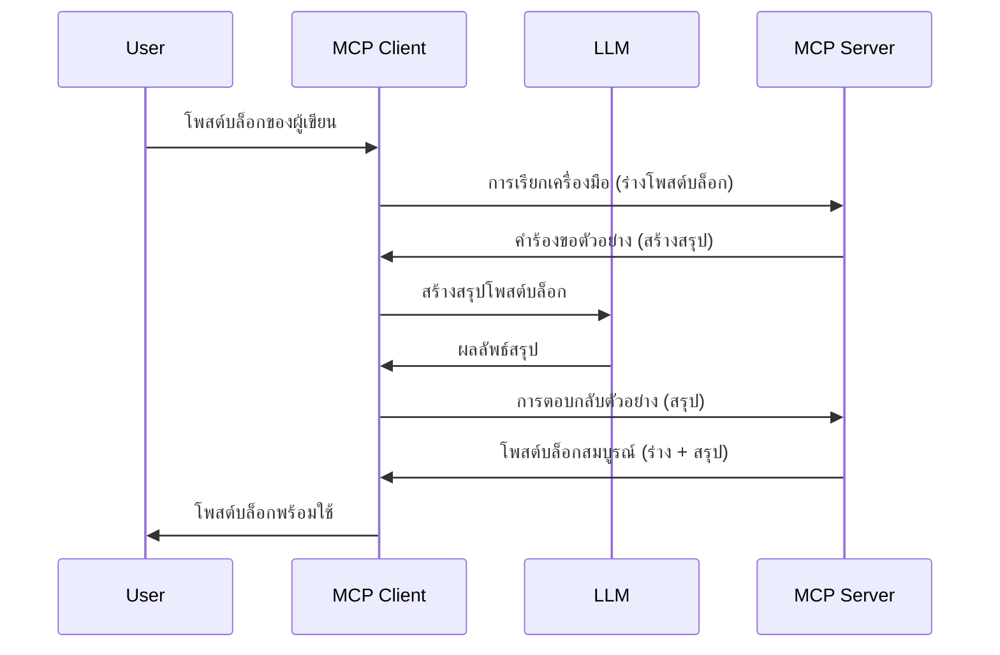

# การสุ่มตัวอย่าง - มอบหมายคุณสมบัติให้กับ Client

> **ประกาศเลิกใช้:** ตัวอย่างสเปค MCP รุ่นพร้อมปล่อย `2026-07-28` กำหนดให้ Sampling เป็นคุณสมบัติที่เลิกใช้และแนะนำให้ใช้การผสานโดยตรงกับ API ของผู้ให้บริการ LLM แทน Sampling ยังคงใช้งานได้ใน `2025-11-25` และต่ออย่างน้อยหนึ่งปีหลังจากประกาศเลิกใช้อย่างเป็นทางการ ดังนั้นเนื้อหาในบทเรียนนี้ยังคงใช้ได้ — แต่การออกแบบเซิร์ฟเวอร์ใหม่ควรประเมินรูปแบบการทดแทน ดูข้อมูลเพิ่มเติมได้ที่ [What’s Changing in MCP: The 2026-07-28 Release Candidate](../../01-CoreConcepts/mcp-2026-07-28-release-candidate.md)

บางครั้ง คุณอาจต้องการให้ MCP Client และ MCP Server ร่วมมือกันเพื่อบรรลุเป้าหมายร่วมกัน คุณอาจมีกรณีที่ Server ต้องการความช่วยเหลือจาก LLM ที่อยู่บน client สำหรับสถานการณ์นี้ Sampling คือสิ่งที่คุณควรใช้

มาสำรวจกรณีการใช้งานบางอย่างและวิธีสร้างโซลูชันที่เกี่ยวข้องกับ sampling กันเถอะ

## ภาพรวม

ในบทเรียนนี้ เราจะเน้นอธิบายว่าเมื่อใดและที่ไหนควรใช้ Sampling และวิธีตั้งค่า

## วัตถุประสงค์การเรียนรู้

ในบทนี้ เราจะ:

- อธิบายว่า Sampling คืออะไรและเมื่อใดควรใช้
- แสดงวิธีตั้งค่า Sampling ใน MCP
- ให้ตัวอย่างการใช้งาน Sampling ในการปฏิบัติ

## Sampling คืออะไรและทำไมต้องใช้?

Sampling เป็นคุณสมบัติขั้นสูงที่ทำงานดังนี้:



### คำขอ Sampling

โอเค ตอนนี้เรามีภาพรวมระดับกว้างของสถานการณ์ที่น่าเชื่อถือแล้ว มาพูดถึงคำขอ sampling ที่เซิร์ฟเวอร์ส่งกลับไปยัง client กัน คำขอประเภทนี้ในรูปแบบ JSON-RPC จะมีหน้าตาแบบนี้:

```json
{
  "jsonrpc": "2.0",
  "id": 1,
  "method": "sampling/createMessage",
  "params": {
    "messages": [
      {
        "role": "user",
        "content": {
          "type": "text",
          "text": "Create a blog post summary of the following blog post: <BLOG POST>"
        }
      }
    ],
    "modelPreferences": {
      "hints": [
        {
          "name": "claude-3-sonnet"
        }
      ],
      "intelligencePriority": 0.8,
      "speedPriority": 0.5
    },
    "systemPrompt": "You are a helpful assistant.",
    "maxTokens": 100
  }
}
```

มีบางอย่างที่ควรสังเกตดังนี้:

- Prompt ภายใต้ content -> text คือคำแนะนำสำหรับ LLM ให้สรุปเนื้อหาบทความบล็อก

- **modelPreferences** หมวดนี้คือความชอบ เป็นคำแนะนำเกี่ยวกับการตั้งค่าที่ควรใช้กับ LLM ผู้ใช้สามารถเลือกว่าจะใช้คำแนะนำนี้หรือปรับเปลี่ยนเอง ในกรณีนี้มีคำแนะนำเกี่ยวกับโมเดลที่จะใช้และลำดับความสำคัญของความเร็วและความฉลาด
- **systemPrompt** คือ prompt ระบบปกติของคุณที่ให้บุคลิกกับ LLM และมีคำแนะนำประกอบ
- **maxTokens** คุณสมบัติอีกอย่างที่บอกว่าควรใช้โทเคนกี่ตัวสำหรับงานนี้

### การตอบกลับ Sampling

การตอบกลับนี้คือสิ่งที่ MCP Client สุดท้ายจะส่งกลับไปยัง MCP Server และเป็นผลลัพธ์ที่ client เรียก LLM รอผลลัพธ์ แล้วจัดข้อความนี้ขึ้นมา มีหน้าตาในรูปแบบ JSON-RPC ดังนี้:

```json
{
  "jsonrpc": "2.0",
  "id": 1,
  "result": {
    "role": "assistant",
    "content": {
      "type": "text",
      "text": "Here's your abstract <ABSTRACT>"
    },
    "model": "gpt-5",
    "stopReason": "endTurn"
  }
}
```

สังเกตว่าการตอบกลับเป็นบทคัดย่อของบทความบล็อกเหมือนที่เราขอ และสังเกตด้วยว่า `model` ที่ใช้ไม่ใช่ที่ขอแต่เป็น "gpt-5" แทน "claude-3-sonnet" สิ่งนี้แสดงให้เห็นว่าผู้ใช้สามารถเปลี่ยนใจเลือกใช้โมเดลได้ และคำขอ sampling ของคุณเป็นเพียงคำแนะนำ

โอเค ตอนนี้เราเข้าใจไหล่หลักและงานที่มีประโยชน์สำหรับใช้งานเช่น “สร้างบล็อกโพสต์ + สรุป” มาดูสิ่งที่เราต้องทำเพื่อให้มันทำงานได้กันเถอะ

### ประเภทข้อความ

ข้อความ sampling ไม่จำกัดแค่ข้อความเท่านั้น แต่คุณสามารถส่งรูปภาพและเสียงได้ด้วย ตัวอย่าง JSON-RPC ของแต่ละแบบต่างกันดังนี้:

**ข้อความ**

```json
{
  "type": "text",
  "text": "The message content"
}
```

**เนื้อหารูปภาพ**

```json
{
  "type": "image",
  "data": "base64-encoded-image-data",
  "mimeType": "image/jpeg"
}
```

**เนื้อหาเสียง**

```json
{
  "type": "audio",
  "data": "base64-encoded-audio-data",
  "mimeType": "audio/wav"
}
```

> NOTE: สำหรับข้อมูลเชิงลึกเพิ่มเติมเกี่ยวกับ Sampling ตรวจสอบที่ [เอกสารอย่างเป็นทางการ](https://modelcontextprotocol.io/specification/2025-11-25/client/sampling)

## วิธีตั้งค่า Sampling ใน Client

> หมายเหตุ: ถ้าคุณสร้างแค่เซิร์ฟเวอร์ คุณไม่ต้องตั้งค่ามาก

ใน client คุณต้องระบุคุณสมบัติดังนี้:

```json
{
  "capabilities": {
    "sampling": {}
  }
}
```

จากนั้นจะถูกดึงขึ้นมาเมื่อ client ที่คุณเลือกเริ่มต้นกับ server

## ตัวอย่างการใช้งาน Sampling - สร้างบล็อกโพสต์

มาร่วมเขียนโค้ด server ที่ใช้ sampling กัน เราจำเป็นต้องทำดังนี้:

1. สร้างเครื่องมือบน Server
1. เครื่องมือดังกล่าวควรสร้างคำขอ sampling
1. เครื่องมือควรรอการตอบคำขอ sampling จาก client
1. จากนั้นควรสร้างผลลัพธ์ของเครื่องมือ

มาดูโค้ดทีละขั้นตอนกัน:

### -1- สร้างเครื่องมือ

**python**

```python
@mcp.tool()
async def create_blog(title: str, content: str, ctx: Context[ServerSession, None]) -> str:
    """Create a blog post and generate a summary"""

```

### -2- สร้างคำขอ sampling

ขยายเครื่องมือของคุณด้วยโค้ดต่อไปนี้:

**python**

```python
post = BlogPost(
        id=len(posts) + 1,
        title=title,
        content=content,
        abstract=""
    )

prompt = f"Create an abstract of the following blog post: title: {title} and draft: {content} "

result = await ctx.session.create_message(
        messages=[
            SamplingMessage(
                role="user",
                content=TextContent(type="text", text=prompt),
            )
        ],
        max_tokens=100,
)

```

### -3- รอการตอบกลับและส่งคืนผลลัพธ์

**python**

```python
post.abstract = result.content.text

posts.append(post)

# คืนสินค้าที่สมบูรณ์
return json.dumps({
    "id": post.title,
    "abstract": post.abstract
})
```

### -4- โค้ดทั้งหมด

**python**

```python
from starlette.applications import Starlette
from starlette.routing import Mount, Host

from mcp.server.fastmcp import Context, FastMCP

from mcp.server.session import ServerSession
from mcp.types import SamplingMessage, TextContent

import json


from uuid import uuid4
from typing import List
from pydantic import BaseModel


mcp = FastMCP("Blog post generator")

# app = FastAPI()

posts = []

class BlogPost(BaseModel):
    id: int
    title: str
    content: str
    abstract: str

posts: List[BlogPost] = []

@mcp.tool()
async def create_blog(title: str, content: str, ctx: Context[ServerSession, None]) -> str:
    """Create a blog post and generate a summary"""

    post = BlogPost(
        id=len(posts) + 1,
        title=title,
        content=content,
        abstract=""
    )

    prompt = f"Create an abstract of the following blog post: title: {title} and draft: {content} "

    result = await ctx.session.create_message(
        messages=[
            SamplingMessage(
                role="user",
                content=TextContent(type="text", text=prompt),
            )
        ],
        max_tokens=100,
    )

    post.abstract = result.content.text

    posts.append(post)

    # คืนโพสต์บล็อกฉบับสมบูรณ์
    return json.dumps({
        "id": post.title,
        "abstract": post.abstract
    })

if __name__ == "__main__":
    print("Starting server...")
    # mcp.run()
    mcp.run(transport="streamable-http")

# รันแอปด้วย: python server.py
```

### -5- ทดสอบใน Visual Studio Code

เพื่อทดสอบใน Visual Studio Code ให้ทำดังนี้:

1. เริ่มเซิร์ฟเวอร์ในเทอร์มินัล
1. เพิ่มลงใน *mcp.json* (และตรวจสอบให้แน่ใจว่าเซิร์ฟเวอร์เริ่มทำงาน) เช่นนี้:

   ```json
   "servers": {
      "blog-server": {
        "type": "http",
        "url": "http://localhost:8000/mcp"
      }
   }
   ```

1. พิมพ์ prompt:

   ```text
   create a blog post named "Where Python comes from", the content is "Python is actually named after Monty Python Flying Circus"
   ```

1. อนุญาตให้เกิดการ sampling ครั้งแรกเมื่อทดสอบ คุณจะเห็นกล่องโต้ตอบเพิ่มเติมให้ยอมรับ จากนั้นจะเห็นกล่องโต้ตอบปกติที่ถามให้คุณรันเครื่องมือ

1. ตรวจสอบผลลัพธ์ คุณจะเห็นผลลัพธ์ที่เรนเดอร์สวยงามใน GitHub Copilot Chat และสามารถดูการตอบกลับ JSON ตรงได้ด้วย

**โบนัส** เครื่องมือของ Visual Studio Code รองรับ sampling ได้ดี คุณสามารถตั้งค่าการเข้าถึง Sampling บนเซิร์ฟเวอร์ที่ติดตั้งโดยไปที่:

1. ไปที่ส่วนขยาย
1. เลือกไอคอนฟันเฟืองสำหรับเซิร์ฟเวอร์ที่ติดตั้งในส่วน "MCP SERVERS - INSTALLED"
1 เลือก "Configure Model Access" ที่นี่คุณสามารถเลือกว่า GitHub Copilot ใช้โมเดลไหนได้บ้างเมื่อทำ sampling และดูคำขอ sampling ที่ผ่านมาโดยเลือก "Show Sampling requests"

## การบ้าน

ในการบ้านนี้คุณจะสร้าง Sampling ประเภทหนึ่งที่แตกต่างเล็กน้อย คือการผสาน sampling เพื่อสร้างคำอธิบายสินค้า นี่คือสถานการณ์ของคุณ:

**สถานการณ์**: พนักงานหลังร้านของร้านอีคอมเมิร์ซต้องการความช่วยเหลือ เพราะการสร้างคำอธิบายสินค้าทำให้เสียเวลามาก ดังนั้นคุณต้องสร้างโซลูชันที่เรียกเครื่องมือ "create_product" ด้วยอาร์กิวเมนต์ "title" และ "keywords" แล้วมันจะสร้างสินค้าพร้อมฟิลด์ "description" ที่ควรถูกเติมโดย LLM ของ client

เคล็ดลับ: ใช้สิ่งที่เรียนรู้ก่อนหน้านี้ในการสร้างเซิร์ฟเวอร์และเครื่องมือนี้โดยใช้คำขอ sampling

## ทางแก้

[Solution](./solution/README.md)

## สิ่งสำคัญที่ควรจดจำ

Sampling เป็นคุณสมบัติที่ทรงพลัง ทำให้เซิร์ฟเวอร์สามารถมอบหมายงานให้ client เมื่อเซิร์ฟเวอร์ต้องการความช่วยเหลือจาก LLM

## ถัดไป

- [บทที่ 4 - การนำไปใช้ในทางปฏิบัติ](../../04-PracticalImplementation/README.md)

---

<!-- CO-OP TRANSLATOR DISCLAIMER START -->
**ปฏิเสธความรับผิดชอบ**:
เอกสารนี้ได้รับการแปลโดยใช้บริการแปลภาษา AI [Co-op Translator](https://github.com/Azure/co-op-translator) ขณะที่เราพยายามให้ความถูกต้อง โปรดทราบว่าการแปลโดยอัตโนมัติอาจมีข้อผิดพลาดหรือความไม่ถูกต้อง เอกสารต้นฉบับในภาษาต้นทางควรถูกพิจารณาเป็นแหล่งข้อมูลที่เชื่อถือได้ สำหรับข้อมูลที่สำคัญ แนะนำให้ใช้การแปลโดยมนุษย์มืออาชีพ เราไม่รับผิดชอบต่อความเข้าใจผิดหรือการตีความที่ผิดพลาดที่เกิดขึ้นจากการใช้การแปลนี้
<!-- CO-OP TRANSLATOR DISCLAIMER END -->