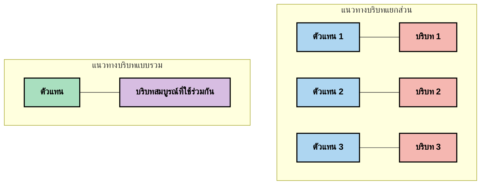
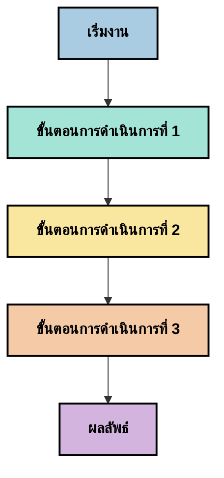
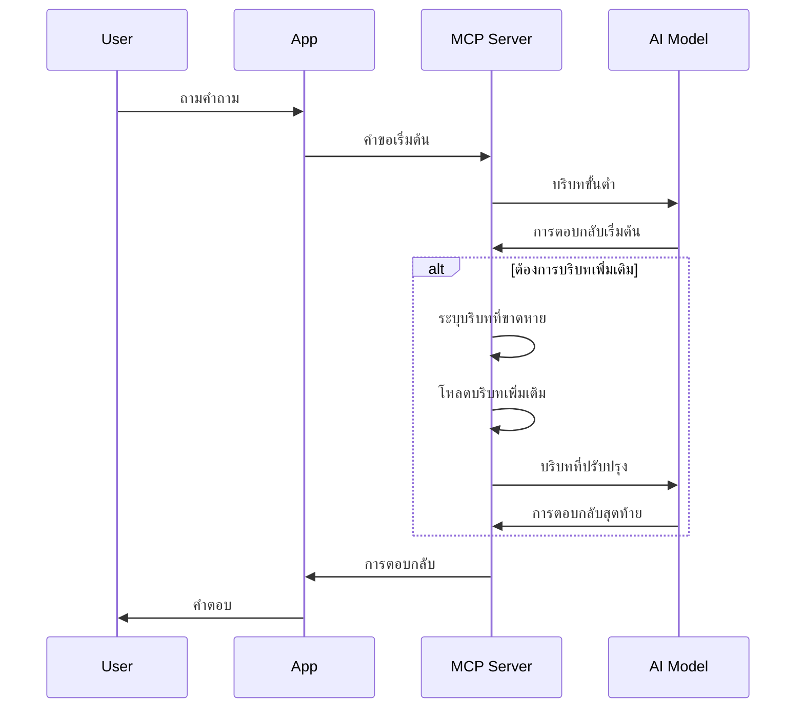
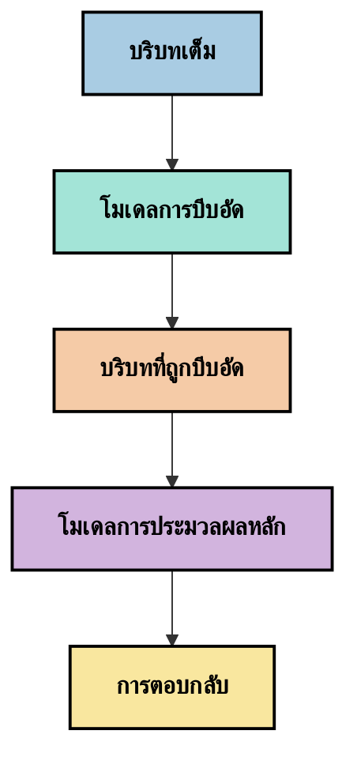
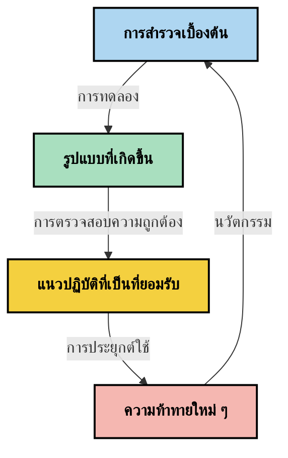

# วิศวกรรมบริบท: แนวคิดเกิดใหม่ในระบบนิเวศ MCP

## ภาพรวม

วิศวกรรมบริบทเป็นแนวคิดเกิดใหม่ในพื้นที่ AI ที่สำรวจวิธีการจัดโครงสร้างข้อมูล การส่งมอบ และการบำรุงรักษาตลอดช่วงการโต้ตอบระหว่างลูกค้าและบริการ AI เมื่อระบบนิเวศของโปรโตคอลบริบทโมเดล (Model Context Protocol - MCP) พัฒนา ความเข้าใจว่าควรบริหารบริบทอย่างไรอย่างมีประสิทธิภาพจึงมีความสำคัญมากยิ่งขึ้น โมดูลนี้แนะนำแนวคิดวิศวกรรมบริบทและสำรวจการใช้งานที่อาจเกิดขึ้นในระบบ MCP

## วัตถุประสงค์การเรียนรู้

เมื่อจบโมดูลนี้ คุณจะสามารถ:

- เข้าใจแนวคิดเกิดใหม่ของวิศวกรรมบริบทและบทบาทที่อาจเป็นไปได้ในแอปพลิเคชัน MCP
- ระบุความท้าทายหลักในการจัดการบริบทที่การออกแบบโปรโตคอล MCP แก้ไข
- สำรวจเทคนิคเพื่อปรับปรุงประสิทธิภาพโมเดลผ่านการจัดการบริบทที่ดีขึ้น
- พิจารณาวิธีการวัดและประเมินประสิทธิผลของบริบท
- นำแนวคิดเกิดใหม่นี้ไปประยุกต์ใช้เพื่อปรับปรุงประสบการณ์ AI ผ่านกรอบ MCP

## บทนำสู่วิศวกรรมบริบท

วิศวกรรมบริบทเป็นแนวคิดเกิดใหม่ที่มุ่งเน้นการออกแบบและการจัดการการไหลของข้อมูลระหว่างผู้ใช้ แอปพลิเคชัน และโมเดล AI อย่างมีเจตนา แตกต่างจากสาขาที่จัดตั้งขึ้น เช่น วิศวกรรมพรอมต์ วิศวกรรมบริบทยังคงถูกกำหนดโดยผู้ปฏิบัติงานในขณะที่พวกเขาพยายามแก้ไขความท้าทายเฉพาะของการให้ข้อมูลที่ถูกต้องในเวลาที่เหมาะสมแก่โมเดล AI

เมื่อโมเดลภาษาใหญ่ (LLMs) พัฒนาขึ้น ความสำคัญของบริบทก็ปรากฏเด่นชัดมากขึ้น คุณภาพ ความเกี่ยวข้อง และโครงสร้างของบริบทที่เรามอบให้นั้นส่งผลโดยตรงต่อผลลัพธ์ของโมเดล วิศวกรรมบริบทสำรวจความสัมพันธ์นี้และพยายามพัฒนาหลักการในการจัดการบริบทอย่างมีประสิทธิภาพ

> "ในปี 2025 โมเดลต่างๆ ที่มีอยู่ฉลาดมาก แต่แม้แต่มนุษย์ที่ฉลาดที่สุดก็ไม่สามารถทำงานได้อย่างมีประสิทธิภาพหากไม่มีบริบทของสิ่งที่ถูกขอให้ทำ... 'วิศวกรรมบริบท' คือระดับถัดไปของวิศวกรรมพรอมต์ คือการทำสิ่งนี้โดยอัตโนมัติในระบบที่มีการเปลี่ยนแปลงแบบไดนามิก" — Walden Yan, Cognition AI

วิศวกรรมบริบทอาจครอบคลุมถึง:

1. **การเลือกบริบท**: การกำหนดว่าสารสนเทศใดเกี่ยวข้องกับงานที่กำหนด
2. **การจัดโครงสร้างบริบท**: การจัดระเบียบข้อมูลเพื่อเพิ่มความเข้าใจของโมเดล
3. **การส่งมอบบริบท**: การเพิ่มประสิทธิภาพวิธีและเวลาที่ข้อมูลถูกส่งไปยังโมเดล
4. **การบำรุงรักษาบริบท**: การจัดการสถานะและการพัฒนาของบริบทเมื่อเวลาผ่านไป
5. **การประเมินบริบท**: การวัดและปรับปรุงประสิทธิผลของบริบท

ด้านเหล่านี้เกี่ยวข้องอย่างยิ่งกับระบบนิเวศ MCP ซึ่งให้วิธีการมาตรฐานแก่แอปพลิเคชันเพื่อให้บริบทกับ LLMs


## มุมมองการเดินทางของบริบท

หนึ่งในวิธีที่จะมองเห็นวิศวกรรมบริบทคือการติดตามเส้นทางของข้อมูลผ่านระบบ MCP:


### ขั้นตอนสำคัญในการเดินทางของบริบท:

1. **ข้อมูลนำเข้าจากผู้ใช้**: ข้อมูลดิบจากผู้ใช้ (ข้อความ, ภาพ, เอกสาร)
2. **การประกอบบริบท**: การรวมข้อมูลนำเข้าจากผู้ใช้กับบริบทระบบ ประวัติการสนทนา และข้อมูลอื่นๆ ที่ดึงมา
3. **การประมวลผลของโมเดล**: โมเดล AI ประมวลผลบริบทที่ประกอบแล้ว
4. **การสร้างคำตอบ**: โมเดลผลิตผลลัพธ์ตามบริบทที่ให้ไว้
5. **การจัดการสถานะ**: ระบบอัปเดตสถานะภายในตามการโต้ตอบ

มุมมองนี้เน้นธรรมชาติไดนามิกของบริบทในระบบ AI และยกคำถามสำคัญเกี่ยวกับวิธีการจัดการข้อมูลในแต่ละขั้นตอนอย่างเหมาะสม

## หลักการเกิดใหม่ในวิศวกรรมบริบท

เมื่อสาขาวิศวกรรมบริบทเริ่มเป็นรูปเป็นร่าง หลักการเบื้องต้นบางอย่างก็เริ่มเกิดขึ้นจากผู้ปฏิบัติงาน หลักการเหล่านี้อาจช่วยชี้แนะแนวทางการนำ MCP ไปใช้:

### หลักการที่ 1: แบ่งปันบริบทอย่างครบถ้วน

ควรแชร์บริบทอย่างครบถ้วนระหว่างส่วนประกอบทั้งหมดของระบบ แทนที่จะกระจัดกระจายไปยังตัวแทนหรือกระบวนการหลายส่วน เมื่อบริบทถูกแจกจ่าย การตัดสินใจที่ทำในส่วนหนึ่งของระบบอาจขัดแย้งกับส่วนอื่น



ในแอปพลิเคชัน MCP สิ่งนี้ชี้ให้เห็นว่าควรออกแบบระบบที่บริบทไหลผ่านระบบทั้งหมดอย่างต่อเนื่องแทนที่จะถูกแยกเป็นส่วนๆ

### หลักการที่ 2: รับรู้ว่าการกระทำมีการตัดสินใจโดยนัย

ทุกการกระทำที่โมเดลทำมีการตัดสินใจโดยนัยเกี่ยวกับวิธีตีความบริบท เมื่อส่วนประกอบหลายตัวทำงานบนบริบทต่างกัน การตัดสินใจโดยนัยเหล่านี้อาจขัดแย้งกัน ส่งผลให้ผลลัพธ์ไม่สอดคล้อง

หลักการนี้มีผลสำคัญต่อแอปพลิเคชัน MCP:
- ควรประมวลผลงานซับซ้อนแบบขั้นตอนเดียวมากกว่าการประมวลผลพร้อมกันที่มีบริบทแยกส่วน
- ให้จุดตัดสินใจทั้งหมดเข้าถึงข้อมูลบริบทเดียวกัน
- ออกแบบระบบที่ขั้นตอนหลังเห็นบริบททั้งหมดของการตัดสินใจก่อนหน้าได้

### หลักการที่ 3: สมดุลความลึกของบริบทกับข้อจำกัดหน้าต่าง

เมื่อการสนทนาและกระบวนการยาวขึ้น หน้าต่างบริบทจะล้นอย่างหลีกเลี่ยงไม่ได้ วิศวกรรมบริบทที่มีประสิทธิภาพจึงสำรวจวิธีการบริหารความตึงเครียดระหว่างบริบทครบถ้วนกับข้อจำกัดทางเทคนิค

วิธีการที่กำลังศึกษาได้แก่:
- การบีบอัดบริบทที่รักษาข้อมูลสำคัญพร้อมลดการใช้โทเคน
- การโหลดบริบทแบบก้าวหน้าโดยอิงความเกี่ยวข้องกับความต้องการปัจจุบัน
- การสรุปการโต้ตอบก่อนหน้าโดยรักษาการตัดสินใจและข้อเท็จจริงสำคัญ

## ความท้าทายบริบทและการออกแบบโปรโตคอล MCP

โปรโตคอลบริบทโมเดล (MCP) ถูกออกแบบด้วยความเข้าใจความท้าทายเฉพาะในการจัดการบริบท การเข้าใจความท้าทายเหล่านี้ช่วยอธิบายแง่มุมสำคัญของการออกแบบโปรโตคอล MCP:


### ความท้าทายที่ 1: ข้อจำกัดขนาดหน้าต่างบริบท
โมเดล AI ส่วนใหญ่มีขนาดหน้าต่างบริบทคงที่ ซึ่งจำกัดปริมาณข้อมูลที่สามารถประมวลผลได้ในครั้งเดียว

**การตอบสนองการออกแบบ MCP:** 
- โปรโตคอลรองรับบริบทที่มีโครงสร้างและอิงทรัพยากรซึ่งสามารถอ้างอิงได้อย่างมีประสิทธิภาพ
- ทรัพยากรสามารถจัดหน้าและโหลดอย่างก้าวหน้าได้

### ความท้าทายที่ 2: การกำหนดความเกี่ยวข้อง
การกำหนดว่าสารสนเทศอะไรเกี่ยวข้องที่สุดสำหรับการใส่ในบริบทเป็นเรื่องยาก

**การตอบสนองการออกแบบ MCP:**
- เครื่องมือที่ยืดหยุ่นช่วยให้ดึงข้อมูลได้ตามความต้องการแบบไดนามิก
- ตารางพรอมต์ที่มีโครงสร้างช่วยให้จัดบริบทได้สม่ำเสมอ

### ความท้าทายที่ 3: การคงบริบท
การจัดการสถานะผ่านการโต้ตอบต้องการการติดตามบริบทอย่างระมัดระวัง

**การตอบสนองการออกแบบ MCP:**
- การจัดการเซสชันที่เป็นมาตรฐาน
- แบบแผนโต้ตอบที่กำหนดชัดเจนสำหรับวิวัฒนาการบริบท

### ความท้าทายที่ 4: บริบทแบบมัลติ-โหมด
ข้อมูลชนิดต่าง ๆ (ข้อความ, ภาพ, ข้อมูลมีโครงสร้าง) ต้องการการจัดการที่แตกต่างกัน

**การตอบสนองการออกแบบ MCP:**
- การออกแบบโปรโตคอลรองรับประเภทเนื้อหาต่าง ๆ
- การแทนข้อมูลมัลติ-โหมดด้วยมาตรฐาน

### ความท้าทายที่ 5: ความปลอดภัยและความเป็นส่วนตัว
บริบทมักประกอบด้วยข้อมูลที่ละเอียดอ่อนซึ่งต้องได้รับการปกป้อง

**การตอบสนองการออกแบบ MCP:**
- กำหนดความรับผิดชอบระหว่างลูกค้าและเซิร์ฟเวอร์อย่างชัดเจน
- ตัวเลือกการประมวลผลในเครื่องเพื่อลดการเปิดเผยข้อมูล

ความเข้าใจในความท้าทายเหล่านี้และวิธีที่ MCP จัดการช่วยวางรากฐานสำหรับการสำรวจเทคนิควิศวกรรมบริบทที่ก้าวหน้าขึ้น

## แนวทางวิศวกรรมบริบทที่เกิดขึ้น

เมื่อสาขาวิศวกรรมบริบทพัฒนา หลายแนวทางที่น่าสนใจก็กำลังเกิดขึ้น เหล่านี้เป็นความคิดในปัจจุบันมากกว่าการปฏิบัติที่ได้รับการยอมรับ และอาจพัฒนาไปตามประสบการณ์กับการใช้งาน MCP

### 1. การประมวลผลเชิงเส้นแบบสตรีมเดียว

แตกต่างจากสถาปัตยกรรมหลายตัวแทนที่แจกจ่ายบริบท ผู้ปฏิบัติงานบางคนพบว่าการประมวลผลเชิงเส้นแบบสตรีมเดียวให้ผลลัพธ์ที่สอดคล้องมากกว่า ซึ่งสอดคล้องกับหลักการการรักษาบริบทที่เป็นเอกภาพ



แม้ว่าวิธีนี้อาจดูไม่มีประสิทธิภาพเท่าการประมวลผลพร้อมกัน แต่บ่อยครั้งจะให้ผลลัพธ์ที่สอดคล้องและเชื่อถือได้มากกว่าเพราะแต่ละขั้นตอนสร้างจากความเข้าใจสมบูรณ์ของการตัดสินใจก่อนหน้า

### 2. การแบ่งและจัดลำดับความสำคัญของบริบท

การแบ่งบริบทขนาดใหญ่ให้เป็นชิ้นส่วนที่จัดการได้และจัดลำดับความสำคัญสิ่งที่สำคัญที่สุด

```python
# ตัวอย่างแนวคิด: การแบ่งส่วนเนื้อหาและการจัดลำดับความสำคัญบริบท
def process_with_chunked_context(documents, query):
    # 1. แบ่งเอกสารออกเป็นส่วนย่อยๆ
    chunks = chunk_documents(documents)
    
    # 2. คำนวณคะแนนความเกี่ยวข้องสำหรับแต่ละส่วน
    scored_chunks = [(chunk, calculate_relevance(chunk, query)) for chunk in chunks]
    
    # 3. จัดเรียงส่วนต่างๆ ตามคะแนนความเกี่ยวข้อง
    sorted_chunks = sorted(scored_chunks, key=lambda x: x[1], reverse=True)
    
    # 4. ใช้ส่วนที่เกี่ยวข้องมากที่สุดเป็นบริบท
    context = create_context_from_chunks([chunk for chunk, score in sorted_chunks[:5]])
    
    # 5. ประมวลผลด้วยบริบทที่จัดลำดับความสำคัญไว้แล้ว
    return generate_response(context, query)
```

แนวคิดด้านบนแสดงตัวอย่างว่าคุณอาจแบ่งเอกสารขนาดใหญ่เป็นชิ้นที่จัดการได้และเลือกเฉพาะส่วนที่เกี่ยวข้องที่สุดสำหรับบริบท วิธีนี้ช่วยให้ทำงานภายใต้ข้อจำกัดของหน้าต่างบริบทได้ ขณะเดียวกันก็ยังใช้ฐานความรู้ขนาดใหญ่ได้

### 3. การโหลดบริบทย่างก้าวหน้า

การโหลดบริบทแบบก้าวหน้าตามความจำเป็น แทนที่จะโหลดทั้งหมดพร้อมกัน



การโหลดบริบทแบบก้าวหน้าเริ่มด้วยบริบทน้อยที่สุดและขยายเมื่อจำเป็นเท่านั้น ซึ่งสามารถลดการใช้โทเคนได้อย่างมากสำหรับคำถามง่าย ๆ ขณะเดียวกันก็ยังรักษาความสามารถในการจัดการคำถามซับซ้อนได้

### 4. การบีบอัดและสรุปบริบท

การลดขนาดบริบทพร้อมรักษาข้อมูลสำคัญ



การบีบอัดบริบทเน้นที่:
- การนำข้อมูลซ้ำซ้อนออก
- การสรุปเนื้อหายาว ๆ
- การสกัดข้อเท็จจริงและรายละเอียดที่สำคัญ
- การรักษาองค์ประกอบบริบทที่สำคัญ
- การเพิ่มประสิทธิภาพการใช้โทเคน

วิธีนี้มีคุณค่าอย่างยิ่งสำหรับการรักษาการสนทนายาวภายในหน้าต่างบริบท หรือสำหรับประมวลผลเอกสารยาวอย่างมีประสิทธิภาพ ผู้ปฏิบัติงานบางคนใช้โมเดลเฉพาะเพื่อบีบอัดบริบทและสรุปประวัติการสนทนาโดยเฉพาะ


## ข้อควรพิจารณาสำหรับวิศวกรรมบริบทเชิงสำรวจ

เมื่อเราสำรวจสาขาวิศวกรรมบริบทที่เกิดใหม่ มีข้อควรพิจารณาหลายประการที่ควรจดจำเมื่อนำไปใช้กับการใช้งาน MCP เหล่านี้ไม่ใช่วิธีปฏิบัติที่กำหนดแน่นอน แต่เป็นพื้นที่สำรวจที่อาจช่วยพัฒนาการใช้งานของคุณได้

### พิจารณาเป้าหมายบริบทของคุณ

ก่อนจะนำโซลูชันการจัดการบริบทที่ซับซ้อนมาใช้ ให้ระบุอย่างชัดเจนว่าคุณต้องการบรรลุอะไร:
- โมเดลต้องการข้อมูลเฉพาะอะไรบ้างเพื่อความสำเร็จ?
- ข้อมูลใดจำเป็นและข้อมูลใดเป็นเสริม?
- ข้อจำกัดด้านประสิทธิภาพของคุณคืออะไร (ความหน่วง, ข้อจำกัดโทเคน, ค่าใช้จ่าย)?

### สำรวจแนวทางบริบทแบบชั้น

ผู้ปฏิบัติงานบางรายพบความสำเร็จกับบริบทจัดเป็นชั้นเชิงแนวคิด:
- **ชั้นหลัก**: ข้อมูลจำเป็นที่โมเดลต้องการเสมอ
- **ชั้นสถานการณ์**: บริบทที่เฉพาะเจาะจงสำหรับการโต้ตอบปัจจุบัน
- **ชั้นสนับสนุน**: ข้อมูลเพิ่มเติมที่อาจช่วยได้
- **ชั้นสำรอง**: ข้อมูลที่เข้าถึงได้เฉพาะเมื่อจำเป็น

### ศึกษากลยุทธ์การดึงข้อมูล

ประสิทธิผลของบริบทของคุณมักขึ้นกับวิธีการดึงข้อมูล:
- การค้นหาเชิงความหมายและฝังตัวเพื่อค้นหาข้อมูลที่เกี่ยวข้องในเชิงแนวคิด
- การค้นหาด้วยคำสำคัญสำหรับรายละเอียดข้อเท็จจริงเฉพาะ
- วิธีการผสมผสานที่รวมหลายวิธีการดึงข้อมูล
- การกรองเมตาดาต้าเพื่อลดขอบเขตโดยอิงหมวดหมู่ วันที่ หรือแหล่งข้อมูล

### ทดลองความสอดคล้องของบริบท

โครงสร้างและการไหลของบริบทอาจส่งผลต่อความเข้าใจของโมเดล:
- การจัดกลุ่มข้อมูลที่เกี่ยวข้องกัน
- การใช้รูปแบบและการจัดระเบียบที่สม่ำเสมอ
- การรักษาลำดับตรรกะหรือเวลาที่เหมาะสม
- การหลีกเลี่ยงข้อมูลที่ขัดแย้งกัน

### พิจารณาข้อดีข้อเสียของสถาปัตยกรรมหลายตัวแทน

แม้ว่าสถาปัตยกรรมหลายตัวแทนจะนิยมในหลายกรอบ AI แต่ก็มาพร้อมกับความท้าทายสำคัญในการจัดการบริบท:
- การกระจัดกระจายบริบทอาจนำไปสู่การตัดสินใจที่ไม่สอดคล้องกันระหว่างตัวแทน
- การประมวลผลพร้อมกันอาจก่อให้เกิดข้อขัดแย้งซึ่งยากต่อการแก้ไข
- ภาระสื่อสารระหว่างตัวแทนอาจทำให้ประสิทธิภาพโดยรวมลดลง
- ต้องการการจัดการสถานะที่ซับซ้อนเพื่อรักษาความสอดคล้อง

ในหลายกรณี วิธีการตัวแทนเดียวที่มีการจัดการบริบทอย่างครบถ้วนอาจให้ผลลัพธ์ที่น่าเชื่อถือกว่าตัวแทนหลายตัวที่มีบริบทแยกส่วน

### พัฒนาวิธีการประเมินผล

เพื่อปรับปรุงวิศวกรรมบริบทตามเวลา ให้พิจารณาว่าคุณจะวัดความสำเร็จอย่างไร:
- การทดสอบ A/B กับโครงสร้างบริบทต่าง ๆ
- การติดตามการใช้โทเคนและเวลาตอบกลับ
- การติดตามความพึงพอใจของผู้ใช้และอัตราการทำงานสำเร็จ
- การวิเคราะห์เวลาที่และเหตุผลที่กลยุทธ์บริบทล้มเหลว

ข้อควรพิจารณาเหล่านี้เป็นพื้นที่สำรวจที่แอคทีฟในสาขาวิศวกรรมบริบท เมื่อสาขานี้เติบโตขึ้น รูปแบบและวิธีปฏิบัติที่ชัดเจนกว่านี้น่าจะเกิดขึ้น

## การวัดประสิทธิผลของบริบท: กรอบงานที่กำลังพัฒนา

เมื่อวิศวกรรมบริบทเกิดขึ้นในฐานะแนวคิด ผู้ปฏิบัติงานเริ่มสำรวจวิธีวัดประสิทธิผลของมัน ยังไม่มีกรอบงานที่ได้รับการยอมรับ แต่มีการพิจารณาตัวชี้วัดหลายอย่างที่อาจช่วยนำทางงานในอนาคตได้

### มิติที่อาจใช้วัด


#### 1. ข้อพิจารณาประสิทธิภาพข้อมูลนำเข้า

- **อัตราส่วนบริบทต่อคำตอบ**: บริบทต้องใช้มากน้อยเท่าใดในเปรียบเทียบกับขนาดคำตอบ?
- **การใช้โทเคน**: เปอร์เซ็นต์ของโทเคนบริบทที่มีอิทธิพลต่อคำตอบเป็นเท่าใด?
- **การลดบริบท**: เราสามารถบีบอัดข้อมูลดิบได้อย่างมีประสิทธิภาพเพียงใด?

#### 2. ข้อพิจารณาด้านประสิทธิภาพ

- **ผลกระทบต่อความหน่วง**: การจัดการบริบทมีผลต่อเวลาตอบสนองอย่างไร?
- **เศรษฐกิจโทเคน**: เรากำลังใช้โทเคนอย่างมีประสิทธิภาพหรือไม่?
- **ความแม่นยำในการดึงข้อมูล**: ข้อมูลที่ดึงมามีความเกี่ยวข้องแค่ไหน?
- **การใช้ทรัพยากร**: ต้องการทรัพยากรคำนวณมากน้อยแค่ไหน?

#### 3. ข้อพิจารณาด้านคุณภาพ

- **ความเกี่ยวข้องของคำตอบ**: คำตอบตรงต่อคำถามมากน้อยเพียงใด?
- **ความถูกต้องของข้อเท็จจริง**: การจัดการบริบทช่วยเพิ่มความถูกต้องของข้อเท็จจริงไหม?
- **ความสอดคล้อง**: คำตอบมีความสอดคล้องกันในคำถามที่คล้ายกันหรือไม่?
- **อัตราการสร้างภาพลวงตา**: การบริหารบริบทที่ดีขึ้นช่วยลดอาการฮัลลูซิเนชันของโมเดลหรือไม่?

#### 4. ข้อพิจารณาประสบการณ์ผู้ใช้

- **อัตราการขอคำชี้แจง**: ผู้ใช้ต้องการคำชี้แจงบ่อยแค่ไหน?
- **การทำงานสำเร็จ**: ผู้ใช้สามารถบรรลุเป้าหมายได้สำเร็จหรือไม่?
- **ดัชนีความพึงพอใจ**: ผู้ใช้ให้คะแนนประสบการณ์ของตนอย่างไร?

### แนวทางการวัดเชิงสำรวจ

เมื่อทดลองวิศวกรรมบริบทในการใช้งาน MCP ให้พิจารณาแนวทางเชิงสำรวจเหล่านี้:

1. **การเปรียบเทียบพื้นฐาน**: กำหนดระดับพื้นฐานโดยใช้วิธีบริบทง่าย ๆ ก่อนทดสอบวิธีที่ซับซ้อนขึ้น

2. **การเปลี่ยนแปลงทีละน้อย**: เปลี่ยนแปลงการจัดการบริบททีละอย่างเพื่อแยกผลกระทบ

3. **การประเมินโดยผู้ใช้เป็นศูนย์กลาง**: รวมตัวชี้วัดเชิงปริมาณกับคำติชมเชิงคุณภาพจากผู้ใช้

4. **การวิเคราะห์ความล้มเหลว**: ตรวจสอบกรณีที่กลยุทธ์บริบทล้มเหลวเพื่อเข้าใจการปรับปรุงที่อาจเกิดขึ้น

5. **การประเมินหลายมิติ**: พิจารณาข้อแลกเปลี่ยนระหว่างประสิทธิภาพ คุณภาพ และประสบการณ์ผู้ใช้

แนวทางการวัดที่เป็นการทดลองและหลายแง่มุมนี้สอดคล้องกับลักษณะเกิดใหม่ของวิศวกรรมบริบท

## คำสรุป

วิศวกรรมบริบทเป็นพื้นที่สำรวจเกิดใหม่ที่อาจเป็นหัวใจสำคัญของแอปพลิเคชัน MCP ที่มีประสิทธิผล โดยพิจารณาอย่างรอบคอบถึงการไหลของข้อมูลในระบบของคุณ คุณอาจสร้างประสบการณ์ AI ที่มีประสิทธิภาพ ถูกต้อง และมีคุณค่ามากขึ้นสำหรับผู้ใช้

เทคนิคและแนวทางที่ระบุในโมดูลนี้แสดงถึงความคิดในช่วงเริ่มต้นในพื้นที่นี้ ไม่ใช่วิธีปฏิบัติที่ได้รับการยอมรับ วิศวกรรมบริบทอาจพัฒนาไปเป็นสาขาวิชาที่ชัดเจนยิ่งขึ้นเมื่อความสามารถของ AI ก้าวหน้าและความเข้าใจลึกซึ้งขึ้น ขณะนี้ การทดลองควบคู่กับการวัดผลอย่างรอบคอบดูเหมือนเป็นแนวทางที่มีประสิทธิผลที่สุด

## ทิศทางในอนาคตที่เป็นไปได้

สาขาวิศวกรรมบริบทยังอยู่ในช่วงแรก แต่มีทิศทางน่าสนใจหลายประการที่กำลังเกิดขึ้น:

- หลักการวิศวกรรมบริบทอาจส่งผลอย่างมากต่อประสิทธิภาพโมเดล ประสิทธิภาพ ประสบการณ์ผู้ใช้ และความน่าเชื่อถือ
- แนวทางสตรีมเดียวที่มีการจัดการบริบทอย่างครบถ้วนอาจทำงานดีกว่าสถาปัตยกรรมหลายตัวแทนในหลายกรณี
- โมเดลบีบอัดบริบทเฉพาะทางอาจกลายเป็นส่วนประกอบมาตรฐานในสายงาน AI
- ความตึงเครียดระหว่างความครบถ้วนของบริบทกับข้อจำกัดโทเคนอาจผลักดันนวัตกรรมในการจัดการบริบท
- เมื่อโมเดลสามารถสื่อสารแบบมนุษย์อย่างมีประสิทธิภาพมากขึ้น ความร่วมมือแบบมัลติ-เอเจนต์แท้จริงอาจเป็นไปได้มากขึ้น
- การใช้งาน MCP อาจพัฒนาไปสู่การมาตรฐานรูปแบบการจัดการบริบทที่เกิดจากการทดลองในปัจจุบัน



## แหล่งข้อมูล

### แหล่งข้อมูล MCP อย่างเป็นทางการ
- [Model Context Protocol Website](https://modelcontextprotocol.io/)
- [Model Context Protocol Specification](https://github.com/modelcontextprotocol/modelcontextprotocol)

- [เอกสาร MCP](https://modelcontextprotocol.io/docs)
- [MCP C# SDK](https://github.com/modelcontextprotocol/csharp-sdk)
- [MCP Python SDK](https://github.com/modelcontextprotocol/python-sdk)
- [MCP TypeScript SDK](https://github.com/modelcontextprotocol/typescript-sdk)
- [MCP Inspector](https://github.com/modelcontextprotocol/inspector) - เครื่องมือทดสอบเชิงภาพสำหรับเซิร์ฟเวอร์ MCP

### บทความวิศวกรรมบริบท
- [อย่าสร้างหลายเอเย่นต์: หลักการวิศวกรรมบริบท](https://cognition.ai/blog/dont-build-multi-agents) - ความคิดเห็นของ Walden Yan เกี่ยวกับหลักการวิศวกรรมบริบท
- [คู่มือปฏิบัติในการสร้างเอเย่นต์](https://cdn.openai.com/business-guides-and-resources/a-practical-guide-to-building-agents.pdf) - คู่มือของ OpenAI เกี่ยวกับการออกแบบเอเย่นต์อย่างมีประสิทธิภาพ
- [การสร้างเอเย่นต์ที่มีประสิทธิผล](https://www.anthropic.com/engineering/building-effective-agents) - แนวทางของ Anthropic ในการพัฒนาเอเย่นต์

### งานวิจัยที่เกี่ยวข้อง
- [การเสริมการเรียกค้นแบบไดนามิกสำหรับโมเดลภาษาใหญ่](https://arxiv.org/abs/2310.01487) - งานวิจัยเกี่ยวกับแนวทางการเรียกค้นแบบไดนามิก
- [หลงทางกลาง: วิธีที่โมเดลภาษาใช้บริบทยาว](https://arxiv.org/abs/2307.03172) - งานวิจัยสำคัญเกี่ยวกับรูปแบบการประมวลผลบริบท
- [การสร้างภาพที่มีโครงสร้างข้อความเป็นลำดับชั้นด้วย CLIP Latents](https://arxiv.org/abs/2204.06125) - บทความ DALL-E 2 พร้อมข้อคิดเห็นเกี่ยวกับการจัดโครงสร้างบริบท
- [การสำรวจบทบาทของบริบทในสถาปัตยกรรมโมเดลภาษาใหญ่](https://aclanthology.org/2023.findings-emnlp.124/) - งานวิจัยล่าสุดเกี่ยวกับการจัดการบริบท
- [ความร่วมมือแบบหลายเอเย่นต์: การสำรวจ](https://arxiv.org/abs/2304.03442) - งานวิจัยเกี่ยวกับระบบหลายเอเย่นต์และความท้าทายของพวกเขา

### แหล่งข้อมูลเพิ่มเติม
- [เทคนิคการเพิ่มประสิทธิภาพหน้าต่างบริบท](https://learn.microsoft.com/en-us/azure/ai-services/openai/concepts/context-window)
- [เทคนิค RAG ขั้นสูง](https://www.microsoft.com/en-us/research/blog/retrieval-augmented-generation-rag-and-frontier-models/)
- [เอกสาร Semantic Kernel](https://github.com/microsoft/semantic-kernel)
- [ชุดเครื่องมือ AI สำหรับการจัดการบริบท](https://github.com/microsoft/aitoolkit)

## ถัดไปคืออะไร

- [5.15 MCP Custom Transport](../mcp-transport/README.md)

---

<!-- CO-OP TRANSLATOR DISCLAIMER START -->
**ปฏิเสธความรับผิดชอบ**:
เอกสารนี้ได้รับการแปลโดยใช้บริการแปลภาษา AI [Co-op Translator](https://github.com/Azure/co-op-translator) ขณะที่เราพยายามให้ความถูกต้อง โปรดทราบว่าการแปลโดยอัตโนมัติอาจมีข้อผิดพลาดหรือความไม่ถูกต้อง เอกสารต้นฉบับในภาษาต้นทางควรถูกพิจารณาเป็นแหล่งข้อมูลที่เชื่อถือได้ สำหรับข้อมูลที่สำคัญ แนะนำให้ใช้การแปลโดยมนุษย์มืออาชีพ เราไม่รับผิดชอบต่อความเข้าใจผิดหรือการตีความที่ผิดพลาดที่เกิดขึ้นจากการใช้การแปลนี้
<!-- CO-OP TRANSLATOR DISCLAIMER END -->