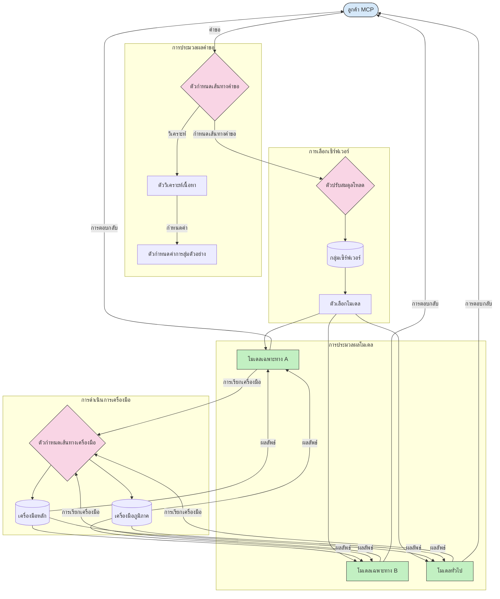

# การกำหนดเส้นทางในโปรโตคอลบริบทของโมเดล

การกำหนดเส้นทางเป็นสิ่งสำคัญสำหรับการนำคำขอไปยังโมเดล เครื่องมือ หรือบริการที่เหมาะสมภายในระบบ MCP

## บทนำ

การกำหนดเส้นทางในโปรโตคอลบริบทของโมเดล (MCP) เกี่ยวข้องกับการนำคำขอไปยังโมเดลหรือบริการที่เหมาะสมที่สุดโดยอิงตามเกณฑ์ต่างๆ เช่น ประเภทเนื้อหา บริบทของผู้ใช้ และภาระงานของระบบ ซึ่งช่วยให้การประมวลผลมีประสิทธิภาพและใช้ทรัพยากรได้อย่างเหมาะสม

## วัตถุประสงค์การเรียนรู้

เมื่อเรียนจบบทนี้ คุณจะสามารถ:

- เข้าใจหลักการกำหนดเส้นทางใน MCP
- ใช้การกำหนดเส้นทางแบบเนื้อหาเพื่อส่งคำขอไปยังบริการเฉพาะทาง
- ใช้กลยุทธ์การปรับสมดุลภาระงานอัจฉริยะเพื่อเพิ่มประสิทธิภาพการใช้ทรัพยากร
- ใช้การกำหนดเส้นทางของเครื่องมือแบบไดนามิกโดยอิงตามบริบทของคำขอ

## การกำหนดเส้นทางแบบเนื้อหา

การกำหนดเส้นทางแบบเนื้อหาจะนำคำขอไปยังบริการเฉพาะทางตามเนื้อหาของคำขอ เช่น คำขอที่เกี่ยวข้องกับการสร้างโค้ดสามารถกำหนดเส้นทางไปยังโมเดลโค้ดเฉพาะทาง ขณะที่คำขอเขียนเชิงสร้างสรรค์จะถูกส่งไปยังโมเดลเขียนเชิงสร้างสรรค์

มาดูตัวอย่างการใช้งานในภาษาโปรแกรมต่างๆ

<details>
<summary>.NET</summary>

```csharp
// .NET Example: Content-based routing in MCP
public class ContentBasedRouter
{
    private readonly Dictionary<string, McpClient> _specializedClients;
    private readonly RoutingClassifier _classifier;
    
    public ContentBasedRouter()
    {
        // Initialize specialized clients for different domains
        _specializedClients = new Dictionary<string, McpClient>
        {
            ["code"] = new McpClient("https://code-specialized-mcp.com"),
            ["creative"] = new McpClient("https://creative-specialized-mcp.com"),
            ["scientific"] = new McpClient("https://scientific-specialized-mcp.com"),
            ["general"] = new McpClient("https://general-mcp.com")
        };
        
        // Initialize content classifier
        _classifier = new RoutingClassifier();
    }
    
    public async Task<McpResponse> RouteAndProcessAsync(string prompt, IDictionary<string, object> parameters = null)
    {
        // Classify the prompt to determine the best specialized service
        string category = await _classifier.ClassifyPromptAsync(prompt);
        
        // Get the appropriate client or fall back to general
        var client = _specializedClients.ContainsKey(category) 
            ? _specializedClients[category] 
            : _specializedClients["general"];
            
        Console.WriteLine($"Routing request to {category} specialized service");
        
        // Send request to the selected service
        return await client.SendPromptAsync(prompt, parameters);
    }
    
    // Simple classifier for routing decisions
    private class RoutingClassifier
    {
        public Task<string> ClassifyPromptAsync(string prompt)
        {
            prompt = prompt.ToLowerInvariant();
            
            if (prompt.Contains("code") || prompt.Contains("function") || 
                prompt.Contains("program") || prompt.Contains("algorithm"))
            {
                return Task.FromResult("code");
            }
            
            if (prompt.Contains("story") || prompt.Contains("creative") || 
                prompt.Contains("imagine") || prompt.Contains("design"))
            {
                return Task.FromResult("creative");
            }
            
            if (prompt.Contains("science") || prompt.Contains("research") || 
                prompt.Contains("analyze") || prompt.Contains("study"))
            {
                return Task.FromResult("scientific");
            }
            
            return Task.FromResult("general");
        }
    }
}
```

ในโค้ดข้างต้น เราได้:

- สร้างคลาส `ContentBasedRouter` ที่กำหนดเส้นทางคำขอตามเนื้อหาของพรอมต์
- เริ่มต้นไคลเอนต์เฉพาะทางสำหรับโดเมนต่างๆ (โค้ด สร้างสรรค์ วิทยาศาสตร์ ทั่วไป)
- ใช้ตัวจัดหมวดหมู่แบบง่ายที่กำหนดประเภทของพรอมต์และกำหนดเส้นทางไปยังบริการเฉพาะทางที่เหมาะสม
- ใช้กลไกสำรองเพื่อกำหนดเส้นทางคำขอไปยังบริการทั่วไปหากไม่มีบริการเฉพาะทาง
- ใช้การประมวลผลแบบอะซิงโครนัสเพื่อจัดการคำขออย่างมีประสิทธิภาพ
- ใช้พจนานุกรมในการแมปประเภทเนื้อหาไปยังไคลเอนต์ MCP เฉพาะทาง
- ใช้ตัวจัดหมวดหมู่แบบง่ายที่วิเคราะห์พรอมต์และคืนค่าประเภทที่เหมาะสม
- ใช้ไคลเอนต์เฉพาะทางในการส่งคำขอและรับคำตอบ
- จัดการกรณีที่พรอมต์ไม่ตรงกับหมวดหมู่เฉพาะทางใดโดยกำหนดเส้นทางไปยังบริการทั่วไป

</details>

## การปรับสมดุลภาระงานอัจฉริยะ

การปรับสมดุลภาระงานช่วยเพิ่มประสิทธิภาพการใช้ทรัพยากรและประกันความพร้อมใช้งานสูงสำหรับบริการ MCP มีหลายวิธีในการปรับสมดุลภาระงาน เช่น แบบรอบหมุน เวลาเฉลี่ยตอบสนองถ่วงน้ำหนัก หรือกลยุทธ์ที่ตระหนักถึงเนื้อหา

มาดูตัวอย่างการใช้งานด้านล่างที่ใช้กลยุทธ์ดังต่อไปนี้:

- **รอบหมุน (Round Robin)**: กระจายคำขออย่างเท่าเทียมกันไปยังเซิร์ฟเวอร์ที่พร้อมใช้งาน
- **เวลาเฉลี่ยตอบสนองถ่วงน้ำหนัก (Weighted Response Time)**: กำหนดเส้นทางคำขอไปยังเซิร์ฟเวอร์ตามเวลาเฉลี่ยตอบสนอง
- **ตระหนักถึงเนื้อหา (Content-Aware)**: กำหนดเส้นทางคำขอไปยังเซิร์ฟเวอร์เฉพาะทางตามเนื้อหาของคำขอ

<details>
<summary>Java</summary>

```java
// ตัวอย่าง Java: การปรับสมดุลโหลดอัจฉริยะสำหรับเซิร์ฟเวอร์ MCP
public class McpLoadBalancer {
    private final List<McpServerNode> serverNodes;
    private final LoadBalancingStrategy strategy;
    
    public McpLoadBalancer(List<McpServerNode> nodes, LoadBalancingStrategy strategy) {
        this.serverNodes = new ArrayList<>(nodes);
        this.strategy = strategy;
    }
    
    public McpResponse processRequest(McpRequest request) {
        // เลือกเซิร์ฟเวอร์ที่ดีที่สุดโดยอิงตามกลยุทธ์
        McpServerNode selectedNode = strategy.selectNode(serverNodes, request);
        
        try {
            // ส่งคำขอไปยังโหนดที่เลือก
            return selectedNode.processRequest(request);
        } catch (Exception e) {
            // จัดการความล้มเหลว - ใช้ตรรกะการลองใหม่หรือสำรอง
            System.err.println("Error processing request on node " + selectedNode.getId() + ": " + e.getMessage());
            
            // ติ๊กเครื่องหมายโหนดว่าอาจไม่แข็งแรง
            selectedNode.recordFailure();
            
            // ลองโหนดที่ดีที่สุดถัดไปเป็นสำรอง
            List<McpServerNode> remainingNodes = new ArrayList<>(serverNodes);
            remainingNodes.remove(selectedNode);
            
            if (!remainingNodes.isEmpty()) {
                McpServerNode fallbackNode = strategy.selectNode(remainingNodes, request);
                return fallbackNode.processRequest(request);
            } else {
                throw new RuntimeException("All MCP server nodes failed to process the request");
            }
        }
    }
    
    // งานตรวจสอบสุขภาพโหนด
    public void startHealthChecks(Duration interval) {
        ScheduledExecutorService scheduler = Executors.newScheduledThreadPool(1);
        scheduler.scheduleAtFixedRate(() -> {
            for (McpServerNode node : serverNodes) {
                try {
                    boolean isHealthy = node.checkHealth();
                    System.out.println("Node " + node.getId() + " health status: " + 
                                      (isHealthy ? "HEALTHY" : "UNHEALTHY"));
                } catch (Exception e) {
                    System.err.println("Health check failed for node " + node.getId());
                    node.setHealthy(false);
                }
            }
        }, 0, interval.toMillis(), TimeUnit.MILLISECONDS);
    }
    
    // อินเทอร์เฟซสำหรับกลยุทธ์การปรับสมดุลโหลด
    public interface LoadBalancingStrategy {
        McpServerNode selectNode(List<McpServerNode> nodes, McpRequest request);
    }
    
    // กลยุทธ์รอบวงกลม
    public static class RoundRobinStrategy implements LoadBalancingStrategy {
        private AtomicInteger counter = new AtomicInteger(0);
        
        @Override
        public McpServerNode selectNode(List<McpServerNode> nodes, McpRequest request) {
            List<McpServerNode> healthyNodes = nodes.stream()
                .filter(McpServerNode::isHealthy)
                .collect(Collectors.toList());
            
            if (healthyNodes.isEmpty()) {
                throw new RuntimeException("No healthy nodes available");
            }
            
            int index = counter.getAndIncrement() % healthyNodes.size();
            return healthyNodes.get(index);
        }
    }
    
    // กลยุทธ์เวลาตอบสนองถ่วงน้ำหนัก
    public static class ResponseTimeStrategy implements LoadBalancingStrategy {
        @Override
        public McpServerNode selectNode(List<McpServerNode> nodes, McpRequest request) {
            return nodes.stream()
                .filter(McpServerNode::isHealthy)
                .min(Comparator.comparing(McpServerNode::getAverageResponseTime))
                .orElseThrow(() -> new RuntimeException("No healthy nodes available"));
        }
    }
    
    // กลยุทธ์ตระหนักถึงเนื้อหา
    public static class ContentAwareStrategy implements LoadBalancingStrategy {
        @Override
        public McpServerNode selectNode(List<McpServerNode> nodes, McpRequest request) {
            // กำหนดลักษณะคำขอ
            boolean isCodeRequest = request.getPrompt().contains("code") || 
                                   request.getAllowedTools().contains("codeInterpreter");
            
            boolean isCreativeRequest = request.getPrompt().contains("creative") || 
                                       request.getPrompt().contains("story");
            
            // ค้นหาโหนดเฉพาะทาง
            Optional<McpServerNode> specializedNode = nodes.stream()
                .filter(McpServerNode::isHealthy)
                .filter(node -> {
                    if (isCodeRequest && node.getSpecialization().equals("code")) {
                        return true;
                    }
                    if (isCreativeRequest && node.getSpecialization().equals("creative")) {
                        return true;
                    }
                    return false;
                })
                .findFirst();
            
            // คืนค่าโหนดเฉพาะทางหรือโหนดที่มีโหลดน้อยที่สุด
            return specializedNode.orElse(
                nodes.stream()
                    .filter(McpServerNode::isHealthy)
                    .min(Comparator.comparing(McpServerNode::getCurrentLoad))
                    .orElseThrow(() -> new RuntimeException("No healthy nodes available"))
            );
        }
    }
}
```

ในโค้ดข้างต้น เราได้:

- สร้างคลาส `McpLoadBalancer` ที่จัดการรายการโหนดเซิร์ฟเวอร์ MCP และกำหนดเส้นทางคำขอตามกลยุทธ์การปรับสมดุลภาระงานที่เลือก
- ใช้กลยุทธ์การปรับสมดุลภาระงานที่แตกต่างกัน ได้แก่ `RoundRobinStrategy` `ResponseTimeStrategy` และ `ContentAwareStrategy`
- ใช้ `ScheduledExecutorService` เพื่อตรวจสอบสุขภาพของโหนดเซิร์ฟเวอร์เป็นระยะ
- ใช้กลไกตรวจสอบสุขภาพที่ทำเครื่องหมายโหนดเป็นสุขภาพดีหรือไม่ดีตามการตอบสนองต่อการตรวจสอบสุขภาพ
- จัดการการประมวลผลคำขอพร้อมกับการจัดการข้อผิดพลาดและตรรกะสำรองเพื่อรับประกันความพร้อมใช้งานสูง
- ใช้คลาส `McpServerNode` เพื่อแทนโหนดเซิร์ฟเวอร์ MCP แต่ละโหนด รวมถึงสถานะสุขภาพ เวลาเฉลี่ยตอบสนอง และภาระงานปัจจุบัน
- สร้างคลาส `McpRequest` เพื่อเก็บรายละเอียดคำขอ เช่น พรอมต์และเครื่องมือที่อนุญาต
- ใช้ Java Streams เพื่อกรองและเลือกโหนดตามสถานะสุขภาพและความเชี่ยวชาญเฉพาะด้าน

</details>

## การกำหนดเส้นทางเครื่องมือแบบไดนามิก

การกำหนดเส้นทางเครื่องมือทำให้การเรียกใช้เครื่องมือถูกส่งไปยังบริการที่เหมาะสมที่สุดตามบริบท เช่น การเรียกเครื่องมือสภาพอากาศอาจต้องกำหนดเส้นทางไปยังจุดปลายภูมิภาคตามตำแหน่งผู้ใช้ หรือเครื่องมือเครื่องคิดเลขอาจต้องใช้เวอร์ชัน API เฉพาะ

มาดูตัวอย่างการใช้งานที่แสดงการกำหนดเส้นทางเครื่องมือแบบไดนามิกโดยอิงจากการวิเคราะห์คำขอ จุดปลายภูมิภาค และการรองรับเวอร์ชัน

<details>
<summary>Python</summary>

```python
# ตัวอย่าง Python: การกำหนดเส้นทางเครื่องมือแบบไดนามิกโดยอิงจากการวิเคราะห์คำขอ
class McpToolRouter:
    def __init__(self):
        # ลงทะเบียนปลายทางเครื่องมือที่ใช้ได้
        self.tool_endpoints = {
            "weatherTool": "https://weather-service.example.com/api",
            "calculatorTool": "https://calculator-service.example.com/compute",
            "databaseTool": "https://database-service.example.com/query",
            "searchTool": "https://search-service.example.com/search"
        }
        
        # ปลายทางตามภูมิภาคสำหรับการกระจายทั่วโลก
        self.regional_endpoints = {
            "us": {
                "weatherTool": "https://us-west.weather-service.example.com/api",
                "searchTool": "https://us.search-service.example.com/search"
            },
            "europe": {
                "weatherTool": "https://eu.weather-service.example.com/api",
                "searchTool": "https://eu.search-service.example.com/search"
            },
            "asia": {
                "weatherTool": "https://asia.weather-service.example.com/api",
                "searchTool": "https://asia.search-service.example.com/search"
            }
        }
        
        # รองรับการกำหนดเวอร์ชันเครื่องมือ
        self.tool_versions = {
            "weatherTool": {
                "default": "v2",
                "v1": "https://weather-service.example.com/api/v1",
                "v2": "https://weather-service.example.com/api/v2",
                "beta": "https://weather-service.example.com/api/beta"
            }
        }
    
    async def route_tool_request(self, tool_name, parameters, user_context=None):
        """Route a tool request to the appropriate endpoint based on context"""
        endpoint = self._select_endpoint(tool_name, parameters, user_context)
        
        if not endpoint:
            raise ValueError(f"No endpoint available for tool: {tool_name}")
        
        # ดำเนินการคำขอจริงไปยังปลายทางที่เลือก
        return await self._execute_tool_request(endpoint, tool_name, parameters)
    
    def _select_endpoint(self, tool_name, parameters, user_context=None):
        """Select the most appropriate endpoint based on context"""
        # ปลายทางพื้นฐานจากทะเบียน
        if tool_name not in self.tool_endpoints:
            return None
            
        base_endpoint = self.tool_endpoints[tool_name]
        
        # ตรวจสอบว่าเราจำเป็นต้องใช้เวอร์ชันเครื่องมือเฉพาะหรือไม่
        if tool_name in self.tool_versions:
            version_info = self.tool_versions[tool_name]
            
            # ใช้เวอร์ชันที่ระบุหรือค่าเริ่มต้น
            requested_version = parameters.get("_version", version_info["default"])
            if requested_version in version_info:
                base_endpoint = version_info[requested_version]
        
        # ตรวจสอบการกำหนดเส้นทางตามภูมิภาคหากทราบภูมิภาคของผู้ใช้
        if user_context and "region" in user_context:
            user_region = user_context["region"]
            
            if user_region in self.regional_endpoints:
                regional_tools = self.regional_endpoints[user_region]
                
                if tool_name in regional_tools:
                    # ใช้ปลายทางเฉพาะภูมิภาค
                    return regional_tools[tool_name]
        
        # ตรวจสอบข้อกำหนดที่เกี่ยวกับการจัดเก็บข้อมูลในภูมิภาค
        if user_context and "data_residency" in user_context:
            # นี่จะเป็นตรรกะเพื่อให้แน่ใจว่าข้อมูลยังคงอยู่ในเขตอำนาจที่กำหนด
            pass
        
        # ตรวจสอบการกำหนดเส้นทางตามความหน่วง
        if user_context and "latency_sensitive" in user_context and user_context["latency_sensitive"]:
            # นี่จะเป็นตรรกะเพื่อเลือกปลายทางที่มีความหน่วงต่ำที่สุด
            pass
            
        return base_endpoint
        
    async def _execute_tool_request(self, endpoint, tool_name, parameters):
        """Execute the actual tool request to the selected endpoint"""
        try:
            async with aiohttp.ClientSession() as session:
                async with session.post(
                    endpoint,
                    json={"toolName": tool_name, "parameters": parameters},
                    headers={"Content-Type": "application/json"}
                ) as response:
                    if response.status == 200:
                        result = await response.json()
                        return result
                    else:
                        error_text = await response.text()
                        raise Exception(f"Tool execution failed: {error_text}")
        except Exception as e:
            # ดำเนินการตรรกะการลองใหม่หรือนโยบายสำรองข้อมูล
            print(f"Error executing tool {tool_name} at {endpoint}: {str(e)}")
            raise
```

ในโค้ดข้างต้น เราได้:

- สร้างคลาส `McpToolRouter` ที่จัดการการกำหนดเส้นทางเครื่องมือตามการวิเคราะห์คำขอ จุดปลายภูมิภาค และการรองรับเวอร์ชัน
- ลงทะเบียนจุดปลายเครื่องมือที่พร้อมใช้งานและจุดปลายภูมิภาคสำหรับการกระจายทั่วโลก
- ใช้ตรรกะการกำหนดเส้นทางแบบไดนามิกที่เลือกจุดปลายที่เหมาะสมตามบริบทผู้ใช้ เช่น ภูมิภาคและข้อกำหนดการเก็บข้อมูล
- รองรับการเวอร์ชันของเครื่องมือ ทำให้ผู้ใช้สามารถระบุเวอร์ชันของเครื่องมือที่ต้องการได้
- ใช้คำขอ HTTP แบบอะซิงโครนัสในการเรียกใช้เครื่องมือและจัดการคำตอบ

</details>

## สถาปัตยกรรมการสุ่มตัวอย่างและการกำหนดเส้นทางใน MCP

การสุ่มตัวอย่างเป็นส่วนสำคัญของโปรโตคอลบริบทของโมเดล (MCP) ที่ช่วยให้การประมวลผลและกำหนดเส้นทางคำขอมีประสิทธิภาพ โดยจะวิเคราะห์คำขอที่เข้ามาเพื่อกำหนดโมเดลหรือบริการที่เหมาะสมที่สุดในการจัดการคำขอ อิงตามเกณฑ์ต่างๆ เช่น ประเภทเนื้อหา บริบทผู้ใช้ และภาระงานของระบบ

การสุ่มตัวอย่างและการกำหนดเส้นทางสามารถรวมกันเพื่อสร้างสถาปัตยกรรมที่แข็งแกร่งซึ่งเพิ่มประสิทธิภาพการใช้ทรัพยากรและรับประกันความพร้อมใช้งานสูง กระบวนการสุ่มตัวอย่างถูกใช้ในการจัดหมวดหมู่คำขอ ขณะที่การกำหนดเส้นทางนำคำขอไปยังโมเดลหรือบริการที่เหมาะสม

แผนภูมิด้านล่างแสดงให้เห็นว่าการสุ่มตัวอย่างและการกำหนดเส้นทางทำงานร่วมกันในสถาปัตยกรรม MCP แบบครอบคลุมอย่างไร:



## ขั้นตอนต่อไป

- [5.6 การสุ่มตัวอย่าง](../mcp-sampling/README.md)

---

<!-- CO-OP TRANSLATOR DISCLAIMER START -->
**ปฏิเสธความรับผิดชอบ**:
เอกสารนี้ได้รับการแปลโดยใช้บริการแปลภาษา AI [Co-op Translator](https://github.com/Azure/co-op-translator) ขณะที่เราพยายามให้ความถูกต้อง โปรดทราบว่าการแปลโดยอัตโนมัติอาจมีข้อผิดพลาดหรือความไม่ถูกต้อง เอกสารต้นฉบับในภาษาต้นทางควรถูกพิจารณาเป็นแหล่งข้อมูลที่เชื่อถือได้ สำหรับข้อมูลที่สำคัญ แนะนำให้ใช้การแปลโดยมนุษย์มืออาชีพ เราไม่รับผิดชอบต่อความเข้าใจผิดหรือการตีความที่ผิดพลาดที่เกิดขึ้นจากการใช้การแปลนี้
<!-- CO-OP TRANSLATOR DISCLAIMER END -->