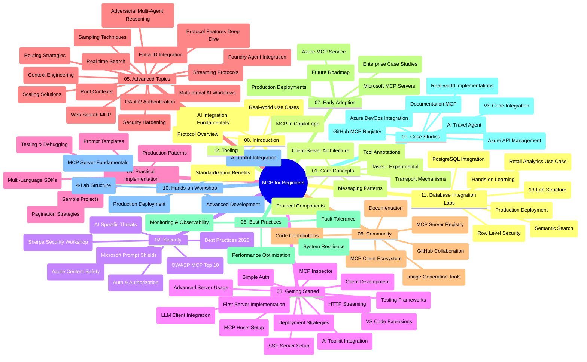

# โปรโตคอลบริบทแบบจำลอง (MCP) สำหรับผู้เริ่มต้น - คู่มือการศึกษา

คู่มือการศึกษานี้ให้ภาพรวมของโครงสร้างและเนื้อหาในที่เก็บข้อมูลสำหรับหลักสูตร "โปรโตคอลบริบทแบบจำลอง (MCP) สำหรับผู้เริ่มต้น" ใช้คู่มือนี้เพื่อช่วยนำทางที่เก็บข้อมูลอย่างมีประสิทธิภาพและใช้ประโยชน์จากทรัพยากรที่มีอยู่ให้เต็มที่

## ภาพรวมที่เก็บข้อมูล

โปรโตคอลบริบทแบบจำลอง (MCP) เป็นกรอบงานมาตรฐานสำหรับการโต้ตอบระหว่างโมเดล AI และแอปพลิเคชันลูกค้า สร้างขึ้นครั้งแรกโดย Anthropic แต่ปัจจุบัน MCP ได้รับการดูแลโดยชุมชน MCP กว้าง ๆ ผ่านองค์กร GitHub อย่างเป็นทางการ ที่เก็บข้อมูลนี้ให้หลักสูตรครอบคลุมพร้อมตัวอย่างโค้ดแบบใช้งานจริงในภาษา C#, Java, JavaScript, Python และ TypeScript ซึ่งออกแบบมาสำหรับนักพัฒนา AI สถาปนิกระบบ และวิศวกรซอฟต์แวร์

## แผนที่หลักสูตรแบบภาพ

## โครงสร้างที่เก็บข้อมูล

ที่เก็บข้อมูลถูกจัดระเบียบเป็นสิบสองส่วนหลัก ๆ แต่ละส่วนโฟกัสที่แง่มุมต่าง ๆ ของ MCP:

1. **บทนำ (00-Introduction/)**
   - ภาพรวมของโปรโตคอลบริบทแบบจำลอง
   - ทำไมการมาตรฐานจึงสำคัญในกระบวนการ AI
   - กรณีการใช้งานที่เป็นประโยชน์และข้อดี

2. **แนวคิดหลัก (01-CoreConcepts/)**
   - สถาปัตยกรรมลูกค้า-เซิร์ฟเวอร์
   - ส่วนประกอบสำคัญของโปรโตคอล
   - รูปแบบการส่งข้อความใน MCP
   - มองไปข้างหน้า: [มีอะไรเปลี่ยนแปลงใน MCP: ตัวอย่างโปรโตคอลเวอร์ชัน 2026-07-28](./01-CoreConcepts/mcp-2026-07-28-release-candidate.md) — โปรโตคอลหลักแบบไม่เก็บสถานะ, กรอบงานส่วนขยาย, และการเลิกใช้ Roots/Sampling/Logging ที่คาดหวังในเวอร์ชันสเปคถัดไป

3. **ความปลอดภัย (02-Security/)**
   - ภัยคุกคามความปลอดภัยในระบบที่ใช้ MCP
   - แนวทางปฏิบัติที่ดีที่สุดสำหรับการสร้างความปลอดภัยของการใช้งาน
   - ยุทธศาสตร์การพิสูจน์ตัวตนและการอนุญาต
   - **เอกสารความปลอดภัยที่ครอบคลุม**:
     - แนวทางปฏิบัติความปลอดภัย MCP 2025
     - คู่มือการใช้งาน Azure Content Safety
     - การควบคุมและเทคนิคความปลอดภัย MCP
     - การอ้างอิงแนวทางปฏิบัติที่ดีที่สุดของ MCP
   - **หัวข้อความปลอดภัยสำคัญ**:
     - การโจมตีแบบ prompt injection และการวางยาพิษเครื่องมือ
     - การแฮกเซสชันและปัญหา confused deputy
     - ช่องโหว่ token passthrough
     - สิทธิ์ที่มากเกินไปและการควบคุมการเข้าถึง
     - ความปลอดภัยในซัพพลายเชนของส่วนประกอบ AI
     - การรวม Microsoft Prompt Shields

4. **การเริ่มต้นใช้งาน (03-GettingStarted/)**
   - การตั้งค่าสภาพแวดล้อมและการกำหนดค่า
   - การสร้างเซิร์ฟเวอร์และลูกค้า MCP เบื้องต้น
   - การผสานรวมกับแอปพลิเคชันที่มีอยู่
   - ประกอบด้วยส่วนต่าง ๆ สำหรับ:
     - การสร้างเซิร์ฟเวอร์ครั้งแรก
     - การพัฒนาลูกค้า
     - การรวมลูกค้า LLM
     - การรวมกับ VS Code
     - เซิร์ฟเวอร์ Server-Sent Events (SSE)
     - การใช้งานเซิร์ฟเวอร์ขั้นสูง
     - การสตรีม HTTP
     - การรวม AI Toolkit
     - กลยุทธ์การทดสอบ
     - แนวทางการปรับใช้งาน

5. **การใช้งานจริง (04-PracticalImplementation/)**
   - การใช้ SDK ในภาษาการเขียนโปรแกรมต่าง ๆ
   - เทคนิคการดีบัก การทดสอบ และการตรวจสอบความถูกต้อง
   - การสร้างแบบฟอร์ม prompt และเวิร์กโฟลว์ที่นำกลับมาใช้ใหม่ได้
   - โครงการตัวอย่างพร้อมตัวอย่างการใช้งาน

6. **หัวข้อขั้นสูง (05-AdvancedTopics/)**
   - เทคนิควิศวกรรมบริบท
   - การรวมตัวแทน Foundry
   - เวิร์กโฟลว์ AI แบบมัลติ-โหมด
   - การสาธิตการพิสูจน์ตัวตน OAuth2
   - ความสามารถค้นหาแบบเรียลไทม์
   - การสตรีมแบบเรียลไทม์
   - การใช้งานบริบทหลัก (Root contexts)
   - กลยุทธ์การกำหนดเส้นทาง
   - เทคนิคการสุ่มตัวอย่าง
   - แนวทางการขยายขนาด
   - ข้อควรพิจารณาด้านความปลอดภัย
   - การรวมความปลอดภัยของ Entra ID
   - การรวมค้นหาเว็บ
   - การให้เหตุผลหลายตัวแทนแบบแดรตัดกัน (รูปแบบอภิปราย)

7. **การมีส่วนร่วมของชุมชน (06-CommunityContributions/)**
   - วิธีการร่วมเขียนโค้ดและเอกสาร
   - การทำงานร่วมกันผ่าน GitHub
   - การปรับปรุงที่ขับเคลื่อนโดยชุมชนและคำติชม
   - การใช้ลูกค้า MCP ต่าง ๆ (Claude Desktop, Cline, VSCode)
   - การทำงานกับเซิร์ฟเวอร์ MCP ที่นิยมรวมถึงการสร้างภาพ

8. **บทเรียนจากการใช้งานเบื้องต้น (07-LessonsfromEarlyAdoption/)**
   - การใช้งานจริงและเรื่องราวความสำเร็จ
   - การสร้างและปรับใช้โซลูชัน MCP
   - แนวโน้มและแผนงานในอนาคต
   - **คู่มือเซิร์ฟเวอร์ MCP ของ Microsoft**: คู่มือครอบคลุมสำหรับเซิร์ฟเวอร์ MCP ของ Microsoft จำนวน 10 ตัวที่พร้อมใช้งานในระดับโปรดักชัน ได้แก่:
     - Microsoft Learn Docs MCP Server
     - Azure MCP Server (ตัวเชื่อมต่อเฉพาะทาง 15+ ตัว)
     - GitHub MCP Server
     - Azure DevOps MCP Server
     - MarkItDown MCP Server
     - SQL Server MCP Server
     - Playwright MCP Server
     - Dev Box MCP Server
     - Microsoft Foundry MCP Server
     - Microsoft 365 Agents Toolkit MCP Server

9. **แนวทางปฏิบัติที่ดีที่สุด (08-BestPractices/)**
   - การปรับแต่งประสิทธิภาพและการเพิ่มประสิทธิภาพ
   - การออกแบบระบบ MCP ให้ทนทานต่อข้อผิดพลาด
   - กลยุทธ์การทดสอบและความยืดหยุ่น

10. **กรณีศึกษา (09-CaseStudy/)**
    - **เจ็ดกรณีศึกษาครอบคลุม** แสดงความยืดหยุ่นของ MCP ในสถานการณ์หลากหลาย:
    - **Azure AI Travel Agents**: การประสานงานหลายตัวแทนด้วย Azure OpenAI และ AI Search
    - **การรวม Azure DevOps**: การทำงานอัตโนมัติของเวิร์กโฟลว์ด้วยข้อมูล YouTube ที่อัปเดต
    - **การดึงเอกสารแบบเรียลไทม์**: ลูกค้า Python แบบคอนโซลพร้อมการสตรีม HTTP
    - **ตัวสร้างแผนการศึกษาเชิงโต้ตอบ**: เว็บแอป Chainlit พร้อม AI สร้างบทสนทนา
    - **เอกสารในตัวแก้ไข**: การรวม VS Code กับเวิร์กโฟลว์ GitHub Copilot
    - **การจัดการ Azure API**: การรวม API องค์กรด้วยการสร้างเซิร์ฟเวอร์ MCP
    - **ทะเบียน MCP ของ GitHub**: การพัฒนาเอ็กโคซิสเต็มและแพลตฟอร์มการรวมตัวแทน
    - ตัวอย่างการใช้งานที่ครอบคลุมการรวมองค์กร, การเพิ่มประสิทธิภาพนักพัฒนา, และการพัฒนาเอ็กโคซิสเต็ม

11. **เวิร์กช็อปแบบปฏิบัติ (10-StreamliningAIWorkflowsBuildingAnMCPServerWithAIToolkit/)**
    - เวิร์กช็อปแบบปฏิบัติที่เน้นการรวม MCP กับ AI Toolkit อย่างครบถ้วน
    - การสร้างแอปพลิเคชันอัจฉริยะที่เชื่อมต่อโมเดล AI กับเครื่องมือในโลกจริง
    - โมดูลใช้งานจริงที่ครอบคลุมพื้นฐาน, การพัฒนาเซิร์ฟเวอร์แบบกำหนดเอง และกลยุทธ์การปรับใช้ในระดับโปรดักชัน
    - **โครงสร้างแลป**:
      - แลป 1: พื้นฐานเซิร์ฟเวอร์ MCP
      - แลป 2: การพัฒนาเซิร์ฟเวอร์ MCP ขั้นสูง
      - แลป 3: การรวม AI Toolkit
      - แลป 4: การปรับใช้และขยายขนาดในระดับโปรดักชัน
    - วิธีการเรียนรู้แบบแลปที่มีคำแนะนำทีละขั้นตอน

12. **แลปการรวมฐานข้อมูลเซิร์ฟเวอร์ MCP (11-MCPServerHandsOnLabs/)**
    - **เส้นทางการเรียนรู้แบบแลป 13 ห้อง** เพื่อสร้างเซิร์ฟเวอร์ MCP ที่พร้อมใช้งานในระดับโปรดักชันด้วยการรวม PostgreSQL
    - **การใช้งานจริงด้านวิเคราะห์ค้าปลีก** โดยใช้กรณีศึกษา Zava Retail
    - **รูปแบบระดับองค์กร** รวมถึง Row Level Security (RLS), การค้นหาเชิงความหมาย และการเข้าถึงข้อมูลแบบหลายผู้เช่า
    - **โครงสร้างแลปครบถ้วน**:
      - **แลป 00-03: พื้นฐาน** - บทนำ, สถาปัตยกรรม, ความปลอดภัย, การตั้งค่าสภาพแวดล้อม
      - **แลป 04-06: การสร้างเซิร์ฟเวอร์ MCP** - การออกแบบฐานข้อมูล, การใช้งานเซิร์ฟเวอร์ MCP, การพัฒนาเครื่องมือ
      - **แลป 07-09: ฟีเจอร์ขั้นสูง** - การค้นหาเชิงความหมาย, การทดสอบและดีบัก, การรวมกับ VS Code
      - **แลป 10-12: โปรดักชันและแนวทางปฏิบัติที่ดีที่สุด** - การปรับใช้, การตรวจสอบ, การเพิ่มประสิทธิภาพ
    - **เทคโนโลยีที่ครอบคลุม**: เฟรมเวิร์ก FastMCP, PostgreSQL, Azure OpenAI, Azure Container Apps, Application Insights
    - **ผลลัพธ์การเรียนรู้**: เซิร์ฟเวอร์ MCP พร้อมใช้งานในระดับโปรดักชัน, รูปแบบการรวมฐานข้อมูล, การวิเคราะห์ด้วย AI, ความปลอดภัยระดับองค์กร

13. **เครื่องมือ (12-tooling/)**
    - เรียนรู้วิธีการใช้ MCP ในแอป Copilot และเครื่องมืออื่น ๆ

## ทรัพยากรเพิ่มเติม

ที่เก็บข้อมูลมีทรัพยากรช่วยเหลือดังนี้:

- **โฟลเดอร์รูปภาพ**: ประกอบด้วยแผนภาพและภาพประกอบที่ใช้ในหลักสูตร
- **การแปลภาษา**: รองรับหลายภาษาโดยใช้การแปลเอกสารอัตโนมัติ
- **ทรัพยากร MCP อย่างเป็นทางการ**:
  - [เอกสาร MCP](https://modelcontextprotocol.io/)
  - [สเปค MCP](https://spec.modelcontextprotocol.io/)
  - [ที่เก็บ GitHub MCP](https://github.com/modelcontextprotocol)

## วิธีใช้ที่เก็บข้อมูลนี้

1. **การเรียนรู้อย่างเป็นลำดับ**: อ่านตามบทโดยเรียงลำดับ (00 ถึง 11) เพื่อการเรียนรู้อย่างมีโครงสร้าง
2. **มุ่งเน้นเฉพาะภาษาที่สนใจ**: หากสนใจภาษาการเขียนโปรแกรมเฉพาะ ให้สำรวจโฟลเดอร์ตัวอย่างสำหรับการใช้งานในภาษาที่คุณชอบ
3. **การใช้งานจริง**: เริ่มจากส่วน "การเริ่มต้นใช้งาน" เพื่อเตรียมสภาพแวดล้อมและสร้างเซิร์ฟเวอร์และลูกค้า MCP ตัวแรกของคุณ
4. **การสำรวจขั้นสูง**: เมื่อคุณมีความคุ้นเคยกับพื้นฐานแล้ว ให้เจาะลึกหัวข้อขั้นสูงเพื่อขยายความรู้
5. **การมีส่วนร่วมของชุมชน**: เข้าร่วมชุมชน MCP ผ่านการสนทนา GitHub และช่อง Discord เพื่อติดต่อกับผู้เชี่ยวชาญและนักพัฒนาคนอื่น ๆ

## ลูกค้าและเครื่องมือ MCP

หลักสูตรครอบคลุมลูกค้าและเครื่องมือ MCP ต่าง ๆ:

1. **ลูกค้าอย่างเป็นทางการ**:
   - Visual Studio Code 
   - MCP ใน Visual Studio Code
   - Claude Desktop
   - Claude ใน VSCode 
   - Claude API

2. **ลูกค้าชุมชน**:
   - Cline (แบบเทอร์มินัล)
   - Cursor (ตัวแก้ไขโค้ด)
   - ChatMCP
   - Windsurf

3. **เครื่องมือจัดการ MCP**:
   - MCP CLI
   - MCP Manager
   - MCP Linker
   - MCP Router

## เซิร์ฟเวอร์ MCP ที่นิยม

ที่เก็บข้อมูลแนะนำเซิร์ฟเวอร์ MCP หลากหลาย รวมถึง:

1. **เซิร์ฟเวอร์ MCP ของ Microsoft อย่างเป็นทางการ**:
   - Microsoft Learn Docs MCP Server
   - Azure MCP Server (ตัวเชื่อมต่อเฉพาะทาง 15+ ตัว)
   - GitHub MCP Server
   - Azure DevOps MCP Server
   - MarkItDown MCP Server
   - SQL Server MCP Server
   - Playwright MCP Server
   - Dev Box MCP Server
   - Microsoft Foundry MCP Server
   - Microsoft 365 Agents Toolkit MCP Server

2. **เซิร์ฟเวอร์อ้างอิงอย่างเป็นทางการ**:
   - ระบบไฟล์
   - Fetch
   - Memory
   - Sequential Thinking

3. **การสร้างภาพ**:
   - Azure OpenAI DALL-E 3
   - Stable Diffusion WebUI
   - Replicate

4. **เครื่องมือพัฒนา**:
   - Git MCP
   - Terminal Control
   - ผู้ช่วยเขียนโค้ด (Code Assistant)

5. **เซิร์ฟเวอร์เฉพาะทาง**:
   - Salesforce
   - Microsoft Teams
   - Jira & Confluence

## การมีส่วนร่วม

ที่เก็บข้อมูลนี้ยินดีรับการมีส่วนร่วมจากชุมชน ดูส่วนการมีส่วนร่วมของชุมชนเพื่อคำแนะนำเกี่ยวกับวิธีการมีส่วนร่วมอย่างมีประสิทธิภาพในระบบนิเวศ MCP

----

*คู่มือการศึกษานี้ได้รับการอัปเดตล่าสุดเมื่อวันที่ 5 กุมภาพันธ์ 2026 สะท้อนสเปค MCP ล่าสุด 2025-11-25 และให้ภาพรวมของที่เก็บข้อมูล ณ วันที่นั้น เนื้อหาที่เก็บข้อมูลอาจมีการอัปเดตหลังจากนี้*

*เพิ่มเติม (2 กรกฎาคม 2026): เพิ่มบทเรียนเกี่ยวกับ `2026-07-28` MCP Specification Release Candidate ภายใต้ [01-CoreConcepts](./01-CoreConcepts/mcp-2026-07-28-release-candidate.md); ขอบเขตหลักสูตรยังคงเป็น 2025-11-25 จนกว่ามาตรฐานใหม่จะถูกปล่อยออกมา*

---

<!-- CO-OP TRANSLATOR DISCLAIMER START -->
**ปฏิเสธความรับผิดชอบ**:
เอกสารนี้ได้รับการแปลโดยใช้บริการแปลภาษา AI [Co-op Translator](https://github.com/Azure/co-op-translator) ขณะที่เราพยายามให้ความถูกต้อง โปรดทราบว่าการแปลโดยอัตโนมัติอาจมีข้อผิดพลาดหรือความไม่ถูกต้อง เอกสารต้นฉบับในภาษาต้นทางควรถูกพิจารณาเป็นแหล่งข้อมูลที่เชื่อถือได้ สำหรับข้อมูลที่สำคัญ แนะนำให้ใช้การแปลโดยมนุษย์มืออาชีพ เราไม่รับผิดชอบต่อความเข้าใจผิดหรือการตีความที่ผิดพลาดที่เกิดขึ้นจากการใช้การแปลนี้
<!-- CO-OP TRANSLATOR DISCLAIMER END -->