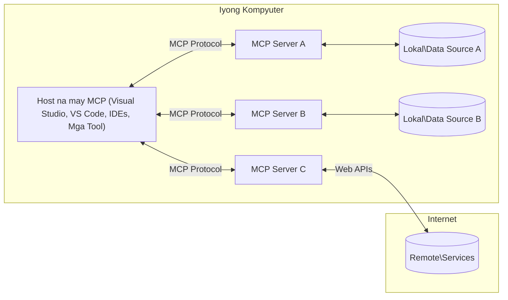

# Mga Pangunahing Konsepto ng MCP: Pag-master sa Model Context Protocol para sa Integrasyon ng AI

[](https://youtu.be/earDzWGtE84)

_(I-click ang larawan sa itaas upang panoorin ang video ng araling ito)_

Ang [Model Context Protocol (MCP)](https://github.com/modelcontextprotocol) ay isang makapangyarihan, standardisadong balangkas na nag-o-optimize ng komunikasyon sa pagitan ng Large Language Models (LLMs) at mga panlabas na kasangkapan, aplikasyon, at mga pinagkukunan ng datos.
Ang gabay na ito ay maglalakad sa iyo sa mga pangunahing konsepto ng MCP. Malalaman mo ang tungkol sa client-server architecture nito, mahahalagang bahagi, mekanismo ng komunikasyon, at mga pinakamahusay na kasanayan sa pagpapatupad.

- **Malinaw na Pahintulot ng User**: Lahat ng pag-access ng datos at mga operasyon ay nangangailangan ng malinaw na pagsang-ayon ng user bago isagawa. Kailangang malinaw sa mga user kung anong datos ang maa-access at kung anong mga aksyon ang gagawin, na may detalyadong kontrol sa mga permiso at awtorisasyon.

- **Proteksyon sa Pribadong Datos**: Ang datos ng user ay inilalantad lamang kung may malinaw na pahintulot at dapat maprotektahan ng matibay na mga kontrol sa pag-access sa buong lifecycle ng pakikipag-ugnayan. Kailangan pigilan ng mga pagpapatupad ang hindi awtorisadong transmisyon ng datos at panatilihin ang mahigpit na mga hangganan ng privacy.

- **Kaligtasan ng Pagsasagawa ng Kasangkapan**: Bawat pagtawag ng kasangkapan ay nangangailangan ng malinaw na pagsang-ayon ng user na may malinaw na pag-unawa sa functionality, mga parameter, at posibleng epekto ng kasangkapan. Kailangan ng matibay na mga hangganan ng seguridad upang maiwasan ang hindi sinasadyang, hindi ligtas, o mapanirang pagsasagawa ng kasangkapan.

- **Seguridad ng Transport Layer**: Lahat ng mga channel ng komunikasyon ay dapat gumamit ng angkop na mga mekanismo ng encryption at authentication. Ang mga remote na koneksyon ay dapat magpatupad ng mga secure na transport protocol at angkop na pamamahala ng kredensyal.

#### Mga Patnubay sa Pagpapatupad:

- **Pamamahala ng Permiso**: Magpatupad ng masusing mga sistema ng permiso na nagpapahintulot sa mga user na kontrolin kung aling mga server, kasangkapan, at mga pinagkukunan ang maa-access
- **Pagpapatunay at Awtorisasyon**: Gamitin ang seguradong mga pamamaraan ng pagpapatunay (OAuth, API keys) na may wastong pamamahala ng token at expiration
- **Pagpapatunay ng Input**: Patunayan ang lahat ng mga parameter at input ng datos ayon sa mga tinukoy na schema upang maiwasan ang injection attacks
- **Audit Logging**: Panatilihin ang kumpletong talaan ng lahat ng operasyon para sa pagmo-monitor ng seguridad at pagsunod

## Pangkalahatang-Paningin

Sinasaliksik ng araling ito ang pangunahing arkitektura at mga bahagi na bumubuo sa Model Context Protocol (MCP) ecosystem. Malalaman mo ang tungkol sa client-server architecture, mga pangunahing bahagi, at mekanismo ng komunikasyon na nagpapagana sa pakikipag-ugnayan ng MCP.

## Mga Pangunahing Layunin sa Pagkatuto

Pagkatapos ng araling ito, ikaw ay:

- Mauunawaan ang MCP client-server architecture.
- Matutukoy ang mga papel at responsibilidad ng mga Hosts, Clients, at Servers.
- Masusuri ang mga pangunahing tampok na gumagawa sa MCP bilang isang flexible na layer ng integrasyon.
- Matutunan kung paano dumadaloy ang impormasyon sa loob ng MCP ecosystem.
- Makakuha ng praktikal na kaalaman sa pamamagitan ng mga halimbawa ng code sa .NET, Java, Python, at JavaScript.

## MCP Arkitektura: Mas Malalim na Pagsilip

Ang MCP ecosystem ay itinayo sa isang client-server model. Ang modular na istrukturang ito ay nagpapahintulot sa mga aplikasyon ng AI na makipag-ugnayan sa mga kasangkapan, database, API, at mga contextual na pinagkukunan nang mahusay. Hatiin natin ang arkitekturang ito sa mga pangunahing bahagi nito.

Sa kanyang puso, sumusunod ang MCP sa client-server architecture kung saan ang isang host application ay maaaring kumonekta sa maraming servers:



- **MCP Hosts**: Mga programa tulad ng VSCode, Claude Desktop, IDEs, o mga kasangkapan ng AI na nais ma-access ang datos gamit ang MCP
- **MCP Clients**: Mga protocol client na nagpapanatili ng 1:1 na koneksyon sa mga servers
- **MCP Servers**: Mga magagaan na programa na nagpapakita ng partikular na mga kakayahan gamit ang standardisadong Model Context Protocol
- **Mga Lokal na Pinagkukunan ng Datos**: Mga file, database, at mga serbisyo ng iyong kompyuter na maaaring ma-access nang ligtas ng MCP servers
- **Mga Remote na Serbisyo**: Mga panlabas na sistema na available sa internet na maaaring ikonekta ng MCP servers sa pamamagitan ng APIs.

Ang MCP Protocol ay isang umuusbong na standard na gumagamit ng date-based versioning (YYYY-MM-DD na format). Ang kasalukuyang bersyon ng protocol ay **2025-11-25**. Makikita mo ang mga pinakabagong update sa [protocol specification](https://modelcontextprotocol.io/specification/2025-11-25/)

> **Tumingin sa hinaharap:** isang release candidate para sa susunod na bersyon ng specification, **2026-07-28**, ay inanunsyo noong Mayo 2026 at naka-iskedyul ilabas sa Hulyo 28, 2026. Ginagawang stateless ang protocol sa transport layer (tinanggal ang `initialize` handshake at mga session ID), pinormalisa ang Extensions framework, at binabawasan ang paggamit ng Roots, Sampling, at Logging pabor sa mga bagong pattern. Tingnan ang [What's Changing in MCP: The 2026-07-28 Release Candidate](./mcp-2026-07-28-release-candidate.md) para sa buong paliwanag.

### 1. Mga Hosts

Sa Model Context Protocol (MCP), ang **Mga Hosts** ay mga aplikasyon ng AI na nagsisilbing pangunahing interface kung saan nakikipag-ugnayan ang mga user sa protocol. Ang mga Hosts ang nagkokordina at namamahala ng koneksyon sa maraming MCP servers sa pamamagitan ng paglikha ng dedikadong MCP clients para sa bawat koneksyon sa server. Mga halimbawa ng Hosts ay:

- **Mga Aplikasyong AI**: Claude Desktop, Visual Studio Code, Claude Code
- **Mga Development Environment**: Mga IDE at code editors na may MCP integration
- **Mga Pasadyang Aplikasyon**: Mga purpose-built na ahente at kasangkapan ng AI

Ang **Mga Hosts** ay mga aplikasyon na nagkokordina ng pakikipag-ugnayan sa AI model. Sila ay:

- **Nag-o-orchestrate ng AI Models**: Nagpapatakbo o nakikipag-ugnayan sa LLMs para gumawa ng mga tugon at magkoordina ng mga AI workflow
- **Namamahala ng mga Client Connection**: Lumilikha at nagpapanatili ng isang MCP client bawat koneksyon sa MCP server
- **Kinokontrol ang User Interface**: Naghahandle ng daloy ng pag-uusap, interaksyon ng user, at presentasyon ng mga tugon
- **Nagpapatupad ng Seguridad**: Kinokontrol ang mga permiso, constrain ng seguridad, at pagpapatunay
- **Naghahandle ng Pahintulot ng User**: Pinamamahalaan ang pag-apruba ng user para sa pagbabahagi ng datos at pagsasagawa ng kasangkapan


### 2. Mga Clients

Ang **Mga Clients** ay mahahalagang bahagi na nagpapanatili ng dedikadong one-to-one na koneksyon sa pagitan ng Mga Hosts at mga MCP server. Bawat MCP client ay ini-instantiate ng Host upang kumonekta sa partikular na MCP server, na tinitiyak ang organisado at ligtas na mga channel ng komunikasyon. Pinapayagan ng maraming clients ang Mga Hosts na kumonekta sa maraming server nang sabay-sabay.

Ang **Mga Clients** ay mga connector na bahagi sa loob ng host application. Sila ay:

- **Protocol Communication**: Nagpapadala ng JSON-RPC 2.0 na mga request sa mga server kasama ang mga prompt at mga tagubilin
- **Capability Negotiation**: Nakikipag-negosasyon ng mga suportadong tampok at bersyon ng protocol sa mga server sa panahon ng initialization
- **Pagsasagawa ng Kasangkapan**: Pinamamahalaan ang mga tool execution request mula sa mga modelo at pinoproseso ang mga tugon
- **Real-time Updates**: Naghahandle ng mga notification at real-time updates mula sa mga server
- **Response Processing**: Pinoproseso at inaayos ang mga tugon mula sa server para ipakita sa mga user

### 3. Mga Servers

Ang **Mga Servers** ay mga programa na nagbibigay ng konteksto, mga kasangkapan, at mga kakayahan sa MCP clients. Maaari silang magpatakbo nang lokal (sa parehong makina ng Host) o remote (sa mga panlabas na platform), at responsable sa paghawak ng mga request ng client at pagbibigay ng istrakturadong tugon. Ipinapakita ng mga server ang partikular na functionality sa pamamagitan ng standardisadong Model Context Protocol.

Ang **Mga Servers** ay mga serbisyo na nagbibigay ng konteksto at kakayahan. Sila ay:

- **Pagpaparehistro ng Feature**: Nirerehistro at inilalantad ang mga available na primitives (mga resources, prompt, kasangkapan) sa mga client
- **Pagpoproseso ng Request**: Tumatanggap at nagsasagawa ng tool calls, mga kahilingan sa resource, at prompt requests mula sa mga client
- **Pagbibigay ng Konteksto**: Nagbibigay ng kontekstwal na impormasyon at datos upang mapahusay ang mga tugon ng modelo
- **Pamamahala ng Estado**: Pinapanatili ang estado ng session at humahawak ng stateful interaction kung kinakailangan
- **Real-time Notifications**: Nagpapadala ng mga notification tungkol sa pagbabago ng kakayahan at update sa mga nakakonektang client

Ang mga server ay maaaring gawin ng sinuman upang palawakin ang kakayahan ng modelo gamit ang espesyalisadong functionality, at sinusuportahan nila ang parehong lokal at remote na sitwasyon ng deployment.

### 4. Mga Primitives ng Server

Sa Model Context Protocol (MCP), ang mga server ay nagbibigay ng tatlong pangunahing **primitives** na naglalarawan ng pundamental na mga bloke para sa masaganang interaksyon sa pagitan ng mga client, host, at mga language model. Ang mga primitives na ito ay tumutukoy sa uri ng kontekstwal na impormasyon at mga aksyon na available sa protocol.

Maaaring ilantad ng mga MCP server ang alinmang kombinasyon ng sumusunod na tatlong pangunahing primitives:

#### Mga Resources 

Ang **Mga Resources** ay mga pinagkukunan ng datos na nagbibigay ng kontekstwal na impormasyon sa mga aplikasyon ng AI. Kinakatawan nila ang static o dynamic na nilalaman na maaaring magpahusay ng pag-unawa at paggawa ng desisyon ng modelo:

- **Kontekstwal na Datos**: Istrakturang impormasyon at konteksto para sa konsumo ng AI model
- **Mga Kaalamang Base**: Mga repositoryo ng dokumento, artikulo, manual, at mga papel-pananaliksik
- **Lokal na Pinagkukunan ng Datos**: Mga file, database, at impormasyon ng lokal na sistema
- **Panlabas na Datos**: Mga tugon ng API, mga web service, at datos mula sa mga remote na sistema
- **Dynamic na Nilalaman**: Real-time na datos na nag-a-update base sa mga panlabas na kondisyon

Ang mga resources ay tinutukoy ng URI at sinusuportahan ang pagtuklas gamit ang `resources/list` at pagkuha gamit ang `resources/read` na mga pamamaraan:

```text
file://documents/project-spec.md
database://production/users/schema
api://weather/current
```

#### Mga Prompts

Ang **Mga Prompts** ay mga reusable na template na tumutulong sa istraktura ng mga interaksyon sa mga language model. Nagbibigay sila ng standardisadong mga pattern ng interaksyon at template na mga workflow:

- **Template-based Interaction**: Pre-istrakturang mga mensahe at panimulang usapan
- **Workflow Templates**: Standardisadong pagkakasunod-sunod para sa mga karaniwang gawain at interaksyon
- **Few-shot Examples**: Mga halimbawa ng template para sa pagtuturo sa modelo
- **System Prompts**: Mga pundamental na prompt na nagtatakda ng ugali at konteksto ng modelo
- **Dynamic Templates**: Mga parameterized na prompt na umaangkop sa partikular na mga konteksto

Sinusuportahan ng prompts ang variable substitution at maaaring matuklasan sa pamamagitan ng `prompts/list` at makuha gamit ang `prompts/get`:

```markdown
Generate a {{task_type}} for {{product}} targeting {{audience}} with the following requirements: {{requirements}}
```

#### Mga Kasangkapan (Tools)

Ang **Mga Kasangkapan** ay mga executable na function na maaaring tawagan ng AI models upang magsagawa ng partikular na mga aksyon. Kinakatawan nila ang mga "pandiwa" ng MCP ecosystem, na nagpapahintulot sa mga modelo na makipag-ugnayan sa mga panlabas na sistema:

- **Executable Function**: Discrete na operasyon na maaaring tawagin ng mga modelo gamit ang partikular na mga parameter
- **Integrasyon ng Panlabas na Sistema**: Mga tawag sa API, query sa database, operasyon ng file, kalkulasyon
- **Natanging Pagkakakilanlan**: Bawat kasangkapan ay may natatanging pangalan, paglalarawan, at schema ng parameter
- **Istrakturang I/O**: Tumanggap ang mga kasangkapan ng na-validate na mga parameter at nagbabalik ng istrakturadong, typed na mga tugon
- **Kakayahan sa Aksyon**: Pinapayagan ang mga modelo na gumawa ng mga tunay na aksyon at kumuha ng live na datos

Ang mga kasangkapan ay tinutukoy gamit ang JSON Schema para sa validation ng parameter at natutuklasan sa pamamagitan ng `tools/list` at naisakatuparan gamit ang `tools/call`. Maaari ring magsama ang mga kasangkapan ng **icons** bilang dagdag na metadata para sa mas mahusay na presentasyon sa UI.

**Tool Annotations**: Sinusuportahan ng mga kasangkapan ang mga behavioral annotations (hal., `readOnlyHint`, `destructiveHint`) na naglalarawan kung ang isang kasangkapan ay read-only o mapanira, na tumutulong sa mga client na gumawa ng masuportahang mga desisyon tungkol sa pagsasagawa ng kasangkapan.

Halimbawa ng depinisyon ng kasangkapan:

```typescript
server.tool(
  "search_products", 
  {
    query: z.string().describe("Search query for products"),
    category: z.string().optional().describe("Product category filter"),
    max_results: z.number().default(10).describe("Maximum results to return")
  }, 
  async (params) => {
    // Isagawa ang paghahanap at ibalik ang nakaayos na mga resulta
    return await productService.search(params);
  }
);
```

## Mga Client Primitives

Sa Model Context Protocol (MCP), ang **mga client** ay maaaring maglahad ng primitives na nagpapahintulot sa mga server na humiling ng karagdagang kakayahan mula sa host application. Ang mga client-side primitives na ito ay nagbibigay-daan sa mas masagana at interaktibong mga implementasyon ng server na maaaring maka-access ng kakayahan ng AI model at mga interaksyon ng user.

### Sampling

> **Pabatid ng Deprecation:** ang `2026-07-28` release candidate ay nagtatalaga sa Sampling bilang deprecated pabor sa direktang integrasyon sa LLM provider APIs. Patuloy itong gagana sa `2025-11-25` at sa loob ng hindi bababa sa isang taon pagkatapos ng anumang deprecation, ngunit ang mga bagong disenyo ay dapat mas pabor sa bagong pattern. Tingnan ang [What's Changing in MCP: The 2026-07-28 Release Candidate](./mcp-2026-07-28-release-candidate.md).

Pinapayagan ng **Sampling** ang mga server na humiling ng mga kompletong teksto mula sa language model ng client na AI application. Pinapayagan nito ang mga server na makakuha ng kakayahan ng LLM nang hindi nilalagyan ng sariling mga dependency ang modelo:

- **Model-Independent Access**: Maaari humiling ng kompletong teksto ang mga server nang hindi kinakailangang isama ang LLM SDKs o pamahalaan ang pag-access ng modelo
- **Server-Initiated AI**: Pinapayagan ang mga server na autonomously na gumawa ng nilalaman gamit ang AI model ng client
- **Recursive LLM Interactions**: Sinusuportahan ang mga komplikadong sitwasyon kung saan nangangailangan ang server ng tulong ng AI para sa pagproseso
- **Dynamic Content Generation**: Pinapayagan ang mga server na gumawa ng mga kontekstwal na tugon gamit ang modelo ng host
- **Suporta sa Pagtawag ng Kasangkapan**: Maaari isama ng mga server ang mga parameter na `tools` at `toolChoice` upang payagan ang modelo ng client na tawagan ang mga kasangkapan habang nag-sampling

Ang Sampling ay sinimulan sa pamamagitan ng `sampling/complete` na pamamaraan, kung saan nagpapadala ng mga kahilingan ng kompletong teksto ang mga server sa mga client.

### Mga Roots

> **Pabatid ng Deprecation:** ang `2026-07-28` release candidate ay nagtatalaga sa Roots bilang deprecated pabor sa mga parameter ng kasangkapan, mga resource URI, o konfigurasyon ng server. Patuloy itong gagana sa `2025-11-25` at sa loob ng hindi bababa sa isang taon pagkatapos ng anumang deprecation. Tingnan ang [What's Changing in MCP: The 2026-07-28 Release Candidate](./mcp-2026-07-28-release-candidate.md).

Nagbibigay ang **Roots** ng standardisadong paraan para sa mga client na ilantad ang mga hangganan ng filesystem sa mga server, na tumutulong sa mga server na maunawaan kung anong mga direktoryo at file ang maa-access nila:

- **Filesystem Boundaries**: Naglalarawan ng mga hangganan kung saan maaaring gumalaw ang mga server sa loob ng filesystem
- **Kontrol sa Pag-access**: Tinutulungan ang mga server na maunawaan kung aling mga direktoryo at file ang may pahintulot silang ma-access
- **Dynamic na Update**: Maaari abisuhan ng mga client ang mga server kapag nagbago ang listahan ng roots
- **URI-Based Identification**: Ginagamit ng Roots ang `file://` URI para tukuyin ang naa-access na mga direktoryo at file

Natutuklasan ang Roots sa pamamagitan ng `roots/list` na pamamaraan, kasama ng mga client na nagpapadala ng `notifications/roots/list_changed` kapag nagbago ang mga roots.

### Elicitation  

Pinapayagan ng **Elicitation** ang mga server na humiling ng karagdagang impormasyon o kumpirmasyon mula sa mga user sa pamamagitan ng client interface:

- **Mga Kahilingan sa Input ng User**: Maaari humingi ang mga server ng karagdagang impormasyon kapag kailangan para sa pagsasagawa ng kasangkapan
- **Mga Dialog sa Kumpirmasyon**: Humihiling ng pag-apruba ng user para sa mga sensitibo o may malaking epekto na operasyon
- **Mga Interactive na Workflow**: Pinapayagan ang mga server na gumawa ng hakbang-hakbang na interaksyon sa user
- **Dynamic na Koleksyon ng Parameter**: Kinokolekta ang nawawala o opsyunal na mga parameter habang isinasagawa ang kasangkapan

Ginagawa ang mga elicitation request gamit ang `elicitation/request` na pamamaraan upang mangolekta ng input mula sa user sa pamamagitan ng interface ng client.

**URL Mode Elicitation**: Maaari ring humiling ang mga server ng URL-based na interaksyon ng user, na nagpapahintulot sa mga server na idirekta ang mga user sa mga panlabas na web page para sa authentication, kumpirmasyon, o pagsagot ng datos.

### Logging


> **Pabatid ng Pagkawala ng Suporta:** ang `2026-07-28` release candidate ay nagmamarka ng Logging bilang hindi na gagamitin pabor sa `stderr` para sa stdio transports at OpenTelemetry para sa istrakturadong obserbabilidad. Patuloy itong gagana sa `2025-11-25` at hindi bababa sa isang taon pagkatapos ng anumang pagkawala ng suporta. Tingnan ang [What's Changing in MCP: The 2026-07-28 Release Candidate](./mcp-2026-07-28-release-candidate.md).

**Ang Logging** ay nagpapahintulot sa mga server na magpadala ng istrakturadong mga log message sa mga kliyente para sa pag-debug, pag-monitor, at pananaw sa operasyon:

- **Suporta sa Pag-debug**: Pinapayagan ang mga server na magbigay ng detalyadong mga tala ng pagpapatupad para sa pagsasaayos ng problema
- **Operational Monitoring**: Magpadala ng mga update sa katayuan at mga sukatan ng pagganap sa mga kliyente
- **Ulat ng Error**: Magbigay ng detalyadong konteksto ng error at impormasyon ng diagnostic
- **Audit Trails**: Lumikha ng komprehensibong mga tala ng mga operasyon at desisyon ng server

Ang mga log message ay ipinapadala sa mga kliyente upang magbigay ng transparency sa mga operasyon ng server at magpadali sa pag-debug.

## Daloy ng Impormasyon sa MCP

Inilalarawan ng Model Context Protocol (MCP) ang isang istrakturadong daloy ng impormasyon sa pagitan ng mga host, kliyente, server, at modelo. Ang pag-unawa sa daloy na ito ay tumutulong upang linawin kung paano pinroseso ang mga kahilingan ng gumagamit at kung paano isinama ang mga panlabas na tool at datos sa mga tugon ng modelo.

- **Pinapasimulan ng Host ang Koneksyon**  
  Ang aplikasyon ng host (tulad ng isang IDE o chat interface) ay nagtatatag ng koneksyon sa isang MCP server, karaniwang sa pamamagitan ng STDIO, WebSocket, o iba pang suportadong transport.

- **Negosasyon ng Kakayahan**  
  Nagpapalitan ang kliyente (na nakapaloob sa host) at ang server ng impormasyon tungkol sa kanilang mga sinusuportahang tampok, tool, resource, at bersyon ng protocol. Tinitiyak nito na nauunawaan ng parehong panig kung anong mga kakayahan ang magagamit para sa sesyon.

- **Kahilingan ng Gumagamit**  
  Nakikipag-ugnayan ang gumagamit sa host (hal., pagpasok ng prompt o utos). Kinokolekta ng host ang input na ito at ipinapasa ito sa kliyente para sa pagproseso.

- **Paggamit ng Resource o Tool**  
  - Maaaring humiling ang kliyente ng karagdagang konteksto o mga resource mula sa server (tulad ng mga file, talaan ng database, o artikulo mula sa knowledge base) upang pagyamanin ang pag-unawa ng modelo.
  - Kung napagpasyahan ng modelo na kailangan ang isang tool (hal., upang kumuha ng datos, magsagawa ng kalkulasyon, o tumawag sa API), nagpapadala ang kliyente ng kahilingan sa server para sa paggamit ng tool, tinutukoy ang pangalan ng tool at mga parametro.

- **Pagpapatupad ng Server**  
  Tinatanggap ng server ang kahilingan para sa resource o tool, isinasagawa ang kinakailangang mga operasyon (tulad ng pagpapatakbo ng isang function, pagtatanong sa database, o pagkuha ng file), at ibinabalik ang mga resulta sa kliyente sa isang istrakturadong format.

- **Paggawa ng Tugon**  
  Isinasama ng kliyente ang mga tugon ng server (datos ng resource, output ng tool, atbp.) sa kasalukuyang interaksyon ng modelo. Ginagamit ng modelo ang impormasyong ito upang makabuo ng komprehensibo at kontekstwal na angkop na tugon.

- **Pagpapakita ng Resulta**  
  Tinatanggap ng host ang panghuling output mula sa kliyente at ipinapakita ito sa gumagamit, kadalasan ay kinabibilangan ang teksto na nilikha ng modelo at anumang mga resulta mula sa mga pagpapatupad ng tool o paghahanap ng resource.

Pinapahintulutan ng daloy na ito ang MCP na suportahan ang mga advanced, interactive, at kontekstwal-agham na AI na aplikasyon sa pamamagitan ng seamless na pagkakabit ng mga modelo sa panlabas na mga tool at pinagkukunan ng datos.

## Arkitektura ng Protocol at mga Layer

Binubuo ang MCP ng dalawang natatanging architectural layers na nagtutulungan upang magbigay ng kumpletong balangkas ng komunikasyon:

### Data Layer

Ang **Data Layer** ay nagsasagawa ng pangunahing MCP protocol gamit ang **JSON-RPC 2.0** bilang pundasyon nito. Itinatakda ng layer na ito ang istruktura ng mensahe, semantika, at mga pattern ng interaksyon:

#### Pangunahing Mga Komponent:

- **JSON-RPC 2.0 Protocol**: Lahat ng komunikasyon ay gumagamit ng istandardisadong format ng mensahe ng JSON-RPC 2.0 para sa tawag sa mga metodo, tugon, at mga notipikasyon
- **Pamamahala ng Lifecycle**: Pinangangasiwaan ang pagsisimula ng koneksyon, negosasyon ng kakayahan, at pagtatapos ng sesyon sa pagitan ng mga kliyente at server
- **Server Primitives**: Pinapayagan ang mga server na magbigay ng pangunahing functionality sa pamamagitan ng mga tool, resource, at prompt
- **Client Primitives**: Pinapayagan ang mga server na humiling ng pag-sample mula sa mga LLM, mang-akit ng input ng gumagamit, at magpadala ng mga log message
- **Real-time Notifications**: Sumasuporta sa asynchronous na mga notipikasyon para sa mga dynamic na update nang walang polling

#### Pangunahing Mga Tampok:

- **Negosasyon ng Bersyon ng Protocol**: Gumagamit ng date-based na pagberberyo (YYYY-MM-DD) upang matiyak ang pagkakatugma
- **Pagtuklas ng Kakayahan**: Nagpapalitan ang mga kliyente at server ng impormasyon tungkol sa sinusuportahang mga tampok sa panahon ng pagsisimula
- **Stateful Sessions**: Pinapanatili ang estado ng koneksyon sa maraming interaksyon para sa pagpapatuloy ng konteksto

### Transport Layer

Pinangangasiwaan ng **Transport Layer** ang mga channel ng komunikasyon, pag-frame ng mensahe, at pagpapatunay sa pagitan ng mga kalahok sa MCP:

#### Sinusuportahang Mekanismo ng Transport:

1. **STDIO Transport**:
   - Gumagamit ng standard input/output na mga stream para sa direktang komunikasyon ng proseso
   - Pinakamainam para sa mga lokal na proseso sa parehong makina na walang overhead ng network
   - Karaniwang ginagamit para sa lokal na mga implementasyon ng MCP server

2. **Streamable HTTP Transport**:
   - Gumagamit ng HTTP POST para sa mga mensahe mula sa client papuntang server  
   - Opsiyonal na Server-Sent Events (SSE) para sa server papuntang client streaming
   - Nagpapahintulot ng remote server na komunikasyon sa mga network
   - Sinuportahan ang standard HTTP authentication (bearer tokens, API keys, custom headers)
   - Inirerekomenda ng MCP ang OAuth para sa secure token-based na pagpapatunay

#### Abstraksyon ng Transport:

Ang transport layer ay nag-aabstract ng mga detalye ng komunikasyon mula sa data layer, na nagpapahintulot ng parehong format ng mensahe ng JSON-RPC 2.0 sa lahat ng mekanismo ng transport. Pinapayagan ng abstraksyong ito ang mga aplikasyon na madaling lumipat sa pagitan ng lokal at remote na mga server.

### Mga Konsiderasyon sa Seguridad

Dapat sumunod ang mga implementasyon ng MCP sa ilang mahahalagang prinsipyo ng seguridad upang matiyak ang ligtas, mapagkakatiwalaan, at secure na interaksyon sa lahat ng operasyon ng protocol:

- **Pahintulot ng Gumagamit at Kontrol**: Dapat magbigay ng malinaw na pahintulot ang mga gumagamit bago maakses ang anumang datos o maisagawa ang mga operasyon. Dapat may malinaw na kontrol sila sa kung anong datos ang ibabahagi at alin sa mga aksyon ang pinapayagan, suportado ng madaling gamitin na mga interface para suriin at aprubahan ang mga aktibidad.

- **Pribadong Datos**: Dapat lamang ibunyag ang datos ng gumagamit sa malinaw na pahintulot at dapat itong protektahan ng angkop na mga kontrol sa pag-access. Kailangang pangalagaan ng mga implementasyon ng MCP laban sa hindi awtorisadong pagpapadala ng datos at tiyakin na ang privacy ay nananatili sa lahat ng interaksyon.

- **Kaligtasan ng Tool**: Bago tawagan ang anumang tool, kinakailangan ang malinaw na pahintulot ng gumagamit. Dapat may malinaw na pag-unawa ang mga gumagamit sa bawat functionality ng tool, at dapat ipatupad ang matibay na mga hangganan ng seguridad upang maiwasan ang hindi sinasadyang o hindi ligtas na pagpapatupad ng tool.

Sa pagsunod sa mga prinsipyo ng seguridad na ito, tiniyak ng MCP ang tiwala ng gumagamit, privacy, at kaligtasan sa lahat ng interaksyon sa protocol habang nagpapahintulot ng makapangyarihang AI integrations.

## Mga Halimbawa ng Code: Pangunahing Komponent

Nasa ibaba ang mga halimbawa ng code sa ilang sikat na programming languages na naglalarawan kung paano ipatupad ang mga pangunahing MCP server components at mga tool.

### Halimbawa sa .NET: Paggawa ng Simpleng MCP Server na may Mga Tool

Narito ang praktikal na halimbawa ng code sa .NET na nagpapakita kung paano ipatupad ang simpleng MCP server na may pasadyang mga tool. Ipinapakita ng halimbawang ito kung paano magdeklara at magrehistro ng mga tool, hawakan ang mga kahilingan, at ikonekta ang server gamit ang Model Context Protocol.

```csharp
using System;
using System.Threading.Tasks;
using ModelContextProtocol.Server;
using ModelContextProtocol.Server.Transport;
using ModelContextProtocol.Server.Tools;

public class WeatherServer
{
    public static async Task Main(string[] args)
    {
        // Create an MCP server
        var server = new McpServer(
            name: "Weather MCP Server",
            version: "1.0.0"
        );
        
        // Register our custom weather tool
        server.AddTool<string, WeatherData>("weatherTool", 
            description: "Gets current weather for a location",
            execute: async (location) => {
                // Call weather API (simplified)
                var weatherData = await GetWeatherDataAsync(location);
                return weatherData;
            });
        
        // Connect the server using stdio transport
        var transport = new StdioServerTransport();
        await server.ConnectAsync(transport);
        
        Console.WriteLine("Weather MCP Server started");
        
        // Keep the server running until process is terminated
        await Task.Delay(-1);
    }
    
    private static async Task<WeatherData> GetWeatherDataAsync(string location)
    {
        // This would normally call a weather API
        // Simplified for demonstration
        await Task.Delay(100); // Simulate API call
        return new WeatherData { 
            Temperature = 72.5,
            Conditions = "Sunny",
            Location = location
        };
    }
}

public class WeatherData
{
    public double Temperature { get; set; }
    public string Conditions { get; set; }
    public string Location { get; set; }
}
```

### Halimbawa sa Java: Mga Komponent ng MCP Server

Ipinapakita ng halimbawang ito ang parehong MCP server at pagrehistro ng tool tulad ng halimbawa sa .NET sa itaas, ngunit ipinatupad sa Java.

```java
import io.modelcontextprotocol.server.McpServer;
import io.modelcontextprotocol.server.McpToolDefinition;
import io.modelcontextprotocol.server.transport.StdioServerTransport;
import io.modelcontextprotocol.server.tool.ToolExecutionContext;
import io.modelcontextprotocol.server.tool.ToolResponse;

public class WeatherMcpServer {
    public static void main(String[] args) throws Exception {
        // Gumawa ng isang MCP server
        McpServer server = McpServer.builder()
            .name("Weather MCP Server")
            .version("1.0.0")
            .build();
            
        // Magrehistro ng isang tool sa panahon
        server.registerTool(McpToolDefinition.builder("weatherTool")
            .description("Gets current weather for a location")
            .parameter("location", String.class)
            .execute((ToolExecutionContext ctx) -> {
                String location = ctx.getParameter("location", String.class);
                
                // Kunin ang datos ng panahon (pinasimple)
                WeatherData data = getWeatherData(location);
                
                // Ibalik ang naka-format na tugon
                return ToolResponse.content(
                    String.format("Temperature: %.1f°F, Conditions: %s, Location: %s", 
                    data.getTemperature(), 
                    data.getConditions(), 
                    data.getLocation())
                );
            })
            .build());
        
        // Ikonekta ang server gamit ang stdio transport
        try (StdioServerTransport transport = new StdioServerTransport()) {
            server.connect(transport);
            System.out.println("Weather MCP Server started");
            // Panatilihing tumatakbo ang server hanggang sa matapos ang proseso
            Thread.currentThread().join();
        }
    }
    
    private static WeatherData getWeatherData(String location) {
        // Ang implementasyon ay tatawag sa isang weather API
        // Pinasimple para sa mga layunin ng halimbawa
        return new WeatherData(72.5, "Sunny", location);
    }
}

class WeatherData {
    private double temperature;
    private String conditions;
    private String location;
    
    public WeatherData(double temperature, String conditions, String location) {
        this.temperature = temperature;
        this.conditions = conditions;
        this.location = location;
    }
    
    public double getTemperature() {
        return temperature;
    }
    
    public String getConditions() {
        return conditions;
    }
    
    public String getLocation() {
        return location;
    }
}
```

### Halimbawa sa Python: Paggawa ng MCP Server

Ginagamit ng halimbawang ito ang fastmcp, kaya siguraduhing i-install ito muna:

```python
pip install fastmcp
```
Code Sample:

```python
#!/usr/bin/env python3
import asyncio
from fastmcp import FastMCP
from fastmcp.transports.stdio import serve_stdio

# Gumawa ng isang FastMCP server
mcp = FastMCP(
    name="Weather MCP Server",
    version="1.0.0"
)

@mcp.tool()
def get_weather(location: str) -> dict:
    """Gets current weather for a location."""
    return {
        "temperature": 72.5,
        "conditions": "Sunny",
        "location": location
    }

# Alternatibong paraan gamit ang isang klase
class WeatherTools:
    @mcp.tool()
    def forecast(self, location: str, days: int = 1) -> dict:
        """Gets weather forecast for a location for the specified number of days."""
        return {
            "location": location,
            "forecast": [
                {"day": i+1, "temperature": 70 + i, "conditions": "Partly Cloudy"}
                for i in range(days)
            ]
        }

# Irehistro ang mga kasangkapang klase
weather_tools = WeatherTools()

# Simulan ang server
if __name__ == "__main__":
    asyncio.run(serve_stdio(mcp))
```

### Halimbawa sa JavaScript: Paggawa ng MCP Server

Ipinapakita ng halimbawa na ito ang paggawa ng MCP server gamit ang JavaScript at kung paano magrehistro ng dalawang tool na may kaugnayan sa panahon.

```javascript
// Paggamit ng opisyal na Model Context Protocol SDK
import { McpServer } from "@modelcontextprotocol/sdk/server/mcp.js";
import { StdioServerTransport } from "@modelcontextprotocol/sdk/server/stdio.js";
import { z } from "zod"; // Para sa pag-validate ng parameter

// Gumawa ng isang MCP server
const server = new McpServer({
  name: "Weather MCP Server",
  version: "1.0.0"
});

// I-define ang isang weather tool
server.tool(
  "weatherTool",
  {
    location: z.string().describe("The location to get weather for")
  },
  async ({ location }) => {
    // Karaniwan itong tatawag sa isang weather API
    // Pinadali para sa demonstrasyon
    const weatherData = await getWeatherData(location);
    
    return {
      content: [
        { 
          type: "text", 
          text: `Temperature: ${weatherData.temperature}°F, Conditions: ${weatherData.conditions}, Location: ${weatherData.location}` 
        }
      ]
    };
  }
);

// I-define ang isang forecast tool
server.tool(
  "forecastTool",
  {
    location: z.string(),
    days: z.number().default(3).describe("Number of days for forecast")
  },
  async ({ location, days }) => {
    // Karaniwan itong tatawag sa isang weather API
    // Pinadali para sa demonstrasyon
    const forecast = await getForecastData(location, days);
    
    return {
      content: [
        { 
          type: "text", 
          text: `${days}-day forecast for ${location}: ${JSON.stringify(forecast)}` 
        }
      ]
    };
  }
);

// Mga helper na function
async function getWeatherData(location) {
  // I-simulate ang pag-tawag sa API
  return {
    temperature: 72.5,
    conditions: "Sunny",
    location: location
  };
}

async function getForecastData(location, days) {
  // I-simulate ang pag-tawag sa API
  return Array.from({ length: days }, (_, i) => ({
    day: i + 1,
    temperature: 70 + Math.floor(Math.random() * 10),
    conditions: i % 2 === 0 ? "Sunny" : "Partly Cloudy"
  }));
}

// Ikonekta ang server gamit ang stdio transport
const transport = new StdioServerTransport();
server.connect(transport).catch(console.error);

console.log("Weather MCP Server started");
```

Ipinapakita ng halimbawang JavaScript na ito kung paano gumawa ng MCP server gamit ang Model Context Protocol SDK. Ipinapakita nito kung paano magrehistro ng dalawang tool na pinangalanang `weatherTool` at `forecastTool` at gawing available ang mga ito sa mga MCP client sa pamamagitan ng `StdioServerTransport`.

## Seguridad at Awtorisasyon

Kasama sa MCP ang ilang built-in na konsepto at mekanismo para sa pamamahala ng seguridad at awtorisasyon sa buong protocol:

1. **Kontrol sa Pahintulot ng Tool**:  
  Maaaring tukuyin ng mga kliyente kung aling mga tool ang pinapayagan gamitin ng isang modelo sa panahon ng sesyon. Tinitiyak nito na tanging mga tool na malinaw na awtorisado lamang ang maa-access, na nagpapababa ng panganib ng hindi sinasadyang o hindi ligtas na operasyon. Ang mga pahintulot ay maaaring i-configure nang dinamiko batay sa mga kagustuhan ng gumagamit, mga patakaran ng organisasyon, o konteksto ng interaksyon.

2. **Pagpapatunay**:  
  Maaaring mangailangan ang mga server ng pagpapatunay bago bigyan ng access sa mga tool, resource, o sensitibong operasyon. Maaaring kabilang dito ang API keys, OAuth tokens, o ibang mga scheme ng pagpapatunay. Tinitiyak ng tamang pagpapatunay na tanging mga pinagkakatiwalaang kliyente at gumagamit lamang ang maaaring magtawag ng kakayahan ng server.

3. **Pagpapatunay ng Parameter**:  
  Ipinatutupad ang pagpapatunay ng mga parametro para sa lahat ng tawag sa tool. Itinatakda ng bawat tool ang inaasahang mga uri, format, at mga hadlang para sa mga parametro nito, at sinusuri ng server ang mga papasok na kahilingan nang naaayon. Ito ay pumipigil sa mga malformed o malisyosong input na makarating sa mga implementasyon ng tool at tumutulong upang mapanatili ang integridad ng mga operasyon.

4. **Paglilimita ng Rate**:  
  Upang maiwasan ang pang-aabuso at matiyak ang patas na paggamit ng mga resource ng server, maaaring magpatupad ang mga MCP server ng rate limiting para sa mga tawag sa tool at pag-access ng resource. Maaaring ipatupad ang mga limitasyon per user, per session, o globally, at tumutulong ito upang protektahan laban sa denial-of-service attacks o labis na paggamit ng resource.

Sa pamamagitan ng pagsasama-sama ng mga mekanismong ito, nagbibigay ang MCP ng secure na pundasyon para sa integrasyon ng mga language model sa mga panlabas na tool at pinagkukunan ng datos, habang binibigyan ang mga gumagamit at developer ng masusing kontrol sa access at paggamit.

## Mga Mensahe ng Protocol at Daloy ng Komunikasyon

Gumagamit ang MCP ng istrakturadong mga mensahe ng **JSON-RPC 2.0** upang mapadali ang malinaw at maaasahang mga interaksyon sa pagitan ng mga host, kliyente, at server. Itinakda ng protocol ang mga partikular na pattern ng mensahe para sa iba't ibang uri ng mga operasyon:

### Pangunahing Uri ng Mensahe:

#### **Mga Mensahe sa Inisyal na Pagtatakda**
- **`initialize` Request**: Itinatag ang koneksyon at dinide-negosasyon ang bersyon ng protocol at mga kakayahan
- **`initialize` Response**: Kinukumpirma ang mga sinusuportahang tampok at impormasyon ng server  
- **`notifications/initialized`**: Nagpapahiwatig na kumpleto na ang inisyal na pagtatakda at handa na ang sesyon

#### **Mga Mensahe sa Pagtuklas**
- **`tools/list` Request**: Nagtutuklas ng mga magagamit na tool mula sa server
- **`resources/list` Request**: Nagtatala ng mga magagamit na resource (pinagkukunan ng datos)
- **`prompts/list` Request**: Kumukuha ng mga magagamit na prompt template

#### **Mga Mensahe sa Pagsasagawa**  
- **`tools/call` Request**: Nagpapasagawa ng tiyak na tool na may ibinigay na mga parametro
- **`resources/read` Request**: Kumukuha ng nilalaman mula sa tiyak na resource
- **`prompts/get` Request**: Kumukuha ng isang prompt template na may opsiyonal na mga parametro

#### **Mga Mensahe mula sa Panig ng Kliyente**
- **`sampling/complete` Request**: Humihiling ang server ng LLM completion mula sa kliyente
- **`elicitation/request`**: Humihiling ang server ng input ng gumagamit sa pamamagitan ng interface ng kliyente
- **Mga Mensahe ng Logging**: Nagpapadala ang server ng mga istrakturadong log message sa kliyente

#### **Mga Mensahe ng Notipikasyon**
- **`notifications/tools/list_changed`**: Nagbibigay-abiso ang server sa kliyente tungkol sa mga pagbabago ng tool
- **`notifications/resources/list_changed`**: Nagbibigay-abiso ang server sa kliyente tungkol sa mga pagbabago ng resource  
- **`notifications/prompts/list_changed`**: Nagbibigay-abiso ang server sa kliyente tungkol sa mga pagbabago ng prompt

### Istruktura ng Mensahe:

Lahat ng mga mensahe ng MCP ay sumusunod sa format ng JSON-RPC 2.0 na may:
- **Mga Mensahe ng Kahilingan**: Naglalaman ng `id`, `method`, at opsiyonal na `params`
- **Mga Mensahe ng Tugon**: Naglalaman ng `id` at alinman sa `result` o `error`  
- **Mga Mensahe ng Notipikasyon**: Naglalaman ng `method` at opsiyonal na `params` (walang `id` o inaasahang tugon)

Tinitiyak ng istrakturadong komunikasyon na ito ang maaasahan, matutunton, at mapapalawak na mga interaksyon na sumusuporta sa mga advanced na scenario tulad ng real-time na mga update, tool chaining, at matibay na paghawak ng error.

### Mga Gawain (Eksperimento)

> **Pagsulyap sa hinaharap:** iniaangat ng `2026-07-28` release candidate ang Mga Gawain mula sa eksperimento ng core specification patungo sa isang dedikadong extension ng Mga Gawain na may muling dinisenyong lifecycle (`tasks/get`, `tasks/update`, `tasks/cancel`; tinanggal ang `tasks/list`). Kung bubuo ka batay sa eksperimento ng API na inilarawan sa ibaba, magplano ng pag-migrate. Tingnan ang [What's Changing in MCP: The 2026-07-28 Release Candidate](./mcp-2026-07-28-release-candidate.md).

Ang Mga Gawain ay isang eksperimento na tampok na nagbibigay ng matibay na mga balot ng pagpapatupad na nagpapahintulot ng deferred na pagkuha ng resulta at pagsubaybay ng katayuan para sa mga kahilingan ng MCP:

- **Mga Pangmatagalang Operasyon**: Subaybayan ang mamahaling kalkulasyon, automation ng workflow, at batch processing
- **Deferred na mga Resulta**: Polaing para sa katayuan ng gawain at kunin ang mga resulta kapag natapos na ang mga operasyon
- **Pagsubaybay ng Katayuan**: Bantayan ang progreso ng gawain sa pamamagitan ng tinukoy na mga estado ng lifecycle
- **Multi-Step na Operasyon**: Suportahan ang mga kumplikadong workflow na sumasaklaw sa maraming interaksyon

Binalot ng Mga Gawain ang mga karaniwang kahilingan ng MCP upang payagan ang mga asynchronous na pattern ng pagpapatupad para sa mga operasyon na hindi maaaring agad matapos.

## Pangunahing Mga Natutuhan

- **Arkitektura**: Gumagamit ang MCP ng client-server na arkitektura kung saan pinamamahalaan ng mga host ang maraming koneksyon ng kliyente sa mga server
- **Mga Kalahok**: Kasama sa ecosystem ang mga host (mga aplikasyong AI), mga kliyente (mga connector ng protocol), at mga server (mga tagapagbigay ng kakayahan)
- **Mga Mekanismo ng Transport**: Sinusuportahan ang komunikasyon gamit ang STDIO (lokal) at Streamable HTTP na may opsiyonal na SSE (remote)
- **Pangunahing Mga Primitibo**: Nagbibigay ang mga server ng mga tool (mga maipapatupad na function), resource (pinagkukunan ng datos), at mga prompt (mga template)
- **Mga Primitibo ng Kliyente**: Maaaring mag-request ang mga server ng sampling (LLM completions na may suporta sa pagtawag ng tool), elicitation (input ng gumagamit kasama ang URL mode), roots (mga hangganan ng filesystem), at logging mula sa mga kliyente
- **Mga Eksperimentong Tampok**: Nagbibigay ang Mga Gawain ng matibay na mga balot ng pagpapatupad para sa mga pangmatagalang operasyon
- **Pundasyon ng Protocol**: Nakabatay sa JSON-RPC 2.0 na may date-based na pagberberyo (kasalukuyan: 2025-11-25)
- **Mga Kakayahan sa Real-time**: Sumasuporta sa mga notipikasyon para sa mga dynamic na update at real-time na pagsi-synchronize
- **Seguridad sa Unahan**: Malinaw na pahintulot ng gumagamit, proteksyon ng pribadong datos, at secure na transport ang mga pangunahing kinakailangan

## Pagsasanay

Disenyo ng isang simpleng MCP tool na magiging kapaki-pakinabang sa iyong larangan. Tukuyin:
1. Ano ang magiging pangalan ng tool
2. Anong mga parametro ang tatanggapin nito
3. Anong output ang ibabalik nito
4. Paano maaaring gamitin ng isang modelo ang tool na ito para lutasin ang mga problema ng gumagamit


---

## Ano ang susunod

Susunod: [Chapter 2: Security](../02-Security/README.md)


Nagtataka kung ano ang darating pagkatapos ng `2025-11-25`? Basahin ang [Ano ang Nagbabago sa MCP: Ang 2026-07-28 Release Candidate](./mcp-2026-07-28-release-candidate.md).

---

<!-- CO-OP TRANSLATOR DISCLAIMER START -->
**Pagtatanggi**:
Ang dokumentong ito ay isinalin gamit ang serbisyo ng AI translation na [Co-op Translator](https://github.com/Azure/co-op-translator). Bagama't nagsusumikap kami para sa katumpakan, pakatandaan na ang awtomatikong pagsasalin ay maaaring maglaman ng mga pagkakamali o hindi pagkakatugma. Ang orihinal na dokumento sa orihinal nitong wika ang dapat ituring na pangunahing sanggunian. Para sa mahahalagang impormasyon, inirerekomenda ang propesyonal na pagsasalin ng tao. Hindi kami mananagot sa anumang maling pagkakaintindi o maling interpretasyon na nagmula sa paggamit ng pagsasaling ito.
<!-- CO-OP TRANSLATOR DISCLAIMER END -->