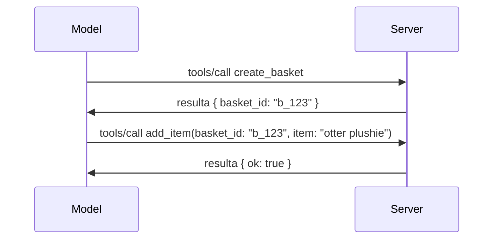

# Ano ang Nagbabago sa MCP: Ang 2026-07-28 Release Candidate

> **Status:** Release Candidate. Ang `2026-07-28` na espesipikasyon ay hindi pa pinal sa oras ng pagsulat. Inanunsyo ito noong Mayo 21, 2026, at naka-iskedyul ilabas sa Hulyo 28, 2026. Lahat ng nasa araling ito ay naglalarawan ng release candidate; tingnan ang [draft specification](https://modelcontextprotocol.io/specification/draft) at ang [changelog](https://modelcontextprotocol.io/specification/draft/changelog) para sa pinakabagong kalagayan bago ka magpatuloy sa pagbuo laban dito. Ang natitirang bahagi ng kurikulum na ito ay nakasulat laban sa kasalukuyang matatag na release, **MCP Specification 2025-11-25**, at ia-update kapag naipadala na ang `2026-07-28`.

## Pangkalahatang-ideya

Ang `2026-07-28` ay ang pinakamalaking rebisyon ng MCP mula nang inilunsad ito. Anim na Specification Enhancement Proposals (SEPs) ang nag-alis ng mga session sa protocol-level at ginawang stateless ang MCP sa transport layer, ang mga extension ay naging unang-klase, bersyonadong mekanismo, at ilang mga tampok na natutunan mo na sa kurikulum na ito (Roots, Sampling, Logging) ay minarkahan na bilang deprecated sa ilalim ng bagong lifecycle policy. Ang araling ito ay nagbubuod kung ano ang nagbabago, bakit ito mahalaga, at ano ang ibig sabihin nito para sa mga code na naisulat mo laban sa `2025-11-25`.

Pinagmulan: [The 2026-07-28 MCP Specification Release Candidate](https://blog.modelcontextprotocol.io/posts/2026-07-28-release-candidate/) (Model Context Protocol Blog, David Soria Parra at Den Delimarsky).

## Mga Layunin sa Pagkatuto

Sa pagtatapos ng araling ito, magagawa mong:

- Ipaliwanag kung bakit lumilipat ang MCP sa isang stateless protocol core at anong problema ang nilulutas nito para sa mga horizontally scaled deployments.
- Ilahad kung paano pinalitan ang `initialize`/`initialized` handshake at ang `Mcp-Session-Id` header.
- Tukuyin ang mga bagong `Mcp-Method` at `Mcp-Name` header at ang metadata para sa caching na `ttlMs`/`cacheScope`.
- Kilalanin ang Extensions framework at ang dalawang extension na kasama sa bersyong ito: MCP Apps at Tasks.
- Ilista ang anim na authorization SEP na nagpapalakas ng pagkakatugma sa OAuth 2.0 / OIDC.
- Tukuyin kung aling mga core feature (Roots, Sampling, Logging) ang ngayon ay deprecated, at ano ang ibig sabihin nito sa praktika.
- Ipaliwanag ang pagbabago sa Full JSON Schema 2020-12 para sa tool na `inputSchema`/`outputSchema`.

## Isang Stateless Protocol

Ang pinaka-malaking pagbabago: nagiging stateless ang MCP sa protocol layer.

### Bago (2025-11-25): mga session na nagbubuklod sa iyo sa iisang server instance

Ang pagtawag ng tool sa Streamable HTTP ay nagsisimula sa `initialize` handshake. Sumagot ang server ng `Mcp-Session-Id` header na kailangang dalhin sa bawat kahilingang susunod:

```http
POST /mcp HTTP/1.1
Mcp-Session-Id: 1868a90c-3a3f-4f5b
Content-Type: application/json

{"jsonrpc":"2.0","id":2,"method":"tools/call",
 "params":{"name":"search","arguments":{"q":"otters"}}}
```

Dahil ang session ay nakatali sa server instance na nag-issue nito, ang mga horizontally scaled deployments ay nangangailangan ng **sticky routing** sa load balancer at isang **shared session store** sa pagitan ng mga instance.

### Pagkatapos (2026-07-28): ang bawat kahilingan ay self-contained

```http
POST /mcp HTTP/1.1
MCP-Protocol-Version: 2026-07-28
Mcp-Method: tools/call
Mcp-Name: search
Content-Type: application/json

{"jsonrpc":"2.0","id":1,"method":"tools/call",
 "params":{"name":"search","arguments":{"q":"otters"},
           "_meta":{"io.modelcontextprotocol/clientInfo":{"name":"my-app","version":"1.0"}}}}
```

Anumang server instance ay maaaring hawakan ang kahilingang ito. Mga pangunahing pagbabago:

- **Inalis ang `initialize`/`initialized` handshake** ([SEP-2575](https://github.com/modelcontextprotocol/modelcontextprotocol/pull/2575)). Ang bersyon ng protocol, impormasyon ng kliyente, at mga kakayahan ng kliyente ay inililipat sa `_meta` sa bawat kahilingan. Ang bagong `server/discover` method ay nagpapahintulot sa kliyente na kunin ang mga kakayahan ng server nang maaga kapag kailangan niya ito.
- **Inalis ang `Mcp-Session-Id` header at ang protocol-level session** ([SEP-2567](https://github.com/modelcontextprotocol/modelcontextprotocol/pull/2567)). Hindi na kailangan ang sticky routing at shared session stores sa protocol layer.

### Stateless protocol, stateful na mga aplikasyon

Ang pag-alis ng protocol-level session ay hindi nangangahulugan na ang iyong server ay hindi maaaring maging stateful. Ang inirerekomendang pattern ay pareho sa ginagamit ng HTTP APIs: gumawa ng isang explicit handle (isang `basket_id`, isang `browser_id`) mula sa isang pagtawag ng tool, at ipasa ng modelo pabalik ang handle bilang isang ordinaryong argumento sa mga susunod na tawag.



Ginagawa nitong nakikita at makatwiran sa modelo ang state sa halip na itago ito sa transport metadata, at pinapayagan ang anumang server instance na hawakan ang anumang tawag.

### Mga server-to-client na kahilingan, naayos muli

Ang isang stateless na protocol ay kailangan pa rin ng paraan para magtanong ang server sa kliyente ng isang bagay habang tumatakbo ang tawag (halimbawa, isang elicitation prompt):

- **Ang mga kahilingang pinasimulan ng server ay maaaring ilabas lamang habang aktibong pinoproseso ng server ang kahilingan ng kliyente** ([SEP-2260](https://github.com/modelcontextprotocol/modelcontextprotocol/pull/2260)) — dati ay rekomendasyon lang, ngayon ay kinakailangan na. Hindi kailanman tinatanong ang user nang walang dahilan.
- **Multi Round-Trip Requests** ([SEP-2322](https://github.com/modelcontextprotocol/modelcontextprotocol/pull/2322)) ang pumalit sa pananatiling bukas ng SSE stream. Sa halip, ang server ay nagbabalik ng `InputRequiredResult`:

  ```json
  {
    "resultType": "inputRequired",
    "inputRequests": {
      "confirm": {
        "type": "elicitation",
        "message": "Delete 3 files?",
        "schema": { "type": "boolean" }
      }
    },
    "requestState": "eyJzdGVwIjoxLCJmaWxlcyI6WyJhIiwiYiIsImMiXX0="
  }
  ```

  Kinokolekta ng kliyente ang mga sagot at muling ipinapadala ang orihinal na tawag gamit ang `inputResponses` kasama ang pina-echo na `requestState`. Anumang server instance ay maaaring tanggapin ang retry dahil lahat ng kailangan ay nasa payload.

### Maaring i-route, ma-cache, ma-trace

Tatlong mas maliliit na pagbabago ang nagpapadali sa pagpapatakbo ng stateless na traffic:

- **Kinakailangan ang `Mcp-Method` at `Mcp-Name` headers sa Streamable HTTP** ([SEP-2243](https://github.com/modelcontextprotocol/modelcontextprotocol/pull/2243)), upang makapag-route ang mga load balancer, gateway, at rate limiter sa operasyon nang hindi na kailangang silipin ang JSON body. Tinatanggihan ng mga server ang mga kahilingang may hindi tugmang headers at katawan.
- **Ang `tools/list` at mga resulta ng pagbasa ng resource ay may `ttlMs` at `cacheScope`** ([SEP-2549](https://github.com/modelcontextprotocol/modelcontextprotocol/pull/2549)), na ginaya mula sa HTTP `Cache-Control`. Alam ng mga kliyente kung gaano katagal sariwa ang resulta ng listahan at kung ligtas ba itong ibahagi sa pagitan ng mga user, nang hindi nangangailangan ng pangmatagalang SSE stream para malaman ang mga pagbabago.
- **Naidokumento ang W3C Trace Context propagation sa `_meta`** ([SEP-414](https://github.com/modelcontextprotocol/modelcontextprotocol/pull/414)), na inaayos ang mga pangalang `traceparent`, `tracestate`, at `baggage` upang masundan ang isang distributed trace ang tawag mula sa client SDK, MCP server, at downstream na mga sistema sa isang [OpenTelemetry](https://opentelemetry.io/)-compatible na backend.

## Ang Extensions ay Nagiging Unang-Klase

Umiral nang hindi pormal ang Extensions sa `2025-11-25`. Inilalagay sa pormal ito ng [SEP-2133](https://github.com/modelcontextprotocol/modelcontextprotocol/pull/2133):

- Natutukoy ang Extensions gamit ang reverse-DNS IDs.
- Napagkakasunduan sa pamamagitan ng `extensions` map sa kakayahan ng kliyente at server.
- Nakatira sa sariling `ext-*` na mga repositoryo na may mga delegated maintainer at naka-berisyon nang hiwalay sa core specification.
- Isang bagong Extensions Track sa proseso ng SEP ang nagbibigay daan mula eksperimento hanggang opisyal.

Dalawang opisyal na extension ang kasama sa bersyong ito.

### MCP Apps: mga server-rendered na user interface

[MCP Apps](https://blog.modelcontextprotocol.io/posts/2026-01-26-mcp-apps/) ([SEP-1865](https://github.com/modelcontextprotocol/modelcontextprotocol/pull/1865)) ay nagpapahintulot sa mga server na magpadala ng interactive na HTML interface na nire-render ng host sa isang sandboxed iframe. Ang mga tool ay nagdedeklara ng kanilang UI templates nang maaga upang ang mga host ay makapag-prefetch, mag-cache, at ma-review para sa seguridad bago pa tumakbo ang anumang bagay. Natutunan mo na ang mga pundamental nito sa [Lesson 15: MCP Apps](../03-GettingStarted/15-mcp-apps/README.md) — sa ilalim ng Extensions framework, ang MCP Apps ay opisyal na extension na kaysa isang experimental na core feature.

### Ang Tasks ay nagtapos bilang extension

Ang Tasks ay ipinadala bilang isang experimental core feature sa `2025-11-25`. Ang paggamit nito sa produksyon ay nagpapakita ng sapat na pagbabago nang ang tamang tirahan nito ay isang extension: ang [Tasks extension](https://github.com/modelcontextprotocol/modelcontextprotocol/pull/2663) ay muling inaayos ang lifecycle sa paligid ng stateless na modelo — maaaring sagutin ng server ang `tools/call` gamit ang task handle, at pinapalakad ito ng kliyente gamit ang `tasks/get`, `tasks/update`, at `tasks/cancel`. Ang paglikha ng task ay dinidirekta ng server: ina-advertise ng kliyente ang extension, at nagpapasya ang server kung kailan dapat tumakbo ang tawag bilang task. Ang `tasks/list` ay tuluyang tinanggal dahil hindi ito ligtas na ma-scope nang walang mga session.

> **Tandaan sa migration:** kung ipinatupad mo ang experimental `2025-11-25` Tasks API, kailangan mong lumipat sa bagong lifecycle ng extension — hindi ito backward compatible.

## Pagpapalakas ng Authorization

Anim na SEP ang nagpapalakas ng [authorization specification](https://modelcontextprotocol.io/specification/draft/basic/authorization) upang mas maging tugma sa mga totoong implementasyon ng OAuth 2.0 / OpenID Connect:

| SEP | Pagbabago |
|---|---|
| [SEP-2468](https://github.com/modelcontextprotocol/modelcontextprotocol/pull/2468) | Kailangang beripikahin ng mga kliyente ang `iss` parameter sa authorization responses ayon sa [RFC 9207](https://www.rfc-editor.org/rfc/rfc9207), upang maiwasan ang mix-up attacks na karaniwan sa pattern ng MCP na isang kliyente, maraming server. Sa susunod na bersyon, kinakailangan nang tanggihan ang mga response na walang `iss`. |
| [SEP-837](https://github.com/modelcontextprotocol/modelcontextprotocol/pull/837) | Ipinapahayag ng mga kliyente ang kanilang OpenID Connect `application_type` sa panahon ng Dynamic Client Registration, para maiwasan ang authorization servers na default na ituring ang desktop/CLI client bilang `"web"` at tanggihan ang redirect URI nito sa localhost. |
| [SEP-2352](https://github.com/modelcontextprotocol/modelcontextprotocol/pull/2352) | Ina-bind ng mga kliyente ang mga rehistradong credentials sa issuer ng authorization server na nag-issue nito at magre-register muli kapag lumipat ang resource sa pagitan ng authorization servers. |
| [SEP-2207](https://github.com/modelcontextprotocol/modelcontextprotocol/pull/2207) | Nagdodokumento kung paano humiling ng refresh tokens mula sa mga authorization servers na tulad ng OpenID Connect. |
| [SEP-2350](https://github.com/modelcontextprotocol/modelcontextprotocol/pull/2350) | Nililinaw ang scope accumulation sa panahon ng step-up authorization. |
| [SEP-2351](https://github.com/modelcontextprotocol/modelcontextprotocol/pull/2351) | Nililinaw ang `.well-known` discovery suffix. |

Kung ikaw ay bumubuo ng isang authorization server para sa MCP ngayon, simulan mo nang magbigay ng `iss` sa authorization responses — tingnan ang [02-Security](../02-Security/README.md) para sa kasalukuyang patnubay sa authorization na gagamitan nito.

## Ang Roots, Sampling, at Logging ay Deprecated Na

Sa ilalim ng bagong [feature lifecycle policy](https://github.com/modelcontextprotocol/modelcontextprotocol/pull/2577) ([SEP-2577](https://github.com/modelcontextprotocol/modelcontextprotocol/pull/2577)), tatlong core client primitives na natutunan mo sa [Core Concepts](./README.md#roots) ang inililipat sa katayuan na **Deprecated**:

| Tampok | Inirerekomendang kapalit |
|---|---|
| Roots | Mga parameter ng tool, mga resource URI, o konfigurasiyon ng server |
| Sampling | Direktang integrasyon sa LLM provider APIs |
| Logging | `stderr` para sa stdio transports; OpenTelemetry para sa naka-istrukturang obserbabilidad |

Ito ay mga **annotation-only deprecations**: ang mga method, types, at capability flags ay patuloy na gagana sa bersyong ito at sa bawat bersyon ng espesipikasyon na inilathala sa loob ng isang taon mula rito. Ang pagtanggal ng alinman dito nang tuluyan ay mangangailangan ng hiwalay na SEP sa ilalim ng lifecycle policy — kaya walang masisira sa iyong umiiral na [Sampling](../03-GettingStarted/14-sampling/README.md) samples ngayon, ngunit ang mga bagong server ay dapat mas piliin ang mga kapalit na pattern sa itaas.

## Full JSON Schema 2020-12 para sa Mga Tool

Ang tool na `inputSchema` at `outputSchema` ay umangat sa full [JSON Schema 2020-12](https://json-schema.org/draft/2020-12) ([SEP-2106](https://github.com/modelcontextprotocol/modelcontextprotocol/pull/2106)):

- Pinananatili ng input schemas ang `type: "object"` na root constraint ngunit ngayon ay pinapayagan ang komposisyon (`oneOf`, `anyOf`, `allOf`), kondisyones, at reference (`$ref`, `$defs`).
- Walang restriksyon ang output schemas, at ang `structuredContent` ay maaari na ngayong anumang JSON value sa halip na isang object lang.
- Hindi dapat awtomatikong i-dereference ng mga implementasyon ang mga external na `$ref` URI at dapat limitahan ang lalim ng schema at oras ng validation (isang denial-of-service na pagsasaalang-alang kung nagsi-validate ka ng schemas sa server side).

Hiwalay dito, ang error code para sa nawawalang resource ay nagbago mula sa MCP-custom na `-32002` patungo sa JSON-RPC standard na `-32602` (Invalid Params) ([SEP-2164](https://github.com/modelcontextprotocol/modelcontextprotocol/pull/2164)). Kung tumutugma ang iyong kliyente sa literal na `-32002` na halaga, kailangan mong i-update ito.

## Paano Papaunlarin ang Protocol Mula Dito

Ang release na ito ay naglalaman ng mga breaking change, na hindi inaasahang maging karaniwan ng mga tagapagpanatili ng MCP sa hinaharap. Tatlong governance SEP ang naglalayong pigilan ang paulit-ulit nito:

- Ang **feature lifecycle policy** ay nagbibigay sa bawat tampok ng landas mula sa Active → Deprecated → Removed na may hindi bababa sa labindalawang buwan sa pagitan ng deprecation at ng pinaka-maagang posibleng pagtanggal.
- Ang **Extensions framework** ay nagpapahintulot sa mga bagong kakayahan na ilabas bilang opt-in na mga extension at dumaan sa stabilisasyon doon bago (kung sakali) isama sa core specification.

- Ang isang Standards Track SEP ay hindi na maaaring maabot ang Final status hanggang sa ang katugmang senaryo ay maipaloob sa [conformance suite](https://github.com/modelcontextprotocol/conformance) ([SEP-2484](https://github.com/modelcontextprotocol/modelcontextprotocol/pull/2484)) — ang parehong suite na ginagamit ng [SDK tier system](https://github.com/modelcontextprotocol/modelcontextprotocol/pull/1777) para sukatin ang pormal na mga SDK.

## Timeline ng Paglabas at Pagpapatunay

- Nai-lock ang release candidate noong Mayo 21, 2026.
- Nakaiskedyul ang pinal na espesipikasyon para sa Hulyo 28, 2026.
- Ang sampung-linggong agwat sa pagitan nila ay nagbibigay-daan sa mga tagapangasiwa ng SDK at mga nagpapatupad ng client upang suriin ang mga pagbabago laban sa totoong trabaho; inaasahan na ang Tier 1 SDKs ay magpapadala ng suporta sa loob ng agwat na ito alinsunod sa [SDK tier system](https://modelcontextprotocol.io/docs/sdk).
- Subaybayan ang buong set ng mga pagbabago sa [draft specification](https://modelcontextprotocol.io/specification/draft) at ang [changelog](https://modelcontextprotocol.io/specification/draft/changelog).

## Ano ang Ibig Sabihin Nito Para sa Kurikulum na Ito

Lahat ng iyong natutunan hanggang ngayon sa kursong ito ay naka-target sa **2025-11-25**, na nananatiling kasalukuyang matatag na espesipikasyon hanggang sa mailabas ang `2026-07-28`. Mas partikular:

- **Mga Sessions at ang `initialize` handshake** (tinalakay sa [Core Concepts](./README.md) at [Lesson 6: HTTP Streaming](../03-GettingStarted/06-http-streaming/README.md)) ay gumagana pa rin gaya ng dokumentado ngayon, ngunit asahan na papalitan ito ng stateless request model sa itaas kapag na-upgrade mo sa mga SDK na compatible sa `2026-07-28`.
- **Sampling at Roots** (tinatalakay din sa [Core Concepts](./README.md)) ay patuloy na ganap na gumagana ngunit deprecated na — mas mainam na piliin ang mga bagong disenyo gamit ang mga pattern na inilarawan sa itaas.
- **Ang experimental na Tasks feature**, kung nagamit mo ito, ay kailangang ilipat sa bagong lifecycle ng Tasks extension.
- **MCP Apps** ([Lesson 15](../03-GettingStarted/15-mcp-apps/README.md)) ay hindi naapektuhan sa praktika; ito ay ililipat lang sa ilalim ng pormal na Extensions framework.

## Karagdagang Mga Sanggunian

- [The 2026-07-28 MCP Specification Release Candidate (blog post)](https://blog.modelcontextprotocol.io/posts/2026-07-28-release-candidate/)
- [The Future of MCP Transports](https://blog.modelcontextprotocol.io/posts/2025-12-19-mcp-transport-future/)
- [MCP Draft Specification](https://modelcontextprotocol.io/specification/draft)
- [MCP Draft Changelog](https://modelcontextprotocol.io/specification/draft/changelog)
- [SEP Guidelines](https://modelcontextprotocol.io/community/sep-guidelines)
- [MCP SDK Tier System](https://modelcontextprotocol.io/docs/sdk)

## Susunod na Mga Hakbang

Bumalik sa [Core Concepts](./README.md) o magpatuloy sa [Security](../02-Security/README.md) upang makita kung paano nauugnay ang gabay na `2025-11-25` ngayon sa mga paparating na pagbabago.

---

<!-- CO-OP TRANSLATOR DISCLAIMER START -->
**Pagtatanggi**:
Ang dokumentong ito ay isinalin gamit ang serbisyo ng AI translation na [Co-op Translator](https://github.com/Azure/co-op-translator). Bagama't nagsusumikap kami para sa katumpakan, pakatandaan na ang awtomatikong pagsasalin ay maaaring maglaman ng mga pagkakamali o hindi pagkakatugma. Ang orihinal na dokumento sa orihinal nitong wika ang dapat ituring na pangunahing sanggunian. Para sa mahahalagang impormasyon, inirerekomenda ang propesyonal na pagsasalin ng tao. Hindi kami mananagot sa anumang maling pagkakaintindi o maling interpretasyon na nagmula sa paggamit ng pagsasaling ito.
<!-- CO-OP TRANSLATOR DISCLAIMER END -->