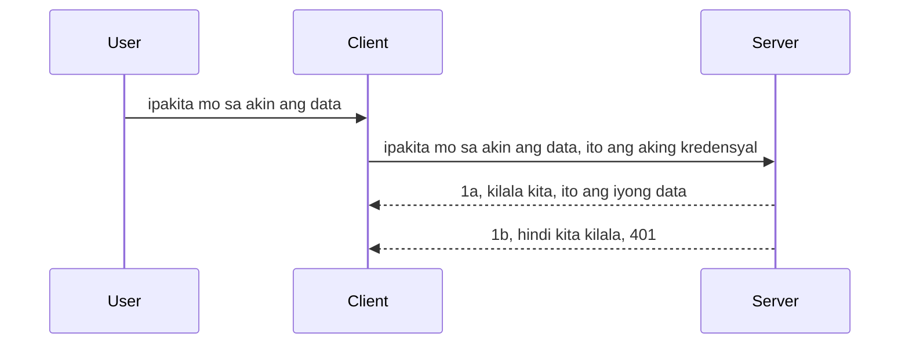

# Simple na auth

Sinusuportahan ng MCP SDKs ang paggamit ng OAuth 2.1 na sa totoo lang ay isang medyo kumplikadong proseso na kinabibilangan ng mga konsepto tulad ng auth server, resource server, pagpapadala ng mga kredensyal, pagkuha ng code, pagpapalit ng code para sa isang bearer token hanggang sa makuha mo na ang iyong resource data. Kung hindi ka pa masanay sa OAuth na isang magandang bagay na ipatupad, magandang simulan muna sa isang basic level ng auth at pauntuning i-develop ito patungo sa mas maayos na seguridad. Kaya nandito ang kabanatang ito, upang gabayan ka patungo sa mas advanced na auth.

## Ano ang ibig sabihin ng Auth?

Ang Auth ay pinaikling salita para sa authentication at authorization. Ang ideya ay kailangan nating gawin ang dalawang bagay:

- **Authentication**, ang proseso ng pagtukoy kung pinapayagan ba nating pumasok ang isang tao sa ating bahay, kung may karapatan silang "narito" ibig sabihin ay may access sila sa ating resource server kung saan nakatira ang mga MCP Server features.
- **Authorization**, ay ang proseso ng pagtukoy kung dapat bang magkaroon ng access ang user sa mga partikular na resources na hinihiling nila, halimbawa ang mga orders o mga produkto o kung pinapayagan silang basahin ang nilalaman ngunit hindi mag-delete bilang isa pang halimbawa.

## Mga Kredensyal: Paano natin sasabihin sa system kung sino tayo

Karamihan ng mga web developer ay nag-iisip sa pagbibigay ng kredensyal sa server, karaniwang isang sikreto na nagsasabi kung pinapayagan silang narito "Authentication". Ang kredensyal na ito ay karaniwang naka-base64 encoded na bersyon ng username at password o isang API key na natatanging nagpapakilala sa isang partikular na user.

Kasama dito ang pagpapadala nito sa pamamagitan ng header na tinatawag na "Authorization" ng ganito:

```json
{ "Authorization": "secret123" }
```

Karaniwang tinatawag itong basic authentication. Ang pangkalahatang daloy nito ay gumagana sa ganitong paraan:



Ngayon na nauunawaan natin kung paano ito gumagana sa pananaw ng daloy, paano natin ito ipatutupad? Karamihan ng mga web server ay may konsepto na tinatawag na middleware, isang bahagi ng code na tumatakbo bilang bahagi ng request na maaaring beripikahin ang mga kredensyal, at kung ang mga kredensyal ay wasto ay papayagan ang request na makalusot. Kung ang request ay walang wastong kredensyal ay makakakuha ka ng auth error. Tingnan natin kung paano ito maipapatupad:

**Python**

```python
class AuthMiddleware(BaseHTTPMiddleware):
    async def dispatch(self, request, call_next):

        has_header = request.headers.get("Authorization")
        if not has_header:
            print("-> Missing Authorization header!")
            return Response(status_code=401, content="Unauthorized")

        if not valid_token(has_header):
            print("-> Invalid token!")
            return Response(status_code=403, content="Forbidden")

        print("Valid token, proceeding...")
       
        response = await call_next(request)
        # magdagdag ng kahit anong customer headers o baguhin ang response sa anumang paraan
        return response


starlette_app.add_middleware(CustomHeaderMiddleware)
```

Narito tayo:

- Nilikha ang middleware na tinatawag na `AuthMiddleware` kung saan ang `dispatch` method nito ay tinatawag ng web server.
- Idinagdag ang middleware sa web server:

    ```python
    starlette_app.add_middleware(AuthMiddleware)
    ```

- Nakasulat ang validation logic na nagsusuri kung naroroon ang Authorization header at kung valid ang secret na ipinadala:

    ```python
    has_header = request.headers.get("Authorization")
    if not has_header:
        print("-> Missing Authorization header!")
        return Response(status_code=401, content="Unauthorized")

    if not valid_token(has_header):
        print("-> Invalid token!")
        return Response(status_code=403, content="Forbidden")
    ```

    kung ang secret ay naroroon at valid, papayagan natin ang request na makalusot sa pamamagitan ng pagtawag ng `call_next` at ibabalik ang response.

    ```python
    response = await call_next(request)
    # magdagdag ng anumang customer headers o baguhin ang tugon sa anumang paraan
    return response
    ```

Ganito ang pag-andar: kapag may web request na ginawa papunta sa server, tatawagin ang middleware at ayon sa implementasyon nito ay papayagan ang request makalusot o magbabalik ng error na nagsasaad na hindi pinapayagan ang kliyente na magpatuloy.

**TypeScript**

Dito tayo gagawa ng middleware gamit ang popular na framework na Express at aabutin ang request bago ito makarating sa MCP Server. Narito ang code para doon:

```typescript
function isValid(secret) {
    return secret === "secret123";
}

app.use((req, res, next) => {
    // 1. Naroroon ba ang authorization header?
    if(!req.headers["Authorization"]) {
        res.status(401).send('Unauthorized');
    }
    
    let token = req.headers["Authorization"];

    // 2. Suriin ang bisa.
    if(!isValid(token)) {
        res.status(403).send('Forbidden');
    }

   
    console.log('Middleware executed');
    // 3. Ipinapasa ang kahilingan sa susunod na hakbang sa pipeline ng kahilingan.
    next();
});
```

Sa code na ito ay:

1. Sine-check kung naroroon ang Authorization header sa unang pagkakataon, kung wala, magpapadala tayo ng 401 error.
2. Sini-secure na valid ang credential/token, kung hindi, magpapadala tayo ng 403 error.
3. Panghuli, pinapasa ang request sa request pipeline at ibinabalik ang hinihiling na resource.

## Ehersisyo: Ipatupad ang authentication

Gamitin natin ang ating kaalaman at subukan ipatupad ito. Narito ang plano:

Server

- Gumawa ng web server at MCP instance.
- Ipatupad ang middleware para sa server.

Client 

- Magpadala ng web request, gamit ang kredensyal, sa pamamagitan ng header.

### -1- Gumawa ng web server at MCP instance

> **Tumingin sa hinaharap:** Ang halimbawa ng TypeScript sa ibaba ay sumusubaybay ng mga HTTP transport sa isang `transports` na mapa na may key na `mcp-session-id`, ayon sa **MCP Specification 2025-11-25**. Ang release candidate na `2026-07-28` ay aalisin ang `initialize` handshake at session ID nang tuluyan, kaya mawawala ang per-session transport map na ito bilang kapalit ng stateless, self-contained na mga request. Tingnan ang [Ano ang Nagbabago sa MCP: Ang 2026-07-28 Release Candidate](../../01-CoreConcepts/mcp-2026-07-28-release-candidate.md).

Sa unang hakbang, kailangan nating likhain ang web server instance at MCP Server.

**Python**

Dito tayo lumilikha ng MCP server instance, gumagawa ng starlette web app at ina-host ito gamit ang uvicorn.

```python
# lumilikha ng MCP Server

app = FastMCP(
    name="MCP Resource Server",
    instructions="Resource Server that validates tokens via Authorization Server introspection",
    host=settings["host"],
    port=settings["port"],
    debug=True
)

# lumilikha ng starlette web app
starlette_app = app.streamable_http_app()

# nagse-serve ng app gamit ang uvicorn
async def run(starlette_app):
    import uvicorn
    config = uvicorn.Config(
            starlette_app,
            host=app.settings.host,
            port=app.settings.port,
            log_level=app.settings.log_level.lower(),
        )
    server = uvicorn.Server(config)
    await server.serve()

run(starlette_app)
```

Sa code na ito ay:

- Nililikha ang MCP Server.
- Binubuo ang starlette web app mula sa MCP Server, `app.streamable_http_app()`.
- Ina-host at sineserbisyo ang web app gamit ang uvicorn `server.serve()`.

**TypeScript**

Dito tayo lumilikha ng MCP Server instance.

```typescript
const server = new McpServer({
      name: "example-server",
      version: "1.0.0"
    });

    // ... itakda ang mga yaman ng server, mga kagamitan, at mga prompt ...
```

Kailangang mangyari ang paglikha ng MCP Server ito sa loob ng ating POST /mcp route definition, kaya ililipat natin ang code sa itaas nang ganito:

```typescript
import express from "express";
import { randomUUID } from "node:crypto";
import { McpServer } from "@modelcontextprotocol/sdk/server/mcp.js";
import { StreamableHTTPServerTransport } from "@modelcontextprotocol/sdk/server/streamableHttp.js";
import { isInitializeRequest } from "@modelcontextprotocol/sdk/types.js"

const app = express();
app.use(express.json());

// Mapa para mag-imbak ng mga transport ayon sa session ID
const transports: { [sessionId: string]: StreamableHTTPServerTransport } = {};

// Pangasiwaan ang mga POST na kahilingan para sa komunikasyon ng kliyente-sa-server
app.post('/mcp', async (req, res) => {
  // Suriin kung may umiiral na session ID
  const sessionId = req.headers['mcp-session-id'] as string | undefined;
  let transport: StreamableHTTPServerTransport;

  if (sessionId && transports[sessionId]) {
    // Gamitin muli ang umiiral na transport
    transport = transports[sessionId];
  } else if (!sessionId && isInitializeRequest(req.body)) {
    // Bagong kahilingan para sa inisyal na pagsisimula
    transport = new StreamableHTTPServerTransport({
      sessionIdGenerator: () => randomUUID(),
      onsessioninitialized: (sessionId) => {
        // I-imbak ang transport ayon sa session ID
        transports[sessionId] = transport;
      },
      // Ang proteksyon laban sa DNS rebinding ay hindi pinapagana bilang default para sa pagsuporta sa mga luma. Kung pinapatakbo mo ang server na ito
      // ng lokal, siguraduhing itakda:
      // enableDnsRebindingProtection: true,
      // allowedHosts: ['127.0.0.1'],
    });

    // Linisin ang transport kapag isinarado
    transport.onclose = () => {
      if (transport.sessionId) {
        delete transports[transport.sessionId];
      }
    };
    const server = new McpServer({
      name: "example-server",
      version: "1.0.0"
    });

    // ... ayusin ang mga server na resources, mga kagamitan, at mga paanyaya ...

    // Kumonekta sa MCP server
    await server.connect(transport);
  } else {
    // Hindi wastong kahilingan
    res.status(400).json({
      jsonrpc: '2.0',
      error: {
        code: -32000,
        message: 'Bad Request: No valid session ID provided',
      },
      id: null,
    });
    return;
  }

  // Pangasiwaan ang kahilingan
  await transport.handleRequest(req, res, req.body);
});

// Muling magagamit na tagapangasiwa para sa mga GET at DELETE na kahilingan
const handleSessionRequest = async (req: express.Request, res: express.Response) => {
  const sessionId = req.headers['mcp-session-id'] as string | undefined;
  if (!sessionId || !transports[sessionId]) {
    res.status(400).send('Invalid or missing session ID');
    return;
  }
  
  const transport = transports[sessionId];
  await transport.handleRequest(req, res);
};

// Pangasiwaan ang mga GET na kahilingan para sa mga paabiso mula server papunta sa kliyente sa pamamagitan ng SSE
app.get('/mcp', handleSessionRequest);

// Pangasiwaan ang mga DELETE na kahilingan para sa pagtatapos ng session
app.delete('/mcp', handleSessionRequest);

app.listen(3000);
```

Ngayon makikita mo kung paano nailipat ang paglikha ng MCP Server sa loob ng `app.post("/mcp")`.

Lumipat tayo sa susunod na hakbang para gumawa ng middleware para ma-validate ang papasok na kredensyal.

### -2- Ipatupad ang middleware para sa server

Susunod, gagawa tayo ng middleware na naghahanap ng kredensyal sa `Authorization` header at vavalidate ito. Kung ito ay katanggap-tanggap, magpapatuloy ang request upang gawin ang kailangan nitong gawin (halimbawa mag-lista ng mga tools, basahin ang resource o anumang functionality ng MCP na hinihiling ng client).

**Python**

Para gumawa ng middleware, kailangan nating gumawa ng klase na namamana mula sa `BaseHTTPMiddleware`. May dalawang mahalagang bahagi:

- Ang request `request`, kung saan binabasa natin ang header info.
- `call_next` ang callback na kailangan nating tawagan kung nagdala ang client ng isang kredensyal na tinatanggap natin.

Una, kailangan nating tugunan kung nawawala ang `Authorization` header:

```python
has_header = request.headers.get("Authorization")

# walang header na naroroon, mabigo gamit ang 401, kung hindi ay magpatuloy.
if not has_header:
    print("-> Missing Authorization header!")
    return Response(status_code=401, content="Unauthorized")
```

Dito nagpapadala tayo ng 401 unauthorized na mensahe dahil pumapalya ang client sa authentication.

Sunod, kung nag-submit ng kredensyal, kailangan nating suriin ang bisa nito ganito:

```python
 if not valid_token(has_header):
    print("-> Invalid token!")
    return Response(status_code=403, content="Forbidden")
```

Pansinin kung paano tayo nagpapadala ng 403 forbidden na mensahe sa itaas. Tingnan natin ang buong middleware na ipinatupad ang lahat ng nabanggit sa itaas:

```python
class AuthMiddleware(BaseHTTPMiddleware):
    async def dispatch(self, request, call_next):

        has_header = request.headers.get("Authorization")
        if not has_header:
            print("-> Missing Authorization header!")
            return Response(status_code=401, content="Unauthorized")

        if not valid_token(has_header):
            print("-> Invalid token!")
            return Response(status_code=403, content="Forbidden")

        print("Valid token, proceeding...")
        print(f"-> Received {request.method} {request.url}")
        response = await call_next(request)
        response.headers['Custom'] = 'Example'
        return response

```

Magaling, pero paano ang tungkol sa `valid_token` na function? Narito ito sa ibaba:

```python
# Huwag gamitin para sa produksyon - pagbutihin ito !!
def valid_token(token: str) -> bool:
    # alisin ang prefix na "Bearer "
    if token.startswith("Bearer "):
        token = token[7:]
        return token == "secret-token"
    return False
```

Ito ay siyempre kailangang pagbutihin.

MAHALAGA: Huwag kailanman maglagay ng mga sikreto tulad nito sa code. Mas mainam na kunin ang value na ikukumpara mula sa isang data source o mula sa isang IDP (identity service provider) o mas mabuting hayaang ang IDP ang gumawa ng validation.

**TypeScript**

Para ipatupad ito sa Express, kailangan nating tawagan ang `use` method na tumatanggap ng mga middleware function.

Kailangan nating:

- Makipag-ugnayan sa request variable para suriin ang ipinasa na kredensyal sa `Authorization` property.
- I-validate ang kredensyal, at kung oo, hayaang magpatuloy ang request at gawin ng MCP request ng client ang nararapat (halimbawa mag-lista ng tools, magbasa ng resource o anumang kaugnay ng MCP).

Dito, tinitingnan natin kung naroroon ang `Authorization` header at kung wala, pinipigilan ang pagdaan ng request:

```typescript
if(!req.headers["authorization"]) {
    res.status(401).send('Unauthorized');
    return;
}
```

Kung hindi ipinadala ang header sa unang pagkakataon, makakatanggap ka ng 401.

Sunod, sinusuri natin kung valid ang kredensyal, kung hindi, muli nating pinipigilan ang request ngunit may bahagyang ibang mensahe:

```typescript
if(!isValid(token)) {
    res.status(403).send('Forbidden');
    return;
} 
```

Pansinin kung paano ngayon ka nakakakuha ng 403 error.

Narito ang buong code:

```typescript
app.use((req, res, next) => {
    console.log('Request received:', req.method, req.url, req.headers);
    console.log('Headers:', req.headers["authorization"]);
    if(!req.headers["authorization"]) {
        res.status(401).send('Unauthorized');
        return;
    }
    
    let token = req.headers["authorization"];

    if(!isValid(token)) {
        res.status(403).send('Forbidden');
        return;
    }  

    console.log('Middleware executed');
    next();
});
```

Naitakda na natin ang web server upang tumanggap ng middleware para suriin ang kredensyal na sana ay ipinapadala sa atin ng client. Paano naman ang client mismo?

### -3- Magpadala ng web request gamit ang kredensyal sa header

Kailangan nating siguruhin na ipinapasa ng client ang kredensyal sa header. Gagamit tayo ng MCP client para gawin ito, kaya kailangan nating alamin kung paano ito ginagawa.

**Python**

Para sa client, kailangan nating magpasa ng header gamit ang ating kredensyal ganito:

```python
# HUWAG i-hardcode ang halaga, ilagay ito kahit man lang sa isang environment variable o mas ligtas na imbakan
token = "secret-token"

async with streamablehttp_client(
        url = f"http://localhost:{port}/mcp",
        headers = {"Authorization": f"Bearer {token}"}
    ) as (
        read_stream,
        write_stream,
        session_callback,
    ):
        async with ClientSession(
            read_stream,
            write_stream
        ) as session:
            await session.initialize()
      
            # TODO, kung ano ang gusto mong gawin sa client, hal. maglista ng mga tools, tawagan ang mga tools, atbp.
```

Pansinin kung paano natin nilalagyan ang `headers` property ng ` headers = {"Authorization": f"Bearer {token}"}`.

**TypeScript**

Maaari nating lutasin ito sa dalawang hakbang:

1. Punan ang isang configuration object gamit ang ating kredensyal.
2. Ibigay ang configuration object sa transport.

```typescript

// HUWAG i-hardcode ang halaga tulad ng ipinapakita dito. Sa pinaka-kakaunti, ilagay ito bilang isang env variable at gumamit ng katulad ng dotenv (sa dev mode).
let token = "secret123"

// tukuyin ang isang client transport option object
let options: StreamableHTTPClientTransportOptions = {
  sessionId: sessionId,
  requestInit: {
    headers: {
      "Authorization": "secret123"
    }
  }
};

// ipasa ang options object sa transport
async function main() {
   const transport = new StreamableHTTPClientTransport(
      new URL(serverUrl),
      options
   );
```

Makikita dito sa itaas kung paano natin kailangang gumawa ng `options` object at ilagay ang mga headers sa ilalim ng `requestInit` property.

MAHALAGA: Paano tayo magpapabuti mula dito? Ang kasalukuyang implementasyon ay may ilang isyu. Una, ang pagpapasa ng kredensyal na ganito ay mapanganib maliban kung mayroon kang HTTPS. Kahit ganun, maaaring manakaw ang kredensyal kaya kailangan ng sistema kung saan madali mong mare-revoke ang token at magdagdag ng mga karagdagang tseke tulad ng kung saan galing ang request, kung palaging nangyayari ang request (bot-like behavior), sa madaling salita, maraming pag-aalala. 

Gayunpaman, masasabi na para sa sobrang simpleng mga API kung saan ayaw mong tumawag ang kahit sino sa iyong API nang hindi authenticated at kung ano ang meron tayo dito ay isang magandang simula.

Dahil dito, subukan nating palakasin pa ang seguridad sa paggamit ng standardized na format tulad ng JSON Web Token, na kilala rin bilang JWT o "JOT" tokens.

## JSON Web Tokens, JWT

Kaya, sinusubukan nating pagandahin ang mga bagay mula sa pagpapadala ng sobrang simpleng kredensyal. Ano ang mga agarang benepisyo ng paggamit ng JWT?

- **Pagbuti sa Seguridad**. Sa basic auth, paulit-ulit mong ipinapadala ang username at password bilang base64 encoded token (o nagpapadala ka ng API key) na nagpapataas ng panganib. Sa JWT, ipapadala mo ang iyong username at password at makakakuha ka ng token bilang kapalit at ito ay may takdang oras kaya mag-e-expire ito. Pinapadali ng JWT ang paggamit ng fine-grained access control gamit ang roles, scopes at permissions.
- **Statelessness at scalability**. Ang JWT ay self-contained, bitbit nito lahat ng impormasyon tungkol sa user at inaalis ang pangangailangan ng pag-imbak ng server-side session storage. Puwede ring i-validate ang token nang lokal.
- **Interoperability at federation**. Ang JWT ay sentro ng Open ID Connect at ginagamit kasama ng kilalang identity providers tulad ng Entra ID, Google Identity at Auth0. Pinapayagan din nito ang single sign on at marami pang iba na ginagawa itong enterprise-grade.
- **Modularity at flexibility**. Ang JWT ay puwedeng gamitin sa API Gateways tulad ng Azure API Management, NGINX at iba pa. Sinuportahan din nito ang use authentication scenarios at server-to-service communication kabilang ang impersonation at delegation scenarios.
- **Performance at caching**. Ang JWT ay pwedeng i-cache pagkatapos itong i-decode na nagpapababa sa pangangailangan ng parsing. Nakakatulong ito lalo na sa mga high-traffic apps dahil pinapabuti nito ang throughput at nagpapababa ng load sa piniling imprastruktura.
- **Advanced na mga tampok**. Sinuportahan din nito ang introspection (pagsusuri ng bisa sa server) at revocation (paggawing invalid ng token).

Sa lahat ng mga benepisyong ito, tingnan natin kung paano natin maiuuwi sa mas mataas na antas ang ating implementasyon.

## Pagpapalit ng basic auth sa JWT

Kaya, ang mga pagbabago na kailangan nating gawin sa mataas na antas ay:

- **Matutunan kung paano bumuo ng JWT token** at gawin itong handa para ipadala mula sa client papuntang server.
- **I-validate ang JWT token**, at kung tama, hayaan ang client magkaroon ng ating mga resources.
- **Secure na pag-iimbak ng token**. Paano natin iniimbak ang token na ito.
- **Protektahan ang mga ruta**. Kailangan nating protektahan ang mga ruta, sa ating kaso, kailangan nating protektahan ang mga ruta at partikular na mga MCP features.
- **Magdagdag ng refresh tokens**. Siguruhin na gumagawa tayo ng mga token na panandalian lang ngunit may refresh tokens na pangmatagalan na puwedeng gamitin para kumuha ng bagong token kung mag-expire. Siguraduhin ding may refresh endpoint at rotation strategy.

### -1- Bumuo ng JWT token

Una, ang JWT token ay may sumusunod na bahagi:

- **header**, algorithm na ginamit at uri ng token.
- **payload**, mga claims, tulad ng sub (ang user o entidad na kinakatawan ng token. Sa auth scenario ito ay karaniwang ang userid), exp (kung kailan ito mag-e-expire) role (ang role)
- **signature**, nilagdaan gamit ang sikreto o pribadong susi.

Para dito, kailangan nating bumuo ng header, payload at i-encode ang token.

**Python**

```python

import jwt
import jwt
from jwt.exceptions import ExpiredSignatureError, InvalidTokenError
import datetime

# Lihim na susi na ginagamit upang lagdaan ang JWT
secret_key = 'your-secret-key'

header = {
    "alg": "HS256",
    "typ": "JWT"
}

# ang impormasyon ng gumagamit at ang mga claim nito at oras ng pag-expire
payload = {
    "sub": "1234567890",               # Paksa (ID ng gumagamit)
    "name": "User Userson",                # Pasadyang claim
    "admin": True,                     # Pasadyang claim
    "iat": datetime.datetime.utcnow(),# Inilabas noong
    "exp": datetime.datetime.utcnow() + datetime.timedelta(hours=1)  # Pag-expire
}

# i-encode ito
encoded_jwt = jwt.encode(payload, secret_key, algorithm="HS256", headers=header)
```

Sa code sa itaas ay:

- Nakagawa ng header gamit ang HS256 bilang algorithm at type bilang JWT.
- Nilikha ang payload na naglalaman ng subject o user id, username, role, kung kailan ito inilabas at kailan ito mag-e-expire kaya naipatupad ang time bound na aspeto na nabanggit natin.

**TypeScript**

Dito kakailanganin natin ng ilang dependencies na tutulong gumawa ng JWT token.

Dependencies

```sh

npm install jsonwebtoken
npm install --save-dev @types/jsonwebtoken
```

Ngayon na mayroon na tayo nito, gawin natin ang header, payload at sa pamamagitan nito gawin ang encoded token.

```typescript
import jwt from 'jsonwebtoken';

const secretKey = 'your-secret-key'; // Gamitin ang mga env vars sa produksyon

// I-defina ang payload
const payload = {
  sub: '1234567890',
  name: 'User usersson',
  admin: true,
  iat: Math.floor(Date.now() / 1000), // Inilabas noong
  exp: Math.floor(Date.now() / 1000) + 60 * 60 // Mag-e-expire sa loob ng 1 oras
};

// I-defina ang header (opsyonal, ang jsonwebtoken ay nagtatakda ng mga default)
const header = {
  alg: 'HS256',
  typ: 'JWT'
};

// Gumawa ng token
const token = jwt.sign(payload, secretKey, {
  algorithm: 'HS256',
  header: header
});

console.log('JWT:', token);
```

Ang token na ito ay:

Nilagdaan gamit ang HS256
Valid para sa 1 oras
May mga claims tulad ng sub, name, admin, iat, at exp.

### -2- I-validate ang token

Kailangan din nating i-validate ang token, ito ay isang bagay na dapat nating gawin sa server upang matiyak na ang ipinapadala sa atin ng client ay tunay na valid. May maraming tseke na dapat gawin dito mula sa pag-validate ng istruktura nito hanggang sa pagiging wasto nito. Pinapayuhan ka rin na magdagdag ng iba pang tseke para makita kung ang user ay nasa iyong sistema at iba pa.

Para i-validate ang token, kailangan muna natin itong i-decode upang mabasa at pagkatapos ay simulan ang pagtingin ng bisa nito:

**Python**

```python

# I-decode at beripikahin ang JWT
try:
    decoded = jwt.decode(token, secret_key, algorithms=["HS256"])
    print("✅ Token is valid.")
    print("Decoded claims:")
    for key, value in decoded.items():
        print(f"  {key}: {value}")
except ExpiredSignatureError:
    print("❌ Token has expired.")
except InvalidTokenError as e:
    print(f"❌ Invalid token: {e}")

```


Sa code na ito, tinawag natin ang `jwt.decode` gamit ang token, ang secret key, at ang piniling algorithm bilang input. Pansinin kung paano natin ginamit ang try-catch na konstruksyon dahil kapag nabigo ang validation, magreresulta ito sa error.

**TypeScript**

Dito kailangang tawagin ang `jwt.verify` upang makakuha ng decoded na bersyon ng token na maaari nating pag-aralan pa. Kung mabigo ang tawag na ito, ibig sabihin ay mali ang estruktura ng token o hindi na ito valid.

```typescript

try {
  const decoded = jwt.verify(token, secretKey);
  console.log('Decoded Payload:', decoded);
} catch (err) {
  console.error('Token verification failed:', err);
}
```

NOTE: tulad ng nabanggit kanina, dapat tayong magsagawa ng karagdagang pagsusuri upang masiguro na ang token na ito ay tumutukoy sa isang user sa ating sistema at tiyaking ang user ay may mga karapatan na sinasabi nitong mayroon siya.

Sunod, tingnan naman natin ang role based access control, na kilala rin bilang RBAC.

## Pagdaragdag ng role based access control

Ang ideya ay nais nating ipakita na ang iba't ibang mga role ay may iba't ibang mga pahintulot. Halimbawa, inaakalang ang admin ay maaaring gawin ang lahat, ang isang normal na user ay maaaring magbasa/sumulat, at ang bisita ay maaaring magbasa lamang. Kaya, narito ang ilang posibleng antas ng pahintulot:

- Admin.Write 
- User.Read
- Guest.Read

Tingnan natin kung paano tayo makakagawa ng ganitong kontrol gamit ang middleware. Maaaring magdagdag ng middleware per route pati na rin para sa lahat ng routes.

**Python**

```python
from starlette.middleware.base import BaseHTTPMiddleware
from starlette.responses import JSONResponse
import jwt

# HUWAG ilagay ang sikreto sa code tulad nito, para lamang ito sa layunin ng demonstrasyon. Basahin ito mula sa isang ligtas na lugar.
SECRET_KEY = "your-secret-key" # ilagay ito sa env variable
REQUIRED_PERMISSION = "User.Read"

class JWTPermissionMiddleware(BaseHTTPMiddleware):
    async def dispatch(self, request, call_next):
        auth_header = request.headers.get("Authorization")
        if not auth_header or not auth_header.startswith("Bearer "):
            return JSONResponse({"error": "Missing or invalid Authorization header"}, status_code=401)

        token = auth_header.split(" ")[1]
        try:
            decoded = jwt.decode(token, SECRET_KEY, algorithms=["HS256"])
        except jwt.ExpiredSignatureError:
            return JSONResponse({"error": "Token expired"}, status_code=401)
        except jwt.InvalidTokenError:
            return JSONResponse({"error": "Invalid token"}, status_code=401)

        permissions = decoded.get("permissions", [])
        if REQUIRED_PERMISSION not in permissions:
            return JSONResponse({"error": "Permission denied"}, status_code=403)

        request.state.user = decoded
        return await call_next(request)


```

Mayroong ilang iba't ibang paraan upang idagdag ang middleware tulad ng nasa ibaba:

```python

# Alt 1: magdagdag ng middleware habang binubuo ang starlette app
middleware = [
    Middleware(JWTPermissionMiddleware)
]

app = Starlette(routes=routes, middleware=middleware)

# Alt 2: magdagdag ng middleware pagkatapos mabuo ang starlette app
starlette_app.add_middleware(JWTPermissionMiddleware)

# Alt 3: magdagdag ng middleware sa bawat ruta
routes = [
    Route(
        "/mcp",
        endpoint=..., # tagapamahala
        middleware=[Middleware(JWTPermissionMiddleware)]
    )
]
```

**TypeScript**

Maaari nating gamitin ang `app.use` at isang middleware na tatakbo para sa lahat ng kahilingan.

```typescript
app.use((req, res, next) => {
    console.log('Request received:', req.method, req.url, req.headers);
    console.log('Headers:', req.headers["authorization"]);

    // 1. Suriin kung naipadala na ang authorization header

    if(!req.headers["authorization"]) {
        res.status(401).send('Unauthorized');
        return;
    }
    
    let token = req.headers["authorization"];

    // 2. Suriin kung ang token ay wasto
    if(!isValid(token)) {
        res.status(403).send('Forbidden');
        return;
    }  

    // 3. Suriin kung ang user ng token ay umiiral sa aming sistema
    if(!isExistingUser(token)) {
        res.status(403).send('Forbidden');
        console.log("User does not exist");
        return;
    }
    console.log("User exists");

    // 4. Patunayan na ang token ay may tamang mga pahintulot
    if(!hasScopes(token, ["User.Read"])){
        res.status(403).send('Forbidden - insufficient scopes');
    }

    console.log("User has required scopes");

    console.log('Middleware executed');
    next();
});

```

Maraming mga bagay ang maaari nating hayaan sa middleware natin at mga dapat gawin ng middleware natin, tulad ng:

1. Suriin kung naroroon ang authorization header
2. Suriin kung valid ang token, tinatawag natin ang `isValid` na isang method na ginawa natin upang suriin ang integridad at bisa ng JWT token.
3. Siyasatin kung umiiral ang user sa ating sistema, dapat natin itong suriin.

   ```typescript
    // mga gumagamit sa DB
   const users = [
     "user1",
     "User usersson",
   ]

   function isExistingUser(token) {
     let decodedToken = verifyToken(token);

     // TODO, suriin kung ang gumagamit ay umiiral sa DB
     return users.includes(decodedToken?.name || "");
   }
   ```

   Sa itaas, gumawa tayo ng napakasimpleng listahan ng `users`, na dapat ay nasa database ito syempre.

4. Bukod dito, dapat din nating suriin kung ang token ay may wastong mga pahintulot.

   ```typescript
   if(!hasScopes(token, ["User.Read"])){
        res.status(403).send('Forbidden - insufficient scopes');
   }
   ```

   Sa code na ito mula sa middleware, sinisigurado natin na ang token ay naglalaman ng User.Read permission, kung wala ay nagpapadala tayo ng 403 error. Narito ang `hasScopes` na helper method.

   ```typescript
   function hasScopes(scope: string, requiredScopes: string[]) {
     let decodedToken = verifyToken(scope);
    return requiredScopes.every(scope => decodedToken?.scopes.includes(scope));
  }
   ```

Have a think which additional checks you should be doing, but these are the absolute minimum of checks you should be doing.

Using Express as a web framework is a common choice. There are helpers library when you use JWT so you can write less code.

- `express-jwt`, helper library that provides a middleware that helps decode your token.
- `express-jwt-permissions`, this provides a middleware `guard` that helps check if a certain permission is on the token.

Here's what these libraries can look like when used:

```typescript
const express = require('express');
const jwt = require('express-jwt');
const guard = require('express-jwt-permissions')();

const app = express();
const secretKey = 'your-secret-key'; // put this in env variable

// Decode JWT and attach to req.user
app.use(jwt({ secret: secretKey, algorithms: ['HS256'] }));

// Check for User.Read permission
app.use(guard.check('User.Read'));

// multiple permissions
// app.use(guard.check(['User.Read', 'Admin.Access']));

app.get('/protected', (req, res) => {
  res.json({ message: `Welcome ${req.user.name}` });
});

// Error handler
app.use((err, req, res, next) => {
  if (err.code === 'permission_denied') {
    return res.status(403).send('Forbidden');
  }
  next(err);
});

```

Ngayon ay nakita mo na kung paano magagamit ang middleware para sa parehong authentication at authorization, paano naman ang MCP, nagbabago ba nito ang paraan ng ating auth? Alamin natin sa susunod na seksyon.

### -3- Magdagdag ng RBAC sa MCP

Nakita mo na kung paano magdagdag ng RBAC gamit ang middleware, ngunit para sa MCP, walang madaling paraan upang magdagdag ng RBAC per feature ng MCP, kaya ano ang gagawin natin? Kailangan lang nating magdagdag ng code na tulad nito na sinisiyasat kung ang client ay may karapatan na tumawag sa isang partikular na tool:

May ilang iba't ibang pagpipilian kung paano maisasakatuparan ang per feature RBAC, narito ang ilan:

- Magdagdag ng pagsusuri para sa bawat tool, resource, prompt kung saan kailangan mong suriin ang level ng pahintulot.

   **python**

   ```python
   @tool()
   def delete_product(id: int):
      try:
          check_permissions(role="Admin.Write", request)
      catch:
        pass # nabigo ang kliyente sa awtorisasyon, magtaas ng error sa awtorisasyon
   ```

   **typescript**

   ```typescript
   server.registerTool(
    "delete-product",
    {
      title: Delete a product",
      description: "Deletes a product",
      inputSchema: { id: z.number() }
    },
    async ({ id }) => {
      
      try {
        checkPermissions("Admin.Write", request);
        // todo, ipadala ang id sa productService at remote entry
      } catch(Exception e) {
        console.log("Authorization error, you're not allowed");  
      }

      return {
        content: [{ type: "text", text: `Deletected product with id ${id}` }]
      };
    }
   );
   ```


- Gumamit ng advanced na estratehiya sa server at request handlers upang mabawasan ang bilang ng mga lugar na kailangang magsagawa ng pagsusuri.

   **Python**

   ```python
   
   tool_permission = {
      "create_product": ["User.Write", "Admin.Write"],
      "delete_product": ["Admin.Write"]
   }

   def has_permission(user_permissions, required_permissions) -> bool:
      # user_permissions: listahan ng mga pahintulot na mayroon ang user
      # required_permissions: listahan ng mga pahintulot na kinakailangan para sa tool
      return any(perm in user_permissions for perm in required_permissions)

   @server.call_tool()
   async def handle_call_tool(
     name: str, arguments: dict[str, str] | None
   ) -> list[types.TextContent]:
    # Ipagpalagay na ang request.user.permissions ay isang listahan ng mga pahintulot para sa user
     user_permissions = request.user.permissions
     required_permissions = tool_permission.get(name, [])
     if not has_permission(user_permissions, required_permissions):
        # Maglabas ng error "Wala kang pahintulot na tawagan ang tool {name}"
        raise Exception(f"You don't have permission to call tool {name}")
     # magpatuloy at tawagan ang tool
     # ...
   ```   
   

   **TypeScript**

   ```typescript
   function hasPermission(userPermissions: string[], requiredPermissions: string[]): boolean {
       if (!Array.isArray(userPermissions) || !Array.isArray(requiredPermissions)) return false;
       // Ibalik ang true kung ang user ay may kahit isang kinakailangang permiso
       
       return requiredPermissions.some(perm => userPermissions.includes(perm));
   }
  
   server.setRequestHandler(CallToolRequestSchema, async (request) => {
      const { params: { name } } = request;
  
      let permissions = request.user.permissions;
  
      if (!hasPermission(permissions, toolPermissions[name])) {
         return new Error(`You don't have permission to call ${name}`);
      }
  
      // magpatuloy..
   });
   ```

   Tandaan, kailangan mong tiyaking ang iyong middleware ay naglalagay ng decoded token sa request's user property para mapadali ang code sa itaas.

### Buod

Ngayon na tinalakay natin kung paano magdagdag ng suporta para sa RBAC sa pangkalahatan at para sa MCP sa partikular, panahon na upang subukang ipatupad ang seguridad nang sarili mo upang matiyak na naintindihan mo ang mga konsep na ipinakita.

## Assignment 1: Gumawa ng mcp server at mcp client gamit ang basic authentication

Dito, gagamitin mo ang natutunan mo tungkol sa pagpapadala ng credentials sa pamamagitan ng headers.

## Solusyon 1

[Solution 1](./code/basic/README.md)

## Assignment 2: I-upgrade ang solusyon mula sa Assignment 1 upang gumamit ng JWT

Kuhanin ang unang solusyon ngunit sa pagkakataong ito, pagbutihin natin ito.

Sa halip na Basic Auth, gamitin natin ang JWT.

## Solusyon 2

[Solution 2](./solution/jwt-solution/README.md)

## Hamon

Idagdag ang RBAC per tool na inilarawan natin sa seksyong "Add RBAC to MCP".

## Buod

Sana marami kang natutunan sa kabanatang ito, mula sa kawalan ng seguridad, hanggang sa pangunahing seguridad, hanggang sa JWT at kung paano ito maidaragdag sa MCP.

Nakabuo tayo ng matibay na pundasyon gamit ang custom JWTs, ngunit habang lumalaki tayo, papunta tayo sa isang standards-based identity model. Ang paggamit ng IdP tulad ng Entra o Keycloak ay nagpapahintulot sa atin na ilipat ang token issuance, validation, at lifecycle management sa isang pinagkakatiwalaang platform — na nagpapalaya sa atin upang tutukan ang lohika ng app at karanasan ng user.

Para dito, mayroon tayong mas [advanced na kabanata tungkol sa Entra](../../05-AdvancedTopics/mcp-security-entra/README.md)

## Ano ang susunod

- Susunod: [Pag-setup ng MCP Hosts](../12-mcp-hosts/README.md)

---

<!-- CO-OP TRANSLATOR DISCLAIMER START -->
**Pagtatanggi**:
Ang dokumentong ito ay isinalin gamit ang serbisyo ng AI translation na [Co-op Translator](https://github.com/Azure/co-op-translator). Bagama't nagsusumikap kami para sa katumpakan, pakatandaan na ang awtomatikong pagsasalin ay maaaring maglaman ng mga pagkakamali o hindi pagkakatugma. Ang orihinal na dokumento sa orihinal nitong wika ang dapat ituring na pangunahing sanggunian. Para sa mahahalagang impormasyon, inirerekomenda ang propesyonal na pagsasalin ng tao. Hindi kami mananagot sa anumang maling pagkakaintindi o maling interpretasyon na nagmula sa paggamit ng pagsasaling ito.
<!-- CO-OP TRANSLATOR DISCLAIMER END -->