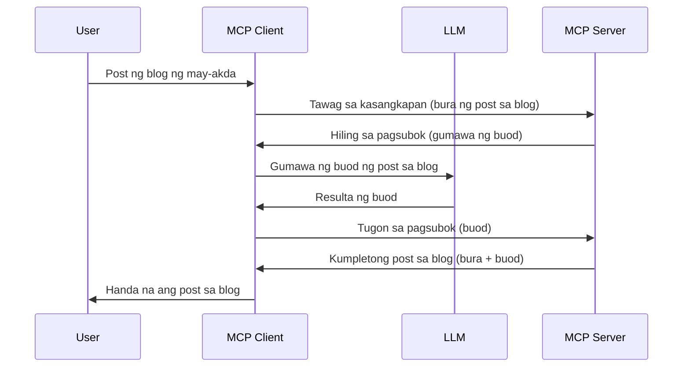

# Sampling - delegasyon ng mga tampok sa Kliyente

> **Abiso ng pag-deprecate:** Ang `2026-07-28` MCP specification release candidate ay nagmamarka ng Sampling bilang deprecated pabor sa direktang integrasyon sa LLM provider APIs. Patuloy na gagana ang Sampling sa `2025-11-25` at sa loob ng hindi bababa sa isang taon matapos ang anumang pormal na pag-deprecate, kaya't ang lahat sa araling ito ay nananatiling wasto — ngunit ang mga bagong disenyo ng server ay dapat suriin ang kapalit na pattern. Tingnan ang [Ano ang Nagbabago sa MCP: Ang 2026-07-28 Release Candidate](../../01-CoreConcepts/mcp-2026-07-28-release-candidate.md).

Minsan, kailangan ng MCP Client at MCP Server na magtulungan upang makamit ang isang pangkaraniwang layunin. Maaari kang magkaroon ng kaso kung saan kailangan ng Server ang tulong ng isang LLM na nasa kliyente. Para sa sitwasyong ito, sampling ang dapat mong gamitin.

Tuklasin natin ang ilang mga kaso ng paggamit at kung paano bumuo ng solusyon gamit ang sampling.

## Pangkalahatang-ideya

Sa araling ito, tututok tayo sa pagpapaliwanag kung kailan at saan gagamitin ang Sampling at kung paano ito i-configure.

## Mga Layunin ng Pag-aaral

Sa kabanatang ito, gagawin natin ang mga sumusunod:

- Ipaliwanag kung ano ang Sampling at kailan ito gagamitin.
- Ipakita kung paano i-configure ang Sampling sa MCP.
- Magbigay ng mga halimbawa ng Sampling sa aksyon.

## Ano ang Sampling at bakit ito gamitin?

Ang Sampling ay isang advanced na tampok na gumagana sa sumusunod na paraan:



### Kahilingan sa Sampling

Ok, ngayon ay mayroon tayong mataas na pananaw sa isang kapani-paniwalang senaryo, pag-usapan natin ang kahilingan sa sampling na ipinapadala ng server pabalik sa kliyente. Ganito ang hitsura ng isang kahilingang ito sa format ng JSON-RPC:

```json
{
  "jsonrpc": "2.0",
  "id": 1,
  "method": "sampling/createMessage",
  "params": {
    "messages": [
      {
        "role": "user",
        "content": {
          "type": "text",
          "text": "Create a blog post summary of the following blog post: <BLOG POST>"
        }
      }
    ],
    "modelPreferences": {
      "hints": [
        {
          "name": "claude-3-sonnet"
        }
      ],
      "intelligencePriority": 0.8,
      "speedPriority": 0.5
    },
    "systemPrompt": "You are a helpful assistant.",
    "maxTokens": 100
  }
}
```

May ilang bagay dito na dapat i-highlight:

- Prompt, sa ilalim ng content -> text, ang ating prompt na isang utos para sa LLM upang ibuod ang nilalaman ng blog post.

- **modelPreferences**. Ang seksyong ito ay isang preference lamang, isang rekomendasyon kung anong konfigurasyon ang gagamitin sa LLM. Puwedeng piliin ng user kung susundin ang mga rekomendasyong ito o babaguhin ang mga ito. Sa kasong ito, may mga rekomendasyon sa modelong gagamitin at prayoridad sa bilis at katalinuhan.
- **systemPrompt**, ito ang iyong normal na prompt ng system na nagbibigay sa iyong LLM ng personalidad at naglalaman ng mga tagubilin sa gabay.
- **maxTokens**, ito ay isa pang property na ginagamit upang sabihin kung ilang mga token ang inirerekomenda para sa gawaing ito.

### Tugon sa Sampling

Ang tugong ito ang ipinapadala ng MCP Client pabalik sa MCP Server at resulta ng pagtawag ng client sa LLM, paghihintay sa tugon, at pagkatapos ay pagbuo ng mensaheng ito. Ganito ang hitsura nito sa JSON-RPC:

```json
{
  "jsonrpc": "2.0",
  "id": 1,
  "result": {
    "role": "assistant",
    "content": {
      "type": "text",
      "text": "Here's your abstract <ABSTRACT>"
    },
    "model": "gpt-5",
    "stopReason": "endTurn"
  }
}
```

Pansinin kung paano ang tugon ay isang buod ng blog post tulad ng ating hiniling. Pansinin din na ang ginamit na `model` ay hindi ang hiniling natin kundi "gpt-5" sa halip na "claude-3-sonnet". Ito ay upang ipakita na maaaring magbago ang isip ng user kung ano ang gagamitin at na ang iyong sampling request ay isang rekomendasyon.

Ok, ngayon na nauunawaan natin ang pangunahing daloy, at kapaki-pakinabang na gawain para dito "paggawa ng blog post + buod", tingnan natin kung ano ang kailangan nating gawin upang ito ay gumana.

### Mga Uri ng Mensahe

Ang mga mensahe ng Sampling ay hindi lamang nalilimitahan sa teksto kundi maaari ka ring magpadala ng mga imahe at audio. Ganito ang pagkakaiba ng JSON-RPC:

**Teksto**

```json
{
  "type": "text",
  "text": "The message content"
}
```

**Nilalaman ng Imahe**

```json
{
  "type": "image",
  "data": "base64-encoded-image-data",
  "mimeType": "image/jpeg"
}
```

**Nilalaman ng Audio**

```json
{
  "type": "audio",
  "data": "base64-encoded-audio-data",
  "mimeType": "audio/wav"
}
```

> TANDAAN: para sa mas detalyadong impormasyon tungkol sa Sampling, tingnan ang [opisyal na dokumentasyon](https://modelcontextprotocol.io/specification/2025-11-25/client/sampling)

## Paano I-configure ang Sampling sa Kliyente

> Tandaan: kung nagtatayo ka lamang ng server, hindi mo kailangan ng gaanong gawin dito.

Sa isang kliyente, kailangan mong tukuyin ang sumusunod na tampok sa ganitong paraan:

```json
{
  "capabilities": {
    "sampling": {}
  }
}
```

Ito ay kukunin kapag nagsimula ang iyong napiling kliyente kasama ang server.

## Halimbawa ng Sampling sa Aksyon - Gumawa ng Blog Post

Gawin nating coding ang isang sampling server nang magkasama, kailangan nating gawin ang mga sumusunod:

1. Gumawa ng tool sa Server.
1. Ang tool na ito ay dapat gumawa ng kahilingan sa sampling
1. Ang tool ay dapat maghintay para sa tugon ng kliyente sa sampling request.
1. Pagkatapos ay ang resulta ng tool ay dapat mabuo.

Tingnan natin ang code ng hakbang-hakbang:

### -1- Gumawa ng tool

**python**

```python
@mcp.tool()
async def create_blog(title: str, content: str, ctx: Context[ServerSession, None]) -> str:
    """Create a blog post and generate a summary"""

```

### -2- Gumawa ng kahilingan sa sampling

Palawakin ang iyong tool gamit ang sumusunod na code:

**python**

```python
post = BlogPost(
        id=len(posts) + 1,
        title=title,
        content=content,
        abstract=""
    )

prompt = f"Create an abstract of the following blog post: title: {title} and draft: {content} "

result = await ctx.session.create_message(
        messages=[
            SamplingMessage(
                role="user",
                content=TextContent(type="text", text=prompt),
            )
        ],
        max_tokens=100,
)

```

### -3- Maghintay para sa tugon at ibalik ang tugon

**python**

```python
post.abstract = result.content.text

posts.append(post)

# ibalik ang kompletong produkto
return json.dumps({
    "id": post.title,
    "abstract": post.abstract
})
```

### -4- Buong code

**python**

```python
from starlette.applications import Starlette
from starlette.routing import Mount, Host

from mcp.server.fastmcp import Context, FastMCP

from mcp.server.session import ServerSession
from mcp.types import SamplingMessage, TextContent

import json


from uuid import uuid4
from typing import List
from pydantic import BaseModel


mcp = FastMCP("Blog post generator")

# app = FastAPI()

posts = []

class BlogPost(BaseModel):
    id: int
    title: str
    content: str
    abstract: str

posts: List[BlogPost] = []

@mcp.tool()
async def create_blog(title: str, content: str, ctx: Context[ServerSession, None]) -> str:
    """Create a blog post and generate a summary"""

    post = BlogPost(
        id=len(posts) + 1,
        title=title,
        content=content,
        abstract=""
    )

    prompt = f"Create an abstract of the following blog post: title: {title} and draft: {content} "

    result = await ctx.session.create_message(
        messages=[
            SamplingMessage(
                role="user",
                content=TextContent(type="text", text=prompt),
            )
        ],
        max_tokens=100,
    )

    post.abstract = result.content.text

    posts.append(post)

    # ibalik ang kumpletong post ng blog
    return json.dumps({
        "id": post.title,
        "abstract": post.abstract
    })

if __name__ == "__main__":
    print("Starting server...")
    # mcp.run()
    mcp.run(transport="streamable-http")

# patakbuhin ang app gamit ang: python server.py
```

### -5- Pag-test dito sa Visual Studio Code

Para subukan ito sa Visual Studio Code, gawin ang mga sumusunod:

1. Simulan ang server sa terminal
1. Idagdag ito sa *mcp.json* (at siguraduhing ito ay nagsimula) hal. ganito:

   ```json
   "servers": {
      "blog-server": {
        "type": "http",
        "url": "http://localhost:8000/mcp"
      }
   }
   ```

1. Mag-type ng prompt:

   ```text
   create a blog post named "Where Python comes from", the content is "Python is actually named after Monty Python Flying Circus"
   ```

1. Payagan ang sampling na mangyari. Sa unang pag-test mo nito, ipapakita sa iyo ang karagdagang dialog na kailangan mong tanggapin, pagkatapos ay makikita mo ang normal na dialog para sa paghingi na patakbuhin ang isang tool

1. Suriin ang mga resulta. Makikita mo ang mga resulta na maayos na ipinakita sa GitHub Copilot Chat ngunit maaari mo ring suriin ang raw JSON response.

**Bonus**. May mahusay na suporta ang Visual Studio Code tooling para sa sampling. Maaari mong i-configure ang Sampling access sa iyong naka-install na server sa pamamagitan ng pag-navigate dito sa ganitong paraan:

1. Pumunta sa seksyon ng extension.
1. Piliin ang icon ng cog para sa iyong naka-install na server sa seksyong "MCP SERVERS - INSTALLED".
1 Piliin ang "Configure Model Access", dito maaari mong piliin kung aling mga Model ang pinahihintulutan ng GitHub Copilot na gamitin kapag nagsasagawa ng sampling. Maaari mo ring makita ang lahat ng kahilingan sa sampling na nangyari kamakailan sa pamamagitan ng pagpili ng "Show Sampling requests".

## Takdang-Aralin

Sa takdang-aralin na ito, gagawa ka ng bahagyang ibang Sampling na tinatawag na sampling integration na sumusuporta sa paggawa ng paglalarawan ng produkto. Narito ang iyong senaryo:

**Senaryo**: Ang back office worker sa isang e-commerce ay nangangailangan ng tulong, masyadong matagal ang paggawa ng mga paglalarawan ng produkto. Kaya, gagawa ka ng solusyon kung saan maaari kang tumawag ng tool na "create_product" na may "title" at "keywords" bilang mga argumento at dapat itong lumikha ng kumpletong produkto kabilang ang isang patlang na "description" na dapat punan ng isang LLM ng kliyente.

TIP: gamitin ang natutunan mo noon upang buuin ang server na ito at ang tool nito gamit ang kahilingan sa sampling.

## Solusyon

[Solusyon](./solution/README.md)

## Pangunahing Mga Puntos

Ang Sampling ay isang makapangyarihang tampok na nagpapahintulot sa server na i-delegate ang mga gawain sa kliyente kapag kailangan nito ng tulong mula sa isang LLM.

## Ano ang Susunod

- [Kabanata 4 - Praktikal na pagpapatupad](../../04-PracticalImplementation/README.md)

---

<!-- CO-OP TRANSLATOR DISCLAIMER START -->
**Pagtatanggi**:
Ang dokumentong ito ay isinalin gamit ang serbisyo ng AI translation na [Co-op Translator](https://github.com/Azure/co-op-translator). Bagama't nagsusumikap kami para sa katumpakan, pakatandaan na ang awtomatikong pagsasalin ay maaaring maglaman ng mga pagkakamali o hindi pagkakatugma. Ang orihinal na dokumento sa orihinal nitong wika ang dapat ituring na pangunahing sanggunian. Para sa mahahalagang impormasyon, inirerekomenda ang propesyonal na pagsasalin ng tao. Hindi kami mananagot sa anumang maling pagkakaintindi o maling interpretasyon na nagmula sa paggamit ng pagsasaling ito.
<!-- CO-OP TRANSLATOR DISCLAIMER END -->