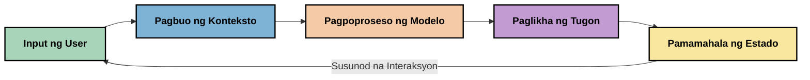
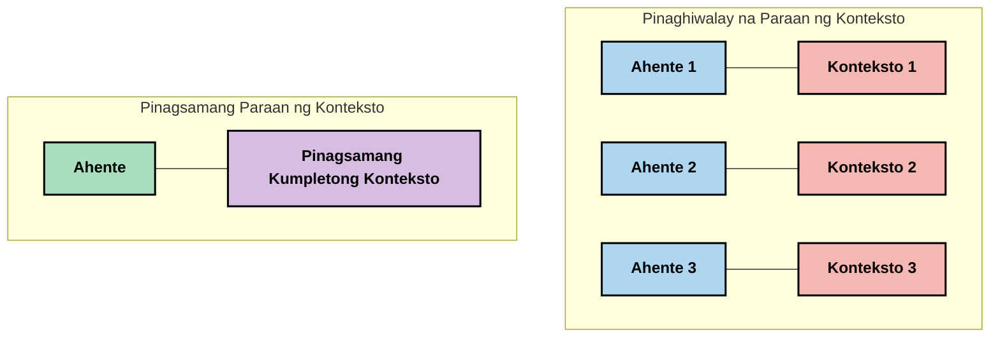
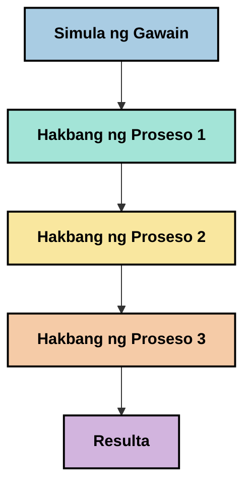
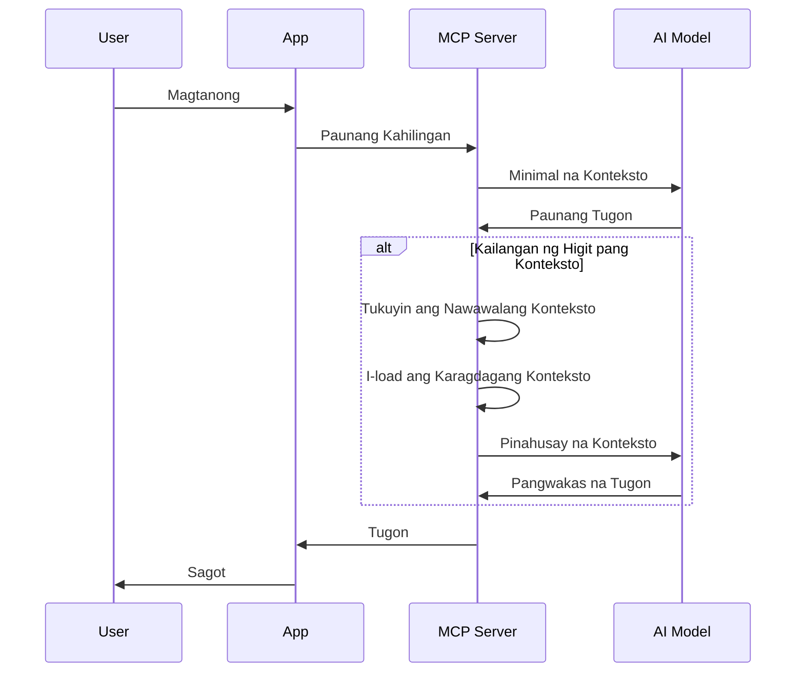
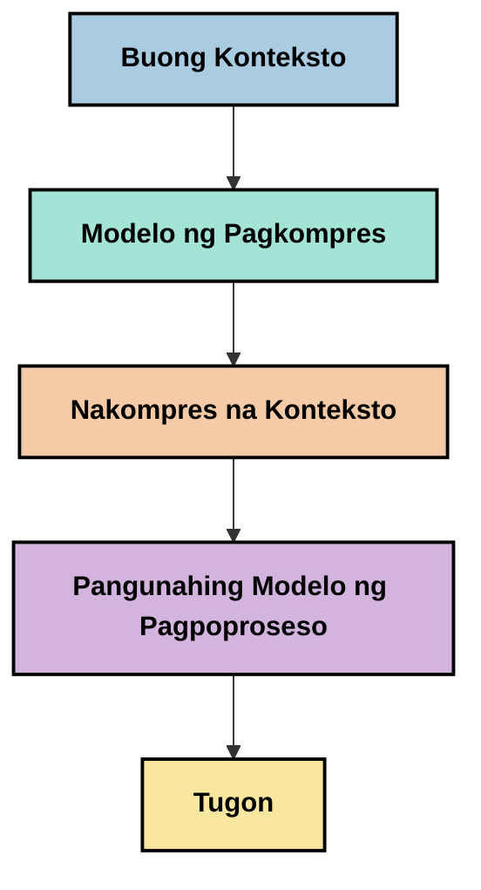
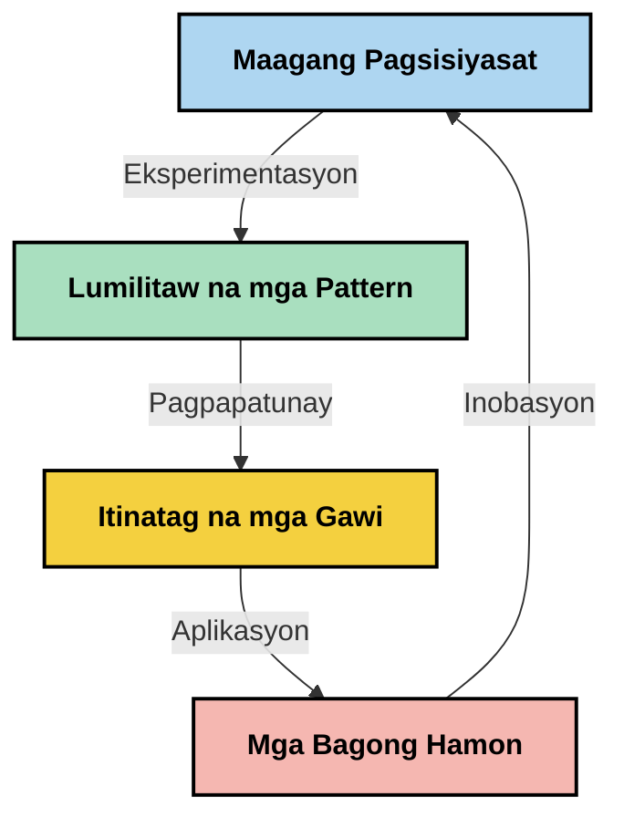

# Context Engineering: Isang Umuusbong na Konsepto sa MCP Ecosystem

## Pangkalahatang-ideya

Ang context engineering ay isang umuusbong na konsepto sa larangan ng AI na sumusuri kung paano iniayos, ipinapadala, at pinananatili ang impormasyon sa mga interaksyon sa pagitan ng mga kliyente at mga serbisyong AI. Habang umuunlad ang Model Context Protocol (MCP) ecosystem, nagiging mas mahalaga ang pag-unawa kung paano epektibong pamahalaan ang konteksto. Ipinapakilala ng module na ito ang konsepto ng context engineering at sinusuri ang mga potensyal nitong aplikasyon sa mga implementasyon ng MCP.

## Mga Layunin sa Pagkatuto

Sa pagtatapos ng module na ito, magagawa mong:

- Maunawaan ang umuusbong na konsepto ng context engineering at ang posibleng papel nito sa mga aplikasyon ng MCP
- Tukuyin ang mga pangunahing hamon sa pamamahala ng konteksto na tinutugunan ng disenyo ng MCP protocol
- Suriin ang mga teknik para mapabuti ang pagganap ng modelo sa pamamagitan ng mas mahusay na paghawak ng konteksto
- Isaalang-alang ang mga paraan upang sukatin at suriin ang bisa ng konteksto
- Ilapat ang mga umuusbong na konseptong ito upang pagandahin ang mga karanasan sa AI gamit ang MCP framework

## Panimula sa Context Engineering

Ang context engineering ay isang umuusbong na konsepto na nakatuon sa sinadyang disenyo at pamamahala ng daloy ng impormasyon sa pagitan ng mga gumagamit, aplikasyon, at mga modelo ng AI. Hindi tulad ng mga itinatag na larangan gaya ng prompt engineering, ang context engineering ay patuloy pang dine-develop ng mga praktisyoner habang nilulutas nila ang natatanging mga hamon sa pagbibigay sa mga AI model ng tamang impormasyon sa tamang oras.

Habang umuunlad ang mga malalaking language model (LLMs), nagiging malinaw ang kahalagahan ng konteksto. Ang kalidad, kaugnayan, at ayos ng konteksto na ibinibigay natin ay direktang nakakaapekto sa mga output ng modelo. Pinag-aaralan ng context engineering ang ugnayang ito at hinahangad na gumawa ng mga prinsipyo para sa epektibong pamamahala ng konteksto.

> "Noong 2025, napakatalino na ng mga modelo diyan. Pero kahit ang pinakamatalinong tao ay hindi magagampanan nang maayos ang kanilang trabaho kung wala ang konteksto ng kanilang hinihingi... Ang 'Context engineering' ang susunod na antas ng prompt engineering. Ito ay tungkol sa paggawa nito nang awtomatiko sa isang dinamikong sistema." — Walden Yan, Cognition AI

Maaaring saklawin ng context engineering ang:

1. **Pagpili ng Konteksto**: Pagtukoy kung anong impormasyon ang may kaugnayan para sa isang gawain
2. **Pag-aayos ng Konteksto**: Pag-organisa ng impormasyon upang mapalawak ang pagkaunawa ng modelo
3. **Paghahatid ng Konteksto**: Pag-optimize kung paano at kailan ipinapadala ang impormasyon sa mga modelo
4. **Pagpapanatili ng Konteksto**: Pamamahala sa estado at pag-usbong ng konteksto sa paglipas ng panahon
5. **Pagsusuri ng Konteksto**: Pagsusukat at pagpapabuti ng bisa ng konteksto

Ang mga larangang ito ay partikular na mahalaga sa MCP ecosystem, na nagbibigay ng isang sistematikong paraan para sa mga aplikasyon upang magbigay ng konteksto sa LLMs.


## Ang Pananaw ng Paglalakbay ng Konteksto

Isang paraan upang mailarawan ang context engineering ay sundan ang paglalakbay ng impormasyon sa isang sistema ng MCP:



### Pangunahing Yugto sa Paglalakbay ng Konteksto:

1. **Input ng Gumagamit**: Hilaw na impormasyon mula sa gumagamit (teksto, larawan, dokumento)
2. **Pagsasama-sama ng Konteksto**: Pagsasama ng input ng gumagamit kasama ang konteksto ng sistema, kasaysayan ng pag-uusap, at iba pang nakuha na impormasyon
3. **Pagproseso ng Modelo**: Pinoproseso ng AI model ang pinagsamang konteksto
4. **Pagbuo ng Tugon**: Gumagawa ang modelo ng output base sa ibinigay na konteksto
5. **Pamamahala ng Estado**: Ina-update ng sistema ang panloob nitong estado base sa interaksyon

Ipinapakita ng pananaw na ito ang dinamikong kalikasan ng konteksto sa mga AI system at naglalantad ng mahahalagang tanong tungkol sa pinakamahusay na paraan ng pamamahala ng impormasyon sa bawat yugto.

## Mga Umuusbong na Prinsipyo sa Context Engineering

Habang nabubuo ang larangan ng context engineering, may ilang mga unang prinsipyo na lumilitaw mula sa mga praktisyoner. Maaaring makatulong ang mga prinsipyong ito sa pagpili ng mga implementasyon sa MCP:

### Prinsipyo 1: Ibahagi ang Konteksto nang Buo

Dapat ibahagi ang konteksto nang ganap sa lahat ng bahagi ng sistema kaysa hati-hatiin ito sa maraming ahente o proseso. Kapag naipamahagi ang konteksto, ang mga desisyon na ginagawa sa isang bahagi ng sistema ay maaaring salungat sa mga desisyon sa ibang bahagi.



Sa mga aplikasyon ng MCP, hinihikayat nito ang pagdidisenyo ng mga sistema kung saan dumadaloy nang tuloy-tuloy ang konteksto sa buong pipeline kaysa ihiwalay ito.

### Prinsipyo 2: Kilalanin na ang mga Aksyon ay Nagdadala ng Implicit na mga Desisyon

Bawat kilos ng modelo ay naglalaman ng mga implicit na desisyon kung paano i-interpret ang konteksto. Kapag maraming bahagi ang kumikilos sa iba't ibang konteksto, maaari silang magka-konflik na nagdudulot ng hindi pagkakaparehong resulta.

Mahalaga ang implikasyong ito para sa mga aplikasyon ng MCP:
- Mas mainam ang linear na pagproseso ng mga komplikadong gawain kaysa parallel execution na may fragmented context
- Siguraduhing may access ang lahat ng punto ng desisyon sa parehong impormasyong kontekstwal
- Disenyuhan ang mga sistema kung saan ang mga huling hakbang ay makakakita ng buong konteksto ng mga naunang desisyon

### Prinsipyo 3: Timbangin ang Lalim ng Konteksto sa Limitasyon ng Window

Habang humahaba ang mga pag-uusap at proseso, napupuno ang context windows. Pinag-aaralan ng context engineering ang mga paraan para pamahalaan ang tensiyon sa pagitan ng komprehensibong konteksto at teknikal na limitasyon.

Ilan sa mga potensyal na diskarte na sinusubukan:
- Pag-compress ng konteksto na pinapanatili ang mahalagang impormasyon habang pinapababa ang paggamit ng token
- Unti-unting pag-load ng konteksto batay sa kaugnayan sa kasalukuyang pangangailangan
- Pagbubuod ng mga naunang interaksyon habang pinapanatili ang mahahalagang desisyon at datos

## Mga Hamon sa Konteksto at Disenyo ng MCP Protocol

Dinisenyo ang Model Context Protocol (MCP) na may kamalayan sa mga natatanging hamon sa pamamahala ng konteksto. Ang pag-unawa sa mga hamong ito ay tumutulong na ipaliwanag ang mga pangunahing aspeto ng disenyo ng MCP protocol:


### Hamon 1: Limitasyon ng Context Window
Karamihan sa mga AI model ay may nakapirming laki ng context window, na nililimitahan kung gaano karaming impormasyon ang kanilang maproseso nang sabay-sabay.

**Sagot ng MCP sa Disenyo:** 
- Sinusuportahan ng protocol ang nakaayos, resource-based na konteksto na maaaring epektibong i-refer
- Maaaring hatiin ang mga resources sa mga pahina at unti-unting i-load

### Hamon 2: Pagtukoy ng Kaugnayan
Mahirap tukuyin kung alin sa mga impormasyon ang pinaka-kaugnay para maisama sa konteksto.

**Sagot ng MCP sa Disenyo:**
- May malawak na kagamitan para sa dynamic na pagkuha ng impormasyon batay sa pangangailangan
- Nagtataguyod ng istandard na prompts upang maging pare-pareho ang ayos ng konteksto

### Hamon 3: Pagpapanatili ng Konteksto
Ang pamamahala ng estado sa mga interaksyon ay nangangailangan ng maingat na pagsubaybay sa konteksto.

**Sagot ng MCP sa Disenyo:**
- Istandardisadong pamamahala ng session
- Malinaw na itinakdang mga pattern ng interaksyon para sa pag-unlad ng konteksto

### Hamon 4: Multi-Modal na Konteksto
Iba't ibang uri ng datos (teksto, mga larawan, nakaayos na datos) ay nangangailangan ng iba't ibang paghawak.

**Sagot ng MCP sa Disenyo:**
- Dinisenyo ang protocol upang tumanggap ng iba't ibang uri ng nilalaman
- Istandardisadong representasyon ng multi-modal na impormasyon

### Hamon 5: Seguridad at Pribasiya
Madalas na naglalaman ang konteksto ng sensitibong impormasyon na kailangang protektahan.

**Sagot ng MCP sa Disenyo:**
- Malinaw na hangganan sa pagitan ng mga responsibilidad ng kliyente at server
- Mga opsyon sa lokal na pagproseso upang mabawasan ang exposure ng datos

Ang pag-unawa sa mga hamong ito at kung paano tinutugunan ng MCP ang mga ito ay nagbibigay ng pundasyon para tuklasin ang mas advanced na teknika sa context engineering.

## Mga Umuusbong na Paraan sa Context Engineering

Habang umuunlad ang larangan ng context engineering, may ilang promising na mga paraang lumilitaw. Ito ay kumakatawan sa kasalukuyang pag-iisip at hindi pa mga itinatag na pinakamahuhusay na pamamaraan, at malamang na magbabago habang nadaragdagan ang karanasan sa mga implementasyon ng MCP.

### 1. Single-Threaded Linear Processing

Sa kabaligtaran ng mga multi-agent na arkitektura na naghahati ng konteksto, natutuklasan ng ilang mga praktisyoner na mas consistent ang resulta ng single-threaded linear processing. Ito ay kaayon ng prinsipyo ng pagpapanatili ng pinag-isang konteksto.



Bagamat ang paraang ito ay maaaring mukhang hindi kasing episyente ng parallel processing, madalas itong nagreresulta ng mas maayos at maasahang outputs dahil bawat hakbang ay nakabase sa kompletong pag-unawa sa mga naunang desisyon.

### 2. Pagpiraso at Prayoritisasyon ng Konteksto

Paghahati-hati ng malalaking konteksto sa mga kayang pamahalaang bahagi at pagbibigay prayoridad sa pinakamahalaga.

```python
# Konseptwal na Halimbawa: Pagpira-piraso ng Konteksto at Prayoritisasyon
def process_with_chunked_context(documents, query):
    # 1. Hatiin ang mga dokumento sa mas maliliit na bahagi
    chunks = chunk_documents(documents)
    
    # 2. Kalkulahin ang mga iskor ng kaugnayan para sa bawat bahagi
    scored_chunks = [(chunk, calculate_relevance(chunk, query)) for chunk in chunks]
    
    # 3. Ayusin ang mga bahagi ayon sa iskor ng kaugnayan
    sorted_chunks = sorted(scored_chunks, key=lambda x: x[1], reverse=True)
    
    # 4. Gamitin ang pinaka-kaugnay na mga bahagi bilang konteksto
    context = create_context_from_chunks([chunk for chunk, score in sorted_chunks[:5]])
    
    # 5. Proseso gamit ang prayoritisadong konteksto
    return generate_response(context, query)
```

Ipinapakita ng konseptong nasa itaas kung paano natin hahatiin ang malalaking dokumento sa mga bahagi at pipiliin lamang ang pinakakaugnay para sa konteksto. Makakatulong ito lalo na sa mga limitasyon ng context window habang pinapakinabangan pa rin ang mga malalaking knowledge base.

### 3. Unti-unting Pag-load ng Konteksto

Unti-unting pag-load ng konteksto ayon sa pangangailangan kaysa sabay-sabay na pag-load.



Magsisimula ang progressive context loading sa pinakamaliit na konteksto at palalawakin lamang kung kinakailangan. Malaki ang maitutulong nito sa pagbawas ng token usage para sa simpleng query habang nananatiling kaya ang pagproseso ng komplikadong tanong.

### 4. Pag-compress at Pagbubuod ng Konteksto

Pagbawas ng laki ng konteksto habang pinapanatili ang mahahalagang impormasyon.



Nakatuon ang context compression sa:
- Pag-aalis ng sobrang impormasyon
- Pagbubuod ng mahahabang nilalaman
- Pagkuha ng mahahalagang katotohanan at detalye
- Pagpapanatili ng kritikal na elemento ng konteksto
- Pag-optimize para sa kahusayan ng token

Mahalaga ito lalo na sa pagpapanatili ng mahahabang pag-uusap sa loob ng context windows o para sa episyenteng pagproseso ng malalaking dokumento. May ilang praktisyoner na gumagamit ng espesyal na mga modelo para sa pag-compress at pagbubuod ng kasaysayan ng pag-uusap.


## Mga Pagsasaalang-alang sa Pagsasaliksik ng Context Engineering

Habang tinutuklasan ang umuusbong na larangan ng context engineering, may ilang mga bagay na dapat tandaan kapag nagtatrabaho sa mga implementasyon ng MCP. Hindi ito mga mahigpit na best practice kundi mga larangang pwedeng tuklasin upang mapabuti ang iyong espesipikong paggamit.

### Isaalang-alang ang Iyong Mga Layunin sa Konteksto

Bago magpatupad ng mga komplikadong solusyon sa pamamahala ng konteksto, malinaw na ipahayag kung ano ang nais mong makamit:
- Anong espesipikong impormasyon ang kailangan ng modelo upang magtagumpay?
- Alin sa mga impormasyon ang mahalaga kumpara sa mga pangsuporta lang?
- Ano ang iyong mga limitasyon sa pagganap (latency, limitasyon ng token, gastusin)?

### Eksplorahin ang Mga Layered na Paraan ng Konteksto

Nakakakita ng tagumpay ang ilang praktisyoner sa konteksto na inayos sa mga konseptual na layer:
- **Core Layer**: Mahahalagang impormasyon na laging kailangan ng modelo
- **Situational Layer**: Konteksto na espesipiko sa kasalukuyang interaksyon
- **Supporting Layer**: Karagdagang impormasyon na maaaring makatulong
- **Fallback Layer**: Impormasyon na ina-access lamang kapag kinakailangan

### Siyasatin ang Mga Estratehiya sa Pagkuha

Ang bisa ng iyong konteksto ay madalas nakadepende sa kung paano mo kinukuha ang impormasyon:
- Semantic search at embeddings para mahanap ang konseptwal na kaugnayan
- Keyword-based search para sa mga espesipikong detalye ng katotohanan
- Hybrid na pamamaraan na pinagsasama ang iba't ibang paraan ng pagkuha
- Metadata filtering para paliitin ang saklaw base sa mga kategorya, petsa, o pinanggalingan

### Mag-eksperimento sa Koherensiya ng Konteksto

Maaaring makaapekto ang istraktura at daloy ng iyong konteksto sa pagkaunawa ng modelo:
- Pagsama-sama ng mga magkaugnay na impormasyon
- Paggamit ng pare-parehong format at organisasyon
- Pagpapanatili ng lohikal o kronolohikal na ayos kung nararapat
- Pag-iwas sa salungat na impormasyon

### Timbangin ang mga Pagpapasya sa Multi-Agent na Arkitektura

Bagamat popular ang multi-agent na mga arkitektura sa maraming AI framework, may mga malaking hamon ito sa pamamahala ng konteksto:
- Ang fragmentasyon ng konteksto ay maaaring magdulot ng hindi magkakatugmang desisyon sa mga ahente
- Maaaring magdulot ang parallel processing ng mga salungatan na mahirap lutasin
- Ang komunikasyon sa pagitan ng mga ahente ay maaaring magbawas ng benepisyo sa pagganap
- Kinakailangan ang masalimuot na pamamahala ng estado para mapanatili ang koherensiya

Sa maraming kaso, maaaring mas maaasahan ang isang single-agent na diskarte na may komprehensibong pamamahala ng konteksto kaysa sa maramihang espesyalistang ahente na may hati-hating konteksto.

### Bumuo ng Mga Pamamaraan sa Pagsusuri

Upang mapabuti ang context engineering sa paglipas ng panahon, isaalang-alang kung paano mo susukatin ang tagumpay:
- Pagsusuri sa A/B ng iba't ibang istraktura ng konteksto
- Pagsubaybay sa paggamit ng token at oras ng pagtugon
- Pagtatala ng kasiyahan ng gumagamit at mga rate ng pagsasakatuparan ng gawain
- Pagsusuri kung kailan at bakit pumapalya ang mga estratehiya sa konteksto

Ang mga pagsasaalang-alang na ito ay mga aktibong larangan ng pagsasaliksik sa context engineering. Habang humahasa ang larangan, malamang na lilitaw ang mas tiyak na mga pattern at pamamaraan.

## Pagsusukat ng Bisa ng Konteksto: Isang Paunlarin na Framework

Habang umuusbong ang context engineering bilang isang konsepto, nagsisimula nang tuklasin ng mga praktisyoner kung paano natin maaaring sukatin ang bisa nito. Wala pang establisadong framework, ngunit pinag-iisipan ang iba't ibang metrika na makatutulong sa paggabay sa mga susunod na gawain.

### Mga Potensyal na Sukatan


#### 1. Mga Pagsasaalang-alang sa Input Efficiency

- **Ratio ng Konteksto sa Tugon**: Gaano karaming konteksto ang kailangan kumpara sa laki ng tugon?
- **Paggamit ng Token**: Anong porsyento ng mga token ng konteksto ang tila nakaapekto sa tugon?
- **Pagbawas ng Konteksto**: Gaano kaepektibo natin mapapaliit ang hilaw na impormasyon?

#### 2. Mga Pagsasaalang-alang sa Pagganap

- **Epekto sa Latency**: Paano naaapektuhan ng pamamahala ng konteksto ang oras ng pagtugon?
- **Ekonomiya ng Token**: Optimizado ba ang paggamit ng token?
- **Kaangkupan ng Pagkuha**: Gaano kaugnay ang nakuhang impormasyon?
- **Paggamit ng Resources**: Anong mga computational na resources ang kailangan?

#### 3. Mga Pagsasaalang-alang sa Kalidad

- **Kaugnayan ng Tugon**: Gaano kabisa ang tugon sa pagtugon sa tanong?
- **Katumpakan ng Katotohanan**: Pinapabuti ba ng pamamahala ng konteksto ang katumpakan ng impormasyon?
- **Pagkakatugma**: Pare-pareho ba ang mga tugon sa katulad na mga tanong?
- **Rate ng Hallucination**: Pinabababa ba ng mas mahusay na konteksto ang hallucinations ng modelo?

#### 4. Mga Pagsasaalang-alang sa Karanasan ng Gumagamit

- **Rate ng Follow-up**: Gaano kadalas kailangang magtanong pa ng mga gumagamit ng paglilinaw?
- **Pagtatapos ng Gawain**: Nakatatapos ba ng matagumpay ang mga gumagamit ng kanilang mga layunin?
- **Mga Indikador ng Kasiyahan**: Paano nirate ng mga gumagamit ang kanilang karanasan?

### Mga Eksploratoryong Paraan sa Pagsusukat

Kapag nag-eeksperimento sa context engineering sa mga implementasyon ng MCP, isaalang-alang ang mga sumusunod na eksploratoryong pamamaraan:

1. **Baseline Comparisons**: Magtayo muna ng baseline gamit ang mga simpleng paraan ng konteksto bago subukan ang mas sopistikadong mga pamamaraan

2. **Paunti-unting Pagbabago**: Baguhin ang isang aspeto ng pamamahala ng konteksto sa bawat pagkakataon upang mapaghiwalay ang epekto nito

3. **Pagsusuri Sentro sa Gumagamit**: Pagsamahin ang mga kwantitatibong metrika sa kwalitatibong feedback ng gumagamit

4. **Pagsusuri ng Pagkabigo**: Suriin ang mga pagkakataong pumalpak ang mga estratehiya sa konteksto upang maunawaan ang posibleng mga pagpapabuti

5. **Multi-Dimensional na Pagsusuri**: Isaalang-alang ang mga pagpapalitan sa pagitan ng episyensya, kalidad, at karanasan ng gumagamit

Ang eksperimental at maraming aspeto na paraang ito sa pagsusukat ay kaakibat ng umuusbong na katangian ng context engineering.

## Mga Pangwakas na Kaisipan

Ang context engineering ay isang umuusbong na larangan na maaaring maging sentro sa epektibong mga aplikasyon ng MCP. Sa maingat na pagtingin kung paano dumadaloy ang impormasyon sa iyong sistema, maaari kang makapaglikha ng mga karanasan sa AI na mas episyente, tumpak, at mahalaga sa mga gumagamit.

Ang mga teknik at paraan na inilahad sa module na ito ay mga unang ideya pa lamang sa larangang ito, hindi mga itinatag na pamamaraan. Maaaring maging mas malinaw na disiplina ang context engineering habang umuunlad ang mga kakayahan ng AI at lumalalim ang ating pag-unawa. Sa ngayon, ang eksperimento kasabay ng masusing pagsusukat ang tila pinakamabisang paraan.

## Mga Posibleng Direksyon sa Hinaharap

Ang larangan ng context engineering ay nasa mga unang hakbang pa lamang, ngunit may ilang promising na direksyon na lumilitaw:

- Malaki ang posibleng epekto ng mga prinsipyo ng context engineering sa pagganap ng modelo, episyensya, karanasan ng gumagamit, at pagiging maaasahan
- Maaaring malampasan ng single-threaded na mga diskarte na may komprehensibong pamamahala ng konteksto ang mga multi-agent na arkitektura para sa maraming paggamit
- Maaaring maging karaniwang bahagi sa mga pipeline ng AI ang mga espesyal na modelo para sa pag-compress ng konteksto
- Ang tensiyon sa pagitan ng pagkakumpleto ng konteksto at limitasyon ng mga token ay maaaring magdala ng inobasyon sa paghawak ng konteksto
- Habang nagiging mas mahusay ang mga modelo sa episyenteng komunikasyong parang tao, maaaring maging mas praktikal ang tunay na multi-agent na kolaborasyon
- Maaaring umunlad ang mga implementasyon ng MCP upang standardisahin ang mga pattern ng pamamahala ng konteksto na lumilitaw mula sa kasalukuyang mga eksperimento



## Mga Mapagkukunan

### Opisyal na Mga Mapagkukunan ng MCP
- [Model Context Protocol Website](https://modelcontextprotocol.io/)
- [Model Context Protocol Specification](https://github.com/modelcontextprotocol/modelcontextprotocol)

- [MCP Dokumentasyon](https://modelcontextprotocol.io/docs)
- [MCP C# SDK](https://github.com/modelcontextprotocol/csharp-sdk)
- [MCP Python SDK](https://github.com/modelcontextprotocol/python-sdk)
- [MCP TypeScript SDK](https://github.com/modelcontextprotocol/typescript-sdk)
- [MCP Inspector](https://github.com/modelcontextprotocol/inspector) - Visual na tool para sa pagsubok ng MCP server

### Mga Artikulo sa Context Engineering
- [Huwag Gumawa ng Multi-Agents: Mga Prinsipyo ng Context Engineering](https://cognition.ai/blog/dont-build-multi-agents) - Mga pananaw ni Walden Yan sa mga prinsipyo ng context engineering
- [Isang Praktikal na Gabay sa Paggawa ng Mga Ahente](https://cdn.openai.com/business-guides-and-resources/a-practical-guide-to-building-agents.pdf) - Gabay ng OpenAI sa epektibong disenyo ng ahente
- [Paggawa ng Epektibong Mga Ahente](https://www.anthropic.com/engineering/building-effective-agents) - Paraan ng Anthropic sa pagbuo ng ahente

### Kaugnay na Pananaliksik
- [Dynamic Retrieval Augmentation para sa Malaking Modelo ng Wika](https://arxiv.org/abs/2310.01487) - Pananaliksik tungkol sa mga dynamic retrieval na pamamaraan
- [Nawawala sa Gitna: Paano Ginagamit ng mga Modelo ng Wika ang Mahahabang Konteksto](https://arxiv.org/abs/2307.03172) - Mahalagang pananaliksik sa mga pattern ng pagproseso ng konteksto
- [Hierarchical Text-Conditioned Image Generation gamit ang CLIP Latents](https://arxiv.org/abs/2204.06125) - Papel ng DALL-E 2 na may pananaw sa pagbuo ng konteksto
- [Pagsusuri sa Papel ng Konteksto sa Mga Arkitektura ng Malalaking Modelo ng Wika](https://aclanthology.org/2023.findings-emnlp.124/) - Kamakailang pananaliksik tungkol sa paghawak ng konteksto
- [Multi-Agent Collaboration: Isang Sarbey](https://arxiv.org/abs/2304.03442) - Pananaliksik sa mga sistema ng multi-agent at ang kanilang mga hamon

### Karagdagang Mga Resorses
- [Mga Teknik sa Pag-optimize ng Context Window](https://learn.microsoft.com/en-us/azure/ai-services/openai/concepts/context-window)
- [Mga Advanced na Teknik ng RAG](https://www.microsoft.com/en-us/research/blog/retrieval-augmented-generation-rag-and-frontier-models/)
- [Documentation ng Semantic Kernel](https://github.com/microsoft/semantic-kernel)
- [AI Toolkit para sa Pamamahala ng Konteksto](https://github.com/microsoft/aitoolkit)

## Ano ang susunod

- [5.15 MCP Custom Transport](../mcp-transport/README.md)

---

<!-- CO-OP TRANSLATOR DISCLAIMER START -->
**Pagtatanggi**:
Ang dokumentong ito ay isinalin gamit ang serbisyo ng AI translation na [Co-op Translator](https://github.com/Azure/co-op-translator). Bagama't nagsusumikap kami para sa katumpakan, pakatandaan na ang awtomatikong pagsasalin ay maaaring maglaman ng mga pagkakamali o hindi pagkakatugma. Ang orihinal na dokumento sa orihinal nitong wika ang dapat ituring na pangunahing sanggunian. Para sa mahahalagang impormasyon, inirerekomenda ang propesyonal na pagsasalin ng tao. Hindi kami mananagot sa anumang maling pagkakaintindi o maling interpretasyon na nagmula sa paggamit ng pagsasaling ito.
<!-- CO-OP TRANSLATOR DISCLAIMER END -->