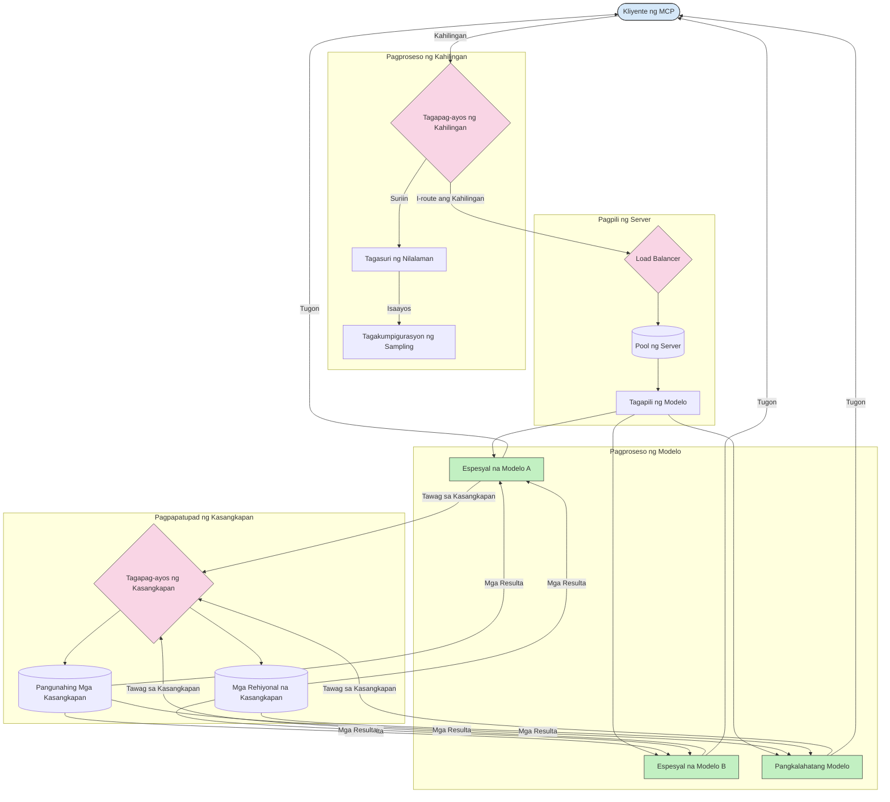

# Routing sa Model Context Protocol

Mahalaga ang routing para ituro ang mga kahilingan sa angkop na mga modelo, tool, o serbisyo sa loob ng isang MCP ecosystem.

## Panimula

Ang routing sa Model Context Protocol (MCP) ay kinapapalooban ng pagtuturo ng mga kahilingan sa pinakasangkop na mga modelo o serbisyo batay sa iba't ibang mga pamantayan tulad ng uri ng nilalaman, konteksto ng gumagamit, at load ng sistema. Tinitiyak nito ang epektibong pagpoproseso at pinakamainam na paggamit ng mga mapagkukunan.

## Mga Layunin sa Pagkatuto

Sa pagtatapos ng araling ito, magagawa mong:

- Maunawaan ang mga prinsipyo ng routing sa MCP.
- Magpatupad ng content-based routing upang ituro ang mga kahilingan sa mga espesyal na serbisyo.
- Mag-apply ng mga matatalinong estratehiya sa load balancing upang mapahusay ang paggamit ng mga mapagkukunan.
- Magpatupad ng dynamic na tool routing batay sa konteksto ng kahilingan.

## Content-Based Routing

Ang content-based routing ay nagtuturo ng mga kahilingan sa mga espesyalisadong serbisyo batay sa nilalaman ng kahilingan. Halimbawa, ang mga kahilingang may kinalaman sa pagbuo ng code ay maaaring ituro sa isang espesyal na modelo ng code, habang ang mga kahilingang tungkol sa malikhaing pagsulat ay maaaring ipadala sa isang malikhaing modelo ng pagsulat.

Tingnan natin ang isang halimbawa ng implementasyon sa iba't ibang programming languages.

<details>
<summary>.NET</summary>

```csharp
// .NET Example: Content-based routing in MCP
public class ContentBasedRouter
{
    private readonly Dictionary<string, McpClient> _specializedClients;
    private readonly RoutingClassifier _classifier;
    
    public ContentBasedRouter()
    {
        // Initialize specialized clients for different domains
        _specializedClients = new Dictionary<string, McpClient>
        {
            ["code"] = new McpClient("https://code-specialized-mcp.com"),
            ["creative"] = new McpClient("https://creative-specialized-mcp.com"),
            ["scientific"] = new McpClient("https://scientific-specialized-mcp.com"),
            ["general"] = new McpClient("https://general-mcp.com")
        };
        
        // Initialize content classifier
        _classifier = new RoutingClassifier();
    }
    
    public async Task<McpResponse> RouteAndProcessAsync(string prompt, IDictionary<string, object> parameters = null)
    {
        // Classify the prompt to determine the best specialized service
        string category = await _classifier.ClassifyPromptAsync(prompt);
        
        // Get the appropriate client or fall back to general
        var client = _specializedClients.ContainsKey(category) 
            ? _specializedClients[category] 
            : _specializedClients["general"];
            
        Console.WriteLine($"Routing request to {category} specialized service");
        
        // Send request to the selected service
        return await client.SendPromptAsync(prompt, parameters);
    }
    
    // Simple classifier for routing decisions
    private class RoutingClassifier
    {
        public Task<string> ClassifyPromptAsync(string prompt)
        {
            prompt = prompt.ToLowerInvariant();
            
            if (prompt.Contains("code") || prompt.Contains("function") || 
                prompt.Contains("program") || prompt.Contains("algorithm"))
            {
                return Task.FromResult("code");
            }
            
            if (prompt.Contains("story") || prompt.Contains("creative") || 
                prompt.Contains("imagine") || prompt.Contains("design"))
            {
                return Task.FromResult("creative");
            }
            
            if (prompt.Contains("science") || prompt.Contains("research") || 
                prompt.Contains("analyze") || prompt.Contains("study"))
            {
                return Task.FromResult("scientific");
            }
            
            return Task.FromResult("general");
        }
    }
}
```

Sa code na ito, kami ay:

- Nilikha ang `ContentBasedRouter` na klase na nagtuturo ng mga kahilingan batay sa nilalaman ng prompt.
- Nag-initialize ng mga espesyalisadong kliyente para sa iba't ibang domain (code, creative, scientific, general).
- Nagpatupad ng simpleng classifier na tumutukoy sa kategorya ng prompt at nagtuturo nito sa angkop na espesyalisadong serbisyo.
- Gumamit ng fallback na mekanismo upang ituro ang mga kahilingan sa isang pangkalahatang serbisyo kung walang espesyalisadong serbisyo na magagamit.
- Nagpatupad ng asynchronous processing upang epektibong pangasiwaan ang mga kahilingan.
- Gumamit ng diksyunaryo upang ipares ang mga kategorya ng nilalaman sa mga espesyal na MCP clients.
- Nagpatupad ng simpleng classifier na nag-aanalisa ng prompt at nagbabalik ng angkop na kategorya.
- Ginamit ang espesyalisadong client upang ipadala ang kahilingan at tumanggap ng tugon.
- Pinangasiwaan ang mga kaso kung saan ang prompt ay hindi tumutugma sa anumang espesyalisadong kategorya sa pamamagitan ng pag-route sa isang pangkalahatang serbisyo.

</details>

## Matatalinong Load Balancing

Ang load balancing ay nag-o-optimize ng paggamit ng mga mapagkukunan at tinitiyak ang mataas na availability para sa mga serbisyo ng MCP. Mayroong iba't ibang paraan upang ipatupad ang load balancing, tulad ng round-robin, weighted response time, o content-aware na mga estratehiya.

Tingnan natin ang sumusunod na halimbawa ng implementasyon na gumagamit ng mga estratehiyang ito:

- **Round Robin**: Pantay na naghahati ng mga kahilingan sa mga available na server.
- **Weighted Response Time**: Nagtuturo ng mga kahilingan sa mga server base sa kanilang average na oras ng tugon.
- **Content-Aware**: Nagtuturo ng mga kahilingan sa mga espesyal na server batay sa nilalaman ng kahilingan.

<details>
<summary>Java</summary>

```java
// Halimbawa sa Java: Matalinong pag-balanse ng load para sa mga MCP server
public class McpLoadBalancer {
    private final List<McpServerNode> serverNodes;
    private final LoadBalancingStrategy strategy;
    
    public McpLoadBalancer(List<McpServerNode> nodes, LoadBalancingStrategy strategy) {
        this.serverNodes = new ArrayList<>(nodes);
        this.strategy = strategy;
    }
    
    public McpResponse processRequest(McpRequest request) {
        // Piliin ang pinakamahusay na server base sa estratehiya
        McpServerNode selectedNode = strategy.selectNode(serverNodes, request);
        
        try {
            // I-route ang request sa napiling node
            return selectedNode.processRequest(request);
        } catch (Exception e) {
            // Harapin ang pagkabigo - ipatupad ang retry o fallback na lohika
            System.err.println("Error processing request on node " + selectedNode.getId() + ": " + e.getMessage());
            
            // Itala ang node bilang posibleng hindi malusog
            selectedNode.recordFailure();
            
            // Subukan ang susunod na pinakamahusay na node bilang fallback
            List<McpServerNode> remainingNodes = new ArrayList<>(serverNodes);
            remainingNodes.remove(selectedNode);
            
            if (!remainingNodes.isEmpty()) {
                McpServerNode fallbackNode = strategy.selectNode(remainingNodes, request);
                return fallbackNode.processRequest(request);
            } else {
                throw new RuntimeException("All MCP server nodes failed to process the request");
            }
        }
    }
    
    // Gawain para sa pag-check ng kalusugan ng node
    public void startHealthChecks(Duration interval) {
        ScheduledExecutorService scheduler = Executors.newScheduledThreadPool(1);
        scheduler.scheduleAtFixedRate(() -> {
            for (McpServerNode node : serverNodes) {
                try {
                    boolean isHealthy = node.checkHealth();
                    System.out.println("Node " + node.getId() + " health status: " + 
                                      (isHealthy ? "HEALTHY" : "UNHEALTHY"));
                } catch (Exception e) {
                    System.err.println("Health check failed for node " + node.getId());
                    node.setHealthy(false);
                }
            }
        }, 0, interval.toMillis(), TimeUnit.MILLISECONDS);
    }
    
    // Interface para sa mga estratehiya ng pag-balanse ng load
    public interface LoadBalancingStrategy {
        McpServerNode selectNode(List<McpServerNode> nodes, McpRequest request);
    }
    
    // Estratehiya ng round-robin
    public static class RoundRobinStrategy implements LoadBalancingStrategy {
        private AtomicInteger counter = new AtomicInteger(0);
        
        @Override
        public McpServerNode selectNode(List<McpServerNode> nodes, McpRequest request) {
            List<McpServerNode> healthyNodes = nodes.stream()
                .filter(McpServerNode::isHealthy)
                .collect(Collectors.toList());
            
            if (healthyNodes.isEmpty()) {
                throw new RuntimeException("No healthy nodes available");
            }
            
            int index = counter.getAndIncrement() % healthyNodes.size();
            return healthyNodes.get(index);
        }
    }
    
    // Estratehiya ng weighted response time
    public static class ResponseTimeStrategy implements LoadBalancingStrategy {
        @Override
        public McpServerNode selectNode(List<McpServerNode> nodes, McpRequest request) {
            return nodes.stream()
                .filter(McpServerNode::isHealthy)
                .min(Comparator.comparing(McpServerNode::getAverageResponseTime))
                .orElseThrow(() -> new RuntimeException("No healthy nodes available"));
        }
    }
    
    // Estratehiya na may kaalaman sa nilalaman
    public static class ContentAwareStrategy implements LoadBalancingStrategy {
        @Override
        public McpServerNode selectNode(List<McpServerNode> nodes, McpRequest request) {
            // Tukuyin ang mga katangian ng request
            boolean isCodeRequest = request.getPrompt().contains("code") || 
                                   request.getAllowedTools().contains("codeInterpreter");
            
            boolean isCreativeRequest = request.getPrompt().contains("creative") || 
                                       request.getPrompt().contains("story");
            
            // Hanapin ang mga espesyal na node
            Optional<McpServerNode> specializedNode = nodes.stream()
                .filter(McpServerNode::isHealthy)
                .filter(node -> {
                    if (isCodeRequest && node.getSpecialization().equals("code")) {
                        return true;
                    }
                    if (isCreativeRequest && node.getSpecialization().equals("creative")) {
                        return true;
                    }
                    return false;
                })
                .findFirst();
            
            // Ibalik ang espesyal na node o ang pinaka-kakaunting load na node
            return specializedNode.orElse(
                nodes.stream()
                    .filter(McpServerNode::isHealthy)
                    .min(Comparator.comparing(McpServerNode::getCurrentLoad))
                    .orElseThrow(() -> new RuntimeException("No healthy nodes available"))
            );
        }
    }
}
```

Sa code na ito, kami ay:

- Nilikha ang `McpLoadBalancer` na klase na namamahala sa listahan ng mga MCP server node at nagtuturo ng mga kahilingan batay sa napiling estratehiya ng load balancing.
- Nagpatupad ng iba't ibang mga estratehiya sa load balancing: `RoundRobinStrategy`, `ResponseTimeStrategy`, at `ContentAwareStrategy`.
- Gumamit ng `ScheduledExecutorService` upang pana-panahong suriin ang kalusugan ng mga server node.
- Nagpatupad ng mekanismo ng health check na nagtatalaga ng nodes bilang malusog o hindi malusog base sa kanilang tugon sa health checks.
- Pinangasiwaan ang pagproseso ng kahilingan na may error handling at fallback na lohika upang matiyak ang mataas na availability.
- Ginamit ang `McpServerNode` na klase upang kumatawan sa bawat MCP server node, kabilang ang kanilang health status, average response time, at kasalukuyang load.
- Nagpatupad ng `McpRequest` na klase upang ipaloob ang mga detalye ng kahilingan tulad ng prompt at mga pinapayagang tool.
- Ginamit ang Java Streams upang i-filter at piliin ang mga node batay sa health status at espesyalisasyon.

</details>

## Dynamic Tool Routing

Tinitiyak ng tool routing na ang mga tawag sa tool ay itinuturo sa pinaka-angkop na serbisyo batay sa konteksto. Halimbawa, ang tawag sa weather tool ay maaaring kailanganing ituro sa regional endpoint batay sa lokasyon ng gumagamit, o ang calculator tool ay maaaring kailanganing gumamit ng partikular na bersyon ng API.

Tingnan natin ang isang halimbawa ng implementasyon na nagpapakita ng dynamic tool routing batay sa pagsusuri ng kahilingan, mga regional endpoint, at suporta sa versioning.

<details>
<summary>Python</summary>

```python
# Halimbawa ng Python: Dynamic na pag-ruta ng tool batay sa pagsusuri ng kahilingan
class McpToolRouter:
    def __init__(self):
        # Irehistro ang mga magagamit na endpoint ng tool
        self.tool_endpoints = {
            "weatherTool": "https://weather-service.example.com/api",
            "calculatorTool": "https://calculator-service.example.com/compute",
            "databaseTool": "https://database-service.example.com/query",
            "searchTool": "https://search-service.example.com/search"
        }
        
        # Mga regional na endpoint para sa pandaigdigang distribusyon
        self.regional_endpoints = {
            "us": {
                "weatherTool": "https://us-west.weather-service.example.com/api",
                "searchTool": "https://us.search-service.example.com/search"
            },
            "europe": {
                "weatherTool": "https://eu.weather-service.example.com/api",
                "searchTool": "https://eu.search-service.example.com/search"
            },
            "asia": {
                "weatherTool": "https://asia.weather-service.example.com/api",
                "searchTool": "https://asia.search-service.example.com/search"
            }
        }
        
        # Suporta para sa bersyon ng tool
        self.tool_versions = {
            "weatherTool": {
                "default": "v2",
                "v1": "https://weather-service.example.com/api/v1",
                "v2": "https://weather-service.example.com/api/v2",
                "beta": "https://weather-service.example.com/api/beta"
            }
        }
    
    async def route_tool_request(self, tool_name, parameters, user_context=None):
        """Route a tool request to the appropriate endpoint based on context"""
        endpoint = self._select_endpoint(tool_name, parameters, user_context)
        
        if not endpoint:
            raise ValueError(f"No endpoint available for tool: {tool_name}")
        
        # Isagawa ang aktwal na kahilingan sa piniling endpoint
        return await self._execute_tool_request(endpoint, tool_name, parameters)
    
    def _select_endpoint(self, tool_name, parameters, user_context=None):
        """Select the most appropriate endpoint based on context"""
        # Pangunahing endpoint mula sa rehistro
        if tool_name not in self.tool_endpoints:
            return None
            
        base_endpoint = self.tool_endpoints[tool_name]
        
        # Suriin kung kailangan nating gumamit ng partikular na bersyon ng tool
        if tool_name in self.tool_versions:
            version_info = self.tool_versions[tool_name]
            
            # Gamitin ang tinukoy na bersyon o default
            requested_version = parameters.get("_version", version_info["default"])
            if requested_version in version_info:
                base_endpoint = version_info[requested_version]
        
        # Suriin ang routing batay sa rehiyon kung kilala ang rehiyon ng gumagamit
        if user_context and "region" in user_context:
            user_region = user_context["region"]
            
            if user_region in self.regional_endpoints:
                regional_tools = self.regional_endpoints[user_region]
                
                if tool_name in regional_tools:
                    # Gamitin ang endpoint na partikular sa rehiyon
                    return regional_tools[tool_name]
        
        # Suriin ang mga pangangailangan sa data residency
        if user_context and "data_residency" in user_context:
            # Ipapatupad nito ang lohika upang matiyak na ang data ay nananatili sa tinukoy na hurisdiksyon
            pass
        
        # Suriin para sa routing batay sa latency
        if user_context and "latency_sensitive" in user_context and user_context["latency_sensitive"]:
            # Ipapatupad nito ang lohika upang piliin ang endpoint na may pinakamababang latency
            pass
            
        return base_endpoint
        
    async def _execute_tool_request(self, endpoint, tool_name, parameters):
        """Execute the actual tool request to the selected endpoint"""
        try:
            async with aiohttp.ClientSession() as session:
                async with session.post(
                    endpoint,
                    json={"toolName": tool_name, "parameters": parameters},
                    headers={"Content-Type": "application/json"}
                ) as response:
                    if response.status == 200:
                        result = await response.json()
                        return result
                    else:
                        error_text = await response.text()
                        raise Exception(f"Tool execution failed: {error_text}")
        except Exception as e:
            # Ipatupad ang retry logic o fallback na estratehiya
            print(f"Error executing tool {tool_name} at {endpoint}: {str(e)}")
            raise
```

Sa code na ito, kami ay:

- Nilikha ang `McpToolRouter` na klase na namamahala sa tool routing batay sa pagsusuri ng kahilingan, mga regional endpoint, at suporta sa versioning.
- Nairehistro ang mga available na tool endpoint at mga regional endpoint para sa global na distribusyon.
- Nagpatupad ng dynamic na routing logic na pumipili ng angkop na endpoint batay sa konteksto ng gumagamit, tulad ng rehiyon at mga pangangailangan sa data residency.
- Nagpatupad ng suporta sa versioning para sa mga tool, na nagpapahintulot sa mga gumagamit na tukuyin kung aling bersyon ng tool ang nais nilang gamitin.
- Gumamit ng asynchronous na HTTP requests upang isagawa ang mga tawag sa tool at pangasiwaan ang mga tugon.

</details>

## Sampling at Routing na Arkitektura sa MCP

Ang sampling ay isang kritikal na bahagi ng Model Context Protocol (MCP) na nagpapahintulot ng epektibong pagpoproseso at routing ng mga kahilingan. Kasama dito ang pagsusuri ng mga darating na kahilingan upang matukoy ang pinakasangkop na modelo o serbisyo para pangasiwaan ang mga ito, batay sa iba't ibang pamantayan tulad ng uri ng nilalaman, konteksto ng gumagamit, at load ng sistema.

Maaaring pagsamahin ang sampling at routing upang makabuo ng matibay na arkitektura na nag-o-optimize ng paggamit ng mga mapagkukunan at tinitiyak ang mataas na availability. Maaaring gamitin ang proseso ng sampling upang i-classify ang mga kahilingan, habang ang routing ay nagtuturo sa mga ito sa angkop na mga modelo o serbisyo.

Ipinapakita ng diagram sa ibaba kung paano nagsasama ang sampling at routing sa isang komprehensibong arkitektura ng MCP:



## Ano ang susunod

- [5.6 Sampling](../mcp-sampling/README.md)

---

<!-- CO-OP TRANSLATOR DISCLAIMER START -->
**Pagtatanggi**:
Ang dokumentong ito ay isinalin gamit ang serbisyo ng AI translation na [Co-op Translator](https://github.com/Azure/co-op-translator). Bagama't nagsusumikap kami para sa katumpakan, pakatandaan na ang awtomatikong pagsasalin ay maaaring maglaman ng mga pagkakamali o hindi pagkakatugma. Ang orihinal na dokumento sa orihinal nitong wika ang dapat ituring na pangunahing sanggunian. Para sa mahahalagang impormasyon, inirerekomenda ang propesyonal na pagsasalin ng tao. Hindi kami mananagot sa anumang maling pagkakaintindi o maling interpretasyon na nagmula sa paggamit ng pagsasaling ito.
<!-- CO-OP TRANSLATOR DISCLAIMER END -->