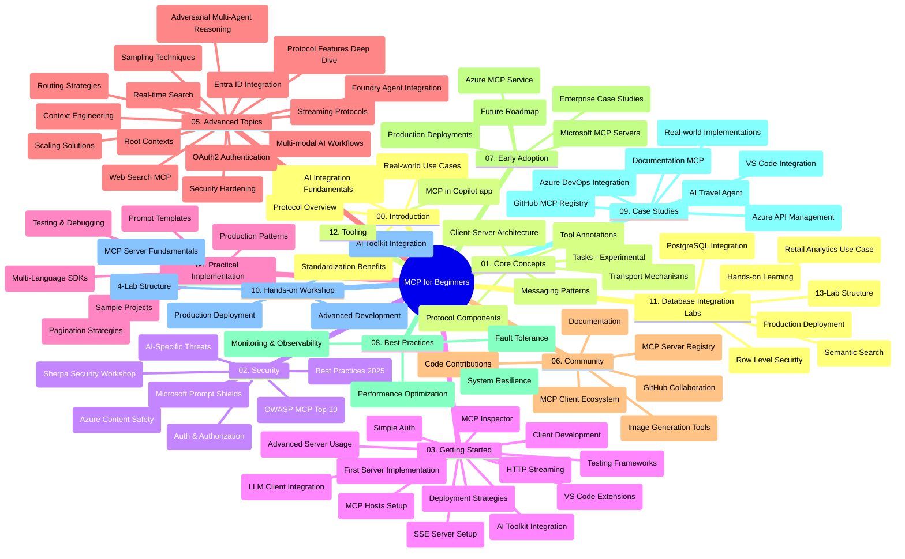

# Model Context Protocol (MCP) para sa mga Nagsisimula - Gabay sa Pag-aaral

Ang gabay sa pag-aaral na ito ay nagbibigay ng pangkalahatang-ideya ng istruktura ng repositoryo at nilalaman para sa kurikulum na "Model Context Protocol (MCP) para sa mga Nagsisimula". Gamitin ang gabay na ito upang mahusay na mag-navigate sa repositoryo at sulitin ang mga magagamit na resources.

## Pangkalahatang Ideya ng Repositoryo

Ang Model Context Protocol (MCP) ay isang standardized framework para sa mga interaksyon sa pagitan ng mga AI model at mga client na aplikasyon. Orihinal na nilikha ng Anthropic, ang MCP ay ngayon pinapanatili ng mas malawak na MCP community sa pamamagitan ng opisyal na GitHub na organisasyon. Ang repositoryo na ito ay naglalaan ng isang komprehensibong kurikulum na may mga hands-on code na halimbawa sa C#, Java, JavaScript, Python, at TypeScript, na dinisenyo para sa mga AI developer, system architect, at software engineer.

## Biswal na Mapa ng Kurikulum

## Istruktura ng Repositoryo

Ang repositoryo ay nakaayos sa labindalawang pangunahing seksyon, bawat isa ay nakatuon sa iba't ibang aspeto ng MCP:

1. **Panimula (00-Introduction/)**
   - Pangkalahatang-ideya ng Model Context Protocol
   - Bakit mahalaga ang standardization sa AI pipelines
   - Mga praktikal na gamit at benepisyo

2. **Pangunahing Konsepto (01-CoreConcepts/)**
   - Client-server architecture
   - Pangunahing mga bahagi ng protocol
   - Mga pattern sa pagpapadala ng mensahe sa MCP
   - Mga pagbabagong paparating: [Ano ang Binabago sa MCP: The 2026-07-28 Release Candidate](./01-CoreConcepts/mcp-2026-07-28-release-candidate.md) — ang stateless na core ng protocol, Extensions framework, at mga pag-deprecate sa Roots/Sampling/Logging na inaasahan sa susunod na bersyon ng espesipikasyon

3. **Seguridad (02-Security/)**
   - Mga banta sa seguridad sa mga sistemang batay sa MCP
   - Pinakamainam na mga gawi para sa pag-secure ng implementasyon
   - Mga estratehiya sa authentication at authorization
   - **Komprehensibong Dokumentasyon sa Seguridad**:
     - MCP Security Best Practices 2025
     - Azure Content Safety Implementation Guide
     - MCP Security Controls and Techniques
     - MCP Best Practices Quick Reference
   - **Pangunahing Paksa sa Seguridad**:
     - Prompt injection at tool poisoning attacks
     - Session hijacking at confused deputy problems
     - Token passthrough vulnerabilities
     - Labis na permiso at access control
     - Seguridad ng supply chain para sa mga AI components
     - Pagsasama ng Microsoft Prompt Shields

4. **Pagsisimula (03-GettingStarted/)**
   - Pagsasaayos ng kapaligiran at konfigurasyon
   - Paglikha ng mga pangunahing MCP server at client
   - Integrasyon sa mga umiiral na aplikasyon
   - Kabilang ang mga seksyon para sa:
     - Unang implementasyon ng server
     - Pagde-develop ng client
     - Integrasyon ng LLM client
     - Integrasyon ng VS Code
     - Server-Sent Events (SSE) server
     - Advanced na paggamit ng server
     - HTTP streaming
     - Integrasyon ng AI Toolkit
     - Mga estratehiya sa pagsusuri
     - Mga gabay sa deployment

5. **Praktikal na Implementasyon (04-PracticalImplementation/)**
   - Paggamit ng SDKs sa iba't ibang programming languages
   - Mga teknik sa debugging, pagsusuri, at beripikasyon
   - Paggawa ng reusable na mga prompt template at workflow
   - Mga sample na proyekto na may mga halimbawa ng implementasyon

6. **Mga Advanced na Paksa (05-AdvancedTopics/)**
   - Teknik sa context engineering
   - Integrasyon ng Foundry agent
   - Multi-modal AI workflow
   - Mga demo ng OAuth2 authentication
   - Real-time search capability
   - Real-time streaming
   - Implementasyon ng root contexts
   - Mga estratehiya sa routing
   - Mga teknik sa sampling
   - Mga pamamaraan sa scaling
   - Mga konsiderasyon sa seguridad
   - Integrasyon ng Entra ID security
   - Integrasyon ng web search
   - Adversarial multi-agent reasoning (mga debate pattern)

7. **Mga Kontribusyon ng Komunidad (06-CommunityContributions/)**
   - Paano mag-ambag ng code at dokumentasyon
   - Pakikipagtulungan sa pamamagitan ng GitHub
   - Mga enhancement at feedback na nagmumula sa komunidad
   - Paggamit ng iba't ibang MCP client (Claude Desktop, Cline, VSCode)
   - Pagtatrabaho sa mga kilalang MCP server kabilang ang image generation

8. **Mga Aral mula sa Maagang Paggamit (07-LessonsfromEarlyAdoption/)**
   - Mga totoong implementasyon at kwento ng tagumpay
   - Pagbuo at deployment ng mga solusyong batay sa MCP
   - Mga uso at roadmap para sa hinaharap
   - **Microsoft MCP Servers Guide**: Komprehensibong gabay sa 10 production-ready Microsoft MCP server kabilang ang:
     - Microsoft Learn Docs MCP Server
     - Azure MCP Server (15+ specialized connectors)
     - GitHub MCP Server
     - Azure DevOps MCP Server
     - MarkItDown MCP Server
     - SQL Server MCP Server
     - Playwright MCP Server
     - Dev Box MCP Server
     - Microsoft Foundry MCP Server
     - Microsoft 365 Agents Toolkit MCP Server

9. **Pinakamahusay na mga Gawi (08-BestPractices/)**
   - Performance tuning at optimization
   - Pagdidisenyo ng fault-tolerant na mga MCP system
   - Mga estratehiya sa pagsusuri at resilience

10. **Mga Pag-aaral ng Kaso (09-CaseStudy/)**
    - **Pitong komprehensibong pag-aaral ng kaso** na nagpapakita ng kakayahan ng MCP sa iba't ibang sitwasyon:
    - **Azure AI Travel Agents**: Multi-agent orchestration gamit ang Azure OpenAI at AI Search
    - **Integrasyon sa Azure DevOps**: Automatisasyon ng mga proseso ng workflow gamit ang YouTube data updates
    - **Real-Time na Pagkuha ng Dokumentasyon**: Python console client na may streaming HTTP
    - **Interactive Study Plan Generator**: Chainlit web app na may conversational AI
    - **In-Editor Documentation**: Integrasyon ng VS Code sa mga GitHub Copilot workflow
    - **Azure API Management**: Enterprise API integrasyon gamit ang MCP server creation
    - **GitHub MCP Registry**: Pagbuo ng ecosystem at agentic integration platform
    - Mga halimbawa ng implementasyon na sumasaklaw sa enterprise integration, developer productivity, at pagbuo ng ecosystem

11. **Hands-on Workshop (10-StreamliningAIWorkflowsBuildingAnMCPServerWithAIToolkit/)**
    - Komprehensibong hands-on workshop na pinagsasama ang MCP at AI Toolkit
    - Pagbuo ng matatalinong aplikasyon na nagdudugtong sa AI model at mga totoong kagamitan
    - Praktikal na mga module na sumasaklaw sa mga pundasyon, custom na pag-develop ng server, at mga estratehiya sa production deployment
    - **Istruktura ng Lab**:
      - Lab 1: MCP Server Fundamentals
      - Lab 2: Advanced MCP Server Development
      - Lab 3: AI Toolkit Integration
      - Lab 4: Production Deployment at Scaling
    - Paraan ng pag-aaral na nakabatay sa lab na may hakbang-hakbang na mga tagubilin

12. **MCP Server Database Integration Labs (11-MCPServerHandsOnLabs/)**
    - **Komprehensibong 13-lab na learning path** para sa pagbuo ng production-ready MCP server na may PostgreSQL integration
    - **Real-world retail analytics implementation** gamit ang Zava Retail use case
    - **Enterprise-grade na mga pattern** kabilang ang Row Level Security (RLS), semantic search, at multi-tenant data access
    - **Kumpletong Istruktura ng Lab**:
      - **Labs 00-03: Pundasyon** - Panimula, Arkitektura, Seguridad, Pag-setup ng Kapaligiran
      - **Labs 04-06: Pagbuo ng MCP Server** - Disenyo ng Database, Implementasyon ng MCP Server, Pagde-develop ng Tool
      - **Labs 07-09: Mga Advanced na Tampok** - Semantic Search, Pagsusuri at Debugging, Integrasyon ng VS Code
      - **Labs 10-12: Production at Pinakamahusay na mga Gawi** - Deployment, Monitoring, Optimization
    - **Mga Teknolohiyang Sakop**: FastMCP framework, PostgreSQL, Azure OpenAI, Azure Container Apps, Application Insights
    - **Mga Kinalabasan sa Pag-aaral**: Production-ready na MCP server, mga pattern ng database integration, AI-powered analytics, enterprise security

13. **Tooling (12-tooling/)**
    - Alamin kung paano gamitin ang MCP sa Copilot app at iba pang mga tool

## Karagdagang Resources

Kasama sa repositoryo ang mga sumusuportang resources:

- **Folder ng mga Larawan**: Naglalaman ng mga diagram at ilustrasyon na ginamit sa buong kurikulum
- **Mga Salin**: Suporta sa maraming wika na may awtomatikong pagsasalin ng dokumentasyon
- **Opisyal na MCP Resources**:
  - [MCP Documentation](https://modelcontextprotocol.io/)
  - [MCP Specification](https://spec.modelcontextprotocol.io/)
  - [MCP GitHub Repository](https://github.com/modelcontextprotocol)

## Paano Gamitin ang Repositoryong Ito

1. **Sunud-sunod na Pag-aaral**: Sundan ang mga kabanata ng sunud-sunod (00 hanggang 11) para sa isang istrukturadong karanasan sa pag-aaral.
2. **Pokus sa Isang Wika**: Kung interesado ka sa isang partikular na programming language, galugarin ang mga sample directory para sa mga implementasyon sa paborito mong wika.
3. **Praktikal na Implementasyon**: Magsimula sa seksyon na "Pagsisimula" upang mai-setup ang iyong kapaligiran at malikha ang iyong unang MCP server at client.
4. **Masusing Pagsisiyasat**: Kapag kumportable ka na sa mga batayan, sumisid sa mga advanced na paksa para palawakin ang iyong kaalaman.
5. **Pakikilahok sa Komunidad**: Sumali sa MCP community sa pamamagitan ng GitHub discussions at Discord channels para makipag-ugnayan sa mga eksperto at kapwa developer.

## Mga MCP Client at Tool

Tinutukoy ng kurikulum ang iba't ibang MCP client at mga tool:

1. **Opisyal na Client**:
   - Visual Studio Code 
   - MCP sa Visual Studio Code
   - Claude Desktop
   - Claude sa VSCode 
   - Claude API

2. **Mga Client ng Komunidad**:
   - Cline (batay sa terminal)
   - Cursor (code editor)
   - ChatMCP
   - Windsurf

3. **Mga Tool sa Pamamahala ng MCP**:
   - MCP CLI
   - MCP Manager
   - MCP Linker
   - MCP Router

## Mga Sikat na MCP Server

Ipinapakilala ng repositoryo ang iba't ibang MCP server, kabilang ang:

1. **Opisyal na Microsoft MCP Server**:
   - Microsoft Learn Docs MCP Server
   - Azure MCP Server (15+ specialized connectors)
   - GitHub MCP Server
   - Azure DevOps MCP Server
   - MarkItDown MCP Server
   - SQL Server MCP Server
   - Playwright MCP Server
   - Dev Box MCP Server
   - Microsoft Foundry MCP Server
   - Microsoft 365 Agents Toolkit MCP Server

2. **Opisyal na Reference Server**:
   - Filesystem
   - Fetch
   - Memory
   - Sequential Thinking

3. **Pagbuo ng Larawan**:
   - Azure OpenAI DALL-E 3
   - Stable Diffusion WebUI
   - Replicate

4. **Mga Development Tool**:
   - Git MCP
   - Terminal Control
   - Code Assistant

5. **Espesyal na Server**:
   - Salesforce
   - Microsoft Teams
   - Jira & Confluence

## Pag-aambag

Malugod na tinatanggap ng repositoryong ito ang mga kontribusyon mula sa komunidad. Tingnan ang seksyong Community Contributions para sa gabay kung paano epektibong mag-ambag sa ekosistema ng MCP.

----

*Ang gabay sa pag-aaral na ito ay huling na-update noong Pebrero 5, 2026, na sumasalamin sa pinakabagong MCP Specification 2025-11-25 at nagbibigay ng pangkalahatang ideya ng repositoryo sa petsang iyon. Maaaring ma-update ang nilalaman ng repositoryo pagkatapos ng petsang ito.*

*Addendum (Hulyo 2, 2026): isang leksyon tungkol sa `2026-07-28` MCP Specification Release Candidate ang idinagdag sa ilalim ng [01-CoreConcepts](./01-CoreConcepts/mcp-2026-07-28-release-candidate.md); nananatili ang baseline ng kurikulum sa 2025-11-25 hanggang sa mailabas ang bagong espesipikasyon.*

---

<!-- CO-OP TRANSLATOR DISCLAIMER START -->
**Pagtatanggi**:
Ang dokumentong ito ay isinalin gamit ang serbisyo ng AI translation na [Co-op Translator](https://github.com/Azure/co-op-translator). Bagama't nagsusumikap kami para sa katumpakan, pakatandaan na ang awtomatikong pagsasalin ay maaaring maglaman ng mga pagkakamali o hindi pagkakatugma. Ang orihinal na dokumento sa orihinal nitong wika ang dapat ituring na pangunahing sanggunian. Para sa mahahalagang impormasyon, inirerekomenda ang propesyonal na pagsasalin ng tao. Hindi kami mananagot sa anumang maling pagkakaintindi o maling interpretasyon na nagmula sa paggamit ng pagsasaling ito.
<!-- CO-OP TRANSLATOR DISCLAIMER END -->