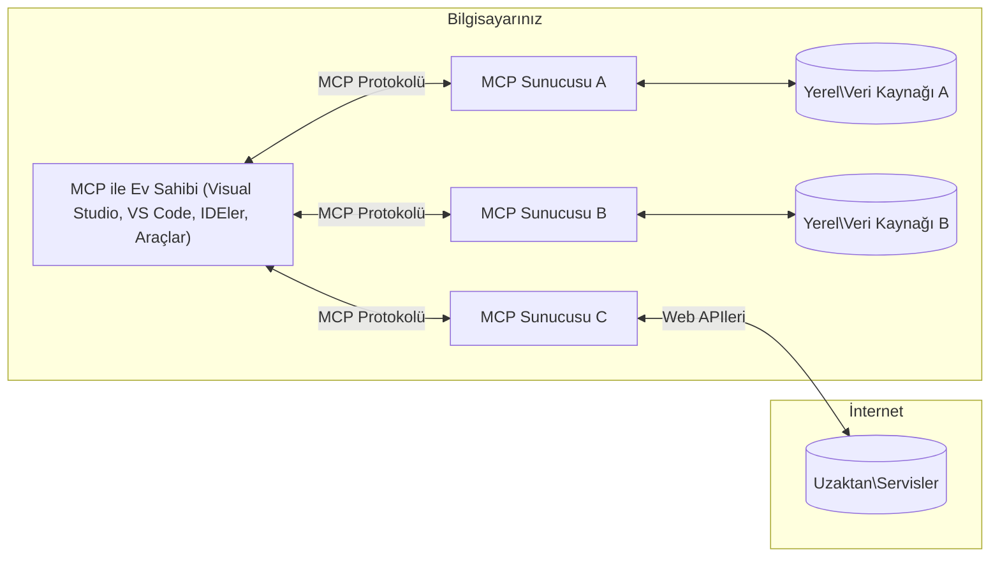

# MCP Temel Kavramları: Yapay Zeka Entegrasyonu için Model Bağlam Protokolünde Ustalaşma

[](https://youtu.be/earDzWGtE84)

_(Bu dersin videosunu izlemek için yukarıdaki resme tıklayın)_

[Model Bağlam Protokolü (MCP)](https://github.com/modelcontextprotocol), Büyük Dil Modelleri (LLM'ler) ile dış araçlar, uygulamalar ve veri kaynakları arasındaki iletişimi optimize eden güçlü, standartlaştırılmış bir çerçevedir.  
Bu rehber, MCP'nin temel kavramlarını size adım adım anlatacak. İstemci-sunucu mimarisi, temel bileşenleri, iletişim mekanizmaları ve uygulama en iyi uygulamaları hakkında bilgi edineceksiniz.

- **Açık Kullanıcı Onayı**: Tüm veri erişimleri ve işlemler, yürütülmeden önce açık kullanıcı onayı gerektirir. Kullanıcılar hangi verilere erişileceğini ve hangi işlemlerin yapılacağını net şekilde anlamalı; izinler ve yetkilendirmeler üzerinde ayrıntılı kontrol olmalıdır.

- **Veri Gizliliği Koruması**: Kullanıcı verilerine ancak açık rıza ile erişim sağlanabilir ve tüm etkileşim süreci boyunca güçlü erişim kontrolleri ile korunmalıdır. Yetkisiz veri iletimi engellenmeli ve sıkı gizlilik sınırları korunmalıdır.

- **Araç Çalıştırma Güvenliği**: Her araç çağrısı, aracın işlevi, parametreleri ve potansiyel etkileri hakkında net bilgi verilerek açık kullanıcı onayı gerektirir. Güçlü güvenlik sınırları, istem dışı, tehlikeli veya kötü niyetli araç çalıştırmayı engellemeli.

- **Taşıma Katmanı Güvenliği**: Tüm iletişim kanalları uygun şifreleme ve kimlik doğrulama mekanizmalarını kullanmalıdır. Uzak bağlantılar güvenli taşıma protokolleri ve uygun kimlik bilgisi yönetimi uygulamalıdır.

#### Uygulama Kılavuzları:

- **İzin Yönetimi**: Kullanıcıların hangi sunuculara, araçlara ve kaynaklara erişebileceğini kontrol etmelerine olanak tanıyan ayrıntılı izin sistemleri uygulayın  
- **Kimlik Doğrulama ve Yetkilendirme**: Güvenli kimlik doğrulama yöntemleri (OAuth, API anahtarları) kullanın; uygun token yönetimi ve süre sonlandırma uygulayın  
- **Girdi Doğrulama**: Tüm parametre ve veri girişlerini tanımlı şemalara göre doğrulayarak enjeksiyon saldırılarını önleyin  
- **Denetim Günlükleri**: Güvenlik izleme ve uyumluluk için tüm işlemlerin kapsamlı kayıtlarını tutun  

## Genel Bakış

Bu ders, Model Bağlam Protokolü (MCP) ekosistemini oluşturan temel mimarisi ve bileşenlerini incelemektedir. MCP etkileşimlerini yönlendiren istemci-sunucu mimarisi, ana bileşenler ve iletişim mekanizmaları hakkında bilgi edineceksiniz.

## Temel Öğrenme Hedefleri

Bu dersin sonunda:

- MCP istemci-sunucu mimarisini anlayacaksınız.  
- Host'ların, İstemcilerin ve Sunucuların rollerini ve sorumluluklarını belirleyebileceksiniz.  
- MCP'yi esnek bir entegrasyon katmanı yapan temel özellikleri analiz edeceksiniz.  
- MCP ekosisteminde bilgi akışını öğreneceksiniz.  
- .NET, Java, Python ve JavaScript örnek kodlarıyla pratik bilgiler edineceksiniz.  

## MCP Mimarisi: Daha Derin Bir Bakış

MCP ekosistemi istemci-sunucu modeli üzerine kuruludur. Bu modüler yapı, yapay zeka uygulamalarının araçlar, veri tabanları, API'ler ve bağlamsal kaynaklarla verimli etkileşmesini sağlar. Haydi bu mimariyi temel bileşenlerine ayıralım.

MCP özü itibarıyla, bir host uygulamanın birden fazla sunucuya bağlanabileceği istemci-sunucu mimarisini takip eder:



- **MCP Hostları**: MCP üzerinden verilere erişmek isteyen VSCode, Claude Desktop, IDE'ler veya yapay zeka araçları gibi programlar  
- **MCP İstemcileri**: Sunucularla bire bir bağlantı kuran protokol istemcileri  
- **MCP Sunucuları**: Standartlaştırılmış Model Bağlam Protokolü aracılığıyla belirli yetenekleri açığa çıkaran hafif programlar  
- **Yerel Veri Kaynakları**: Bilgisayarınızdaki dosyalar, veri tabanları ve MCP sunucularının güvenli bir şekilde erişebileceği servisler  
- **Uzak Servisler**: İnternet üzerinden erişilebilir olan ve MCP sunucularının API'ler aracılığıyla bağlandığı dış sistemler  

MCP Protokolü, tarih tabanlı sürümleme (YYYY-AA-GG formatı) kullanan gelişen bir standarttır. Mevcut protokol sürümü **2025-11-25**'tir. En son güncellemeleri [protokol spesifikasyonunda](https://modelcontextprotocol.io/specification/2025-11-25/) görebilirsiniz.

> **İleriye bakış:** Mayıs 2026'da açıklanan ve 28 Temmuz 2026'da yayınlanması planlanan, bir sonraki spesifikasyon sürümü için yayın adayı **2026-07-28**, protokolü taşıma katmanında durum bilgisiz hale getiriyor (`initialize` el sıkışması ve oturum kimliklerini kaldırma), Uzantılar çerçevesini resmi hale getiriyor ve Kökler, Örnekleme ve Günlüğü yeni kalıplar uğruna kullanım dışı bırakıyor. Tam detaylar için [MCP'de Değişiklikler: 2026-07-28 Yayın Adayı](./mcp-2026-07-28-release-candidate.md) dosyasına bakınız.

### 1. Hostlar

Model Bağlam Protokolü (MCP) içinde **Hostlar**, kullanıcıların protokolle etkileşimde bulunduğu birincil arayüz görevi gören yapay zeka uygulamalarıdır. Hostlar, her sunucu bağlantısı için özel MCP istemcileri oluşturarak birden fazla MCP sunucusuna bağlanmayı yönetir ve koordine eder. Host örnekleri:

- **Yapay Zeka Uygulamaları**: Claude Desktop, Visual Studio Code, Claude Code  
- **Geliştirme Ortamları**: MCP entegrasyonlu IDE'ler ve kod editörleri  
- **Özel Uygulamalar**: Amaç yapımı yapay zeka ajanları ve araçlar  

**Hostlar**, yapay zeka model etkileşimlerini koordine eden uygulamalardır. Şunları yaparlar:

- **Yapay Zeka Modellerini Orkestrasyon**: LLM'leri çalıştırma veya onlarla etkileşimde bulunarak yanıtlar üretmek ve AI iş akışlarını düzenlemek  
- **İstemci Bağlantılarını Yönetme**: Her MCP sunucu bağlantısı için bir MCP istemcisi oluşturur ve sürdürür  
- **Kullanıcı Arayüzünü Kontrol Etme**: Konuşma akışını, kullanıcı etkileşimlerini ve yanıt sunumunu denetler  
- **Güvenliği Uygulama**: İzinler, güvenlik kısıtlamaları ve kimlik doğrulamayı kontrol eder  
- **Kullanıcı Onayını Yönetme**: Veri paylaşımı ve araç çalıştırmak için kullanıcı onayını sağlar  

### 2. İstemciler

**İstemciler**, Hostlar ile MCP sunucuları arasında özel bire bir bağlantılar sağlayan temel bileşenlerdir. Her MCP istemcisi, Host tarafından belirli bir MCP sunucusuna bağlanmak için oluşturulur. Çoklu istemciler, Hostların aynı anda birden fazla sunucuya bağlanmasına imkan tanır.

**İstemciler**, host uygulama içinde bağlantı bileşenleridir. Şunları yaparlar:

- **Protokol İletişimi**: Sunuculara JSON-RPC 2.0 istekleri göndererek istemler ve talimatlar iletir  
- **Yeteneğe Uyum Görüşmesi**: Başlatma sırasında sunucularla desteklenen özellikler ve protokol sürümlerini yönetir  
- **Araç Çalıştırma**: Modellerden gelen araç çalıştırma taleplerini yönetir ve yanıtları işler  
- **Gerçek Zamanlı Güncellemeler**: Sunuculardan gelen bildirimler ve gerçek zamanlı güncellemeleri yönetir  
- **Yanıt İşleme**: Sunucu yanıtlarını işler ve kullanıcıya gösterim için biçimler  

### 3. Sunucular

**Sunucular**, MCP istemcilerine bağlam, araçlar ve yetenekler sağlayan programlardır. Yerel (Host ile aynı makinede) veya uzak (dış platformlarda) çalışabilirler. İstemci taleplerini karşılar, yapılandırılmış yanıtlar verirler. Sunucular, standart Model Bağlam Protokolü aracılığıyla belirli işlevselliği açığa çıkarır.

**Sunucular**, bağlam ve yetenek sağlayan servislerdir. Şunları yaparlar:

- **Özellik Kaydı**: İstemcilere mevcut ilkel (kaynaklar, istemler, araçlar) olanları kaydeder ve sunar  
- **İstek İşleme**: İstemcilerden gelen araç çağrılarını, kaynak taleplerini ve istemleri alır, uygular  
- **Bağlam Sağlama**: Model yanıtlarını iyileştirmek için bağlamsal bilgi ve veri sağlar  
- **Durum Yönetimi**: Oturum durumunu korur ve gerekirse durumlu etkileşimleri yönetir  
- **Gerçek Zamanlı Bildirimler**: Bağlı istemcilere yetenek değişiklikleri ve güncellemeleri hakkında bildirimler gönderir  

Sunucular, model yeteneklerini özel fonksiyonlarla genişletmek isteyen herkes tarafından geliştirilebilir ve hem yerel hem uzak dağıtım senaryolarını destekler.

### 4. Sunucu İlkeleri (Primitifleri)

Model Bağlam Protokolü (MCP) sunucuları, istemciler, hostlar ve dil modelleri arasında zengin etkileşimler için temel yapı taşlarını tanımlayan üç temel **ilkel** sağlar. Bu ilkeler, protokol üzerinden erişilebilen bağlamsal bilgi türleri ve kullanılabilir işlemleri belirtir.

MCP sunucuları aşağıdaki üç temel ilkelin herhangi bir kombinasyonunu sunabilir:

#### Kaynaklar

**Kaynaklar**, yapay zeka uygulamalarına bağlamsal bilgi sağlayan veri kaynaklarıdır. Statik veya dinamik içerik olarak model anlayışını ve karar vermeyi geliştirirler:

- **Bağlamsal Veri**: Yapay zeka modeli tüketimi için yapılandırılmış bilgi ve bağlam  
- **Bilgi Tabanları**: Doküman depoları, makaleler, kılavuzlar ve araştırma makaleleri  
- **Yerel Veri Kaynakları**: Dosyalar, veri tabanları ve yerel sistem bilgisi  
- **Dış Veri**: API yanıtları, web servisleri ve uzak sistem verileri  
- **Dinamik İçerik**: Dış koşullara bağlı olarak güncellenen gerçek zamanlı veriler  

Kaynaklar, URI'lerle tanımlanır ve `resources/list` ile keşfedilir, `resources/read` ile okunur:

```text
file://documents/project-spec.md
database://production/users/schema
api://weather/current
```

#### İstemler (Prompts)

**İstemler**, dil modelleriyle etkileşimi yapılandırmaya yardımcı olan tekrar kullanılabilir şablonlardır. Standart etkileşim kalıpları ve şablonlu iş akışları sağlarlar:

- **Şablon Tabanlı Etkileşimler**: Önceden yapılandırılmış mesajlar ve konuşma başlatıcıları  
- **İş Akışı Şablonları**: Yaygın görevler ve etkileşimler için standart diziler  
- **Az-örnekli Örnekler**: Model komutları için örnek tabanlı şablonlar  
- **Sistem İstemleri**: Model davranışını ve bağlamını belirleyen temel istemler  
- **Dinamik Şablonlar**: Belirli bağlamlara uyarlanan parametre tabanlı istemler  

İstemler değişken yerleştirme destekler, `prompts/list` ile keşfedilir, `prompts/get` ile alınır:

```markdown
Generate a {{task_type}} for {{product}} targeting {{audience}} with the following requirements: {{requirements}}
```

#### Araçlar

**Araçlar**, yapay zeka modellerinin belirli işlemleri gerçekleştirmek için çağırabileceği yürütülebilir fonksiyonlardır. MCP ekosisteminin "eylem"leri olarak, modellerin dış sistemlerle etkileşimine olanak tanır:

- **Yürütülebilir Fonksiyonlar**: Modellerin belirli parametrelerle çağırabileceği ayrı işlemler  
- **Dış Sistem Entegrasyonu**: API çağrıları, veri tabanı sorguları, dosya işlemleri, hesaplamalar  
- **Benzersiz Kimlik**: Her aracın ayrı bir adı, açıklaması ve parametre şeması bulunur  
- **Yapılandırılmış Giriş/Çıkış**: Araçlar doğrulanmış parametreleri kabul eder ve yapılandırılmış, tiplenmiş yanıtları döner  
- **Eylem Yeteneği**: Modellerin gerçek dünya işlemleri gerçekleştirmesini ve canlı veri almasını sağlar  

Araçlar parametre doğrulaması için JSON Şema ile tanımlanır, `tools/list` ile keşfedilir ve `tools/call` ile çalıştırılır. Araçlar daha iyi UI sunumu için **ikonlar** içerebilir.

**Araç Açıklamaları**: Araçlar, bir aracın salt-okunur (`readOnlyHint`) veya yıkıcı (`destructiveHint`) olup olmadığını belirten davranış açıklamalarını destekler. Bu, istemcilerin araç çalıştırma kararlarını bilinçli vermesine yardımcı olur.

Araç tanımı örneği:

```typescript
server.tool(
  "search_products", 
  {
    query: z.string().describe("Search query for products"),
    category: z.string().optional().describe("Product category filter"),
    max_results: z.number().default(10).describe("Maximum results to return")
  }, 
  async (params) => {
    // Arama yap ve yapılandırılmış sonuçları döndür
    return await productService.search(params);
  }
);
```

## İstemci İlkeleri

Model Bağlam Protokolü (MCP) içinde **istemciler**, sunucuların host uygulamadan ek yetenekler talep edebilmelerini sağlayan ilkeler sunabilir. Bu istemci tarafı ilkeler, model yetenekleri ve kullanıcı etkileşimlerine erişim sağlayarak daha zengin, etkileşimli sunucu uygulamaları olanağı sunar.

### Örnekleme (Sampling)

> **Kullanımdan kaldırma bildirimi:** `2026-07-28` yayın adayı, Örneklemeyi LLM sağlayıcı API'leriyle doğrudan entegrasyona tercih edilmesi sebebiyle kullanımdan kaldırmaktadır. `2025-11-25` sürümünde ve herhangi bir kullanımdan kaldırmadan sonraki en az bir yıl boyunca çalışmaya devam eder, ancak yeni tasarımlar yerine geçen deseni tercih etmelidir. Detaylar için [MCP'de Değişiklikler: 2026-07-28 Yayın Adayı](./mcp-2026-07-28-release-candidate.md) dosyasına bakınız.

**Örnekleme**, sunucuların istemci yapay zeka uygulamasından dil modeli tamamlamaları talep etmesini sağlar. Bu ilke, sunucuların kendi model bağımlılıklarını gömme zorunluluğu olmadan LLM kapasitelerine erişmesini mümkün kılar:

- **Modelden Bağımsız Erişim**: Sunucular, LLM SDK'ları dahil etmeden veya model erişimini yönetmeden tamamlamalar isteyebilir  
- **Sunucu Başlatılı AI**: Sunucuların istemcinin yapay zeka modeliyle bağımsız içerik üretmesini sağlar  
- **Yinelenen LLM Etkileşimleri**: Sunucuların işleme yardımı için AI'ye ihtiyaç duyduğu karmaşık senaryoları destekler  
- **Dinamik İçerik Üretimi**: Sunucular, host modelini kullanarak bağlamsal yanıtlar oluşturabilir  
- **Araç Çağrısı Desteği**: Sunucular, istemcinin modelinin örnekleme sırasında araçları çağırmasını sağlamak için `tools` ve `toolChoice` parametrelerini içerebilir  

Örnekleme, sunucuların istemcilere tamamlamalar göndermesi için `sampling/complete` yöntemiyle başlatılır.

### Kökler (Roots)

> **Kullanımdan kaldırma bildirimi:** `2026-07-28` yayın adayı, araç parametreleri, kaynak URI'leri veya sunucu yapılandırmasına tercih edilmesi sebebiyle Kökleri kullanımdan kaldırmaktadır. `2025-11-25` sürümünde ve herhangi bir kullanımdan kaldırmadan sonraki en az bir yıl boyunca çalışmaya devam eder. Detaylar için [MCP'de Değişiklikler: 2026-07-28 Yayın Adayı](./mcp-2026-07-28-release-candidate.md) dosyasına bakınız.

**Kökler**, istemcilerin sunuculara dosya sistemi sınırlarını standart bir biçimde açığa çıkarmasını sağlar, böylece sunucular hangi dizinler ve dosyalara erişebileceklerini anlayabilir:

- **Dosya Sistemi Sınırları**: Sunucuların dosya sistemi içinde hangi alanlarda işlem yapabileceğini tanımlar  
- **Erişim Kontrolü**: Sunucuların hangi dizin ve dosyalara erişim izni olduğunu anlamalarına yardımcı olur  
- **Dinamik Güncellemeler**: İstemciler, kök listesi değiştiğinde sunucuları bilgilendirir  
- **URI Tabanlı Tanımlama**: Kökler erişilebilir dizin ve dosyaları tanımlamak için `file://` URI'leri kullanır  

Kökler `roots/list` yöntemi ile keşfedilir; istemciler kökler değiştiğinde `notifications/roots/list_changed` bildirimi gönderir.

### Bilgilendirme (Elicitation)

**Bilgilendirme**, sunucuların istemci arayüzü aracılığıyla kullanıcılardan ek bilgi veya onay talep etmelerini sağlar:

- **Kullanıcı Girdi Talepleri**: Sunucular, araç çalıştırmak için ek bilgi gerektiğinde kullanıcıdan istekte bulunabilir  
- **Onay Diyalogları**: Hassas veya etkili işlemler için kullanıcı onayı talep eder  
- **Etkileşimli İş Akışları**: Sunucuların adım adım kullanıcı etkileşimleri oluşturmasını sağlar  
- **Dinamik Parametre Toplama**: Araç çalıştırma sırasında eksik veya isteğe bağlı parametrelerin toplanmasına olanak tanır  

Bilgilendirme talepleri, kullanıcı girdisi toplamak için `elicitation/request` yöntemiyle yapılır.

**URL Modu Bilgilendirme**: Sunucular, kullanıcıyı kimlik doğrulama, onay veya veri girişi için harici web sayfalarına yönlendirebilecek URL tabanlı kullanıcı etkileşimleri talep edebilir.

### Günlükleme (Logging)
> **Kullanımdan kaldırma bildirimi:** `2026-07-28` sürüm adayı, yapılandırılmış gözlemlenebilirlik için stdio taşıyıcıları için `stderr` ve OpenTelemetry lehine Logging'in kullanımdan kaldırıldığını bildirir. Bu özellik `2025-11-25` sürümünde ve herhangi bir kullanımdan kaldırmadan sonra en az bir yıl boyunca çalışmaya devam eder. Bakınız: [MCP'de Neler Değişiyor: 2026-07-28 Sürüm Adayı](./mcp-2026-07-28-release-candidate.md).

**Logging**, sunucuların hata ayıklama, izleme ve operasyonel görünürlük için istemcilere yapılandırılmış günlük mesajları göndermesini sağlar:

- **Hata Ayıklama Desteği**: Sorun giderme için sunuculara detaylı yürütme günlükleri sağlamayı etkinleştirir
- **Operasyonel İzleme**: İstemcilere durum güncellemeleri ve performans metrikleri gönderir
- **Hata Raporlama**: Detaylı hata bağlamı ve tanısal bilgiler sağlar
- **Denetim Kayıtları**: Sunucu işlemlerinin ve kararlarının kapsamlı günlüklerini oluşturur

Logging mesajları, sunucu işlemlerine şeffaflık sağlamak ve hata ayıklamayı kolaylaştırmak amacıyla istemcilere gönderilir.

## MCP'de Bilgi Akışı

Model Context Protocol (MCP), ana bilgisayarlar, istemciler, sunucular ve modeller arasında yapılandırılmış bir bilgi akışını tanımlar. Bu akışın anlaşılması, kullanıcı isteklerinin nasıl işlendiğini ve dış araçlar ile verilerin model yanıtlarına nasıl entegre edildiğini netleştirir.

- **Ana Bilgisayar Bağlantıyı Başlatır**  
  Ana bilgisayar uygulaması (IDE veya sohbet arayüzü gibi), genellikle STDIO, WebSocket veya desteklenen başka bir taşıyıcı üzerinden bir MCP sunucusuna bağlantı kurar.

- **Yetenek Müzakeresi**  
  Ana bilgisayara gömülü istemci ile sunucu, destekledikleri özellikler, araçlar, kaynaklar ve protokol sürümleri hakkında bilgi alışverişi yapar. Bu, her iki tarafın oturum için mevcut yetenekleri anlamasını sağlar.

- **Kullanıcı İsteği**  
  Kullanıcı ana bilgisayar ile etkileşime girer (örneğin bir komut veya istem girer). Ana bilgisayar bu girdiyi toplar ve işleme için istemciye iletir.

- **Kaynak veya Araç Kullanımı**  
  - İstemci, modelin anlayışını zenginleştirmek için sunucudan ek bağlam veya kaynaklar (örneğin dosyalar, veritabanı girdileri veya bilgi tabanı makaleleri) talep edebilir.  
  - Model bir aracın gerekli olduğuna karar verirse (örneğin veri getirmek, hesaplama yapmak veya API çağrısı yapmak için), istemci sunucuya araç çağrısı isteği gönderir, araç adı ve parametreleri belirtir.

- **Sunucu Yürütme**  
  Sunucu kaynak veya araç isteğini alır, gerekli işlemleri yapar (örneğin bir fonksiyon çalıştırma, veritabanı sorgulama veya dosya alma) ve sonuçları yapılandırılmış biçimde istemciye geri iletir.

- **Yanıt Oluşturma**  
  İstemci, sunucunun yanıtlarını (kaynak verileri, araç çıktıları vb.) devam eden model etkileşimine entegre eder. Model, kapsamlı ve bağlama uygun cevabı bu bilgileri kullanarak üretir.

- **Sonuç Sunumu**  
  Ana bilgisayar, istemciden gelen nihai çıktıyı alır ve genellikle model tarafından oluşturulan metni ile araç yürütme ya da kaynak sorgulama sonuçlarını birlikte kullanıcıya sunar.

Bu akış, MCP'nin modelleri dış araçlar ve veri kaynakları ile sorunsuzca bağlayarak gelişmiş, etkileşimli ve bağlama duyarlı yapay zeka uygulamalarını desteklemesini sağlar.

## Protokol Mimarisi & Katmanları

MCP, eksiksiz bir iletişim çerçevesi sağlamak için birlikte çalışan iki ayrı mimari katmandan oluşur:

### Veri Katmanı

**Veri Katmanı**, temel MCP protokolünü **JSON-RPC 2.0** üzerine inşa eder. Bu katman, mesaj yapısını, anlambilimini ve etkileşim desenlerini tanımlar:

#### Temel Bileşenler:

- **JSON-RPC 2.0 Protokolü**: Tüm iletişim, metod çağrıları, yanıtlar ve bildirimler için standart JSON-RPC 2.0 mesaj formatını kullanır  
- **Yaşam Döngüsü Yönetimi**: İstemciler ve sunucular arasında bağlantı başlatma, yetenek müzakeresi ve oturum sonlandırmayı yönetir  
- **Sunucu Primitifleri**: Sunucuların araçlar, kaynaklar ve istemler aracılığıyla temel işlevsellik sağlamasını destekler  
- **İstemci Primitifleri**: Sunucuların LLM'den örnekleme istemesini, kullanıcı girdisi talep etmesini ve günlük mesajları göndermesini sağlar  
- **Gerçek Zamanlı Bildirimler**: Sorgulama yapmadan dinamik güncellemeler için asenkron bildirimleri destekler

#### Ana Özellikler:

- **Protokol Sürüm Müzakeresi**: Uyumluluğu sağlamak için tarih tabanlı sürümleme (YYYY-AA-GG) kullanır  
- **Yetenek Keşfi**: Başlatmada istemci ve sunucuların destekledikleri özellik bilgilerini paylaşmasını sağlar  
- **Durumlu Oturumlar**: Çoklu etkileşimlerde baglam sürekliliği için bağlantı durumunu korur

### Taşıma Katmanı

**Taşıma Katmanı**, MCP katılımcıları arasında iletişim kanallarını, mesaj çerçevelemeyi ve kimlik doğrulamayı yönetir:

#### Desteklenen Taşıma Mekanizmaları:

1. **STDIO Taşıyıcısı**:  
   - Doğrudan süreç iletişimi için standart giriş/çıkış akışlarını kullanır  
   - Aynı makinedeki yerel süreçler için ideal, ağ yükü yok  
   - Yerel MCP sunucu uygulamaları için yaygın kullanılır

2. **Yayınlanabilir HTTP Taşıyıcısı**:  
   - İstemciden sunucuya mesajlar için HTTP POST kullanır  
   - Sunucudan istemciye streaming için isteğe bağlı Server-Sent Events (SSE) destekler  
   - Ağlar arasında uzak sunucu iletişimi sağlar  
   - Standart HTTP kimlik doğrulamasını destekler (bearer token, API anahtarları, özel başlıklar)  
   - MCP, güvenli token tabanlı kimlik doğrulama için OAuth önermektedir

#### Taşıma Soyutlaması:

Taşıma katmanı, iletişim detaylarını veri katmanından soyutlar; böylece tüm taşıma mekanizmaları üzerinde aynı JSON-RPC 2.0 mesaj formatı kullanılabilir. Bu soyutlama, uygulamaların yerel ve uzak sunucular arasında sorunsuz geçiş yapmasını sağlar.

### Güvenlik Hususları

MCP uygulamaları, tüm protokol işlemleri süresince güvenli, güvenilir ve emniyetli etkileşimleri sağlamak için birkaç kritik güvenlik ilkesine uymak zorundadır:

- **Kullanıcı Rızası ve Kontrolü**:  
  Herhangi bir veri erişimi veya işlem yapılmadan önce kullanıcı açık rıza vermelidir. Paylaşılan veriler ve yetkilendirilen işlemler üzerinde kullanıcıların net kontrolü olmalı, faaliyetlerin gözden geçirilip onaylanması için sezgisel kullanıcı arayüzleri desteklenmelidir.

- **Veri Gizliliği**:  
  Kullanıcı verileri yalnızca açık rıza ile açığa çıkarılmalı ve uygun erişim kontrolleri ile korunmalıdır. MCP uygulamaları yetkisiz veri iletimine karşı koruma sağlamalı ve gizlilik tüm etkileşimler boyunca korunmalıdır.

- **Araç Güvenliği**:  
  Herhangi bir araç çağrılmadan önce kullanıcıdan açık onay alınmalıdır. Kullanıcılar her aracın işlevini net olarak anlamalı ve istenmeyen veya güvensiz araç çalıştırmaları önlemek için sağlam güvenlik sınırları uygulanmalıdır.

Bu güvenlik ilkeleri takip edilerek MCP, güçlü AI entegrasyonları sağlarken kullanıcı güveni, gizliliği ve güvenliği temin eder.

## Kod Örnekleri: Temel Bileşenler

Aşağıda, temel MCP sunucu bileşenlerinin ve araçların nasıl uygulanacağını gösteren popüler programlama dillerinde kod örnekleri bulunmaktadır.

### .NET Örneği: Araçlarla Basit Bir MCP Sunucusu Oluşturma

Aşağıda, özel araçlarla basit bir MCP sunucusu nasıl oluşturulur gösteren pratik bir .NET kod örneği vardır. Bu örnek, araçların nasıl tanımlanıp kaydedileceğini, isteklerin nasıl ele alınacağını ve sunucunun Model Context Protocol kullanarak nasıl bağlanacağını gösterir.

```csharp
using System;
using System.Threading.Tasks;
using ModelContextProtocol.Server;
using ModelContextProtocol.Server.Transport;
using ModelContextProtocol.Server.Tools;

public class WeatherServer
{
    public static async Task Main(string[] args)
    {
        // Create an MCP server
        var server = new McpServer(
            name: "Weather MCP Server",
            version: "1.0.0"
        );
        
        // Register our custom weather tool
        server.AddTool<string, WeatherData>("weatherTool", 
            description: "Gets current weather for a location",
            execute: async (location) => {
                // Call weather API (simplified)
                var weatherData = await GetWeatherDataAsync(location);
                return weatherData;
            });
        
        // Connect the server using stdio transport
        var transport = new StdioServerTransport();
        await server.ConnectAsync(transport);
        
        Console.WriteLine("Weather MCP Server started");
        
        // Keep the server running until process is terminated
        await Task.Delay(-1);
    }
    
    private static async Task<WeatherData> GetWeatherDataAsync(string location)
    {
        // This would normally call a weather API
        // Simplified for demonstration
        await Task.Delay(100); // Simulate API call
        return new WeatherData { 
            Temperature = 72.5,
            Conditions = "Sunny",
            Location = location
        };
    }
}

public class WeatherData
{
    public double Temperature { get; set; }
    public string Conditions { get; set; }
    public string Location { get; set; }
}
```

### Java Örneği: MCP Sunucu Bileşenleri

Bu örnek, yukarıdaki .NET örneğinde olduğu gibi MCP sunucu ve araç kayıt işlemini Java dilinde göstermektedir.

```java
import io.modelcontextprotocol.server.McpServer;
import io.modelcontextprotocol.server.McpToolDefinition;
import io.modelcontextprotocol.server.transport.StdioServerTransport;
import io.modelcontextprotocol.server.tool.ToolExecutionContext;
import io.modelcontextprotocol.server.tool.ToolResponse;

public class WeatherMcpServer {
    public static void main(String[] args) throws Exception {
        // Bir MCP sunucusu oluştur
        McpServer server = McpServer.builder()
            .name("Weather MCP Server")
            .version("1.0.0")
            .build();
            
        // Bir hava durumu aracı kaydet
        server.registerTool(McpToolDefinition.builder("weatherTool")
            .description("Gets current weather for a location")
            .parameter("location", String.class)
            .execute((ToolExecutionContext ctx) -> {
                String location = ctx.getParameter("location", String.class);
                
                // Hava durumu verilerini al (basitleştirilmiş)
                WeatherData data = getWeatherData(location);
                
                // Formatlanmış yanıtı döndür
                return ToolResponse.content(
                    String.format("Temperature: %.1f°F, Conditions: %s, Location: %s", 
                    data.getTemperature(), 
                    data.getConditions(), 
                    data.getLocation())
                );
            })
            .build());
        
        // Sunucuyu stdio taşıma kullanarak bağla
        try (StdioServerTransport transport = new StdioServerTransport()) {
            server.connect(transport);
            System.out.println("Weather MCP Server started");
            // İşlem sonlandırılana kadar sunucuyu çalışır tut
            Thread.currentThread().join();
        }
    }
    
    private static WeatherData getWeatherData(String location) {
        // Uygulama bir hava durumu API'sini çağırırdı
        // Örnek amaçlı basitleştirilmiştir
        return new WeatherData(72.5, "Sunny", location);
    }
}

class WeatherData {
    private double temperature;
    private String conditions;
    private String location;
    
    public WeatherData(double temperature, String conditions, String location) {
        this.temperature = temperature;
        this.conditions = conditions;
        this.location = location;
    }
    
    public double getTemperature() {
        return temperature;
    }
    
    public String getConditions() {
        return conditions;
    }
    
    public String getLocation() {
        return location;
    }
}
```

### Python Örneği: Bir MCP Sunucusu İnşa Etmek

Bu örnek fastmcp kullanır, lütfen önce bunu kurduğunuzdan emin olun:

```python
pip install fastmcp
```
Kod Örneği:

```python
#!/usr/bin/env python3
import asyncio
from fastmcp import FastMCP
from fastmcp.transports.stdio import serve_stdio

# Bir FastMCP sunucusu oluşturun
mcp = FastMCP(
    name="Weather MCP Server",
    version="1.0.0"
)

@mcp.tool()
def get_weather(location: str) -> dict:
    """Gets current weather for a location."""
    return {
        "temperature": 72.5,
        "conditions": "Sunny",
        "location": location
    }

# Sınıf kullanarak alternatif bir yaklaşım
class WeatherTools:
    @mcp.tool()
    def forecast(self, location: str, days: int = 1) -> dict:
        """Gets weather forecast for a location for the specified number of days."""
        return {
            "location": location,
            "forecast": [
                {"day": i+1, "temperature": 70 + i, "conditions": "Partly Cloudy"}
                for i in range(days)
            ]
        }

# Sınıf araçlarını kaydedin
weather_tools = WeatherTools()

# Sunucuyu başlatın
if __name__ == "__main__":
    asyncio.run(serve_stdio(mcp))
```

### JavaScript Örneği: Bir MCP Sunucusu Oluşturmak

Bu örnek JavaScript'te MCP sunucusu oluşturmayı ve hava durumu ile ilgili iki aracı kaydetmeyi göstermektedir.

```javascript
// Resmi Model Context Protocol SDK'sını kullanma
import { McpServer } from "@modelcontextprotocol/sdk/server/mcp.js";
import { StdioServerTransport } from "@modelcontextprotocol/sdk/server/stdio.js";
import { z } from "zod"; // Parametre doğrulama için

// Bir MCP sunucusu oluştur
const server = new McpServer({
  name: "Weather MCP Server",
  version: "1.0.0"
});

// Bir hava durumu aracı tanımla
server.tool(
  "weatherTool",
  {
    location: z.string().describe("The location to get weather for")
  },
  async ({ location }) => {
    // Bu normalde bir hava durumu API'sini çağırır
    // Gösterim amaçlı basitleştirildi
    const weatherData = await getWeatherData(location);
    
    return {
      content: [
        { 
          type: "text", 
          text: `Temperature: ${weatherData.temperature}°F, Conditions: ${weatherData.conditions}, Location: ${weatherData.location}` 
        }
      ]
    };
  }
);

// Bir tahmin aracı tanımla
server.tool(
  "forecastTool",
  {
    location: z.string(),
    days: z.number().default(3).describe("Number of days for forecast")
  },
  async ({ location, days }) => {
    // Bu normalde bir hava durumu API'sini çağırır
    // Gösterim amaçlı basitleştirildi
    const forecast = await getForecastData(location, days);
    
    return {
      content: [
        { 
          type: "text", 
          text: `${days}-day forecast for ${location}: ${JSON.stringify(forecast)}` 
        }
      ]
    };
  }
);

// Yardımcı fonksiyonlar
async function getWeatherData(location) {
  // API çağrısını simüle et
  return {
    temperature: 72.5,
    conditions: "Sunny",
    location: location
  };
}

async function getForecastData(location, days) {
  // API çağrısını simüle et
  return Array.from({ length: days }, (_, i) => ({
    day: i + 1,
    temperature: 70 + Math.floor(Math.random() * 10),
    conditions: i % 2 === 0 ? "Sunny" : "Partly Cloudy"
  }));
}

// Sunucuyu stdio taşıma ile bağla
const transport = new StdioServerTransport();
server.connect(transport).catch(console.error);

console.log("Weather MCP Server started");
```

Bu JavaScript örneği, Model Context Protocol SDK'yı kullanarak bir MCP sunucusu oluşturmayı gösterir. `weatherTool` ve `forecastTool` adlı iki aracı kaydeder ve bunların MCP istemcilerine `StdioServerTransport` aracılığıyla sunulmasını sağlar.

## Güvenlik ve Yetkilendirme

MCP, protokol boyunca güvenlik ve yetkilendirmeyi yönetmek için bir dizi yerleşik kavram ve mekanizma içerir:

1. **Araç İzin Kontrolü**:  
  İstemciler, modelin oturum süresince hangi araçları kullanabileceğini belirleyebilir. Bu, yalnızca açıkça yetkilendirilmiş araçların erişilebilir olmasını sağlar, istenmeyen veya güvensiz işlemler riskini azaltır. İzinler, kullanıcı tercihleri, organizasyon politikaları veya etkileşim bağlamına göre dinamik olarak yapılandırılabilir.

2. **Kimlik Doğrulama**:  
  Sunucular, araçlara, kaynaklara veya hassas işlemlere erişim öncesinde kimlik doğrulaması isteyebilir. Bu API anahtarları, OAuth tokenleri veya diğer kimlik doğrulama şemalarını içerebilir. Uygun kimlik doğrulama yalnızca güvenilir istemci ve kullanıcıların sunucu tarafı yetenekleri çağırabilmesini sağlar.

3. **Doğrulama**:  
  Tüm araç çağrıları için parametre doğrulaması uygulanır. Her araç parametrelerinin beklenen tiplerini, formatlarını ve kısıtlamalarını tanımlar, sunucu gelen istekleri buna göre doğrular. Bu, kötü biçimlendirilmiş veya kötü amaçlı girdilerin araç uygulamalarına ulaşmasını engeller ve işlemlerin bütünlüğünü korur.

4. **Hız Sınırlandırma**:  
  Kötüye kullanımı önlemek ve sunucu kaynaklarının adil kullanımını sağlamak için MCP sunucuları araç çağrıları ve kaynak erişimi için hız sınırlandırması uygulayabilir. Limitler kullanıcı başına, oturum başına veya genel olabilir ve hizmet dışı bırakma saldırıları ya da aşırı kaynak tüketimini engellemeye yardımcı olur.

Bu mekanizmalar bir arada MCP’ye, dil modelleri ile dış araçlar ve veri kaynakları entegrasyonu için güvenli bir temel sağlar; kullanıcılar ve geliştiricilere erişim ve kullanım üzerinde ince ayar kontrolü sunar.

## Protokol Mesajları & İletişim Akışı

MCP iletişimi, ana bilgisayarlar, istemciler ve sunucular arasında net ve güvenilir etkileşimler sağlamak için yapılandırılmış **JSON-RPC 2.0** mesajları kullanır. Protokol, farklı işlem türleri için belirli mesaj desenleri tanımlar:

### Temel Mesaj Türleri:

#### **Başlatma Mesajları**
- **`initialize` İsteği**: Bağlantıyı kurar ve protokol sürümü ile yetenekleri müzakere eder  
- **`initialize` Yanıtı**: Desteklenen özellikleri ve sunucu bilgisini onaylar  
- **`notifications/initialized`**: Başlatmanın tamamlandığını ve oturumun hazır olduğunu bildirir

#### **Keşif Mesajları**
- **`tools/list` İsteği**: Sunucudan mevcut araçları keşfeder  
- **`resources/list` İsteği**: Mevcut kaynakları (veri kaynaklarını) listeler  
- **`prompts/list` İsteği**: Mevcut istem şablonlarını getirir

#### **Yürütme Mesajları**  
- **`tools/call` İsteği**: Verilen parametrelerle belirli bir aracı çalıştırır  
- **`resources/read` İsteği**: Belirli bir kaynağın içeriğini alır  
- **`prompts/get` İsteği**: İsteğe bağlı parametrelerle bir istem şablonunu getirir

#### **İstemci Tarafı Mesajlar**
- **`sampling/complete` İsteği**: Sunucu, LLM tamamlama için istemciden talepte bulunur  
- **`elicitation/request`**: Sunucu, kullanıcı girdisi için istemci arayüzü ister  
- **Logging Mesajları**: Sunucu, yapılandırılmış günlük mesajları istemciye gönderir

#### **Bildirim Mesajları**
- **`notifications/tools/list_changed`**: Sunucu, araçlardaki değişiklikleri istemciye bildirir  
- **`notifications/resources/list_changed`**: Sunucu, kaynaklardaki değişiklikleri bildirir  
- **`notifications/prompts/list_changed`**: Sunucu, istem şablonlarındaki değişiklikleri bildirir

### Mesaj Yapısı:

Tüm MCP mesajları JSON-RPC 2.0 formatına uyar ve:
- **İstek Mesajları**: `id`, `method` ve isteğe bağlı `params` içerir  
- **Yanıt Mesajları**: `id` ve ya `result` ya da `error` içerir  
- **Bildirim Mesajları**: `method` ve isteğe bağlı `params` içerir (id yok ve yanıt beklenmez)

Bu yapılandırılmış iletişim, gerçek zamanlı güncellemeler, araç zincirleme ve sağlam hata yönetimi gibi gelişmiş senaryoları destekleyen güvenilir, izlenebilir ve genişletilebilir etkileşimler sağlar.

### Görevler (Deneysel)

> **İleriye bakış:** `2026-07-28` sürüm adayı, Görevleri deneysel çekirdek spesifikasyondan çıkarıp yeniden tasarlanmış yaşam döngüsü ile ayrılmış Görevler uzantısına geçirir (`tasks/get`, `tasks/update`, `tasks/cancel`; `tasks/list` kaldırılmıştır). Aşağıda tanımlanan deneysel API'yı kullanarak geliştirme yapıyorsanız, geçiş planlayın. Bakınız: [MCP'de Neler Değişiyor: 2026-07-28 Sürüm Adayı](./mcp-2026-07-28-release-candidate.md).

**Görevler**, MCP istekleri için ertelenmiş sonuç alımı ve durum takibi sağlayan dayanıklı yürütme sarmalayıcıları sunan deneysel bir özelliktir:

- **Uzun Süren İşlemler**: Pahalı hesaplamaları, iş akışı otomasyonunu ve toplu işlemleri takip eder  
- **Ertelenmiş Sonuçlar**: Görev durumunu sorgular ve işlemler tamamlanınca sonuçları alır  
- **Durum Takibi**: Tanımlı yaşam döngüsü aşamaları aracılığıyla görev ilerlemesini izler  
- **Çok Adımlı İşlemler**: Birden fazla etkileşimi kapsayan karmaşık iş akışlarını destekler

Görevler, hemen tamamlanamayan işlemler için asenkron yürütme desenlerini uygulamak üzere standart MCP isteklerini sarar.

## Ana Noktalar

- **Mimari**: MCP, ana bilgisayarların birçok istemci bağlantısını sunuculara yönettiği istemci-sunucu mimarisi kullanır  
- **Katılımcılar**: Ekosistem; ana bilgisayarlar (AI uygulamaları), istemciler (protokol bağlayıcıları) ve sunucular (yetenek sağlayıcılar) içerir  
- **Taşıma Mekanizmaları**: İletişim STDIO (yerel) ve yayınlanabilir HTTP ile isteğe bağlı SSE (uzak) destekler  
- **Çekirdek Primitifler**: Sunucular, araçlar (çalıştırılabilir fonksiyonlar), kaynaklar (veri kaynakları) ve istemleri (şablonlar) açığa çıkarır  
- **İstemci Primitifleri**: Sunucular istemciden örnekleme (araç çağırma destekli LLM tamamlama), istem (URL modu dahil kullanıcı girdisi), kökler (dosya sistemi sınırları) ve günlük talep edebilir  
- **Deneysel Özellikler**: Görevler, uzun süren işlemler için dayanıklı yürütme sarmalayıcıları sağlar  
- **Protokol Temeli**: JSON-RPC 2.0 üzerine kurulu, tarih tabanlı sürümleme (güncel: 2025-11-25)  
- **Gerçek Zamanlı Yetkinlik**: Dinamik güncellemeler ve gerçek zamanlı senkronizasyon için bildirimleri destekler  
- **Güvenlik Öncelikli**: Açık kullanıcı rızası, veri gizliliği koruması ve güvenli taşıma temel gereksinimlerdir

## Alıştırma

Alanınızda faydalı olacak basit bir MCP aracı tasarlayın. Tanımlayın:
1. Araç ismi ne olurdu  
2. Hangi parametreleri kabul ederdi  
3. Hangi çıktıyı döndürürdü  
4. Bir model bu aracı kullanıcı problemlerini çözmek için nasıl kullanabilir

---

## Sonraki

Sonraki: [2. Bölüm: Güvenlik](../02-Security/README.md)
`2025-11-25` tarihinden sonra ne gelecek merak ediyor musunuz? Okuyun [MCP'de Neler Değişiyor: 2026-07-28 Sürüm Adayı](./mcp-2026-07-28-release-candidate.md).

---

<!-- CO-OP TRANSLATOR DISCLAIMER START -->
**Feragatname**:
Bu belge, AI çeviri hizmeti [Co-op Translator](https://github.com/Azure/co-op-translator) kullanılarak çevrilmiştir. Doğruluk için çaba sarf etsek de, otomatik çevirilerin hata veya yanlışlık içerebileceğini lütfen unutmayınız. Orijinal belge, kendi dilinde yetkili kaynak olarak kabul edilmelidir. Kritik bilgiler için profesyonel insan çevirisi önerilir. Bu çevirinin kullanımı sonucu ortaya çıkabilecek yanlış anlamalardan veya yanlış yorumlamalardan sorumlu değiliz.
<!-- CO-OP TRANSLATOR DISCLAIMER END -->