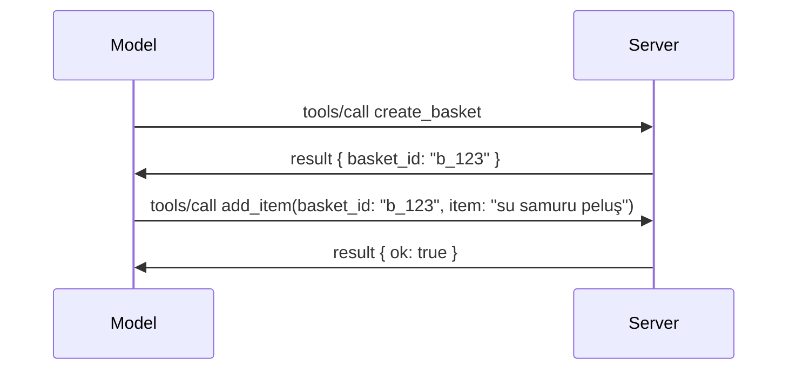

# MCP'de Neler Değişiyor: 2026-07-28 Sürüm Adayı

> **Durum:** Sürüm Adayı. `2026-07-28` spesifikasyonu yazım anında nihai değildir. 21 Mayıs 2026'da duyuruldu ve 28 Temmuz 2026'da piyasaya sürülmesi planlanmaktadır. Bu derste anlatılanların tamamı sürüm adayını açıklamaktadır; üzerine inşa etmeden önce en güncel durumu öğrenmek için [taslak spesifikasyonu](https://modelcontextprotocol.io/specification/draft) ve onun [değişiklik günlüğünü](https://modelcontextprotocol.io/specification/draft/changelog) kontrol edin. Bu müfredatın geri kalanı mevcut kararlı sürüm olan **MCP Spesifikasyon 2025-11-25** üzerine yazılmıştır ve `2026-07-28` yayınlandıktan sonra güncellenecektir.

## Genel Bakış

`2026-07-28`, MCP'nin lansmanından bu yana en büyük revizyonudur. Altı Spesifikasyon Geliştirme Önerisi (SEP), protokol düzeyindeki oturumları kaldırır ve MCP'yi taşıma katmanında durumsuz hale getirir, uzantılar birinci sınıf, sürümlü bir mekanizma haline gelir ve bu müfredatta daha önce öğrendiğiniz bazı özellikler (Kökler, Örnekleme, Kayıt Tutma) yeni yaşam döngüsü politikası kapsamında kullanımdan kaldırılmış olarak işaretlenir. Bu ders nelerin değiştiğini, neden önemli olduğunu ve `2025-11-25` sürümüne karşı yazdığınız kod için bunun ne anlama geldiğini özetler.

Kaynak: [2026-07-28 MCP Spesifikasyon Sürüm Adayı](https://blog.modelcontextprotocol.io/posts/2026-07-28-release-candidate/) (Model Context Protocol Blog, David Soria Parra ve Den Delimarsky).

## Öğrenme Hedefleri

Bu dersten sonra:

- MCP'nin neden durumsuz bir protokol çekirdeğine geçtiğini ve bunun yatay ölçeklenen dağıtımlar için hangi sorunu çözdüğünü açıklayabileceksiniz.
- `initialize`/`initialized` el sıkışmasının ve `Mcp-Session-Id` başlığının nasıl değiştirildiğini tarif edebileceksiniz.
- Yeni `Mcp-Method` ve `Mcp-Name` başlıkları ile `ttlMs`/`cacheScope` önbellek meta verilerini tanımlayabileceksiniz.
- Uzantılar çerçevesini ve bu sürümle birlikte gelen iki uzantıyı, MCP Uygulamaları ve Görevleri tanıyabileceksiniz.
- OAuth 2.0 / OIDC uyumunu güçlendiren altı yetkilendirme SEP'sini listeleyebileceksiniz.
- Hangi çekirdek özelliklerin (Kökler, Örnekleme, Kayıt Tutma) artık kullanımdan kaldırıldığını ve bunun pratikte ne anlama geldiğini belirleyebileceksiniz.
- Araçlar için Tam JSON Şeması 2020-12 değişikliğini ve `inputSchema`/`outputSchema` için bunun etkisini açıklayabileceksiniz.

## Durumsuz Bir Protokol

En önemli değişiklik: MCP, protokol katmanında durumsuz hale geliyor.

### Önce (2025-11-25): oturumlar sizi tek bir sunucu örneğine bağlar

Streamable HTTP üzerinden bir aracı çağırmak `initialize` el sıkışması ile başlar. Sunucu, sonraki her isteğin taşıması gereken `Mcp-Session-Id` başlığıyla cevap verir:

```http
POST /mcp HTTP/1.1
Mcp-Session-Id: 1868a90c-3a3f-4f5b
Content-Type: application/json

{"jsonrpc":"2.0","id":2,"method":"tools/call",
 "params":{"name":"search","arguments":{"q":"otters"}}}
```

Oturum, onu oluşturan sunucu örneğine bağlı olduğu için, yatay ölçekli dağıtımlar yük dengeleyicide **yapışkan yönlendirme** ve örnekler arasında **paylaşılan bir oturum deposu** gerektirir.

### Sonra (2026-07-28): her istek kendi kendine yeterlidir

```http
POST /mcp HTTP/1.1
MCP-Protocol-Version: 2026-07-28
Mcp-Method: tools/call
Mcp-Name: search
Content-Type: application/json

{"jsonrpc":"2.0","id":1,"method":"tools/call",
 "params":{"name":"search","arguments":{"q":"otters"},
           "_meta":{"io.modelcontextprotocol/clientInfo":{"name":"my-app","version":"1.0"}}}}
```

Herhangi bir sunucu örneği bu isteği işleyebilir. Temel değişiklikler:

- **`initialize`/`initialized` el sıkışması kaldırıldı** ([SEP-2575](https://github.com/modelcontextprotocol/modelcontextprotocol/pull/2575)). Protokol versiyonu, istemci bilgisi ve istemci yetenekleri her istekte `_meta` içinde taşınıyor. Yeni `server/discover` metodu istemcinin ihtiyaç duyduğunda sunucu yeteneklerini önceden almasını sağlıyor.
- **`Mcp-Session-Id` başlığı ve protokol düzeyindeki oturum kaldırıldı** ([SEP-2567](https://github.com/modelcontextprotocol/modelcontextprotocol/pull/2567)). Artık protokol katmanında yapışkan yönlendirme ve paylaşılan oturum depolarına gerek yok.

### Durumsuz protokol, durumlu uygulamalar

Protokol düzeyindeki oturumun kaldırılması, sunucunuzun durum tutamayacağı anlamına gelmez. Önerilen desen, HTTP API'lerinin her zaman kullandığı yöntemdir: bir araç çağrısından açık bir tanıtıcı (bir `basket_id`, bir `browser_id`) oluşturun ve modelin bunu sonraki çağrılarda sıradan bir argüman olarak geri geçmesini sağlayın.



Bu sayede durum, taşıma meta verilerinde gizlenmek yerine modele görünür ve mantıklı hale gelir ve sunucu örneklerinden herhangi biri herhangi bir çağrıyı işleyebilir.

### Sunucudan istemciye istekler, yeniden yapılandırıldı

Durumsuz bir protokol, sunucunun çağrı sırasında istemciden bir şey istemesinin yolunu sağlamalıdır (örneğin, bir sorgulama istemi):

- **Sunucu tarafından başlatılan istekler yalnızca sunucu aktif olarak bir istemci isteğini işlerken yapılabilir** ([SEP-2260](https://github.com/modelcontextprotocol/modelcontextprotocol/pull/2260)) — önceden bir öneriydi, şimdi zorunlu. Kullanıcı asla aniden istem dışı yönlendirilmez.
- **Çok Tur İstekleri** ([SEP-2322](https://github.com/modelcontextprotocol/modelcontextprotocol/pull/2322)) açık bir SSE akışını tutmanın yerini alır. Bunun yerine sunucu bir `InputRequiredResult` döner:

  ```json
  {
    "resultType": "inputRequired",
    "inputRequests": {
      "confirm": {
        "type": "elicitation",
        "message": "Delete 3 files?",
        "schema": { "type": "boolean" }
      }
    },
    "requestState": "eyJzdGVwIjoxLCJmaWxlcyI6WyJhIiwiYiIsImMiXX0="
  }
  ```

İstemci yanıtları toplar ve orijinal çağrıyı `inputResponses` ile birlikte yankılanan `requestState` ile tekrar yapar. Gerekli her şey yük içinde olduğu için herhangi bir sunucu örneği yeniden denemeyi alabilir.

### Yönlendirilebilir, önbelleklenebilir, izlenebilir

Üç küçük değişiklik durumsuz trafiği işletmeyi kolaylaştırır:

- **Streamable HTTP'de `Mcp-Method` ve `Mcp-Name` başlıkları zorunludur** ([SEP-2243](https://github.com/modelcontextprotocol/modelcontextprotocol/pull/2243)), böylece yük dengeleyiciler, ağ geçitleri ve hız sınırlayıcılar JSON gövdesini incelemeden işlemi yönlendirebilir. Sunucular başlıklar ve gövdenin uyuşmadığı istekleri reddeder.
- **`tools/list` ve kaynak okuma sonuçları `ttlMs` ve `cacheScope` taşır** ([SEP-2549](https://github.com/modelcontextprotocol/modelcontextprotocol/pull/2549)), HTTP `Cache-Control` modeline dayanır. İstemciler, bir liste sonucunun ne kadar taze olduğunu ve paylaşımının kullanıcılar arasında güvenli olup olmadığını uzun süreli SSE akışına ihtiyaç duymadan bilir.
- **`_meta` içinde W3C İzleme Bağlamı yayılımı belgelenmiştir** ([SEP-414](https://github.com/modelcontextprotocol/modelcontextprotocol/pull/414)), `traceparent`, `tracestate` ve `baggage` anahtar adlarını düzelterek istemci SDK'sı, MCP sunucusu ve downstream sistemlerde bir [OpenTelemetry](https://opentelemetry.io/)-uyumlu backend'de yapılan bir çağrının izlenmesini sağlar.

## Uzantılar Birinci Sınıf Haline Geliyor

Uzantılar `2025-11-25` sürümünde gayri resmi olarak vardı. [SEP-2133](https://github.com/modelcontextprotocol/modelcontextprotocol/pull/2133) bunları resmileştirir:

- Uzantılar ters DNS kimlikleri ile tanımlanır.
- İstemci ve sunucu yeteneklerindeki `extensions` haritası aracılığıyla pazarlık edilir.
- Kendi `ext-*` depolarında yaşar, yetkili sürüm yöneticileri vardır ve temel spesifikasyondan bağımsız sürümlenir.
- SEP sürecinde yeni Uzantılar Yol Haritası onları deneyselden resmi hale geçirme şansı verir.

Bu sürüme iki resmi uzantı dahildir.

### MCP Uygulamaları: sunucu tarafından oluşturulan kullanıcı arayüzleri

[MCP Uygulamaları](https://blog.modelcontextprotocol.io/posts/2026-01-26-mcp-apps/) ([SEP-1865](https://github.com/modelcontextprotocol/modelcontextprotocol/pull/1865)) sunucuların, barındıranların sandboxed iframe içinde render ettiği etkileşimli HTML arayüzleri göndermesini sağlar. Araçlar UI şablonlarını önceden bildirir, böylece barındırıcılar bunları önceden alabilir, önbelleğe alabilir ve çalıştırmadan önce güvenlik incelemesi yapabilir. Bunu zaten [Ders 15: MCP Uygulamaları](../03-GettingStarted/15-mcp-apps/README.md) içinde temel olarak öğrendiniz — uzantılar çerçevesinde MCP Uygulamaları artık deneysel bir çekirdek özellik değil, resmen bir uzantıdır.

### Görevler bir uzantı olarak devam ediyor

Görevler `2025-11-25` sürümünde deneysel çekirdek özellik olarak geldi. Üretim kullanımı değişikliği ortaya çıkardı; doğru yer bir uzantıdır: [Görevler uzantısı](https://github.com/modelcontextprotocol/modelcontextprotocol/pull/2663) yaşam döngüsünü durumsuz modele göre yeniden şekillendirir — bir sunucu `tools/call` ile görev tanıtıcısı dönebilir, istemci ise bunu `tasks/get`, `tasks/update` ve `tasks/cancel` ile ilerletir. Görev oluşturma sunucu tarafından yönlendirilir: istemci uzantıyı bildirir, sunucu ise hangi çağrının görev olarak çalıştırılacağını belirler. `tasks/list` tamamen kaldırılır çünkü oturumsuz güvenli olarak kapsamlandıramaz.

> **Geçiş notu:** Eğer deneysel `2025-11-25` Görevler API'sini uyguladıysanız, yeni uzantı yaşam döngüsüne geçmeniz gerekecek — geriye dönük uyumlu değildir.

## Yetkilendirme Güçlendirmeleri

Altı SEP, [yetkilendirme spesifikasyonunu](https://modelcontextprotocol.io/specification/draft/basic/authorization) gerçek dünyadaki OAuth 2.0 / OpenID Connect dağıtımlarına daha yakın hale getirir:

| SEP | Değişiklik |
|---|---|
| [SEP-2468](https://github.com/modelcontextprotocol/modelcontextprotocol/pull/2468) | İstemciler yetkilendirme yanıtlarında [RFC 9207](https://www.rfc-editor.org/rfc/rfc9207) uyarınca `iss` parametresini doğrulamalıdır; MCP'nin tek istemci, çok sunucu modelinde sık rastlanan karışıklık saldırılarını önler. Gelecekte bir sürüm, `iss` eksik yanıtları reddetmeyi zorunlu kılacaktır. |
| [SEP-837](https://github.com/modelcontextprotocol/modelcontextprotocol/pull/837) | İstemciler Dinamik İstemci Kaydı sırasında OpenID Connect `application_type` bildirir, böylece yetkilendirme sunucuları masaüstü/CLI istemcisini yanlışlıkla `"web"` olarak işaretleyip localhost yönlendirme URI'sını reddetmez. |
| [SEP-2352](https://github.com/modelcontextprotocol/modelcontextprotocol/pull/2352) | İstemciler kayıtlı kimlik bilgilerini yetkilendirme sunucusunun `issuer` alanına bağlar ve bir kaynak yetkilendirme sunucuları arasında taşındığında yeniden kayıt yapar. |
| [SEP-2207](https://github.com/modelcontextprotocol/modelcontextprotocol/pull/2207) | OpenID Connect tarzı yetkilendirme sunucularından yenileme tokenları nasıl istenir tarif edilir. |
| [SEP-2350](https://github.com/modelcontextprotocol/modelcontextprotocol/pull/2350) | Adım atma yetkilendirmesinde scope birikimi açıklığa kavuşturulur. |
| [SEP-2351](https://github.com/modelcontextprotocol/modelcontextprotocol/pull/2351) | `.well-known` keşif son eki açıklığa kavuşturulur. |

Bugün MCP için yetkilendirme sunucusu inşa ediyorsanız, şimdi yetkilendirme yanıtlarında `iss` sağlamaya başlayın — bunun üzerine inşa edileceği güncel yetkilendirme rehberi için [02-Güvenlik](../02-Security/README.md) bölümüne bakınız.

## Kökler, Örnekleme ve Kayıt Tutma Kullanımdan Kaldırıldı

Yeni [özellik yaşam döngüsü politikası](https://github.com/modelcontextprotocol/modelcontextprotocol/pull/2577) ([SEP-2577](https://github.com/modelcontextprotocol/modelcontextprotocol/pull/2577)) kapsamında, [Temel Kavramlar](./README.md#roots) dersinde öğrendiğiniz üç çekirdek istemci ilkel özelliği **Kullanımdan Kaldırılmış** statüsüne geçer:

| Özellik | Önerilen yerine koyma |
|---|---|
| Kökler | Araç parametreleri, kaynak URI'ları veya sunucu konfigürasyonu |
| Örnekleme | LLM sağlayıcı API'leri ile doğrudan entegrasyon |
| Kayıt Tutma | stdio taşımaları için `stderr`; yapılandırılmış gözlemlenebilirlik için OpenTelemetry |

Bunlar yalnızca **anotasyon ile kullanımdan kaldırılma**dır: yöntemler, tipler ve yetenek bayrakları bu sürümde ve onu takip eden bir yıl içinde yayınlanan tüm spesifikasyon versiyonlarında çalışmaya devam eder. Bunlardan herhangi birini tamamen kaldırmak, yaşam döngüsü politikası kapsamında ayrı bir SEP gerektirir — bu yüzden bugün mevcut [Örnekleme](../03-GettingStarted/14-sampling/README.md) örnekleriniz kırılmaz ancak yeni sunucular yukarıdaki yerine koyma desenlerini tercih etmelidir.

## Araçlar İçin Tam JSON Şeması 2020-12

Araç `inputSchema` ve `outputSchema`, tam [JSON Şema 2020-12](https://json-schema.org/draft/2020-12) düzeyine yükseltilmiştir ([SEP-2106](https://github.com/modelcontextprotocol/modelcontextprotocol/pull/2106)):

- Girdi şemaları `type: "object"` kök kısıtlamasını korur, ancak artık kompozisyon (`oneOf`, `anyOf`, `allOf`), koşullar ve referanslar (`$ref`, `$defs`) içerebilir.
- Çıktı şemaları kısıtlama içermez ve `structuredContent` artık sadece nesne değil, herhangi bir JSON değeri olabilir.
- Uygulamalar dış `$ref` URI'lerini otomatik çözümlememeli ve şema derinliğini ile doğrulama süresini sınırlandırmalıdır (sunucu tarafı doğrulama yapıyorsanız hizmet engelleme saldırılarına karşı önlem olarak).

Ayrıca, eksik kaynak için hata kodu MCP'ye özel `-32002`'den JSON-RPC standardı `-32602`'ye (Geçersiz Parametreler) değiştirilmiştir ([SEP-2164](https://github.com/modelcontextprotocol/modelcontextprotocol/pull/2164)). İstemciniz sabit `-32002` değeriyle eşleşiyorsa güncellemeniz gerekir.

## Protokol Buradan Nasıl Gelişir?

Bu sürüm, MCP yöneticilerinin bundan sonra norm olmasını istemediği kırıcı değişiklikler içeriyor. Üç yönetişim SEP'si tekrarı önlemeyi amaçlar:

- **özellik yaşam döngüsü politikası** her özelliğe En Az On İki Ay arasında değişiklik şansı veren Aktif → Kullanımdan Kaldırıldı → Kaldırıldı yolunu verir.
- **Uzantılar çerçevesi** yeni yeteneklerin opsiyonel uzantılar olarak gönderilip stabil hale gelmesini ve sonrasında (eğer olursa) çekirdek spesifikasyona girmesini sağlar.
- Bir Standart İzleme SEP'si, eşleşen bir senaryo [uyumluluk paketi](https://github.com/modelcontextprotocol/conformance) içinde yer alana kadar Final statüsüne ulaşamaz ([SEP-2484](https://github.com/modelcontextprotocol/modelcontextprotocol/pull/2484)) — bu, resmi SDK'ların puanlandığı [SDK kademelendirme sistemi](https://github.com/modelcontextprotocol/modelcontextprotocol/pull/1777) ile aynı settir.

## Yayın Takvimi ve Doğrulama

- Yayın adayı 21 Mayıs 2026'da kilitlendi.
- Nihai spesifikasyon 28 Temmuz 2026 için planlandı.
- İkisi arasındaki on haftalık süre, SDK bakımcılarının ve istemci uygulayıcılarının değişiklikleri gerçek iş yüklerine karşı doğrulamasına olanak tanır; Kademe 1 SDK'larının bu süre içinde destek göndermesi beklenir [SDK kademelendirme sistemi](https://modelcontextprotocol.io/docs/sdk) kapsamında.
- Tam değişiklik setini [taslak spesifikasyonda](https://modelcontextprotocol.io/specification/draft) ve onun [değişiklik günlüğünde](https://modelcontextprotocol.io/specification/draft/changelog) takip edin.

## Bu Müfredat İçin Anlamı

Bu kurs boyunca şimdiye kadar öğrendiğiniz her şey **2025-11-25** hedeflidir, bu tarih `2026-07-28` yayınlanana kadar mevcut stabil spesifikasyon olarak kalır. Somut olarak:

- **Oturumlar ve `initialize` el sıkışması** ([Core Concepts](./README.md) ve [Ders 6: HTTP Yayını](../03-GettingStarted/06-http-streaming/README.md) içeriğinde) bugün belgelenmiş şekilde çalışmaya devam eder, ancak `2026-07-28` uyumlu SDK'lara yükselttiğinizde yukarıdaki durum bilgisi olmayan istek modeliyle değiştirilmeleri beklenir.
- **Örnekleme ve Kökler** (yine [Core Concepts](./README.md) içinde) tamamen işlevsel kalır ancak kullanımdan kaldırılmıştır — yeni tasarımlar yukarıda listelenen yerine koyma desenlerini tercih etmelidir.
- **Deneysel Görevler özelliği**, kullandıysanız, Görevler uzantısının yeni yaşam döngüsüne taşınmalıdır.
- **MCP Uygulamaları** ([Ders 15](../03-GettingStarted/15-mcp-apps/README.md)) pratikte etkilenmez; sadece resmi Uzantılar çerçevesine taşınır.

## Ek Kaynaklar

- [2026-07-28 MCP Spesifikasyon Yayın Adayı (blog yazısı)](https://blog.modelcontextprotocol.io/posts/2026-07-28-release-candidate/)
- [MCP Taşıma Araçlarının Geleceği](https://blog.modelcontextprotocol.io/posts/2025-12-19-mcp-transport-future/)
- [MCP Taslak Spesifikasyonu](https://modelcontextprotocol.io/specification/draft)
- [MCP Taslak Değişiklik Günlüğü](https://modelcontextprotocol.io/specification/draft/changelog)
- [SEP Kılavuzları](https://modelcontextprotocol.io/community/sep-guidelines)
- [MCP SDK Kademelendirme Sistemi](https://modelcontextprotocol.io/docs/sdk)

## Sonraki Adımlar

[Core Concepts](./README.md) sayfasına geri dönün veya bugünün `2025-11-25` rehberliğinin gelecekte neler getireceği ile nasıl eşleştiğini görmek için [Güvenlik](../02-Security/README.md) dersine devam edin.

---

<!-- CO-OP TRANSLATOR DISCLAIMER START -->
**Feragatname**:
Bu belge, AI çeviri hizmeti [Co-op Translator](https://github.com/Azure/co-op-translator) kullanılarak çevrilmiştir. Doğruluk için çaba sarf etsek de, otomatik çevirilerin hata veya yanlışlık içerebileceğini lütfen unutmayınız. Orijinal belge, kendi dilinde yetkili kaynak olarak kabul edilmelidir. Kritik bilgiler için profesyonel insan çevirisi önerilir. Bu çevirinin kullanımı sonucu ortaya çıkabilecek yanlış anlamalardan veya yanlış yorumlamalardan sorumlu değiliz.
<!-- CO-OP TRANSLATOR DISCLAIMER END -->