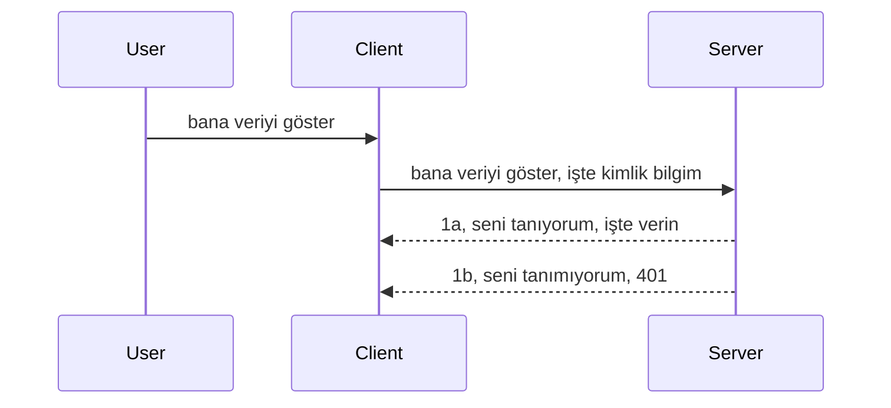

# Basit kimlik doğrulama

MCP SDK'ları, adaletli olmak gerekirse, kimlik sunucusu, kaynak sunucusu, kimlik bilgilerini gönderme, kod alma, kodu taşıyıcı token için değiştirme gibi kavramları içeren oldukça karmaşık bir süreç olan OAuth 2.1 kullanımını destekler; sonunda kaynak verilerinize erişebilirsiniz. Eğer harika bir uygulama olan OAuth'a alışık değilseniz, temel bir kimlik doğrulama ile başlayıp daha iyi ve daha iyi güvenlik inşa etmek iyi bir fikirdir. Bu nedenle, bu bölüm var, sizi daha gelişmiş kimlik doğrulamaya hazırlamak için.

## Kimlik doğrulama, ne demek istiyoruz?

Auth, kimlik doğrulama ve yetkilendirme kelimelerinin kısaltmasıdır. Düşüncemiz şu iki şeyi yapmamız gerektiğidir:

- **Kimlik doğrulama (Authentication)**, bir kişinin evimize girip girmesine izin verip vermeyeceğimizi belirleme, yani "burada" olmaya hakkı olup olmadığını anlamak; yani MCP Sunucumuzun özelliklerinin bulunduğu kaynak sunucumuza erişim hakkı olup olmadığını tespit etme sürecidir.
- **Yetkilendirme (Authorization)**, bir kullanıcının talep ettiği belirli kaynaklara erişimi (örneğin, bu siparişlere veya bu ürünlere) olup olmadığını ya da başka bir örnek olarak içeriği okuyabilir ama silemez gibi kısıtlamalarının olup olmadığını belirleme sürecidir.

## Kimlik bilgileri: Sisteme kim olduğumuzu nasıl bildiriyoruz?

Çoğu web geliştiricisi genellikle bir kimlik bilgisini sunucuya sağlamayı düşünür, genellikle buraya erişim izni varsa bunu belirten bir gizli bilgi ("Authentication"). Bu kimlik bilgisi genellikle kullanıcı adı ve şifrenin base64 kodlanmış versiyonu ya da belirli bir kullanıcıyı benzersiz olarak tanımlayan bir API anahtarıdır.

Bu, "Authorization" adlı bir başlık ile gönderilir:

```json
{ "Authorization": "secret123" }
```

Genellikle temel kimlik doğrulama olarak adlandırılır. Genel akış şöyle işler:



Akış açısından nasıl çalıştığını anladıktan sonra, bunu nasıl uygularız? Çoğu web sunucusunda middleware adında bir kavram bulunur; bu, isteğin bir parçası olarak çalışan, kimlik bilgilerini doğrulayabilen ve geçerli ise isteğin geçmesine izin veren bir kod parçasıdır. Kimlik bilgileri geçerli değilse, bir kimlik doğrulama hatası alırsınız. Şimdi bunu nasıl uygulayabileceğimize bakalım:

**Python**

```python
class AuthMiddleware(BaseHTTPMiddleware):
    async def dispatch(self, request, call_next):

        has_header = request.headers.get("Authorization")
        if not has_header:
            print("-> Missing Authorization header!")
            return Response(status_code=401, content="Unauthorized")

        if not valid_token(has_header):
            print("-> Invalid token!")
            return Response(status_code=403, content="Forbidden")

        print("Valid token, proceeding...")
       
        response = await call_next(request)
        # herhangi bir özel başlık ekleyin veya yanıtta herhangi bir şekilde değişiklik yapın
        return response


starlette_app.add_middleware(CustomHeaderMiddleware)
```

Burada:

- `AuthMiddleware` adlı bir middleware oluşturduk ve `dispatch` yöntemi web sunucusu tarafından çağrılıyor.
- Middleware'i web sunucusuna ekledik:

    ```python
    starlette_app.add_middleware(AuthMiddleware)
    ```

- Authorization başlığının varlığını ve gönderilen gizliliğin geçerliği kontrol eden doğrulama mantığını yazdık:

    ```python
    has_header = request.headers.get("Authorization")
    if not has_header:
        print("-> Missing Authorization header!")
        return Response(status_code=401, content="Unauthorized")

    if not valid_token(has_header):
        print("-> Invalid token!")
        return Response(status_code=403, content="Forbidden")
    ```

    gizlilik var ve geçerliyse, isteğin geçmesine izin veriyoruz ve `call_next` çağırıp yanıtı döndürüyoruz.

    ```python
    response = await call_next(request)
    # yanıt üzerinde herhangi bir müşteri başlığı ekleyin veya bir şekilde değişiklik yapın
    return response
    ```

Çalışma şekli şudur: web isteği sunucuya yapıldığında, middleware çağrılır ve uygulamasına göre isteğin geçmesine izin verir veya istemcinin devam etmesine izin verilmediğini belirten bir hata döndürür.

**TypeScript**

Burada popüler Express framework'ü ile bir middleware oluşturup isteği MCP Sunucusuna ulaşmadan önce yakalıyoruz. İşte kod:

```typescript
function isValid(secret) {
    return secret === "secret123";
}

app.use((req, res, next) => {
    // 1. Yetkilendirme başlığı var mı?
    if(!req.headers["Authorization"]) {
        res.status(401).send('Unauthorized');
    }
    
    let token = req.headers["Authorization"];

    // 2. Geçerliliği kontrol et.
    if(!isValid(token)) {
        res.status(403).send('Forbidden');
    }

   
    console.log('Middleware executed');
    // 3. İsteği istek hattındaki bir sonraki adıma geçir.
    next();
});
```

Bu kodda:

1. İlk olarak Authorization başlığının var olup olmadığını kontrol ediyoruz, yoksa 401 hata gönderiyoruz.
2. Kimlik bilgisi/token geçerli değilse 403 hata gönderiyoruz.
3. Son olarak isteği istek hattında geçiyoruz ve istenen kaynağı döndürüyoruz.

## Alıştırma: Kimlik doğrulama uygulaması

Bilgimizi alıp uygulamaya koymaya çalışalım. Plan:

Sunucu

- Bir web sunucusu ve MCP örneği oluştur.
- Sunucu için middleware uygula.

İstemci 

- Kimlik bilgisi içeren web isteğini başlık üzerinden gönder.

### -1- Bir web sunucusu ve MCP örneği oluştur

> **İleriye bakış:** Aşağıdaki TypeScript örneği, **MCP Spesifikasyonu 2025-11-25** uyarınca `mcp-session-id` anahtarlı `transports` haritasında HTTP taşıyıcılarını takip eder. `2026-07-28` sürüm adayı, `initialize` el sıkışmasını ve oturum kimliğini tamamen kaldırır, böylece bu oturum başına taşıyıcı haritası, durumsuz, kendi kendine yeten isteklere geçilir. Ayrıntılar için bkz. [MCP'deki Değişiklikler: 2026-07-28 Sürüm Adayı](../../01-CoreConcepts/mcp-2026-07-28-release-candidate.md).

İlk adımda web sunucu örneğini ve MCP Sunucusunu oluşturmamız gerekiyor.

**Python**

Burada bir MCP sunucu örneği oluşturuyoruz, starlette web uygulaması oluşturuyoruz ve uvicorn ile çalıştırıyoruz.

```python
# MCP Sunucusu oluşturuluyor

app = FastMCP(
    name="MCP Resource Server",
    instructions="Resource Server that validates tokens via Authorization Server introspection",
    host=settings["host"],
    port=settings["port"],
    debug=True
)

# starlette web uygulaması oluşturuluyor
starlette_app = app.streamable_http_app()

# uygulama uvicorn ile servis ediliyor
async def run(starlette_app):
    import uvicorn
    config = uvicorn.Config(
            starlette_app,
            host=app.settings.host,
            port=app.settings.port,
            log_level=app.settings.log_level.lower(),
        )
    server = uvicorn.Server(config)
    await server.serve()

run(starlette_app)
```

Bu kodda:

- MCP Sunucusunu oluşturduk.
- MCP Sunucusundan bir starlette web uygulaması oluşturduk, `app.streamable_http_app()`.
- uvicorn ile web uygulamasını barındırıp sunuyoruz, `server.serve()`.

**TypeScript**

Burada bir MCP Sunucu örneği oluşturuyoruz.

```typescript
const server = new McpServer({
      name: "example-server",
      version: "1.0.0"
    });

    // ... sunucu kaynaklarını, araçlarını ve istemleri kur ...
```

Bu MCP Sunucu oluşturma, POST /mcp rota tanımımız içinde gerçekleşmek zorunda, o yüzden yukarıdaki kodu şöyle taşıyalım:

```typescript
import express from "express";
import { randomUUID } from "node:crypto";
import { McpServer } from "@modelcontextprotocol/sdk/server/mcp.js";
import { StreamableHTTPServerTransport } from "@modelcontextprotocol/sdk/server/streamableHttp.js";
import { isInitializeRequest } from "@modelcontextprotocol/sdk/types.js"

const app = express();
app.use(express.json());

// Oturum ID'sine göre taşıma araçlarını saklamak için harita
const transports: { [sessionId: string]: StreamableHTTPServerTransport } = {};

// İstemciden sunucuya iletişim için POST isteklerini işleme
app.post('/mcp', async (req, res) => {
  // Mevcut oturum ID'sini kontrol et
  const sessionId = req.headers['mcp-session-id'] as string | undefined;
  let transport: StreamableHTTPServerTransport;

  if (sessionId && transports[sessionId]) {
    // Mevcut taşıma aracını yeniden kullan
    transport = transports[sessionId];
  } else if (!sessionId && isInitializeRequest(req.body)) {
    // Yeni başlatma isteği
    transport = new StreamableHTTPServerTransport({
      sessionIdGenerator: () => randomUUID(),
      onsessioninitialized: (sessionId) => {
        // Taşıma aracını oturum ID'sine göre sakla
        transports[sessionId] = transport;
      },
      // DNS yeniden bağlama koruması, geriye dönük uyumluluk için varsayılan olarak devre dışı bırakılmıştır. Bu sunucuyu
      // yerel olarak çalıştırıyorsanız, şunu ayarladığınızdan emin olun:
      // enableDnsRebindingProtection: true,
      // allowedHosts: ['127.0.0.1'],
    });

    // Taşıma aracı kapandığında temizle
    transport.onclose = () => {
      if (transport.sessionId) {
        delete transports[transport.sessionId];
      }
    };
    const server = new McpServer({
      name: "example-server",
      version: "1.0.0"
    });

    // ... sunucu kaynakları, araçları ve istemleri ayarla ...

    // MCP sunucusuna bağlan
    await server.connect(transport);
  } else {
    // Geçersiz istek
    res.status(400).json({
      jsonrpc: '2.0',
      error: {
        code: -32000,
        message: 'Bad Request: No valid session ID provided',
      },
      id: null,
    });
    return;
  }

  // İsteği işleme
  await transport.handleRequest(req, res, req.body);
});

// GET ve DELETE istekleri için yeniden kullanılabilir işlemci
const handleSessionRequest = async (req: express.Request, res: express.Response) => {
  const sessionId = req.headers['mcp-session-id'] as string | undefined;
  if (!sessionId || !transports[sessionId]) {
    res.status(400).send('Invalid or missing session ID');
    return;
  }
  
  const transport = transports[sessionId];
  await transport.handleRequest(req, res);
};

// SSE aracılığıyla sunucudan istemciye bildirimler için GET isteklerini işleme
app.get('/mcp', handleSessionRequest);

// Oturum sonlandırma için DELETE isteklerini işleme
app.delete('/mcp', handleSessionRequest);

app.listen(3000);
```

Gördüğünüz gibi, MCP Sunucu oluşturma `app.post("/mcp")` içine taşındı.

Şimdi, gelen kimlik bilgisini doğrulayacak middleware oluşturmaya geçelim.

### -2- Sunucu için middleware uygula

Middleware kısmına geçelim. Burada `Authorization` başlığında bir kimlik bilgisi arayan ve bunu doğrulayan bir middleware oluşturacağız. Kabul edilebilirse istek yapmak istediği işlem (araçları listeleme, kaynak okuma veya istemcinin istediği MCP işlevi) için ilerleyecek.

**Python**

Middleware oluşturmak için `BaseHTTPMiddleware` sınıfından türeyen bir sınıf yaratmalıyız. İki önemli parça var:

- İstek, `request`, başlık bilgisini buradan okuyoruz.
- `call_next`, eğer istemci geçerli bir kimlik bilgisi getirmişse çağırmamız gereken geri çağırma.

Öncelikle `Authorization` başlığı yoksa ne olacağını halletmemiz gerekiyor:

```python
has_header = request.headers.get("Authorization")

# başlık yok, 401 ile başarısız ol, aksi takdirde devam et.
if not has_header:
    print("-> Missing Authorization header!")
    return Response(status_code=401, content="Unauthorized")
```

Burada istemcinin kimlik doğrulaması başarısız olduğunda 401 yetkisiz mesajı gönderiyoruz.

Sonra, eğer kimlik bilgisi gönderilmişse geçerliliğini şöyle kontrol ediyoruz:

```python
 if not valid_token(has_header):
    print("-> Invalid token!")
    return Response(status_code=403, content="Forbidden")
```

Yukarıda 403 yasak mesajı gönderiyoruz. Tam middleware şu şekilde, yukarıda bahsettiğimiz her şeyi uyguluyor:

```python
class AuthMiddleware(BaseHTTPMiddleware):
    async def dispatch(self, request, call_next):

        has_header = request.headers.get("Authorization")
        if not has_header:
            print("-> Missing Authorization header!")
            return Response(status_code=401, content="Unauthorized")

        if not valid_token(has_header):
            print("-> Invalid token!")
            return Response(status_code=403, content="Forbidden")

        print("Valid token, proceeding...")
        print(f"-> Received {request.method} {request.url}")
        response = await call_next(request)
        response.headers['Custom'] = 'Example'
        return response

```

Peki `valid_token` fonksiyonu ne durumda? İşte aşağıda:

```python
# Üretim için kullanmayın - geliştirin !!
def valid_token(token: str) -> bool:
    # "Bearer " önekini kaldırın
    if token.startswith("Bearer "):
        token = token[7:]
        return token == "secret-token"
    return False
```

Bu elbette geliştirilmeli.

ÖNEMLİ: Bu tür gizli değerler hiçbir zaman koda gömülmemelidir. Değer ideal olarak bir veri kaynağından ya da bir kimlik sağlayıcıdan (IDP) alınmalı ya da en iyisi doğrulama tamamen IDP tarafından yapılmalıdır.

**TypeScript**

Express ile bunu uygulamak için, middleware fonksiyonlarını alan `use` yöntemini çağırmalıyız.

- İstek değişkeni ile etkileşim kurup `Authorization` özelliğinde geçen kimlik bilgisi kontrol edilir.
- Kimlik bilgisi geçerliyse istek devam eder ve istemcinin MCP isteği yapması gereken iş yapılır (örneğin araçları listeleme, kaynak okuma veya diğer MCP ile ilgili işlemler).

Burada `Authorization` başlığının var olup olmadığını kontrol ediyoruz ve yoksa isteğin geçmesini engelliyoruz:

```typescript
if(!req.headers["authorization"]) {
    res.status(401).send('Unauthorized');
    return;
}
```

Başlık ilk başta gönderilmezse 401 alırsınız.

Sonra kimlik bilgisi geçerli mi diye kontrol ediyoruz, geçerli değilse farklı bir mesajla isteği durduruyoruz:

```typescript
if(!isValid(token)) {
    res.status(403).send('Forbidden');
    return;
} 
```

Şimdi 403 hata aldığınıza dikkat edin.

Tam kod şu:

```typescript
app.use((req, res, next) => {
    console.log('Request received:', req.method, req.url, req.headers);
    console.log('Headers:', req.headers["authorization"]);
    if(!req.headers["authorization"]) {
        res.status(401).send('Unauthorized');
        return;
    }
    
    let token = req.headers["authorization"];

    if(!isValid(token)) {
        res.status(403).send('Forbidden');
        return;
    }  

    console.log('Middleware executed');
    next();
});
```

Web sunucusunu, istemcinin göndermesini umduğumuz kimlik bilgisini kontrol eden bir middleware kabul edecek şekilde ayarladık. İstemci tarafında ne yapıyoruz?

### -3- Başlık üzerinden kimlik bilgisi içeren web isteği gönder

İstemcinin kimlik bilgisini başlık üzerinden ilettiğinden emin olmamız gerekiyor. MCP istemcisi kullanacağımız için bunu nasıl yapacağımızı bulmalıyız.

**Python**

İstemci için kimlik bilgimizi içeren başlığı şöyle geçmeliyiz:

```python
# DEĞERİ sabit kodlama, en azından bir ortam değişkeninde veya daha güvenli bir depolama alanında tut
token = "secret-token"

async with streamablehttp_client(
        url = f"http://localhost:{port}/mcp",
        headers = {"Authorization": f"Bearer {token}"}
    ) as (
        read_stream,
        write_stream,
        session_callback,
    ):
        async with ClientSession(
            read_stream,
            write_stream
        ) as session:
            await session.initialize()
      
            # YAPILACAK, istemcide ne yapılmasını istediğin, örn. araçları listele, araçları çağır vb.
```

`headers = {"Authorization": f"Bearer {token}"}` şeklinde `headers` özelliğinin doldurulduğuna dikkat edin.

**TypeScript**

Bunu iki adımda çözebiliriz:

1. Kimlik bilgilerimizi içeren bir konfigürasyon nesnesi oluştur.
2. Bu konfigürasyonu taşıyıcıya (transport) geç.

```typescript

// Burada gösterildiği gibi değeri sabit kodlama YAPMAYIN. En azından bir ortam değişkeni olarak tutun ve geliştirme modunda dotenv gibi bir şey kullanın.
let token = "secret123"

// bir istemci taşıma seçenekleri nesnesi tanımlayın
let options: StreamableHTTPClientTransportOptions = {
  sessionId: sessionId,
  requestInit: {
    headers: {
      "Authorization": "secret123"
    }
  }
};

// seçenekler nesnesini taşıma fonksiyonuna geçirin
async function main() {
   const transport = new StreamableHTTPClientTransport(
      new URL(serverUrl),
      options
   );
```

Burada, üstte `options` nesnesi oluşturduk ve başlıklarımızı `requestInit` altında yerleştirdik.

ÖNEMLİ: Buradan nasıl geliştiririz? Şu anki uygulamada bazı sorunlar var. Öncelikle, böyle bir kimlik bilgisi geçirmek oldukça risklidir, minimum HTTPS olmadan hiç önerilmez. Olsa bile kimlik bilgisi çalınabilir; bu yüzden token iptal edilebilmeli ve ek kontroller eklenmeli (token nereden geliyor, istek çok sık mı geliyor (bot benzeri davranış), kısaca pek çok endişe var).

Yine de, kimliği doğrulanmamış kimsenin API'nizi çağırmasını istemediğiniz çok basit API'ler için burada iyi bir başlangıç var.

Bunu söyledikten sonra, güvenliği biraz sertleştirmek için JSON Web Token, diğer adıyla JWT veya "JOT" tokenları gibi standart bir format kullanmayı deneyelim.

## JSON Web Tokenlar, JWT

Yani, çok basit kimlik bilgileri gönderme işini iyileştirmeye çalışıyoruz. JWT kabul ettiğimizde ne tür doğrudan geliştirmeler elde ediyoruz?

- **Güvenlik geliştirmeleri**. Temel doğrulamada kullanıcı adı ve şifre base64 kodlu token olarak (ya da API anahtarı olarak) sürekli gönderilir, bu riski artırır. JWT'de kullanıcı adı ve şifre gönderilir ve karşılığında bir token alınır; ayrıca zaman sınırı vardır, yani süresi dolacaktır. JWT, rollere, kapsam ve izinlere dayalı ince taneli erişim kontrolü sağlar.
- **Durumsuzluk ve ölçeklenebilirlik**. JWT'ler kendi kendine yeterlidir, tüm kullanıcı bilgilerini taşır ve sunucu tarafında oturum depolama ihtiyacını ortadan kaldırır. Token yerelde de doğrulanabilir.
- **Etkileşebilirlik ve federasyon**. JWT, Open ID Connect'in merkezindedir ve Entra ID, Google Identity ve Auth0 gibi bilinen kimlik sağlayıcılarla kullanılır. Tek oturum açma ve daha fazlasını mümkün kılarak kurumsal düzeyde kullanım sağlar.
- **Modülerlik ve esneklik**. JWT, Azure API Management, NGINX gibi API Ağ Geçitleriyle kullanılabilir. Ayrıca kullanıcı doğrulama senaryolarını ve sunucudan hizmete iletişim senaryolarını (temsil ve delege etme dahil) destekler.
- **Performans ve önbellekleme**. JWT çözüldükten sonra önbelleğe alınabilir, böylece ayrıştırma ihtiyacı azalır. Özellikle yüksek trafikli uygulamalarda verimliliği artırır ve altyapı yükünü azaltır.
- **Gelişmiş özellikler**. Sunucuda geçerliliği kontrol etme (introspection) ve token iptali (revocation) destekler.

Tüm bu avantajlarla uygulamamızı nasıl ileri taşıyabileceğimize bakalım.

## Temel kimlik doğrulamayı JWT'ye dönüştürmek

Yapmamız gereken değişiklikler genel olarak:

- **JWT token oluşturmayı öğrenmek** ve istemciden sunucuya gönderime hazır hale getirmek.
- **JWT token doğrulamak**, eğer geçerliyse istemciye kaynaklarımızı vermek.
- **Token güvenli depolama**. Token'ı nasıl sakladığımız.
- **Rotaları koruma**. Rotaları, bizim durumumuzda MCP özelliklerini korumak.
- **Yenileme tokenları eklemek**. Kısa ömürlü tokenlar yaratmak, uzun ömürlü yenileme tokenları ile yenilenmesini sağlamak. Ayrıca yenileme noktası ve rotasyon stratejisi olmalı.

### -1- JWT token oluşturma

Öncelikle bir JWT token şu parçalardan oluşur:

- **header**, kullanılan algoritma ve token türü.
- **payload**, talepler, mesela sub (tokenin temsil ettiği kullanıcı veya varlık, genelde kullanıcı id'si), exp (sona erme zamanı) role (rolü)
- **signature**, gizli veya özel anahtarla imzalanır.

Bunun için header, payload ve kodlanmış token oluşturacağız.

**Python**

```python

import jwt
import jwt
from jwt.exceptions import ExpiredSignatureError, InvalidTokenError
import datetime

# JWT'yi imzalamak için kullanılan gizli anahtar
secret_key = 'your-secret-key'

header = {
    "alg": "HS256",
    "typ": "JWT"
}

# kullanıcı bilgisi ve beyanları ile son kullanma süresi
payload = {
    "sub": "1234567890",               # Konu (kullanıcı kimliği)
    "name": "User Userson",                # Özel beyan
    "admin": True,                     # Özel beyan
    "iat": datetime.datetime.utcnow(),# Veriliş zamanı
    "exp": datetime.datetime.utcnow() + datetime.timedelta(hours=1)  # Son kullanma zamanı
}

# kodla
encoded_jwt = jwt.encode(payload, secret_key, algorithm="HS256", headers=header)
```

Yukarıdaki kodda:

- HS256 algoritmasını ve token tipini JWT olarak belirten bir header tanımlandı.
- Bir konu veya kullanıcı id'si, kullanıcı adı, rol, veriliş zamanı ve süresi geçen bir payload oluşturuldu; böylece zaman sınırlaması sağlandı.

**TypeScript**

Burada JWT token yapmak için yardımcı olacak bazı bağımlılıklara ihtiyacımız var.

Bağımlılıklar

```sh

npm install jsonwebtoken
npm install --save-dev @types/jsonwebtoken
```

Bunu sağladıktan sonra header, payload oluşturalım ve kodlanmış token elde edelim.

```typescript
import jwt from 'jsonwebtoken';

const secretKey = 'your-secret-key'; // Üretimde çevresel değişkenleri kullanın

// Yük verisini tanımla
const payload = {
  sub: '1234567890',
  name: 'User usersson',
  admin: true,
  iat: Math.floor(Date.now() / 1000), // Veriliş zamanı
  exp: Math.floor(Date.now() / 1000) + 60 * 60 // 1 saat içinde sona erer
};

// Başlığı tanımla (isteğe bağlı, jsonwebtoken varsayılanları ayarlar)
const header = {
  alg: 'HS256',
  typ: 'JWT'
};

// Token oluştur
const token = jwt.sign(payload, secretKey, {
  algorithm: 'HS256',
  header: header
});

console.log('JWT:', token);
```

Bu token:

HS256 ile imzalanmış
1 saat geçerli
sub, name, admin, iat ve exp gibi talepleri içeren

### -2- Token doğrulama

Token doğrulamamız da gerekecek, bunu sunucu tarafında yapmalıyız ki istemcinin gönderdiği gerçekten geçerli olsun. Yapısal kontrollerden geçerliliğe kadar pek çok kontrol yapmalıyız. Kullanıcının sistemde olup olmadığını kontrol etmek gibi ek adımlar da yapmanız önerilir.

Token doğrulamak için kodunu çözmemiz, sonra geçerliliğini kontrol etmeye başlamamız gerekiyor:

**Python**

```python

# JWT'yi çöz ve doğrula
try:
    decoded = jwt.decode(token, secret_key, algorithms=["HS256"])
    print("✅ Token is valid.")
    print("Decoded claims:")
    for key, value in decoded.items():
        print(f"  {key}: {value}")
except ExpiredSignatureError:
    print("❌ Token has expired.")
except InvalidTokenError as e:
    print(f"❌ Invalid token: {e}")

```

Bu kodda, belirteci, gizli anahtarı ve seçilen algoritmayı giriş olarak kullanarak `jwt.decode` çağrısı yapıyoruz. Başarısız bir doğrulamanın hata oluşturmasına neden olması nedeniyle try-catch yapısını nasıl kullandığımıza dikkat edin.

**TypeScript**

Burada, belirtecin çözümlenmiş bir sürümünü almak için `jwt.verify` çağrısı yapmamız gerekir; böylece üzerinde daha fazla analiz yapabiliriz. Bu çağrı başarısız olursa, bu belirtecin yapısının yanlış olduğu veya artık geçerli olmadığı anlamına gelir.

```typescript

try {
  const decoded = jwt.verify(token, secretKey);
  console.log('Decoded Payload:', decoded);
} catch (err) {
  console.error('Token verification failed:', err);
}
```

NOT: Daha önce belirtildiği gibi, bu belirtecin sistemimizde bir kullanıcıya işaret ettiğinden ve kullanıcının iddia ettiği haklara sahip olduğundan emin olmak için ek kontroller yapmalıyız.

Şimdi, rol tabanlı erişim kontrolüne, diğer adıyla RBAC’a bakalım.

## Rol tabanlı erişim kontrolü ekleme

Fikir, farklı rollerin farklı izinlere sahip olduğunu ifade etmek istiyoruz. Örneğin, bir yöneticinin her şeyi yapabileceğini, normal bir kullanıcının okuma/yazma yapabileceğini ve bir misafirin sadece okuyabileceğini varsayıyoruz. Bu nedenle, işte bazı olası izin seviyeleri:

- Admin.Write  
- User.Read  
- Guest.Read  

Böyle bir kontrolü ara katman yazılımla nasıl uygulayabileceğimize bakalım. Ara katmanlar, rotaya özel veya tüm rotalar için eklenebilir.

**Python**

```python
from starlette.middleware.base import BaseHTTPMiddleware
from starlette.responses import JSONResponse
import jwt

# Gizli bilgiyi kodun içinde bulundurma, bu sadece gösterim amaçlıdır. Güvenli bir yerden oku.
SECRET_KEY = "your-secret-key" # bunu ortam değişkenine koy
REQUIRED_PERMISSION = "User.Read"

class JWTPermissionMiddleware(BaseHTTPMiddleware):
    async def dispatch(self, request, call_next):
        auth_header = request.headers.get("Authorization")
        if not auth_header or not auth_header.startswith("Bearer "):
            return JSONResponse({"error": "Missing or invalid Authorization header"}, status_code=401)

        token = auth_header.split(" ")[1]
        try:
            decoded = jwt.decode(token, SECRET_KEY, algorithms=["HS256"])
        except jwt.ExpiredSignatureError:
            return JSONResponse({"error": "Token expired"}, status_code=401)
        except jwt.InvalidTokenError:
            return JSONResponse({"error": "Invalid token"}, status_code=401)

        permissions = decoded.get("permissions", [])
        if REQUIRED_PERMISSION not in permissions:
            return JSONResponse({"error": "Permission denied"}, status_code=403)

        request.state.user = decoded
        return await call_next(request)


```

Aşağıdaki gibi ara katmanı eklemenin birkaç farklı yolu vardır:

```python

# Alt 1: starlette uygulaması oluşturulurken middleware ekle
middleware = [
    Middleware(JWTPermissionMiddleware)
]

app = Starlette(routes=routes, middleware=middleware)

# Alt 2: starlette uygulaması zaten oluşturulduktan sonra middleware ekle
starlette_app.add_middleware(JWTPermissionMiddleware)

# Alt 3: rota başına middleware ekle
routes = [
    Route(
        "/mcp",
        endpoint=..., # işleyici
        middleware=[Middleware(JWTPermissionMiddleware)]
    )
]
```

**TypeScript**

Tüm isteklerde çalışacak bir ara katman için `app.use` ve bir ara katman kullanabiliriz. 

```typescript
app.use((req, res, next) => {
    console.log('Request received:', req.method, req.url, req.headers);
    console.log('Headers:', req.headers["authorization"]);

    // 1. Yetkilendirme başlığının gönderilip gönderilmediğini kontrol edin

    if(!req.headers["authorization"]) {
        res.status(401).send('Unauthorized');
        return;
    }
    
    let token = req.headers["authorization"];

    // 2. Tokenın geçerli olup olmadığını kontrol edin
    if(!isValid(token)) {
        res.status(403).send('Forbidden');
        return;
    }  

    // 3. Token kullanıcısının sistemimizde var olup olmadığını kontrol edin
    if(!isExistingUser(token)) {
        res.status(403).send('Forbidden');
        console.log("User does not exist");
        return;
    }
    console.log("User exists");

    // 4. Tokenın doğru izinlere sahip olduğunu doğrulayın
    if(!hasScopes(token, ["User.Read"])){
        res.status(403).send('Forbidden - insufficient scopes');
    }

    console.log("User has required scopes");

    console.log('Middleware executed');
    next();
});

```

Ara katmanımızın yapabileceği ve YAPMASI GEREKEN birçok şey vardır, bunlar:

1. Yetkilendirme başlığının bulunup bulunmadığını kontrol etmek  
2. Belirtecin geçerli olup olmadığını kontrol etmek; `isValid` adlı, JWT belirtecinin bütünlüğünü ve geçerliliğini kontrol eden kendi yazdığımız metoda çağrı yapıyoruz.  
3. Kullanıcının sistemimizde var olduğunu doğrulamak; bunu kontrol etmeliyiz.  

   ```typescript
    // DB'deki kullanıcılar
   const users = [
     "user1",
     "User usersson",
   ]

   function isExistingUser(token) {
     let decodedToken = verifyToken(token);

     // YAPILACAK, kullanıcının DB'de var olup olmadığını kontrol et
     return users.includes(decodedToken?.name || "");
   }
   ```

   Yukarıda, basit bir `users` listesi oluşturduk, ki bu tabii ki bir veritabanında olması gerekir.

4. Ayrıca, belirtecin doğru izinlere sahip olup olmadığını kontrol etmeliyiz.

   ```typescript
   if(!hasScopes(token, ["User.Read"])){
        res.status(403).send('Forbidden - insufficient scopes');
   }
   ```

   Yukarıdaki ara katman kodunda, belirtecin User.Read izni içerip içermediğini kontrol ediyoruz; eğer değilse 403 hatası gönderiyoruz. Aşağıda `hasScopes` yardımcı metod var.

   ```typescript
   function hasScopes(scope: string, requiredScopes: string[]) {
     let decodedToken = verifyToken(scope);
    return requiredScopes.every(scope => decodedToken?.scopes.includes(scope));
  }
   ```

Have a think which additional checks you should be doing, but these are the absolute minimum of checks you should be doing.

Using Express as a web framework is a common choice. There are helpers library when you use JWT so you can write less code.

- `express-jwt`, helper library that provides a middleware that helps decode your token.
- `express-jwt-permissions`, this provides a middleware `guard` that helps check if a certain permission is on the token.

Here's what these libraries can look like when used:

```typescript
const express = require('express');
const jwt = require('express-jwt');
const guard = require('express-jwt-permissions')();

const app = express();
const secretKey = 'your-secret-key'; // put this in env variable

// Decode JWT and attach to req.user
app.use(jwt({ secret: secretKey, algorithms: ['HS256'] }));

// Check for User.Read permission
app.use(guard.check('User.Read'));

// multiple permissions
// app.use(guard.check(['User.Read', 'Admin.Access']));

app.get('/protected', (req, res) => {
  res.json({ message: `Welcome ${req.user.name}` });
});

// Error handler
app.use((err, req, res, next) => {
  if (err.code === 'permission_denied') {
    return res.status(403).send('Forbidden');
  }
  next(err);
});

```

Artık ara katmanın hem kimlik doğrulama hem de yetkilendirme için nasıl kullanılabileceğini gördünüz, peki MCP nasıl? MCP kimlik doğrulamamızı değiştirir mi? Bir sonraki bölümde öğrenelim.

### -3- MCP’ye RBAC ekleme

Şimdiye kadar ara katman yoluyla RBAC eklemeyi gördünüz, ancak MCP için özellik başı RBAC eklemenin kolay bir yolu yok, peki ne yaparız? İşte bu durumda istemcinin belirli bir aracı çağırma hakkına sahip olup olmadığını kontrol eden böyle bir kod eklememiz gerekir:

Özellik başı RBAC’ı nasıl sağlayacağınıza dair birkaç farklı seçenek var, işte bazıları:

- İzin seviyesini kontrol etmeniz gereken her araç, kaynak, istem için kontrol ekleyin.

   **python**

   ```python
   @tool()
   def delete_product(id: int):
      try:
          check_permissions(role="Admin.Write", request)
      catch:
        pass # istemci yetkilendirmeyi başaramadı, yetkilendirme hatası oluşturuldu
   ```

   **typescript**

   ```typescript
   server.registerTool(
    "delete-product",
    {
      title: Delete a product",
      description: "Deletes a product",
      inputSchema: { id: z.number() }
    },
    async ({ id }) => {
      
      try {
        checkPermissions("Admin.Write", request);
        // yapılacak, id'yi productService ve uzak girişe gönder
      } catch(Exception e) {
        console.log("Authorization error, you're not allowed");  
      }

      return {
        content: [{ type: "text", text: `Deletected product with id ${id}` }]
      };
    }
   );
   ```


- Kontrol yapılması gereken yerlerin sayısını en aza indirmek için gelişmiş sunucu yaklaşımı ve istek işleyicilerini kullanın.

   **Python**

   ```python
   
   tool_permission = {
      "create_product": ["User.Write", "Admin.Write"],
      "delete_product": ["Admin.Write"]
   }

   def has_permission(user_permissions, required_permissions) -> bool:
      # user_permissions: kullanıcının sahip olduğu izinlerin listesi
      # required_permissions: aracın gerektirdiği izinlerin listesi
      return any(perm in user_permissions for perm in required_permissions)

   @server.call_tool()
   async def handle_call_tool(
     name: str, arguments: dict[str, str] | None
   ) -> list[types.TextContent]:
    # request.user.permissions kullanıcının izinlerinin listesi olarak varsayılır
     user_permissions = request.user.permissions
     required_permissions = tool_permission.get(name, [])
     if not has_permission(user_permissions, required_permissions):
        # "Aracı çağırma izniniz yok {name}" hatası oluştur
        raise Exception(f"You don't have permission to call tool {name}")
     # devam et ve aracı çağır
     # ...
   ```   
   

   **TypeScript**

   ```typescript
   function hasPermission(userPermissions: string[], requiredPermissions: string[]): boolean {
       if (!Array.isArray(userPermissions) || !Array.isArray(requiredPermissions)) return false;
       // Kullanıcının en az bir gerekli izni varsa true döndür
       
       return requiredPermissions.some(perm => userPermissions.includes(perm));
   }
  
   server.setRequestHandler(CallToolRequestSchema, async (request) => {
      const { params: { name } } = request;
  
      let permissions = request.user.permissions;
  
      if (!hasPermission(permissions, toolPermissions[name])) {
         return new Error(`You don't have permission to call ${name}`);
      }
  
      // devam et..
   });
   ```

   Not, ara katmanınızın çözümlenmiş bir belirteci istek nesnesinin user özelliğine atadığından emin olmanız gerekecek, böylece yukarıdaki kod basit olur.

### Özet

Genel olarak ve özellikle MCP için RBAC eklemeyi konuştuk, şimdi kavramları anladığınızdan emin olmak için kendi başınıza güvenlik uygulamayı deneme zamanı.

## Ödev 1: Temel kimlik doğrulama kullanarak bir MCP sunucusu ve MCP istemcisi oluşturun

Burada, başlıklar aracılığıyla kimlik bilgilerini gönderme konusunda öğrendiklerinizi kullanacaksınız.

## Çözüm 1

[Solution 1](./code/basic/README.md)

## Ödev 2: Ödev 1’deki çözümü JWT kullanacak şekilde yükseltin

İlk çözümü alın ama bu sefer geliştirelim.  

Basic Auth kullanmak yerine, JWT kullanalım.

## Çözüm 2

[Solution 2](./solution/jwt-solution/README.md)

## Meydan Okuma

"Add RBAC to MCP" bölümünde anlattığımız özellik başı RBAC’ı ekleyin.

## Özet

Umarım bu bölümde hiç güvenlik olmamasından temel güvenliğe, JWT’ye ve bunun MCP’ye nasıl eklenebileceğine kadar birçok şey öğrenmişsinizdir.

Özel JWT’lerle sağlam bir temel oluşturduk, ancak ölçeklendikçe standartlara dayalı bir kimlik modeli yöneliyoruz. Entra veya Keycloak gibi bir IdP benimsemek, belirteci oluşturma, doğrulama ve yaşam döngüsü yönetimini güvenilir bir platforma devretmemizi sağlar — böylece uygulama mantığı ve kullanıcı deneyimine odaklanabiliriz.

Bunun için daha [gelişmiş bir Entra bölümü](../../05-AdvancedTopics/mcp-security-entra/README.md) mevcut.

## Sonraki Adım

- Sonraki: [MCP Sunucularını Kurma](../12-mcp-hosts/README.md)

---

<!-- CO-OP TRANSLATOR DISCLAIMER START -->
**Feragatname**:
Bu belge, AI çeviri hizmeti [Co-op Translator](https://github.com/Azure/co-op-translator) kullanılarak çevrilmiştir. Doğruluk için çaba sarf etsek de, otomatik çevirilerin hata veya yanlışlık içerebileceğini lütfen unutmayınız. Orijinal belge, kendi dilinde yetkili kaynak olarak kabul edilmelidir. Kritik bilgiler için profesyonel insan çevirisi önerilir. Bu çevirinin kullanımı sonucu ortaya çıkabilecek yanlış anlamalardan veya yanlış yorumlamalardan sorumlu değiliz.
<!-- CO-OP TRANSLATOR DISCLAIMER END -->