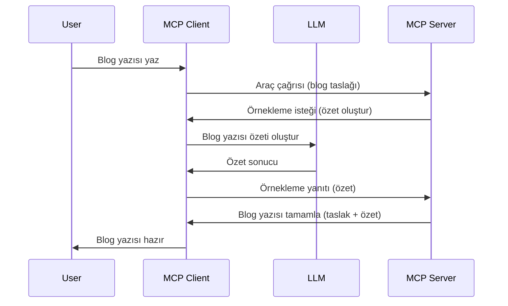

# Örnekleme - Özellikleri Müşteriye Devretme

> **Kullanımdan Kaldırma Uyarısı:** `2026-07-28` MCP spesifikasyon sürüm adayı, Örnekleme özelliğini doğrudan LLM sağlayıcı API'leri ile entegrasyon lehine kullanımdan kaldırılmış olarak işaretlemektedir. Örnekleme `2025-11-25` sürümünde ve resmi kullanımdan kaldırmanın ardından en az bir yıl boyunca çalışmaya devam etmektedir, bu yüzden bu dersteki her şey geçerliliğini korumaktadır — ancak yeni sunucu tasarımları yerine geçen deseni değerlendirmelidir. Detaylar için bkz. [MCP'de Neler Değişiyor: 2026-07-28 Sürüm Adayı](../../01-CoreConcepts/mcp-2026-07-28-release-candidate.md).

Bazen, ortak bir hedefe ulaşmak için MCP İstemcisi ve MCP Sunucusunun birlikte çalışması gerekir. Sunucunun, müşteride bulunan bir LLM'in yardımına ihtiyaç duyduğu durumlar olabilir. Bu durum için kullanmanız gereken yöntem örneklemedir.

Şimdi bazı kullanım senaryolarını ve örneklemeyi içeren bir çözüm nasıl inşa edilir inceleyelim.

## Genel Bakış

Bu derste, Örneklemenin ne zaman ve nerede kullanılacağını ve nasıl yapılandırılacağını açıklamaya odaklanacağız.

## Öğrenme Hedefleri

Bu bölümde:

- Örneklemenin ne olduğunu ve ne zaman kullanılacağını anlatacağız.
- Örneklemenin MCP'de nasıl yapılandırılacağını göstereceğiz.
- Örneklemenin uygulamada nasıl çalıştığına dair örnekler sunacağız.

## Örnekleme Nedir ve Neden Kullanılır?

Örnekleme, aşağıdaki şekilde çalışan gelişmiş bir özelliktir:



### Örnekleme isteği

Tamam, şimdi gerçekçi bir senaryonun genel görünümünü elde ettik, sunucunun istemciye gönderdiği örnekleme isteğinden bahsedelim. Böyle bir istek JSON-RPC formatında şöyle görünebilir:

```json
{
  "jsonrpc": "2.0",
  "id": 1,
  "method": "sampling/createMessage",
  "params": {
    "messages": [
      {
        "role": "user",
        "content": {
          "type": "text",
          "text": "Create a blog post summary of the following blog post: <BLOG POST>"
        }
      }
    ],
    "modelPreferences": {
      "hints": [
        {
          "name": "claude-3-sonnet"
        }
      ],
      "intelligencePriority": 0.8,
      "speedPriority": 0.5
    },
    "systemPrompt": "You are a helpful assistant.",
    "maxTokens": 100
  }
}
```

Burada belirtmeye değer birkaç şey var:

- Prompt, content -> text altında, LLM'e blog yazısı içeriğini özetlemesi için verilen talimatımızdır.

- **modelPreferences**. Bu kısım tam da adı gibi, bir tercih, LLM ile hangi yapılandırmanın kullanılacağını önerir. Kullanıcı bu önerilere uyabilir veya onları değiştirebilir. Bu durumda kullanılan model ve hız ile zeka önceliği hakkında öneriler vardır.
- **systemPrompt**, bu normal sistem istemcinizdir; LLM'inize bir kişilik verir ve rehberlik talimatlarını içerir.
- **maxTokens**, bu görev için kullanılması önerilen maksimum token sayısını belirtmek için kullanılan başka bir özelliktir.

### Örnekleme yanıtı

Bu yanıt, MCP İstemcisinin MCP Sunucusuna geri gönderdiği ve istemcinin LLM'i çağırıp yanıtı bekledikten sonra oluşturduğu mesajdır. JSON-RPC'de şöyle görünebilir:

```json
{
  "jsonrpc": "2.0",
  "id": 1,
  "result": {
    "role": "assistant",
    "content": {
      "type": "text",
      "text": "Here's your abstract <ABSTRACT>"
    },
    "model": "gpt-5",
    "stopReason": "endTurn"
  }
}
```

Yanıtın blog yazısının özetinden oluştuğuna dikkat edin, tam da istediğimiz gibi. Ayrıca kullanılan `model`'in bizden istenen değil "gpt-5" olması, "claude-3-sonnet" yerine tercih edilmiş olması dikkat çekici. Bu, kullanıcının ne kullanılacağına kararında değişiklik yapabileceğini ve örnekleme isteğinizin sadece bir öneri olduğunu göstermektedir.

Tamam, ana akışı ve kullanılabilecek faydalı görevi "blog yazısı oluşturma + özet" olarak anladığımıza göre, çalışması için neler yapmamız gerektiğine bakalım.

### Mesaj Tipleri

Örnekleme mesajları sadece metinle sınırlı değildir, aynı zamanda resim ve ses de gönderilebilir. JSON-RPC'deki fark şöyle görülür:

**Metin**

```json
{
  "type": "text",
  "text": "The message content"
}
```

**Resim içeriği**

```json
{
  "type": "image",
  "data": "base64-encoded-image-data",
  "mimeType": "image/jpeg"
}
```

**Ses içeriği**

```json
{
  "type": "audio",
  "data": "base64-encoded-audio-data",
  "mimeType": "audio/wav"
}
```

> NOT: Örnekleme hakkında daha detaylı bilgi için [resmi dokümanlara](https://modelcontextprotocol.io/specification/2025-11-25/client/sampling) bakabilirsiniz.

## İstemcide Örnekleme Nasıl Yapılandırılır

> Not: sadece bir sunucu inşa ediyorsanız, burada çok bir şey yapmanıza gerek yoktur.

Bir istemcide, aşağıdaki özelliği şu şekilde belirtmeniz gerekir:

```json
{
  "capabilities": {
    "sampling": {}
  }
}
```

Bu, seçtiğiniz istemci sunucu ile başlatılırken otomatik olarak tanınacaktır.

## Örnekleme Uygulaması Örneği - Bir Blog Yazısı Oluşturma

Bir örnekleme sunucusu kodlayalım, aşağıdakileri yapmamız gerekiyor:

1. Sunucuda bir araç oluşturun.
1. Bu araç bir örnekleme isteği oluşturmalı.
1. Araç, istemcinin örnekleme isteğine yanıt vermesini beklemeli.
1. Sonra araç sonucu üretilmeli.

Adım adım koda bakalım:

### -1- Aracı oluştur

**python**

```python
@mcp.tool()
async def create_blog(title: str, content: str, ctx: Context[ServerSession, None]) -> str:
    """Create a blog post and generate a summary"""

```

### -2- Bir örnekleme isteği oluştur

Aracınızı şu kod ile genişletin:

**python**

```python
post = BlogPost(
        id=len(posts) + 1,
        title=title,
        content=content,
        abstract=""
    )

prompt = f"Create an abstract of the following blog post: title: {title} and draft: {content} "

result = await ctx.session.create_message(
        messages=[
            SamplingMessage(
                role="user",
                content=TextContent(type="text", text=prompt),
            )
        ],
        max_tokens=100,
)

```

### -3- Yanıtı bekle ve yanıtı geri döndür

**python**

```python
post.abstract = result.content.text

posts.append(post)

# tam ürünü döndür
return json.dumps({
    "id": post.title,
    "abstract": post.abstract
})
```

### -4- Tam kod

**python**

```python
from starlette.applications import Starlette
from starlette.routing import Mount, Host

from mcp.server.fastmcp import Context, FastMCP

from mcp.server.session import ServerSession
from mcp.types import SamplingMessage, TextContent

import json


from uuid import uuid4
from typing import List
from pydantic import BaseModel


mcp = FastMCP("Blog post generator")

# app = FastAPI()

posts = []

class BlogPost(BaseModel):
    id: int
    title: str
    content: str
    abstract: str

posts: List[BlogPost] = []

@mcp.tool()
async def create_blog(title: str, content: str, ctx: Context[ServerSession, None]) -> str:
    """Create a blog post and generate a summary"""

    post = BlogPost(
        id=len(posts) + 1,
        title=title,
        content=content,
        abstract=""
    )

    prompt = f"Create an abstract of the following blog post: title: {title} and draft: {content} "

    result = await ctx.session.create_message(
        messages=[
            SamplingMessage(
                role="user",
                content=TextContent(type="text", text=prompt),
            )
        ],
        max_tokens=100,
    )

    post.abstract = result.content.text

    posts.append(post)

    # tam blog gönderisini döndür
    return json.dumps({
        "id": post.title,
        "abstract": post.abstract
    })

if __name__ == "__main__":
    print("Starting server...")
    # mcp.run()
    mcp.run(transport="streamable-http")

# uygulamayı çalıştırmak için: python server.py
```

### -5- Visual Studio Code'da test etme

Visual Studio Code'da test etmek için şu adımları uygulayın:

1. Terminalde sunucuyu başlatın.
1. *mcp.json* dosyasına ekleyin (ve sunucunun çalıştığından emin olun), örneğin şöyle:

   ```json
   "servers": {
      "blog-server": {
        "type": "http",
        "url": "http://localhost:8000/mcp"
      }
   }
   ```

1. Bir istem yazın:

   ```text
   create a blog post named "Where Python comes from", the content is "Python is actually named after Monty Python Flying Circus"
   ```

1. Örneklemenin gerçekleşmesine izin verin. Bunu ilk kez test ettiğinizde kabul etmeniz gereken ek bir iletişim kutusu çıkacak, ardından araç çalıştırmanız için normal iletişim kutusu gösterilecek.

1. Sonuçları inceleyin. Sonuçları GitHub Copilot Chat'de güzelce render edilmiş halde göreceksiniz ama aynı zamanda ham JSON yanıtını da inceleyebilirsiniz.

**Bonus**. Visual Studio Code araçları örneklemeyi çok iyi destekler. Kurulu sunucunuza ait Örnekleme erişimini şu şekilde yapılandırabilirsiniz:

1. Eklenti bölümüne gidin.
1. "MCP SUNUCULARI - KURULU" bölümünde kurulu sunucunuzun dişli ikonuna tıklayın.
1. "Model Erişimini Yapılandır" seçeneğini seçin, burada GitHub Copilot'un örnekleme yaparken hangi Modelleri kullanabileceğini belirleyebilirsiniz. Ayrıca "Örnekleme isteklerini göster" seçeneğiyle son örnekleme taleplerini görebilirsiniz.

## Ödev

Bu ödevde, biraz farklı bir Örnekleme entegrasyonu oluşturacaksınız; bir ürün açıklaması üretimini destekleyen örnekleme. İşte senaryonuz:

**Senaryo**: E-ticaretin arka ofis çalışanı ürün açıklamalarını oluşturmakta çok zaman kaybediyor. Bu yüzden "create_product" isimli bir aracı "title" ve "keywords" argümanları ile çağırdığınızda, isteğe bağlı bir "description" alanını müşterideki LLM tarafından doldurulacak şekilde tam bir ürün oluşturacak bir çözüm kurmanız gerekiyor.

İP UCU: Bu sunucu ve aracını örnekleme isteği kullanarak nasıl oluşturacağınızı daha önce öğrendiklerinizden faydalanarak yapabilirsiniz.

## Çözüm

[Çözüm](./solution/README.md)

## Önemli Noktalar

Örnekleme, sunucunun LLM yardımına ihtiyaç duyduğunda görevi istemciye devretmesini sağlayan güçlü bir özelliktir.

## Sonraki Adım

- [Bölüm 4 - Pratik uygulama](../../04-PracticalImplementation/README.md)

---

<!-- CO-OP TRANSLATOR DISCLAIMER START -->
**Feragatname**:
Bu belge, AI çeviri hizmeti [Co-op Translator](https://github.com/Azure/co-op-translator) kullanılarak çevrilmiştir. Doğruluk için çaba sarf etsek de, otomatik çevirilerin hata veya yanlışlık içerebileceğini lütfen unutmayınız. Orijinal belge, kendi dilinde yetkili kaynak olarak kabul edilmelidir. Kritik bilgiler için profesyonel insan çevirisi önerilir. Bu çevirinin kullanımı sonucu ortaya çıkabilecek yanlış anlamalardan veya yanlış yorumlamalardan sorumlu değiliz.
<!-- CO-OP TRANSLATOR DISCLAIMER END -->