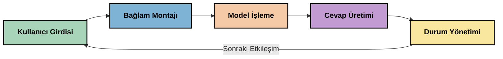
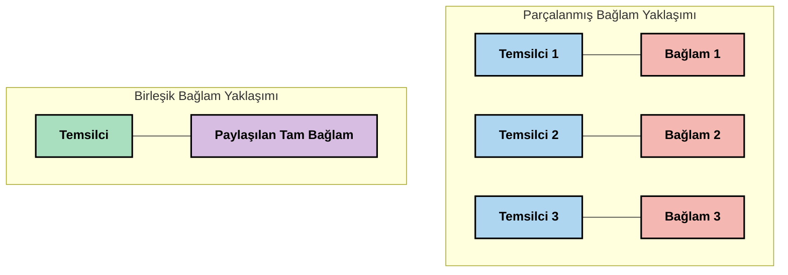
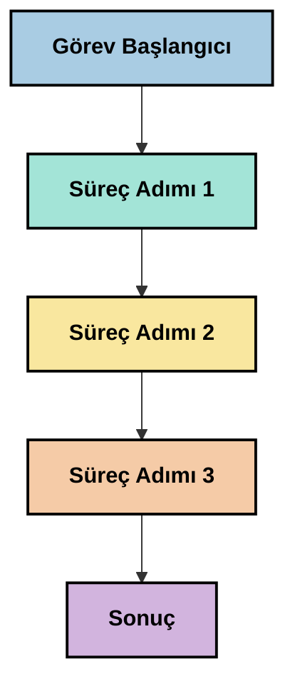
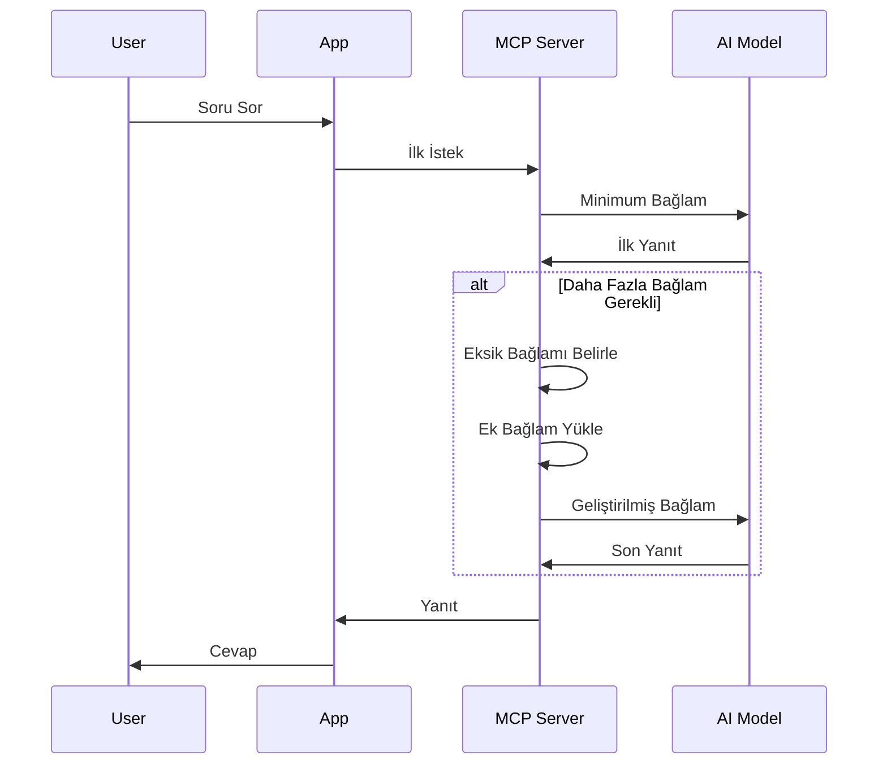
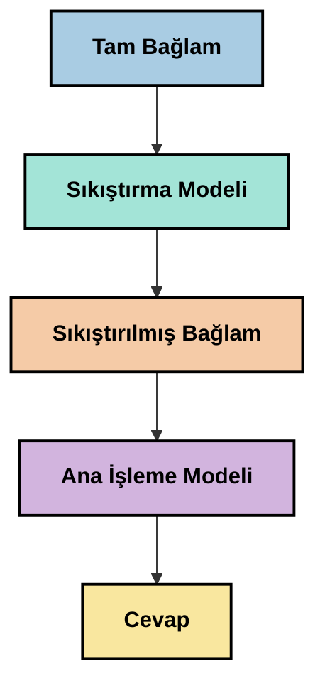
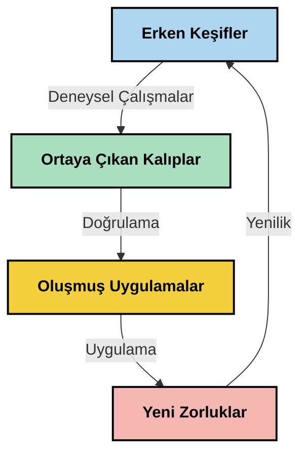

# Bağlam Mühendisliği: MCP Ekosisteminde Yeni Bir Kavram

## Genel Bakış

Bağlam mühendisliği, yapay zeka alanında, müşteriler ile yapay zeka servisleri arasındaki etkileşimlerde bilginin nasıl yapılandırıldığını, iletildiğini ve sürdürüldüğünü inceleyen yeni bir kavramdır. Model Bağlam Protokolü (MCP) ekosistemi geliştikçe, bağlamın etkin yönetimini anlamak giderek daha önemli hale gelir. Bu modülde, bağlam mühendisliği kavramı tanıtılmakta ve MCP uygulamalarındaki potansiyel kullanımları araştırılmaktadır.

## Öğrenme Hedefleri

Bu modülün sonunda şunları yapabileceksiniz:

- Bağlam mühendisliğinin ortaya çıkan kavramını ve MCP uygulamalarındaki potansiyel rolünü anlamak
- MCP protokol tasarımının ele aldığı bağlam yönetimindeki temel zorlukları belirlemek
- Daha iyi bağlam yönetimi yoluyla model performansını artırma tekniklerini keşfetmek
- Bağlam etkinliğini ölçme ve değerlendirme yaklaşımlarını düşünmek
- Bu yeni kavramları MCP çerçevesi aracılığıyla yapay zeka deneyimlerini iyileştirmek için uygulamak

## Bağlam Mühendisliğine Giriş

Bağlam mühendisliği, kullanıcılar, uygulamalar ve yapay zeka modelleri arasındaki bilgi akışının kasıtlı olarak tasarımı ve yönetimine odaklanan yeni bir kavramdır. İleri düzey alanlar olan prompt mühendisliği gibi yerleşik alanlardan farklı olarak, bağlam mühendisliği henüz uygulayıcılar tarafından yapay zeka modellerine doğru zamanda doğru bilgi sağlama konusundaki benzersiz zorlukları çözmek üzere tanımlanıyor.

Büyük dil modelleri (LLM) geliştikçe, bağlamın önemi giderek belirginleşmiştir. Sağladığımız bağlamın kalitesi, alakasına ve yapısına göre model çıktıları doğrudan etkilenir. Bağlam mühendisliği bu ilişkiyi inceler ve etkili bağlam yönetimi için prensipler geliştirmeyi amaçlar.

> "2025 yılında, mevcut modeller son derece zeki olacak. Ancak en akıllı insan bile, kendisinden isteneni bağlam olmadan etkili gerçekleştiremeyecek... 'Bağlam mühendisliği' prompt mühendisliğinin bir sonraki aşamasıdır. Bu, dinamik bir sistemde bunu otomatik olarak yapma işi." — Walden Yan, Cognition AI

Bağlam mühendisliği şöyle alanları kapsayabilir:

1. **Bağlam Seçimi**: Belirli bir görev için hangi bilginin alaka düzeyinde olduğunu belirlemek  
2. **Bağlam Yapılandırması**: Bilgiyi modelin anlayışını maksimize edecek şekilde düzenlemek  
3. **Bağlam İletimi**: Bilginin modellere ne zaman ve nasıl gönderileceğini optimize etmek  
4. **Bağlam Bakımı**: Zamana bağlı olarak bağlamın durumunu ve evrimini yönetmek  
5. **Bağlam Değerlendirmesi**: Bağlamın etkinliğini ölçmek ve geliştirmek  

Bu odak alanları, uygulamaların LLM'lere bağlam sağlaması için standartlaştırılmış bir yol sunan MCP ekosistemi için özellikle önemlidir.


## Bağlam Yolculuğu Perspektifi

Bağlam mühendisliğini görselleştirmenin bir yolu, bilgilerin MCP sistemi içinde aldığı yolculuğu takip etmektir:



### Bağlam Yolculuğundaki Temel Aşamalar:

1. **Kullanıcı Girişi**: Kullanıcıdan gelen ham bilgi (metin, resimler, belgeler)  
2. **Bağlam Birleştirme**: Kullanıcı girdisinin sistem bağlamı, sohbet geçmişi ve diğer alınan bilgilerle birleştirilmesi  
3. **Model İşleme**: Yapay zeka modelinin birleştirilmiş bağlamı işlemesi  
4. **Yanıt Üretimi**: Modelin verilen bağlama göre çıktı üretmesi  
5. **Durum Yönetimi**: Sistem etkileşim temelinde kendi iç durumunu güncellemesi  

Bu perspektif, yapay zeka sistemlerinde bağlamın dinamik doğasını vurgular ve her aşamada bilgiyi nasıl en iyi yönetebileceğimiz konusunda önemli sorular ortaya koyar.

## Bağlam Mühendisliğinde Ortaya Çıkan Prensipler

Bağlam mühendisliği alanı şekillenirken, uygulayıcılardan çıkmaya başlayan bazı erken prensipler vardır. Bu prensipler, MCP uygulamalarındaki seçimlere ışık tutabilir:

### Prensip 1: Bağlamı Tam Paylaşın

Bağlam, sistemin tüm bileşenleri arasında parçalanmak yerine eksiksiz paylaşılmalıdır. Bağlam dağıtıldığında, sistemin bir bölümünde alınan kararlar başka yerlerde alınanlarla çelişebilir.



MCP uygulamalarında bu, bağlamın tüm boru hattı boyunca kesintisiz akış sağlanacak şekilde sistemlerin tasarlanmasını önerir.

### Prensip 2: Eylemlerin Örtük Kararları Taşıdığını Kabul Edin

Modelin her eylemi, bağlamı nasıl yorumlayacağına dair örtük kararları taşır. Birden fazla bileşen farklı bağlamlarda hareket ettiğinde, bu örtük kararlar çelişebilir ve tutarsız sonuçlara yol açabilir.

Bu prensibin MCP uygulamaları açısından önemli sonuçları vardır:
- Parçalanmış bağlam ile paralel yürütme yerine karmaşık görevlerde ardışık işleme tercih edilir  
- Tüm karar noktalarının aynı bağlamsal bilgiye erişimi olmalıdır  
- Sonraki adımlar önceki kararların tam bağlamını görebilmelidir  

### Prensip 3: Bağlam Derinliği ile Pencere Sınırlamalarını Dengede Tutun

Sohbetler ve süreçler uzadıkça, bağlam pencereleri aşılır. Etkili bağlam mühendisliği, kapsamlı bağlam ile teknik sınırlamalar arasındaki bu gerilimi yönetme yaklaşımlarını araştırır.

Keşfedilen potansiyel yaklaşımlar arasında:
- Ana bilgiyi muhafaza eden, ancak token kullanımını azaltan bağlam sıkıştırma  
- Güncel ihtiyaçlara göre ilişkili bağlamın kademeli yüklenmesi  
- Önceki etkileşimlerin özetlenip önemli kararlar ve gerçeklerin korunması  

## Bağlam Zorlukları ve MCP Protokol Tasarımı

Model Bağlam Protokolü (MCP), bağlam yönetiminin eşsiz zorluklarını dikkate alarak tasarlandı. Bu zorlukları anlamak, MCP protokol tasarımının temel unsurlarını açıklamaya yardımcı olur:


### Zorluk 1: Bağlam Penceresi Sınırlamaları  
Çoğu yapay zeka modelinin sabit bağlam pencere boyutları vardır ve aynı anda işlem yapabileceği bilgi miktarını sınırlar.

**MCP Tasarım Yanıtı:**  
- Verimli referans verilebilen yapılandırılmış, kaynak tabanlı bağlam desteklenir  
- Kaynaklar sayfalandırılabilir ve aşamalı yüklenebilir  

### Zorluk 2: Alaka Düzeyinin Belirlenmesi  
Bağlama hangi bilginin dahil edileceğinin belirlenmesi zordur.

**MCP Tasarım Yanıtı:**  
- İhtiyaca göre dinamik bilgi getirilmesini sağlayan esnek araçlar  
- Tutarlı bağlam organizasyonu için yapılandırılmış promptlar  

### Zorluk 3: Bağlam Kalıcılığı  
Etkileşimler arasında durumu yönetmek, bağlamın dikkatli takibini gerektirir.

**MCP Tasarım Yanıtı:**  
- Standartlaştırılmış oturum yönetimi  
- Bağlam evrimi için net tanımlı etkileşim kalıpları  

### Zorluk 4: Çok Modlu Bağlam  
Farklı veri türleri (metin, görseller, yapılandırılmış veri) farklı işlem gerektirir.

**MCP Tasarım Yanıtı:**  
- Çeşitli içerik türlerini destekleyen protokol tasarımı  
- Çok modlu bilgilerin standart gösterimi  

### Zorluk 5: Güvenlik ve Gizlilik  
Bağlam genellikle korunması gereken hassas bilgiler içerir.

**MCP Tasarım Yanıtı:**  
- İstemci ve sunucu sorumlulukları arasında açık sınırlar  
- Veri maruziyetini azaltmak için yerel işlem seçenekleri  

Bu zorlukları ve MCP'nin bunları nasıl ele aldığını anlamak, gelişmiş bağlam mühendisliği tekniklerini keşfetmek için temel oluşturur.

## Ortaya Çıkan Bağlam Mühendisliği Yaklaşımları

Bağlam mühendisliği alanı geliştikçe, birkaç umut vadeden yaklaşım ortaya çıkmaktadır. Bunlar yerleşik en iyi uygulamalar değil, mevcut düşünce biçimini temsil etmekte olup MCP uygulamalarıyla deneyim kazandıkça evrilecektir.

### 1. Tek İş Parçacıklı Doğrusal İşleme

Bağlamı dağıtan çoklu ajan mimarilerinin aksine, bazı uygulayıcılar tek iş parçacıklı doğrusal işlemenin daha tutarlı sonuçlar ürettiğini buluyor. Bu, birleşik bağlamı koruma prensibiyle uyumludur.



Bu yaklaşım paralel işleme göre daha az verimli görünebilir ancak genellikle her adımın önceki kararları tam anlayışa dayanması nedeniyle daha tutarlı ve güvenilir sonuçlar üretir.

### 2. Bağlam Parçalama ve Önceliklendirme

Büyük bağlamların yönetilebilir parçalara bölünmesi ve en önemli kısımların önceliklendirilmesi

```python
# Kavramsal Örnek: Bağlam Parçalama ve Önceliklendirme
def process_with_chunked_context(documents, query):
    # 1. Belgeleri daha küçük parçalara ayırın
    chunks = chunk_documents(documents)
    
    # 2. Her parça için alaka puanları hesaplayın
    scored_chunks = [(chunk, calculate_relevance(chunk, query)) for chunk in chunks]
    
    # 3. Parçaları alaka puanına göre sıralayın
    sorted_chunks = sorted(scored_chunks, key=lambda x: x[1], reverse=True)
    
    # 4. En ilgili parçaları bağlam olarak kullanın
    context = create_context_from_chunks([chunk for chunk, score in sorted_chunks[:5]])
    
    # 5. Önceliklendirilmiş bağlamla işlemi gerçekleştirin
    return generate_response(context, query)
```

Yukarıdaki kavram, büyük belgelerin nasıl parçalara ayrılabileceğini ve bağlam için yalnızca en alakalı parçaların seçilebileceğini göstermektedir. Bu yöntem, bağlam pencere sınırlamaları içinde büyük bilgi tabanlarından yararlanmayı sağlar.

### 3. Kademeli Bağlam Yükleme

Bağlamı hepsi birden değil, gerektiği şekilde kademeli yükleme



Kademeli bağlam yükleme, önce en az bağlamla başlar, gerektiğinde genişler. Bu, basit sorgular için token kullanımını önemli ölçüde azaltırken, karmaşık soruları işleyebilme yeteneğini korur.

### 4. Bağlam Sıkıştırma ve Özetleme

Bağlam boyutunu kritik bilgiyi koruyarak küçültme



Bağlam sıkıştırma şu konulara odaklanır:  
- Gereksiz bilgilerin çıkarılması  
- Uzun içeriklerin özetlenmesi  
- Önemli gerçek ve detayların çıkarımı  
- Kritik bağlam öğelerinin korunması  
- Token verimliliği için optimizasyon  

Bu yaklaşım, uzun sohbetlerin bağlam pencereleri içinde tutulması veya büyük belgelerin verimli işlenmesi için özellikle değerlidir. Bazı uygulayıcılar, özellikle konuşma geçmişinin bağlam sıkıştırması ve özetlemesi için özel modeller kullanmaktadır.


## Keşif Amaçlı Bağlam Mühendisliği Düşünceleri

Bağlam mühendisliği alanını araştırırken, MCP uygulamalarıyla çalışırken dikkate alınması gereken birkaç husus vardır. Bunlar kural değil, özgün kullanım durumunuzda iyileştirmeler sağlayabilecek keşif alanlarıdır.

### Bağlam Hedeflerinizi Belirleyin

Karmaşık bağlam yönetimi çözümlerini uygulamadan önce neyi başarmaya çalıştığınızı netleştirin:  
- Modelin başarılı olması için hangi özel bilgi gereklidir?  
- Hangi bilgiler temel, hangileri tamamlayıcıdır?  
- Performans kısıtlarınız nelerdir (gecikme, token sınırları, maliyetler)?  

### Katmanlı Bağlam Yaklaşımlarını Keşfedin

Bazı uzmanlar bağlamı kavramsal katmanlarda düzenleyerek başarı sağlamaktadır:  
- **Çekirdek Katman**: Modelin her zaman ihtiyaç duyduğu temel bilgi  
- **Durumsal Katman**: Mevcut etkileşime özgü bağlam  
- **Destekleyici Katman**: Yardımcı olabilecek ek bilgiler  
- **Yedek Katman**: Yalnızca gerektiğinde erişilen bilgiler  

### Bilgi Getirme Stratejilerini Araştırın

Bağlamınızın etkinliği, bilgiyi nasıl getirdiğinize bağlıdır:  
- Kavramsal olarak ilgili bilgiyi bulmak için anlamsal arama ve gömme teknikleri  
- Belirli gerçek detaylar için anahtar kelime tabanlı arama  
- Birden çok bilgi getirme yöntemini birleştiren hibrit yaklaşımlar  
- Kapsamı kategori, tarih veya kaynaklara göre sınırlamak için meta veri filtreleme  

### Bağlam Tutarlılığını Deneyin

Bağlamınızın yapısı ve akışı, modelin anlayışını etkileyebilir:  
- İlgili bilgileri birlikte gruplama  
- Tutarlı biçimlendirme ve organizasyon kullanma  
- Mantıksal veya kronolojik sıralamayı koruma  
- Çelişkili bilgilerden kaçınma  

### Çoklu Ajan Mimarilerinin Değiş-Tokuşlarını Tartın

Çoklu ajan mimarileri birçok yapay zeka çerçevesinde popüler olsa da, bağlam yönetiminde önemli zorluklar getirir:  
- Bağlam parçalanması ajanlar arasında tutarsız kararlara yol açabilir  
- Paralel işlem, uyumsuzluklar doğurabilir  
- Ajanlar arası iletişim yükü performans kazançlarını düşürebilir  
- Tutarlılığı korumak için karmaşık durum yönetimi gerekir  

Çoğu durumda, kapsamlı bağlam yönetimiyle tek ajan yaklaşımı, parçalanmış bağlama sahip birden fazla uzmanlaşmış ajandan daha güvenilir sonuçlar üretebilir.

### Değerlendirme Yöntemleri Geliştirin

Zamanla bağlam mühendisliğini geliştirmek için başarıyı nasıl ölçeceğinizi düşünün:  
- Farklı bağlam yapıları için A/B testleri yapma  
- Token kullanımı ve yanıt sürelerini izleme  
- Kullanıcı memnuniyeti ve görev tamamlama oranlarını takip etme  
- Bağlam stratejilerinin başarısız olduğu durumları analiz etme  

Bu düşünceler, bağlam mühendisliği alanındaki aktif keşif alanlarını temsil eder. Alan olgunlaştıkça, daha belirgin örüntüler ve uygulamalar ortaya çıkacaktır.

## Bağlam Etkinliğini Ölçmek: Gelişen Bir Çerçeve

Bağlam mühendisliği kavramı ortaya çıkarken, uygulayıcılar etkinliğini nasıl ölçebileceğimizi keşfetmeye başlıyor. Henüz yerleşik bir çerçeve yok, ancak gelecek çalışmalara rehberlik edebilecek çeşitli metrikler değerlendiriliyor.

### Olası Ölçüm Boyutları


#### 1. Girdi Verimliliği Hususları

- **Bağlam-Yanıt Oranı**: Yanıt büyüklüğüne kıyasla ne kadar bağlama ihtiyaç var?  
- **Token Kullanımı**: Verilen bağlam token’larının kaçta kaçı yanıta etkide bulunuyor?  
- **Bağlam Azaltma**: Ham bilgi sıkıştırmada ne kadar etkiliyiz?  

#### 2. Performans Hususları

- **Gecikme Etkisi**: Bağlam yönetimi yanıt süresini nasıl etkiliyor?  
- **Token Ekonomisi**: Token kullanımını etkin optimize ediyor muyuz?  
- **Getirme Doğruluğu**: Alınan bilgiler ne kadar alaka düzeyinde?  
- **Kaynak Kullanımı**: Hangi hesaplama kaynakları gerekiyor?  

#### 3. Kalite Hususları

- **Yanıt Alakası**: Yanıt sorguyu ne kadar iyi karşılıyor?  
- **Gerçeklik Doğruluğu**: Bağlam yönetimi doğrulukta iyileştirme sağlıyor mu?  
- **Tutarlılık**: Benzer sorularda yanıtlar tutarlı mı?  
- **Halüsinasyon Oranı**: Daha iyi bağlam modelin yanıltıcı yanıtlarını azaltıyor mu?  

#### 4. Kullanıcı Deneyimi Hususları

- **Takip Sıklığı**: Kullanıcılar ne kadar sık açıklama istiyor?  
- **Görev Tamamlanması**: Kullanıcılar başarıyla amaçlarını gerçekleştiriyor mu?  
- **Memnuniyet Göstergeleri**: Kullanıcılar deneyimi nasıl değerlendiriyor?  

### Ölçüm İçin Keşifsel Yaklaşımlar

MCP uygulamalarında bağlam mühendisliğiyle denemeler yaparken şu keşifsel yaklaşımları göz önünde bulundurun:

1. **Temel Karşılaştırmalar**: Daha karmaşık yöntemleri test etmeden önce basit bağlam yaklaşımlarıyla temel oluşturun  
2. **Kademe Kademe Değişiklikler**: Bağlam yönetiminin tek bir yönünü değiştirerek etkilerini izole edin  
3. **Kullanıcı Odaklı Değerlendirme**: Nicel metriklerle birlikte nitel kullanıcı geri bildirimlerini birleştirin  
4. **Başarısızlık Analizi**: Bağlam stratejilerinin başarısız olduğu durumları inceleyerek iyileştirme fırsatlarını anlayın  
5. **Çok Boyutlu Değerlendirme**: Verimlilik, kalite ve kullanıcı deneyimi arasında denge kurmaya çalışın  

Bu deneysel ve çok yönlü ölçüm yaklaşımı, bağlam mühendisliğinin yeni doğasına uyumludur.

## Kapanış Düşünceleri

Bağlam mühendisliği, etkili MCP uygulamaları için merkezi bir alan haline gelebilecek yeni bir keşif sahasıdır. Sisteminizde bilginin nasıl aktığını dikkatlice ele alarak, kullanıcılar için daha verimli, doğru ve değerli yapay zeka deneyimleri oluşturabilirsiniz.

Bu modülde özetlenen teknikler ve yaklaşımlar, bu alanın erken düşüncelerini temsil eder; yerleşik uygulamalar değil. Yapay zekanın yetenekleri geliştikçe ve anlayışımız derinleştikçe bağlam mühendisliği daha tanımlı bir disiplin haline gelebilir. Şimdilik, deney yapmak ve dikkatli ölçüm yapmak en verimli yol gibi görünmektedir.

## Olası Gelecek Yönelimleri

Bağlam mühendisliği alanı henüz erken aşamalarda olsa da birkaç umut vadeden yönelimi ortaya çıkmaktadır:

- Bağlam mühendisliği prensipleri model performansını, verimliliği, kullanıcı deneyimini ve güvenilirliği önemli ölçüde etkileyebilir  
- Kapsamlı bağlam yönetimiyle tek iş parçacıklı yaklaşımlar, çoklu ajan mimarilerine göre birçok kullanım durumunda daha üstün olabilir  
- Özel bağlam sıkıştırma modelleri, yapay zeka boru hatlarının standart bileşenleri haline gelebilir  
- Bağlam bütünlüğü ile token sınırlamaları arasındaki gerilim, bağlam yönetiminde inovasyonu tetikleyecektir  
- Modeller insan benzeri etkin iletişimde daha yetkin hale geldikçe gerçek çoklu ajan işbirliği daha mümkün olabilir  
- MCP uygulamaları, mevcut denemelerden ortaya çıkan bağlam yönetim kalıplarını standartlaştıracak şekilde evrilebilir  



## Kaynaklar

### Resmi MCP Kaynakları
- [Model Context Protocol Websitesi](https://modelcontextprotocol.io/)
- [Model Context Protocol Spesifikasyonu](https://github.com/modelcontextprotocol/modelcontextprotocol)
- [MCP Belgelendirmesi](https://modelcontextprotocol.io/docs)
- [MCP C# SDK](https://github.com/modelcontextprotocol/csharp-sdk)
- [MCP Python SDK](https://github.com/modelcontextprotocol/python-sdk)
- [MCP TypeScript SDK](https://github.com/modelcontextprotocol/typescript-sdk)
- [MCP Inspector](https://github.com/modelcontextprotocol/inspector) - MCP sunucuları için görsel test aracı

### Bağlam Mühendisliği Makaleleri
- [Çoklu Ajanlar Oluşturmayın: Bağlam Mühendisliği İlkeleri](https://cognition.ai/blog/dont-build-multi-agents) - Walden Yan'ın bağlam mühendisliği ilkeleri üzerine görüşleri
- [Ajan Oluşturmak için Pratik Bir Rehber](https://cdn.openai.com/business-guides-and-resources/a-practical-guide-to-building-agents.pdf) - OpenAI'nın etkili ajan tasarımı rehberi
- [Etkili Ajanlar Oluşturmak](https://www.anthropic.com/engineering/building-effective-agents) - Anthropic'in ajan geliştirme yaklaşımı

### İlgili Araştırmalar
- [Büyük Dil Modelleri için Dinamik Erişim Artırımı](https://arxiv.org/abs/2310.01487) - Dinamik erişim yaklaşımları üzerine araştırma
- [Ortada Kaybolmak: Dil Modellerinin Uzun Bağlamları Kullanımı](https://arxiv.org/abs/2307.03172) - Bağlam işleme kalıpları üzerine önemli araştırma
- [CLIP Latentleri ile Hiyerarşik Metin Koşullandırılmış Görüntü Üretimi](https://arxiv.org/abs/2204.06125) - Bağlam yapılandırmaya dair bilgiler içeren DALL-E 2 makalesi
- [Büyük Dil Modeli Mimarisinde Bağlamın Rolünü Keşfetmek](https://aclanthology.org/2023.findings-emnlp.124/) - Bağlam yönetimi üzerine güncel araştırma
- [Çoklu Ajan İşbirliği: Bir Anket](https://arxiv.org/abs/2304.03442) - Çoklu ajan sistemleri ve karşılaştıkları zorluklar üzerine araştırma

### İlave Kaynaklar
- [Bağlam Penceresi Optimizasyon Teknikleri](https://learn.microsoft.com/en-us/azure/ai-services/openai/concepts/context-window)
- [Gelişmiş RAG Teknikleri](https://www.microsoft.com/en-us/research/blog/retrieval-augmented-generation-rag-and-frontier-models/)
- [Semantic Kernel Belgelendirmesi](https://github.com/microsoft/semantic-kernel)
- [Bağlam Yönetimi için AI Araç Seti](https://github.com/microsoft/aitoolkit)

## Sonraki Adım 

- [5.15 MCP Özel Taşıma](../mcp-transport/README.md)

---

<!-- CO-OP TRANSLATOR DISCLAIMER START -->
**Feragatname**:
Bu belge, AI çeviri hizmeti [Co-op Translator](https://github.com/Azure/co-op-translator) kullanılarak çevrilmiştir. Doğruluk için çaba sarf etsek de, otomatik çevirilerin hata veya yanlışlık içerebileceğini lütfen unutmayınız. Orijinal belge, kendi dilinde yetkili kaynak olarak kabul edilmelidir. Kritik bilgiler için profesyonel insan çevirisi önerilir. Bu çevirinin kullanımı sonucu ortaya çıkabilecek yanlış anlamalardan veya yanlış yorumlamalardan sorumlu değiliz.
<!-- CO-OP TRANSLATOR DISCLAIMER END -->