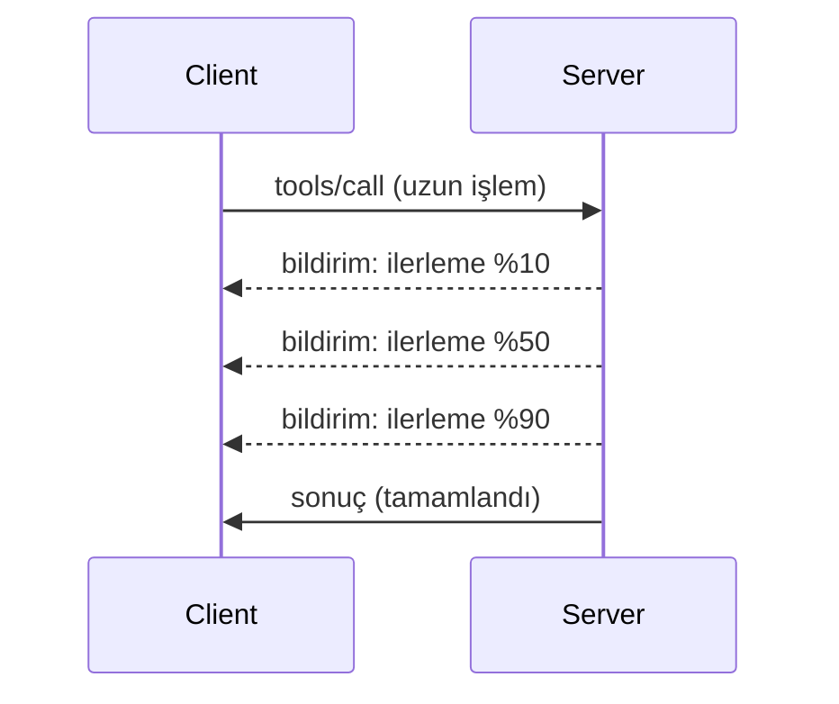

# MCP Protokol Özellikleri Derinlemesine İnceleme

Bu rehber, temel araç ve kaynak yönetiminin ötesine geçen gelişmiş MCP protokol özelliklerini inceler. Bu özellikleri anlamak, daha sağlam, kullanıcı dostu ve üretime hazır MCP sunucuları oluşturmanıza yardımcı olur.

> **İleriye bakış:** `2026-07-28` sürüm adayında Logging primi sona erdiriliyor (stdio için `stderr` ve yapılandırılmış gözlemlenebilirlik için OpenTelemetry tercih ediliyor), aşağıda belirtilen Sunucu Yaşam Döngüsü Olaylarında referans verilen `initialize`/oturum modeli kaldırılıyor ve deneysel Görevler özelliği, yeni `tasks/get`/`tasks/update`/`tasks/cancel` yaşam döngüsüyle ayrı bir Görevler uzantısına taşınıyor. Detaylar için bkz. [MCP'deki Değişiklikler: 2026-07-28 Sürüm Adayı](../../01-CoreConcepts/mcp-2026-07-28-release-candidate.md).

## Kapsanan Özellikler

1. **İlerleme Bildirimleri** - Uzun süren işlemler için ilerlemeyi raporlama  
2. **İstek İptali** - İstemcilerin devam eden istekleri iptal etmesine izin verme  
3. **Kaynak Şablonları** - Parametrelerle dinamik kaynak URI'ları  
4. **Sunucu Yaşam Döngüsü Olayları** - Doğru başlatma ve kapatma  
5. **Logging Kontrolü** - Sunucu tarafı günlükleme yapılandırması  
6. **Hata Yönetimi Kalıpları** - Tutarlı hata yanıtları  

---

## 1. İlerleme Bildirimleri

Zaman alan işlemler için (veri işleme, dosya indirme, API çağrıları) ilerleme bildirimleri kullanıcıları bilgilendirir.

### Nasıl Çalışır


  
### Python Uygulaması

```python
from mcp.server import Server, NotificationOptions
from mcp.types import ProgressNotification
import asyncio

app = Server("progress-server")

@app.tool()
async def process_large_file(file_path: str, ctx) -> str:
    """Process a large file with progress updates."""
    
    # İlerleme hesaplaması için dosya boyutunu alın
    file_size = os.path.getsize(file_path)
    processed = 0
    
    with open(file_path, 'rb') as f:
        while chunk := f.read(8192):
            # Parçayı işleyin
            await process_chunk(chunk)
            processed += len(chunk)
            
            # İlerleme bildirimini gönderin
            progress = (processed / file_size) * 100
            await ctx.send_notification(
                ProgressNotification(
                    progressToken=ctx.request_id,
                    progress=progress,
                    total=100,
                    message=f"Processing: {progress:.1f}%"
                )
            )
    
    return f"Processed {file_size} bytes"

@app.tool()
async def batch_operation(items: list[str], ctx) -> str:
    """Process multiple items with progress."""
    
    results = []
    total = len(items)
    
    for i, item in enumerate(items):
        result = await process_item(item)
        results.append(result)
        
        # Her öğeden sonra ilerlemeyi raporlayın
        await ctx.send_notification(
            ProgressNotification(
                progressToken=ctx.request_id,
                progress=i + 1,
                total=total,
                message=f"Processed {i + 1}/{total}: {item}"
            )
        )
    
    return f"Completed {total} items"
```
  
### TypeScript Uygulaması

```typescript
import { Server } from "@modelcontextprotocol/sdk/server/index.js";

server.setRequestHandler(CallToolSchema, async (request, extra) => {
  const { name, arguments: args } = request.params;
  
  if (name === "process_data") {
    const items = args.items as string[];
    const results = [];
    
    for (let i = 0; i < items.length; i++) {
      const result = await processItem(items[i]);
      results.push(result);
      
      // İlerleme bildirimi gönder
      await extra.sendNotification({
        method: "notifications/progress",
        params: {
          progressToken: request.id,
          progress: i + 1,
          total: items.length,
          message: `Processing item ${i + 1}/${items.length}`
        }
      });
    }
    
    return { content: [{ type: "text", text: JSON.stringify(results) }] };
  }
});
```
  
### İstemci İşleme (Python)

```python
async def handle_progress(notification):
    """Handle progress notifications from server."""
    params = notification.params
    print(f"Progress: {params.progress}/{params.total} - {params.message}")

# İşleyici kaydet
session.on_notification("notifications/progress", handle_progress)

# Aracı çağır (ilerleme güncellemeleri işleyici aracılığıyla gelecek)
result = await session.call_tool("process_large_file", {"file_path": "/data/large.csv"})
```
  
---

## 2. İstek İptali

İstemcilerin artık gerek duyulmayan veya çok uzun süren istekleri iptal etmesine izin verin.

### Python Uygulaması

```python
from mcp.server import Server
from mcp.types import CancelledError
import asyncio

app = Server("cancellable-server")

@app.tool()
async def long_running_search(query: str, ctx) -> str:
    """Search that can be cancelled."""
    
    results = []
    
    try:
        for page in range(100):  # Birçok sayfada arama yap
            # İptal isteği olup olmadığını kontrol et
            if ctx.is_cancelled:
                raise CancelledError("Search cancelled by user")
            
            # Sayfa aramasını simüle et
            page_results = await search_page(query, page)
            results.extend(page_results)
            
            # Küçük gecikme iptal kontrollerine olanak tanır
            await asyncio.sleep(0.1)
            
    except CancelledError:
        # Kısmi sonuçları döndür
        return f"Cancelled. Found {len(results)} results before cancellation."
    
    return f"Found {len(results)} total results"

@app.tool()
async def download_file(url: str, ctx) -> str:
    """Download with cancellation support."""
    
    async with aiohttp.ClientSession() as session:
        async with session.get(url) as response:
            total_size = int(response.headers.get('content-length', 0))
            downloaded = 0
            chunks = []
            
            async for chunk in response.content.iter_chunked(8192):
                if ctx.is_cancelled:
                    return f"Download cancelled at {downloaded}/{total_size} bytes"
                
                chunks.append(chunk)
                downloaded += len(chunk)
            
            return f"Downloaded {downloaded} bytes"
```
  
### İptal Bağlamı Uygulama

```python
class CancellableContext:
    """Context object that tracks cancellation state."""
    
    def __init__(self, request_id: str):
        self.request_id = request_id
        self._cancelled = asyncio.Event()
        self._cancel_reason = None
    
    @property
    def is_cancelled(self) -> bool:
        return self._cancelled.is_set()
    
    def cancel(self, reason: str = "Cancelled"):
        self._cancel_reason = reason
        self._cancelled.set()
    
    async def check_cancelled(self):
        """Raise if cancelled, otherwise continue."""
        if self.is_cancelled:
            raise CancelledError(self._cancel_reason)
    
    async def sleep_or_cancel(self, seconds: float):
        """Sleep that can be interrupted by cancellation."""
        try:
            await asyncio.wait_for(
                self._cancelled.wait(),
                timeout=seconds
            )
            raise CancelledError(self._cancel_reason)
        except asyncio.TimeoutError:
            pass  # Normal zaman aşımı, devam et
```
  
### İstemci Tarafı İptali

```python
import asyncio

async def search_with_timeout(session, query, timeout=30):
    """Search with automatic cancellation on timeout."""
    
    task = asyncio.create_task(
        session.call_tool("long_running_search", {"query": query})
    )
    
    try:
        result = await asyncio.wait_for(task, timeout=timeout)
        return result
    except asyncio.TimeoutError:
        # İptal talebi
        await session.send_notification({
            "method": "notifications/cancelled",
            "params": {"requestId": task.request_id, "reason": "Timeout"}
        })
        return "Search timed out"
```
  
---

## 3. Kaynak Şablonları

Kaynak şablonları, parametrelerle dinamik URI oluşturmayı sağlar, API'ler ve veritabanları için kullanışlıdır.

### Şablonları Tanımlama

```python
from mcp.server import Server
from mcp.types import ResourceTemplate

app = Server("template-server")

@app.list_resource_templates()
async def list_templates() -> list[ResourceTemplate]:
    """Return available resource templates."""
    return [
        ResourceTemplate(
            uriTemplate="db://users/{user_id}",
            name="User Profile",
            description="Fetch user profile by ID",
            mimeType="application/json"
        ),
        ResourceTemplate(
            uriTemplate="api://weather/{city}/{date}",
            name="Weather Data",
            description="Historical weather for city and date",
            mimeType="application/json"
        ),
        ResourceTemplate(
            uriTemplate="file://{path}",
            name="File Content",
            description="Read file at given path",
            mimeType="text/plain"
        )
    ]

@app.read_resource()
async def read_resource(uri: str) -> str:
    """Read resource, expanding template parameters."""
    
    # URI'yi çözümleyerek parametreleri çıkarır
    if uri.startswith("db://users/"):
        user_id = uri.split("/")[-1]
        return await fetch_user(user_id)
    
    elif uri.startswith("api://weather/"):
        parts = uri.replace("api://weather/", "").split("/")
        city, date = parts[0], parts[1]
        return await fetch_weather(city, date)
    
    elif uri.startswith("file://"):
        path = uri.replace("file://", "")
        return await read_file(path)
    
    raise ValueError(f"Unknown resource URI: {uri}")
```
  
### TypeScript Uygulaması

```typescript
server.setRequestHandler(ListResourceTemplatesSchema, async () => {
  return {
    resourceTemplates: [
      {
        uriTemplate: "github://repos/{owner}/{repo}/issues/{issue_number}",
        name: "GitHub Issue",
        description: "Fetch a specific GitHub issue",
        mimeType: "application/json"
      },
      {
        uriTemplate: "db://tables/{table}/rows/{id}",
        name: "Database Row",
        description: "Fetch a row from a database table",
        mimeType: "application/json"
      }
    ]
  };
});

server.setRequestHandler(ReadResourceSchema, async (request) => {
  const uri = request.params.uri;
  
  // GitHub konu URI'sini ayrıştır
  const githubMatch = uri.match(/^github:\/\/repos\/([^/]+)\/([^/]+)\/issues\/(\d+)$/);
  if (githubMatch) {
    const [_, owner, repo, issueNumber] = githubMatch;
    const issue = await fetchGitHubIssue(owner, repo, parseInt(issueNumber));
    return {
      contents: [{
        uri,
        mimeType: "application/json",
        text: JSON.stringify(issue, null, 2)
      }]
    };
  }
  
  throw new Error(`Unknown resource URI: ${uri}`);
});
```
  
---

## 4. Sunucu Yaşam Döngüsü Olayları

Doğru başlatma ve kapatma işlemleri, temiz kaynak yönetimini sağlar.

### Python Yaşam Döngüsü Yönetimi

```python
from mcp.server import Server
from contextlib import asynccontextmanager

app = Server("lifecycle-server")

# Paylaşılan durum
db_connection = None
cache = None

@asynccontextmanager
async def lifespan(server: Server):
    """Manage server lifecycle."""
    global db_connection, cache
    
    # Başlangıç
    print("🚀 Server starting...")
    db_connection = await create_database_connection()
    cache = await create_cache_client()
    print("✅ Resources initialized")
    
    yield  # Sunucu burada çalışıyor
    
    # Kapatma
    print("🛑 Server shutting down...")
    await db_connection.close()
    await cache.close()
    print("✅ Resources cleaned up")

app = Server("lifecycle-server", lifespan=lifespan)

@app.tool()
async def query_database(sql: str) -> str:
    """Use the shared database connection."""
    result = await db_connection.execute(sql)
    return str(result)
```
  
### TypeScript Yaşam Döngüsü

```typescript
import { Server } from "@modelcontextprotocol/sdk/server/index.js";

class ManagedServer {
  private server: Server;
  private dbConnection: DatabaseConnection | null = null;
  
  constructor() {
    this.server = new Server({
      name: "lifecycle-server",
      version: "1.0.0"
    });
    
    this.setupHandlers();
  }
  
  async start() {
    // Kaynakları başlat
    console.log("🚀 Server starting...");
    this.dbConnection = await createDatabaseConnection();
    console.log("✅ Database connected");
    
    // Sunucuyu başlat
    await this.server.connect(transport);
  }
  
  async stop() {
    // Kaynakları temizle
    console.log("🛑 Server shutting down...");
    if (this.dbConnection) {
      await this.dbConnection.close();
    }
    await this.server.close();
    console.log("✅ Cleanup complete");
  }
  
  private setupHandlers() {
    this.server.setRequestHandler(CallToolSchema, async (request) => {
      // this.dbConnection öğesini güvenli şekilde kullan
      // ...
    });
  }
}

// Nazik kapanış ile kullanım
const server = new ManagedServer();

process.on('SIGINT', async () => {
  await server.stop();
  process.exit(0);
});

await server.start();
```
  
---

## 5. Logging Kontrolü

MCP, istemcilerin kontrol edebileceği sunucu tarafı günlükleme seviyelerini destekler.

### Günlükleme Seviyelerini Uygulama

```python
from mcp.server import Server
from mcp.types import LoggingLevel
import logging

app = Server("logging-server")

# MCP seviyelerini Python günlükleme seviyelerine eşleştir
LEVEL_MAP = {
    LoggingLevel.DEBUG: logging.DEBUG,
    LoggingLevel.INFO: logging.INFO,
    LoggingLevel.WARNING: logging.WARNING,
    LoggingLevel.ERROR: logging.ERROR,
}

logger = logging.getLogger("mcp-server")

@app.set_logging_level()
async def set_logging_level(level: LoggingLevel) -> None:
    """Handle client request to change logging level."""
    python_level = LEVEL_MAP.get(level, logging.INFO)
    logger.setLevel(python_level)
    logger.info(f"Logging level set to {level}")

@app.tool()
async def debug_operation(data: str) -> str:
    """Tool with various logging levels."""
    logger.debug(f"Processing data: {data}")
    
    try:
        result = process(data)
        logger.info(f"Successfully processed: {result}")
        return result
    except Exception as e:
        logger.error(f"Processing failed: {e}")
        raise
```
  
### İstemciye Günlük Mesajları Gönderme

```python
@app.tool()
async def complex_operation(input: str, ctx) -> str:
    """Operation that logs to client."""
    
    # İstemciye günlük bildirim gönder
    await ctx.send_log(
        level="info",
        message=f"Starting complex operation with input: {input}"
    )
    
    # Çalışma yap...
    result = await do_work(input)
    
    await ctx.send_log(
        level="debug",
        message=f"Operation complete, result size: {len(result)}"
    )
    
    return result
```
  
---

## 6. Hata Yönetimi Kalıpları

Tutarlı hata yönetimi hata ayıklamayı ve kullanıcı deneyimini iyileştirir.

### MCP Hata Kodları

```python
from mcp.types import McpError, ErrorCode

class ToolError(McpError):
    """Base class for tool errors."""
    pass

class ValidationError(ToolError):
    """Invalid input parameters."""
    def __init__(self, message: str):
        super().__init__(ErrorCode.INVALID_PARAMS, message)

class NotFoundError(ToolError):
    """Requested resource not found."""
    def __init__(self, resource: str):
        super().__init__(ErrorCode.INVALID_REQUEST, f"Not found: {resource}")

class PermissionError(ToolError):
    """Access denied."""
    def __init__(self, action: str):
        super().__init__(ErrorCode.INVALID_REQUEST, f"Permission denied: {action}")

class InternalError(ToolError):
    """Internal server error."""
    def __init__(self, message: str):
        super().__init__(ErrorCode.INTERNAL_ERROR, message)
```
  
### Yapılandırılmış Hata Yanıtları

```python
@app.tool()
async def safe_operation(input: str) -> str:
    """Tool with comprehensive error handling."""
    
    # Girişi doğrula
    if not input:
        raise ValidationError("Input cannot be empty")
    
    if len(input) > 10000:
        raise ValidationError(f"Input too large: {len(input)} chars (max 10000)")
    
    try:
        # İzinleri kontrol et
        if not await check_permission(input):
            raise PermissionError(f"read {input}")
        
        # İşlemi gerçekleştir
        result = await perform_operation(input)
        
        if result is None:
            raise NotFoundError(input)
        
        return result
        
    except ConnectionError as e:
        raise InternalError(f"Database connection failed: {e}")
    except TimeoutError as e:
        raise InternalError(f"Operation timed out: {e}")
    except Exception as e:
        # Beklenmeyen hataları kaydet
        logger.exception(f"Unexpected error in safe_operation")
        raise InternalError(f"Unexpected error: {type(e).__name__}")
```
  
### TypeScript'te Hata Yönetimi

```typescript
import { McpError, ErrorCode } from "@modelcontextprotocol/sdk/types.js";

function validateInput(data: unknown): asserts data is ValidInput {
  if (typeof data !== "object" || data === null) {
    throw new McpError(
      ErrorCode.InvalidParams,
      "Input must be an object"
    );
  }
  // Daha fazla doğrulama...
}

server.setRequestHandler(CallToolSchema, async (request) => {
  try {
    validateInput(request.params.arguments);
    
    const result = await performOperation(request.params.arguments);
    
    return {
      content: [{ type: "text", text: JSON.stringify(result) }]
    };
    
  } catch (error) {
    if (error instanceof McpError) {
      throw error;  // Zaten bir MCP hatası
    }
    
    // Diğer hataları dönüştür
    if (error instanceof NotFoundError) {
      throw new McpError(ErrorCode.InvalidRequest, error.message);
    }
    
    // Bilinmeyen hata
    console.error("Unexpected error:", error);
    throw new McpError(
      ErrorCode.InternalError,
      "An unexpected error occurred"
    );
  }
});
```
  
---

## Deneysel Özellikler (MCP 2025-11-25)

Bu özellikler spesifikasyonda deneysel olarak işaretlenmiştir:

### Görevler (Uzun Süreli İşlemler)

```python
# Görevler, durumu takip ederek uzun süren işlemlerin takibini sağlar
@app.task()
async def training_task(model_id: str, data_path: str, ctx) -> str:
    """Long-running ML training task."""
    
    # Görev başlatıldı bildir
    await ctx.report_status("running", "Initializing training...")
    
    # Eğitim döngüsü
    for epoch in range(100):
        await train_epoch(model_id, data_path, epoch)
        await ctx.report_status(
            "running",
            f"Training epoch {epoch + 1}/100",
            progress=epoch + 1,
            total=100
        )
    
    await ctx.report_status("completed", "Training finished")
    return f"Model {model_id} trained successfully"
```
  
### Araç Açıklamaları

```python
# Açıklamalar, araç davranışı hakkında meta veri sağlar
@app.tool(
    annotations={
        "destructive": False,      # Veriyi değiştirmez
        "idempotent": True,        # Tekrar denemek güvenlidir
        "timeout_seconds": 30,     # Beklenen maksimum süre
        "requires_approval": False # Kullanıcı onayı gerekmez
    }
)
async def safe_query(query: str) -> str:
    """A read-only database query tool."""
    return await execute_read_query(query)
```
  
---

## Sonraki Adımlar

- [Modül 8 - En İyi Uygulamalar](../../08-BestPractices/README.md)  
- [5.14 - Bağlam Mühendisliği](../mcp-contextengineering/README.md)  
- [MCP Spesifikasyon Değişiklik Günlüğü](https://spec.modelcontextprotocol.io/)  

---

## Ek Kaynaklar

- [MCP Spesifikasyonu 2025-11-25](https://spec.modelcontextprotocol.io/specification/2025-11-25/)  
- [JSON-RPC 2.0 Hata Kodları](https://www.jsonrpc.org/specification#error_object)  
- [Python SDK Örnekleri](https://github.com/modelcontextprotocol/python-sdk/tree/main/examples)  
- [TypeScript SDK Örnekleri](https://github.com/modelcontextprotocol/typescript-sdk/tree/main/examples)

---

<!-- CO-OP TRANSLATOR DISCLAIMER START -->
**Feragatname**:
Bu belge, AI çeviri hizmeti [Co-op Translator](https://github.com/Azure/co-op-translator) kullanılarak çevrilmiştir. Doğruluk için çaba sarf etsek de, otomatik çevirilerin hata veya yanlışlık içerebileceğini lütfen unutmayınız. Orijinal belge, kendi dilinde yetkili kaynak olarak kabul edilmelidir. Kritik bilgiler için profesyonel insan çevirisi önerilir. Bu çevirinin kullanımı sonucu ortaya çıkabilecek yanlış anlamalardan veya yanlış yorumlamalardan sorumlu değiliz.
<!-- CO-OP TRANSLATOR DISCLAIMER END -->