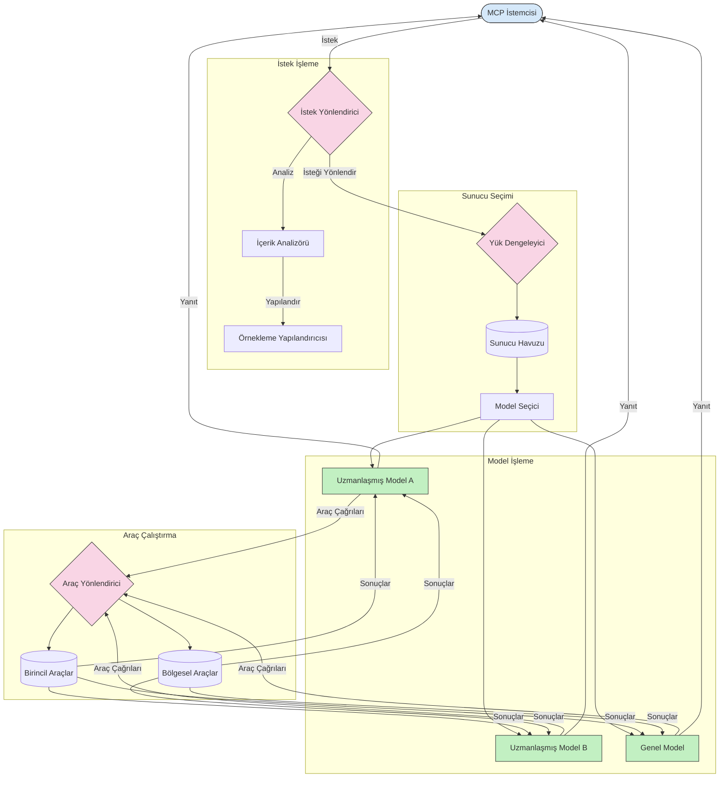

# Model Context Protocol'de Yönlendirme

Yönlendirme, MCP ekosistemindeki isteklerin uygun modellere, araçlara veya servislere yönlendirilmesi için gereklidir.

## Giriş

Model Context Protocol (MCP) içindeki yönlendirme, içerik türü, kullanıcı bağlamı ve sistem yükü gibi çeşitli kriterlere göre istekleri en uygun model veya servislere yönlendirmeyi içerir. Bu, verimli işlem ve optimal kaynak kullanımı sağlar.

## Öğrenme Hedefleri

Bu dersin sonunda:

- MCP'deki yönlendirme prensiplerini anlayabileceksiniz.
- İçerik tabanlı yönlendirmeyi uygulayarak istekleri uzmanlaşmış servislere yönlendirebileceksiniz.
- Kaynak kullanımını optimize etmek için akıllı yük dengeleme stratejilerini uygulayabileceksiniz.
- İstek bağlamına göre dinamik araç yönlendirmesi yapabileceksiniz.

## İçerik Tabanlı Yönlendirme

İçerik tabanlı yönlendirme, isteğin içeriğine göre özel servislere yönlendirme yapar. Örneğin, kod üretimi ile ilgili istekler özel bir kod modeline yönlendirilirken, yaratıcı yazma istekleri yaratıcı yazma modeline gönderilebilir.

Farklı programlama dillerinde örnek bir uygulamaya bakalım.

<details>
<summary>.NET</summary>

```csharp
// .NET Example: Content-based routing in MCP
public class ContentBasedRouter
{
    private readonly Dictionary<string, McpClient> _specializedClients;
    private readonly RoutingClassifier _classifier;
    
    public ContentBasedRouter()
    {
        // Initialize specialized clients for different domains
        _specializedClients = new Dictionary<string, McpClient>
        {
            ["code"] = new McpClient("https://code-specialized-mcp.com"),
            ["creative"] = new McpClient("https://creative-specialized-mcp.com"),
            ["scientific"] = new McpClient("https://scientific-specialized-mcp.com"),
            ["general"] = new McpClient("https://general-mcp.com")
        };
        
        // Initialize content classifier
        _classifier = new RoutingClassifier();
    }
    
    public async Task<McpResponse> RouteAndProcessAsync(string prompt, IDictionary<string, object> parameters = null)
    {
        // Classify the prompt to determine the best specialized service
        string category = await _classifier.ClassifyPromptAsync(prompt);
        
        // Get the appropriate client or fall back to general
        var client = _specializedClients.ContainsKey(category) 
            ? _specializedClients[category] 
            : _specializedClients["general"];
            
        Console.WriteLine($"Routing request to {category} specialized service");
        
        // Send request to the selected service
        return await client.SendPromptAsync(prompt, parameters);
    }
    
    // Simple classifier for routing decisions
    private class RoutingClassifier
    {
        public Task<string> ClassifyPromptAsync(string prompt)
        {
            prompt = prompt.ToLowerInvariant();
            
            if (prompt.Contains("code") || prompt.Contains("function") || 
                prompt.Contains("program") || prompt.Contains("algorithm"))
            {
                return Task.FromResult("code");
            }
            
            if (prompt.Contains("story") || prompt.Contains("creative") || 
                prompt.Contains("imagine") || prompt.Contains("design"))
            {
                return Task.FromResult("creative");
            }
            
            if (prompt.Contains("science") || prompt.Contains("research") || 
                prompt.Contains("analyze") || prompt.Contains("study"))
            {
                return Task.FromResult("scientific");
            }
            
            return Task.FromResult("general");
        }
    }
}
```

Yukarıdaki kodda şunları yaptık:

- İstekleri promptun içeriğine göre yönlendiren `ContentBasedRouter` sınıfı oluşturduk.
- Farklı alanlar için (kod, yaratıcı, bilimsel, genel) uzmanlaşmış istemciler başlattık.
- Promptun kategorisini belirleyen ve uygun uzmanlaşmış servise yönlendiren basit bir sınıflandırıcı uyguladık.
- Uzmanlaşmış servis bulunmazsa isteği genel bir servise yönlendirmek için geri dönüş mekanizması kullandık.
- İstekleri verimli işlemek için asenkron işlem kullandık.
- İçerik kategorilerini uzmanlaşmış MCP istemcilerine eşlemek için sözlük kullandık.
- Promptu analiz edip uygun kategoriyi döndüren basit sınıflandırıcı uyguladık.
- İsteği göndermek ve yanıt almak için uzmanlaşmış istemciyi kullandık.
- Prompt herhangi bir uzman kategorisi ile eşleşmezse isteği genel servise yönlendirdik.

</details>

## Akıllı Yük Dengeleme

Yük dengeleme, kaynak kullanımını optimize eder ve MCP servislerinin yüksek kullanılabilirliğini sağlar. Yük dengeleme, round-robin, ağırlıklı tepki süresi veya içerik farkındalığı stratejileri gibi farklı şekillerde uygulanabilir.

Aşağıdaki örnek uygulamada şu stratejiler kullanılmıştır:

- **Round Robin**: İstekleri mevcut sunucular arasında eşit şekilde dağıtır.
- **Ağırlıklı Tepki Süresi**: İstekleri sunucuların ortalama yanıt süresine göre yönlendirir.
- **İçerik Farkındalığı**: İstekleri, isteğin içeriğine göre uzman sunuculara yönlendirir.

<details>
<summary>Java</summary>

```java
// Java Örneği: MCP sunucuları için akıllı yük dengeleme
public class McpLoadBalancer {
    private final List<McpServerNode> serverNodes;
    private final LoadBalancingStrategy strategy;
    
    public McpLoadBalancer(List<McpServerNode> nodes, LoadBalancingStrategy strategy) {
        this.serverNodes = new ArrayList<>(nodes);
        this.strategy = strategy;
    }
    
    public McpResponse processRequest(McpRequest request) {
        // Stratejiye göre en iyi sunucuyu seç
        McpServerNode selectedNode = strategy.selectNode(serverNodes, request);
        
        try {
            // İsteği seçilen düğüme yönlendir
            return selectedNode.processRequest(request);
        } catch (Exception e) {
            // Hata yönetimi - yeniden deneme veya yedekleme mantığını uygula
            System.err.println("Error processing request on node " + selectedNode.getId() + ": " + e.getMessage());
            
            // Düğümü potansiyel olarak sağlıksız olarak işaretle
            selectedNode.recordFailure();
            
            // Yedek olarak bir sonraki en iyi düğümü dene
            List<McpServerNode> remainingNodes = new ArrayList<>(serverNodes);
            remainingNodes.remove(selectedNode);
            
            if (!remainingNodes.isEmpty()) {
                McpServerNode fallbackNode = strategy.selectNode(remainingNodes, request);
                return fallbackNode.processRequest(request);
            } else {
                throw new RuntimeException("All MCP server nodes failed to process the request");
            }
        }
    }
    
    // Düğüm sağlık kontrol görevi
    public void startHealthChecks(Duration interval) {
        ScheduledExecutorService scheduler = Executors.newScheduledThreadPool(1);
        scheduler.scheduleAtFixedRate(() -> {
            for (McpServerNode node : serverNodes) {
                try {
                    boolean isHealthy = node.checkHealth();
                    System.out.println("Node " + node.getId() + " health status: " + 
                                      (isHealthy ? "HEALTHY" : "UNHEALTHY"));
                } catch (Exception e) {
                    System.err.println("Health check failed for node " + node.getId());
                    node.setHealthy(false);
                }
            }
        }, 0, interval.toMillis(), TimeUnit.MILLISECONDS);
    }
    
    // Yük dengeleme stratejileri için arayüz
    public interface LoadBalancingStrategy {
        McpServerNode selectNode(List<McpServerNode> nodes, McpRequest request);
    }
    
    // Round-robin stratejisi
    public static class RoundRobinStrategy implements LoadBalancingStrategy {
        private AtomicInteger counter = new AtomicInteger(0);
        
        @Override
        public McpServerNode selectNode(List<McpServerNode> nodes, McpRequest request) {
            List<McpServerNode> healthyNodes = nodes.stream()
                .filter(McpServerNode::isHealthy)
                .collect(Collectors.toList());
            
            if (healthyNodes.isEmpty()) {
                throw new RuntimeException("No healthy nodes available");
            }
            
            int index = counter.getAndIncrement() % healthyNodes.size();
            return healthyNodes.get(index);
        }
    }
    
    // Ağırlıklı cevap süresi stratejisi
    public static class ResponseTimeStrategy implements LoadBalancingStrategy {
        @Override
        public McpServerNode selectNode(List<McpServerNode> nodes, McpRequest request) {
            return nodes.stream()
                .filter(McpServerNode::isHealthy)
                .min(Comparator.comparing(McpServerNode::getAverageResponseTime))
                .orElseThrow(() -> new RuntimeException("No healthy nodes available"));
        }
    }
    
    // İçerik farkındalıklı strateji
    public static class ContentAwareStrategy implements LoadBalancingStrategy {
        @Override
        public McpServerNode selectNode(List<McpServerNode> nodes, McpRequest request) {
            // İstek özelliklerini belirle
            boolean isCodeRequest = request.getPrompt().contains("code") || 
                                   request.getAllowedTools().contains("codeInterpreter");
            
            boolean isCreativeRequest = request.getPrompt().contains("creative") || 
                                       request.getPrompt().contains("story");
            
            // Uzmanlaşmış düğümleri bul
            Optional<McpServerNode> specializedNode = nodes.stream()
                .filter(McpServerNode::isHealthy)
                .filter(node -> {
                    if (isCodeRequest && node.getSpecialization().equals("code")) {
                        return true;
                    }
                    if (isCreativeRequest && node.getSpecialization().equals("creative")) {
                        return true;
                    }
                    return false;
                })
                .findFirst();
            
            // Uzman düğüm veya en az yüke sahip düğümü döndür
            return specializedNode.orElse(
                nodes.stream()
                    .filter(McpServerNode::isHealthy)
                    .min(Comparator.comparing(McpServerNode::getCurrentLoad))
                    .orElseThrow(() -> new RuntimeException("No healthy nodes available"))
            );
        }
    }
}
```

Yukarıdaki kodda şunları yaptık:

- İstekleri seçilen yük dengeleme stratejisine göre yöneten ve MCP sunucu düğümlerinin listesini yöneten `McpLoadBalancer` sınıfını oluşturduk.
- `RoundRobinStrategy`, `ResponseTimeStrategy` ve `ContentAwareStrategy` gibi farklı yük dengeleme stratejilerini uyguladık.
- Sunucu düğümlerinin sağlık durumunu periyodik olarak kontrol etmek için `ScheduledExecutorService` kullandık.
- Sağlık kontrolü yanıtlarına göre düğümleri sağlıklı veya sağlıksız olarak işaretleyen sağlık kontrol mekanizması uyguladık.
- Yüksek kullanılabilirliği sağlamak için hata yönetimi ve geri dönüş mantığı ile istek işlemini gerçekleştirdik.
- MCP sunucu düğümlerini, sağlık durumu, ortalama yanıt süresi ve mevcut yükü dahil olmak üzere temsil eden `McpServerNode` sınıfını kullandık.
- Prompt ve izin verilen araçlar gibi istek ayrıntılarını kapsülleyen `McpRequest` sınıfını uyguladık.
- Sağlık durumu ve uzmanlaşma bazında düğümleri filtreleyip seçmek için Java Streams kullandık.

</details>

## Dinamik Araç Yönlendirme

Araç yönlendirme, araç çağrılarının bağlama göre en uygun servise yönlendirilmesini sağlar. Örneğin, hava durumu aracı çağrısı kullanıcının konumuna göre bölgesel bir uç noktaya yönlendirilmesi gerekebilir veya hesap makinesi aracı belirli bir API sürümünü kullanmak zorunda olabilir.

İstek analizine, bölgesel uç noktalara ve sürüm desteğine dayalı dinamik araç yönlendirmesini gösteren örnek bir uygulamaya bakalım.

<details>
<summary>Python</summary>

```python
# Python Örneği: İstek analizine dayalı dinamik araç yönlendirmesi
class McpToolRouter:
    def __init__(self):
        # Mevcut araç uç noktalarını kaydet
        self.tool_endpoints = {
            "weatherTool": "https://weather-service.example.com/api",
            "calculatorTool": "https://calculator-service.example.com/compute",
            "databaseTool": "https://database-service.example.com/query",
            "searchTool": "https://search-service.example.com/search"
        }
        
        # Küresel dağıtım için bölgesel uç noktalar
        self.regional_endpoints = {
            "us": {
                "weatherTool": "https://us-west.weather-service.example.com/api",
                "searchTool": "https://us.search-service.example.com/search"
            },
            "europe": {
                "weatherTool": "https://eu.weather-service.example.com/api",
                "searchTool": "https://eu.search-service.example.com/search"
            },
            "asia": {
                "weatherTool": "https://asia.weather-service.example.com/api",
                "searchTool": "https://asia.search-service.example.com/search"
            }
        }
        
        # Araç sürümleme desteği
        self.tool_versions = {
            "weatherTool": {
                "default": "v2",
                "v1": "https://weather-service.example.com/api/v1",
                "v2": "https://weather-service.example.com/api/v2",
                "beta": "https://weather-service.example.com/api/beta"
            }
        }
    
    async def route_tool_request(self, tool_name, parameters, user_context=None):
        """Route a tool request to the appropriate endpoint based on context"""
        endpoint = self._select_endpoint(tool_name, parameters, user_context)
        
        if not endpoint:
            raise ValueError(f"No endpoint available for tool: {tool_name}")
        
        # Seçilen uç noktaya gerçek isteği gerçekleştir
        return await self._execute_tool_request(endpoint, tool_name, parameters)
    
    def _select_endpoint(self, tool_name, parameters, user_context=None):
        """Select the most appropriate endpoint based on context"""
        # Kayıttan temel uç nokta
        if tool_name not in self.tool_endpoints:
            return None
            
        base_endpoint = self.tool_endpoints[tool_name]
        
        # Belirli bir araç sürümü kullanmamız gerekip gerekmediğini kontrol et
        if tool_name in self.tool_versions:
            version_info = self.tool_versions[tool_name]
            
            # Belirtilen sürümü veya varsayılanı kullan
            requested_version = parameters.get("_version", version_info["default"])
            if requested_version in version_info:
                base_endpoint = version_info[requested_version]
        
        # Kullanıcı bölgesi biliniyorsa bölgesel yönlendirmeyi kontrol et
        if user_context and "region" in user_context:
            user_region = user_context["region"]
            
            if user_region in self.regional_endpoints:
                regional_tools = self.regional_endpoints[user_region]
                
                if tool_name in regional_tools:
                    # Bölgeye özel uç noktayı kullan
                    return regional_tools[tool_name]
        
        # Veri ikamet gereksinimlerini kontrol et
        if user_context and "data_residency" in user_context:
            # Verilerin belirtilen yargı yetkisinde kalmasını sağlamak için mantık uygular
            pass
        
        # Gecikmeye dayalı yönlendirmeyi kontrol et
        if user_context and "latency_sensitive" in user_context and user_context["latency_sensitive"]:
            # En düşük gecikmeli uç noktayı seçmek için mantık uygular
            pass
            
        return base_endpoint
        
    async def _execute_tool_request(self, endpoint, tool_name, parameters):
        """Execute the actual tool request to the selected endpoint"""
        try:
            async with aiohttp.ClientSession() as session:
                async with session.post(
                    endpoint,
                    json={"toolName": tool_name, "parameters": parameters},
                    headers={"Content-Type": "application/json"}
                ) as response:
                    if response.status == 200:
                        result = await response.json()
                        return result
                    else:
                        error_text = await response.text()
                        raise Exception(f"Tool execution failed: {error_text}")
        except Exception as e:
            # Tekrar deneme mantığı veya yedek stratejisi uygula
            print(f"Error executing tool {tool_name} at {endpoint}: {str(e)}")
            raise
```

Yukarıdaki kodda şunları yaptık:

- İstek analizi, bölgesel uç noktalar ve sürüm desteğine dayalı araç yönlendirmesini yöneten `McpToolRouter` sınıfını oluşturduk.
- Mevcut araç uç noktalarını ve küresel dağıtım için bölgesel uç noktaları kaydettik.
- Bölge ve veri ikamet gereksinimleri gibi kullanıcı bağlamına göre uygun uç noktayı seçen dinamik yönlendirme mantığını uyguladık.
- Araçlar için sürüm desteği uygulayarak kullanıcıların hangi sürümü kullanmak istediklerini belirtmelerine olanak sağladık.
- Araç çağrılarını çalıştırmak ve yanıtları işlemek için asenkron HTTP istekleri kullandık.

</details>

## MCP'de Örnekleme ve Yönlendirme Mimarisi

Örnekleme, Model Context Protocol (MCP) içinde verimli istek işleme ve yönlendirmeye olanak tanıyan kritik bir bileşendir. Gelen isteklerin içeriği, kullanıcı bağlamı ve sistem yükü gibi çeşitli kriterlere göre hangi model veya servisin işleyeceğine karar verilmesi amacıyla analiz edilmesini içerir.

Örnekleme ve yönlendirme birlikte kullanılarak kaynak kullanımını optimize eden ve yüksek kullanılabilirlik sağlayan sağlam bir mimari oluşturulabilir. Örnekleme süreci istekleri sınıflandırmak için kullanılabilirken, yönlendirme bu istekleri uygun model veya servislere iletir.

Aşağıdaki diyagram, kapsamlı bir MCP mimarisinde örnekleme ve yönlendirmenin nasıl birlikte çalıştığını göstermektedir:



## Sonraki Adım

- [5.6 Sampling](../mcp-sampling/README.md)

---

<!-- CO-OP TRANSLATOR DISCLAIMER START -->
**Feragatname**:
Bu belge, AI çeviri hizmeti [Co-op Translator](https://github.com/Azure/co-op-translator) kullanılarak çevrilmiştir. Doğruluk için çaba sarf etsek de, otomatik çevirilerin hata veya yanlışlık içerebileceğini lütfen unutmayınız. Orijinal belge, kendi dilinde yetkili kaynak olarak kabul edilmelidir. Kritik bilgiler için profesyonel insan çevirisi önerilir. Bu çevirinin kullanımı sonucu ortaya çıkabilecek yanlış anlamalardan veya yanlış yorumlamalardan sorumlu değiliz.
<!-- CO-OP TRANSLATOR DISCLAIMER END -->