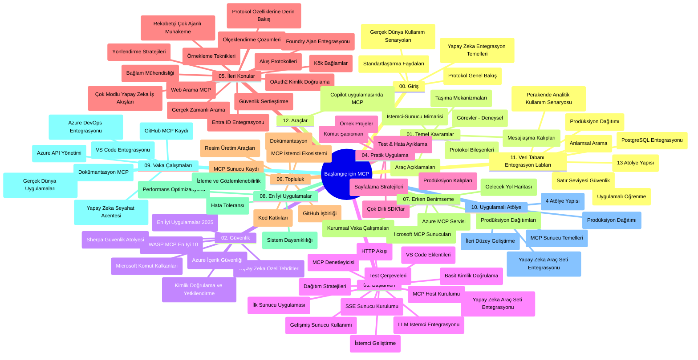

# Model Context Protocol (MCP) Yeni Başlayanlar İçin - Çalışma Rehberi

Bu çalışma rehberi, "Model Context Protocol (MCP) Yeni Başlayanlar İçin" müfredatının depo yapısı ve içeriğinin bir özetini sağlar. Bu rehberi, depoyu verimli bir şekilde gezmek ve mevcut kaynaklardan en iyi şekilde yararlanmak için kullanın.

## Depo Genel Bakışı

Model Context Protocol (MCP), yapay zeka modelleri ile istemci uygulamaları arasındaki etkileşimler için standartlaştırılmış bir çerçevedir. Öncelikle Anthropic tarafından oluşturulan MCP, artık resmi GitHub organizasyonu yoluyla daha geniş MCP topluluğu tarafından sürdürülmektedir. Bu depo, AI geliştiricileri, sistem mimarları ve yazılım mühendisleri için tasarlanmış, C#, Java, JavaScript, Python ve TypeScript dillerinde uygulamalı kod örnekleri içeren kapsamlı bir müfredat sunar.

## Görsel Müfredat Haritası

## Depo Yapısı

Depo, MCP'nin farklı yönlerine odaklanan on iki ana bölüme ayrılmıştır:

1. **Giriş (00-Introduction/)**
   - Model Context Protocol'e genel bakış
   - Yapay zeka boru hatlarında standartlaşmanın önemi
   - Pratik kullanım senaryoları ve faydaları

2. **Temel Kavramlar (01-CoreConcepts/)**
   - İstemci-sunucu mimarisi
   - Ana protokol bileşenleri
   - MCP'deki mesajlaşma desenleri
   - İleriye dönük: [MCP'deki Değişiklikler: 2026-07-28 Sürüm Adayı](./01-CoreConcepts/mcp-2026-07-28-release-candidate.md) — durum bilgisiz protokol çekirdeği, Uzantılar çerçevesi ve bir sonraki spesifikasyon sürümünde beklenen Roots/Sampling/Logging kullanımdan kaldırılmaları

3. **Güvenlik (02-Security/)**
   - MCP tabanlı sistemlerde güvenlik tehditleri
   - Uygulamaların güvenliğini sağlamak için en iyi uygulamalar
   - Kimlik doğrulama ve yetkilendirme stratejileri
   - **Kapsamlı Güvenlik Dokümantasyonu**:
     - MCP Güvenlik En İyi Uygulamaları 2025
     - Azure İçerik Güvenliği Uygulama Rehberi
     - MCP Güvenlik Kontrolleri ve Teknikleri
     - MCP En İyi Uygulamalar Hızlı Başvuru
   - **Temel Güvenlik Konuları**:
     - İstemci kandırma ve araç zehirleme saldırıları
     - Oturum kaçırma ve karışık vekil problemleri
     - Jeton geçişi güvenlik açıkları
     - Aşırı izinler ve erişim kontrolü
     - Yapay zeka bileşenleri için tedarik zinciri güvenliği
     - Microsoft İstemci Kalkanları entegrasyonu

4. **Başlarken (03-GettingStarted/)**
   - Ortam kurulumu ve yapılandırması
   - Temel MCP sunucuları ve istemcileri oluşturma
   - Mevcut uygulamalarla entegrasyon
   - İçerdiği bölümler:
     - İlk sunucu uygulaması
     - İstemci geliştirme
     - LLM istemci entegrasyonu
     - VS Code entegrasyonu
     - Server-Sent Events (SSE) sunucusu
     - Gelişmiş sunucu kullanımı
     - HTTP akışı
     - AI Araç Kiti entegrasyonu
     - Test stratejileri
     - Dağıtım rehberleri

5. **Pratik Uygulama (04-PracticalImplementation/)**
   - Farklı programlama dillerinde SDK kullanımı
   - Hata ayıklama, test ve doğrulama teknikleri
   - Yeniden kullanılabilir istem kalıpları ve iş akışları oluşturma
   - Uygulama örnekleri içeren örnek projeler

6. **İleri Konular (05-AdvancedTopics/)**
   - Bağlam mühendisliği teknikleri
   - Foundry ajan entegrasyonu
   - Çok modlu yapay zeka iş akışları
   - OAuth2 kimlik doğrulama demoları
   - Gerçek zamanlı arama özellikleri
   - Gerçek zamanlı akış
   - Root bağlamları uygulaması
   - Yönlendirme stratejileri
   - Örnekleme teknikleri
   - Ölçeklendirme yaklaşımları
   - Güvenlik değerlendirmeleri
   - Entra ID güvenlik entegrasyonu
   - Web arama entegrasyonu
   - Karşılıklı çok ajanlı tartışma modelleri (müzakere desenleri)

7. **Topluluk Katkıları (06-CommunityContributions/)**
   - Kod ve dokümantasyon katkısı nasıl yapılır
   - GitHub üzerinden iş birliği
   - Topluluk odaklı geliştirmeler ve geri bildirimler
   - Çeşitli MCP istemcilerini kullanma (Claude Masaüstü, Cline, VSCode)
   - Görüntü üretimini içeren popüler MCP sunucularıyla çalışma

8. **Erken Benimseme Dersleri (07-LessonsfromEarlyAdoption/)**
   - Gerçek dünya uygulamaları ve başarı hikayeleri
   - MCP tabanlı çözümler geliştirme ve dağıtma
   - Trendler ve gelecek yol haritası
   - **Microsoft MCP Sunucuları Rehberi**: 10 üretime hazır Microsoft MCP sunucusunu kapsayan kapsamlı rehber:
     - Microsoft Learn Docs MCP Sunucusu
     - Azure MCP Sunucusu (15+ özel bağlayıcı)
     - GitHub MCP Sunucusu
     - Azure DevOps MCP Sunucusu
     - MarkItDown MCP Sunucusu
     - SQL Server MCP Sunucusu
     - Playwright MCP Sunucusu
     - Dev Box MCP Sunucusu
     - Microsoft Foundry MCP Sunucusu
     - Microsoft 365 Ajan Araç Kiti MCP Sunucusu

9. **En İyi Uygulamalar (08-BestPractices/)**
   - Performans ayarlama ve optimizasyon
   - Hata toleranslı MCP sistemleri tasarımı
   - Test ve dayanıklılık stratejileri

10. **Vaka Analizleri (09-CaseStudy/)**
    - MCP'nin çok çeşitli senaryolardaki çok yönlülüğünü gösteren **yedi kapsamlı vaka çalışması**:
    - **Azure AI Seyahat Acenteleri**: Azure OpenAI ve AI Search ile çok ajanlı orkestrasyon
    - **Azure DevOps Entegrasyonu**: YouTube veri güncellemeleri ile iş akışı süreçlerinin otomasyonu
    - **Gerçek Zamanlı Dokümantasyon Getirme**: Streaming HTTP ile Python konsol istemcisi
    - **Etkileşimli Çalışma Planı Oluşturucu**: Chainlit web uygulaması ve sohbet tabanlı yapay zeka
    - **Dahili Düzenleyici Dokümantasyonu**: VS Code entegrasyonu ve GitHub Copilot iş akışları
    - **Azure API Yönetimi**: Kurumsal API entegrasyonu MCP sunucusu oluşturma ile
    - **GitHub MCP Kütüphanesi**: Ekosistem geliştirme ve ajan tabanlı entegrasyon platformu
    - Kurumsal entegrasyon, geliştirici üretkenliği ve ekosistem geliştirmeyi kapsayan uygulama örnekleri

11. **Uygulamalı Atölye (10-StreamliningAIWorkflowsBuildingAnMCPServerWithAIToolkit/)**
    - MCP ile AI Araç Kiti'ni birleştiren kapsamlı uygulamalı atölye
    - Yapay zeka modellerini gerçek dünya araçlarıyla buluşturan zeki uygulamalar geliştirme
    - Temel bilgiler, özel sunucu geliştirme ve üretim dağıtım stratejilerini kapsayan pratik modüller
    - **Atölye Yapısı**:
      - Atölye 1: MCP Sunucu Temelleri
      - Atölye 2: İleri MCP Sunucu Geliştirme
      - Atölye 3: AI Araç Kiti Entegrasyonu
      - Atölye 4: Üretim Dağıtımı ve Ölçeklendirme
    - Adım adım yönergelerle laboratuvar tabanlı öğrenme yaklaşımı

12. **MCP Sunucu Veritabanı Entegrasyon Laboratuvarları (11-MCPServerHandsOnLabs/)**
    - PostgreSQL entegrasyonuyla üretime hazır MCP sunucuları inşa etmek için **13 laboratuvarlık kapsamlı öğrenme yolu**
    - Zava Retail kullanım durumu ile gerçek dünya perakende analizleri uygulaması
    - Kurumsal düzey desenler: Satır Seviyesi Güvenliği (RLS), anlamsal arama ve çok kiracı veri erişimi
    - **Tam Laboratuvar Yapısı**:
      - **Laboratuvarlar 00-03: Temeller** - Giriş, Mimari, Güvenlik, Ortam Kurulumu
      - **Laboratuvarlar 04-06: MCP Sunucu İnşası** - Veritabanı Tasarımı, MCP Sunucu Uygulaması, Araç Geliştirme
      - **Laboratuvarlar 07-09: İleri Özellikler** - Anlamsal Arama, Test & Hata Ayıklama, VS Code Entegrasyonu
      - **Laboratuvarlar 10-12: Üretim & En İyi Uygulamalar** - Dağıtım, İzleme, Optimizasyon
    - **Kapsanan Teknolojiler**: FastMCP çerçevesi, PostgreSQL, Azure OpenAI, Azure Container Apps, Application Insights
    - **Öğrenme Çıktıları**: Üretime hazır MCP sunucuları, veritabanı entegrasyon desenleri, yapay zeka destekli analizler, kurumsal güvenlik

13. **Araçlar (12-tooling/)**
    - Copilot uygulaması ve diğer araçlarda MCP kullanımı öğrenin

## Ek Kaynaklar

Depoda destekleyici kaynaklar bulunmaktadır:

- **Images klasörü**: Müfredat boyunca kullanılan şemalar ve illüstrasyonlar
- **Çeviriler**: Dokümantasyonun otomatik çoklu dil desteği
- **Resmi MCP Kaynakları**:
  - [MCP Dokümantasyonu](https://modelcontextprotocol.io/)
  - [MCP Spesifikasyonu](https://spec.modelcontextprotocol.io/)
  - [MCP GitHub Deposu](https://github.com/modelcontextprotocol)

## Bu Depo Nasıl Kullanılır

1. **Sıralı Öğrenme**: Yapılandırılmış bir öğrenme deneyimi için bölümleri sırasıyla (00'dan 11'e) takip edin.
2. **Dil Bazlı Odaklanma**: Belirli bir programlama diline ilgi duyuyorsanız, tercih ettiğiniz dildeki uygulamalar için örnekler dizinlerini keşfedin.
3. **Pratik Uygulama**: Ortamınızı kurmak ve ilk MCP sunucusu ile istemcinizi oluşturmak için "Başlarken" bölümüne başlayın.
4. **İleri Keşif**: Temellerde rahatladıktan sonra ileri konulara dalarak bilginizi genişletin.
5. **Topluluk Katılımı**: Uzmanlar ve geliştiricilerle bağlantı kurmak için GitHub tartışmaları ve Discord kanalları aracılığıyla MCP topluluğuna katılın.

## MCP İstemcileri ve Araçları

Müfredat, çeşitli MCP istemcileri ve araçlarını kapsar:

1. **Resmi İstemciler**:
   - Visual Studio Code
   - Visual Studio Code'da MCP
   - Claude Masaüstü
   - VSCode'da Claude
   - Claude API

2. **Topluluk İstemcileri**:
   - Cline (terminal tabanlı)
   - Cursor (kod düzenleyici)
   - ChatMCP
   - Windsurf

3. **MCP Yönetim Araçları**:
   - MCP CLI
   - MCP Manager
   - MCP Linker
   - MCP Router

## Popüler MCP Sunucuları

Depo, çeşitli MCP sunucularını tanıtır:

1. **Resmi Microsoft MCP Sunucuları**:
   - Microsoft Learn Docs MCP Sunucusu
   - Azure MCP Sunucusu (15+ özel bağlayıcı)
   - GitHub MCP Sunucusu
   - Azure DevOps MCP Sunucusu
   - MarkItDown MCP Sunucusu
   - SQL Server MCP Sunucusu
   - Playwright MCP Sunucusu
   - Dev Box MCP Sunucusu
   - Microsoft Foundry MCP Sunucusu
   - Microsoft 365 Ajan Araç Kiti MCP Sunucusu

2. **Resmi Referans Sunucuları**:
   - Dosya Sistemi
   - Fetch
   - Bellek
   - Sıralı Düşünme

3. **Görüntü Üretimi**:
   - Azure OpenAI DALL-E 3
   - Stable Diffusion WebUI
   - Replicate

4. **Geliştirme Araçları**:
   - Git MCP
   - Terminal Kontrolü
   - Kod Asistanı

5. **Uzmanlaşmış Sunucular**:
   - Salesforce
   - Microsoft Teams
   - Jira & Confluence

## Katkıda Bulunma

Bu depo, topluluk katkılarını memnuniyetle karşılar. MCP ekosistemine etkili katkı sağlama rehberi için Topluluk Katkıları bölümüne bakınız.

----

*Bu çalışma rehberi, en son MCP Spesifikasyonu 2025-11-25'i yansıtacak şekilde 5 Şubat 2026'da güncellenmiştir ve o tarihteki depo genel görünümünü sağlar. Depo içeriği bu tarihten sonra güncellenmiş olabilir.*

*Ek (2 Temmuz 2026): `2026-07-28` MCP Spesifikasyonu Sürüm Adayı hakkında bir ders [01-CoreConcepts](./01-CoreConcepts/mcp-2026-07-28-release-candidate.md) altında eklenmiştir; müfredat tabanı yeni spesifikasyon yayımlanana kadar 2025-11-25 olarak kalacaktır.*

---

<!-- CO-OP TRANSLATOR DISCLAIMER START -->
**Feragatname**:
Bu belge, AI çeviri hizmeti [Co-op Translator](https://github.com/Azure/co-op-translator) kullanılarak çevrilmiştir. Doğruluk için çaba sarf etsek de, otomatik çevirilerin hata veya yanlışlık içerebileceğini lütfen unutmayınız. Orijinal belge, kendi dilinde yetkili kaynak olarak kabul edilmelidir. Kritik bilgiler için profesyonel insan çevirisi önerilir. Bu çevirinin kullanımı sonucu ortaya çıkabilecek yanlış anlamalardan veya yanlış yorumlamalardan sorumlu değiliz.
<!-- CO-OP TRANSLATOR DISCLAIMER END -->