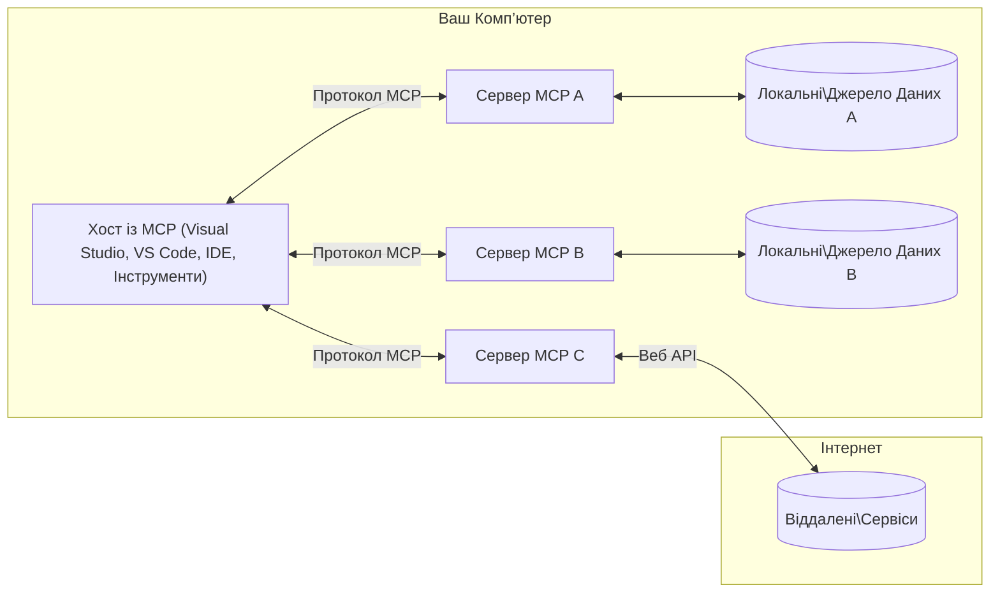

# Основні поняття MCP: Оволодіння Протоколом Контексту Моделі для інтеграції ШІ

[](https://youtu.be/earDzWGtE84)

_(Натисніть на зображення вище, щоб переглянути відео цього уроку)_

[Протокол Контексту Моделі (MCP)](https://github.com/modelcontextprotocol) — це потужна, стандартизована основа, яка оптимізує взаємодію між Великими Мовними Моделями (LLM) та зовнішніми інструментами, додатками і джерелами даних.
У цьому посібнику ви ознайомитесь із ключовими поняттями MCP. Ви дізнаєтесь про клієнт-серверну архітектуру, основні компоненти, механіку комунікації та найкращі практики впровадження.

- **Явна згода користувача**: Увесь доступ до даних та операції вимагають явного схвалення користувача перед виконанням. Користувачі мають чітко розуміти, які дані будуть доступні та які дії будуть виконані, з детальним управлінням дозволами і авторизаціями.

- **Захист конфіденційності даних**: Дані користувачів відкриваються тільки за явною згодою і мають захищатися надійними механізмами контролю доступу протягом усього циклу взаємодії. Впровадження повинно запобігати несанкціонованій передачі даних і суворо підтримувати кордони приватності.

- **Безпека виконання інструментів**: Кожен виклик інструмента вимагає явної згоди користувача з чітким розумінням функціоналу, параметрів і потенційного впливу інструмента. Надійні межі безпеки повинні запобігати небажаному, небезпечному або шкідливому виконанню.

- **Безпека транспортного рівня**: Усі канали комунікації повинні використовувати належне шифрування та механізми автентифікації. Віддалені з'єднання повинні застосовувати безпечні транспортні протоколи та правильне керування обліковими даними.

#### Рекомендації для впровадження:

- **Управління дозволами**: Впроваджуйте системи детального керування дозволами, які дозволяють користувачам контролювати доступ до серверів, інструментів і ресурсів.
- **Автентифікація і авторизація**: Використовуйте безпечні методи автентифікації (OAuth, API ключі) з правильним керуванням токенами та строком їх дії.
- **Валідація введених даних**: Перевіряйте всі параметри та вхідні дані відповідно до визначених схем, щоб запобігти ін’єкціям.
- **Аудит логів**: Підтримуйте повні журнали всіх операцій для безпеки та відповідності вимогам.

## Огляд

Цей урок досліджує фундаментальну архітектуру та компоненти, що складають екосистему Протоколу Контексту Моделі (MCP). Ви дізнаєтесь про клієнт-серверну архітектуру, ключові компоненти та механізми комунікації, які забезпечують взаємодію MCP.

## Основні цілі навчання

До кінця цього уроку ви:

- Зрозумієте клієнт-серверну архітектуру MCP.
- Визначите ролі та обов’язки Хостів, Клієнтів і Серверів.
- Проаналізуєте ключові можливості, що роблять MCP гнучким рівнем інтеграції.
- Навчитесь розуміти потоки інформації в екосистемі MCP.
- Отримаєте практичні знання через приклади коду на .NET, Java, Python і JavaScript.

## Архітектура MCP: погляд глибше

Екосистема MCP базується на клієнт-серверній моделі. Ця модульна структура дозволяє застосункам ШІ ефективно взаємодіяти з інструментами, базами даних, API та контекстуальними ресурсами. Розглянемо цю архітектуру за основними компонентами.

В основі MCP лежить клієнт-серверна архітектура, де хост-додаток може підключатися до кількох серверів:



- **Хости MCP**: Програми на зразок VSCode, Claude Desktop, IDE або інструменти ШІ, що хочуть отримати доступ до даних через MCP.
- **Клієнти MCP**: Клієнти протоколу, які підтримують 1:1 з’єднання із серверами.
- **Сервери MCP**: Легковагові програми, що надають певні можливості через стандартизований Протокол Контексту Моделі.
- **Локальні джерела даних**: Файли, бази даних і служби вашого комп’ютера, до яких сервери MCP можуть безпечно отримати доступ.
- **Віддалені служби**: Зовнішні системи, доступні через інтернет, до яких сервери MCP можуть підключатися через API.

Протокол MCP є еволюційним стандартом із версіонуванням за датою (формат РРРР-ММ-ДД). Поточна версія протоколу — **2025-11-25**. Ви можете переглянути останні оновлення в [специфікації протоколу](https://modelcontextprotocol.io/specification/2025-11-25/)

> **Подивимось уперед:** кандидат у реліз наступної версії специфікації, **2026-07-28**, було оголошено в травні 2026 року і заплановано на 28 липня 2026. Вона робить протокол безстанним на транспортному рівні (усуває рукопотискання `initialize` та ідентифікатори сесій), формалізує framework розширень і застаріває корені, вибірку та логування на користь нових патернів. Детальний огляд див. у [Що змінюється у MCP: кандидат у реліз 2026-07-28](./mcp-2026-07-28-release-candidate.md).

### 1. Хости

У Протоколі Контексту Моделі (MCP) **Хости** — це AI-додатки, які служать основним інтерфейсом для користувачів протоколу. Хости координують і керують підключеннями до кількох серверів MCP, створюючи спеціальні MCP клієнти для кожного серверного з’єднання. Прикладами хостів є:

- **AI-додатки**: Claude Desktop, Visual Studio Code, Claude Code
- **Середовища розробки**: IDE та редактори коду з інтеграцією MCP
- **Спеціальні додатки**: Спеціалізовані AI-агенти та інструменти

**Хости** — це додатки, які координують взаємодію з моделями ШІ. Вони:

- **Оркеструють AI-моделі**: Виконують взаємодію або генерують відповіді за допомогою LLM та координують AI-робочі процеси.
- **Керують клієнтськими підключеннями**: Створюють і підтримують по одному MCP клієнту на кожне серверне з’єднання.
- **Керують інтерфейсом користувача**: Керують потоком розмови, взаємодією й відображенням відповідей.
- **Забезпечують безпеку**: Контролюють дозволи, обмеження безпеки та автентифікацію.
- **Керують згодою користувача**: Організовують схвалення користувача на обмін даними та виконання інструментів.


### 2. Клієнти

**Клієнти** — важливі компоненти, які підтримують виділені індивідуальні з’єднання між Хостами та серверами MCP. Кожен MCP клієнт створюється хостом для підключення до конкретного сервера, забезпечуючи організований та безпечний канал комунікації. Кілька клієнтів дозволяють хостам одночасно підключатися до кількох серверів.

**Клієнти** — це компоненти-з’єднувачі в межах хост-додатка. Вони:

- **Комунікація протоколом**: Відправляють JSON-RPC 2.0 запити до серверів із підказками та інструкціями.
- **Переговори можливостей**: Обговорюють підтримувані функції та версії протоколу з серверами під час ініціалізації.
- **Виконання інструментів**: Керує запитами на виконання інструментів від моделей і обробляє відповіді.
- **Оновлення в реальному часі**: Обробляє повідомлення та оновлення від серверів у режимі реального часу.
- **Обробка відповідей**: Обробляє та форматує відповіді серверів для відображення користувачам.

### 3. Сервери

**Сервери** — це програми, які надають контекст, інструменти та можливості клієнтам MCP. Вони можуть запускатися локально (на тій же машині, що й Хост) або віддалено (на зовнішніх платформах) та відповідають за обробку запитів клієнтів і надання структурованих відповідей. Сервери відкривають певний функціонал через стандартизований Протокол Контексту Моделі.

**Сервери** — це служби, які надають контекст та можливості. Вони:

- **Реєстрація функцій**: Реєструють і публікують доступні примітиви (ресурси, підказки, інструменти) для клієнтів.
- **Обробка запитів**: Приймають і виконують виклики інструментів, запити ресурсів і підказок від клієнтів.
- **Надання контексту**: Забезпечують контекстну інформацію та дані для покращення відповідей моделей.
- **Управління станом**: Підтримують стан сесії та керують взаємодіями зі станом, коли це потрібно.

- **Сповіщення в реальному часі**: Надсилання сповіщень про зміни можливостей та оновлення підключеним клієнтам

Сервери можуть розроблятися будь-ким для розширення можливостей моделей спеціалізованою функціональністю, і вони підтримують як локальні, так і віддалені сценарії розгортання.

### 4. Примітиви сервера

Сервери в Model Context Protocol (MCP) надають три основні **примітиви**, що визначають фундаментальні блоки для насичених взаємодій між клієнтами, хостами та мовними моделями. Ці примітиви визначають типи контекстної інформації та доступні дії через протокол.

Сервери MCP можуть надавати будь-яку комбінацію з наступних трьох основних примітивів:

#### Ресурси 

**Ресурси** — це джерела даних, які надають контекстну інформацію ШІ-додаткам. Вони представляють статичний або динамічний контент, що може покращити розуміння моделі та прийняття рішень:

- **Контекстні Дані**: Структурована інформація та контекст для обробки моделлю ШІ
- **Бази Знань**: Репозиторії документів, статті, посібники та наукові праці
- **Локальні Джерела Даних**: Файли, бази даних та інформація локальної системи  
- **Зовнішні Дані**: Відповіді API, веб-сервіси та дані віддалених систем
- **Динамічний Контент**: Дані в реальному часі, що оновлюються залежно від зовнішніх умов

Ресурси ідентифікуються URI та підтримують пошук через методи `resources/list` і отримання через `resources/read`:

```text
file://documents/project-spec.md
database://production/users/schema
api://weather/current
```

#### Підказки

**Підказки** — це багаторазові шаблони, які допомагають структурувати взаємодії з мовними моделями. Вони забезпечують стандартизовані шаблони взаємодії та шаблонні робочі процеси:

- **Інтеракції на основі шаблонів**: Попередньо структуровані повідомлення та початки розмов
- **Шаблони робочих процесів**: Стандартизовані послідовності для загальних завдань і взаємодій
- **Приклади з малою кількістю зразків**: Прикладні шаблони для інструкцій моделі
- **Системні Підказки**: Фундаментальні підказки, які визначають поведінку та контекст моделі
- **Динамічні Шаблони**: Параметризовані підказки, що адаптуються до конкретних контекстів

Підказки підтримують заміщення змінних та можуть бути знайдені через `prompts/list` і отримані через `prompts/get`:

```markdown
Generate a {{task_type}} for {{product}} targeting {{audience}} with the following requirements: {{requirements}}
```

#### Інструменти

**Інструменти** — це виконувані функції, які мовні моделі ШІ можуть викликати для виконання певних дій. Вони представляють "дієслова" екосистеми MCP, дозволяючи моделям взаємодіяти з зовнішніми системами:

- **Виконувані функції**: Окремі операції, які моделі можуть викликати з конкретними параметрами
- **Інтеграція зовнішніх систем**: Виклики API, запити до баз даних, операції з файлами, обчислення
- **Унікальна ідентичність**: Кожен інструмент має унікальне ім'я, опис і схему параметрів
- **Структурований ввід/вивід**: Інструменти приймають валідовані параметри і повертають структуровані, типізовані відповіді
- **Можливості дій**: Дозволяють моделям виконувати реальні дії та отримувати актуальні дані

Інструменти визначаються за допомогою JSON Schema для валідації параметрів, відкриваються через `tools/list` і виконуються через `tools/call`. Інструменти можуть також містити **іконки** як додаткові метадані для кращого відображення в UI.

**Анотації інструментів**: Інструменти підтримують поведінкові анотації (наприклад, `readOnlyHint`, `destructiveHint`), які описують, чи є інструмент тільки для читання або руйнівним, допомагаючи клієнтам приймати обґрунтовані рішення щодо виконання інструменту.

Приклад визначення інструменту:

```typescript
server.tool(
  "search_products", 
  {
    query: z.string().describe("Search query for products"),
    category: z.string().optional().describe("Product category filter"),
    max_results: z.number().default(10).describe("Maximum results to return")
  }, 
  async (params) => {
    // Виконати пошук і повернути структуровані результати
    return await productService.search(params);
  }
);
```

## Примітиви клієнта

У Model Context Protocol (MCP) **клієнти** можуть надавати примітиви, які дозволяють серверам запитувати додаткові можливості від хост-додатку. Ці клієнтські примітиви дозволяють більш насичені, інтерактивні реалізації сервера, які мають доступ до можливостей моделей ШІ та взаємодій з користувачем.

### Вибірка

> **Повідомлення про застарівання:** кандидат на реліз `2026-07-28` позначає Вибірку як застаріле на користь прямої інтеграції з API провайдерів LLM. Вона продовжує працювати в `2025-11-25` і принаймні рік після будь-якого застарівання, але нові дизайни мають віддавати перевагу замінному паттерну. Див. [Що змінюється в MCP: Кандидат на реліз 2026-07-28](./mcp-2026-07-28-release-candidate.md).

**Вибірка** дозволяє серверам запитувати завершення мовної моделі з AI-додатку клієнта. Цей примітив дає серверам доступ до можливостей LLM без необхідності вбудовувати власні залежності від моделей:

- **Незалежний від моделі доступ**: Сервери можуть запитувати завершення без включення SDK LLM або управління доступом до моделей
- **AI, ініційований сервером**: Дозволяє серверам автономно створювати контент за допомогою моделі AI клієнта
- **Рекурсивні взаємодії LLM**: Підтримує складні сценарії, де серверам потрібна допомога AI для обробки
- **Динамічне генерування контенту**: Дозволяє серверам створювати контекстні відповіді за допомогою моделі хоста
- **Підтримка виклику інструментів**: Сервери можуть включати параметри `tools` і `toolChoice`, щоб дозволити моделі клієнта викликати інструменти під час вибірки

Вибірка ініціюється через метод `sampling/complete`, де сервери надсилають клієнтам запити на завершення.

### Корені

> **Повідомлення про застарівання:** кандидат на реліз `2026-07-28` позначає Корені як застарілі на користь параметрів інструментів, URI ресурсів або налаштувань сервера. Вони продовжують працювати в `2025-11-25` і щонайменше рік після будь-якого застарівання. Див. [Що змінюється в MCP: Кандидат на реліз 2026-07-28](./mcp-2026-07-28-release-candidate.md).

**Корені** надають стандартизований спосіб для клієнтів відкривати обмеження файлової системи серверам, допомагаючи серверам розуміти, до яких директорій та файлів вони мають доступ:

- **Обмеження файлової системи**: Визначають межі, в яких сервери можуть працювати всередині файлової системи
- **Керування доступом**: Допомагають серверам розуміти, до яких директорій і файлів у них є дозвіл на доступ
- **Динамічні оновлення**: Клієнти можуть повідомляти сервери про зміну списку коренів
- **Ідентифікація на основі URI**: Корені використовують URI `file://` для ідентифікації доступних директорій і файлів

Корені знаходяться через метод `roots/list`, при цьому клієнти відправляють `notifications/roots/list_changed`, коли корені змінюються.

### Виведення  

**Виведення** дозволяє серверам запитувати додаткову інформацію або підтвердження від користувачів через інтерфейс клієнта:

- **Запити вводу користувача**: Сервери можуть просити додаткову інформацію, коли вона потрібна для виконання інструменту
- **Діалоги підтвердження**: Запит схвалення від користувача для чутливих або важливих операцій
- **Інтерактивні робочі процеси**: Дозволяють серверам створювати поетапні взаємодії з користувачем
- **Динамічний збір параметрів**: Збір відсутніх або опціональних параметрів під час виконання інструменту

Запити на виведення здійснюються за допомогою методу `elicitation/request` для збору вводу користувача через інтерфейс клієнта.

**Режим URL для виведення**: Сервери можуть також запитувати взаємодії з користувачем на основі URL, дозволяючи напрямляти користувачів на зовнішні веб-сторінки для автентифікації, підтвердження або введення даних.

### Логування


> **Повідомлення про застаріння:** кандидат у реліз `2026-07-28` позначає Logging як застарілий на користь `stderr` для stdio транспортів і OpenTelemetry для структурованої спостережливості. Він продовжує працювати у `2025-11-25` та принаймні рік після будь-якого застаріння. Дивіться [Що змінюється в MCP: кандидат у реліз 2026-07-28](./mcp-2026-07-28-release-candidate.md).

**Logging** дозволяє серверам надсилати клієнтам структуровані повідомлення журналів для відлагодження, моніторингу та операційної видимості:

- **Підтримка відлагодження**: Надання серверам можливості створювати деталізовані журнали виконання для усунення несправностей
- **Операційний моніторинг**: Надсилання оновлень статусу та показників продуктивності клієнтам
- **Звітність про помилки**: Забезпечення детального контексту помилок та діагностичної інформації
- **Аудиторські сліди**: Створення комплексних журналів операцій та рішень сервера

Повідомлення журналів надсилаються клієнтам для прозорості операцій сервера та полегшення відлагодження.

## Потік інформації в MCP

Протокол контексту моделі (MCP) визначає структурований потік інформації між хостами, клієнтами, серверами та моделями. Розуміння цього потоку допомагає прояснити, як обробляються запити користувачів і як зовнішні інструменти та дані інтегруються у відповіді моделей.

- **Хост ініціює з’єднання**  
  Додаток-хост (наприклад, IDE або інтерфейс чату) встановлює з’єднання із сервером MCP, зазвичай через STDIO, WebSocket або інший підтримуваний транспорт.

- **Переговори про можливості**  
  Клієнт (вбудований у хост) і сервер обмінюються інформацією про підтримувані функції, інструменти, ресурси та версії протоколу. Це забезпечує розуміння обома сторонами доступних можливостей сеансу.

- **Запит користувача**  
  Користувач взаємодіє з хостом (наприклад, вводить запит або команду). Хост збирає цей ввід і передає його клієнту для обробки.

- **Використання ресурсу або інструменту**  
  - Клієнт може запитувати додатковий контекст або ресурси у сервера (файли, записи бази даних або статті бази знань) для збагачення розуміння моделі.
  - Якщо модель визначає необхідність інструменту (наприклад, для отримання даних, виконання обчислень чи виклику API), клієнт надсилає серверу запит на виклик інструменту, задаючи назву інструменту та параметри.

- **Виконання сервером**  
  Сервер отримує запит на ресурс або інструмент, виконує необхідні операції (наприклад, запуск функції, запит до бази даних або отримання файлу) і повертає результати клієнту у структурованому форматі.

- **Генерація відповіді**  
  Клієнт інтегрує відповіді сервера (дані ресурсу, виводи інструментів тощо) в поточну взаємодію з моделлю. Модель використовує цю інформацію для створення повної і контекстуально релевантної відповіді.

- **Представлення результату**  
  Хост отримує кінцевий вивід від клієнта і представляє його користувачу, часто включаючи як текст, згенерований моделлю, так і будь-які результати виконання інструментів або пошуку ресурсів.

Цей потік дозволяє MCP підтримувати просунуті, інтерактивні та контекстно-залежні AI-додатки шляхом безшовного з’єднання моделей із зовнішніми інструментами та джерелами даних.

## Архітектура протоколу та шари

MCP складається з двох окремих архітектурних шарів, які працюють разом, щоб забезпечити повний комунікаційний каркас:

### Шар даних

**Шар даних** реалізує базовий протокол MCP на основі **JSON-RPC 2.0**. Цей шар визначає структуру повідомлень, семантику і патерни взаємодії:

#### Основні компоненти:

- **Протокол JSON-RPC 2.0**: Вся комунікація використовує стандартизований формат повідомлень JSON-RPC 2.0 для викликів методів, відповідей і сповіщень
- **Управління життєвим циклом**: Обробляє ініціалізацію з’єднання, переговори про можливості і завершення сеансу між клієнтами та серверами
- **Примітиви сервера**: Забезпечує серверам можливість надання базового функціоналу за допомогою інструментів, ресурсів і запитів (prompt)
- **Примітиви клієнта**: Дозволяє серверам запитувати семплування із LLM, викликати ввід користувача і надсилати повідомлення журналів
- **Сповіщення в реальному часі**: Підтримує асинхронні сповіщення для динамічних оновлень без опитування

#### Ключові особливості:

- **Переговори версії протоколу**: Використовує версіонування на основі дати (РРРР-ММ-ДД) для забезпечення сумісності
- **Виявлення можливостей**: Клієнти та сервери обмінюються інформацією про підтримувані функції під час ініціалізації
- **Сесії збереження стану**: Підтримує стан з’єднання протягом кількох взаємодій для послідовності контексту

### Транспортний шар

**Транспортний шар** керує каналами комунікації, формуванням повідомлень і автентифікацією між учасниками MCP:

#### Підтримувані механізми транспорту:

1. **STDIO транспорт**:
   - Використовує стандартні потоки введення/виведення для прямої комунікації процесів
   - Оптимальний для локальних процесів на одній машині без мережевого навантаження
   - Широко використовується для локальних реалізацій MCP серверів

2. **Потоковий HTTP транспорт**:
   - Використовує HTTP POST для повідомлень клієнта до сервера  
   - Опційно Server-Sent Events (SSE) для потокової передачі сервера клієнту
   - Забезпечує віддалену комунікацію сервера через мережі
   - Підтримує стандартну автентифікацію HTTP (токени bearer, API-ключі, користувацькі заголовки)
   - MCP рекомендує OAuth для безпечної автентифікації на основі токенів

#### Абстракція транспорту:

Транспортний шар абстрагує деталі комунікації від шару даних, дозволяючи використовувати однаковий формат повідомлень JSON-RPC 2.0 на всіх механізмах транспорту. Ця абстракція дає змогу додаткам безшовно перемикатися між локальними та віддаленими серверами.

### Розгляди безпеки

Реалізації MCP мають дотримуватися кількох критично важливих принципів безпеки, щоб забезпечити безпечні, довірчі та захищені взаємодії в усіх операціях протоколу:

- **Згода та контроль користувача**: Користувачі повинні надавати явну згоду перед доступом до будь-яких даних або виконанням операцій. Вони повинні мати чіткий контроль над тим, які дані поширюються та які дії авторизовані, підтримуваний інтуїтивно зрозумілими інтерфейсами для перегляду та затвердження діяльності.

- **Приватність даних**: Дані користувачів слід розкривати лише з явною згодою та захищати належними засобами контролю доступу. Реалізації MCP повинні запобігати несанкціонованій передачі даних та забезпечувати збереження приватності в усіх взаємодіях.

- **Безпека інструментів**: Перед викликом будь-якого інструменту потрібна явна згода користувача. Користувачі повинні чітко розуміти функціональність кожного інструменту, а також обов’язково встановлювати суворі межі безпеки, щоб уникнути ненавмисного або небезпечного виконання інструментів.

Дотримуючись цих принципів безпеки, MCP забезпечує збереження довіри користувачів, приватності та безпеки у всіх взаємодіях протоколу, одночасно дозволяючи потужні AI інтеграції.

## Приклади коду: основні компоненти

Нижче наведені приклади коду на кількох популярних мовах програмування, які ілюструють, як реалізувати основні компоненти сервера MCP та інструменти.

### Приклад .NET: створення простого MCP сервера з інструментами

Ось практичний приклад .NET, що демонструє, як реалізувати простий MCP сервер із користувацькими інструментами. Цей приклад показує, як визначати та реєструвати інструменти, обробляти запити і підключати сервер за допомогою Протоколу контексту моделі.

```csharp
using System;
using System.Threading.Tasks;
using ModelContextProtocol.Server;
using ModelContextProtocol.Server.Transport;
using ModelContextProtocol.Server.Tools;

public class WeatherServer
{
    public static async Task Main(string[] args)
    {
        // Create an MCP server
        var server = new McpServer(
            name: "Weather MCP Server",
            version: "1.0.0"
        );
        
        // Register our custom weather tool
        server.AddTool<string, WeatherData>("weatherTool", 
            description: "Gets current weather for a location",
            execute: async (location) => {
                // Call weather API (simplified)
                var weatherData = await GetWeatherDataAsync(location);
                return weatherData;
            });
        
        // Connect the server using stdio transport
        var transport = new StdioServerTransport();
        await server.ConnectAsync(transport);
        
        Console.WriteLine("Weather MCP Server started");
        
        // Keep the server running until process is terminated
        await Task.Delay(-1);
    }
    
    private static async Task<WeatherData> GetWeatherDataAsync(string location)
    {
        // This would normally call a weather API
        // Simplified for demonstration
        await Task.Delay(100); // Simulate API call
        return new WeatherData { 
            Temperature = 72.5,
            Conditions = "Sunny",
            Location = location
        };
    }
}

public class WeatherData
{
    public double Temperature { get; set; }
    public string Conditions { get; set; }
    public string Location { get; set; }
}
```

### Приклад Java: компоненти MCP сервера

Цей приклад демонструє той самий MCP сервер і реєстрацію інструментів, що й у прикладі .NET вище, але реалізований на Java.

```java
import io.modelcontextprotocol.server.McpServer;
import io.modelcontextprotocol.server.McpToolDefinition;
import io.modelcontextprotocol.server.transport.StdioServerTransport;
import io.modelcontextprotocol.server.tool.ToolExecutionContext;
import io.modelcontextprotocol.server.tool.ToolResponse;

public class WeatherMcpServer {
    public static void main(String[] args) throws Exception {
        // Створити сервер MCP
        McpServer server = McpServer.builder()
            .name("Weather MCP Server")
            .version("1.0.0")
            .build();
            
        // Зареєструвати погодний інструмент
        server.registerTool(McpToolDefinition.builder("weatherTool")
            .description("Gets current weather for a location")
            .parameter("location", String.class)
            .execute((ToolExecutionContext ctx) -> {
                String location = ctx.getParameter("location", String.class);
                
                // Отримати погодні дані (спрощено)
                WeatherData data = getWeatherData(location);
                
                // Повернути форматовану відповідь
                return ToolResponse.content(
                    String.format("Temperature: %.1f°F, Conditions: %s, Location: %s", 
                    data.getTemperature(), 
                    data.getConditions(), 
                    data.getLocation())
                );
            })
            .build());
        
        // Підключити сервер, використовуючи stdio транспорт
        try (StdioServerTransport transport = new StdioServerTransport()) {
            server.connect(transport);
            System.out.println("Weather MCP Server started");
            // Тримати сервер активним, поки процес не буде завершено
            Thread.currentThread().join();
        }
    }
    
    private static WeatherData getWeatherData(String location) {
        // Реалізація викликала б погодний API
        // Спрощено для прикладу
        return new WeatherData(72.5, "Sunny", location);
    }
}

class WeatherData {
    private double temperature;
    private String conditions;
    private String location;
    
    public WeatherData(double temperature, String conditions, String location) {
        this.temperature = temperature;
        this.conditions = conditions;
        this.location = location;
    }
    
    public double getTemperature() {
        return temperature;
    }
    
    public String getConditions() {
        return conditions;
    }
    
    public String getLocation() {
        return location;
    }
}
```

### Приклад Python: створення MCP сервера

Цей приклад використовує fastmcp, тому будь ласка, спочатку встановіть його:

```python
pip install fastmcp
```
Приклад коду:

```python
#!/usr/bin/env python3
import asyncio
from fastmcp import FastMCP
from fastmcp.transports.stdio import serve_stdio

# Створити сервер FastMCP
mcp = FastMCP(
    name="Weather MCP Server",
    version="1.0.0"
)

@mcp.tool()
def get_weather(location: str) -> dict:
    """Gets current weather for a location."""
    return {
        "temperature": 72.5,
        "conditions": "Sunny",
        "location": location
    }

# Альтернативний підхід з використанням класу
class WeatherTools:
    @mcp.tool()
    def forecast(self, location: str, days: int = 1) -> dict:
        """Gets weather forecast for a location for the specified number of days."""
        return {
            "location": location,
            "forecast": [
                {"day": i+1, "temperature": 70 + i, "conditions": "Partly Cloudy"}
                for i in range(days)
            ]
        }

# Зареєструвати інструменти класу
weather_tools = WeatherTools()

# Запустити сервер
if __name__ == "__main__":
    asyncio.run(serve_stdio(mcp))
```

### Приклад JavaScript: створення MCP сервера

Цей приклад показує створення MCP сервера на JavaScript та реєстрацію двох інструментів, пов’язаних із погодою.

```javascript
// Використання офіційного SDK протоколу Model Context
import { McpServer } from "@modelcontextprotocol/sdk/server/mcp.js";
import { StdioServerTransport } from "@modelcontextprotocol/sdk/server/stdio.js";
import { z } from "zod"; // Для перевірки параметрів

// Створити сервер MCP
const server = new McpServer({
  name: "Weather MCP Server",
  version: "1.0.0"
});

// Визначити інструмент погоди
server.tool(
  "weatherTool",
  {
    location: z.string().describe("The location to get weather for")
  },
  async ({ location }) => {
    // Зазвичай це викликає API погоди
    // Спрощено для демонстрації
    const weatherData = await getWeatherData(location);
    
    return {
      content: [
        { 
          type: "text", 
          text: `Temperature: ${weatherData.temperature}°F, Conditions: ${weatherData.conditions}, Location: ${weatherData.location}` 
        }
      ]
    };
  }
);

// Визначити інструмент прогнозу
server.tool(
  "forecastTool",
  {
    location: z.string(),
    days: z.number().default(3).describe("Number of days for forecast")
  },
  async ({ location, days }) => {
    // Зазвичай це викликає API погоди
    // Спрощено для демонстрації
    const forecast = await getForecastData(location, days);
    
    return {
      content: [
        { 
          type: "text", 
          text: `${days}-day forecast for ${location}: ${JSON.stringify(forecast)}` 
        }
      ]
    };
  }
);

// Допоміжні функції
async function getWeatherData(location) {
  // Імітація виклику API
  return {
    temperature: 72.5,
    conditions: "Sunny",
    location: location
  };
}

async function getForecastData(location, days) {
  // Імітація виклику API
  return Array.from({ length: days }, (_, i) => ({
    day: i + 1,
    temperature: 70 + Math.floor(Math.random() * 10),
    conditions: i % 2 === 0 ? "Sunny" : "Partly Cloudy"
  }));
}

// Підключити сервер за допомогою stdio транспорту
const transport = new StdioServerTransport();
server.connect(transport).catch(console.error);

console.log("Weather MCP Server started");
```

Цей приклад JavaScript демонструє, як створити MCP сервер з використанням SDK Протоколу контексту моделі. Він показує, як зареєструвати два інструменти `weatherTool` та `forecastTool` та зробити їх доступними клієнтам MCP через транспорт `StdioServerTransport`.

## Безпека та авторизація

MCP включає кілька вбудованих понять і механізмів для управління безпекою та авторизацією в усіх етапах протоколу:

1. **Контроль дозволів інструментів**:  
  Клієнти можуть вказувати, які інструменти модель має право використовувати під час сеансу. Це гарантує, що доступні лише явно авторизовані інструменти, що знижує ризик ненавмисних або небезпечних операцій. Дозволи можна налаштовувати динамічно залежно від уподобань користувача, організаційних політик чи контексту взаємодії.

2. **Аутентифікація**:  
  Сервери можуть вимагати аутентифікацію перед наданням доступу до інструментів, ресурсів або конфіденційних операцій. Це може включати API-ключі, токени OAuth або інші схеми аутентифікації. Коректна аутентифікація гарантує, що лише довірені клієнти та користувачі можуть викликати можливості сервера.

3. **Валідація**:  
  Параметри валідуються для всіх викликів інструментів. Кожен інструмент визначає очікувані типи, формати та обмеження для своїх параметрів, і сервер відповідно перевіряє вхідні запити. Це запобігає потраплянню некоректних або шкідливих даних у реалізації інструментів та допомагає підтримувати цілісність операцій.

4. **Обмеження швидкості**:  
  Щоб запобігти зловживанням і забезпечити справедливе використання ресурсів сервера, MCP сервери можуть впроваджувати обмеження швидкості для викликів інструментів і доступу до ресурсів. Ліміти можна застосовувати за користувачем, за сеансом або глобально, що допомагає захиститися від атак відмови в обслуговуванні або надмірного споживання ресурсів.

Завдяки поєднанню цих механізмів MCP забезпечує надійну основу для інтеграції мовних моделей із зовнішніми інструментами й джерелами даних, одночасно надаючи користувачам та розробникам докладний контроль доступу та використання.

## Повідомлення протоколу та потік комунікації

Комунікація MCP використовує структуровані повідомлення **JSON-RPC 2.0** для забезпечення чітких і надійних взаємодій між хостами, клієнтами та серверами. Протокол визначає конкретні патерни повідомлень для різних типів операцій:

### Основні типи повідомлень:

#### **Повідомлення ініціалізації**
- **Запит `initialize`**: Встановлює з’єднання і узгоджує версію протоколу та можливості
- **Відповідь `initialize`**: Підтверджує підтримувані функції та інформацію сервера  
- **`notifications/initialized`**: Сигналізує про завершення ініціалізації та готовність сесії

#### **Повідомлення виявлення**
- **Запит `tools/list`**: Виявляє доступні інструменти від сервера
- **Запит `resources/list`**: Перелік доступних ресурсів (джерел даних)
- **Запит `prompts/list`**: Отримання доступних шаблонів запитів (prompt)

#### **Повідомлення виконання**  
- **Запит `tools/call`**: Виконує конкретний інструмент із заданими параметрами
- **Запит `resources/read`**: Отримує вміст із конкретного ресурсу
- **Запит `prompts/get`**: Отримування шаблону запиту з опційними параметрами

#### **Повідомлення з боку клієнта**
- **Запит `sampling/complete`**: Сервер запитує завершення LLM від клієнта
- **`elicitation/request`**: Сервер запитує ввід користувача через інтерфейс клієнта
- **Повідомлення журналів**: Сервер надсилає клієнту структуровані повідомлення журналів

#### **Повідомлення сповіщень**
- **`notifications/tools/list_changed`**: Сервер повідомляє клієнту про зміни в списку інструментів
- **`notifications/resources/list_changed`**: Сервер повідомляє клієнту про зміни в списку ресурсів  
- **`notifications/prompts/list_changed`**: Сервер повідомляє клієнту про зміни у списку запитів

### Структура повідомлень:

Всі повідомлення MCP відповідають формату JSON-RPC 2.0 з:
- **Повідомлення запитів**: містять `id`, `method` і необов’язкові `params`
- **Повідомлення відповідей**: містять `id` і або `result`, або `error`  
- **Повідомлення сповіщень**: містять `method` і необов’язкові `params` (без `id` і без очікування відповіді)

Ця структурована комунікація забезпечує надійні, трасовані та розширювані взаємодії, підтримуючи складні сценарії, як-от оновлення в реальному часі, ланцюжки інструментів і надійну обробку помилок.

### Завдання (експериментальні)

> **Передбачення:** кандидат у реліз `2026-07-28` виводить Завдання з експериментальної основної специфікації в окреме розширення Tasks з переробленим життєвим циклом (`tasks/get`, `tasks/update`, `tasks/cancel`; `tasks/list` вилучено). Якщо ви працюєте з експериментальним API, описаним нижче, плануйте міграцію. Дивіться [Що змінюється в MCP: кандидат у реліз 2026-07-28](./mcp-2026-07-28-release-candidate.md).

**Завдання** — це експериментальна функція, що надає стійкі обгортки виконання, які дозволяють відкладений отримання результатів і відстеження статусу для запитів MCP:

- **Довготривалі операції**: Відстеження дорогих обчислень, автоматизації робочих процесів і пакетної обробки
- **Відкладені результати**: Опитування статусу завдання і отримання результатів після завершення операцій
- **Відстеження статусу**: Моніторинг прогресу завдання через визначені стани життєвого циклу
- **Багатокрокові операції**: Підтримка складних робочих процесів, що охоплюють кілька взаємодій

Завдання обгортають стандартні запити MCP, дозволяючи асинхронні патерни виконання для операцій, які не можуть бути завершені негайно.

## Основні висновки

- **Архітектура**: MCP використовує клієнт-серверну архітектуру, де хости керують кількома з’єднаннями клієнтів з серверами
- **Учасники**: Екосистема включає хости (AI-додатки), клієнтів (коннектори протоколу) і сервери (постачальники можливостей)
- **Механізми транспорту**: Комунікація підтримує STDIO (локальний) і потоковий HTTP з опційним SSE (віддалений)
- **Основні примітиви**: Сервери надають інструменти (виконувані функції), ресурси (джерела даних) і запити (шаблони)
- **Примітиви клієнта**: Сервери можуть запитувати семплування (LLM-відповіді з підтримкою виклику інструментів), elicitation (ввід користувача, включно з режимом URL), roots (межі ФС) і логування від клієнтів
- **Експериментальні функції**: Завдання забезпечують стійкі обгортки виконання для довготривалих операцій
- **Основа протоколу**: Працює на JSON-RPC 2.0 із версіонуванням за датою (поточна: 2025-11-25)
- **Можливості в реальному часі**: Підтримує сповіщення для динамічних оновлень і реальної синхронізації
- **Безпека на першому місці**: Явна згода користувача, захист приватності даних і безпечний транспорт — основні вимоги

## Вправа

Спроєктуйте простий інструмент MCP, який буде корисним у вашій сфері. Визначте:
1. Як інструмент буде називатися
2. Які параметри він прийматиме
3. Який результат він повертатиме
4. Як модель може використовувати цей інструмент для розв’язання проблем користувача


---

## Що далі

Наступне: [Розділ 2: Безпека](../02-Security/README.md)


Цікаво, що буде після `2025-11-25`? Читайте [Що змінюється в MCP: кандидат на випуск від 2026-07-28](./mcp-2026-07-28-release-candidate.md).

---

<!-- CO-OP TRANSLATOR DISCLAIMER START -->
**Відмова від відповідальності**:
Цей документ було перекладено за допомогою сервісу штучного інтелекту для перекладу [Co-op Translator](https://github.com/Azure/co-op-translator). Хоча ми прагнемо до точності, будь ласка, майте на увазі, що автоматичні переклади можуть містити помилки або неточності. Оригінальний документ рідною мовою слід вважати авторитетним джерелом. Для критично важливої інформації рекомендується професійний людський переклад. Ми не несемо відповідальності за будь-які непорозуміння або неправильні тлумачення, що виникли внаслідок використання цього перекладу.
<!-- CO-OP TRANSLATOR DISCLAIMER END -->