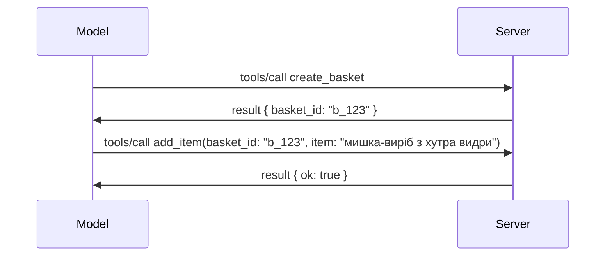

# Що змінюється в MCP: Кандидат у реліз 2026-07-28

> **Статус:** Кандидат у реліз. Специфікація `2026-07-28` на момент написання не є остаточною. Вона була оголошена 21 травня 2026 року і запланована до випуску 28 липня 2026 року. Усе, що описується в цьому уроці, стосується кандидата у реліз; перевіряйте [чернетку специфікації](https://modelcontextprotocol.io/specification/draft) та її [журнал змін](https://modelcontextprotocol.io/specification/draft/changelog) для отримання останнього статусу перед тим, як використовувати її. Решта цього курсу написана на основі поточного стабільного релізу, **Специфікація MCP 2025-11-25**, і буде оновлена після виходу `2026-07-28`.

## Огляд

`2026-07-28` — це найбільша ревізія MCP з моменту запуску. Шість Пропозицій покращень специфікації (SEPs) усувають сесії на рівні протоколу та роблять MCP безстанним на транспортному рівні, розширення стають першокласним, версіонованим механізмом, а кілька функцій, які ви вивчали раніше в цьому курсі (Roots, Sampling, Logging), позначені як застарілі відповідно до нової політики життєвого циклу. Цей урок підсумовує, що змінюється, чому це важливо і що це означає для коду, який ви вже написали для `2025-11-25`.

Джерело: [Кандидат у реліз специфікації MCP 2026-07-28](https://blog.modelcontextprotocol.io/posts/2026-07-28-release-candidate/) (блог Model Context Protocol, Девід Сорія Парра та Ден Делімарський).

## Цілі навчання

До кінця цього уроку ви зможете:

- Пояснити, чому MCP переходить до безстанного ядра протоколу і яку проблему це вирішує для горизонтального масштабування.
- Описати, як замінено рукостискання `initialize`/`initialized` і заголовок `Mcp-Session-Id`.
- Визначити нові заголовки `Mcp-Method` і `Mcp-Name` та метадані кешування `ttlMs`/`cacheScope`.
- Розпізнати фреймворк розширень і два розширення, що постачаються з цим релізом: MCP Apps і Tasks.
- Перерахувати шість SEP з авторизації, які посилюють узгодженість з OAuth 2.0 / OIDC.
- Визначити, які основні функції (Roots, Sampling, Logging) зараз застаріли, і що це означає на практиці.
- Пояснити зміну на повний JSON Schema 2020-12 для `inputSchema`/`outputSchema` інструментів.

## Безстанний протокол

Головна зміна: MCP стає безстанним на рівні протоколу.

### Раніше (2025-11-25): сесії прив’язують вас до одного екземпляру сервера

Виклик інструменту через Streamable HTTP починається з рукостискання `initialize`. Сервер відповідає заголовком `Mcp-Session-Id`, який має нести кожен подальший запит:

```http
POST /mcp HTTP/1.1
Mcp-Session-Id: 1868a90c-3a3f-4f5b
Content-Type: application/json

{"jsonrpc":"2.0","id":2,"method":"tools/call",
 "params":{"name":"search","arguments":{"q":"otters"}}}
```

Оскільки сесія прив’язана до того екземпляру сервера, який її видав, масштабовані горизонтально розгортання вимагають **sticky routing** на балансувальнику навантаження та **спільного сховища сесій** між екземплярами.

### Тепер (2026-07-28): кожен запит є самодостатнім

```http
POST /mcp HTTP/1.1
MCP-Protocol-Version: 2026-07-28
Mcp-Method: tools/call
Mcp-Name: search
Content-Type: application/json

{"jsonrpc":"2.0","id":1,"method":"tools/call",
 "params":{"name":"search","arguments":{"q":"otters"},
           "_meta":{"io.modelcontextprotocol/clientInfo":{"name":"my-app","version":"1.0"}}}}
```

Будь-який екземпляр сервера може обробити цей запит. Ключові зміни:

- **Рукостискання `initialize`/`initialized` видалено** ([SEP-2575](https://github.com/modelcontextprotocol/modelcontextprotocol/pull/2575)). Версія протоколу, інформація про клієнта та його можливості тепер переходять у `_meta` кожного запиту. Новий метод `server/discover` дозволяє клієнту заздалегідь отримати можливості сервера, коли він їх потребує.
- **Заголовок `Mcp-Session-Id` і сесія на рівні протоколу видалені** ([SEP-2567](https://github.com/modelcontextprotocol/modelcontextprotocol/pull/2567)). Sticky routing і спільні сховища сесій більше не потрібні на рівні протоколу.

### Безстанний протокол, станкові додатки

Видалення сесії на рівні протоколу не означає, що ваш сервер не може бути станковим. Рекомендується та сама модель, яку завжди використовували HTTP API: створіть явний хендл (наприклад, `basket_id`, `browser_id`) одним викликом інструменту, і дозвольте моделі передавати цей хендл назад як звичайний аргумент у наступних викликах.



Це робить стан видимим і зрозумілим для моделі замість того, щоб ховати його в метаданих транспорту, і дозволяє будь-якому екземпляру сервера обробляти будь-який виклик.

### Запити від сервера до клієнта, реорганізовані

Безстанному протоколу все ще потрібен спосіб, щоб сервер міг просити клієнта про щось під час виклику (наприклад, запит на введення):

- **Запити, ініційовані сервером, можуть надсилатися лише під час активної обробки запиту клієнта** ([SEP-2260](https://github.com/modelcontextprotocol/modelcontextprotocol/pull/2260)) — раніше це була рекомендація, тепер це обов’язкова умова. Користувача ніколи не запитують «ні з чого».
- **Багаторівневі запити (Multi Round-Trip Requests)** ([SEP-2322](https://github.com/modelcontextprotocol/modelcontextprotocol/pull/2322)) замінюють утримання відкритого SSE потоку. Замість цього сервер повертає `InputRequiredResult`:

  ```json
  {
    "resultType": "inputRequired",
    "inputRequests": {
      "confirm": {
        "type": "elicitation",
        "message": "Delete 3 files?",
        "schema": { "type": "boolean" }
      }
    },
    "requestState": "eyJzdGVwIjoxLCJmaWxlcyI6WyJhIiwiYiIsImMiXX0="
  }
  ```

  Клієнт збирає відповіді і повторно ініціює початковий виклик із `inputResponses` та ехо `requestState`. Будь-який екземпляр сервера може обробити повторний виклик, бо все потрібне є у корисному навантаженні.

### Можливість маршрутизації, кешування, трасування

Три невеликі зміни полегшують роботу з безстанним трафіком:

- **Заголовки `Mcp-Method` і `Mcp-Name` потрібні для Streamable HTTP** ([SEP-2243](https://github.com/modelcontextprotocol/modelcontextprotocol/pull/2243)), щоб балансувальники навантаження, шлюзи та лімітери могли маршрутизувати операцію без інспекції JSON тіла. Сервери відхиляють запити, де заголовки та тіло не погоджуються.
- **Результати `tools/list` і читання ресурсів несуть `ttlMs` та `cacheScope`** ([SEP-2549](https://github.com/modelcontextprotocol/modelcontextprotocol/pull/2549)), змодельовані на `Cache-Control` HTTP. Клієнти знають, як довго результат списку є свіжим і чи безпечно його ділити між користувачами без необхідності довготривалого SSE потоку для інформації про зміни.
- **Документовано поширення W3C Trace Context у `_meta`** ([SEP-414](https://github.com/modelcontextprotocol/modelcontextprotocol/pull/414)), виправляючи імена ключів `traceparent`, `tracestate` та `baggage`, щоб єдиний розподілений трейcинг міг відслідковувати виклик через SDK клієнта, сервер MCP і подальші системи у сумісному з [OpenTelemetry](https://opentelemetry.io/) бекенді.

## Розширення стають першокласними

Розширення існували неформально у `2025-11-25`. [SEP-2133](https://github.com/modelcontextprotocol/modelcontextprotocol/pull/2133) формалізує їх:

- Розширення ідентифікуються через ID зворотного DNS.
- Їх узгоджують через мапу `extensions` у можливостях клієнта та сервера.
- Вони існують у власних репозиторіях `ext-*` з делегованими підтримувачами і версіюються незалежно від основної специфікації.
- Новий трек розширень у процесі SEP дає їм шлях від експериментальних до офіційних.

Цей реліз постачає два офіційних розширення.

### MCP Apps: серверні інтерфейси користувача

[MCP Apps](https://blog.modelcontextprotocol.io/posts/2026-01-26-mcp-apps/) ([SEP-1865](https://github.com/modelcontextprotocol/modelcontextprotocol/pull/1865)) дозволяють серверам постачати інтерактивні HTML-інтерфейси, які хости відтворюють у sandbox iframe. Інструменти заявляють свої UI-шаблони заздалегідь, щоб хости могли попередньо завантажувати, кешувати та перевіряти їх безпеку перед запуском. Ви вже вивчали основи цього у [Уроці 15: MCP Apps](../03-GettingStarted/15-mcp-apps/README.md) — тепер MCP Apps формально є розширенням у рамках фреймворку розширень, а не експериментальною основною функцією.

### Tasks переходить у розширення

Tasks постачались як експериментальна основна функція у `2025-11-25`. Використання у виробництві виявило потребу в рішучій переробці, тож правильне місце для нього — розширення: [Tasks extension](https://github.com/modelcontextprotocol/modelcontextprotocol/pull/2663) переосмислює життєвий цикл навколо безстанної моделі — сервер може відповідати `tools/call` хендлом задачі, а клієнт керує нею через `tasks/get`, `tasks/update` та `tasks/cancel`. Створення задачі керується сервером: клієнт заявляє про наявність розширення, і сервер вирішує, коли виклик має виконуватись як задача. `tasks/list` повністю видалено, бо його не можна безпечно обмежити без сесій.

> **Примітка щодо міграції:** якщо ви імплементували експериментальний API Tasks `2025-11-25`, вам потрібно мігрувати до нового життєвого циклу розширення — він не сумісний з попередніми версіями.

## Посилення авторизації

Шість SEP посилюють [специфікацію авторизації](https://modelcontextprotocol.io/specification/draft/basic/authorization) для кращої узгодженості з реальними розгортаннями OAuth 2.0 / OpenID Connect:

| SEP | Зміна |
|---|---|
| [SEP-2468](https://github.com/modelcontextprotocol/modelcontextprotocol/pull/2468) | Клієнти мають перевіряти параметр `iss` у відповідях авторизації відповідно до [RFC 9207](https://www.rfc-editor.org/rfc/rfc9207), що зменшує ризик атак типу mix-up, поширених у одно-клієнтській, багато-серверній моделі MCP. Майбутня версія вимагатиме відхиляти відповіді без `iss`. |
| [SEP-837](https://github.com/modelcontextprotocol/modelcontextprotocol/pull/837) | Клієнти заявляють тип застосунку OpenID Connect `application_type` під час динамічної реєстрації клієнта, щоб уникнути того, що сервери авторизації за замовчуванням вважають десктоп/CLI клієнта `"web"` і відхиляють його localhost redirect URI. |
| [SEP-2352](https://github.com/modelcontextprotocol/modelcontextprotocol/pull/2352) | Клієнти прив’язують зареєстровані облікові дані до `issuer` сервера авторизації і повторно реєструються при міграції ресурсу між серверами авторизації. |
| [SEP-2207](https://github.com/modelcontextprotocol/modelcontextprotocol/pull/2207) | Документує, як запитувати refresh tokens у серверах авторизації в стилі OpenID Connect. |
| [SEP-2350](https://github.com/modelcontextprotocol/modelcontextprotocol/pull/2350) | Уточнює накопичення scope під час step-up авторизації. |
| [SEP-2351](https://github.com/modelcontextprotocol/modelcontextprotocol/pull/2351) | Уточнює суфікс відкриття `.well-known`. |

Якщо ви сьогодні будуєте сервер авторизації для MCP, починайте зараз надавати `iss` у відповідях авторизації — дивіться [02-Security](../02-Security/README.md) для поточних рекомендацій щодо авторизації, на яких це базуватиметься.

## Roots, Sampling і Logging позначено як застарілі

За новою [політикою життєвого циклу функцій](https://github.com/modelcontextprotocol/modelcontextprotocol/pull/2577) ([SEP-2577](https://github.com/modelcontextprotocol/modelcontextprotocol/pull/2577)) три основні примітиви клієнта, які ви опановували в [Основних поняттях](./README.md#roots), переводяться у статус **Застаріло**:

| Функція | Рекомендована заміна |
|---|---|
| Roots | Параметри інструменту, URI ресурсів або конфігурація сервера |
| Sampling | Пряма інтеграція з API провайдера LLM |
| Logging | `stderr` для stdio транспортів; OpenTelemetry для структурованої спостережуваності |

Це **лише застереження**: методи, типи та прапори можливостей працюватимуть у цьому релізі і у всіх версіях специфікації, опублікованих протягом року після нього. Повне видалення будь-якої з них вимагатиме окремого SEP згідно з політикою життєвого циклу — тож ваші існуючі приклади [Sampling](../03-GettingStarted/14-sampling/README.md) сьогодні не зламаються, але нові сервери мають віддавати перевагу наведеним вище замінникам.

## Повний JSON Schema 2020-12 для інструментів

`inputSchema` і `outputSchema` інструментів підняті до повного [JSON Schema 2020-12](https://json-schema.org/draft/2020-12) ([SEP-2106](https://github.com/modelcontextprotocol/modelcontextprotocol/pull/2106)):

- Вхідні схеми зберігають кореневе обмеження `type: "object"`, але тепер дозволяють композиції (`oneOf`, `anyOf`, `allOf`), умовні вирази та посилання (`$ref`, `$defs`).
- Вихідні схеми не обмежені, і `structuredContent` може бути будь-яким JSON значенням, а не лише об'єктом.
- Реалізації не повинні автоматично роздезервувати зовнішні URI `$ref` і мають обмежувати глибину схеми та час валідації (щоб уникнути DoS атак, якщо валідація відбувається на сервері).

Окремо, код помилки для відсутнього ресурсу змінюється з MCP-специфічного `-32002` на стандартний JSON-RPC `-32602` (Invalid Params) ([SEP-2164](https://github.com/modelcontextprotocol/modelcontextprotocol/pull/2164)). Якщо ваш клієнт спирається на точне значення `-32002`, вам потрібно оновити його.

## Як розвиватиметься протокол далі

Цей реліз містить порушення сумісності, які підтримувачі MCP не вважають нормою надалі. Три SEP з управління мають запобігти їх повторенню:

- **Політика життєвого циклу функцій** забезпечує шлях Активна → Застаріла → Видалена з мінімумом дванадцяти місяців між застарінням і можливим видаленням.
- **Фреймворк розширень** дає можливість новим можливостям випускатися як опціональні розширення і стабілізуватися там перед тим, як (якщо взагалі) увійти у основну специфікацію.

- Стандартний SEP трек не може досягти статусу Final, поки відповідний сценарій не з’явиться у [conformance suite](https://github.com/modelcontextprotocol/conformance) ([SEP-2484](https://github.com/modelcontextprotocol/modelcontextprotocol/pull/2484)) — того самого набору, згідно з яким оцінюються офіційні SDK у [SDK tier system](https://github.com/modelcontextprotocol/modelcontextprotocol/pull/1777).

## Графік випуску та валідація

- Кандидат на реліз був зафіксований 21 травня 2026.
- Остаточна специфікація запланована на 28 липня 2026.
- Десятивіконне вікно між цими датами дає змогу розробникам SDK і клієнтським імплементаціям перевірити зміни на реальних навантаженнях; очікується, що Tier 1 SDK підтримку в цьому вікні під системою [SDK tier system](https://modelcontextprotocol.io/docs/sdk) надаватимуть.
- Відслідковуйте повний набір змін у [чернетці специфікації](https://modelcontextprotocol.io/specification/draft) та її [журналі змін](https://modelcontextprotocol.io/specification/draft/changelog).

## Що це означає для цього курсу

Усе, що ви вивчили на цьому курсі, орієнтоване на **2025-11-25**, який залишається поточною стабільною версією специфікації до випуску `2026-07-28`. Конкретно:

- **Сесії та рукопотискання `initialize`** (розглянуті в [Core Concepts](./README.md) та [Lesson 6: HTTP Streaming](../03-GettingStarted/06-http-streaming/README.md)) досі працюють, як задокументовано сьогодні, але очікуйте їх заміни на безстанкову модель запитів після оновлення до сумісних із `2026-07-28` SDK.
- **Sampling та Roots** (також розглянуті в [Core Concepts](./README.md)) залишаються повністю функціональними, але застарілими — нові дизайни повинні віддавати перевагу вказаним вище моделям заміни.
- **Експериментальна функція Tasks**, якщо ви її використовували, потребуватиме міграції до нового життєвого циклу розширення Tasks.
- **MCP Apps** ([Lesson 15](../03-GettingStarted/15-mcp-apps/README.md)) фактично не змінюється; воно просто переходить під офіційну структуру Extensions.

## Додаткові ресурси

- [Кандидат на реліз специфікації MCP 2026-07-28 (блог)](https://blog.modelcontextprotocol.io/posts/2026-07-28-release-candidate/)
- [Майбутнє MCP Transports](https://blog.modelcontextprotocol.io/posts/2025-12-19-mcp-transport-future/)
- [MCP Чернетка специфікації](https://modelcontextprotocol.io/specification/draft)
- [MCP Журнал змін чернетки](https://modelcontextprotocol.io/specification/draft/changelog)
- [Настанови SEP](https://modelcontextprotocol.io/community/sep-guidelines)
- [Система рівнів MCP SDK](https://modelcontextprotocol.io/docs/sdk)

## Наступні кроки

Поверніться до [Core Concepts](./README.md) або продовжуйте до [Security](../02-Security/README.md), щоб побачити, як керівництво версії `2025-11-25` накладається на майбутні зміни.

---

<!-- CO-OP TRANSLATOR DISCLAIMER START -->
**Відмова від відповідальності**:
Цей документ було перекладено за допомогою сервісу штучного інтелекту для перекладу [Co-op Translator](https://github.com/Azure/co-op-translator). Хоча ми прагнемо до точності, будь ласка, майте на увазі, що автоматичні переклади можуть містити помилки або неточності. Оригінальний документ рідною мовою слід вважати авторитетним джерелом. Для критично важливої інформації рекомендується професійний людський переклад. Ми не несемо відповідальності за будь-які непорозуміння або неправильні тлумачення, що виникли внаслідок використання цього перекладу.
<!-- CO-OP TRANSLATOR DISCLAIMER END -->