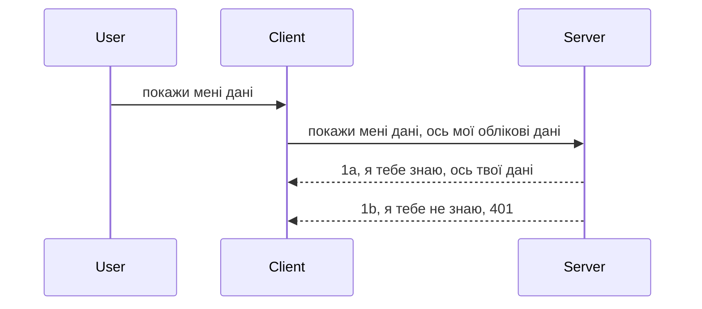

# Проста аутентифікація

SDK MCP підтримують використання OAuth 2.1, що, чесно кажучи, є досить складним процесом, який включає поняття, такі як сервер аутентифікації, сервер ресурсів, надсилання облікових даних, отримання коду, обмін коду на токен носія, доки ви нарешті не отримаєте доступ до ваших ресурсів. Якщо ви не звикли до OAuth, що чудово реалізовувати, варто почати з базового рівня аутентифікації та поступово будувати кращу і кращу безпеку. Саме тому існує цей розділ — щоб допомогти вам перейти до більш складної аутентифікації.

## Що ми маємо на увазі під аутентифікацією?

Аутентифікація — це скорочення від аутентифікації та авторизації. Ідея в тому, що нам потрібно зробити дві речі:

- **Аутентифікація**, що означає процес визначення, чи дозволити людині увійти до нашого будинку, чи має вона право бути "тут", тобто мати доступ до нашого сервера ресурсів, де знаходяться функції нашого MCP Server.
- **Авторизація** — це процес визначення, чи повинен користувач мати доступ до конкретних ресурсів, які він запитує, наприклад, ці замовлення чи ці продукти, або чи дозволено лише читання контенту, але не видалення, як інший приклад.

## Облікові дані: як ми повідомляємо систему, хто ми

Більшість веб-розробників починають думати у термінах надання серверу облікових даних, зазвичай секрету, який підтверджує, чи дозволено їм бути тут ("Аутентифікація"). Зазвичай ці облікові дані — це base64-кодована версія імені користувача та пароля або API-ключ, що унікально ідентифікує конкретного користувача.

Це передається через заголовок під назвою "Authorization" так:

```json
{ "Authorization": "secret123" }
```

Це зазвичай називають базовою аутентифікацією. Як відбувається загальний процес:



Тепер, коли ми розуміємо, як це працює з огляду на процес, як це реалізувати? Більшість веб-серверів мають поняття проміжного програмного забезпечення (middleware), шматок коду, який запускається в рамках запиту, може перевірити облікові дані і, якщо вони валідні, дозволити запиту пройти. Якщо немає валідних облікових даних, з'явиться помилка аутентифікації. Дивимось, як це можна реалізувати:

**Python**

```python
class AuthMiddleware(BaseHTTPMiddleware):
    async def dispatch(self, request, call_next):

        has_header = request.headers.get("Authorization")
        if not has_header:
            print("-> Missing Authorization header!")
            return Response(status_code=401, content="Unauthorized")

        if not valid_token(has_header):
            print("-> Invalid token!")
            return Response(status_code=403, content="Forbidden")

        print("Valid token, proceeding...")
       
        response = await call_next(request)
        # додайте будь-які користувацькі заголовки або змініть відповідь якимось чином
        return response


starlette_app.add_middleware(CustomHeaderMiddleware)
```

Тут ми маємо:

- Створили middleware `AuthMiddleware`, де викликається метод `dispatch` веб-сервером.
- Додали middleware до веб-сервера:

    ```python
    starlette_app.add_middleware(AuthMiddleware)
    ```

- Написали логіку перевірки, чи присутній заголовок Authorization і чи секрет дійсний:

    ```python
    has_header = request.headers.get("Authorization")
    if not has_header:
        print("-> Missing Authorization header!")
        return Response(status_code=401, content="Unauthorized")

    if not valid_token(has_header):
        print("-> Invalid token!")
        return Response(status_code=403, content="Forbidden")
    ```

    якщо секрет присутній і дійсний, дозволяємо запиту пройти, викликаючи `call_next` і повертаємо відповідь.

    ```python
    response = await call_next(request)
    # додати будь-які користувацькі заголовки або змінити відповідь будь-яким чином
    return response
    ```

Як це працює: якщо запит приходить до веб-сервера, викликається middleware, який, залежно від реалізації, або пропускає запит, або повертає помилку, що клієнту відмовлено в доступі.

**TypeScript**

Тут ми створюємо middleware з популярним фреймворком Express, перехоплюємо запит до того, як він дійде до MCP Server. Ось код:

```typescript
function isValid(secret) {
    return secret === "secret123";
}

app.use((req, res, next) => {
    // 1. Чи присутній заголовок авторизації?
    if(!req.headers["Authorization"]) {
        res.status(401).send('Unauthorized');
    }
    
    let token = req.headers["Authorization"];

    // 2. Перевірте дійсність.
    if(!isValid(token)) {
        res.status(403).send('Forbidden');
    }

   
    console.log('Middleware executed');
    // 3. Передає запит до наступного кроку в конвеєрі запитів.
    next();
});
```

У цьому коді ми:

1. Перевіряємо, чи присутній заголовок Authorization, якщо ні — відправляємо помилку 401.
2. Переконуємося, що облікові дані/токен дійсні, якщо ні — надсилаємо помилку 403.
3. Врешті пропускаємо запит далі по ланцюжку та повертаємо запитаний ресурс.

## Вправа: реалізуйте аутентифікацію

Візьмемо наші знання і спробуємо реалізувати. План:

Сервер

- Створити веб-сервер та інстанс MCP.
- Реалізувати middleware для сервера.

Клієнт

- Надіслати веб-запит з обліковими даними через заголовок.

### -1- Створити веб-сервер та інстанс MCP

> **З поглядом уперед:** наведений нижче приклад TypeScript відстежує HTTP-транспорти в мапі `transports`, ключ якої `mcp-session-id`, згідно з **MCP Specification 2025-11-25**. Реліз-кандидат `2026-07-28` прибирає процедуру рукопотиску `initialize` та ідентифікатор сесії, тому ця мапа для кожної сесії більше не використовується і переходить у безстанову, самодостатню модель запитів. Деталі дивіться у [Що змінюється в MCP: реліз-кандидат 2026-07-28](../../01-CoreConcepts/mcp-2026-07-28-release-candidate.md).

На першому кроці потрібно створити інстанс веб-сервера та MCP Server.

**Python**

Ми створюємо інстанс MCP server, створюємо веб-застосунок starlette і запускаємо його за допомогою uvicorn.

```python
# створення MCP сервера

app = FastMCP(
    name="MCP Resource Server",
    instructions="Resource Server that validates tokens via Authorization Server introspection",
    host=settings["host"],
    port=settings["port"],
    debug=True
)

# створення веб-додатку starlette
starlette_app = app.streamable_http_app()

# запуск додатку через uvicorn
async def run(starlette_app):
    import uvicorn
    config = uvicorn.Config(
            starlette_app,
            host=app.settings.host,
            port=app.settings.port,
            log_level=app.settings.log_level.lower(),
        )
    server = uvicorn.Server(config)
    await server.serve()

run(starlette_app)
```

У цьому коді ми:

- Створили MCP Server.
- Сконструювали starlette веб-застосунок з MCP Server за допомогою `app.streamable_http_app()`.
- Хостимо та сервимо веб-застосунок за допомогою uvicorn `server.serve()`.

**TypeScript**

Створюємо інстанс MCP Server.

```typescript
const server = new McpServer({
      name: "example-server",
      version: "1.0.0"
    });

    // ... налаштувати ресурси сервера, інструменти та підказки ...
```

Створення MCP Server має відбуватися у визначенні маршруту POST /mcp, тож візьмемо код вище і перемістимо так:

```typescript
import express from "express";
import { randomUUID } from "node:crypto";
import { McpServer } from "@modelcontextprotocol/sdk/server/mcp.js";
import { StreamableHTTPServerTransport } from "@modelcontextprotocol/sdk/server/streamableHttp.js";
import { isInitializeRequest } from "@modelcontextprotocol/sdk/types.js"

const app = express();
app.use(express.json());

// Карта для збереження транспортів за ідентифікатором сесії
const transports: { [sessionId: string]: StreamableHTTPServerTransport } = {};

// Обробка POST-запитів для клієнт-серверної комунікації
app.post('/mcp', async (req, res) => {
  // Перевірка наявності існуючого ідентифікатора сесії
  const sessionId = req.headers['mcp-session-id'] as string | undefined;
  let transport: StreamableHTTPServerTransport;

  if (sessionId && transports[sessionId]) {
    // Повторне використання існуючого транспорту
    transport = transports[sessionId];
  } else if (!sessionId && isInitializeRequest(req.body)) {
    // Новий запит на ініціалізацію
    transport = new StreamableHTTPServerTransport({
      sessionIdGenerator: () => randomUUID(),
      onsessioninitialized: (sessionId) => {
        // Збереження транспорту за ідентифікатором сесії
        transports[sessionId] = transport;
      },
      // Захист від DNS rebinding за замовчуванням вимкнено для збереження сумісності з попередніми версіями. Якщо ви запускаєте цей сервер
      // локально, переконайтеся, що встановили:
      // enableDnsRebindingProtection: true,
      // allowedHosts: ['127.0.0.1'],
    });

    // Очистка транспорту при його закритті
    transport.onclose = () => {
      if (transport.sessionId) {
        delete transports[transport.sessionId];
      }
    };
    const server = new McpServer({
      name: "example-server",
      version: "1.0.0"
    });

    // ... налаштування ресурсів сервера, інструментів та підказок ...

    // Підключення до сервера MCP
    await server.connect(transport);
  } else {
    // Неправильний запит
    res.status(400).json({
      jsonrpc: '2.0',
      error: {
        code: -32000,
        message: 'Bad Request: No valid session ID provided',
      },
      id: null,
    });
    return;
  }

  // Обробка запиту
  await transport.handleRequest(req, res, req.body);
});

// Повторно використовуваний обробник для GET та DELETE запитів
const handleSessionRequest = async (req: express.Request, res: express.Response) => {
  const sessionId = req.headers['mcp-session-id'] as string | undefined;
  if (!sessionId || !transports[sessionId]) {
    res.status(400).send('Invalid or missing session ID');
    return;
  }
  
  const transport = transports[sessionId];
  await transport.handleRequest(req, res);
};

// Обробка GET-запитів для серверних повідомлень клієнту через SSE
app.get('/mcp', handleSessionRequest);

// Обробка DELETE-запитів для завершення сесії
app.delete('/mcp', handleSessionRequest);

app.listen(3000);
```

Тепер видно, що створення MCP Server перенесено всередину `app.post("/mcp")`.

Переходимо до наступного кроку — створення middleware для перевірки облікових даних.

### -2- Реалізувати middleware для сервера

Переходимо до частини з middleware. Тут ми створимо middleware, який шукатиме облікові дані у заголовку `Authorization` і перевірятиме їх. Якщо все прийнятно — запит продовжить виконання, роблячи потрібну дію (наприклад, список інструментів, читання ресурсу чи будь-яку функціональність MCP, яку запитував клієнт).

**Python**

Щоб створити middleware, треба створити клас, який наслідується від `BaseHTTPMiddleware`. Є два важливі параметри:

- Запит `request`, з якого ми зчитуємо інформацію з заголовків.
- `call_next` — функція зворотного виклику, яку треба викликати, якщо облікові дані прийнятні.

Спершу треба обробити випадок, якщо заголовок `Authorization` відсутній:

```python
has_header = request.headers.get("Authorization")

# заголовок відсутній, відмова з 401, інакше продовжити.
if not has_header:
    print("-> Missing Authorization header!")
    return Response(status_code=401, content="Unauthorized")
```

Тут ми відправляємо 401 unauthorized, бо клієнт не пройшов аутентифікацію.

Далі, якщо були подані облікові дані, перевіримо їх на валідність так:

```python
 if not valid_token(has_header):
    print("-> Invalid token!")
    return Response(status_code=403, content="Forbidden")
```

Зверніть увагу, що тут надсилається 403 forbidden. Ось повний middleware вище описаного функціоналу:

```python
class AuthMiddleware(BaseHTTPMiddleware):
    async def dispatch(self, request, call_next):

        has_header = request.headers.get("Authorization")
        if not has_header:
            print("-> Missing Authorization header!")
            return Response(status_code=401, content="Unauthorized")

        if not valid_token(has_header):
            print("-> Invalid token!")
            return Response(status_code=403, content="Forbidden")

        print("Valid token, proceeding...")
        print(f"-> Received {request.method} {request.url}")
        response = await call_next(request)
        response.headers['Custom'] = 'Example'
        return response

```

Добре, а як же функція `valid_token`? Ось вона:

```python
# НЕ використовувати в продакшені - покращуйте !!
def valid_token(token: str) -> bool:
    # видалити префікс "Bearer "
    if token.startswith("Bearer "):
        token = token[7:]
        return token == "secret-token"
    return False
```

Очевидно, що це треба покращити.

ВАЖЛИВО: НІКОЛИ не зберігайте секрети у коді. Ідеально отримувати значення для порівняння з бази даних або з провайдера ідентичності (IDP) або, що ще краще, довірити валідацію самому IDP.

**TypeScript**

Для реалізації в Express треба викликати метод `use`, який приймає функції middleware.

Потрібно:

- Обробляти об'єкт запиту, щоб перевірити передані облікові дані у властивості `Authorization`.
- Перевірити облікові дані і, якщо вони прийнятні, дати запиту продовжити виконання і клієнт отримає запитаний MCP ресурс.

Тут перевіряємо, чи присутній заголовок `Authorization`, якщо ні — зупиняємо запит і відправляємо:

```typescript
if(!req.headers["authorization"]) {
    res.status(401).send('Unauthorized');
    return;
}
```

Якщо заголовок не був надісланий, отримуєте 401.

Далі перевіряємо валідність облікових даних, якщо ні — знову зупиняємо запит, але з іншим повідомленням:

```typescript
if(!isValid(token)) {
    res.status(403).send('Forbidden');
    return;
} 
```

Зверніть увагу, що тут повертається помилка 403.

Ось повний код:

```typescript
app.use((req, res, next) => {
    console.log('Request received:', req.method, req.url, req.headers);
    console.log('Headers:', req.headers["authorization"]);
    if(!req.headers["authorization"]) {
        res.status(401).send('Unauthorized');
        return;
    }
    
    let token = req.headers["authorization"];

    if(!isValid(token)) {
        res.status(403).send('Forbidden');
        return;
    }  

    console.log('Middleware executed');
    next();
});
```

Ми налаштували веб-сервер на прийом middleware для перевірки облікових даних, що клієнт, сподіваємось, надсилає. А як щодо самого клієнта?

### -3- Надіслати веб-запит із обліковими даними через заголовок

Треба забезпечити, щоб клієнт передавав облікові дані через заголовок. Оскільки ми будемо використовувати MCP клієнт, треба дізнатися, як це зробити.

**Python**

Для клієнта треба передати заголовок з обліковими даними так:

```python
# НЕ прописуйте значення жорстко, мінімум збережіть його у змінній середовища або більш безпечному сховищі
token = "secret-token"

async with streamablehttp_client(
        url = f"http://localhost:{port}/mcp",
        headers = {"Authorization": f"Bearer {token}"}
    ) as (
        read_stream,
        write_stream,
        session_callback,
    ):
        async with ClientSession(
            read_stream,
            write_stream
        ) as session:
            await session.initialize()
      
            # TODO, що ви хочете зробити на клієнті, наприклад перелічити інструменти, викликати інструменти тощо.
```

Зверніть увагу, як заповнюємо властивість `headers`: `headers = {"Authorization": f"Bearer {token}"}`.

**TypeScript**

Це можна зробити у два кроки:

1. Заповнити конфігураційний об'єкт обліковими даними.
2. Передати цей об'єкт у транспорт.

```typescript

// НЕ жорстко кодуйте значення, як показано тут. Мінімум зробіть це змінною оточення і використовуйте щось на кшталт dotenv (у режимі розробки).
let token = "secret123"

// визначте обʼєкт параметрів транспортного клієнта
let options: StreamableHTTPClientTransportOptions = {
  sessionId: sessionId,
  requestInit: {
    headers: {
      "Authorization": "secret123"
    }
  }
};

// передайте обʼєкт параметрів до транспорту
async function main() {
   const transport = new StreamableHTTPClientTransport(
      new URL(serverUrl),
      options
   );
```

Вище видно, що треба було створити об'єкт `options` та розмістити заголовки у властивість `requestInit`.

ВАЖЛИВО: Як же покращити цю реалізацію? Нинішня реалізація має недоліки. По-перше, передача облікових даних таким чином досить ризикована без HTTPS. Навіть з HTTPS облікові дані можуть бути вкрадені, тому потрібна система, що дозволяє легко скасовувати токен, додаючи перевірки, звідки надходить запит, чи не надто часто він надсилається (помилкові дії ботів) — коротко кажучи, багато різних запобіжних заходів.

Проте цей метод є гарним початком для дуже простих API, де ви не хочете, щоб будь-хто міг викликати ваш API без аутентифікації.

Тож давайте спробуємо підвищити безпеку, використовуючи стандартизований формат, як JSON Web Token, відомий ще як JWT або "JOT" токени.

## JSON Web Tokens, JWT

Отже, ми хочемо покращити відправлення дуже простих облікових даних. Які ж основні переваги від використання JWT?

- **Покращення безпеки**. У базовій аутентифікації Ви надсилаєте ім’я користувача та пароль у вигляді base64-кодованого токена (або API ключ) багаторазово, що підвищує ризик. З JWT ви спочатку надсилаєте ім’я користувача та пароль, отримуєте токен у відповідь, який має час дії (закінчується через певний час). JWT дозволяє легко застосовувати контроль доступу з деталізацією по ролях, обсягах і дозволах.
- **Безстаність і масштабованість**. JWT є самодостатніми: вони містять всю інформацію про користувача, усуваючи необхідність зберігати сесії на сервері. Токен можна перевіряти локально.
- **Інтероперабельність і федерація**. JWT є основою Open ID Connect і використовується з відомими провайдерами ідентичності, такими як Entra ID, Google Identity та Auth0. Вони також дають змогу використовувати єдиний вхід (SSO) і багато інших особливостей корпоративного рівня.
- **Модульність і гнучкість**. JWT можна використовувати з API шлюзами як Azure API Management, NGINX тощо. Вони підтримують сценарії аутентифікації користувачів і серверів, включно з імпсонацією та делегацією.
- **Продуктивність і кешування**. JWT можна кешувати після розшифровки, що знижує необхідність повторного парсингу. Це допомагає особливо високонавантаженим застосункам, покращуючи пропускну здатність і зменшуючи навантаження на інфраструктуру.
- **Розвинуті можливості**. Підтримуються інспекція (перевірка валідності на сервері) та відкликання (роблення токена недійсним).

Отже, давайте подивимося, як підняти нашу реалізацію на цей рівень.

## Перетворення базової аутентифікації на JWT

Зміни, які треба зробити на високому рівні:

- **Навчитися створювати JWT токен**, готовий для відправлення від клієнта до сервера.
- **Перевіряти JWT токен**, і якщо він валідний, надавати клієнту доступ до ресурсів.
- **Безпечне зберігання токена**. Як ми зберігатимемо цей токен.
- **Захист маршрутів**. Потрібно захистити маршрути, конкретно захистити роутинг MCP і його функції.
- **Додати токени оновлення (refresh tokens)**. Створювати короткоживучі токени з довгоживучими токенами обновлення, які можна використовувати для отримання нових токенів при спливанні терміну дії. Забезпечити ендпоінт для оновлення і стратегію ротації.

### -1- Створення JWT токена

Перш за все, JWT токен має такі частини:

- **Заголовок**, алгоритм та тип токена.
- **Корисне навантаження (payload)**, заяви (claims) як `sub` (користувач або суб’єкт, якого представляє токен; у випадку аутентифікації це зазвичай ідентифікатор користувача), `exp` (час закінчення дії), роль (role).
- **Підпис**, підписаний секретним або приватним ключем.

Для цього треба створити заголовок, payload і закодований токен.

**Python**

```python

import jwt
import jwt
from jwt.exceptions import ExpiredSignatureError, InvalidTokenError
import datetime

# Секретний ключ, який використовується для підпису JWT
secret_key = 'your-secret-key'

header = {
    "alg": "HS256",
    "typ": "JWT"
}

# інформація про користувача та його претензії і час закінчення дії
payload = {
    "sub": "1234567890",               # Суб'єкт (ID користувача)
    "name": "User Userson",                # Користувацька претензія
    "admin": True,                     # Користувацька претензія
    "iat": datetime.datetime.utcnow(),# Видано о
    "exp": datetime.datetime.utcnow() + datetime.timedelta(hours=1)  # Час закінчення дії
}

# закодувати це
encoded_jwt = jwt.encode(payload, secret_key, algorithm="HS256", headers=header)
```

У наведеному коді ми:

- Визначили заголовок з алгоритмом HS256 і типом JWT.
- Створили payload з ідентифікатором користувача (subject), іменем, роллю, часом видачі та терміном дії, реалізувавши тим самим обмеження часу.

**TypeScript**

Тут нам знадобляться залежності, що допоможуть створити JWT токен.

Залежності

```sh

npm install jsonwebtoken
npm install --save-dev @types/jsonwebtoken
```

Тепер, коли це є, створимо заголовок, payload і, на їх основі, закодований токен.

```typescript
import jwt from 'jsonwebtoken';

const secretKey = 'your-secret-key'; // Використовуйте змінні оточення у продакшені

// Визначте корисне навантаження
const payload = {
  sub: '1234567890',
  name: 'User usersson',
  admin: true,
  iat: Math.floor(Date.now() / 1000), // Час видачі
  exp: Math.floor(Date.now() / 1000) + 60 * 60 // Терміни дії 1 година
};

// Визначте заголовок (необов’язково, jsonwebtoken встановлює значення за замовчуванням)
const header = {
  alg: 'HS256',
  typ: 'JWT'
};

// Створити токен
const token = jwt.sign(payload, secretKey, {
  algorithm: 'HS256',
  header: header
});

console.log('JWT:', token);
```

Цей токен:

Підписаний з використанням HS256
Дійсний протягом 1 години
Має такі заяви: sub, name, admin, iat, exp.

### -2- Перевірка токена

Нам також потрібно перевіряти токен, це слід робити на сервері, щоб переконатися, що те, що клієнт надсилає, є справжнім і валідним. Тут має відбуватися багато перевірок: перевірка структури, валідності. Рекомендується також додати інші перевірки — чи є користувач у системі тощо.

Для перевірки треба декодувати токен, щоб прочитати його, а потім почати перевірку валідності:

**Python**

```python

# Розкодовано та перевірено JWT
try:
    decoded = jwt.decode(token, secret_key, algorithms=["HS256"])
    print("✅ Token is valid.")
    print("Decoded claims:")
    for key, value in decoded.items():
        print(f"  {key}: {value}")
except ExpiredSignatureError:
    print("❌ Token has expired.")
except InvalidTokenError as e:
    print(f"❌ Invalid token: {e}")

```


У цьому коді ми викликаємо `jwt.decode`, використовуючи токен, секретний ключ та обраний алгоритм як вхідні дані. Зверніть увагу, що ми використовуємо конструкцію try-catch, оскільки неправильна валідація призводить до виникнення помилки.

**TypeScript**

Тут нам потрібно викликати `jwt.verify`, щоб отримати декодовану версію токена, яку ми можемо далі аналізувати. Якщо цей виклик не вдається, це означає, що структура токена неправильна або він більше не є дійсним.

```typescript

try {
  const decoded = jwt.verify(token, secretKey);
  console.log('Decoded Payload:', decoded);
} catch (err) {
  console.error('Token verification failed:', err);
}
```

NOTE: як вже зазначалося раніше, ми повинні здійснювати додаткові перевірки, щоб переконатися, що цей токен вказує на користувача у нашій системі та що користувач має права, які він заявляє.

Далі розглянемо контроль доступу на основі ролей, також відомий як RBAC.

## Додавання контролю доступу на основі ролей

Ідея полягає в тому, що ми хочемо виразити, що різні ролі мають різні права. Наприклад, ми припускаємо, що адміністратор може робити все, звичайний користувач може читати/записувати, а гість лише читати. Отже, ось деякі можливі рівні дозволів:

- Admin.Write 
- User.Read
- Guest.Read

Подивімося, як ми можемо реалізувати такий контроль за допомогою проміжного програмного забезпечення (middleware). Middleware можна додавати для окремих маршрутів та для всіх маршрутів загалом.

**Python**

```python
from starlette.middleware.base import BaseHTTPMiddleware
from starlette.responses import JSONResponse
import jwt

# НЕ ЗАЛИШАЙТЕ секрет у коді, це лише для демонстраційних цілей. Зчитайте його з безпечного місця.
SECRET_KEY = "your-secret-key" # помістіть це в змінну середовища
REQUIRED_PERMISSION = "User.Read"

class JWTPermissionMiddleware(BaseHTTPMiddleware):
    async def dispatch(self, request, call_next):
        auth_header = request.headers.get("Authorization")
        if not auth_header or not auth_header.startswith("Bearer "):
            return JSONResponse({"error": "Missing or invalid Authorization header"}, status_code=401)

        token = auth_header.split(" ")[1]
        try:
            decoded = jwt.decode(token, SECRET_KEY, algorithms=["HS256"])
        except jwt.ExpiredSignatureError:
            return JSONResponse({"error": "Token expired"}, status_code=401)
        except jwt.InvalidTokenError:
            return JSONResponse({"error": "Invalid token"}, status_code=401)

        permissions = decoded.get("permissions", [])
        if REQUIRED_PERMISSION not in permissions:
            return JSONResponse({"error": "Permission denied"}, status_code=403)

        request.state.user = decoded
        return await call_next(request)


```

Є кілька різних способів додати middleware, як показано нижче:

```python

# Варіант 1: додати проміжне програмне забезпечення під час створення додатку starlette
middleware = [
    Middleware(JWTPermissionMiddleware)
]

app = Starlette(routes=routes, middleware=middleware)

# Варіант 2: додати проміжне програмне забезпечення після того, як додаток starlette вже створено
starlette_app.add_middleware(JWTPermissionMiddleware)

# Варіант 3: додати проміжне програмне забезпечення для кожного маршруту
routes = [
    Route(
        "/mcp",
        endpoint=..., # обробник
        middleware=[Middleware(JWTPermissionMiddleware)]
    )
]
```

**TypeScript**

Ми можемо використовувати `app.use` та middleware, яке буде виконуватися для всіх запитів.

```typescript
app.use((req, res, next) => {
    console.log('Request received:', req.method, req.url, req.headers);
    console.log('Headers:', req.headers["authorization"]);

    // 1. Перевірте, чи було надіслано заголовок авторизації

    if(!req.headers["authorization"]) {
        res.status(401).send('Unauthorized');
        return;
    }
    
    let token = req.headers["authorization"];

    // 2. Перевірте, чи є токен дійсним
    if(!isValid(token)) {
        res.status(403).send('Forbidden');
        return;
    }  

    // 3. Перевірте, чи існує користувач токена в нашій системі
    if(!isExistingUser(token)) {
        res.status(403).send('Forbidden');
        console.log("User does not exist");
        return;
    }
    console.log("User exists");

    // 4. Перевірте, чи має токен правильні дозволи
    if(!hasScopes(token, ["User.Read"])){
        res.status(403).send('Forbidden - insufficient scopes');
    }

    console.log("User has required scopes");

    console.log('Middleware executed');
    next();
});

```

Є кілька речей, які ми можемо і повинні дозволити нашому middleware зробити, а саме:

1. Перевірити, чи є заголовок авторизації
2. Перевірити, чи є токен дійсним, ми викликаємо `isValid` — метод, який ми написали, що перевіряє цілісність і дійсність JWT токена.
3. Перевірити, чи існує користувач у нашій системі, це потрібно перевірити.

   ```typescript
    // користувачі в базі даних
   const users = [
     "user1",
     "User usersson",
   ]

   function isExistingUser(token) {
     let decodedToken = verifyToken(token);

     // TODO, перевірити, чи користувач існує в базі даних
     return users.includes(decodedToken?.name || "");
   }
   ```

   Вище ми створили дуже простий список `users`, який, очевидно, повинен бути у базі даних.

4. Додатково ми також повинні перевірити, чи має токен правильні дозволи.

   ```typescript
   if(!hasScopes(token, ["User.Read"])){
        res.status(403).send('Forbidden - insufficient scopes');
   }
   ```

   У цьому коді middleware ми перевіряємо, що токен містить дозвіл User.Read, якщо ні — відправляємо помилку 403. Нижче наведений допоміжний метод `hasScopes`.

   ```typescript
   function hasScopes(scope: string, requiredScopes: string[]) {
     let decodedToken = verifyToken(scope);
    return requiredScopes.every(scope => decodedToken?.scopes.includes(scope));
  }
   ```

Have a think which additional checks you should be doing, but these are the absolute minimum of checks you should be doing.

Using Express as a web framework is a common choice. There are helpers library when you use JWT so you can write less code.

- `express-jwt`, helper library that provides a middleware that helps decode your token.
- `express-jwt-permissions`, this provides a middleware `guard` that helps check if a certain permission is on the token.

Here's what these libraries can look like when used:

```typescript
const express = require('express');
const jwt = require('express-jwt');
const guard = require('express-jwt-permissions')();

const app = express();
const secretKey = 'your-secret-key'; // put this in env variable

// Decode JWT and attach to req.user
app.use(jwt({ secret: secretKey, algorithms: ['HS256'] }));

// Check for User.Read permission
app.use(guard.check('User.Read'));

// multiple permissions
// app.use(guard.check(['User.Read', 'Admin.Access']));

app.get('/protected', (req, res) => {
  res.json({ message: `Welcome ${req.user.name}` });
});

// Error handler
app.use((err, req, res, next) => {
  if (err.code === 'permission_denied') {
    return res.status(403).send('Forbidden');
  }
  next(err);
});

```

Тепер ви побачили, як middleware може бути використане для автентифікації та авторизації. А як щодо MCP? Чи змінює це спосіб автентифікації? Давайте дізнаємося в наступному розділі.

### -3- Додати RBAC до MCP

Ви бачили, як можна додати RBAC через middleware, проте для MCP немає простого способу додати RBAC для кожної функції MCP, тож що робити? Просто потрібно додати код, який перевіряє, чи має клієнт право викликати конкретний інструмент:

У вас є кілька варіантів, як реалізувати RBAC для кожної функції, ось деякі з них:

- Додати перевірку для кожного інструмента, ресурсу, запиту, де потрібно перевірити рівень дозволу.

   **python**

   ```python
   @tool()
   def delete_product(id: int):
      try:
          check_permissions(role="Admin.Write", request)
      catch:
        pass # клієнт не пройшов авторизацію, викликати помилку авторизації
   ```

   **typescript**

   ```typescript
   server.registerTool(
    "delete-product",
    {
      title: Delete a product",
      description: "Deletes a product",
      inputSchema: { id: z.number() }
    },
    async ({ id }) => {
      
      try {
        checkPermissions("Admin.Write", request);
        // зробити, надіслати ідентифікатор до productService та віддаленого запису
      } catch(Exception e) {
        console.log("Authorization error, you're not allowed");  
      }

      return {
        content: [{ type: "text", text: `Deletected product with id ${id}` }]
      };
    }
   );
   ```


- Використати розширений підхід сервера і обробників запитів, щоб мінімізувати кількість місць, де потрібна перевірка.

   **Python**

   ```python
   
   tool_permission = {
      "create_product": ["User.Write", "Admin.Write"],
      "delete_product": ["Admin.Write"]
   }

   def has_permission(user_permissions, required_permissions) -> bool:
      # user_permissions: список дозволів, які має користувач
      # required_permissions: список дозволів, необхідних для інструменту
      return any(perm in user_permissions for perm in required_permissions)

   @server.call_tool()
   async def handle_call_tool(
     name: str, arguments: dict[str, str] | None
   ) -> list[types.TextContent]:
    # Припустимо, request.user.permissions — це список дозволів користувача
     user_permissions = request.user.permissions
     required_permissions = tool_permission.get(name, [])
     if not has_permission(user_permissions, required_permissions):
        # Викликати помилку "У вас немає дозволу викликати інструмент {name}"
        raise Exception(f"You don't have permission to call tool {name}")
     # продовжити та викликати інструмент
     # ...
   ```   
   

   **TypeScript**

   ```typescript
   function hasPermission(userPermissions: string[], requiredPermissions: string[]): boolean {
       if (!Array.isArray(userPermissions) || !Array.isArray(requiredPermissions)) return false;
       // Повертає true, якщо користувач має принаймні один необхідний дозвіл
       
       return requiredPermissions.some(perm => userPermissions.includes(perm));
   }
  
   server.setRequestHandler(CallToolRequestSchema, async (request) => {
      const { params: { name } } = request;
  
      let permissions = request.user.permissions;
  
      if (!hasPermission(permissions, toolPermissions[name])) {
         return new Error(`You don't have permission to call ${name}`);
      }
  
      // продовжуй..
   });
   ```

   Зверніть увагу, ви повинні переконатися, що ваше middleware присвоює декодований токен властивості user запиту, щоб код вище був простим.

### Підсумок

Тепер, коли ми обговорили, як додати підтримку RBAC загалом і для MCP зокрема, час спробувати реалізувати безпеку самостійно, щоб впевнитися, що ви зрозуміли представлені концепції.

## Завдання 1: Побудувати MCP сервер та MCP клієнт із базовою автентифікацією

Тут ви використаєте те, що дізналися про передачу облікових даних через заголовки.

## Рішення 1

[Solution 1](./code/basic/README.md)

## Завдання 2: Оновити рішення з Завдання 1, використовуючи JWT

Візьміть перше рішення, але цього разу покращимо його.

Замість використання Basic Auth використаємо JWT.

## Рішення 2

[Solution 2](./solution/jwt-solution/README.md)

## Виклик

Додайте RBAC для кожного інструменту, як описано в розділі "Додати RBAC до MCP".

## Висновок

Сподіваюсь, ви багато чого дізналися в цій главі, від відсутності безпеки до базового захисту, JWT і того, як його додати до MCP.

Ми побудували міцну основу із власними JWT, проте з масштабуванням переходимо до моделі ідентичності, заснованої на стандартах. Прийняття IdP, такого як Entra або Keycloak, дозволяє нам передавати видачу токенів, валідацію та керування життєвим циклом довіреній платформі — звільняючи час для фокусування на логіці додатка і досвіді користувача.

Для цього у нас є більш [просунутий розділ про Entra](../../05-AdvancedTopics/mcp-security-entra/README.md)

## Що далі

- Далі: [Налаштування MCP хостів](../12-mcp-hosts/README.md)

---

<!-- CO-OP TRANSLATOR DISCLAIMER START -->
**Відмова від відповідальності**:
Цей документ було перекладено за допомогою сервісу штучного інтелекту для перекладу [Co-op Translator](https://github.com/Azure/co-op-translator). Хоча ми прагнемо до точності, будь ласка, майте на увазі, що автоматичні переклади можуть містити помилки або неточності. Оригінальний документ рідною мовою слід вважати авторитетним джерелом. Для критично важливої інформації рекомендується професійний людський переклад. Ми не несемо відповідальності за будь-які непорозуміння або неправильні тлумачення, що виникли внаслідок використання цього перекладу.
<!-- CO-OP TRANSLATOR DISCLAIMER END -->