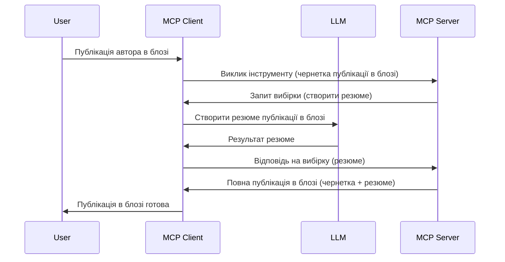

# Семплінг — делегування функцій клієнту

> **Попередження про застарівання:** кандидат на випуск специфікації MCP `2026-07-28` позначає Семплінг як застарілий на користь прямої інтеграції з API провайдерів LLM. Семплінг буде працювати у версії `2025-11-25` і принаймні рік після будь-якого офіційного зняття з підтримки, тож все в цьому уроці залишається дійсним — але нові дизайни серверів мають оцінити новий підхід. Див. [Що змінюється в MCP: кандидат на випуск 2026-07-28](../../01-CoreConcepts/mcp-2026-07-28-release-candidate.md).

Іноді MCP клієнт і MCP сервер повинні співпрацювати для досягнення спільної мети. Можливо, серверу потрібна допомога LLM, яка працює на клієнті. Для такої ситуації потрібно використовувати семплінг.

Розглянемо деякі випадки використання і як побудувати рішення з використанням семплінгу.

## Огляд

У цьому уроці ми зосередимося на тому, коли та де слід використовувати Семплінг і як його налаштувати.

## Цілі навчання

У цій главі ми:

- Пояснимо, що таке Семплінг і коли його використовувати.
- Покажемо, як налаштувати Семплінг у MCP.
- Наведемо приклади використання Семплінгу на практиці.

## Що таке Семплінг і навіщо його використовувати?

Семплінг — це розширена функція, яка працює таким чином:



### Запит на семплінг

Добре, тепер ми маємо загальне розуміння реалістичного сценарію, поговоримо про запит на семплінг, який сервер відправляє клієнту. Ось як такий запит може виглядати у форматі JSON-RPC:

```json
{
  "jsonrpc": "2.0",
  "id": 1,
  "method": "sampling/createMessage",
  "params": {
    "messages": [
      {
        "role": "user",
        "content": {
          "type": "text",
          "text": "Create a blog post summary of the following blog post: <BLOG POST>"
        }
      }
    ],
    "modelPreferences": {
      "hints": [
        {
          "name": "claude-3-sonnet"
        }
      ],
      "intelligencePriority": 0.8,
      "speedPriority": 0.5
    },
    "systemPrompt": "You are a helpful assistant.",
    "maxTokens": 100
  }
}
```

Тут варто звернути увагу на кілька моментів:

- Prompt, у розділі content -> text — це запит (інструкція) для LLM підсумувати зміст блог-посту.

- **modelPreferences**. Цей розділ — це лише рекомендації щодо конфігурації для LLM. Користувач може погодитись на ці рекомендації або змінити їх. У нашому випадку рекомендації стосуються моделі, переваг швидкості та пріоритету інтелекту.
- **systemPrompt**, це звичайний системний запит, який задає особистість LLM і містить інструкції.
- **maxTokens**, це властивість, яка вказує рекомендовану кількість токенів для цього завдання.

### Відповідь на семплінг

Ця відповідь — те, що MCP Клієнт відправляє назад MCP Серверу, це результат виклику LLM клієнтом, очікування на відповідь і формування цього повідомлення. Ось як це може виглядати у форматі JSON-RPC:

```json
{
  "jsonrpc": "2.0",
  "id": 1,
  "result": {
    "role": "assistant",
    "content": {
      "type": "text",
      "text": "Here's your abstract <ABSTRACT>"
    },
    "model": "gpt-5",
    "stopReason": "endTurn"
  }
}
```

Зверніть увагу, що відповідь є анотацією блог-посту, як ми й просили. Також помітно, що використана модель не та, яку ми запитували, а "gpt-5" замість "claude-3-sonnet". Це ілюструє, що користувач може змінити думку стосовно вибору моделі, а ваш запит семплінгу — це рекомендація.

Тепер, коли ми розуміємо основний процес та корисне завдання "створення блог-посту + анотація", давайте подивимось, що потрібно зробити, щоб це запрацювало.

### Типи повідомлень

Повідомлення семплінгу не обмежуються лише текстом, можна також відправляти зображення та аудіо. Ось як JSON-RPC виглядає інакше для цих випадків:

**Текст**

```json
{
  "type": "text",
  "text": "The message content"
}
```

**Зображення**

```json
{
  "type": "image",
  "data": "base64-encoded-image-data",
  "mimeType": "image/jpeg"
}
```

**Аудіо**

```json
{
  "type": "audio",
  "data": "base64-encoded-audio-data",
  "mimeType": "audio/wav"
}
```

> ПРИМІТКА: для докладнішої інформації про Семплінг дивіться [офіційну документацію](https://modelcontextprotocol.io/specification/2025-11-25/client/sampling)

## Як налаштувати Семплінг у клієнті

> Примітка: якщо ви лише створюєте сервер, вам тут робити особливо нічого.

У клієнті потрібно вказати таку функцію таким чином:

```json
{
  "capabilities": {
    "sampling": {}
  }
}
```

Це буде враховано при ініціалізації обраного клієнта із сервером.

## Приклад роботи Семплінгу — створення блог-посту

Давайте разом запрограмуємо сервер для семплінгу, нам потрібно зробити наступне:

1. Створити інструмент на сервері.
1. Цей інструмент має сформувати запит семплінгу.
1. Інструмент має чекати відповіді на запит семплінгу від клієнта.
1. Потім має бути сформований результат роботи інструменту.

Розглянемо код крок за кроком:

### -1- Створення інструменту

**python**

```python
@mcp.tool()
async def create_blog(title: str, content: str, ctx: Context[ServerSession, None]) -> str:
    """Create a blog post and generate a summary"""

```

### -2- Створення запиту семплінгу

Розширте ваш інструмент наступним кодом:

**python**

```python
post = BlogPost(
        id=len(posts) + 1,
        title=title,
        content=content,
        abstract=""
    )

prompt = f"Create an abstract of the following blog post: title: {title} and draft: {content} "

result = await ctx.session.create_message(
        messages=[
            SamplingMessage(
                role="user",
                content=TextContent(type="text", text=prompt),
            )
        ],
        max_tokens=100,
)

```

### -3- Очікування відповіді та повернення результату

**python**

```python
post.abstract = result.content.text

posts.append(post)

# повернути повний продукт
return json.dumps({
    "id": post.title,
    "abstract": post.abstract
})
```

### -4- Повний код

**python**

```python
from starlette.applications import Starlette
from starlette.routing import Mount, Host

from mcp.server.fastmcp import Context, FastMCP

from mcp.server.session import ServerSession
from mcp.types import SamplingMessage, TextContent

import json


from uuid import uuid4
from typing import List
from pydantic import BaseModel


mcp = FastMCP("Blog post generator")

# app = FastAPI()

posts = []

class BlogPost(BaseModel):
    id: int
    title: str
    content: str
    abstract: str

posts: List[BlogPost] = []

@mcp.tool()
async def create_blog(title: str, content: str, ctx: Context[ServerSession, None]) -> str:
    """Create a blog post and generate a summary"""

    post = BlogPost(
        id=len(posts) + 1,
        title=title,
        content=content,
        abstract=""
    )

    prompt = f"Create an abstract of the following blog post: title: {title} and draft: {content} "

    result = await ctx.session.create_message(
        messages=[
            SamplingMessage(
                role="user",
                content=TextContent(type="text", text=prompt),
            )
        ],
        max_tokens=100,
    )

    post.abstract = result.content.text

    posts.append(post)

    # повернути повний блог-пост
    return json.dumps({
        "id": post.title,
        "abstract": post.abstract
    })

if __name__ == "__main__":
    print("Starting server...")
    # mcp.run()
    mcp.run(transport="streamable-http")

# запустити додаток за допомогою: python server.py
```

### -5- Тестування в Visual Studio Code

Щоб протестувати це у Visual Studio Code, виконайте наступне:

1. Запустіть сервер у терміналі
1. Додайте його у *mcp.json* (і переконайтеся, що сервер запущений), наприклад так:

   ```json
   "servers": {
      "blog-server": {
        "type": "http",
        "url": "http://localhost:8000/mcp"
      }
   }
   ```

1. Введіть промпт:

   ```text
   create a blog post named "Where Python comes from", the content is "Python is actually named after Monty Python Flying Circus"
   ```

1. Дайте дозвіл на семплінг. При першому запуску вас запитають підтвердити додатковий діалог, потім з’явиться звичайний запит для запуску інструменту.

1. Перегляньте результати. Ви побачите їх у гарному відображенні в GitHub Copilot Chat, а також можете переглянути необроблену JSON відповідь.

**Бонус**. Інструментарій Visual Studio Code має чудову підтримку семплінгу. Ви можете налаштувати доступ до семплінгу на вашому встановленому сервері, перейшовши сюди:

1. Відкрийте розділ розширень.
1. Виберіть іконку шестерні для вашого встановленого сервера в секції "MCP SERVERS - INSTALLED".
1. Виберіть "Configure Model Access", тут ви можете вибрати, які Моделі GitHub Copilot дозволено використовувати під час семплінгу. Також тут можна подивитись усі запити семплінгу, що відбулися нещодавно, вибравши "Show Sampling requests".

## Завдання

У цьому завданні ви створите трохи інший семплінг — інтеграцію, що підтримує генерацію опису продукту. Ось ваш сценарій:

**Сценарій**: співробітник бекофісу інтернет-магазину потребує допомоги, адже створення описів товарів забирає забагато часу. Тож ви маєте створити рішення, де можна викликати інструмент "create_product" з аргументами "title" та "keywords", і він повинен генерувати повний продукт, включно з полем "description", яке має заповнюватись LLM клієнта.

ПІДКАЗКА: використайте знання з раніше, щоб побудувати цей сервер і його інструмент із запитом семплінгу.

## Рішення

[Рішення](./solution/README.md)

## Основні висновки

Семплінг — це потужна функція, яка дозволяє серверу делегувати завдання клієнту, коли потрібна допомога LLM.

## Що далі

- [Глава 4 - Практична реалізація](../../04-PracticalImplementation/README.md)

---

<!-- CO-OP TRANSLATOR DISCLAIMER START -->
**Відмова від відповідальності**:
Цей документ було перекладено за допомогою сервісу штучного інтелекту для перекладу [Co-op Translator](https://github.com/Azure/co-op-translator). Хоча ми прагнемо до точності, будь ласка, майте на увазі, що автоматичні переклади можуть містити помилки або неточності. Оригінальний документ рідною мовою слід вважати авторитетним джерелом. Для критично важливої інформації рекомендується професійний людський переклад. Ми не несемо відповідальності за будь-які непорозуміння або неправильні тлумачення, що виникли внаслідок використання цього перекладу.
<!-- CO-OP TRANSLATOR DISCLAIMER END -->