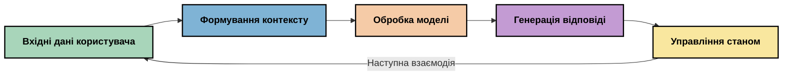
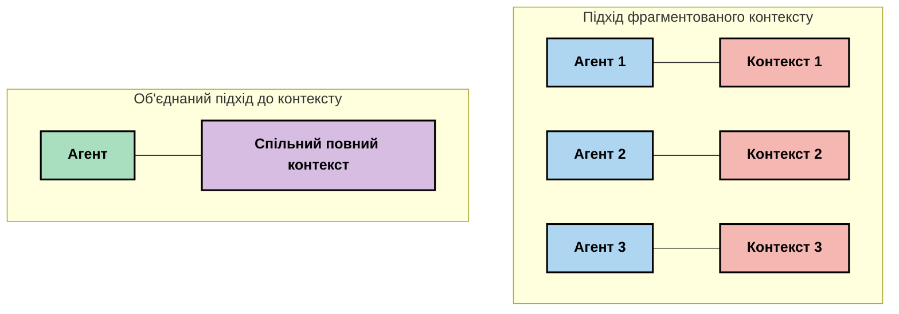
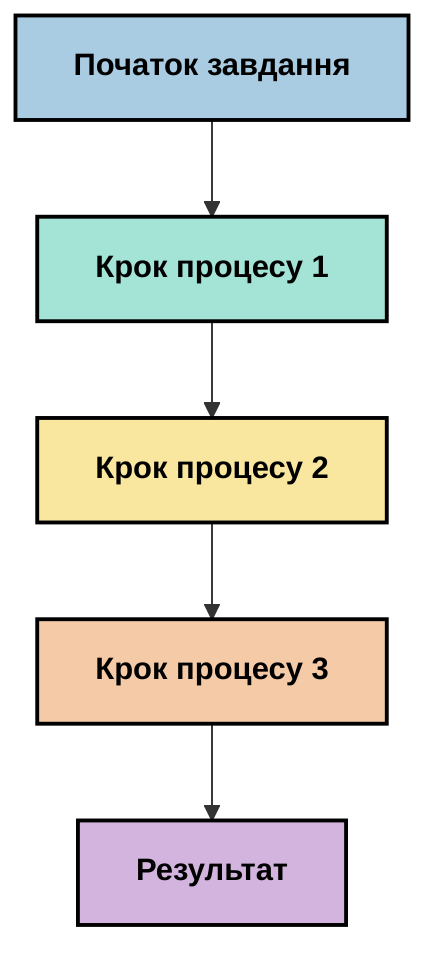
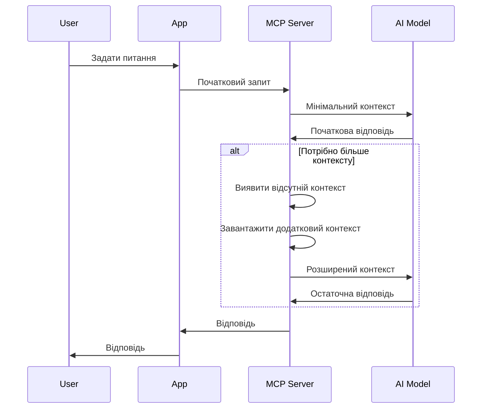
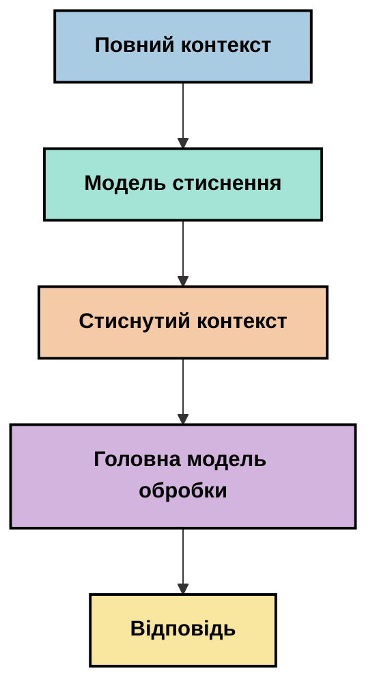
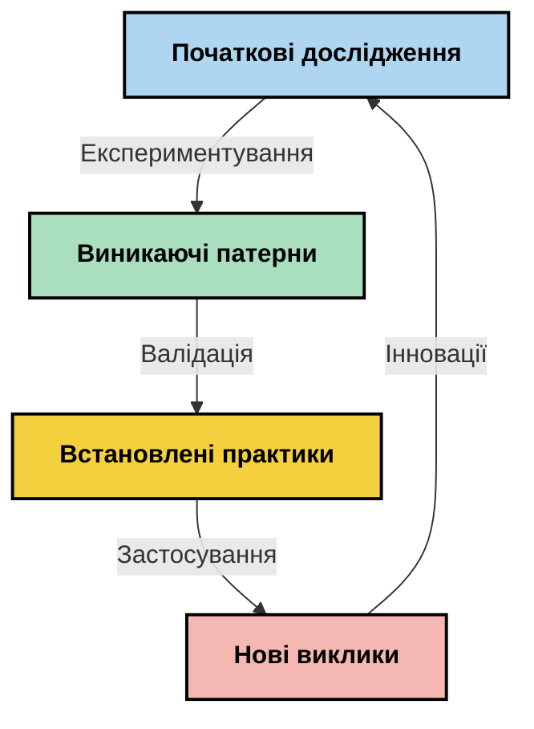

# Контекстна інженерія: нова концепція в екосистемі MCP

## Огляд

Контекстна інженерія — це нова концепція в галузі штучного інтелекту, що досліджує, як інформація структурована, доставляється та підтримується протягом взаємодій між клієнтами та AI-сервісами. У міру розвитку екосистеми Model Context Protocol (MCP) розуміння ефективного управління контекстом стає все важливішим. Цей модуль вводить концепцію контекстної інженерії та досліджує її потенційні застосування у реалізаціях MCP.

## Навчальні цілі

До кінця цього модуля ви зможете:

- Розуміти нову концепцію контекстної інженерії та її потенційну роль у застосуваннях MCP
- Визначати ключові виклики в управлінні контекстом, які враховує дизайн протоколу MCP
- Вивчати методи покращення продуктивності моделей через кращу обробку контексту
- Розглядати підходи до вимірювання та оцінки ефективності контексту
- Застосовувати ці нові концепції для покращення AI-досвідів через фреймворк MCP

## Вступ до контекстної інженерії

Контекстна інженерія — це нова концепція, яка зосереджена на свідомому проєктуванні та управлінні потоком інформації між користувачами, застосунками та AI-моделями. На відміну від усталених напрямків, як-от інженерія промптів, контекстна інженерія досі визначається практиками, які прагнуть розв’язати унікальні проблеми забезпечення AI-моделей потрібною інформацією у потрібний час.

У міру розвитку великих мовних моделей (LLM) важливість контексту стає все очевиднішою. Якість, релевантність і структура контексту, який ми надаємо, безпосередньо впливають на результати моделі. Контекстна інженерія досліджує цей зв’язок і прагне розробити принципи ефективного управління контекстом.

> «У 2025 році моделі надзвичайно розумні. Але навіть найрозумніша людина не зможе ефективно виконувати свою роботу без контексту того, що від неї вимагається... "Контекстна інженерія" — це наступний рівень інженерії промптів. Йдеться про автоматизацію цього процесу в динамічній системі.» — Волден Ян, Cognition AI

Контекстна інженерія може охоплювати:

1. **Вибір контексту**: Визначення релевантної інформації для конкретного завдання
2. **Структурування контексту**: Організація інформації для максимальної зрозумілості моделі
3. **Доставку контексту**: Оптимізація способу та часу передачі інформації моделям
4. **Підтримку контексту**: Управління станом та розвитком контексту з часом
5. **Оцінку контексту**: Вимірювання та покращення ефективності контексту

Ці сфери особливо актуальні для екосистеми MCP, яка надає стандартизований спосіб для застосунків надавати контекст великим мовним моделям.


## Перспектива шляху контексту

Один зі способів уявити контекстну інженерію — простежити шлях, який проходить інформація через систему MCP:



### Ключові етапи шляху контексту:

1. **Вхід користувача**: Сирі дані від користувача (текст, зображення, документи)
2. **Збір контексту**: Об’єднання вхідних даних користувача із системним контекстом, історією розмови та іншою отриманою інформацією
3. **Обробка моделлю**: AI-модель обробляє сформований контекст
4. **Генерація відповіді**: Модель створює вихідні дані на основі наданого контексту
5. **Управління станом**: Система оновлює свій внутрішній стан на основі взаємодії

Ця перспектива підкреслює динамічний характер контексту в AI-системах і піднімає важливі питання про найкраще управління інформацією на кожному етапі.

## Нові принципи контекстної інженерії

У міру формування галузі контекстної інженерії починають формуватися перші принципи від практиків. Ці принципи можуть допомогти у виборі реалізацій MCP:

### Принцип 1: Повне поширення контексту

Контекст повинен бути повністю переданий між усіма компонентами системи, а не розпорошений між різними агентами чи процесами. Коли контекст розподілений, рішення, прийняті в одній частині системи, можуть вступати в суперечність із рішеннями в іншій.



У застосунках MCP це означає проєктування систем, де контекст безперервно проходить через весь конвеєр, а не поділений на окремі частини.

### Принцип 2: Враховуйте, що дії містять неявні рішення

Кожна дія моделі містить неявні рішення щодо того, як інтерпретувати контекст. Якщо різні компоненти працюють з різним контекстом, ці неявні рішення можуть суперечити одне одному, що призведе до непослідовних результатів.

Цей принцип має важливі наслідки для застосунків MCP:
- Віддавати перевагу послідовній обробці складних завдань замість паралельного виконання з роздрібненим контекстом
- Забезпечити, щоб усі точки прийняття рішень мали доступ до однієї і тієї ж інформації контексту
- Проєктувати системи так, щоб наступні кроки бачили повний контекст раніше прийнятих рішень

### Принцип 3: Баланс глибини контексту з обмеженнями вікна

У міру тривалості розмов та процесів вікно контексту переповнюється. Ефективна контекстна інженерія досліджує підходи до управління цим напруженням між всеосяжним контекстом і технічними обмеженнями.

Потенційні підходи включають:
- Стискання контексту, що зберігає необхідну інформацію при зменшенні кількості токенів
- Поступове завантаження контексту на основі актуальності для поточних потреб
- Підсумковування попередніх взаємодій із збереженням ключових рішень і фактів

## Виклики контексту та дизайн протоколу MCP

Model Context Protocol (MCP) розроблений з урахуванням унікальних викликів управління контекстом. Розуміння цих викликів допомагає пояснити ключові аспекти дизайну протоколу MCP:


### Виклик 1: Обмеження вікна контексту
Більшість AI-моделей мають фіксовані розміри вікна контексту, що обмежує, скільки інформації можна опрацювати за один раз.

**Відповідь дизайну MCP:** 
- Протокол підтримує структурований, ресурсно-орієнтований контекст, який можна ефективно посилатися
- Ресурси можуть бути посторінковими і завантажуватися поступово

### Виклик 2: Визначення релевантності
Визначити, яка інформація є найбільш релевантною для включення в контекст, складно.

**Відповідь дизайну MCP:**
- Гнучкі інструменти дозволяють динамічно отримувати інформацію за потребою
- Структуровані підказки забезпечують послідовну організацію контексту

### Виклик 3: Збереження контексту
Управління станом у взаємодіях потребує ретельного відстеження контексту.

**Відповідь дизайну MCP:**
- Стандартизоване управління сесіями
- Чітко визначені шаблони взаємодії для еволюції контексту

### Виклик 4: Багатозначний контекст
Різні типи даних (текст, зображення, структуровані дані) потребують різної обробки.

**Відповідь дизайну MCP:**
- Дизайн протоколу враховує різні типи контенту
- Стандартизоване представлення багатомодальної інформації

### Виклик 5: Безпека та конфіденційність
Контекст часто містить чутливу інформацію, яку потрібно захищати.

**Відповідь дизайну MCP:**
- Чіткі межі між обов’язками клієнта і сервера
- Варіанти локальної обробки для мінімізації витоку даних

Розуміння цих викликів і способів їх розв’язання MCP забезпечує основу для дослідження більш просунутих методів контекстної інженерії.

## Нові підходи в контекстній інженерії

У міру розвитку галузі контекстної інженерії з’являються кілька перспективних підходів. Вони відображають поточне мислення, а не усталені кращі практики, і, ймовірно, еволюціонуватимуть із накопиченням досвіду реалізацій MCP.

### 1. Однопотокова лінійна обробка

На відміну від багатьоагентних архітектур, які розподіляють контекст, деякі практики виявляють, що однопотокова лінійна обробка дає більш послідовні результати. Це збігається з принципом підтримки єдиного контексту.



Хоча цей підхід може здаватися менш ефективним ніж паралельна обробка, він часто дає більш узгоджені й надійні результати, оскільки кожен крок базується на повному розумінні попередніх рішень.

### 2. Розбиття контексту на фрагменти та пріоритизація

Розбивання великих контекстів на керовані частини та визначення найважливішого.

```python
# Концептуальний приклад: Розбиття контексту на частини та пріоритизація
def process_with_chunked_context(documents, query):
    # 1. Розбити документи на менші частини
    chunks = chunk_documents(documents)
    
    # 2. Обчислити оцінки релевантності для кожної частини
    scored_chunks = [(chunk, calculate_relevance(chunk, query)) for chunk in chunks]
    
    # 3. Відсортувати частини за оцінкою релевантності
    sorted_chunks = sorted(scored_chunks, key=lambda x: x[1], reverse=True)
    
    # 4. Використати найрелевантніші частини як контекст
    context = create_context_from_chunks([chunk for chunk, score in sorted_chunks[:5]])
    
    # 5. Обробка з пріоритетним контекстом
    return generate_response(context, query)
```

Наведена концепція ілюструє, як можна розбити великі документи на керовані частини й обирати лише найбільш релевантні для контексту. Цей підхід допомагає працювати в межах обмежень вікна контексту, використовуючи великі бази знань.

### 3. Поступове завантаження контексту

Завантаження контексту поступово за потребою, а не все одразу.



Поступове завантаження контексту починається з мінімального контексту і розширюється лише за необхідності. Це значно знижує використання токенів для простих запитів, зберігаючи можливість обробки складних питань.

### 4. Стискання та підсумовування контексту

Зменшення розміру контексту із збереженням суттєвої інформації.



Стискання контексту зосереджується на:
- Видаленні надлишкової інформації
- Підсумовуванні довгого вмісту
- Виділенні ключових фактів і деталей
- Збереженні критичних елементів контексту
- Оптимізації використання токенів

Цей підхід особливо цінний для підтримки довгих розмов у межах вікон контексту або ефективної обробки великих документів. Деякі практики використовують спеціалізовані моделі для стискання контексту й підсумовування історії розмов.


## Розгляди для дослідної контекстної інженерії

Під час дослідження нової галузі контекстної інженерії варто мати на увазі кілька моментів при роботі з реалізаціями MCP. Це не строго встановлені кращі практики, а області досліджень, які можуть покращити ваш конкретний кейс.

### Визначте свої цілі контексту

Перш ніж впроваджувати складні рішення з управління контекстом, чітко сформулюйте, що хочете досягти:
- Яка конкретна інформація потрібна моделі для успішної роботи?
- Яка інформація є основною, а яка — додатковою?
- Які ваші обмеження по продуктивності (затримка, ліміти токенів, витрати)?

### Досліджуйте багатошарові підходи до контексту

Деякі практики досягають успіху з контекстом, організованим у концептуальні шари:
- **Основний шар**: Основна інформація, яка завжди потрібна моделі
- **Ситуативний шар**: Контекст, специфічний для поточної взаємодії
- **Допоміжний шар**: Додаткова інформація, яка може бути корисною
- **Резервний шар**: Інформація, доступна лише за потреби

### Вивчайте стратегії отримання інформації

Ефективність вашого контексту часто залежить від способу отримання інформації:
- Семантичний пошук і embeddings для знаходження концептуально релевантної інформації
- Ключові слова для пошуку конкретних фактів
- Гібридні підходи, що поєднують кілька методів отримання
- Фільтрація за метаданими для звуження сфери за категоріями, датами або джерелами

### Експериментуйте з когерентністю контексту

Структура і послідовність вашого контексту можуть впливати на розуміння моделі:
- Групування пов’язаної інформації разом
- Використання послідовного форматування і організації
- Підтримка логічного або хронологічного порядку там, де доречно
- Уникання суперечливої інформації

### Зважте компроміси багатозначних архітектур

Хоча багатозначні архітектури популярні в багатьох AI-фреймворках, вони мають суттєві виклики в управлінні контекстом:
- Фрагментація контексту може призводити до непослідовних рішень між агентами
- Паралельна обробка може спричинити конфлікти, які важко узгодити
- Витрати на комунікацію між агентами можуть компенсувати виграш у продуктивності
- Для підтримки когерентності потрібне складне управління станом

У багатьох випадках одногентський підхід із комплексним управлінням контекстом може давати більш надійні результати, ніж кілька спеціалізованих агентів з роздрібненим контекстом.

### Розробляйте методи оцінки

Щоб покращувати контекстну інженерію з часом, подумайте, як ви будете вимірювати успіх:
- A/B тестування різної структури контексту
- Моніторинг використання токенів і часу відповіді
- Відстеження задоволеності користувачів і рівня виконання завдань
- Аналіз випадків, коли стратегії контексту не працюють

Ці розгляди є активною областю досліджень у сфері контекстної інженерії. У міру розвитку галузі, ймовірно, з’являться більш визначені шаблони і практики.

## Вимірювання ефективності контексту: еволюційна структура

Зі зростанням значення контекстної інженерії практики починають досліджувати, як можна вимірювати її ефективність. Універсальної схеми поки що немає, але розглядаються різні метрики, що можуть стати основою для майбутніх робіт.

### Потенційні вимірювальні аспекти


#### 1. Розгляди ефективності вводу

- **Співвідношення контекст–відповідь**: Скільки контексту потрібно відносно розміру відповіді?
- **Використання токенів**: Який відсоток токенів контексту впливає на відповідь?
- **Стискання контексту**: Наскільки ефективно можна стиснути сирі дані?

#### 2. Розгляди продуктивності

- **Вплив на затримку**: Як управління контекстом впливає на час відповіді?
- **Економія токенів**: Чи оптимізуємо ми використання токенів ефективно?
- **Точність пошуку**: Наскільки релевантна отримана інформація?
- **Використання ресурсів**: Які обчислювальні ресурси потрібні?

#### 3. Розгляди якості

- **Релевантність відповіді**: Наскільки добре відповідь відповідає запиту?
- **Фактична точність**: Чи покращує управління контекстом фактичну правильність?
- **Послідовність**: Чи послідовні відповіді на схожі запити?
- **Рівень галюцинацій**: Чи зменшує кращий контекст галюцинації моделі?

#### 4. Розгляди користувацького досвіду

- **Частота уточнень**: Як часто користувачам потрібні пояснення?
- **Виконання завдань**: Чи успішно користувачі досягають цілей?
- **Індикатори задоволення**: Як користувачі оцінюють свій досвід?

### Дослідні підходи до вимірювання

Під час експериментів із контекстною інженерією в реалізаціях MCP врахуйте такі дослідні методи:

1. **Порівняння з базовим рівнем**: Встановіть базовий рівень з простими підходами до контексту перед тестуванням складніших методів

2. **Покрокові зміни**: Змінюйте по одному аспекту управління контекстом, щоб ізолювати його ефекти

3. **Оцінка орієнтована на користувача**: Поєднуйте кількісні метрики з якісним зворотним зв’язком від користувачів

4. **Аналіз невдач**: Досліджуйте випадки, коли стратегії контексту не працюють, щоб зрозуміти можливі покращення

5. **Багатовимірна оцінка**: Розглядайте компроміси між ефективністю, якістю та користувацьким досвідом

Цей експериментальний, багатогранний підхід до вимірювання відповідає новій природі контекстної інженерії.

## Заключні думки

Контекстна інженерія — це нова область досліджень, яка може стати центральною для ефективних застосунків MCP. Свідомо розглядаючи, як інформація проходить через вашу систему, ви потенційно можете створити AI-досвіди, які є ефективнішими, точнішими та ціннішими для користувачів.

Техніки та підходи, викладені в цьому модулі, відображають початкові ідеї, а не усталені практики. Контекстна інженерія може перетворитися на більш визначену дисципліну в міру розвитку можливостей AI і поглиблення нашого розуміння. Наразі експерименти в поєднанні з ретельними вимірюваннями здаються найпродуктивнішим підходом.

## Потенційні напрямки розвитку

Галузь контекстної інженерії досі перебуває на ранніх стадіях, але з’являються кілька перспективних напрямків:

- Принципи контекстної інженерії можуть суттєво впливати на продуктивність моделей, ефективність, користувацький досвід і надійність
- Однопотокові підходи з комплексним управлінням контекстом можуть перевершити багатозначні архітектури в багатьох випадках
- Спеціалізовані моделі стискання контексту можуть стати стандартними компонентами AI-конвеєрів
- Напруження між повнотою контексту і обмеженнями токенів ймовірно стимулюватиме інновації в обробці контексту
- У міру того, як моделі стануть більш здатними до ефективної людськоподібної комунікації, справжня багатозначна співпраця може стати більш можливою
- Реалізації MCP можуть розвиватися для стандартизації моделей управління контекстом, які з’являються в процесі поточних експериментів



## Ресурси

### Офіційні ресурси MCP
- [Model Context Protocol Website](https://modelcontextprotocol.io/)
- [Model Context Protocol Specification](https://github.com/modelcontextprotocol/modelcontextprotocol)

- [Документація MCP](https://modelcontextprotocol.io/docs)
- [MCP C# SDK](https://github.com/modelcontextprotocol/csharp-sdk)
- [MCP Python SDK](https://github.com/modelcontextprotocol/python-sdk)
- [MCP TypeScript SDK](https://github.com/modelcontextprotocol/typescript-sdk)
- [MCP Inspector](https://github.com/modelcontextprotocol/inspector) - Візуальний інструмент тестування серверів MCP

### Статті з інженерії контексту
- [Не створюйте мультиагентів: принципи інженерії контексту](https://cognition.ai/blog/dont-build-multi-agents) - Спостереження Волдена Яна щодо принципів інженерії контексту
- [Практичний посібник зі створення агентів](https://cdn.openai.com/business-guides-and-resources/a-practical-guide-to-building-agents.pdf) - Посібник OpenAI з ефективного дизайну агентів
- [Створення ефективних агентів](https://www.anthropic.com/engineering/building-effective-agents) - Підхід Anthropic до розробки агентів

### Пов'язані дослідження
- [Динамічне розширення отримання для великих мовних моделей](https://arxiv.org/abs/2310.01487) - Дослідження динамічних підходів до отримання
- [Загублені посередині: як мовні моделі використовують довгі контексти](https://arxiv.org/abs/2307.03172) - Важливе дослідження про схеми обробки контексту
- [Ієрархічне текстово-контекстуальне генерування зображень за допомогою CLIP Latents](https://arxiv.org/abs/2204.06125) - Документ DALL-E 2 із дослідженнями структурування контексту
- [Дослідження ролі контексту в архітектурах великих мовних моделей](https://aclanthology.org/2023.findings-emnlp.124/) - Останні дослідження з обробки контексту
- [Співпраця мультиагентів: огляд](https://arxiv.org/abs/2304.03442) - Дослідження мультиагентних систем і їх викликів

### Додаткові ресурси
- [Методи оптимізації контекстного вікна](https://learn.microsoft.com/en-us/azure/ai-services/openai/concepts/context-window)
- [Просунуті методи RAG](https://www.microsoft.com/en-us/research/blog/retrieval-augmented-generation-rag-and-frontier-models/)
- [Документація Semantic Kernel](https://github.com/microsoft/semantic-kernel)
- [Інструменти штучного інтелекту для управління контекстом](https://github.com/microsoft/aitoolkit)

## Що далі

- [5.15 MCP Custom Transport](../mcp-transport/README.md)

---

<!-- CO-OP TRANSLATOR DISCLAIMER START -->
**Відмова від відповідальності**:
Цей документ було перекладено за допомогою сервісу штучного інтелекту для перекладу [Co-op Translator](https://github.com/Azure/co-op-translator). Хоча ми прагнемо до точності, будь ласка, майте на увазі, що автоматичні переклади можуть містити помилки або неточності. Оригінальний документ рідною мовою слід вважати авторитетним джерелом. Для критично важливої інформації рекомендується професійний людський переклад. Ми не несемо відповідальності за будь-які непорозуміння або неправильні тлумачення, що виникли внаслідок використання цього перекладу.
<!-- CO-OP TRANSLATOR DISCLAIMER END -->