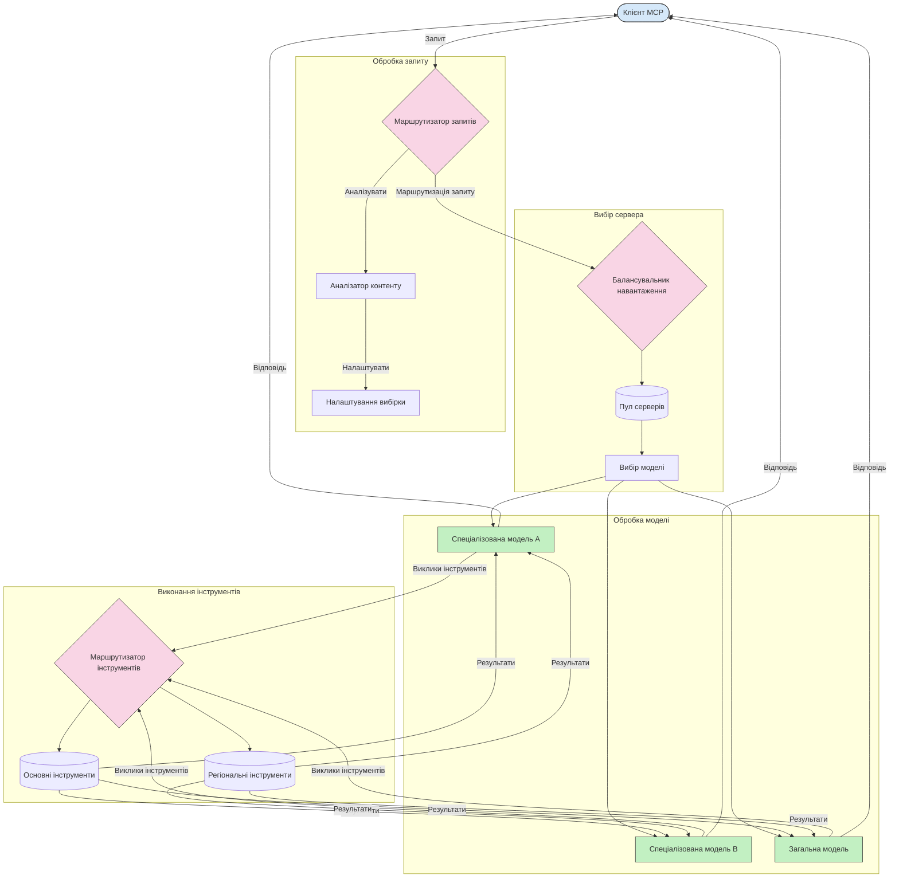

# Маршрутизація в протоколі контексту моделі

Маршрутизація є ключовою для спрямування запитів до відповідних моделей, інструментів чи сервісів у екосистемі MCP.

## Вступ

Маршрутизація в протоколі контексту моделі (MCP) полягає у спрямуванні запитів до найбільш підходящих моделей або сервісів на основі різних критеріїв, таких як тип контенту, контекст користувача та навантаження системи. Це забезпечує ефективну обробку та оптимальне використання ресурсів.

## Цілі навчання

До кінця цього уроку ви зможете:

- Розуміти принципи маршрутизації в MCP.
- Реалізувати маршрутизацію на основі контенту для спрямування запитів до спеціалізованих сервісів.
- Застосовувати стратегії інтелектуального балансування навантаження для оптимізації використання ресурсів.
- Реалізувати динамічну маршрутизацію інструментів на основі контексту запиту.

## Маршрутизація на основі контенту

Маршрутизація на основі контенту спрямовує запити до спеціалізованих сервісів залежно від змісту запиту. Наприклад, запити, пов’язані з генерацією коду, можуть спрямовуватись до спеціалізованої моделі коду, тоді як творчі запити надсилатимуться до моделі для творчого письма.

Розглянемо приклад реалізації на різних мовах програмування.

<details>
<summary>.NET</summary>

```csharp
// .NET Example: Content-based routing in MCP
public class ContentBasedRouter
{
    private readonly Dictionary<string, McpClient> _specializedClients;
    private readonly RoutingClassifier _classifier;
    
    public ContentBasedRouter()
    {
        // Initialize specialized clients for different domains
        _specializedClients = new Dictionary<string, McpClient>
        {
            ["code"] = new McpClient("https://code-specialized-mcp.com"),
            ["creative"] = new McpClient("https://creative-specialized-mcp.com"),
            ["scientific"] = new McpClient("https://scientific-specialized-mcp.com"),
            ["general"] = new McpClient("https://general-mcp.com")
        };
        
        // Initialize content classifier
        _classifier = new RoutingClassifier();
    }
    
    public async Task<McpResponse> RouteAndProcessAsync(string prompt, IDictionary<string, object> parameters = null)
    {
        // Classify the prompt to determine the best specialized service
        string category = await _classifier.ClassifyPromptAsync(prompt);
        
        // Get the appropriate client or fall back to general
        var client = _specializedClients.ContainsKey(category) 
            ? _specializedClients[category] 
            : _specializedClients["general"];
            
        Console.WriteLine($"Routing request to {category} specialized service");
        
        // Send request to the selected service
        return await client.SendPromptAsync(prompt, parameters);
    }
    
    // Simple classifier for routing decisions
    private class RoutingClassifier
    {
        public Task<string> ClassifyPromptAsync(string prompt)
        {
            prompt = prompt.ToLowerInvariant();
            
            if (prompt.Contains("code") || prompt.Contains("function") || 
                prompt.Contains("program") || prompt.Contains("algorithm"))
            {
                return Task.FromResult("code");
            }
            
            if (prompt.Contains("story") || prompt.Contains("creative") || 
                prompt.Contains("imagine") || prompt.Contains("design"))
            {
                return Task.FromResult("creative");
            }
            
            if (prompt.Contains("science") || prompt.Contains("research") || 
                prompt.Contains("analyze") || prompt.Contains("study"))
            {
                return Task.FromResult("scientific");
            }
            
            return Task.FromResult("general");
        }
    }
}
```

У наведеному вище коді ми:

- Створили клас `ContentBasedRouter`, який маршрутизує запити на основі вмісту підказки.
- Ініціалізували спеціалізовані клієнти для різних доменів (код, творчість, наука, загальні).
- Реалізували простий класифікатор, який визначає категорію підказки та спрямовує її до відповідного спеціалізованого сервісу.
- Використали механізм відкату, щоб спрямовувати запити до загального сервісу, якщо спеціалізований сервіс недоступний.
- Запровадили асинхронну обробку для ефективної роботи з запитами.
- Використали словник для відображення категорій контенту на спеціалізованих клієнтів MCP.
- Реалізували простий класифікатор, який аналізує підказку та повертає відповідну категорію.
- Використали спеціалізованого клієнта для відправлення запиту та отримання відповіді.
- Обробили випадки, коли підказка не відповідає жодній спеціалізованій категорії, спрямовуючи до загального сервісу.

</details>

## Інтелектуальне балансування навантаження

Балансування навантаження оптимізує використання ресурсів і забезпечує високу доступність сервісів MCP. Є різні способи реалізації балансування навантаження, такі як круговий розподіл, зважений час відгуку або стратегії, що враховують контент.

Розглянемо приклад реалізації, що використовує такі стратегії:

- **Круговий розподіл**: Рівномірно розподіляє запити між доступними серверами.
- **Зважений час відгуку**: Спрямовує запити до серверів залежно від їх середнього часу відгуку.
- **Обізнаність про контент**: Спрямовує запити до спеціалізованих серверів на основі вмісту запиту.

<details>
<summary>Java</summary>

```java
// Java приклад: Інтелектуальне балансування навантаження для MCP серверів
public class McpLoadBalancer {
    private final List<McpServerNode> serverNodes;
    private final LoadBalancingStrategy strategy;
    
    public McpLoadBalancer(List<McpServerNode> nodes, LoadBalancingStrategy strategy) {
        this.serverNodes = new ArrayList<>(nodes);
        this.strategy = strategy;
    }
    
    public McpResponse processRequest(McpRequest request) {
        // Виберіть найкращий сервер на основі стратегії
        McpServerNode selectedNode = strategy.selectNode(serverNodes, request);
        
        try {
            // Перенаправте запит до вибраного вузла
            return selectedNode.processRequest(request);
        } catch (Exception e) {
            // Обробка помилок - реалізуйте логіку повторної спроби або резервного варіанту
            System.err.println("Error processing request on node " + selectedNode.getId() + ": " + e.getMessage());
            
            // Позначте вузол як потенційно нездоровий
            selectedNode.recordFailure();
            
            // Спробуйте наступний найкращий вузол як резервний
            List<McpServerNode> remainingNodes = new ArrayList<>(serverNodes);
            remainingNodes.remove(selectedNode);
            
            if (!remainingNodes.isEmpty()) {
                McpServerNode fallbackNode = strategy.selectNode(remainingNodes, request);
                return fallbackNode.processRequest(request);
            } else {
                throw new RuntimeException("All MCP server nodes failed to process the request");
            }
        }
    }
    
    // Завдання перевірки стану вузла
    public void startHealthChecks(Duration interval) {
        ScheduledExecutorService scheduler = Executors.newScheduledThreadPool(1);
        scheduler.scheduleAtFixedRate(() -> {
            for (McpServerNode node : serverNodes) {
                try {
                    boolean isHealthy = node.checkHealth();
                    System.out.println("Node " + node.getId() + " health status: " + 
                                      (isHealthy ? "HEALTHY" : "UNHEALTHY"));
                } catch (Exception e) {
                    System.err.println("Health check failed for node " + node.getId());
                    node.setHealthy(false);
                }
            }
        }, 0, interval.toMillis(), TimeUnit.MILLISECONDS);
    }
    
    // Інтерфейс для стратегій балансування навантаження
    public interface LoadBalancingStrategy {
        McpServerNode selectNode(List<McpServerNode> nodes, McpRequest request);
    }
    
    // Стратегія кругового обходу
    public static class RoundRobinStrategy implements LoadBalancingStrategy {
        private AtomicInteger counter = new AtomicInteger(0);
        
        @Override
        public McpServerNode selectNode(List<McpServerNode> nodes, McpRequest request) {
            List<McpServerNode> healthyNodes = nodes.stream()
                .filter(McpServerNode::isHealthy)
                .collect(Collectors.toList());
            
            if (healthyNodes.isEmpty()) {
                throw new RuntimeException("No healthy nodes available");
            }
            
            int index = counter.getAndIncrement() % healthyNodes.size();
            return healthyNodes.get(index);
        }
    }
    
    // Стратегія зваженого часу відповіді
    public static class ResponseTimeStrategy implements LoadBalancingStrategy {
        @Override
        public McpServerNode selectNode(List<McpServerNode> nodes, McpRequest request) {
            return nodes.stream()
                .filter(McpServerNode::isHealthy)
                .min(Comparator.comparing(McpServerNode::getAverageResponseTime))
                .orElseThrow(() -> new RuntimeException("No healthy nodes available"));
        }
    }
    
    // Стратегія з урахуванням вмісту
    public static class ContentAwareStrategy implements LoadBalancingStrategy {
        @Override
        public McpServerNode selectNode(List<McpServerNode> nodes, McpRequest request) {
            // Визначення характеристик запиту
            boolean isCodeRequest = request.getPrompt().contains("code") || 
                                   request.getAllowedTools().contains("codeInterpreter");
            
            boolean isCreativeRequest = request.getPrompt().contains("creative") || 
                                       request.getPrompt().contains("story");
            
            // Знайти спеціалізовані вузли
            Optional<McpServerNode> specializedNode = nodes.stream()
                .filter(McpServerNode::isHealthy)
                .filter(node -> {
                    if (isCodeRequest && node.getSpecialization().equals("code")) {
                        return true;
                    }
                    if (isCreativeRequest && node.getSpecialization().equals("creative")) {
                        return true;
                    }
                    return false;
                })
                .findFirst();
            
            // Повернути спеціалізований вузол або найбільш незавантажений вузол
            return specializedNode.orElse(
                nodes.stream()
                    .filter(McpServerNode::isHealthy)
                    .min(Comparator.comparing(McpServerNode::getCurrentLoad))
                    .orElseThrow(() -> new RuntimeException("No healthy nodes available"))
            );
        }
    }
}
```

У наведеному вище коді ми:

- Створили клас `McpLoadBalancer`, який управляє списком серверних вузлів MCP і маршрутизуватиме запити на основі обраної стратегії балансування навантаження.
- Реалізували різні стратегії балансування навантаження: `RoundRobinStrategy`, `ResponseTimeStrategy` і `ContentAwareStrategy`.
- Використали `ScheduledExecutorService` для періодичної перевірки стану здоров’я серверних вузлів.
- Реалізували механізм перевірки стану здоров’я, що позначає вузли як здорові або нездорові на основі їх відповіді на перевірки.
- Обробляли обробку запитів з обробкою помилок та логікою відкату для забезпечення високої доступності.
- Використали клас `McpServerNode` для представлення окремих серверних вузлів MCP, включаючи їх стан здоров’я, середній час відгуку та поточне навантаження.
- Реалізували клас `McpRequest` для інкапсуляції деталей запиту, таких як підказка та дозволені інструменти.
- Використали Java Streams для фільтрації та вибору вузлів на основі стану здоров’я та спеціалізації.

</details>

## Динамічна маршрутизація інструментів

Маршрутизація інструментів забезпечує спрямування викликів інструментів до найбільш відповідного сервісу на основі контексту. Наприклад, виклик інструмента погоди може бути спрямований до регіонального вузла залежно від місцезнаходження користувача, або інструмент калькулятора може потребувати використання певної версії API.

Розглянемо приклад реалізації, що демонструє динамічну маршрутизацію інструментів на основі аналізу запиту, регіональних вузлів і підтримки версій.

<details>
<summary>Python</summary>

```python
# Приклад на Python: Динамічне маршрутизація інструментів на основі аналізу запиту
class McpToolRouter:
    def __init__(self):
        # Реєстрація доступних кінцевих точок інструментів
        self.tool_endpoints = {
            "weatherTool": "https://weather-service.example.com/api",
            "calculatorTool": "https://calculator-service.example.com/compute",
            "databaseTool": "https://database-service.example.com/query",
            "searchTool": "https://search-service.example.com/search"
        }
        
        # Регіональні кінцеві точки для глобального розподілу
        self.regional_endpoints = {
            "us": {
                "weatherTool": "https://us-west.weather-service.example.com/api",
                "searchTool": "https://us.search-service.example.com/search"
            },
            "europe": {
                "weatherTool": "https://eu.weather-service.example.com/api",
                "searchTool": "https://eu.search-service.example.com/search"
            },
            "asia": {
                "weatherTool": "https://asia.weather-service.example.com/api",
                "searchTool": "https://asia.search-service.example.com/search"
            }
        }
        
        # Підтримка версіонування інструментів
        self.tool_versions = {
            "weatherTool": {
                "default": "v2",
                "v1": "https://weather-service.example.com/api/v1",
                "v2": "https://weather-service.example.com/api/v2",
                "beta": "https://weather-service.example.com/api/beta"
            }
        }
    
    async def route_tool_request(self, tool_name, parameters, user_context=None):
        """Route a tool request to the appropriate endpoint based on context"""
        endpoint = self._select_endpoint(tool_name, parameters, user_context)
        
        if not endpoint:
            raise ValueError(f"No endpoint available for tool: {tool_name}")
        
        # Виконати фактичний запит до вибраної кінцевої точки
        return await self._execute_tool_request(endpoint, tool_name, parameters)
    
    def _select_endpoint(self, tool_name, parameters, user_context=None):
        """Select the most appropriate endpoint based on context"""
        # Основна кінцева точка з реєстру
        if tool_name not in self.tool_endpoints:
            return None
            
        base_endpoint = self.tool_endpoints[tool_name]
        
        # Перевірте, чи потрібно використовувати певну версію інструменту
        if tool_name in self.tool_versions:
            version_info = self.tool_versions[tool_name]
            
            # Використовуйте вказану версію або за замовчуванням
            requested_version = parameters.get("_version", version_info["default"])
            if requested_version in version_info:
                base_endpoint = version_info[requested_version]
        
        # Перевірте маршрутизацію за регіонами, якщо відомий регіон користувача
        if user_context and "region" in user_context:
            user_region = user_context["region"]
            
            if user_region in self.regional_endpoints:
                regional_tools = self.regional_endpoints[user_region]
                
                if tool_name in regional_tools:
                    # Використовуйте кінцеву точку, специфічну для регіону
                    return regional_tools[tool_name]
        
        # Перевірка вимог до розміщення даних
        if user_context and "data_residency" in user_context:
            # Це реалізує логіку, щоб забезпечити збереження даних у визначеній юрисдикції
            pass
        
        # Перевірка маршрутизації на основі затримки
        if user_context and "latency_sensitive" in user_context and user_context["latency_sensitive"]:
            # Це реалізує логіку для вибору кінцевої точки з найнижчою затримкою
            pass
            
        return base_endpoint
        
    async def _execute_tool_request(self, endpoint, tool_name, parameters):
        """Execute the actual tool request to the selected endpoint"""
        try:
            async with aiohttp.ClientSession() as session:
                async with session.post(
                    endpoint,
                    json={"toolName": tool_name, "parameters": parameters},
                    headers={"Content-Type": "application/json"}
                ) as response:
                    if response.status == 200:
                        result = await response.json()
                        return result
                    else:
                        error_text = await response.text()
                        raise Exception(f"Tool execution failed: {error_text}")
        except Exception as e:
            # Реалізувати логіку повторних спроб або стратегію резервування
            print(f"Error executing tool {tool_name} at {endpoint}: {str(e)}")
            raise
```

У наведеному вище коді ми:

- Створили клас `McpToolRouter`, який управляє маршрутизацією інструментів на основі аналізу запитів, регіональних вузлів і підтримки версій.
- Зареєстрували доступні кінцеві точки інструментів і регіональні кінцеві точки для глобального розповсюдження.
- Реалізували логіку динамічної маршрутизації, що обирає відповідний вузол на основі контексту користувача, такого як регіон та вимоги до зберігання даних.
- Запровадили підтримку версій для інструментів, що дозволяє користувачам вказувати, яку версію інструменту вони хочуть використовувати.
- Використали асинхронні HTTP-запити для виконання викликів інструментів та обробки відповідей.

</details>

## Архітектура вибірки та маршрутизації в MCP

Вибірка — критично важливий компонент протоколу контексту моделі (MCP), що дозволяє ефективно оброблювати та маршрутизувати запити. Вона передбачає аналіз вхідних запитів для визначення найбільш підходящої моделі чи сервісу для їх обробки на основі різних критеріїв, таких як тип контенту, контекст користувача та навантаження системи.

Вибірка та маршрутизація можуть поєднуватися для створення надійної архітектури, що оптимізує використання ресурсів і забезпечує високу доступність. Процес вибірки може використовуватись для класифікації запитів, тоді як маршрутизація спрямовує їх до відповідних моделей чи сервісів.

Нижче наведено діаграму, що ілюструє, як вибірка та маршрутизація працюють разом у комплексній архітектурі MCP:



## Що далі

- [5.6 Sampling](../mcp-sampling/README.md)

---

<!-- CO-OP TRANSLATOR DISCLAIMER START -->
**Відмова від відповідальності**:
Цей документ було перекладено за допомогою сервісу штучного інтелекту для перекладу [Co-op Translator](https://github.com/Azure/co-op-translator). Хоча ми прагнемо до точності, будь ласка, майте на увазі, що автоматичні переклади можуть містити помилки або неточності. Оригінальний документ рідною мовою слід вважати авторитетним джерелом. Для критично важливої інформації рекомендується професійний людський переклад. Ми не несемо відповідальності за будь-які непорозуміння або неправильні тлумачення, що виникли внаслідок використання цього перекладу.
<!-- CO-OP TRANSLATOR DISCLAIMER END -->