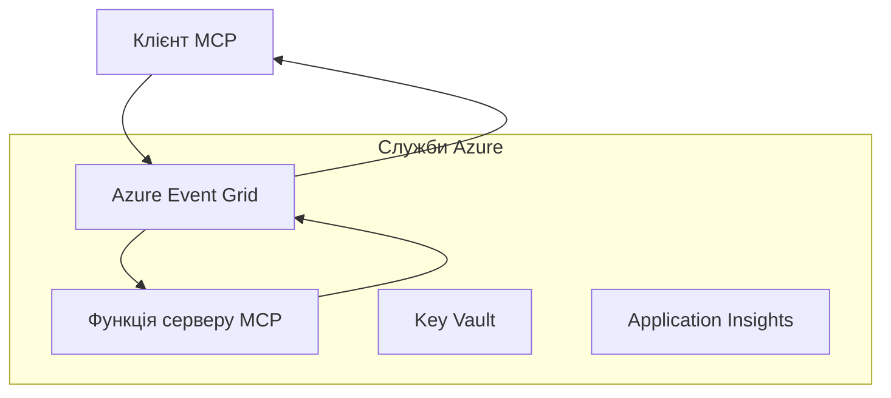
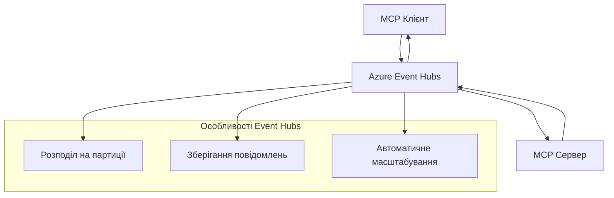

# MCP Користувацькі Транспорти – Покроковий Посібник з Розширеної Реалізації

Протокол Model Context Protocol (MCP) забезпечує гнучкість у механізмах транспортування, дозволяючи створювати користувацькі реалізації для спеціалізованих корпоративних середовищ. Цей розширений посібник розглядає реалізації користувацьких транспортів з використанням Azure Event Grid та Azure Event Hubs як практичних прикладів для побудови масштабованих, хмарно-орієнтованих MCP рішень.

> **Наперед:** цей посібник написано відповідно до **MCP Specification 2025-11-25**, де має зберігатися порядок сеансів для кожного сеансу (див. нижче Протокол Повідомлень). Реліз-кандидат `2026-07-28` повністю видаляє рівень протоколу сеансов і вимагає заголовки `Mcp-Method`/`Mcp-Name` для маршрутизації шлюзами та користувацькими транспортами на рівні запиту, а не сеансу. Дивіться [Що змінюється в MCP: реліз-кандидат 2026-07-28](../../01-CoreConcepts/mcp-2026-07-28-release-candidate.md).

## Вступ

Хоча стандартні транспорти MCP (stdio та HTTP streaming) задовольняють більшість випадків, корпоративні середовища часто потребують спеціалізованих механізмів транспорту для поліпшеної масштабованості, надійності та інтеграції з існуючою хмарною інфраструктурою. Користувацькі транспорти дають змогу MCP використовувати хмарні сервісні служби повідомлень для асинхронної взаємодії, подійно-орієнтованих архітектур і розподіленої обробки.

У цьому уроку розглядаються розширені реалізації транспортів на основі останньої специфікації MCP (2025-11-25), сервісів Azure для повідомлень та усталених корпоративних інтеграційних шаблонів.

### **Архітектура транспорту MCP**

**За Специфікацією MCP (2025-11-25):**

- **Стандартні транспорти**: stdio (рекомендовано), HTTP streaming (для віддалених сценаріїв)
- **Користувацькі транспорти**: будь-який транспорт, що реалізує протокол обміну повідомленнями MCP
- **Формат повідомлень**: JSON-RPC 2.0 з розширеннями MCP
- **Двосторонній зв’язок**: обов’язковий повнодуплексний зв’язок для сповіщень та відповідей

## Цілі навчання

Наприкінці цього розширеного уроку ви зможете:

- **Зрозуміти вимоги користувацьких транспортів**: Реалізувати протокол MCP поверх будь-якого транспортного рівня із дотриманням стандартів
- **Побудувати транспорт Azure Event Grid**: Створити подійно-орієнтовані MCP сервери з використанням Azure Event Grid для безсерверної масштабованості
- **Реалізувати транспорт Azure Event Hubs**: Спроектувати MCP рішення з високою пропускною здатністю з використанням Azure Event Hubs для потокової обробки в реальному часі
- **Застосувати корпоративні шаблони**: Інтегрувати користувацькі транспорти з існуючою Azure інфраструктурою й моделями безпеки
- **Забезпечити надійність транспорту**: Реалізувати збереження повідомлень, порядок і обробку помилок для корпоративних сценаріїв
- **Оптимізувати продуктивність**: Проектувати транспортні рішення з урахуванням масштабованості, затримок і пропускної здатності

## **Основні вимоги до транспорту**

### **Ключові вимоги за MCP Specification (2025-11-25):**

```yaml
Message Protocol:
  format: "JSON-RPC 2.0 with MCP extensions"
  bidirectional: "Full duplex communication required"
  ordering: "Message ordering must be preserved per session"
  
Transport Layer:
  reliability: "Transport MUST handle connection failures gracefully"
  security: "Transport MUST support secure communication"
  identification: "Each session MUST have unique identifier"
  
Custom Transport:
  compliance: "MUST implement complete MCP message exchange"
  extensibility: "MAY add transport-specific features"
  interoperability: "MUST maintain protocol compatibility"
```

## **Реалізація транспорту Azure Event Grid**

Azure Event Grid надає безсерверний сервіс маршрутизації подій, ідеальний для подійно-орієнтованих MCP архітектур. Ця реалізація демонструє, як побудувати масштабовані, слабо зв’язані MCP системи.

### **Огляд архітектури**



### **Реалізація на C# – транспорт Event Grid**

```csharp
using Azure.Messaging.EventGrid;
using Microsoft.Extensions.Azure;
using System.Text.Json;

public class EventGridMcpTransport : IMcpTransport
{
    private readonly EventGridPublisherClient _publisher;
    private readonly string _topicEndpoint;
    private readonly string _clientId;
    
    public EventGridMcpTransport(string topicEndpoint, string accessKey, string clientId)
    {
        _publisher = new EventGridPublisherClient(
            new Uri(topicEndpoint), 
            new AzureKeyCredential(accessKey));
        _topicEndpoint = topicEndpoint;
        _clientId = clientId;
    }
    
    public async Task SendMessageAsync(McpMessage message)
    {
        var eventGridEvent = new EventGridEvent(
            subject: $"mcp/{_clientId}",
            eventType: "MCP.MessageReceived",
            dataVersion: "1.0",
            data: JsonSerializer.Serialize(message))
        {
            Id = Guid.NewGuid().ToString(),
            EventTime = DateTimeOffset.UtcNow
        };
        
        await _publisher.SendEventAsync(eventGridEvent);
    }
    
    public async Task<McpMessage> ReceiveMessageAsync(CancellationToken cancellationToken)
    {
        // Event Grid is push-based, so implement webhook receiver
        // This would typically be handled by Azure Functions trigger
        throw new NotImplementedException("Use EventGridTrigger in Azure Functions");
    }
}

// Azure Function for receiving Event Grid events
[FunctionName("McpEventGridReceiver")]
public async Task<IActionResult> HandleEventGridMessage(
    [EventGridTrigger] EventGridEvent eventGridEvent,
    ILogger log)
{
    try
    {
        var mcpMessage = JsonSerializer.Deserialize<McpMessage>(
            eventGridEvent.Data.ToString());
        
        // Process MCP message
        var response = await _mcpServer.ProcessMessageAsync(mcpMessage);
        
        // Send response back via Event Grid
        await _transport.SendMessageAsync(response);
        
        return new OkResult();
    }
    catch (Exception ex)
    {
        log.LogError(ex, "Error processing Event Grid MCP message");
        return new BadRequestResult();
    }
}
```

### **Реалізація на TypeScript – транспорт Event Grid**

```typescript
import { EventGridPublisherClient, AzureKeyCredential } from "@azure/eventgrid";
import { McpTransport, McpMessage } from "./mcp-types";

export class EventGridMcpTransport implements McpTransport {
    private publisher: EventGridPublisherClient;
    private clientId: string;
    
    constructor(
        private topicEndpoint: string,
        private accessKey: string,
        clientId: string
    ) {
        this.publisher = new EventGridPublisherClient(
            topicEndpoint,
            new AzureKeyCredential(accessKey)
        );
        this.clientId = clientId;
    }
    
    async sendMessage(message: McpMessage): Promise<void> {
        const event = {
            id: crypto.randomUUID(),
            source: `mcp-client-${this.clientId}`,
            type: "MCP.MessageReceived",
            time: new Date(),
            data: message
        };
        
        await this.publisher.sendEvents([event]);
    }
    
    // Отримання за подіями через Azure Functions
    onMessage(handler: (message: McpMessage) => Promise<void>): void {
        // Реалізація використовуватиме тригер Azure Functions Event Grid
        // Це концептуальний інтерфейс для приймача вебхука
    }
}

// Реалізація Azure Functions
import { app, InvocationContext, EventGridEvent } from "@azure/functions";

app.eventGrid("mcpEventGridHandler", {
    handler: async (event: EventGridEvent, context: InvocationContext) => {
        try {
            const mcpMessage = event.data as McpMessage;
            
            // Обробка повідомлення MCP
            const response = await mcpServer.processMessage(mcpMessage);
            
            // Відправка відповіді через Event Grid
            await transport.sendMessage(response);
            
        } catch (error) {
            context.error("Error processing MCP message:", error);
            throw error;
        }
    }
});
```

### **Реалізація на Python – транспорт Event Grid**

```python
from azure.eventgrid import EventGridPublisherClient, EventGridEvent
from azure.core.credentials import AzureKeyCredential
import asyncio
import json
from typing import Callable, Optional
import uuid
from datetime import datetime

class EventGridMcpTransport:
    def __init__(self, topic_endpoint: str, access_key: str, client_id: str):
        self.client = EventGridPublisherClient(
            topic_endpoint, 
            AzureKeyCredential(access_key)
        )
        self.client_id = client_id
        self.message_handler: Optional[Callable] = None
    
    async def send_message(self, message: dict) -> None:
        """Send MCP message via Event Grid"""
        event = EventGridEvent(
            data=message,
            subject=f"mcp/{self.client_id}",
            event_type="MCP.MessageReceived",
            data_version="1.0"
        )
        
        await self.client.send(event)
    
    def on_message(self, handler: Callable[[dict], None]) -> None:
        """Register message handler for incoming events"""
        self.message_handler = handler

# Реалізація Azure Functions
import azure.functions as func
import logging

def main(event: func.EventGridEvent) -> None:
    """Azure Functions Event Grid trigger for MCP messages"""
    try:
        # Аналіз повідомлення MCP із події Event Grid
        mcp_message = json.loads(event.get_body().decode('utf-8'))
        
        # Обробка повідомлення MCP
        response = process_mcp_message(mcp_message)
        
        # Відправка відповіді назад через Event Grid
        # (Реалізація створить нового клієнта Event Grid)
        
    except Exception as e:
        logging.error(f"Error processing MCP Event Grid message: {e}")
        raise
```

## **Реалізація транспорту Azure Event Hubs**

Azure Event Hubs забезпечує високу пропускну здатність та потокові можливості в реальному часі для MCP сценаріїв, які вимагають низьких затримок і великого обсягу повідомлень.

### **Огляд архітектури**



### **Реалізація на C# – транспорт Event Hubs**

```csharp
using Azure.Messaging.EventHubs;
using Azure.Messaging.EventHubs.Producer;
using Azure.Messaging.EventHubs.Consumer;
using System.Text;

public class EventHubsMcpTransport : IMcpTransport, IDisposable
{
    private readonly EventHubProducerClient _producer;
    private readonly EventHubConsumerClient _consumer;
    private readonly string _consumerGroup;
    private readonly CancellationTokenSource _cancellationTokenSource;
    
    public EventHubsMcpTransport(
        string connectionString, 
        string eventHubName,
        string consumerGroup = "$Default")
    {
        _producer = new EventHubProducerClient(connectionString, eventHubName);
        _consumer = new EventHubConsumerClient(
            consumerGroup, 
            connectionString, 
            eventHubName);
        _consumerGroup = consumerGroup;
        _cancellationTokenSource = new CancellationTokenSource();
    }
    
    public async Task SendMessageAsync(McpMessage message)
    {
        var messageBody = JsonSerializer.Serialize(message);
        var eventData = new EventData(Encoding.UTF8.GetBytes(messageBody));
        
        // Add MCP-specific properties
        eventData.Properties.Add("MessageType", message.Method ?? "response");
        eventData.Properties.Add("MessageId", message.Id);
        eventData.Properties.Add("Timestamp", DateTimeOffset.UtcNow);
        
        await _producer.SendAsync(new[] { eventData });
    }
    
    public async Task StartReceivingAsync(
        Func<McpMessage, Task> messageHandler)
    {
        await foreach (PartitionEvent partitionEvent in _consumer.ReadEventsAsync(
            _cancellationTokenSource.Token))
        {
            try
            {
                var messageBody = Encoding.UTF8.GetString(
                    partitionEvent.Data.EventBody.ToArray());
                var mcpMessage = JsonSerializer.Deserialize<McpMessage>(messageBody);
                
                await messageHandler(mcpMessage);
            }
            catch (Exception ex)
            {
                // Handle deserialization or processing errors
                Console.WriteLine($"Error processing message: {ex.Message}");
            }
        }
    }
    
    public void Dispose()
    {
        _cancellationTokenSource?.Cancel();
        _producer?.DisposeAsync().AsTask().Wait();
        _consumer?.DisposeAsync().AsTask().Wait();
        _cancellationTokenSource?.Dispose();
    }
}
```

### **Реалізація на TypeScript – транспорт Event Hubs**

```typescript
import { 
    EventHubProducerClient, 
    EventHubConsumerClient, 
    EventData 
} from "@azure/event-hubs";

export class EventHubsMcpTransport implements McpTransport {
    private producer: EventHubProducerClient;
    private consumer: EventHubConsumerClient;
    private isReceiving = false;
    
    constructor(
        private connectionString: string,
        private eventHubName: string,
        private consumerGroup: string = "$Default"
    ) {
        this.producer = new EventHubProducerClient(
            connectionString, 
            eventHubName
        );
        this.consumer = new EventHubConsumerClient(
            consumerGroup,
            connectionString,
            eventHubName
        );
    }
    
    async sendMessage(message: McpMessage): Promise<void> {
        const eventData: EventData = {
            body: JSON.stringify(message),
            properties: {
                messageType: message.method || "response",
                messageId: message.id,
                timestamp: new Date().toISOString()
            }
        };
        
        await this.producer.sendBatch([eventData]);
    }
    
    async startReceiving(
        messageHandler: (message: McpMessage) => Promise<void>
    ): Promise<void> {
        if (this.isReceiving) return;
        
        this.isReceiving = true;
        
        const subscription = this.consumer.subscribe({
            processEvents: async (events, context) => {
                for (const event of events) {
                    try {
                        const messageBody = event.body as string;
                        const mcpMessage: McpMessage = JSON.parse(messageBody);
                        
                        await messageHandler(mcpMessage);
                        
                        // Оновити контрольну точку для доставки хоча б один раз
                        await context.updateCheckpoint(event);
                    } catch (error) {
                        console.error("Error processing Event Hubs message:", error);
                    }
                }
            },
            processError: async (err, context) => {
                console.error("Event Hubs error:", err);
            }
        });
    }
    
    async close(): Promise<void> {
        this.isReceiving = false;
        await this.producer.close();
        await this.consumer.close();
    }
}
```

### **Реалізація на Python – транспорт Event Hubs**

```python
from azure.eventhub import EventHubProducerClient, EventHubConsumerClient
from azure.eventhub import EventData
import json
import asyncio
from typing import Callable, Dict, Any
import logging

class EventHubsMcpTransport:
    def __init__(
        self, 
        connection_string: str, 
        eventhub_name: str,
        consumer_group: str = "$Default"
    ):
        self.producer = EventHubProducerClient.from_connection_string(
            connection_string, 
            eventhub_name=eventhub_name
        )
        self.consumer = EventHubConsumerClient.from_connection_string(
            connection_string,
            consumer_group=consumer_group,
            eventhub_name=eventhub_name
        )
        self.is_receiving = False
    
    async def send_message(self, message: Dict[str, Any]) -> None:
        """Send MCP message via Event Hubs"""
        event_data = EventData(json.dumps(message))
        
        # Додати властивості, специфічні для MCP
        event_data.properties = {
            "messageType": message.get("method", "response"),
            "messageId": message.get("id"),
            "timestamp": "2025-01-14T10:30:00Z"  # Використовувати фактичний часовий штамп
        }
        
        async with self.producer:
            event_data_batch = await self.producer.create_batch()
            event_data_batch.add(event_data)
            await self.producer.send_batch(event_data_batch)
    
    async def start_receiving(
        self, 
        message_handler: Callable[[Dict[str, Any]], None]
    ) -> None:
        """Start receiving MCP messages from Event Hubs"""
        if self.is_receiving:
            return
        
        self.is_receiving = True
        
        async with self.consumer:
            await self.consumer.receive(
                on_event=self._on_event_received(message_handler),
                starting_position="-1"  # Почати з початку
            )
    
    def _on_event_received(self, handler: Callable):
        """Internal event handler wrapper"""
        async def handle_event(partition_context, event):
            try:
                # Розпарсити повідомлення MCP з події Event Hubs
                message_body = event.body_as_str(encoding='UTF-8')
                mcp_message = json.loads(message_body)
                
                # Обробити повідомлення MCP
                await handler(mcp_message)
                
                # Оновити контрольну точку для доставки принаймні один раз
                await partition_context.update_checkpoint(event)
                
            except Exception as e:
                logging.error(f"Error processing Event Hubs message: {e}")
        
        return handle_event
    
    async def close(self) -> None:
        """Clean up transport resources"""
        self.is_receiving = False
        await self.producer.close()
        await self.consumer.close()
```

## **Розширені транспортні шаблони**

### **Збереження і Надійність Повідомлень**

```csharp
// Implementing message durability with retry logic
public class ReliableTransportWrapper : IMcpTransport
{
    private readonly IMcpTransport _innerTransport;
    private readonly RetryPolicy _retryPolicy;
    
    public async Task SendMessageAsync(McpMessage message)
    {
        await _retryPolicy.ExecuteAsync(async () =>
        {
            try
            {
                await _innerTransport.SendMessageAsync(message);
            }
            catch (TransportException ex) when (ex.IsRetryable)
            {
                // Log and retry
                throw;
            }
        });
    }
}
```

### **Інтеграція Безпеки транспорту**

```csharp
// Integrating Azure Key Vault for transport security
public class SecureTransportFactory
{
    private readonly SecretClient _keyVaultClient;
    
    public async Task<IMcpTransport> CreateEventGridTransportAsync()
    {
        var accessKey = await _keyVaultClient.GetSecretAsync("EventGridAccessKey");
        var topicEndpoint = await _keyVaultClient.GetSecretAsync("EventGridTopic");
        
        return new EventGridMcpTransport(
            topicEndpoint.Value.Value,
            accessKey.Value.Value,
            Environment.MachineName
        );
    }
}
```

### **Моніторинг і Спостережливість транспорту**

```csharp
// Adding telemetry to custom transports
public class ObservableTransport : IMcpTransport
{
    private readonly IMcpTransport _transport;
    private readonly ILogger _logger;
    private readonly TelemetryClient _telemetryClient;
    
    public async Task SendMessageAsync(McpMessage message)
    {
        using var activity = Activity.StartActivity("MCP.Transport.Send");
        activity?.SetTag("transport.type", "EventGrid");
        activity?.SetTag("message.method", message.Method);
        
        var stopwatch = Stopwatch.StartNew();
        
        try
        {
            await _transport.SendMessageAsync(message);
            
            _telemetryClient.TrackDependency(
                "EventGrid",
                "SendMessage",
                DateTime.UtcNow.Subtract(stopwatch.Elapsed),
                stopwatch.Elapsed,
                true
            );
        }
        catch (Exception ex)
        {
            _telemetryClient.TrackException(ex);
            throw;
        }
    }
}
```

## **Сценарії інтеграції для підприємств**

### **Сценарій 1: Розподілена обробка MCP**

Використання Azure Event Grid для розподілу MCP запитів між кількома обробними вузлами:

```yaml
Architecture:
  - MCP Client sends requests to Event Grid topic
  - Multiple Azure Functions subscribe to process different tool types
  - Results aggregated and returned via separate response topic
  
Benefits:
  - Horizontal scaling based on message volume
  - Fault tolerance through redundant processors
  - Cost optimization with serverless compute
```

### **Сценарій 2: Потокова обробка MCP в реальному часі**

Використання Azure Event Hubs для высокочастотної взаємодії MCP:

```yaml
Architecture:
  - MCP Client streams continuous requests via Event Hubs
  - Stream Analytics processes and routes messages
  - Multiple consumers handle different aspect of processing
  
Benefits:
  - Low latency for real-time scenarios
  - High throughput for batch processing
  - Built-in partitioning for parallel processing
```

### **Сценарій 3: Гібридна транспортна архітектура**

Поєднання кількох транспортів для різних випадків використання:

```csharp
public class HybridMcpTransport : IMcpTransport
{
    private readonly IMcpTransport _realtimeTransport; // Event Hubs
    private readonly IMcpTransport _batchTransport;    // Event Grid
    private readonly IMcpTransport _fallbackTransport; // HTTP Streaming
    
    public async Task SendMessageAsync(McpMessage message)
    {
        // Route based on message characteristics
        var transport = message.Method switch
        {
            "tools/call" when IsRealtime(message) => _realtimeTransport,
            "resources/read" when IsBatch(message) => _batchTransport,
            _ => _fallbackTransport
        };
        
        await transport.SendMessageAsync(message);
    }
}
```

## **Оптимізація продуктивності**

### **Обробка пакетів повідомлень для Event Grid**

```csharp
public class BatchingEventGridTransport : IMcpTransport
{
    private readonly List<McpMessage> _messageBuffer = new();
    private readonly Timer _flushTimer;
    private const int MaxBatchSize = 100;
    
    public async Task SendMessageAsync(McpMessage message)
    {
        lock (_messageBuffer)
        {
            _messageBuffer.Add(message);
            
            if (_messageBuffer.Count >= MaxBatchSize)
            {
                _ = Task.Run(FlushMessages);
            }
        }
    }
    
    private async Task FlushMessages()
    {
        List<McpMessage> toSend;
        lock (_messageBuffer)
        {
            toSend = new List<McpMessage>(_messageBuffer);
            _messageBuffer.Clear();
        }
        
        if (toSend.Any())
        {
            var events = toSend.Select(CreateEventGridEvent);
            await _publisher.SendEventsAsync(events);
        }
    }
}
```

### **Стратегія розподілу для Event Hubs**

```csharp
public class PartitionedEventHubsTransport : IMcpTransport
{
    public async Task SendMessageAsync(McpMessage message)
    {
        // Partition by client ID for session affinity
        var partitionKey = ExtractClientId(message);
        
        var eventData = new EventData(JsonSerializer.SerializeToUtf8Bytes(message))
        {
            PartitionKey = partitionKey
        };
        
        await _producer.SendAsync(new[] { eventData });
    }
}
```

## **Тестування користувацьких транспортів**

### **Модульне тестування з тестовими замінниками**

```csharp
[Test]
public async Task EventGridTransport_SendMessage_PublishesCorrectEvent()
{
    // Arrange
    var mockPublisher = new Mock<EventGridPublisherClient>();
    var transport = new EventGridMcpTransport(mockPublisher.Object);
    var message = new McpMessage { Method = "tools/list", Id = "test-123" };
    
    // Act
    await transport.SendMessageAsync(message);
    
    // Assert
    mockPublisher.Verify(
        x => x.SendEventAsync(
            It.Is<EventGridEvent>(e => 
                e.EventType == "MCP.MessageReceived" &&
                e.Subject == "mcp/test-client"
            )
        ),
        Times.Once
    );
}
```

### **Інтеграційне тестування з Azure Test Containers**

```csharp
[Test]
public async Task EventHubsTransport_IntegrationTest()
{
    // Using Testcontainers for integration testing
    var eventHubsContainer = new EventHubsContainer()
        .WithEventHub("test-hub");
    
    await eventHubsContainer.StartAsync();
    
    var transport = new EventHubsMcpTransport(
        eventHubsContainer.GetConnectionString(),
        "test-hub"
    );
    
    // Test message round-trip
    var sentMessage = new McpMessage { Method = "test", Id = "123" };
    McpMessage receivedMessage = null;
    
    await transport.StartReceivingAsync(msg => {
        receivedMessage = msg;
        return Task.CompletedTask;
    });
    
    await transport.SendMessageAsync(sentMessage);
    await Task.Delay(1000); // Allow for message processing
    
    Assert.That(receivedMessage?.Id, Is.EqualTo("123"));
}
```

## **Кращі практики та рекомендації**

### **Принципи проектування транспорту**

1. **Ідемпотентність**: Переконайтесь, що обробка повідомлень є ідемпотентною для уникнення дублювання
2. **Обробка помилок**: Реалізуйте комплексну обробку помилок і черги померлих листів
3. **Моніторинг**: Додайте детальну телеметрію та перевірки здоров’я
4. **Безпека**: Використовуйте керовані ідентичності та принцип найменших привілеїв
5. **Продуктивність**: Проектуйте під ваші конкретні вимоги до затримки та пропускної здатності

### **Рекомендації, специфічні для Azure**

1. **Використовуйте керовану ідентичність**: Уникайте рядків підключення у продакшені
2. **Реалізуйте розривальники ланцюга (Circuit Breakers)**: Захищайтеся від простоїв сервісів Azure
3. **Контролюйте витрати**: Відстежуйте обсяг повідомлень і вартість обробки
4. **Плануйте масштабування**: Спроектуйте стратегії розподілу і масштабування заздалегідь
5. **Проводьте ретельне тестування**: Використовуйте Azure DevTest Labs для комплексного тестування

## **Висновок**

Користувацькі MCP транспорти відкривають потужні корпоративні сценарії з використанням сервісів повідомлень Azure. Реалізуючи транспорти Event Grid або Event Hubs, ви можете побудувати масштабовані, надійні MCP рішення, які бездоганно інтегруються з існуючою інфраструктурою Azure.

Надані приклади демонструють готові до продакшн шаблони реалізації користувацьких транспортів із дотриманням протоколу MCP і кращих практик Azure.

## **Додаткові ресурси**

- [MCP Specification 2025-11-25](https://modelcontextprotocol.io/specification/2025-11-25/)
- [Документація Azure Event Grid](https://docs.microsoft.com/azure/event-grid/)
- [Документація Azure Event Hubs](https://docs.microsoft.com/azure/event-hubs/)
- [Azure Functions Event Grid Trigger](https://docs.microsoft.com/azure/azure-functions/functions-bindings-event-grid)
- [Azure SDK для .NET](https://github.com/Azure/azure-sdk-for-net)
- [Azure SDK для TypeScript](https://github.com/Azure/azure-sdk-for-js)
- [Azure SDK для Python](https://github.com/Azure/azure-sdk-for-python)

---

> *Цей посібник зосереджений на практичних шаблонах реалізації для продуктивних MCP систем. Завжди перевіряйте реалізації транспортів відповідно до ваших конкретних вимог і обмежень сервісів Azure.*
> **Поточний стандарт**: цей посібник відображає вимоги транспорту та розширені шаблони для корпоративних середовищ, описані в [MCP Specification 2025-11-25](https://modelcontextprotocol.io/specification/2025-11-25/).


## Що далі
- [6. Внески спільноти](../../06-CommunityContributions/README.md)

---

<!-- CO-OP TRANSLATOR DISCLAIMER START -->
**Відмова від відповідальності**:
Цей документ було перекладено за допомогою сервісу штучного інтелекту для перекладу [Co-op Translator](https://github.com/Azure/co-op-translator). Хоча ми прагнемо до точності, будь ласка, майте на увазі, що автоматичні переклади можуть містити помилки або неточності. Оригінальний документ рідною мовою слід вважати авторитетним джерелом. Для критично важливої інформації рекомендується професійний людський переклад. Ми не несемо відповідальності за будь-які непорозуміння або неправильні тлумачення, що виникли внаслідок використання цього перекладу.
<!-- CO-OP TRANSLATOR DISCLAIMER END -->