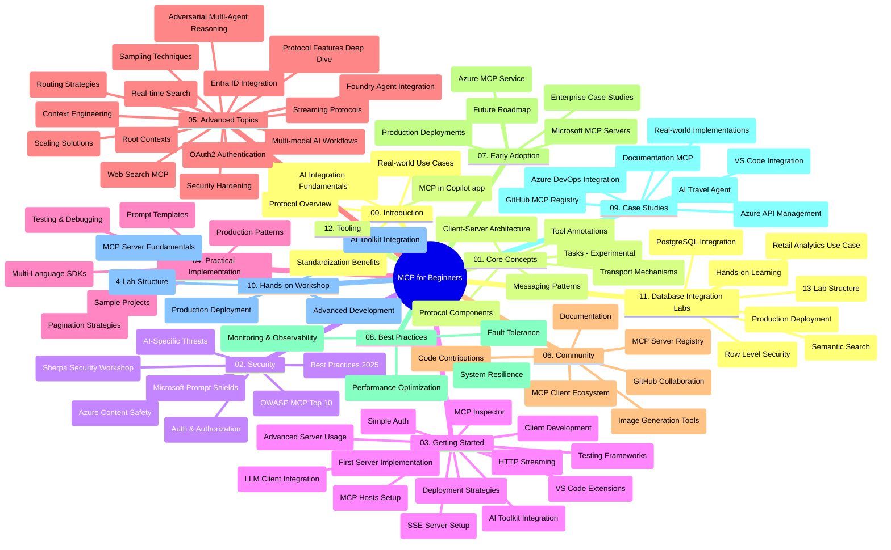

# Протокол Контексту Моделі (MCP) для початківців - Навчальний посібник

Цей навчальний посібник надає огляд структури репозиторію та вмісту курсу "Протокол Контексту Моделі (MCP) для початківців". Використовуйте цей посібник для ефективної навігації по репозиторію та максимально ефективного використання наявних ресурсів.

## Огляд репозиторію

Протокол Контексту Моделі (MCP) — це стандартизована основа для взаємодії між AI-моделями та клієнтськими додатками. Спершу створений компанією Anthropic, MCP тепер підтримується ширшою спільнотою MCP через офіційну організацію на GitHub. Цей репозиторій містить комплексну навчальну програму з практичними прикладами коду на C#, Java, JavaScript, Python та TypeScript, розроблену для розробників AI, системних архітекторів та інженерів-програмістів.

## Візуальна карта навчальної програми

## Структура репозиторію

Репозиторій організовано у дванадцять основних розділів, кожен з яких зосереджений на різних аспектах MCP:

1. **Вступ (00-Introduction/)**
   - Огляд Протоколу Контексту Моделі
   - Чому стандартизація важлива в AI-ланцюжках
   - Практичні випадки використання та переваги

2. **Основні концепції (01-CoreConcepts/)**
   - Архітектура клієнт-сервер
   - Ключові компоненти протоколу
   - Патерни обміну повідомленнями в MCP
   - Погляд у майбутнє: [Що змінюється в MCP: Кандидат на реліз 2026-07-28](./01-CoreConcepts/mcp-2026-07-28-release-candidate.md) — безстанове ядро протоколу, фреймворк розширень, та очікувані депрецяції Roots/Sampling/Logging у наступній версії специфікації

3. **Безпека (02-Security/)**
   - Загрози безпеці в системах на базі MCP
   - Кращі практики забезпечення безпеки реалізацій
   - Стратегії аутентифікації та авторизації
   - **Вичерпна документація з безпеки**:
     - Кращі практики безпеки MCP 2025 року
     - Посібник з реалізації безпеки контенту Azure
     - Контролі та техніки безпеки MCP
     - Швидка довідка кращих практик MCP
   - **Ключові теми безпеки**:
     - Атаки впровадження підказок та отруєння інструментів
     - Захоплення сесій та проблеми "заплутаного представника"
     - Уразливості проходження токенів
     - Надмірні права доступу та контроль доступу
     - Безпека ланцюжка постачання для AI-компонентів
     - Інтеграція Microsoft Prompt Shields

4. **Початок роботи (03-GettingStarted/)**
   - Налаштування та конфігурація середовища
   - Створення базових MCP серверів і клієнтів
   - Інтеграція з існуючими додатками
   - Включає розділи для:
     - Першої реалізації сервера
     - Розробки клієнта
     - Інтеграції LLM клієнта
     - Інтеграції з VS Code
     - Серверу Server-Sent Events (SSE)
     - Розширеного використання сервера
     - HTTP стрімінгу
     - Інтеграції AI Toolkit
     - Стратегій тестування
     - Керівництва з розгортання

5. **Практична реалізація (04-PracticalImplementation/)**
   - Використання SDK для різних мов програмування
   - Техніки відлагодження, тестування та валідації
   - Створення повторно використовуваних шаблонів підказок і робочих процесів
   - Зразки проектів з прикладами реалізації

6. **Поглиблені теми (05-AdvancedTopics/)**
   - Техніки інженерії контексту
   - Інтеграція агента Foundry
   - Багатомодальні AI робочі процеси
   - Демонстрації аутентифікації OAuth2
   - Можливості пошуку в реальному часі
   - Стрімінг у реальному часі
   - Реалізація кореневих контекстів
   - Стратегії маршрутизації
   - Техніки вибірки
   - Підходи масштабування
   - Безпекові міркування
   - Інтеграція безпеки Entra ID
   - Інтеграція веб-пошуку
   - Адверсарний мультіагентний розум (патерни дебатів)

7. **Внески спільноти (06-CommunityContributions/)**
   - Як вносити код та документацію
   - Співпраця через GitHub
   - Покращення та відгуки, ініційовані спільнотою
   - Використання різних MCP клієнтів (Claude Desktop, Cline, VSCode)
   - Робота з популярними MCP серверами, включаючи генерацію зображень

8. **Уроки раннього впровадження (07-LessonsfromEarlyAdoption/)**
   - Реальні впровадження та історії успіху
   - Створення та розгортання рішень на базі MCP
   - Тренди та дорожня карта на майбутнє
   - **Путівник по Microsoft MCP серверах**: Повний путівник по 10 готових до виробництва серверах Microsoft MCP, у тому числі:
     - Document MCP сервер Microsoft Learn
     - Azure MCP сервер (15+ спеціалізованих конекторів)
     - GitHub MCP сервер
     - Azure DevOps MCP сервер
     - MarkItDown MCP сервер
     - SQL Server MCP сервер
     - Playwright MCP сервер
     - Dev Box MCP сервер
     - Microsoft Foundry MCP сервер
     - Microsoft 365 Agents Toolkit MCP сервер

9. **Кращі практики (08-BestPractices/)**
   - Налаштування продуктивності та оптимізація
   - Проектування відмовостійких MCP систем
   - Стратегії тестування та стійкості

10. **Дослідження випадків (09-CaseStudy/)**
    - **Сім комплексних досліджень випадків**, що демонструють універсальність MCP у різних сценаріях:
    - **Агенти подорожей Azure AI**: Оркестрація мультіагентів за допомогою Azure OpenAI та AI Search
    - **Інтеграція Azure DevOps**: Автоматизація робочих процесів з оновленнями даних YouTube
    - **Отримання документації в реальному часі**: Консольний клієнт на Python із HTTP струмінним передаванням
    - **Інтерактивний генератор плану навчання**: Веб-додаток Chainlit з розмовним AI
    - **Документація в редакторі**: Інтеграція VS Code з робочими процесами GitHub Copilot
    - **Управління API Azure**: Корпоративна інтеграція API з створенням MCP сервера
    - **Реєстр GitHub MCP**: Розвиток екосистеми та платформа агентської інтеграції
    - Приклади реалізації у сфері корпоративної інтеграції, підвищення продуктивності розробників та розвитку екосистеми

11. **Практичний семінар (10-StreamliningAIWorkflowsBuildingAnMCPServerWithAIToolkit/)**
    - Всеохопний практичний семінар, що поєднує MCP з AI Toolkit
    - Створення інтелектуальних додатків, що поєднують AI-моделі з реальними інструментами
    - Практичні модулі, що охоплюють основи, розробку власного сервера та стратегії розгортання в продуктивне середовище
    - **Структура лабораторних робіт**:
      - Лабораторна 1: Основи MCP сервера
      - Лабораторна 2: Поглиблена розробка MCP сервера
      - Лабораторна 3: Інтеграція AI Toolkit
      - Лабораторна 4: Розгортання в продуктивне середовище та масштабування
    - Підхід навчання через лабораторні роботи з покроковими інструкціями

12. **Лабораторні роботи з інтеграції MCP сервера з базами даних (11-MCPServerHandsOnLabs/)**
    - **Вичерпний навчальний шлях із 13 лабораторних робіт** для створення MCP серверів, готових до продуктивного використання, з інтеграцією PostgreSQL
    - **Реалізація аналітики роздрібної торгівлі у реальному світі** за допомогою кейсу Zava Retail
    - **Корпоративні патерни** включно з Row Level Security (RLS), семантичним пошуком та багатокористувацьким доступом до даних
    - **Повна структура лабораторних**:
      - **Лабораторні 00-03: Основи** - Вступ, Архітектура, Безпека, Налаштування середовища
      - **Лабораторні 04-06: Створення MCP сервера** - Проєктування бази даних, Реалізація MCP сервера, Розробка інструментів
      - **Лабораторні 07-09: Розширені функції** - Семантичний пошук, Тестування та відлагодження, Інтеграція з VS Code

      - **Лабораторні роботи 10-12: Виробництво та найкращі практики** - Розгортання, Моніторинг, Оптимізація
    - **Покриті технології**: Фреймворк FastMCP, PostgreSQL, Azure OpenAI, Azure Container Apps, Application Insights
    - **Результати навчання**: Сервери MCP, готові до виробництва, патерни інтеграції баз даних, аналітика на базі ШІ, корпоративна безпека

13. **Інструменти (12-tooling/)**
    - Навчіться використовувати MCP у додатку Copilot та інших інструментах

## Додаткові ресурси

Репозиторій містить допоміжні ресурси:

- **Папка зображень**: Містить діаграми та ілюстрації, які використовуються в усьому навчальному плані
- **Переклади**: Підтримка багатьох мов з автоматичним перекладом документації
- **Офіційні ресурси MCP**:
  - [Документація MCP](https://modelcontextprotocol.io/)
  - [Специфікація MCP](https://spec.modelcontextprotocol.io/)
  - [Репозиторій MCP на GitHub](https://github.com/modelcontextprotocol)

## Як використовувати цей репозиторій

1. **Послідовне навчання**: Дотримуйтесь розділів по порядку (від 00 до 11) для структурованого навчального процесу.
2. **Фокус на мові програмування**: Якщо вас цікавить конкретна мова програмування, вивчайте каталоги прикладів із реалізаціями на вашій уподобаній мові.
3. **Практична реалізація**: Почніть із розділу "Початок роботи", щоб налаштувати середовище та створити свій перший сервер і клієнт MCP.
4. **Поглиблене вивчення**: Після засвоєння основ переходьте до просунутих тем для розширення знань.
5. **Залучення спільноти**: Приєднуйтесь до спільноти MCP через обговорення на GitHub та канали Discord, щоб спілкуватися з експертами та іншими розробниками.

## Клієнти та інструменти MCP

Навчальний план охоплює різноманітні клієнти та інструменти MCP:

1. **Офіційні клієнти**:
   - Visual Studio Code 
   - MCP у Visual Studio Code
   - Claude Desktop
   - Claude у VSCode 
   - Claude API

2. **Клієнти спільноти**:
   - Cline (термінальний)
   - Cursor (редактор коду)
   - ChatMCP
   - Windsurf

3. **Інструменти керування MCP**:
   - MCP CLI
   - MCP Manager
   - MCP Linker
   - MCP Router

## Популярні сервери MCP

У репозиторії представлені різні сервери MCP, зокрема:

1. **Офіційні сервери Microsoft MCP**:
   - Сервер Microsoft Learn Docs MCP
   - Сервер Azure MCP (більше 15 спеціалізованих конекторів)
   - Сервер GitHub MCP
   - Сервер Azure DevOps MCP
   - Сервер MarkItDown MCP
   - Сервер SQL Server MCP
   - Сервер Playwright MCP
   - Сервер Dev Box MCP
   - Сервер Microsoft Foundry MCP
   - Сервер Microsoft 365 Agents Toolkit MCP

2. **Офіційні еталонні сервери**:
   - Файлова система
   - Fetch
   - Пам’ять
   - Послідовне мислення

3. **Генерація зображень**:
   - Azure OpenAI DALL-E 3
   - Stable Diffusion WebUI
   - Replicate

4. **Інструменти розробника**:
   - Git MCP
   - Керування терміналом
   - Помічник коду

5. **Спеціалізовані сервери**:
   - Salesforce
   - Microsoft Teams
   - Jira & Confluence

## Участь у розробці

Цей репозиторій вітає внески від спільноти. Дивіться розділ "Спільнотні внески" для рекомендацій щодо ефективної участі в екосистемі MCP.

----

*Цей навчальний посібник було оновлено востаннє 5 лютого 2026 року, відображаючи останню Специфікацію MCP 2025-11-25 і надає огляд репозиторію станом на цю дату. Зміст репозиторію може оновлюватися після цієї дати.*

*Додаток (2 липня 2026 року): урок про кандидат у реліз Специфікації MCP від 2026-07-28 було додано у [01-CoreConcepts](./01-CoreConcepts/mcp-2026-07-28-release-candidate.md); базова лінія навчального плану залишається 2025-11-25 до виходу нової специфікації.*

---

<!-- CO-OP TRANSLATOR DISCLAIMER START -->
**Відмова від відповідальності**:
Цей документ було перекладено за допомогою сервісу штучного інтелекту для перекладу [Co-op Translator](https://github.com/Azure/co-op-translator). Хоча ми прагнемо до точності, будь ласка, майте на увазі, що автоматичні переклади можуть містити помилки або неточності. Оригінальний документ рідною мовою слід вважати авторитетним джерелом. Для критично важливої інформації рекомендується професійний людський переклад. Ми не несемо відповідальності за будь-які непорозуміння або неправильні тлумачення, що виникли внаслідок використання цього перекладу.
<!-- CO-OP TRANSLATOR DISCLAIMER END -->