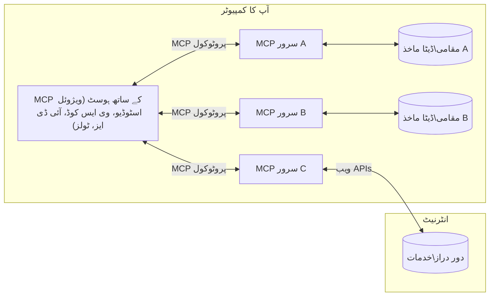

# MCP کور تصورات: AI انٹیگریشن کے لیے ماڈل کانٹیکسٹ پروٹوکول میں مہارت حاصل کرنا

[](https://youtu.be/earDzWGtE84)

_(اس سبق کی ویڈیو دیکھنے کے لیے اوپر تصویر پر کلک کریں)_

[Model Context Protocol (MCP)](https://github.com/modelcontextprotocol) ایک طاقتور، معیاری فریم ورک ہے جو لینگویج ماڈلز (LLMs) اور بیرونی آلات، ایپلیکیشنز، اور ڈیٹا ذرائع کے درمیان مواصلات کو بہتر بناتا ہے۔
یہ رہنما آپ کو MCP کے بنیادی تصورات سے روشناس کرائے گا۔ آپ اس کے کلائنٹ-سرور آرکیٹیکچر، اہم اجزاء، مواصلاتی طریقہ کار، اور عمل درآمد کی بہترین مشقوں کے بارے میں سیکھیں گے۔

- **واضح صارف کی منظوری**: تمام ڈیٹا تک رسائی اور عمل درآمد کے لیے صارف کی واضح منظوری ضروری ہے۔ صارفین کو واضح طور پر سمجھنا چاہیے کہ کون سا ڈیٹا استعمال کیا جائے گا اور کون سے اعمال انجام دیے جائیں گے، اور اجازت ناموں اور اختیارات پر تفصیلی کنٹرول حاصل ہونا چاہیے۔

- **ڈیٹا پرائیویسی کی حفاظت**: صارف کا ڈیٹا صرف واضح منظوری کے ساتھ ظاہر کیا جاتا ہے اور پورے تعامل کے دوران مضبوط رسائی کنٹرولز کے ذریعے محفوظ رہنا چاہیے۔ عمل درآمد کو غیر مجاز ڈیٹا کی منتقلی روکنی چاہیے اور سخت پرائیویسی کی حدود قائم رکھنی چاہیے۔

- **آلات کے عمل درآمد کی حفاظت**: ہر ٹول کال کے لیے صارف کی واضح منظوری ضروری ہے جس میں ٹول کی فعالیت، پیرامیٹرز، اور ممکنہ اثرات کی وضاحت شامل ہو۔ مضبوط حفاظتی حدود غیر مطلوبہ، غیر محفوظ، یا نقصان دہ عمل درآمد کو روکیں۔

- **ٹرانسپورٹ لیئر سیکیورٹی**: تمام مواصلاتی چینلز کو مناسب انکرپشن اور تصدیقی طریقہ کار استعمال کرنے چاہئیں۔ ریموٹ کنکشنز کو محفوظ ٹرانسپورٹ پروٹوکولز اور مناسب اسناد کے انتظام کے ساتھ نافذ کیا جانا چاہیے۔

#### عمل درآمد کے رہنما اصول:

- **اجازت کا انتظام**: باریک بینی پر مبنی اجازت نظام نافذ کریں جو صارفین کو کنٹرول کرنے دے کہ کون سے سرور، آلات، اور وسائل قابل رسائی ہیں
- **تصدیق اور اجازت**: محفوظ تصدیقی طریقے (OAuth، API کیز) استعمال کریں، مناسب ٹوکن مینجمنٹ اور میعاد ختم ہونے کے ساتھ  
- **ان پٹ کی جانچ**: تمام پیرامیٹرز اور ڈیٹا ان پٹ کو متعین کردہ اسکیموں کے مطابق درست کریں تاکہ انجیکشن حملوں سے بچا جا سکے
- **آڈٹ لاگنگ**: حفاظتی نگرانی اور تعمیل کے لیے تمام عملیات کے مکمل لاگز رکھیں

## جائزہ

یہ سبق ماڈل کانٹیکسٹ پروٹوکول (MCP) ایکو سسٹم کی بنیادی ساخت اور اجزاء کا جائزہ فراہم کرتا ہے۔ آپ کلائنٹ-سرور آرکیٹیکچر، کلیدی اجزاء، اور مواصلاتی طریقہ کار کے بارے میں سیکھیں گے جو MCP تعاملات کو فعال کرتے ہیں۔

## اہم سیکھنے کے مقاصد

اس سبق کے آخر تک، آپ:

- MCP کے کلائنٹ-سرور آرکیٹیکچر کو سمجھیں گے۔
- میزبان، کلائنٹس، اور سرورز کے کردار اور ذمہ داریوں کی نشاندہی کریں گے۔
- MCP کو ایک لچکدار انٹیگریشن لیئر بنانے والی بنیادی خصوصیات کا تجزیہ کریں گے۔
- MCP ایکو سسٹم کے اندر معلومات کے بہاؤ کو سیکھیں گے۔
- .NET، جاوا، پائتھن، اور جاوا اسکرپٹ میں کوڈ کی مثالوں کے ذریعے عملی بصیرت حاصل کریں گے۔

## MCP آرکیٹیکچر: ایک گہرا جائزہ

MCP ایکو سسٹم ایک کلائنٹ-سرور ماڈل پر مبنی ہے۔ یہ ماڈیولر ڈھانچہ AI ایپلیکیشنز کو مؤثر طریقے سے آلات، ڈیٹا بیس، APIs، اور رابطہ جاتی وسائل کے ساتھ بات چیت کرنے کی اجازت دیتا ہے۔ آئیے اس آرکیٹیکچر کو اس کے بنیادی اجزاء میں تقسیم کریں۔

MCP اصل میں ایک کلائنٹ-سرور آرکیٹیکچر کی پیروی کرتا ہے جہاں ایک میزبان ایپلیکیشن متعدد سرورز سے جڑ سکتی ہے:



- **MCP میزبان**: VSCode، Claude Desktop، IDEs، یا AI آلات جیسے پروگرام جو MCP کے ذریعے ڈیٹا تک رسائی چاہتے ہیں
- **MCP کلائنٹس**: پروٹوکول کلائنٹس جو سرورز کے ساتھ 1:1 کنیکشنز برقرار رکھتے ہیں
- **MCP سرورز**: ہلکے پھلکے پروگرام جو معیاری ماڈل کانٹیکسٹ پروٹوکول کے ذریعے مخصوص صلاحیتیں فراہم کرتے ہیں
- **مقامی ڈیٹا ذرائع**: آپ کے کمپیوٹر کی فائلیں، ڈیٹا بیسز، اور خدمات جن تک MCP سرورز محفوظ طریقے سے رسائی حاصل کر سکتے ہیں
- **ریمورٹ سروسز**: انٹرنیٹ پر دستیاب بیرونی نظام جن سے MCP سرورز APIs کے ذریعے جڑ سکتے ہیں۔

MCP پروٹوکول ایک ترقی پذیر معیار ہے جو تاریخ کی شکل میں ورژننگ استعمال کرتا ہے (YYYY-MM-DD فارمیٹ)۔ موجودہ پروٹوکول ورژن **2025-11-25** ہے۔ آپ تازہ ترین اپ ڈیٹس کو [پروٹوکول وضاحت](https://modelcontextprotocol.io/specification/2025-11-25/) میں دیکھ سکتے ہیں۔

> **آگے کی نظر:** اگلے وضاحتی ورژن، **2026-07-28** کے لیے ریلیز کینڈیدٹ مئی 2026 میں اعلان کیا گیا تھا اور 28 جولائی 2026 کو جاری کیا جائے گا۔ یہ پروٹوکول کو ٹرانسپورٹ لیئر پر اسٹیٹ لیس بناتا ہے (initialize ہینڈشیک اور سیشن IDs کو ہٹانا)، ایکسٹنشنز فریم ورک کو رسمی بناتا ہے، اور روٹ، سیمپلنگ، اور لاگنگ کو نئے پیٹرنز کے حق میں ختم کر دیتا ہے۔ مکمل مفصل جائزہ کے لیے [MCP میں تبدیلیاں: 2026-07-28 ریلیز کینڈیدٹ](./mcp-2026-07-28-release-candidate.md) دیکھیں۔

### 1. میزبان

ماڈل کانٹیکسٹ پروٹوکول (MCP) میں، **میزبان** وہ AI ایپلیکیشنز ہیں جو صارفین کو پروٹوکول کے ساتھ تعامل کے لیے بنیادی انٹرفیس فراہم کرتی ہیں۔ میزبان متعدد MCP سرورز کے ساتھ کنکشنز کو منظم کرنے اور ہر سرور کنکشن کے لیے مخصوص MCP کلائنٹس بنانے کا کام کرتی ہیں۔ میزبان کی مثالیں:

- **AI ایپلیکیشنز**: Claude Desktop، Visual Studio Code، Claude Code
- **ترقی کے ماحول**: IDEs اور کوڈ ایڈیٹرز جو MCP کے ساتھ مربوط ہوتے ہیں  
- **حسب ضرورت ایپلیکیشنز**: مقصد سے بنے ہوئے AI ایجنٹس اور آلات

**میزبان** وہ ایپلیکیشنز ہیں جو AI ماڈل کے تعاملات کو منظم کرتی ہیں۔ وہ:

- **AI ماڈلز کی ہم آہنگی**: ایل ایل ایمز کو چلائیں یا ان کے ساتھ بات چیت کریں تاکہ جوابات تیار کیے جا سکیں اور AI ورک فلو کو منظم کیا جا سکے
- **کلائنٹ کنکشنز کا انتظام**: ہر MCP سرور کنکشن کے لیے ایک MCP کلائنٹ بنائیں اور رکھیں
- **صارف انٹرفیس کا کنٹرول**: گفتگو کا بہاؤ، صارف کی بات چیت، اور جوابات کی پیشکش کو سنبھالیں  
- **سیکیورٹی نافذ کرنا**: اجازتیں، حفاظتی پابندیاں، اور تصدیق کو کنٹرول کریں
- **صارف کی منظوری کا انتظام**: ڈیٹا شیئرنگ اور ٹول عمل درآمد کے لیے صارف کی منظوری کا انتظام کریں


### 2. کلائنٹس

**کلائنٹس** وہ اہم اجزاء ہیں جو میزبانوں اور MCP سرورز کے درمیان مخصوص ایک سے ایک کنیکشنز کو برقرار رکھتے ہیں۔ ہر MCP کلائنٹ میزبان کی جانب سے خاص MCP سرور سے جڑنے کے لیے شروع کیا جاتا ہے، اس بات کو یقینی بناتے ہوئے کہ مواصلاتی چینلز منظم اور محفوظ ہوں۔ متعدد کلائنٹس میزبانوں کو بیک وقت متعدد سرورز سے جڑنے کا موقع فراہم کرتے ہیں۔

**کلائنٹس** میزبان ایپلیکیشن کے اندر کنیکٹر اجزاء ہیں۔ وہ:

- **پروٹوکول کی مواصلت**: JSON-RPC 2.0 درخواستیں سرورز کو بھیجیں، جن میں پرامپٹس اور ہدایات شامل ہوں
- **صلاحیت کی بات چیت**: شروعاتی مرحلے میں سرورز کے ساتھ معاون خصوصیات اور پروٹوکول ورژنز پر بات چیت کریں
- **ٹول کے عمل درآمد کا انتظام**: ماڈلز سے ٹول عمل درآمد کی درخواستیں سنبھالیں اور جوابات پراسیس کریں
- **حقیقی وقت کی تازہ کاریوں کو ہینڈل کرنا**: سرورز سے اطلاعات اور حقیقی وقت کی اپ ڈیٹس سنبھالیں
- **جواب کی پراسیسنگ**: صارفین کو دکھانے کے لیے سرور کے جوابات کو پراسیس اور فارمیٹ کریں

### 3. سرورز

**سرورز** ایسے پروگرامز ہیں جو MCP کلائنٹس کو کانٹیکسٹ، ٹولز، اور صلاحیتیں فراہم کرتے ہیں۔ وہ مقامی طور پر (میزبان کے اسی کمپیوٹر پر) یا ریموٹلی (بیرونی پلیٹ فارمز پر) چل سکتے ہیں، اور کلائنٹ کی درخواستوں کو سنبھالنے اور منظم جوابات فراہم کرنے کے ذمہ دار ہیں۔ سرورز معیاری ماڈل کانٹیکسٹ پروٹوکول کے ذریعے مخصوص فعالیت فراہم کرتے ہیں۔

**سرورز** خدمات ہیں جو کانٹیکسٹ اور صلاحیتیں فراہم کرتی ہیں۔ وہ:

- **فیچر رجسٹریشن**: کلائنٹس کو دستیاب پریمیٹیوز (وسائل، پرامپٹس، آلات) کو رجسٹر اور ظاہر کریں
- **درخواست کی پروسیسنگ**: صارف کی درخواست کردہ ٹول کالز، وسائل کی درخواستیں، اور پرامپٹ کی درخواستیں وصول کریں اور عمل کریں
- **کانٹیکسچوئل فراہمی**: ماڈل کے جوابات کو بہتر بنانے کے لیے کانٹیکسچوئل معلومات اور ڈیٹا فراہم کریں
- **اسٹیٹ مینجمنٹ**: سیشن کی حالت برقرار رکھیں اور جب ضرورت ہو تو ریاستی تعاملات سنبھالیں
- **حقیقی وقت کی اطلاعات**: کنیکٹڈ کلائنٹس کو صلاحیت کی تبدیلیوں اور اپ ڈیٹس کے بارے میں اطلاعات بھیجیں

سرورز کو کوئی بھی تیار کر سکتا ہے تاکہ ماڈل کی صلاحیتوں کو خصوصی فعالیت کے ساتھ بڑھایا جا سکے، اور وہ مقامی اور ریموٹ دونوں تعیناتی کے منظرناموں کی حمایت کرتے ہیں۔

### 4. سرور پریمیٹیوز

ماڈل کانٹیکسٹ پروٹوکول (MCP) میں سرور تین بنیادی **پریمیٹیوز** فراہم کرتے ہیں جو کلائنٹس، میزبانوں، اور لینگویج ماڈلز کے درمیان بھرپور تعاملات کے بنیادی بلاکس کو متعین کرتے ہیں۔ یہ پریمیٹیوز اس بات کی وضاحت کرتے ہیں کہ کون سی قسم کی کانٹیکسچوئل معلومات اور اعمال پروٹوکول کے ذریعے دستیاب ہیں۔

MCP سرور درج ذیل تین بنیادی پریمیٹیوز میں سے کوئی بھی مجموعہ ظاہر کر سکتے ہیں:

#### وسائل 

**وسائل** وہ ڈیٹا ذرائع ہیں جو AI ایپلیکیشنز کو کانٹیکسچوئل معلومات فراہم کرتے ہیں۔ یہ سٹیٹک یا ڈائنامک مواد کی نمائندگی کرتے ہیں جو ماڈل کی سمجھ اور فیصلہ سازی کو بہتر بنا سکتے ہیں:

- **کانٹیکسچوئل ڈیٹا**: AI ماڈل کی کھپت کے لیے منظم معلومات اور سیاق و سباق
- **علمی بنیادیں**: دستاویزی ذخائر، مضامین، دستی کتابیں، اور تحقیقی مقالات
- **مقامی ڈیٹا ذرائع**: فائلیں، ڈیٹا بیس، اور مقامی نظام کی معلومات  
- **بیرونی ڈیٹا**: API جوابات، ویب سروسز، اور ریموٹ نظام کا ڈیٹا
- **ڈائنامک مواد**: حقیقی وقت کا ڈیٹا جو بیرونی حالات کی بنیاد پر اپ ڈیٹ ہوتا ہے

وسائل URIs کے ذریعے شناخت کیے جاتے ہیں اور `resources/list` کے ذریعے دریافت اور `resources/read` کے ذریعے حاصل کیے جا سکتے ہیں:

```text
file://documents/project-spec.md
database://production/users/schema
api://weather/current
```

#### پرامپٹس

**پرامپٹس** قابل استعمال ٹیمپلیٹس ہیں جو لینگویج ماڈلز کے ساتھ تعاملات کو منظم کرنے میں مدد دیتے ہیں۔ یہ معیاری تعاملاتی پیٹرنز اور ٹیمپلیٹ شدہ ورک فلو فراہم کرتے ہیں:

- **ٹیمپلیٹ پر مبنی تعاملات**: پہلے سے ساختہ پیغامات اور گفتگو کے آغاز کے جملے
- **ورک فلو ٹیمپلیٹس**: عام کاموں اور تعاملات کے لیے معیاری ترتیبیں
- **چند مثالیں**: ماڈل ہدایات کے لیے مثال پر مبنی ٹیمپلیٹس
- **سسٹم پرامپٹس**: بنیادی پرامپٹس جو ماڈل کے رویے اور سیاق کو متعین کرتے ہیں
- **ڈائنامک ٹیمپلیٹس**: مخصوص سیاق و سباق کے مطابق ایڈجسٹ ہونے والے پیرامیٹرائزڈ پرامپٹس

پرامپٹس متغیر کی تبدیلی کی حمایت کرتے ہیں اور `prompts/list` کے ذریعے دریافت کیے جا سکتے ہیں اور `prompts/get` کے ذریعے حاصل کیے جا سکتے ہیں:

```markdown
Generate a {{task_type}} for {{product}} targeting {{audience}} with the following requirements: {{requirements}}
```

#### آلات

**آلات** ایسے قابل عمل فنکشنز ہیں جنہیں AI ماڈلز مخصوص اعمال انجام دینے کے لیے کال کر سکتے ہیں۔ وہ MCP ایکو سسٹم کے "افعال" کی نمائندگی کرتے ہیں اور ماڈلز کو بیرونی نظاموں کے ساتھ بات چیت کرنے کے قابل بناتے ہیں:

- **قابل عمل فنکشنز**: علیحدہ آپریشنز جو ماڈلز مخصوص پیرامیٹرز کے ساتھ کال کر سکتے ہیں
- **بیرونی نظام کا انضمام**: API کالز، ڈیٹا بیس کی تلاش، فائل آپریشنز، حساب کتاب
- **منفرد شناخت**: ہر آلے کا ایک خاص نام، وضاحت، اور پیرامیٹر اسکیمہ ہوتا ہے
- **منظم ان پٹ/آؤٹ پٹ**: آلات تصدیق شدہ پیرامیٹرز قبول کرتے ہیں اور منظم، ٹائپ شدہ جوابات لوٹاتے ہیں
- **عمل کی صلاحیتیں**: ماڈلز کو حقیقی دنیا کے اعمال انجام دینے اور لائیو ڈیٹا بازیافت کرنے کی اجازت دیتے ہیں

آلات JSON اسکیمہ سے پیرامیٹر کی تصدیق کے لیے تعریف کیے جاتے ہیں اور `tools/list` کے ذریعے دریافت اور `tools/call` کے ذریعے عمل درآمد کیے جاتے ہیں۔ آلات بہتر UI پیشکش کے لیے اضافی میٹا ڈیٹا کے طور پر **آئیکنز** بھی شامل کر سکتے ہیں۔

**ٹول کی تشریحات**: آلات رویے کی تشریحات (مثلاً `readOnlyHint`, `destructiveHint`) کی حمایت کرتے ہیں جو بتاتی ہیں کہ آیا آلہ صرف پڑھنے والا ہے یا نقصان دہ، تاکہ کلائنٹس کو ٹول کے عمل درآمد کے بارے میں باخبر فیصلے کرنے میں مدد ملے۔

آلے کی تعریف کی ایک مثال:

```typescript
server.tool(
  "search_products", 
  {
    query: z.string().describe("Search query for products"),
    category: z.string().optional().describe("Product category filter"),
    max_results: z.number().default(10).describe("Maximum results to return")
  }, 
  async (params) => {
    // تلاش درج کریں اور منظم شدہ نتائج واپس کریں
    return await productService.search(params);
  }
);
```

## کلائنٹ پریمیٹیوز

ماڈل کانٹیکسٹ پروٹوکول (MCP) میں، **کلائنٹس** ایسے پریمیٹیوز ظاہر کر سکتے ہیں جو سرورز کو میزبان ایپلیکیشن سے اضافی صلاحیتوں کی درخواست کرنے کے قابل بناتے ہیں۔ یہ کلائنٹ-سائیڈ پریمیٹیوز زیادہ بھرپور، زیادہ انٹرایکٹو سرور عمل درآمد کی اجازت دیتے ہیں جو AI ماڈل کی صلاحیتوں اور صارف کے تعاملات تک رسائی حاصل کر سکتے ہیں۔

### سیمپلنگ

> **منسوخی کا نوٹس:** `2026-07-28` ریلیز کینڈیدٹ سیمپلنگ کو ہٹایا گیا قرار دیتا ہے تاکہ LLM فراہم کنندہ APIs کے ساتھ براہِ راست انٹیگریشن کی جا سکے۔ یہ `2025-11-25` میں اور کسی ہٹانے کے بعد کم از کم ایک سال تک کام کرتا رہے گا، لیکن نئے ڈیزائن متبادل پیٹرن کو ترجیح دیں گے۔ مزید دیکھیں [MCP میں کیا بدل رہا ہے: 2026-07-28 ریلیز کینڈیدٹ](./mcp-2026-07-28-release-candidate.md)۔

**سیمپلنگ** سرورز کو کلائنٹ کی AI ایپلیکیشن سے لینگویج ماڈل کی تکمیل کے لیے درخواست کرنے کی اجازت دیتی ہے۔ یہ پریمیٹیو سرورز کو اپنی ماڈل انحصارات شامل کیے بغیر LLM کی صلاحیتوں تک رسائی دے گا:

- **ماڈل سے آزاد رسائی**: سرورز بغیر LLM SDKs شامل کیے یا ماڈل تک رسائی کا انتظام کیے تکمیل کی درخواست کر سکتے ہیں
- **سرور کی طرف سے AI**: سرورز کو خودمختار طور پر کلائنٹ کے AI ماڈل کا استعمال کرکے مواد تیار کرنے کی اجازت دیتا ہے
- **تکراری LLM تعاملات**: پیچیدہ منظرناموں کی حمایت کرتا ہے جہاں سرورز کو پراسیسنگ کے لیے AI مدد درکار ہو
- **ڈائنامک مواد کی تخلیق**: میزبان کے ماڈل کا استعمال کرتے ہوئے سیاقی جوابات بنانے کی اجازت دیتا ہے
- **ٹول کالنگ کی حمایت**: سرورز `tools` اور `toolChoice` پیرامیٹرز شامل کر سکتے ہیں تاکہ کلائنٹ کا ماڈل سیمپلنگ کے دوران آلات کو کال کر سکے

سیمپلنگ `sampling/complete` میتھڈ کے ذریعے شروع کی جاتی ہے، جہاں سرورز کلائنٹس کو تکمیل کی درخواستیں بھیجتے ہیں۔

### روٹس

> **منسوخی کا نوٹس:** `2026-07-28` ریلیز کینڈیدٹ روٹس کو ان کے بجائے ٹول پیرامیٹرز، وسائل URI، یا سرور کنفیگریشن کے حق میں غیر فعال قرار دیتا ہے۔ یہ `2025-11-25` میں اور کسی بھی منسوخی کے بعد کم از کم ایک سال تک کام کرتا رہے گا۔ مزید دیکھیں [MCP میں کیا بدل رہا ہے: 2026-07-28 ریلیز کینڈیدٹ](./mcp-2026-07-28-release-candidate.md)۔

**روٹس** کلائنٹس کو ایک معیاری طریقہ فراہم کرتے ہیں تاکہ سرورز کو فائل سسٹم کی حدود دکھائی جا سکیں، اس طرح سرورز کو سمجھنے میں مدد ملتی ہے کہ وہ کن ڈائریکٹریز اور فائلوں تک رسائی رکھ سکتے ہیں:

- **فائل سسٹم کی حدود**: سرورز کو فائل سسٹم کے اندر کام کرنے کی حدود متعین کریں
- **رسائی کا کنٹرول**: سرورز کو مدد دیں کہ وہ سمجھ سکیں کہ انہیں کون سی ڈائریکٹریز اور فائلوں تک اجازت ہے
- **ڈائنامک اپ ڈیٹس**: کلائنٹس سرورز کو مطلع کر سکتے ہیں جب روٹس کی فہرست بدلے
- **URI پر مبنی شناخت**: روٹس `file://` URI استعمال کرتے ہوئے قابل رسائی ڈائریکٹریز اور فائلوں کی شناخت کرتے ہیں

روٹس کو `roots/list` میتھڈ کے ذریعے دریافت کیا جاتا ہے، اور کلائنٹس تبدیلی کی اطلاع `notifications/roots/list_changed` بھیجتے ہیں۔

### اِلِسیٹیشن  

**اِلِسیٹیشن** سرورز کو یہ اجازت دیتا ہے کہ وہ صارفین سے اضافی معلومات یا تصدیق کلائنٹ انٹرفیس کے ذریعے طلب کریں:

- **صارف ان پٹ کی درخواستیں**: جب ٹول کے عمل درآمد کے لیے ضرورت ہو سرورز اضافی معلومات طلب کر سکتے ہیں
- **تصدیقی مکالمے**: حساس یا مؤثر عملیات کے لیے صارف کی منظوری طلب کریں
- **انٹرایکٹو ورک فلو**: سرورز کو صارف کے ساتھ مرحلہ وار تعاملات بنانے کی اجازت دیتے ہیں
- **ڈائنامک پیرامیٹر کلیکشن**: ٹول کے عمل درآمد کے دوران غائب یا اختیاری پیرامیٹرز جمع کریں

اِلِسیٹیشن درخواستیں `elicitation/request` میتھڈ استعمال کرتے ہوئے کلائنٹ کے انٹرفیس کے ذریعے صارف کی ان پٹ جمع کرنے کے لیے کی جاتی ہیں۔

**URL موڈ اِلِسیٹیشن**: سرورز URL پر مبنی صارف تعاملات کی بھی درخواست کر سکتے ہیں، جس سے سرورز صارفین کو تصدیق، اجازت، یا ڈیٹا اندراج کے لیے بیرونی ویب صفحات پر بھیج سکتے ہیں۔

### لاگنگ


> **پرانی حالت کی اطلاع:** `2026-07-28` کے ریلیز امیدوار نے stdio ٹرانسپورٹس کے لیے `stderr` اور ساختہ مشاہدے کے لیے OpenTelemetry کی حمایت میں لاگنگ کو متروک قرار دیا ہے۔ یہ `2025-11-25` میں اور کسی بھی ختم ہونے کے کم از کم ایک سال تک کام کرنا جاری رکھتا ہے۔ دیکھیں [MCP میں کیا تبدیلیاں ہو رہی ہیں: 2026-07-28 ریلیز امیدوار](./mcp-2026-07-28-release-candidate.md)۔

**لاگنگ** سرورز کو کلائنٹس کو ڈیبگنگ، نگرانی، اور عملیاتی وضاحت کے لئے ساختہ لاگ پیغامات بھیجنے کی اجازت دیتا ہے:

- **ڈیبگنگ کی حمایت**: سرورز کو تفصیلی اجرا کے لاگز فراہم کرنے کے قابل بنائیں تاکہ خرابیوں کی تلاش کی جا سکے
- **عملیاتی نگرانی**: کلائنٹس کو صورتحال کی تازہ کاری اور کارکردگی کے میٹرکس بھیجیں
- **خرابی کی رپورٹنگ**: تفصیلی خرابی کا سیاق و سباق اور تشخیصی معلومات فراہم کریں
- **آڈٹ ٹریلز**: سرور آپریشنز اور فیصلوں کے مکمل لاگز بنائیں

لاگنگ پیغامات کلائنٹس کو بھیجے جاتے ہیں تاکہ سرور آپریشنز میں شفافیت فراہم کی جا سکے اور خرابی تلاش میں مدد ملے۔

## MCP میں معلومات کا بہاؤ

ماڈل کانٹیکسٹ پروٹوکول (MCP) میزبان، کلائنٹس، سرورز، اور ماڈلز کے درمیان معلومات کے ساختہ بہاؤ کی تعریف کرتا ہے۔ اس بہاؤ کو سمجھنا اس بات کو واضح کرتا ہے کہ صارف کی درخواستیں کیسے پروسیس کی جاتی ہیں اور باہر کے اوزار اور ڈیٹا ماڈل جوابات میں کیسے شامل ہوتے ہیں۔

- **میزبان کنکشن شروع کرتا ہے**  
  میزبان ایپلیکیشن (جیسے IDE یا چیٹ انٹرفیس) ایک MCP سرور سے رابطہ قائم کرتی ہے، عام طور پر STDIO، WebSocket، یا کسی اور سپورٹڈ ٹرانسپورٹ کے ذریعے۔

- **صلاحیتوں کا مذاکرات**  
  کلائنٹ (جو میزبان میں شامل ہوتا ہے) اور سرور اپنی حمایت شدہ خصوصیات، اوزار، وسائل، اور پروٹوکول ورژنز کے بارے میں معلومات کا تبادلہ کرتے ہیں۔ یہ یقینی بناتا ہے کہ دونوں طرف کو معلوم ہو کہ سیشن کے لیے کیا صلاحیتیں دستیاب ہیں۔

- **صارف کی درخواست**  
  صارف میزبان کے ساتھ تعامل کرتا ہے (مثلاً پرامپٹ یا کمانڈ داخل کرتا ہے)۔ میزبان یہ ان پٹ جمع کرتا ہے اور پروسیسنگ کے لیے کلائنٹ کو دیتا ہے۔

- **وسائل یا اوزار کا استعمال**  
  - کلائنٹ ماڈل کی فہم کو بہتر بنانے کے لیے سرور سے اضافی سیاق و سباق یا وسائل (جیسے فائلیں، ڈیٹا بیس کے اندراجات، یا علم کی بنیاد کے مضامین) مانگ سکتا ہے۔
  - اگر ماڈل طے کرتا ہے کہ کسی اوزار کی ضرورت ہے (مثلاً ڈیٹا حاصل کرنے، حساب کرنے یا API کال کرنے کے لیے)، تو کلائنٹ اوزار کال کرنے کی درخواست سرور کو بھیجتا ہے، جس میں اوزار کا نام اور پیرامیٹرز شامل ہوتے ہیں۔

- **سرور اجرا**  
  سرور وسائل یا اوزار کی درخواست وصول کرتا ہے، ضروری عمل انجام دیتا ہے (جیسے فنکشن چلانا، ڈیٹا بیس کی تلاش، یا فائل حاصل کرنا)، اور نتائج کو ساختہ شکل میں کلائنٹ کو واپس کرتا ہے۔

- **جواب کی تشکیل**  
  کلائنٹ سرور کے جوابات (وسائل کے ڈیٹا، اوزار کے نتائج وغیرہ) کو جاری ماڈل تعامل میں شامل کرتا ہے۔ ماڈل اس معلومات کا استعمال ایک مکمل اور سیاق و سباق سے متعلق جواب تیار کرنے میں کرتا ہے۔

- **نتائج کی پیشکش**  
  میزبان کلائنٹ سے حتمی نتیجہ وصول کرتا ہے اور اسے صارف کے سامنے پیش کرتا ہے، عام طور پر ماڈل کے بنائے ہوئے متن اور اوزار کے نتائج یا وسائل کی تلاش دونوں کو شامل کرتے ہوئے۔

یہ بہاؤ MCP کو جدید، انٹرایکٹو، اور سیاق و سباق سے آگاہ AI ایپلیکیشنز کی حمایت کرنے میں مدد دیتا ہے جو بغیر کسی رکاوٹ کے ماڈلز کو بیرونی اوزار اور ڈیٹا ذرائع سے جوڑتا ہے۔

## پروٹوکول کی ساخت اور پرتیں

MCP دو مختلف ساختی پرتوں پر مشتمل ہے جو مل کر مکمل مواصلاتی فریم ورک فراہم کرتے ہیں:

### ڈیٹا پرت

**ڈیٹا پرت** MCP پروٹوکول کے بنیادی اصولوں کو **JSON-RPC 2.0** کے ذریعے نافذ کرتی ہے۔ یہ پرت پیغام کی ساخت، معانی، اور تعامل کے پیٹرنز کی وضاحت کرتی ہے:

#### بنیادی اجزاء:

- **JSON-RPC 2.0 پروٹوکول**: تمام مواصلات معیاری JSON-RPC 2.0 پیغامات کے فارمیٹ میں میتھڈ کالز، جوابات، اور نوٹیفیکیشنز کے لیے ہوتی ہے
- **لائف سائیکل مینجمنٹ**: کنکشن کی ابتدا، صلاحیتوں کا مذاکرات، اور سیشن ختم کرنے کا بندوبست کرتا ہے کلائنٹس اور سرورز کے درمیان
- **سرور بنیادی عناصر**: سرورز کو اوزار، وسائل، اور پرامپٹس کے ذریعے بنیادی فعالیت فراہم کرنے کے قابل بناتا ہے
- **کلائنٹ بنیادی عناصر**: سرورز کو LLMs سے سیمپلنگ کی درخواست، صارف ان پٹ حاصل کرنے، اور لاگ پیغامات بھیجنے کے قابل بناتا ہے
- **حقیقی وقت کی نوٹیفیکیشنز**: پولنگ کے بغیر متحرک اپ ڈیٹس کے لیے غیر ہم وقت نوٹیفیکیشنز کی حمایت کرتا ہے

#### کلیدی خصوصیات:

- **پروٹوکول ورژن مذاکرات**: مطابقت کو یقینی بنانے کے لیے تاریخ پر مبنی ورژننگ (YYYY-MM-DD) استعمال کرتا ہے
- **صلاحیت کی دریافت**: کلائنٹس اور سرورز ابتدائیات میں اپنی حمایت شدہ خصوصیات کا تبادلہ کرتے ہیں
- **حالت دار سیشنز**: متعدد تعاملات کے دوران کنکشن کی حالت کو برقرار رکھتا ہے تاکہ سیاق و سباق کی تسلسل ہو

### ٹرانسپورٹ پرت

**ٹرانسپورٹ پرت** MCP کے شرکاء کے درمیان مواصلاتی چینلز، پیغام کی فریم بندی، اور توثیق کا انتظام کرتی ہے:

#### سپورٹڈ ٹرانسپورٹ میکانزم:

1. **STDIO ٹرانسپورٹ**:
   - براہ راست پروسیس کمیونیکیشن کے لئے معیاری ان پٹ/آؤٹ پٹ سٹریم استعمال کرتا ہے
   - ایک ہی مشین پر مقامی پروسیسز کے لیے بہترین، جہاں نیٹ ورک کا کوئی اوور ہیڈ نہیں ہوتا
   - عام طور پر مقامی MCP سرور کی تنصیبات کے لیے استعمال ہوتا ہے

2. **اسٹریما بلب HTTP ٹرانسپورٹ**:
   - کلائنٹ سے سرور تک پیغامات کے لیے HTTP POST استعمال کرتا ہے  
   - سرور سے کلائنٹ تک سٹریمنگ کے لیے اختیاری سرور-سینٹ ایونٹس (SSE)
   - نیٹ ورکس کے ذریعے دور دراز سرور مواصلات کو فعال کرتا ہے
   - معیاری HTTP توثیق کی حمایت کرتا ہے (بیئر ٹوکنز، API کلیدیں، کسٹم ہیڈرز)
   - MCP ٹوکن کی محفوظ توثیق کے لیے OAuth کی سفارش کرتا ہے

#### ٹرانسپورٹ تجرید:

ٹرانسپورٹ پرت مواصلاتی تفصیلات کو ڈیٹا پرت سے الگ کرتی ہے، جس سے تمام ٹرانسپورٹ میکانزم کے لیے ایک جیسا JSON-RPC 2.0 پیغام فارمیٹ ممکن ہوتا ہے۔ یہ تجرید ایپلیکیشنز کو مقامی اور دور دراز سرورز کے درمیان آسانی سے سوئچ کرنے کی اجازت دیتی ہے۔

### سیکیورٹی پر غور

MCP کے نفاذ کو تمام پروٹوکول آپریشنز کے دوران محفوظ، قابل اعتماد، اور محفوظ تعاملات کے لیے کئی اہم سیکیورٹی اصولوں کی پابندی کرنا ہوگی:

- **صارف کی رضامندی اور کنٹرول**: کسی بھی ڈیٹا تک رسائی یا آپریشن کرنے سے پہلے صارف کی صریح منظوری ضروری ہے۔ انہیں واضح انداز میں قابو ہونا چاہیے کہ کون سا ڈیٹا شیئر کیا جائے اور کون سے عمل کی اجازت دی گئی ہے، ایسا سہل استعمال انٹرفیس کے ذریعے جو سرگرمیوں کا جائزہ اور منظوری دے سکیں۔

- **ڈیٹا کی رازداری**: صارف کا ڈیٹا صرف صریح رضامندی کے ساتھ ظاہر کیا جانا چاہیے اور مناسب رسائی کنٹرولز کے ذریعے محفوظ رکھا جانا چاہیے۔ MCP کا نفاذ بغیر اجازت ڈیٹا کی منتقلی سے بچاؤ کرے اور تمام تعاملات میں رازداری کو یقینی بنائے۔

- **اوزار کی حفاظت**: کسی بھی اوزار کو کال کرنے سے پہلے صریح صارف کی رضامندی ضروری ہے۔ صارفین کو ہر اوزار کی فعالیت کی واضح سمجھ ہونی چاہیے، اور غیر ارادی یا غیر محفوظ اوزار کے اجرا سے بچنے کے لیے مضبوط حفاظتی حدیں نافذ ہونی چاہئیں۔

ان سیکیورٹی اصولوں کی پیروی سے MCP صارف کا اعتماد، رازداری، اور حفاظت کو تمام پروٹوکول تعاملات میں برقرار رکھتا ہے جبکہ طاقتور AI انضمام کو فعال کرتا ہے۔

## کوڈ کی مثالیں: کلیدی اجزاء

نیچے کئی معروف پروگرامنگ زبانوں میں کوڈ کی مثالیں دی گئی ہیں جو کلیدی MCP سرور اجزاء اور اوزاروں کو نافذ کرنے کا طریقہ ظاہر کرتی ہیں۔

### .NET مثال: اوزاروں کے ساتھ ایک سادہ MCP سرور بنانا

یہاں ایک عملی .NET کوڈ کی مثال ہے جو دکھاتی ہے کہ کس طرح ایک سادہ MCP سرور کو کسٹم اوزاروں کے ساتھ نافذ کیا جائے۔ یہ مثال اوزاروں کی تعریف، رجسٹریشن، درخواستوں کو ہینڈل کرنے، اور ماڈل کانٹیکسٹ پروٹوکول کے ذریعے سرور سے کنکشن قائم کرنے کا مظاہرہ کرتی ہے۔

```csharp
using System;
using System.Threading.Tasks;
using ModelContextProtocol.Server;
using ModelContextProtocol.Server.Transport;
using ModelContextProtocol.Server.Tools;

public class WeatherServer
{
    public static async Task Main(string[] args)
    {
        // Create an MCP server
        var server = new McpServer(
            name: "Weather MCP Server",
            version: "1.0.0"
        );
        
        // Register our custom weather tool
        server.AddTool<string, WeatherData>("weatherTool", 
            description: "Gets current weather for a location",
            execute: async (location) => {
                // Call weather API (simplified)
                var weatherData = await GetWeatherDataAsync(location);
                return weatherData;
            });
        
        // Connect the server using stdio transport
        var transport = new StdioServerTransport();
        await server.ConnectAsync(transport);
        
        Console.WriteLine("Weather MCP Server started");
        
        // Keep the server running until process is terminated
        await Task.Delay(-1);
    }
    
    private static async Task<WeatherData> GetWeatherDataAsync(string location)
    {
        // This would normally call a weather API
        // Simplified for demonstration
        await Task.Delay(100); // Simulate API call
        return new WeatherData { 
            Temperature = 72.5,
            Conditions = "Sunny",
            Location = location
        };
    }
}

public class WeatherData
{
    public double Temperature { get; set; }
    public string Conditions { get; set; }
    public string Location { get; set; }
}
```

### جاوا مثال: MCP سرور اجزاء

یہ مثال اوپر دی گئی .NET مثال کی طرح صرف جاوا میں MCP سرور اور اوزار کی رجسٹریشن کو نافذ کرتی ہے۔

```java
import io.modelcontextprotocol.server.McpServer;
import io.modelcontextprotocol.server.McpToolDefinition;
import io.modelcontextprotocol.server.transport.StdioServerTransport;
import io.modelcontextprotocol.server.tool.ToolExecutionContext;
import io.modelcontextprotocol.server.tool.ToolResponse;

public class WeatherMcpServer {
    public static void main(String[] args) throws Exception {
        // ایک MCP سرور بنائیں
        McpServer server = McpServer.builder()
            .name("Weather MCP Server")
            .version("1.0.0")
            .build();
            
        // ایک موسم کا آلہ رجسٹر کریں
        server.registerTool(McpToolDefinition.builder("weatherTool")
            .description("Gets current weather for a location")
            .parameter("location", String.class)
            .execute((ToolExecutionContext ctx) -> {
                String location = ctx.getParameter("location", String.class);
                
                // موسم کا ڈیٹا حاصل کریں (سادہ)
                WeatherData data = getWeatherData(location);
                
                // فارمیٹ شدہ جواب واپس کریں
                return ToolResponse.content(
                    String.format("Temperature: %.1f°F, Conditions: %s, Location: %s", 
                    data.getTemperature(), 
                    data.getConditions(), 
                    data.getLocation())
                );
            })
            .build());
        
        // سرور کو stdio ٹرانسپورٹ کے ذریعے کنیکٹ کریں
        try (StdioServerTransport transport = new StdioServerTransport()) {
            server.connect(transport);
            System.out.println("Weather MCP Server started");
            // جب تک کہ عمل ختم نہ ہو، سرور کو چلتا رکھیں
            Thread.currentThread().join();
        }
    }
    
    private static WeatherData getWeatherData(String location) {
        // عمل درآمد موسم کی API کو کال کرے گا
        // مثال کے مقصد کے لیے سادہ بنایا گیا ہے
        return new WeatherData(72.5, "Sunny", location);
    }
}

class WeatherData {
    private double temperature;
    private String conditions;
    private String location;
    
    public WeatherData(double temperature, String conditions, String location) {
        this.temperature = temperature;
        this.conditions = conditions;
        this.location = location;
    }
    
    public double getTemperature() {
        return temperature;
    }
    
    public String getConditions() {
        return conditions;
    }
    
    public String getLocation() {
        return location;
    }
}
```

### پائتھن مثال: MCP سرور بنانا

یہ مثال fastmcp استعمال کرتی ہے، براہ کرم پہلے اسے انسٹال کریں:

```python
pip install fastmcp
```
کوڈ نمونہ:

```python
#!/usr/bin/env python3
import asyncio
from fastmcp import FastMCP
from fastmcp.transports.stdio import serve_stdio

# ایک فاسٹ ایم سی پی سرور بنائیں
mcp = FastMCP(
    name="Weather MCP Server",
    version="1.0.0"
)

@mcp.tool()
def get_weather(location: str) -> dict:
    """Gets current weather for a location."""
    return {
        "temperature": 72.5,
        "conditions": "Sunny",
        "location": location
    }

# کلاس استعمال کرتے ہوئے متبادل طریقہ
class WeatherTools:
    @mcp.tool()
    def forecast(self, location: str, days: int = 1) -> dict:
        """Gets weather forecast for a location for the specified number of days."""
        return {
            "location": location,
            "forecast": [
                {"day": i+1, "temperature": 70 + i, "conditions": "Partly Cloudy"}
                for i in range(days)
            ]
        }

# کلاس کے آلات رجسٹر کریں
weather_tools = WeatherTools()

# سرور شروع کریں
if __name__ == "__main__":
    asyncio.run(serve_stdio(mcp))
```

### جاوا اسکرپٹ مثال: MCP سرور بنانا

یہ مثال MCP سرور کی تخلیق جاوا اسکرپٹ میں دکھاتی ہے اور دو موسمیاتی متعلقہ اوزار رجسٹر کرنے کا طریقہ بتاتی ہے۔

```javascript
// سرکاری ماڈل کانٹیکسٹ پروٹوکول ایس ڈی کے کا استعمال
import { McpServer } from "@modelcontextprotocol/sdk/server/mcp.js";
import { StdioServerTransport } from "@modelcontextprotocol/sdk/server/stdio.js";
import { z } from "zod"; // پیرامیٹر کی تصدیق کے لیے

// ایک MCP سرور بنائیں
const server = new McpServer({
  name: "Weather MCP Server",
  version: "1.0.0"
});

// ایک موسم کا آلہ متعین کریں
server.tool(
  "weatherTool",
  {
    location: z.string().describe("The location to get weather for")
  },
  async ({ location }) => {
    // یہ عام طور پر موسم کی API کو کال کرے گا
    // مظاہرے کے لیے سادہ بنایا گیا
    const weatherData = await getWeatherData(location);
    
    return {
      content: [
        { 
          type: "text", 
          text: `Temperature: ${weatherData.temperature}°F, Conditions: ${weatherData.conditions}, Location: ${weatherData.location}` 
        }
      ]
    };
  }
);

// ایک پیشن گوئی کا آلہ متعین کریں
server.tool(
  "forecastTool",
  {
    location: z.string(),
    days: z.number().default(3).describe("Number of days for forecast")
  },
  async ({ location, days }) => {
    // یہ عام طور پر موسم کی API کو کال کرے گا
    // مظاہرے کے لیے سادہ بنایا گیا
    const forecast = await getForecastData(location, days);
    
    return {
      content: [
        { 
          type: "text", 
          text: `${days}-day forecast for ${location}: ${JSON.stringify(forecast)}` 
        }
      ]
    };
  }
);

// معاون افعال
async function getWeatherData(location) {
  // API کال کی نقل کریں
  return {
    temperature: 72.5,
    conditions: "Sunny",
    location: location
  };
}

async function getForecastData(location, days) {
  // API کال کی نقل کریں
  return Array.from({ length: days }, (_, i) => ({
    day: i + 1,
    temperature: 70 + Math.floor(Math.random() * 10),
    conditions: i % 2 === 0 ? "Sunny" : "Partly Cloudy"
  }));
}

// stdio ٹرانسپورٹ کے ذریعے سرور کو جوڑیں
const transport = new StdioServerTransport();
server.connect(transport).catch(console.error);

console.log("Weather MCP Server started");
```

یہ جاوا اسکرپٹ کی مثال ماڈل کانٹیکسٹ پروٹوکول SDK استعمال کرتے ہوئے MCP سرور بنانے کا طریقہ دکھاتی ہے۔ اس میں دو اوزار `weatherTool` اور `forecastTool` کو رجسٹر کرنا اور انہیں MCP کلائنٹس کو `StdioServerTransport` کے ذریعے دستیاب کرانا شامل ہے۔

## سیکیورٹی اور اجازت

MCP پورے پروٹوکول میں سیکیورٹی اور اجازت کے انتظام کے لیے کئی بلٹ ان تصورات اور میکانزم شامل کرتا ہے:

1. **اوزار کی اجازت کا کنٹرول**:  
  کلائنٹس مخصوص کر سکتے ہیں کہ ماڈل کو سیشن کے دوران کون سے اوزار استعمال کرنے کی اجازت ہے۔ یہ یقینی بناتا ہے کہ صرف واضح طور پر مجاز اوزار دستیاب ہوں، اس طرح غیر ارادی یا غیر محفوظ آپریشنز کے خطرے کو کم کیا جاتا ہے۔ اجازتیں صارف کی ترجیحات، تنظیمی پالیسیوں، یا تعامل کے سیاق و سباق کے مطابق متحرک طریقے سے ترتیب دی جا سکتی ہیں۔

2. **توثیق**:  
  سرورز اوزار، وسائل، یا حساس کاموں تک رسائی کی اجازت دینے سے پہلے توثیق طلب کر سکتے ہیں۔ اس میں API کیز، OAuth ٹوکنز، یا دوسرے توثیقی اسکییمز شامل ہو سکتے ہیں۔ مناسب توثیق یقینی بناتی ہے کہ صرف اہل کلائنٹس اور صارفین سرور کی صلاحیتیں چلا سکیں۔

3. **تصدیق**:  
  تمام اوزار کالز کے لیے پیرامیٹر کی تصدیق نافذ کی جاتی ہے۔ ہر اوزار اپنے پیرامیٹرز کی متوقع اقسام، فارمیٹس، اور حدود کی وضاحت کرتا ہے، اور سرور آنے والی درخواستوں کی بناء پر تصدیق کرتا ہے۔ یہ خراب یا بدنیت ان پٹ کو اوزار کی تنفیذ تک پہنچنے سے روکتا ہے اور آپریشنز کی سالمیت کو برقرار رکھتا ہے۔

4. **ریٹ لمٹنگ**:  
  بدسلوکی سے بچاؤ اور سرور کے وسائل کے منصفانہ استعمال کو یقینی بنانے کے لیے MCP سرورز اوزار کالز اور وسائل کی رسائی کے لیے ریٹ لمٹنگ نافذ کر سکتے ہیں۔ ریٹ لمٹس ہر صارف، ہر سیشن، یا عالمی سطح پر لاگو کیے جا سکتے ہیں اور انکارِ خدمات کے حملوں یا وسائل کی زیادتی کے خلاف تحفظ فراہم کرتے ہیں۔

ان میکانزم کو ملا کر، MCP زبان کے ماڈلز کو بیرونی اوزاروں اور ڈیٹا ذرائع کے ساتھ مربوط کرنے کے لیے ایک محفوظ بنیاد فراہم کرتا ہے، جبکہ صارفین اور ڈویلپرز کو رسائی اور استعمال پر باریک کنٹرول دیتا ہے۔

## پروٹوکول پیغامات اور مواصلاتی بہاؤ

MCP مواصلات ساختہ **JSON-RPC 2.0** پیغامات استعمال کرتا ہے تاکہ میزبان، کلائنٹس، اور سرورز کے درمیان واضح اور قابل اعتماد تعامل کو ممکن بنایا جا سکے۔ پروٹوکول مختلف قسم کے آپریشنز کے لیے مخصوص پیغام پیٹرنز کی تعریف کرتا ہے:

### بنیادی پیغام کی اقسام:

#### **ابتدائی پیغامات**
- **`initialize` درخواست**: کنکشن قائم کرتا ہے اور پروٹوکول ورژن اور صلاحیتوں پر مذاکرات کرتا ہے
- **`initialize` جواب**: حمایت شدہ خصوصیات اور سرور کی معلومات کی تصدیق کرتا ہے  
- **`notifications/initialized`**: اشارہ دیتا ہے کہ ابتدائی عمل مکمل ہوگیا ہے اور سیشن تیار ہے

#### **دریافت کے پیغامات**
- **`tools/list` درخواست**: سرور سے دستیاب اوزار دریافت کرتا ہے
- **`resources/list` درخواست**: دستیاب وسائل کی فہرست حاصل کرتا ہے (ڈیٹا ذرائع)
- **`prompts/list` درخواست**: دستیاب پرامپٹ ٹیمپلیٹس حاصل کرتا ہے

#### **اجرا کے پیغامات**  
- **`tools/call` درخواست**: مخصوص اوزار کو دیے گئے پیرامیٹرز کے ساتھ چلاتا ہے
- **`resources/read` درخواست**: مخصوص وسیلے سے مواد حاصل کرتا ہے
- **`prompts/get` درخواست**: اختیاری پیرامیٹرز کے ساتھ پرامپٹ ٹیمپلیٹ حاصل کرتا ہے

#### **کلائنٹ سائیڈ کے پیغامات**
- **`sampling/complete` درخواست**: سرور کلائنٹ سے LLM مکمل ہونے کی درخواست کرتا ہے
- **`elicitation/request`**: سرور کلائنٹ انٹرفیس کے ذریعے صارف کی ان پٹ طلب کرتا ہے
- **لاگنگ پیغامات**: سرور کلائنٹ کو ساختہ لاگ پیغامات بھیجتا ہے

#### **نوٹیفیکیشن پیغامات**
- **`notifications/tools/list_changed`**: سرور کلائنٹ کو اوزار کی تبدیلیوں سے آگاہ کرتا ہے
- **`notifications/resources/list_changed`**: سرور کلائنٹ کو وسائل کی تبدیلیوں سے آگاہ کرتا ہے  
- **`notifications/prompts/list_changed`**: سرور کلائنٹ کو پرامپٹ کی تبدیلیوں سے آگاہ کرتا ہے

### پیغام کی ساخت:

تمام MCP پیغامات JSON-RPC 2.0 فارمیٹ کی پیروی کرتے ہیں جس میں:
- **درخواست پیغامات**: `id`, `method`, اور اختیاری `params` شامل ہوتے ہیں
- **جوابی پیغامات**: `id` اور یا تو `result` یا `error` شامل ہوتا ہے  
- **نوٹیفیکیشن پیغامات**: `method` اور اختیاری `params` شامل ہوتے ہیں (کوئی `id` یا جواب متوقع نہیں)

یہ ساخت شدہ مواصلت یقینی بناتی ہے کہ قابل اعتماد، ٹریس ایبل، اور توسیع پذیر تعاملات ممکن ہوں جو ایڈوانسڈ سیناریوز جیسے حقیقی وقت اپ ڈیٹس، اوزار کے سلسلے، اور مضبوط خرابی ہینڈلنگ کی حمایت کرتی ہوں۔

### ٹاسکس (تجرباتی)

> **آگاہی:** `2026-07-28` کے ریلیز امیدوار ٹاسکس کو تجرباتی بنیادی وضاحت سے نکال کر ایک مخصوص ٹاسکس ایکسٹینشن میں منتقل کر رہا ہے جس کا نیا لائف سائیکل (`tasks/get`, `tasks/update`, `tasks/cancel`; `tasks/list` کو ہٹا دیا گیا ہے) ہے۔ اگر آپ نیچے بیان کردہ تجرباتی API کے خلاف ڈویلپ کر رہے ہیں، تو منتقلی کا منصوبہ بنائیں۔ دیکھیں [MCP میں کیا تبدیلیاں ہو رہی ہیں: 2026-07-28 ریلیز امیدوار](./mcp-2026-07-28-release-candidate.md)۔

**ٹاسکس** ایک تجرباتی فیچر ہیں جو MCP درخواستوں کے لیے دیرپا اجرا کے ریپرز فراہم کرتے ہیں جو نتیجہ بازیابی اور حالت کی نگرانی کو مؤخر کر دیتے ہیں:

- **طویل مدتی آپریشنز**: مہنگی کمپیوٹیشن، ورک فلو آٹومیشن، اور بیچ پراسیسنگ کا پتہ لگائیں
- **موخر شدہ نتائج**: ٹاسک کی حالت کے لیے پول کریں اور جب اوپریشنز مکمل ہوں تو نتائج حاصل کریں
- **حالت کی نگرانی**: ٹاسک کی پیش رفت کو متعین شدہ لائف سائیکل ریاستوں کے ذریعے مانیٹر کریں
- **کئی مرحلوں کے آپریشنز**: پیچیدہ ورک فلو کی حمایت کریں جو کئی تعاملات میں پھیلا ہوا ہو

ٹاسکس معیار MCP درخواستوں کو غیر ہم وقت اطلاق کی صورت میں لپیٹتے ہیں کیونکہ وہ فوری مکمل نہیں ہو سکتیں۔

## کلیدی نکات

- **ساخت**: MCP کلائنٹ-سرور ساخت استعمال کرتا ہے جہاں میزبان متعدد کلائنٹ کنکشنز کو سرورز تک منظم کرتا ہے
- **شریک کار**: ماحولیاتی نظام میں میزبان (AI ایپلیکیشنز)، کلائنٹس (پروٹوکول کنیکٹرز)، اور سرورز (صلاحیت فراہم کرنے والے) شامل ہیں
- **ٹرانسپورٹ میکانزم**: مواصلات STDIO (مقامی) اور اسٹریما بلب HTTP (اختیاری SSE کے ساتھ) دونوں کی حمایت کرتا ہے (دور دراز)
- **بنیادی اجزاء**: سرورز اوزار (چلائے جانے والے فنکشنز), وسائل (ڈیٹا ذرائع), اور پرامپٹس (ٹیمپلیٹس) کو ظاہر کرتے ہیں
- **کلائنٹ کے بنیادی اجزاء**: سرورز سیمپلنگ (LLM تکمیل جو اوزار کال کی حمایت کے ساتھ ہو)، استنباط (صارف ان پٹ بشمول URL موڈ)، روٹس (فائل سسٹم کی حدود)، اور لاگنگ کو کلائنٹس سے طلب کر سکتے ہیں
- **تجرباتی فیچرز**: ٹاسکس طویل چلنے والے آپریشنز کے لیے دیرپا اجرا کے لفافے فراہم کرتے ہیں
- **پروٹوکول کی بنیاد**: JSON-RPC 2.0 پر مبنی ہے جس میں تاریخ پر مبنی ورژننگ ہے (موجودہ: 2025-11-25)
- **حقیقی وقت کی صلاحیتیں**: متحرک اپ ڈیٹس اور حقیقی وقت کی ہم آہنگی کے لیے نوٹیفیکیشنز کی حمایت کرتا ہے
- **سیکیورٹی سب سے پہلے**: واضح صارف کی رضامندی، ڈیٹا کی رازداری کا تحفظ، اور محفوظ ٹرانسپورٹ بنیادی ضروریات ہیں

## مشق

ایک سادہ MCP اوزار تیار کریں جو آپ کے شعبے میں مفید ہو۔ درج کریں:
1. اوزار کا نام کیا ہوگا
2. یہ کون سے پیرامیٹرز قبول کرے گا
3. یہ کیا آؤٹ پٹ دے گا
4. ماڈل اس اوزار کو صارف کے مسائل حل کرنے کے لیے کیسے استعمال کر سکتا ہے


---

## آگے کیا ہے

اگلا: [باب 2: سیکورٹی](../02-Security/README.md)


کیا آپ جاننا چاہتے ہیں کہ `2025-11-25` کے بعد کیا آنے والا ہے؟ پڑھیں [MCP میں کیا بدل رہا ہے: 2026-07-28 ریلیز کینڈیڈیٹ](./mcp-2026-07-28-release-candidate.md)۔

---

<!-- CO-OP TRANSLATOR DISCLAIMER START -->
**ڈس کلیمر**:
یہ دستاویز AI ترجمہ سروس [Co-op Translator](https://github.com/Azure/co-op-translator) کے ذریعے ترجمہ کی گئی ہے۔ جبکہ ہم درستگی کے لیے کوشاں ہیں، براہ کرم اس بات سے آگاہ رہیں کہ خودکار ترجمے میں غلطیاں یا عدم درستیاں ہو سکتی ہیں۔ اصل دستاویز اپنے مادری زبان میں مستند ماخذ سمجھی جائے گی۔ حساس معلومات کے لیے پیشہ ور انسانی ترجمہ کی سفارش کی جاتی ہے۔ اس ترجمے کے استعمال سے پیدا ہونے والی کسی بھی غلط فہمی یا غلط تشریح کی ذمہ داری ہم قبول نہیں کرتے۔
<!-- CO-OP TRANSLATOR DISCLAIMER END -->