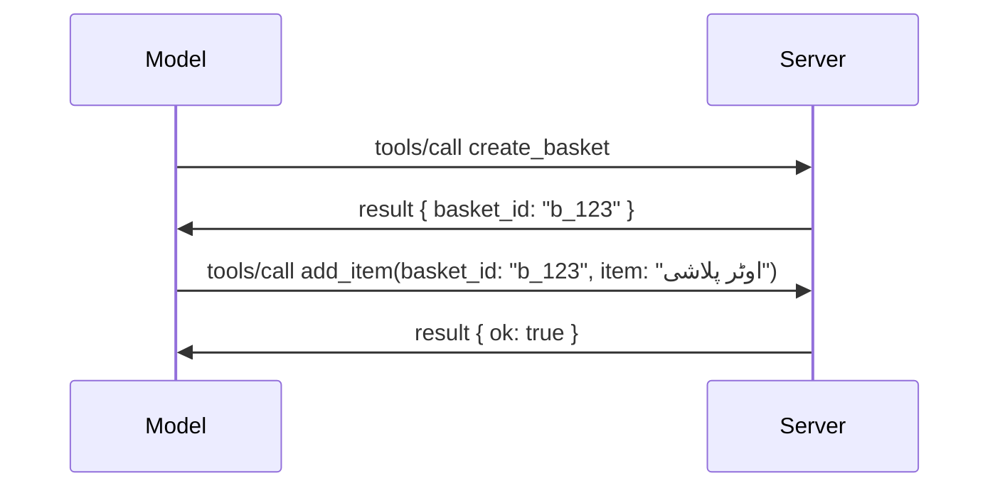

# MCP میں کیا تبدیلیاں ہو رہی ہیں: ریلیز کینڈیڈیٹ 2026-07-28

> **حالت:** ریلیز کینڈیڈیٹ۔ `2026-07-28` کی وضاحت لکھنے کے وقت حتمی نہیں ہے۔ یہ 21 مئی 2026 کو اعلان کی گئی تھی اور 28 جولائی 2026 کو جاری کرنے کا شیڈول ہے۔ اس سبق میں جو کچھ بتایا گیا ہے وہ ریلیز کینڈیڈیٹ کی تفصیل ہے؛ تازہ ترین حالت جانچنے کے لیے [ڈرافٹ وضاحت](https://modelcontextprotocol.io/specification/draft) اور اس کا [چینج لاگ](https://modelcontextprotocol.io/specification/draft/changelog) دیکھیں۔ اس نصاب کا باقی حصہ موجودہ مستحکم ریلیز **MCP Specification 2025-11-25** کے مطابق لکھا گیا ہے اور یہ `2026-07-28` کے جاری ہونے کے بعد اپ ڈیٹ ہوگا۔

## جائزہ

`2026-07-28` MCP کی سب سے بڑی ترمیم ہے جب سے یہ شروع ہوئی ہے۔ چھ سپیسیفکیشن اینہانسمنٹ پروپوزلز (SEPs) پروٹوکول کی سطح کے سیشنز کو ختم کرتی ہیں اور MCP کو ٹرانسپورٹ لیئر پر اسٹیٹ لیس بناتی ہیں، توسیعات کو ایک پہلے درجے کا، ورژنڈ میکانزم بناتی ہیں، اور اس نصاب میں پہلے سیکھی گئی چند خصوصیات (Roots, Sampling, Logging) کو نیا لائف سائیکل پالیسی کے تحت غیر فعال قرار دیا گیا ہے۔ یہ سبق یہ خلاصہ کرتا ہے کہ کیا تبدیلی ہو رہی ہے، یہ کیوں اہم ہے، اور اس کا مطلب کیا ہے آپ کے اس کوڈ کے لیے جو آپ نے پہلے `2025-11-25` کے خلاف لکھا ہے۔

ماخذ: [The 2026-07-28 MCP Specification Release Candidate](https://blog.modelcontextprotocol.io/posts/2026-07-28-release-candidate/) (Model Context Protocol بلاگ، ڈیوڈ سوریہ پارا اور ڈین ڈیلیمارسکی)۔

## سیکھنے کے مقاصد

اس سبق کے آخر تک، آپ کر سکیں گے:

- وضاحت کریں کہ MCP اسٹیٹ لیس پروٹوکول کور کی طرف کیوں جا رہا ہے اور یہ افقی پیمانے پر تعینات نظام کے لیے کیا مسئلہ حل کرتا ہے۔
- بیان کریں کہ `initialize`/`initialized` ہینڈشیک اور `Mcp-Session-Id` ہیڈر کو کس طرح تبدیل کیا گیا ہے۔
- نئے `Mcp-Method` اور `Mcp-Name` ہیڈرز اور `ttlMs`/`cacheScope` کیشنگ میٹا ڈیٹا کی نشاندہی کریں۔
- ایکسٹینشنز فریم ورک کو پہچانیں اور اس ریلیز کے ساتھ آنے والی دو ایکسٹینشنز: MCP Apps اور Tasks۔
- چھ اجازت یافتہ SEPs کی فہرست بنائیں جو OAuth 2.0 / OIDC کی ہم آہنگی کو مضبوط بناتی ہیں۔
- بتائیں کہ کون سی بنیادی خصوصیات (Roots, Sampling, Logging) اب غیر فعال ہیں، اور اس کا عملی مطلب کیا ہے۔
- ٹول `inputSchema`/`outputSchema` کے لیے Full JSON Schema 2020-12 تبدیلی کی وضاحت کریں۔

## ایک اسٹیٹ لیس پروٹوکول

نمایاں تبدیلی: MCP پروٹوکول لیئر پر اسٹیٹ لیس ہو جاتا ہے۔

### پہلے (2025-11-25): سیشنز آپ کو ایک سرور انسٹانس سے منسلک کرتے ہیں

اسٹریم ایبل HTTP پر ایک ٹول کو کال کرنا `initialize` ہینڈشیک سے شروع ہوتا ہے۔ سرور `Mcp-Session-Id` ہیڈر کے ساتھ جواب دیتا ہے جو ہر اگلے درخواست میں لازمی ہوتا ہے:

```http
POST /mcp HTTP/1.1
Mcp-Session-Id: 1868a90c-3a3f-4f5b
Content-Type: application/json

{"jsonrpc":"2.0","id":2,"method":"tools/call",
 "params":{"name":"search","arguments":{"q":"otters"}}}
```

چونکہ سیشن اس سرور انسٹانس سے منسلک ہوتا ہے جس نے اسے جاری کیا، اس لیے افقی پیمانے پر تعینات نظام میں لوڈ بیلینسر پر **چپکنے والی راؤٹنگ** اور انسٹانسز کے درمیان **مشترکہ سیشن اسٹور** کی ضرورت ہوتی ہے۔

### بعد میں (2026-07-28): ہر درخواست خود مختار ہے

```http
POST /mcp HTTP/1.1
MCP-Protocol-Version: 2026-07-28
Mcp-Method: tools/call
Mcp-Name: search
Content-Type: application/json

{"jsonrpc":"2.0","id":1,"method":"tools/call",
 "params":{"name":"search","arguments":{"q":"otters"},
           "_meta":{"io.modelcontextprotocol/clientInfo":{"name":"my-app","version":"1.0"}}}}
```

کوئی بھی سرور انسٹانس اس درخواست کو ہینڈل کر سکتا ہے۔ کلیدی تبدیلیاں:

- **`initialize`/`initialized` ہینڈشیک ہٹا دی گئی ہے** ([SEP-2575](https://github.com/modelcontextprotocol/modelcontextprotocol/pull/2575))۔ پروٹوکول ورژن، کلائنٹ معلومات، اور کلائنٹ صلاحیتیں ہر درخواست پر `_meta` میں منتقل ہو گئی ہیں۔ ایک نیا `server/discover` طریقہ کلائنٹ کو ابتدائی سرور صلاحیتیں حاصل کرنے دیتا ہے جب اسے ضرورت ہو۔
- **`Mcp-Session-Id` ہیڈر اور پروٹوکول سطح کا سیشن ہٹا دیا گیا ہے** ([SEP-2567](https://github.com/modelcontextprotocol/modelcontextprotocol/pull/2567))۔ اب پروٹوکول لیئر پر چپکنے والی راؤٹنگ اور مشترکہ سیشن اسٹور کی ضرورت نہیں ہے۔

### اسٹیٹ لیس پروٹوکول، ریاستی ایپلیکیشنز

پروٹوکول سطح کا سیشن ہٹانے کا مطلب یہ نہیں کہ آپ کا سرور ریاستی نہیں ہو سکتا۔ سفارش کی گئی ترکیب وہی ہے جو HTTP APIs ہمیشہ استعمال کرتے رہے ہیں: ایک صریح ہینڈل (مثلاً `basket_id`، `browser_id`) ایک ٹول کال سے نکالیں، اور ماڈل اس ہینڈل کو بعد کی کالز میں ایک عام دلیل کے طور پر واپس بھیجے۔



اس سے ریاست ماڈل کے لیے ظاہر اور منطقی بن جاتی ہے بجائے اس کے کہ ٹرانسپورٹ میٹا ڈیٹا میں چھپی رہے، اور یہ کسی بھی سرور انسٹانس کو کسی بھی کال کو ہینڈل کرنے دیتا ہے۔

### سرور سے کلائنٹ درخواستیں، دوبارہ منظم

ایک اسٹیٹ لیس پروٹوکول کو اب بھی ایک طریقہ چاہیے کہ سرور کال کے دوران کلائنٹ سے کچھ مانگ سکے (مثلاً، ایلیسیٹیشن پرامپٹ):

- **سرور-ابتدائی درخواستیں صرف اس وقت جاری کی جا سکتی ہیں جب سرور فعال طور پر کلائنٹ کی درخواست پر عمل کر رہا ہو** ([SEP-2260](https://github.com/modelcontextprotocol/modelcontextprotocol/pull/2260)) — پہلے یہ سفارش تھی، اب ضرورت ہے۔ صارف کو اچانک نہیں پوچھا جاتا۔
- **ملٹی راؤنڈ-ٹرپ درخواستیں** ([SEP-2322](https://github.com/modelcontextprotocol/modelcontextprotocol/pull/2322)) ایس ایس ای اسٹریم کھلا رکھنے کے بجائے استعمال ہوتی ہیں۔ اس کے بدلے سرور `InputRequiredResult` واپس کرتا ہے:

  ```json
  {
    "resultType": "inputRequired",
    "inputRequests": {
      "confirm": {
        "type": "elicitation",
        "message": "Delete 3 files?",
        "schema": { "type": "boolean" }
      }
    },
    "requestState": "eyJzdGVwIjoxLCJmaWxlcyI6WyJhIiwiYiIsImMiXX0="
  }
  ```

  کلائنٹ جوابات جمع کرتا ہے اور اصل کال کو `inputResponses` کے ساتھ اور `requestState` کی بازگشت کے ساتھ دوبارہ بھیجتا ہے۔ کوئی بھی سرور انسٹانس ریٹری پکڑ سکتا ہے کیونکہ تمام ضروریات پے لوڈ میں ہیں۔

### راؤٹ کرنے کے قابل، کیش کرنے کے قابل، ٹریس کرنے کے قابل

تین چھوٹی تبدیلیاں اسٹیٹ لیس ٹریفک کو چلانے میں آسانی پیدا کرتی ہیں:

- **`Mcp-Method` اور `Mcp-Name` ہیڈرز اسٹریم ایبل HTTP پر لازمی ہیں** ([SEP-2243](https://github.com/modelcontextprotocol/modelcontextprotocol/pull/2243)) تاکہ لوڈ بیلینسر، گیٹ وے، اور ریٹ لمیٹر آپریشن پر JSON باڈی کا جائزہ لیے بغیر راؤٹ کر سکیں۔ سرور ایسی درخواستیں رد کرتے ہیں جن میں ہیڈرز اور باڈی متفق نہیں ہوتے۔
- **`tools/list` اور ریسورس پڑھنے کے نتائج میں `ttlMs` اور `cacheScope` ہوتے ہیں** ([SEP-2549](https://github.com/modelcontextprotocol/modelcontextprotocol/pull/2549)) جو HTTP `Cache-Control` کی مشابہت رکھتے ہیں۔ کلائنٹس جانتے ہیں کہ فہرست کا نتیجہ کتنے عرصے تک تازہ ہے اور کیا یہ صارفین کے درمیان شیئر کرنا محفوظ ہے، بغیر طویل عرصے تک چلنے والے ایس ایس ای اسٹریم کی ضرورت کے۔
- **`_meta` میں W3C ٹریس کانٹیکسٹ کی ترسیل کی دستاویزات** ([SEP-414](https://github.com/modelcontextprotocol/modelcontextprotocol/pull/414))، `traceparent`, `tracestate`, اور `baggage` کلیدوں کے نام درست کرتی ہے تاکہ ایک تقسیم شدہ ٹریس کلائنٹ SDK، MCP سرور، اور نیچے نظاموں میں ایک [OpenTelemetry](https://opentelemetry.io/) مطابقت کرنے والے بیک اینڈ میں کال کو ٹریک کر سکے۔

## ایکسٹینشنز پہلے درجے کی بن گئیں

`2025-11-25` میں توسیعات غیر رسمی طور پر موجود تھیں۔ [SEP-2133](https://github.com/modelcontextprotocol/modelcontextprotocol/pull/2133) نے انہیں رسمی شکل دی:

- ایکسٹینشنز کو ریورس-DNS شناخت کنندگان کے ذریعے پہچانا جاتا ہے۔
- وہ کلائنٹ اور سرور صلاحیتوں پر `extensions` میپ کے ذریعے مذاکرہ کی جاتی ہیں۔
- وہ اپنے الگ `ext-*` ریپوزیٹریز میں رہتی ہیں جن کے میں ذمہ دار مینٹینرز ہوتے ہیں اور کور وضاحت سے الگ ورژنز کرتی ہیں۔
- SEP عمل میں ایک نئی ایکسٹینشن ٹریک انہیں تجرباتی سے سرکاری تک منتقل ہونے کا راستہ دیتا ہے۔

یہ ریلیز دو سرکاری ایکسٹینشنز کے ساتھ آتا ہے۔

### MCP ایپس: سرور پر رینڈرد یوزر انٹرفیس

[MCP Apps](https://blog.modelcontextprotocol.io/posts/2026-01-26-mcp-apps/) ([SEP-1865](https://github.com/modelcontextprotocol/modelcontextprotocol/pull/1865)) سرورز کو انٹرایکٹو HTML انٹرفیس فراہم کرنے دیتا ہے جو میزبان سنڈباکسڈ iframe میں رینڈر کرتے ہیں۔ ٹولز اپنے UI ٹیمپلیٹس کو پہلے سے ڈیفائن کرتے ہیں تاکہ میزبان پیشگی فچ، کیش، اور سیکیورٹی ریویو کر سکیں۔ آپ نے اس کا بنیادی خیال پہلے ہی [سبق 15: MCP Apps](../03-GettingStarted/15-mcp-apps/README.md) میں پڑھ لیا ہے — ایکسٹینشنز فریم ورک کے تحت، MCP Apps اب تجرباتی کور فیچر کے بجائے رسمی ایکسٹینشن ہے۔

### ٹاسکس کو ایکسٹینشن میں اپ گریڈ کیا گیا

ٹاسکس `2025-11-25` میں تجرباتی کور فیچر کے طور پر بھیجا گیا تھا۔ پیداوار میں استعمال نے اتنی بہتری کی کہ بہترین جگہ ایک ایکسٹینشن ہے: [Tasks ایکسٹینشن](https://github.com/modelcontextprotocol/modelcontextprotocol/pull/2663) اسٹیٹ لیس ماڈل کے گرد لائف سائیکل ترتیب دیتی ہے — سرور `tools/call` کا جواب ٹاسک ہینڈل کے ساتھ دے سکتا ہے، اور کلائنٹ اسے `tasks/get`, `tasks/update`, اور `tasks/cancel` کے ذریعے آگے بڑھاتا ہے۔ ٹاسک کی تخلیق سرور کے زیر کنٹرول ہے: کلائنٹ ایکسٹینشن کا اشتہار دیتا ہے اور سرور فیصلہ کرتا ہے کہ کب کال ٹاسک کے طور پر چلنی چاہیے۔ `tasks/list` مکمل ہٹا دی گئی ہے کیونکہ یہ سیشن کے بغیر محفوظ طور پر مقید نہیں کی جا سکتی۔

> **مائیگریشن نوٹ:** اگر آپ نے تجرباتی `2025-11-25` ٹاسکس API نافذ کی ہے، تو آپ کو نئی ایکسٹینشن لائف سائیکل پر منتقل ہونا ہوگا — یہ پیچھے ہم آہنگ نہیں ہے۔

## اجازت کو مضبوط بنانا

چھ SEPs حقیقی دنیا کے OAuth 2.0 / OpenID Connect تعیناتوں کے قریب تر ہونے کے لیے [اجازت کی وضاحت](https://modelcontextprotocol.io/specification/draft/basic/authorization) کو سخت کرتے ہیں:

| SEP | تبدیلی |
|---|---|
| [SEP-2468](https://github.com/modelcontextprotocol/modelcontextprotocol/pull/2468) | کلائنٹس کو اجازت جوابات میں `iss` پیرامیٹر کو [RFC 9207](https://www.rfc-editor.org/rfc/rfc9207) کے مطابق تصدیق کرنی چاہیے، جو MCP کے سنگل کلائنٹ، بہت سے سرور پیٹرن میں عام مکس اپ حملوں کو روکتا ہے۔ مستقبل میں ایسی جوابات کو رد کیا جائے گا جن میں `iss` موجود نہیں۔ |
| [SEP-837](https://github.com/modelcontextprotocol/modelcontextprotocol/pull/837) | کلائنٹس ڈائنامک کلائنٹ رجسٹریشن کے دوران اپنا OpenID Connect `application_type` ظاہر کرتے ہیں، جس سے اجازت سرورز ڈیسک ٹاپ/CLI کلائنٹ کو "web" سمجھ کر اس کے localhost ری ڈائریکٹ URI کو رد نہیں کرتے۔ |
| [SEP-2352](https://github.com/modelcontextprotocol/modelcontextprotocol/pull/2352) | کلائنٹس رجسٹرڈ اسناد کو جاری کرنے والے اجازت سرور کے `issuer` سے باندھتے ہیں اور جب ریسورس اجازت سرورز کے مابین منتقل ہوتا ہے تو دوبارہ رجسٹر کرتے ہیں۔ |
| [SEP-2207](https://github.com/modelcontextprotocol/modelcontextprotocol/pull/2207) | OpenID Connect طرز کے اجازت سرورز سے ریفریش ٹوکن کی درخواست کیسے کی جائے کی دستاویز۔ |
| [SEP-2350](https://github.com/modelcontextprotocol/modelcontextprotocol/pull/2350) | مرحلہ وار اجازت کے دوران دائرہ کار کے انضمام کی وضاحت۔ |
| [SEP-2351](https://github.com/modelcontextprotocol/modelcontextprotocol/pull/2351) | `.well-known` دریافت مختصر کی وضاحت۔ |

اگر آپ آج MCP کے لیے اجازت سرور بنا رہے ہیں، تو ابھی سے اجازت جوابات میں `iss` فراہم کرنا شروع کریں — موجودہ اجازت ہدایات کے لیے [02-Security](../02-Security/README.md) دیکھیں جس پر یہ مبنی ہوگی۔

## Roots، Sampling، اور Logging غیر فعال ہیں

نئے [فیچر لائف سائیکل پالیسی](https://github.com/modelcontextprotocol/modelcontextprotocol/pull/2577) ([SEP-2577](https://github.com/modelcontextprotocol/modelcontextprotocol/pull/2577)) کے تحت، تین بنیادی کلائنٹ ابتدائیات جو آپ نے [Core Concepts](./README.md#roots) میں سیکھی ہیں **Deprecated** حیثیت کی طرف جاتی ہیں:

| خصوصیت | تجویز کردہ متبادل |
|---|---|
| Roots | ٹول پیرامیٹرز، ریسورس URIs، یا سرور کنفیگریشن |
| Sampling | LLM فراہم کنندہ APIs کے ساتھ براہ راست انضمام |
| Logging | stdio ٹرانسپورٹس کے لیے `stderr`; ماڈیولر مشاہدہ کے لیے OpenTelemetry |

یہ **صرف تشریحات کی غیر فعالیاں** ہیں: طریقے، اقسام، اور صلاحیت کے جھنڈے اس ریلیز میں کام کرتے رہیں گے اور ہر وہ وضاحت نسخہ جس کا شائع ہونا اس کے ایک سال کے اندر ہو۔ انہیں مکمل طور پر ہٹانے کے لیے ایک علیحدہ SEP کی ضرورت ہوگی — اس لیے آج آپ کے موجودہ [Sampling](../03-GettingStarted/14-sampling/README.md) نمونوں میں کچھ نہیں ٹوٹے گا، لیکن نئے سرورز کو اوپر دیے گئے متبادل نمونوں کو ترجیح دینی چاہیے۔

## ٹولز کے لیے مکمل JSON Schema 2020-12

ٹول `inputSchema` اور `outputSchema` کو مکمل [JSON Schema 2020-12](https://json-schema.org/draft/2020-12) پر اپ گریڈ کیا گیا ہے ([SEP-2106](https://github.com/modelcontextprotocol/modelcontextprotocol/pull/2106)):

- ان پٹ اسکیمے `type: "object"` روٹ پابندی برقرار رکھتے ہیں لیکن اب کمپوزیشن (`oneOf`, `anyOf`, `allOf`)، شرائط، اور حوالہ جات (`$ref`, `$defs`) کی اجازت دیتے ہیں۔
- آؤٹ پٹ اسکیمے غیر محدود ہیں، اور `structuredContent` اب صرف آبجیکٹ نہیں بلکہ کوئی بھی JSON ویلیو ہو سکتی ہے۔
- نفاذ کنندگان کو بیرونی `$ref` یو آر ایلز کا خودکار حوالہ نہیں کھولنا چاہیے اور اسکیمے کی گہرائی اور توثیق کے وقت کو محدود کرنا چاہیے (یہ سروس سے انکار کا امکان کم کرنے کے لیے ضروری ہے اگر آپ سرور سائیڈ پر اسکیمے کی توثیق کرتے ہیں)۔

الگ سے، ریسورس نہ ملنے کا ایرر کوڈ MCP کی مرضی کے مطابق `-32002` سے بدل کر JSON-RPC معیاری `-32602` (Invalid Params) کر دیا گیا ہے ([SEP-2164](https://github.com/modelcontextprotocol/modelcontextprotocol/pull/2164))۔ اگر آپ کا کلائنٹ بالکل `-32002` ویلیو پر میچ کرتا ہے، تو آپ کو اسے اپ ڈیٹ کرنا ہوگا۔

## پروٹوکول یہاں سے کیسے ارتقا پاتا ہے

اس ریلیز میں توڑ پھوڑ کرنے والی تبدیلیاں شامل ہیں، جنہیں MCP مینٹینرز مستقبل میں معمول نہ بنانے کا ارادہ رکھتے ہیں۔ تین حکمرانی SEPs اس کی روک تھام کا مقصد رکھتے ہیں:

- **فیچر لائف سائیکل پالیسی** ہر فیچر کو ایک فعال → غیر فعال → ہٹانے کا راستہ دیتی ہے جس میں کم از کم بارہ ماہ کی غیر فعال مدت اور سب سے پہلے ممکنہ ہٹانے کے درمیان وقفہ ہوتا ہے۔
- **ایکسٹینشنز فریم ورک** نئی صلاحیتوں کو اختیاری ایکسٹینشنز کے طور پر شائع کرنے دیتا ہے اور وہاں استحکام حاصل کرنے دیتا ہے اس سے پہلے (اگر کبھی) کور وضاحت میں لے جانے سے۔

- ایک Standards Track SEP اب تک فائنل اسٹیٹس تک نہیں پہنچ سکتا جب تک کہ ایک میل کھاتی صورتحال [conformance suite](https://github.com/modelcontextprotocol/conformance) میں شامل نہ ہو ([SEP-2484](https://github.com/modelcontextprotocol/modelcontextprotocol/pull/2484)) — وہی سوئٹ جس پر [SDK tier system](https://github.com/modelcontextprotocol/modelcontextprotocol/pull/1777) سرکاری SDKs کا اسکور کرتی ہے۔

## ریلیز کا ٹائم لائن اور تصدیق

- ریلیز کینیڈیٹ 21 مئی، 2026 کو بند کیا گیا تھا۔
- حتمی وضاحت 28 جولائی، 2026 کے لئے طے شدہ ہے۔
- دونوں کے درمیان دس ہفتوں کی مدت SDK کے رکھوالوں اور کلائنٹ عمل درآمد کنندگان کو اجازت دیتی ہے کہ وہ تبدیلیوں کو حقیقی کام کے بوجھ کے خلاف تصدیق کریں؛ Tier 1 SDKs سے توقع ہے کہ وہ اس مدت کے دوران سپورٹ فراہم کریں گے جیسا کہ [SDK tier system](https://modelcontextprotocol.io/docs/sdk) میں ہے۔
- تبدیلیوں کا مکمل مجموعہ [مسودہ وضاحت](https://modelcontextprotocol.io/specification/draft) اور اس کے [چینج لاگ](https://modelcontextprotocol.io/specification/draft/changelog) میں دیکھا جا سکتا ہے۔

## اس نصاب کے لئے اس کا مطلب کیا ہے

اب تک جو کچھ بھی آپ نے اس کورس میں سیکھا ہے وہ **2025-11-25** کو ہدف بناتا ہے، جو `2026-07-28` کی ترسیل تک موجودہ مستحکم وضاحت ہے۔ واضح طور پر:

- **سیشنز اور `initialize` ہینڈشیک** (جو [Core Concepts](./README.md) اور [سبق 6: HTTP Streaming](../03-GettingStarted/06-http-streaming/README.md) میں شامل ہیں) آج کی طرح کام کرتے ہیں، لیکن متوقع ہے کہ انہیں `2026-07-28` کے مطابق SDKs کے اپ گریڈ کے بعد اوپر دیئے گئے stateless request ماڈل سے بدل دیا جائے گا۔
- **Sampling اور Roots** (یہ بھی [Core Concepts](./README.md) میں شامل ہیں) مکمل فعال رہیں گے لیکن غیر مستحب ہیں — نئے ڈیزائنز میں اوپر دیے گئے متبادل پیٹرنز کو ترجیح دینی چاہیے۔
- **تجرباتی Tasks خصوصیت**، اگر آپ نے استعمال کی ہے، تو اسے Tasks ایکسٹینشن کے نئے لائف سائیکل میں منتقل کرنے کی ضرورت ہوگی۔
- **MCP ایپس** ([سبق 15](../03-GettingStarted/15-mcp-apps/README.md)) عملی طور پر متاثر نہیں ہوں گی؛ یہ بس رسمی ایکسٹینشنز فریم ورک کے تحت آ جائیں گی۔

## اضافی وسائل

- [2026-07-28 MCP وضاحت ریلیز کینیڈیٹ (بلاگ پوسٹ)](https://blog.modelcontextprotocol.io/posts/2026-07-28-release-candidate/)
- [MCP ٹرانسپورٹس کا مستقبل](https://blog.modelcontextprotocol.io/posts/2025-12-19-mcp-transport-future/)
- [MCP مسودہ وضاحت](https://modelcontextprotocol.io/specification/draft)
- [MCP مسودہ چینج لاگ](https://modelcontextprotocol.io/specification/draft/changelog)
- [SEP رہنما اصول](https://modelcontextprotocol.io/community/sep-guidelines)
- [MCP SDK ٹئیر سسٹم](https://modelcontextprotocol.io/docs/sdk)

## اگلے اقدامات

واپس جائیں [Core Concepts](./README.md) پر یا [Security](../02-Security/README.md) کی طرف بڑھیں تاکہ دیکھیں آج کی `2025-11-25` ہدایات آنے والے ورژن کے ساتھ کیسے جڑتی ہیں۔

---

<!-- CO-OP TRANSLATOR DISCLAIMER START -->
**ڈس کلیمر**:
یہ دستاویز AI ترجمہ سروس [Co-op Translator](https://github.com/Azure/co-op-translator) کے ذریعے ترجمہ کی گئی ہے۔ جبکہ ہم درستگی کے لیے کوشاں ہیں، براہ کرم اس بات سے آگاہ رہیں کہ خودکار ترجمے میں غلطیاں یا عدم درستیاں ہو سکتی ہیں۔ اصل دستاویز اپنے مادری زبان میں مستند ماخذ سمجھی جائے گی۔ حساس معلومات کے لیے پیشہ ور انسانی ترجمہ کی سفارش کی جاتی ہے۔ اس ترجمے کے استعمال سے پیدا ہونے والی کسی بھی غلط فہمی یا غلط تشریح کی ذمہ داری ہم قبول نہیں کرتے۔
<!-- CO-OP TRANSLATOR DISCLAIMER END -->