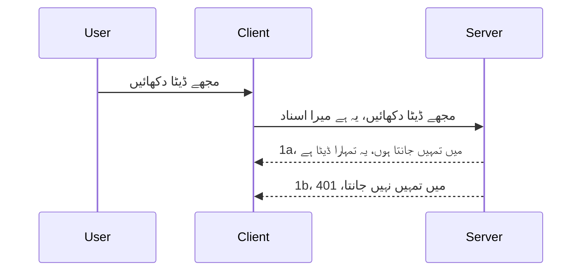

# سادہ مستند کاری

MCP SDKs OAuth 2.1 کے استعمال کی حمایت کرتے ہیں جو کہ ایک کافی پیچیدہ عمل ہے جس میں مستند سرور، وسائل سرور، اسناد بھیجنے، کوڈ حاصل کرنے، کوڈ کو بیئرر ٹوکن میں تبدیل کرنے تک کے تصورات شامل ہیں جب تک کہ آپ آخر کار اپنے وسائل کے ڈیٹا تک پہنچ نہ سکیں۔ اگر آپ OAuth کے عادی نہیں ہیں جو کہ ایک بہت اچھا طریقہ ہے نافذ کرنے کے لیے، تو یہ بہتر ہوگا اگر آپ ابتدائی درجے کی مستند کاری سے شروع کریں اور پھر اسے بہتر اور زیادہ محفوظ بنائیں۔ اسی لیے یہ باب موجود ہے تاکہ آپ کو زیادہ پیچیدہ مستند کاری کی طرف لے جا سکے۔

## مستند کاری، ہم کیا مراد لیتے ہیں؟

مستند کاری کا مطلب ہے authentication اور authorization. خیال یہ ہے کہ ہمیں دو کام کرنے ہیں:

- **Authentication**، جس کا مطلب ہے یہ جانچنا کہ آیا ہم کسی شخص کو اپنے گھر میں داخل ہونے دیں یا نہیں، یعنی کیا اس کے پاس ہمارے وسائل سرور تک رسائی کا حق ہے جہاں ہمارا MCP سرور کے فیچرز موجود ہیں۔
- **Authorization**، یہ جانچنے کا عمل ہے کہ آیا صارف کو ان مخصوص وسائل تک رسائی حاصل ہونی چاہیے جو وہ مانگ رہا ہے، مثال کے طور پر یہ آرڈرز یا یہ مصنوعات یا اس بات کی اجازت کہ وہ مواد پڑھ سکے لیکن حذف نہ کر سکے۔

## اسناد: ہم سسٹم کو کیسے بتاتے ہیں کہ ہم کون ہیں

عام طور پر، زیادہ تر ویب ڈویلپرز سرور کو اسناد فراہم کرنے کے بارے میں سوچتے ہیں، عام طور پر کوئی راز جو کہ یہ بتائے کہ کیا انہیں یہاں "Authentication" کی اجازت ہے۔ یہ اسناد عام طور پر یوزرنیم اور پاس ورڈ کا base64 انکوڈڈ ورژن یا API کی ہوتی ہے جو کسی مخصوص صارف کی منفرد شناخت کرتی ہے۔

اسے "Authorization" نامی ہیڈر کے ذریعے بھیجا جاتا ہے، کچھ اس طرح:

```json
{ "Authorization": "secret123" }
```

اس کو عام طور پر basic authentication کہا جاتا ہے۔ پھر مجموعی عمل کچھ اس طرح کام کرتا ہے:



اب جب کہ ہم سمجھ گئے ہیں کہ یہ فلو کی حیثیت سے کیسے کام کرتا ہے، تو ہم اسے کیسے نافذ کریں؟ زیادہ تر ویب سرورز میں ایک خیال ہوتا ہے جسے middleware کہتے ہیں، ایک کوڈ کا ٹکڑا جو درخواست کے حصہ کے طور پر چلتا ہے جو اسناد کی تصدیق کر سکتا ہے، اور اگر اسناد درست ہیں تو درخواست کو آگے جانے دیتا ہے۔ اگر درخواست میں درست اسناد نہیں ہیں تو آپ کو مستند کاری کی غلطی ملتی ہے۔ آئیے دیکھتے ہیں کہ اسے کیسے نافذ کیا جا سکتا ہے:

**Python**

```python
class AuthMiddleware(BaseHTTPMiddleware):
    async def dispatch(self, request, call_next):

        has_header = request.headers.get("Authorization")
        if not has_header:
            print("-> Missing Authorization header!")
            return Response(status_code=401, content="Unauthorized")

        if not valid_token(has_header):
            print("-> Invalid token!")
            return Response(status_code=403, content="Forbidden")

        print("Valid token, proceeding...")
       
        response = await call_next(request)
        # کوئی بھی کسٹمر ہیڈرز شامل کریں یا جواب میں کسی طرح کی تبدیلی کریں
        return response


starlette_app.add_middleware(CustomHeaderMiddleware)
```

یہاں ہمارے پاس ہے:

- `AuthMiddleware` نامی middleware بنایا گیا ہے جس کا `dispatch` طریقہ کار ویب سرور کی جانب سے کال کیا جاتا ہے۔
- middleware کو ویب سرور میں شامل کیا گیا ہے:

    ```python
    starlette_app.add_middleware(AuthMiddleware)
    ```

- تصدیقی منطق لکھی گئی ہے جو چیک کرتی ہے کہ کیا Authorization ہیڈر موجود ہے اور جو راز بھیجا گیا ہے وہ درست ہے:

    ```python
    has_header = request.headers.get("Authorization")
    if not has_header:
        print("-> Missing Authorization header!")
        return Response(status_code=401, content="Unauthorized")

    if not valid_token(has_header):
        print("-> Invalid token!")
        return Response(status_code=403, content="Forbidden")
    ```

    اگر راز موجود اور درست ہو تو ہم `call_next` کو کال کر کے درخواست کو آگے جانے دیتے ہیں اور جواب واپس کرتے ہیں۔

    ```python
    response = await call_next(request)
    # کسی بھی کسٹمر ہیڈر کو شامل کریں یا جوابی ردعمل میں کسی طرح کی تبدیلی کریں
    return response
    ```

کام کرنے کا طریقہ یہ ہے کہ اگر ویب درخواست سرور کی طرف کی جائے تو middleware کو کال کیا جائے گا اور اس کی تنفیذ کے مطابق یہ درخواست کو آگے جانے دے گا یا ایسی غلطی واپس کرے گا جو کہ بتاتی ہے کہ کلائنٹ کو آگے جانے کی اجازت نہیں ہے۔

**TypeScript**

یہاں ہم مقبول فریم ورک Express کے ساتھ middleware بناتے ہیں اور درخواست کو MCP سرور تک پہنچنے سے پہلے انٹرسیپٹ کرتے ہیں۔ یہ اس کا کوڈ ہے:

```typescript
function isValid(secret) {
    return secret === "secret123";
}

app.use((req, res, next) => {
    // 1. کیا اجازت سرخی موجود ہے؟
    if(!req.headers["Authorization"]) {
        res.status(401).send('Unauthorized');
    }
    
    let token = req.headers["Authorization"];

    // 2. صحت کی جانچ کریں۔
    if(!isValid(token)) {
        res.status(403).send('Forbidden');
    }

   
    console.log('Middleware executed');
    // 3. درخواست کو درخواست پائپ لائن کے اگلے مرحلے میں بھیج دیتا ہے۔
    next();
});
```

اس کوڈ میں ہم:

1. چیک کرتے ہیں کہ Authorization ہیڈر موجود ہے یا نہیں، اگر نہیں، تو 401 غلطی بھیجتے ہیں۔
2. یقینی بناتے ہیں کہ اسناد/ٹوکن درست ہے، اگر نہیں، تو 403 غلطی بھیجتے ہیں۔
3. آخر میں درخواست کو درخواست لائن میں آگے بڑھاتے ہیں اور مطلوبہ وسیلہ واپس کرتے ہیں۔

## مشق: مستند کاری نافذ کریں

آئیے اپنی معلومات استعمال کرکے اسے نافذ کرنے کی کوشش کرتے ہیں۔ منصوبہ کچھ یوں ہے:

سرور

- ویب سرور اور MCP انسٹینس بنائیں۔
- سرور کے لیے middleware نافذ کریں۔

کلائنٹ

- ہیڈر کے ذریعے اسناد کے ساتھ ویب درخواست بھیجیں۔

### -1- ویب سرور اور MCP انسٹینس بنائیں

> **آگے دیکھنا:** نیچے دیا گیا TypeScript مثال HTTP ٹرانسپورٹس کو `transports` میپ میں `mcp-session-id` کے ذریعہ ٹریک کرتا ہے، جیسا کہ **MCP Specification 2025-11-25** میں ہے۔ `2026-07-28` ریلیز کینڈڈیٹ `initialize` ہینڈشیک اور سیشن آئی ڈی کو مکمل طور پر ختم کرتا ہے، لہٰذا یہ فی سیشن ٹرانسپورٹ میپ ختم ہو کر خود مختار اور خود مختار درخواستوں میں تبدیل ہو جائے گا۔ دیکھیں [MCP میں کیا بدل رہا ہے: 2026-07-28 ریلیز کینڈڈیٹ](../../01-CoreConcepts/mcp-2026-07-28-release-candidate.md).

پہلی مرحلے میں، ہمیں ویب سرور کا انسٹینس اور MCP سرور بنانا ہوگا۔

**Python**

یہاں ہم ایک MCP سرور انسٹینس بناتے ہیں، starlette ویب ایپ بناتے ہیں اور اسے uvicorn کے ساتھ ہوسٹ کرتے ہیں۔

```python
# ایم سی پی سرور بنا رہا ہے

app = FastMCP(
    name="MCP Resource Server",
    instructions="Resource Server that validates tokens via Authorization Server introspection",
    host=settings["host"],
    port=settings["port"],
    debug=True
)

# اسٹارلیٹ ویب ایپ بنا رہا ہے
starlette_app = app.streamable_http_app()

# یوویکورن کے ذریعے ایپ کو پیش کر رہا ہے
async def run(starlette_app):
    import uvicorn
    config = uvicorn.Config(
            starlette_app,
            host=app.settings.host,
            port=app.settings.port,
            log_level=app.settings.log_level.lower(),
        )
    server = uvicorn.Server(config)
    await server.serve()

run(starlette_app)
```

اس کوڈ میں ہم:

- MCP سرور بنائیں۔
- MCP سرور سے starlette ویب ایپ کا کنسٹرکشن کریں، `app.streamable_http_app()`۔
- uvicorn `server.serve()` کے ذریعے ویب ایپ کو ہوسٹ اور سرور کریں۔

**TypeScript**

یہاں ہم MCP سرور انسٹینس بناتے ہیں۔

```typescript
const server = new McpServer({
      name: "example-server",
      version: "1.0.0"
    });

    // ... سرور کے وسائل، آلات، اور پرامپٹس مرتب کریں ...
```

MCP سرور بنانا ہمارے POST /mcp روٹ کی تعریف میں ہونا چاہیے، تو آئیے اوپر کے کوڈ کو اس طرح منتقل کرتے ہیں:

```typescript
import express from "express";
import { randomUUID } from "node:crypto";
import { McpServer } from "@modelcontextprotocol/sdk/server/mcp.js";
import { StreamableHTTPServerTransport } from "@modelcontextprotocol/sdk/server/streamableHttp.js";
import { isInitializeRequest } from "@modelcontextprotocol/sdk/types.js"

const app = express();
app.use(express.json());

// ٹرانسپورٹس کو سیشن آئی ڈی کے ذریعہ ذخیرہ کرنے کے لیے نقشہ
const transports: { [sessionId: string]: StreamableHTTPServerTransport } = {};

// کلائنٹ سے سرور کے رابطے کے لیے POST درخواستوں کو ہینڈل کریں
app.post('/mcp', async (req, res) => {
  // موجودہ سیشن آئی ڈی کی جانچ کریں
  const sessionId = req.headers['mcp-session-id'] as string | undefined;
  let transport: StreamableHTTPServerTransport;

  if (sessionId && transports[sessionId]) {
    // موجودہ ٹرانسپورٹ کو دوبارہ استعمال کریں
    transport = transports[sessionId];
  } else if (!sessionId && isInitializeRequest(req.body)) {
    // نئی ابتدائی درخواست
    transport = new StreamableHTTPServerTransport({
      sessionIdGenerator: () => randomUUID(),
      onsessioninitialized: (sessionId) => {
        // ٹرانسپورٹ کو سیشن آئی ڈی کے ذریعہ ذخیرہ کریں
        transports[sessionId] = transport;
      },
      // DNS ری بائنڈنگ سے بچاؤ ڈیفالٹ طور پر پرانی مطابقت کے لیے غیر فعال ہے۔ اگر آپ یہ سرور
      // مقامی طور پر چلا رہے ہیں، تو یقینی بنائیں کہ آپ نے درج ذیل ترتیب دی ہے:
      // enableDnsRebindingProtection: true,
      // allowedHosts: ['127.0.0.1'],
    });

    // بند ہونے پر ٹرانسپورٹ کی صفائی کریں
    transport.onclose = () => {
      if (transport.sessionId) {
        delete transports[transport.sessionId];
      }
    };
    const server = new McpServer({
      name: "example-server",
      version: "1.0.0"
    });

    // ... سرور کے وسائل، ٹولز، اور پرامپٹس سیٹ کریں ...

    // MCP سرور سے منسلک ہوں
    await server.connect(transport);
  } else {
    // غلط درخواست
    res.status(400).json({
      jsonrpc: '2.0',
      error: {
        code: -32000,
        message: 'Bad Request: No valid session ID provided',
      },
      id: null,
    });
    return;
  }

  // درخواست کو ہینڈل کریں
  await transport.handleRequest(req, res, req.body);
});

// GET اور DELETE درخواستوں کے لیے قابلِ دوبارہ استعمال ہینڈلر
const handleSessionRequest = async (req: express.Request, res: express.Response) => {
  const sessionId = req.headers['mcp-session-id'] as string | undefined;
  if (!sessionId || !transports[sessionId]) {
    res.status(400).send('Invalid or missing session ID');
    return;
  }
  
  const transport = transports[sessionId];
  await transport.handleRequest(req, res);
};

// SSE کے ذریعے سرور سے کلائنٹ کو نوٹیفیکیشن کیلئے GET درخواستوں کو ہینڈل کریں
app.get('/mcp', handleSessionRequest);

// سیشن ختم کرنے کے لیے DELETE درخواستوں کو ہینڈل کریں
app.delete('/mcp', handleSessionRequest);

app.listen(3000);
```

اب آپ دیکھ سکتے ہیں کہ MCP سرور کی تخلیق `app.post("/mcp")` کے اندر منتقل ہوئی ہے۔

اب اگلے مرحلے کی طرف بڑھتے ہیں، یعنی middleware بنائیں تاکہ آنے والے اسناد کی تصدیق کر سکیں۔

### -2- سرور کے لیے middleware نافذ کریں

اب middleware حصہ کی طرف آتے ہیں۔ یہاں ہم ایک middleware بنائیں گے جو `Authorization` ہیڈر میں اسناد تلاش کرے گا اور اس کی تصدیق کرے گا۔ اگر یہ قابل قبول ہو تو درخواست جاری رہے گی تاکہ اپنی ضرورت پوری کر سکے (مثلاً ٹولز کی فہرست بنانا، وسعت پڑھنا یا جو بھی MCP کلائنٹ مانگ رہا ہو)۔

**Python**

middleware بنانے کے لیے، ہمیں ایک کلاس بنانی ہوگی جو `BaseHTTPMiddleware` سے وراثت پاتی ہو۔ دو دلچسپ چیزیں ہیں:

- درخواست `request`، جس سے ہم ہیڈر کی معلومات پڑھتے ہیں۔
- `call_next` کال بیک ہے جسے ہمیں کال کرنا ہے اگر کلائنٹ نے کوئی قابل قبول اسناد دی ہوں۔

سب سے پہلے، اگر `Authorization` ہیڈر غائب ہو تو ہمیں کیا کرنا چاہیے:

```python
has_header = request.headers.get("Authorization")

# کوئی ہیڈر موجود نہیں، 401 کے ساتھ ناکام ہو، ورنہ آگے بڑھو۔
if not has_header:
    print("-> Missing Authorization header!")
    return Response(status_code=401, content="Unauthorized")
```

یہاں ہم 401 unauthorized میسج بھیجتے ہیں کیونکہ کلائنٹ مستند کاری میں ناکام رہا ہے۔

اگلا، اگر کوئی اسناد دی گئی ہیں، تو ہمیں اس کی درستگی چیک کرنی چاہیے، کچھ اس طرح:

```python
 if not valid_token(has_header):
    print("-> Invalid token!")
    return Response(status_code=403, content="Forbidden")
```

دیکھیں کہ ہم اوپر 403 forbidden میسج بھیجتے ہیں۔ نیچے مکمل middleware دیا گیا ہے جو اوپر جو بتایا گیا ہے وہ سب نافذ کرتا ہے:

```python
class AuthMiddleware(BaseHTTPMiddleware):
    async def dispatch(self, request, call_next):

        has_header = request.headers.get("Authorization")
        if not has_header:
            print("-> Missing Authorization header!")
            return Response(status_code=401, content="Unauthorized")

        if not valid_token(has_header):
            print("-> Invalid token!")
            return Response(status_code=403, content="Forbidden")

        print("Valid token, proceeding...")
        print(f"-> Received {request.method} {request.url}")
        response = await call_next(request)
        response.headers['Custom'] = 'Example'
        return response

```

بہت اچھا، لیکن `valid_token` فنکشن کیا ہے؟ یہ یہاں ہے:

```python
# پیداوار کے لئے استعمال نہ کریں - اسے بہتر بنائیں !!
def valid_token(token: str) -> bool:
    # "Bearer " پیشرو کو ہٹا دیں
    if token.startswith("Bearer "):
        token = token[7:]
        return token == "secret-token"
    return False
```

اسے ظاہر ہے بہتر بنایا جا سکتا ہے۔

اہم: آپ کو کوڈ میں کبھی بھی ایسے راز شامل نہیں کرنے چاہیے۔ بہتر ہوگا کہ آپ موازنہ کے لیے ویلیو کسی ڈیٹا سورس یا شناختی سروس فراہم کنندہ (IDP) سے حاصل کریں یا بہتر یہ کہ IDP خود ہی تصدیق کرے۔

**TypeScript**

اسے Express کے ساتھ نافذ کرنے کے لیے، ہمیں `use` میتھڈ کال کرنی ہوگی جو middleware فنکشنز لیتی ہے۔

ہمیں یہ کرنا ہوگا:

- درخواست میں `Authorization` پراپرٹی کے ذریعے بھیجی گئی اسناد کی جانچ کرنا۔
- اگر اسناد درست ہوں تو درخواست کو جاری رکھنا اور کلائنٹ کی MCP درخواست کو مکمل کرنا (مثلاً ٹولز کی فہرست، وسائل پڑھنا یا MCP سے متعلق کچھ بھی)۔

یہاں ہم چیک کر رہے ہیں کہ `Authorization` ہیڈر موجود ہے یا نہیں، اگر نہیں تو درخواست کو روک دیتے ہیں:

```typescript
if(!req.headers["authorization"]) {
    res.status(401).send('Unauthorized');
    return;
}
```

اگر ہیڈر بھیجا ہی نہ گیا ہو تو 401 ملے گا۔

پھر ہم چیک کرتے ہیں کہ اسناد درست ہے یا نہیں، اگر نہیں تو درخواست کو روک دیتے ہیں لیکن تھوڑا مختلف پیغام کے ساتھ:

```typescript
if(!isValid(token)) {
    res.status(403).send('Forbidden');
    return;
} 
```

دیکھیے اب 403 غلطی آ رہی ہے۔

یہ رہا مکمل کوڈ:

```typescript
app.use((req, res, next) => {
    console.log('Request received:', req.method, req.url, req.headers);
    console.log('Headers:', req.headers["authorization"]);
    if(!req.headers["authorization"]) {
        res.status(401).send('Unauthorized');
        return;
    }
    
    let token = req.headers["authorization"];

    if(!isValid(token)) {
        res.status(403).send('Forbidden');
        return;
    }  

    console.log('Middleware executed');
    next();
});
```

ہم نے ویب سرور کو اس طرح ترتیب دیا ہے کہ وہ middleware کو قبول کرے جو کلائنٹ کی اسناد کی جانچ کرے۔ اب کلائنٹ کا کیا؟

### -3- ہیڈر کے ذریعے اسناد کے ساتھ ویب درخواست بھیجیں

ہمیں یقینی بنانا ہے کہ کلائنٹ اسناد ہیڈر کے ذریعے بھیج رہا ہے۔ چونکہ ہم MCP کلائنٹ استعمال کریں گے، ہمیں سمجھنا ہوگا کہ یہ کیسے ہوتا ہے۔

**Python**

کلائنٹ کے لیے، ہمیں اپنی اسناد ایک ہیڈر کے ساتھ یوں بھیجنی ہوں گی:

```python
# قیمت کو ہارڈ کوڈ نہ کریں، اسے کم از کم ماحول کے متغیر میں یا مزید محفوظ ذخیرہ میں رکھیں
token = "secret-token"

async with streamablehttp_client(
        url = f"http://localhost:{port}/mcp",
        headers = {"Authorization": f"Bearer {token}"}
    ) as (
        read_stream,
        write_stream,
        session_callback,
    ):
        async with ClientSession(
            read_stream,
            write_stream
        ) as session:
            await session.initialize()
      
            # کرنے کے لئے، کلائنٹ میں آپ کیا کرنا چاہتے ہیں، مثلاً ٹولز کی فہرست بنائیں، ٹولز کو کال کریں وغیرہ۔
```

نوٹ کریں کہ ہم `headers` پراپرٹی کو یوں بھر رہے ہیں `headers = {"Authorization": f"Bearer {token}"}`۔

**TypeScript**

ہم اسے دو مرحلوں میں حل کر سکتے ہیں:

1. ایک configuration آبجیکٹ میں اپنی اسناد بھرنا۔
2. configuration آبجیکٹ کو ٹرانسپورٹ کو بھیجنا۔

```typescript

// ایسی ویلیو کو سخت کوڈ میں نہ لکھیں جیسا کہ یہاں دکھایا گیا ہے۔ کم از کم اسے ایک env ویریئبل کے طور پر رکھیں اور کچھ ایسا استعمال کریں جیسے dotenv (ڈیولپمنٹ موڈ میں)۔
let token = "secret123"

// ایک کلائنٹ ٹرانسپورٹ آپشن آبجیکٹ ڈیفائن کریں
let options: StreamableHTTPClientTransportOptions = {
  sessionId: sessionId,
  requestInit: {
    headers: {
      "Authorization": "secret123"
    }
  }
};

// آپشنز آبجیکٹ کو ٹرانسپورٹ میں پاس کریں
async function main() {
   const transport = new StreamableHTTPClientTransport(
      new URL(serverUrl),
      options
   );
```

یہاں اوپر آپ دیکھ رہے ہیں کہ ہمیں ایک `options` آبجیکٹ بنانا پڑا اور اپنے ہیڈرز کو `requestInit` پراپرٹی کے نیچے رکھنا پڑا۔

اہم: ہم اسے یہاں سے کیسے بہتر بنا سکتے ہیں؟ حالیہ نفاذ میں کچھ مسائل ہیں۔ سب سے پہلے، اسناد اس طرح بھیجنا خطرناک ہو سکتا ہے جب تک کہ آپ کے پاس کم از کم HTTPS نہ ہو۔ پھر بھی، اسناد چوری ہو سکتی ہیں، اس لیے آپکو ایک ایسا سسٹم چاہیے جہاں آپ آسانی سے ٹوکن کو منسوخ کر سکیں اور اضافی چیکس کر سکیں جیسے کہ یہ کہاں سے آرہا ہے، کیا درخواست بہت بار ہو رہی ہے (بوٹ جیسا رویہ)، خلاصہ یہ کہ بہت سی تشویشات ہیں۔

یہ کہا جا سکتا ہے کہ بہت سادہ APIs کے لیے جہاں آپ نہیں چاہتے کہ کوئی بغیر تصدیق کے آپ کی API کو کال کرے، جو ہمارے پاس ہے وہ ایک اچھا آغاز ہے۔

اس کے ساتھ، آئیے اپنی سیکیورٹی کو مزید مضبوط کریں اور ایک معیاری فارمیٹ جیسے JSON Web Token، جسے JWT یا "JOT" ٹوکن بھی کہا جاتا ہے، استعمال کریں۔

## JSON Web Tokens, JWT

تو، ہم سادہ اسناد بھیجنے سے بہتر بنانے کی کوشش کر رہے ہیں۔ JWT اپنانے کے فوری فائدے کیا ہیں؟

- **سیکیورٹی میں بہتری**۔ بنیادی مستند کاری میں آپ بار بار یوزرنیم اور پاس ورڈ ایک base64 انکوڈڈ ٹوکن کے طور پر بھیجتے ہیں (یا آپ ایک API کلید بھیجتے ہیں) جو خطرہ بڑھاتا ہے۔ JWT میں آپ اپنا یوزرنیم اور پاس ورڈ بھیجتے ہیں اور ایک ٹوکن حاصل کرتے ہیں جو وقت کی پابندی کے ساتھ ہوتا ہے یعنی یہ ختم ہو جاتا ہے۔ JWT آپ کو آسانی سے رولز، دائرہ کار اور اجازتوں کے ذریعے باریک کنٹرول فراہم کرتا ہے۔
- **بے اسٹیٹ اور اسکیل ایبلٹی**۔ JWT خود مختار ہوتے ہیں، وہ تمام صارف کی معلومات اپنے اندر رکھتے ہیں اور سرور کے سائیڈ سیشن اسٹوریج کی ضرورت ختم کرتے ہیں۔ ٹوکن کو مقامی طور پر بھی تصدیق کیا جا سکتا ہے۔
- **انٹرآپریبلٹی اور فیڈریشن**۔ JWT اوپن ID کنیکٹ کا مرکزی حصہ ہیں اور معروف شناختی فراہم کنندگان جیسے Entra ID، Google Identity اور Auth0 کے ساتھ استعمال ہوتے ہیں۔ یہ سنگل سائن آن اور بہت کچھ کو ممکن بناتے ہیں جو انہیں انٹرپرائز گریڈ بناتا ہے۔
- **ماڈیولیریٹی اور لچک**۔ JWT کو API گیٹ ویز جیسے Azure API Management، NGINX وغیرہ کے ساتھ بھی استعمال کیا جا سکتا ہے۔ یہ مختلف مستند کاری کے منظرناموں اور سرور سے سروس رابطے کی سہولت بھی دیتا ہے جس میں امپرسونیشن اور ڈیلیگیشن بھی شامل ہے۔
- **کارکردگی اور کیشنگ**۔ JWT کو ڈیکوڈ کرنے کے بعد کیش کیا جا سکتا ہے جو پارسنگ کی ضرورت کو کم کرتا ہے۔ یہ خاص طور پر ہائی ٹریفک ایپس کے لیے مددگار ہے کیونکہ یہ تھروپٹ بڑھاتا ہے اور آپ کے بنیادی ڈھانچے پر بوجھ کم کرتا ہے۔
- **جدید خصوصیات**۔ یہ introspection (سرور پر درستگی کی جانچ) اور revocation (ٹوکن کو غیر فعال کرنا) کو بھی سپورٹ کرتا ہے۔

ان تمام فوائد کے ساتھ، آئیں دیکھتے ہیں کہ ہم اپنی نفاذ کو اگلے درجے تک کیسے لے جا سکتے ہیں۔

## بنیادی مستند کاری کو JWT میں تبدیل کرنا

تو، بنیادی طور پر ہمیں درج ذیل تبدیلیاں کرنی ہوں گی:

- **JWT ٹوکن بنانے کا طریقہ سیکھنا** تاکہ اسے کلائنٹ سے سرور تک بھیجا جا سکے۔
- **JWT ٹوکن کی تصدیق** کرنا، اور اگر درست ہو تو کلائنٹ کو ہمارے وسائل تک رسائی دینا۔
- **محفوظ ٹوکن ذخیرہ**۔ ہم اس ٹوکن کو کیسے ذخیرہ کریں۔
- **راستوں کی حفاظت**۔ ہمیں اپنے راستوں اور مخصوص MCP فیچرز کی حفاظت کرنی ہے۔
- **ریفریش ٹوکنز شامل کرنا**۔ یقینی بنائیں کہ ہم ایسے ٹوکنز بنائیں جو مختصر مدت کے ہوں لیکن ریفریش ٹوکنز جو طویل مدت کے ہوں وہ نئے ٹوکن حاصل کرنے کے لیے استعمال ہو سکیں اگر پرانے ختم ہو جائیں۔ ایک ریفریش اینڈ پوائنٹ اور گردش کی حکمت عملی بھی ضروری ہے۔

### -1- JWT ٹوکن بنانا

سب سے پہلے، JWT ٹوکن کے درج ذیل حصے ہوتے ہیں:

- **ہیڈر**، استعمال شدہ الگوردم اور ٹوکن کی قسم۔
- **پیلوڈ**، دعوے یا دعوے کرتے ہیں، مثلاً sub (صارف یا ہستی جس کی نمائندگی ٹوکن کرتا ہے۔ مستند کاری کے منظر میں یہ عام طور پر یوزر آئی ڈی ہوتا ہے)، exp (ختم ہونے کا وقت) اور role (کردار)۔
- **دستخط**، راز یا پرائیویٹ کی سے دستخط کیا گیا۔

اس کے لیے ہمیں ہیڈر، پیلوڈ اور انکوڈڈ ٹوکن تیار کرنا ہوگا۔

**Python**

```python

import jwt
import jwt
from jwt.exceptions import ExpiredSignatureError, InvalidTokenError
import datetime

# JWT پر دستخط کرنے کے لیے خفیہ کلید
secret_key = 'your-secret-key'

header = {
    "alg": "HS256",
    "typ": "JWT"
}

# صارف کی معلومات، اس کے دعوے اور ختم ہونے کا وقت
payload = {
    "sub": "1234567890",               # موضوع (صارف کی شناخت)
    "name": "User Userson",                # حسب ضرورت دعویٰ
    "admin": True,                     # حسب ضرورت دعویٰ
    "iat": datetime.datetime.utcnow(),# جاری کیا گیا وقت
    "exp": datetime.datetime.utcnow() + datetime.timedelta(hours=1)  # ختم ہونے کا وقت
}

# اسے انکوڈ کریں
encoded_jwt = jwt.encode(payload, secret_key, algorithm="HS256", headers=header)
```

اوپر کے کوڈ میں ہم نے:

- HS256 الگوردم اور ٹوکن کی قسم کو JWT کے طور پر ہیڈر میں ڈیفائن کیا۔
- پیلوڈ بنایا جو ایک سبجیکٹ یا یوزر آئی ڈی، یوزرنیم، کردار، جاری کرنے کا وقت اور ختم ہونے کا وقت شامل کرتا ہے، اس طرح وقت کی حد کو نافذ کیا۔

**TypeScript**

یہاں ہم کو کچھ dependencies کی ضرورت ہوگی جو JWT ٹوکن بنانے میں مدد دیں گی۔

Dependencies

```sh

npm install jsonwebtoken
npm install --save-dev @types/jsonwebtoken
```

اب جب کہ یہ ہمارے پاس موجود ہے، آئیے ہیڈر، پیلوڈ بنائیں اور ان سے انکوڈڈ ٹوکن بنائیں۔

```typescript
import jwt from 'jsonwebtoken';

const secretKey = 'your-secret-key'; // پیداوار میں env متغیرات استعمال کریں

// لوڈ کو پرتفوی کریں
const payload = {
  sub: '1234567890',
  name: 'User usersson',
  admin: true,
  iat: Math.floor(Date.now() / 1000), // جاری کیا گیا
  exp: Math.floor(Date.now() / 1000) + 60 * 60 // 1 گھنٹے میں ختم ہو جائے گا
};

// ہیڈر کی تعریف کریں (اختیاری، jsonwebtoken ڈیفالٹ سیٹ کرتا ہے)
const header = {
  alg: 'HS256',
  typ: 'JWT'
};

// ٹوکن بنائیں
const token = jwt.sign(payload, secretKey, {
  algorithm: 'HS256',
  header: header
});

console.log('JWT:', token);
```

یہ ٹوکن:

HS256 کے ساتھ دستخط شدہ
1 گھنٹے کے لیے درست
دعوے شامل ہیں جیسے sub، name، admin، iat، اور exp۔

### -2- ٹوکن کی تصدیق کریں

ہمیں ٹوکن کی تصدیق بھی کرنی ہوگی، یہ وہ کام ہے جو ہمیں سرور پر کرنا چاہیے تاکہ یقین دہانی ہو کہ کلائنٹ جو ہمیں بھیج رہا ہے وہ درست ہے۔ یہاں بہت سی جانچیں کرنی چاہیے جیسے اس کی ساخت کی تصدیق اور مکمل درستگی۔ آپ کو دیگر چیکس بھی شامل کرنے کی ترغیب دی جاتی ہے تاکہ دیکھا جائے کہ صارف آپ کے سسٹم میں موجود ہے یا نہیں وغیرہ۔

ٹوکن کی تصدیق کے لیے، ہمیں اسے ڈیکوڈ کرنا ہوگا تاکہ پڑھ سکیں اور پھر اس کی درستگی چیک کرنا شروع کریں:

**Python**

```python

# JWT کو ڈی کوڈ کریں اور تصدیق کریں
try:
    decoded = jwt.decode(token, secret_key, algorithms=["HS256"])
    print("✅ Token is valid.")
    print("Decoded claims:")
    for key, value in decoded.items():
        print(f"  {key}: {value}")
except ExpiredSignatureError:
    print("❌ Token has expired.")
except InvalidTokenError as e:
    print(f"❌ Invalid token: {e}")

```


اس کوڈ میں، ہم `jwt.decode` کو ٹوکن، خفیہ کلید اور منتخب شدہ الگورتھم کو بطور انپٹ استعمال کرتے ہوئے کال کرتے ہیں۔ نوٹ کریں کہ ہم نے ٹرائی-کیچ کنسٹرکٹ استعمال کیا ہے کیونکہ ناکام تصدیق کی صورت میں ایک ایرر پیدا ہوتا ہے۔

**ٹائپ اسکرپٹ**

یہاں ہمیں `jwt.verify` کو کال کرنا ہوگا تاکہ ٹوکن کا ایک ڈی کوڈڈ ورژن حاصل کیا جا سکے جسے ہم مزید تجزیہ کر سکیں۔ اگر یہ کال ناکام ہو جائے تو اس کا مطلب ہے کہ ٹوکن کا ڈھانچہ غلط ہے یا یہ اب مزید درست نہیں۔

```typescript

try {
  const decoded = jwt.verify(token, secretKey);
  console.log('Decoded Payload:', decoded);
} catch (err) {
  console.error('Token verification failed:', err);
}
```

نوٹ: جیسا کہ پہلے ذکر کیا گیا ہے، ہمیں مزید چیکس کرنے چاہئیں تاکہ یہ یقینی بنایا جا سکے کہ یہ ٹوکن ہمارے سسٹم میں کسی صارف کی نشاندہی کرتا ہے اور یہ کہ صارف کے پاس وہ حقوق ہیں جو وہ دعویٰ کرتا ہے۔

اگلا، آئیے دیکھتے ہیں رول بیسڈ ایکسیس کنٹرول، جسے RBAC بھی کہا جاتا ہے۔

## رول بیسڈ ایکسیس کنٹرول شامل کرنا

خیال یہ ہے کہ ہم یہ ظاہر کرنا چاہتے ہیں کہ مختلف رولز کے مختلف اجازت نامے ہوتے ہیں۔ مثال کے طور پر، ہم فرض کرتے ہیں کہ ایک ایڈمن سب کچھ کر سکتا ہے، ایک عام صارف صرف پڑھ/لکھ سکتا ہے، اور مہمان صرف پڑھ سکتا ہے۔ لہذا، یہاں کچھ ممکنہ اجازت کی سطحیں ہیں:

- Admin.Write 
- User.Read
- Guest.Read

آئیے دیکھتے ہیں کہ ہم اس طرح کی کنٹرول کو مڈل ویئر کے ساتھ کیسے نافذ کر سکتے ہیں۔ مڈل وئیرز کو ہر روٹ کے لیے اور تمام روٹس کے لیے شامل کیا جا سکتا ہے۔

**پائتھان**

```python
from starlette.middleware.base import BaseHTTPMiddleware
from starlette.responses import JSONResponse
import jwt

# کوڈ میں راز نہ رکھیں، یہ صرف نمائش کے لیے ہے۔ کسی محفوظ جگہ سے اسے پڑھیں۔
SECRET_KEY = "your-secret-key" # اسے env متغیر میں رکھیں
REQUIRED_PERMISSION = "User.Read"

class JWTPermissionMiddleware(BaseHTTPMiddleware):
    async def dispatch(self, request, call_next):
        auth_header = request.headers.get("Authorization")
        if not auth_header or not auth_header.startswith("Bearer "):
            return JSONResponse({"error": "Missing or invalid Authorization header"}, status_code=401)

        token = auth_header.split(" ")[1]
        try:
            decoded = jwt.decode(token, SECRET_KEY, algorithms=["HS256"])
        except jwt.ExpiredSignatureError:
            return JSONResponse({"error": "Token expired"}, status_code=401)
        except jwt.InvalidTokenError:
            return JSONResponse({"error": "Invalid token"}, status_code=401)

        permissions = decoded.get("permissions", [])
        if REQUIRED_PERMISSION not in permissions:
            return JSONResponse({"error": "Permission denied"}, status_code=403)

        request.state.user = decoded
        return await call_next(request)


```

مڈل ویئر شامل کرنے کے چند مختلف طریقے درج ذیل ہیں:

```python

# Alt 1: ستارلیٹ ایپ بناتے وقت مڈل ویئر شامل کریں
middleware = [
    Middleware(JWTPermissionMiddleware)
]

app = Starlette(routes=routes, middleware=middleware)

# Alt 2: ستارلیٹ ایپ پہلے سے بن جانے کے بعد مڈل ویئر شامل کریں
starlette_app.add_middleware(JWTPermissionMiddleware)

# Alt 3: ہر راستے کے لیے مڈل ویئر شامل کریں
routes = [
    Route(
        "/mcp",
        endpoint=..., # ہینڈلر
        middleware=[Middleware(JWTPermissionMiddleware)]
    )
]
```

**ٹائپ اسکرپٹ**

ہم `app.use` اور ایک مڈل ویئر استعمال کر سکتے ہیں جو تمام درخواستوں کے لیے چلے گا۔

```typescript
app.use((req, res, next) => {
    console.log('Request received:', req.method, req.url, req.headers);
    console.log('Headers:', req.headers["authorization"]);

    // 1. چیک کریں کہ آیا آتھورائزیشن ہیڈر بھیجا گیا ہے

    if(!req.headers["authorization"]) {
        res.status(401).send('Unauthorized');
        return;
    }
    
    let token = req.headers["authorization"];

    // 2. چیک کریں کہ ٹوکن درست ہے
    if(!isValid(token)) {
        res.status(403).send('Forbidden');
        return;
    }  

    // 3. چیک کریں کہ ٹوکن کا صارف ہمارے نظام میں موجود ہے
    if(!isExistingUser(token)) {
        res.status(403).send('Forbidden');
        console.log("User does not exist");
        return;
    }
    console.log("User exists");

    // 4. ٹوکن کے پاس صحیح اجازتیں ہیں یا نہیں کی تصدیق کریں
    if(!hasScopes(token, ["User.Read"])){
        res.status(403).send('Forbidden - insufficient scopes');
    }

    console.log("User has required scopes");

    console.log('Middleware executed');
    next();
});

```

کچھ ایسی چیزیں ہیں جو ہم اپنی مڈل ویئر کو کرانے دے سکتے ہیں اور جو ہماری مڈل ویئر کو لازمی کرنا چاہیے، وہ یہ ہیں:

1. چیک کریں کہ کیا authorization ہیڈر موجود ہے
2. چیک کریں کہ ٹوکن درست ہے، ہم `isValid` کو کال کرتے ہیں جو ہم نے لکھا ہے تاکہ JWT ٹوکن کی سالمیت اور درستگی چیک کرے۔
3. تصدیق کریں کہ صارف ہمارے سسٹم میں موجود ہے، ہمیں یہ چیک کرنا چاہیے۔

   ```typescript
    // ڈیٹا بیس میں صارفین
   const users = [
     "user1",
     "User usersson",
   ]

   function isExistingUser(token) {
     let decodedToken = verifyToken(token);

     // کرنے کے لیے، چیک کریں کہ صارف ڈیٹا بیس میں موجود ہے یا نہیں
     return users.includes(decodedToken?.name || "");
   }
   ```

   اوپر، ہم نے بہت سادہ `users` کی فہرست بنائی ہے، جو بالکل ڈیٹابیس میں ہونی چاہیے۔

4. اضافی طور پر، ہمیں یہ بھی چیک کرنا چاہیے کہ ٹوکن کے پاس صحیح اجازت نامے ہیں۔

   ```typescript
   if(!hasScopes(token, ["User.Read"])){
        res.status(403).send('Forbidden - insufficient scopes');
   }
   ```

   اوپر دیے گئے مڈل ویئر کوڈ میں، ہم چیک کرتے ہیں کہ ٹوکن میں User.Read کی اجازت موجود ہے، اگر نہیں تو ہم 403 ایرر بھیج دیتے ہیں۔ نیچے `hasScopes` ہیلپر میتھڈ ہے۔

   ```typescript
   function hasScopes(scope: string, requiredScopes: string[]) {
     let decodedToken = verifyToken(scope);
    return requiredScopes.every(scope => decodedToken?.scopes.includes(scope));
  }
   ```

Have a think which additional checks you should be doing, but these are the absolute minimum of checks you should be doing.

Using Express as a web framework is a common choice. There are helpers library when you use JWT so you can write less code.

- `express-jwt`, helper library that provides a middleware that helps decode your token.
- `express-jwt-permissions`, this provides a middleware `guard` that helps check if a certain permission is on the token.

Here's what these libraries can look like when used:

```typescript
const express = require('express');
const jwt = require('express-jwt');
const guard = require('express-jwt-permissions')();

const app = express();
const secretKey = 'your-secret-key'; // put this in env variable

// Decode JWT and attach to req.user
app.use(jwt({ secret: secretKey, algorithms: ['HS256'] }));

// Check for User.Read permission
app.use(guard.check('User.Read'));

// multiple permissions
// app.use(guard.check(['User.Read', 'Admin.Access']));

app.get('/protected', (req, res) => {
  res.json({ message: `Welcome ${req.user.name}` });
});

// Error handler
app.use((err, req, res, next) => {
  if (err.code === 'permission_denied') {
    return res.status(403).send('Forbidden');
  }
  next(err);
});

```

اب آپ نے دیکھا کہ مڈل ویئر کو دونوں تصدیق (authentication) اور اجازت (authorization) کے لیے کیسے استعمال کیا جا سکتا ہے، لیکن MCP کے بارے میں کیا؟ کیا یہ ہمارے auth کے طریقے کو بدلتا ہے؟ آگے کے سیکشن میں جانتے ہیں۔

### -3- MCP میں RBAC شامل کریں

آپ نے اب تک دیکھا کہ کیسے مڈل ویئر کے ذریعے RBAC شامل کیا جا سکتا ہے، تاہم MCP کے لیے ہر فیچر کے لیے RBAC شامل کرنے کا کوئی آسان طریقہ نہیں ہے، تو ہم کیا کرتے ہیں؟ ہم صرف ایسے کوڈ شامل کرتے ہیں جو اس کیس میں چیک کرے کہ کلائنٹ کو کسی مخصوص ٹول کو کال کرنے کے حقوق ہیں یا نہیں:

فیچر پر فیچر RBAC حاصل کرنے کے لیے آپ کے پاس چند مختلف آپشنز ہیں، یہاں کچھ ہیں:

- ہر ٹول، ریسورس، یا پرامپٹ کے لیے چیک شامل کریں جہاں آپ کو اجازت کی سطح چیک کرنی ہو۔

   **پائتھان**

   ```python
   @tool()
   def delete_product(id: int):
      try:
          check_permissions(role="Admin.Write", request)
      catch:
        pass # کلائنٹ کی توثیق ناکام ہوگئی، توثیق کی خرابی پیدا کریں
   ```

   **ٹائپ اسکرپٹ**

   ```typescript
   server.registerTool(
    "delete-product",
    {
      title: Delete a product",
      description: "Deletes a product",
      inputSchema: { id: z.number() }
    },
    async ({ id }) => {
      
      try {
        checkPermissions("Admin.Write", request);
        // کرنے کے لیے، شناختی تفصیل produktService اور remote entry کو بھیجیں
      } catch(Exception e) {
        console.log("Authorization error, you're not allowed");  
      }

      return {
        content: [{ type: "text", text: `Deletected product with id ${id}` }]
      };
    }
   );
   ```


- جدید سرور نقطہ نظر اور درخواست ہینڈلرز استعمال کریں تاکہ آپ کو چیک کرنے کی جگہیں کم سے کم کرنی پڑیں۔

   **پائتھان**

   ```python
   
   tool_permission = {
      "create_product": ["User.Write", "Admin.Write"],
      "delete_product": ["Admin.Write"]
   }

   def has_permission(user_permissions, required_permissions) -> bool:
      # صارف کے اجازت نامے: صارف کے پاس اجازت ناموں کی فہرست
      # لازمی اجازت نامے: ٹول کے لیے مطلوبہ اجازت ناموں کی فہرست
      return any(perm in user_permissions for perm in required_permissions)

   @server.call_tool()
   async def handle_call_tool(
     name: str, arguments: dict[str, str] | None
   ) -> list[types.TextContent]:
    # فرض کریں کہ request.user.permissions صارف کے لیے اجازت ناموں کی فہرست ہے
     user_permissions = request.user.permissions
     required_permissions = tool_permission.get(name, [])
     if not has_permission(user_permissions, required_permissions):
        # غلطی پیدا کریں "آپ کو ٹول {name} کال کرنے کی اجازت نہیں ہے"
        raise Exception(f"You don't have permission to call tool {name}")
     # جاری رکھیں اور ٹول کو کال کریں
     # ...
   ```   
   

   **ٹائپ اسکرپٹ**

   ```typescript
   function hasPermission(userPermissions: string[], requiredPermissions: string[]): boolean {
       if (!Array.isArray(userPermissions) || !Array.isArray(requiredPermissions)) return false;
       // اگر صارف کے پاس کم از کم ایک مطلوبہ اجازت ہو تو صحیح واپس کریں
       
       return requiredPermissions.some(perm => userPermissions.includes(perm));
   }
  
   server.setRequestHandler(CallToolRequestSchema, async (request) => {
      const { params: { name } } = request;
  
      let permissions = request.user.permissions;
  
      if (!hasPermission(permissions, toolPermissions[name])) {
         return new Error(`You don't have permission to call ${name}`);
      }
  
      // جاری رکھیں..
   });
   ```

   نوٹ کریں، آپ کو یہ یقینی بنانا ہوگا کہ آپ کی مڈل ویئر درخواست کے user پراپرٹی کو ایک ڈی کوڈڈ ٹوکن تفویض کرے تاکہ اوپر دیا گیا کوڈ آسان بن جائے۔

### خلاصہ

اب جب ہم نے عمومی طور پر اور خصوصاً MCP کے لیے RBAC شامل کرنے پر بات کی ہے، تو اب وقت ہے کہ آپ خود سیکیورٹی کو نافذ کرنے کی کوشش کریں تاکہ آپ کو پیش کردہ تصورات کی سمجھ بن سکے۔

## اسائنمنٹ 1: ایک mcp سرور اور mcp کلائنٹ بنائیں بنیادی تصدیق کے ساتھ

یہاں آپ وہ سب کچھ لیں گے جو آپ نے ہیڈرز کے ذریعے اسناد بھیجنے کے بارے میں سیکھا ہے۔

## حل 1

[حل 1](./code/basic/README.md)

## اسائنمنٹ 2: اسائنمنٹ 1 کے حل کو JWT استعمال کرنے کے لیے اپ گریڈ کریں

پہلے حل کو لیں لیکن اس بار، آئیے اسے بہتر بنائیں۔

بنیادی تصدیق کی بجائے، JWT استعمال کریں۔

## حل 2

[حل 2](./solution/jwt-solution/README.md)

## چیلنج

سیکشن "MCP میں RBAC شامل کریں" میں بیان کیے گئے ہر ٹول کے لیے RBAC شامل کریں۔

## خلاصہ

امید ہے کہ آپ نے اس باب میں بہت کچھ سیکھا ہوگا، بالکل سیکیورٹی نہ ہونے سے لے کر بنیادی سیکیورٹی، JWT، اور اسے MCP میں شامل کرنے تک۔

ہم نے کسٹم JWTs کے ساتھ ایک مضبوط بنیاد بنائی ہے، لیکن جب ہم بڑھتے ہیں، تو ہم ایک معیاری شناختی ماڈل کی طرف بڑھ رہے ہیں۔ Entra یا Keycloak جیسے IdP کو اپنانے سے ہم ٹوکن اجرا، تصدیق، اور لائف سائیکل مینجمنٹ کو ایک قابل اعتماد پلیٹ فارم کے حوالے کر دیتے ہیں — جس سے ہم ایپ کے منطقی اور صارف کے تجربے پر توجہ مرکوز کر سکتے ہیں۔

اس کے لیے، ہمارے پاس Entra پر ایک مزید [ایڈوانسڈ باب](../../05-AdvancedTopics/mcp-security-entra/README.md) موجود ہے

## آگے کیا ہے

- اگلا: [MCP ہوسٹس کی ترتیب](../12-mcp-hosts/README.md)

---

<!-- CO-OP TRANSLATOR DISCLAIMER START -->
**ڈس کلیمر**:
یہ دستاویز AI ترجمہ سروس [Co-op Translator](https://github.com/Azure/co-op-translator) کے ذریعے ترجمہ کی گئی ہے۔ جبکہ ہم درستگی کے لیے کوشاں ہیں، براہ کرم اس بات سے آگاہ رہیں کہ خودکار ترجمے میں غلطیاں یا عدم درستیاں ہو سکتی ہیں۔ اصل دستاویز اپنے مادری زبان میں مستند ماخذ سمجھی جائے گی۔ حساس معلومات کے لیے پیشہ ور انسانی ترجمہ کی سفارش کی جاتی ہے۔ اس ترجمے کے استعمال سے پیدا ہونے والی کسی بھی غلط فہمی یا غلط تشریح کی ذمہ داری ہم قبول نہیں کرتے۔
<!-- CO-OP TRANSLATOR DISCLAIMER END -->