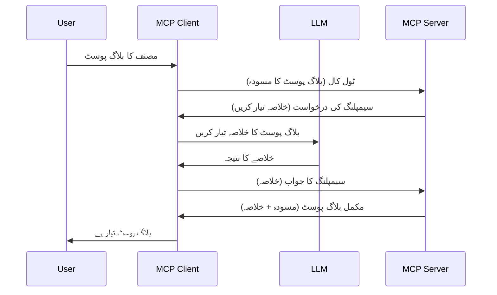

# سیمپلنگ - کلائنٹ کو خصوصیات تفویض کرنا

> **تنبیہہ برائے ترک:** `2026-07-28` MCP وضاحت ریلیز امیدوار سیمپلنگ کو براہ راست LLM فراہم کنندہ APIs کے ساتھ انضمام کے حق میں ترک شدہ قرار دیتا ہے۔ سیمپلنگ `2025-11-25` میں کام کرنا جاری رکھتی ہے اور کسی رسمی ترک سے کم از کم ایک سال تک فعال رہے گی، لہذا اس سبق کی تمام باتیں درست ہیں — لیکن نئے سرور کے ڈیزائنز کو اس تبدیلی کے نمونہ کا جائزہ لینا چاہیے۔ دیکھیں [MCP میں کیا بدل رہا ہے: 2026-07-28 ریلیز امیدوار](../../01-CoreConcepts/mcp-2026-07-28-release-candidate.md)۔

کبھی کبھار آپ کو MCP کلائنٹ اور MCP سرور کو مشترکہ مقصد حاصل کرنے کے لیے تعاون کی ضرورت ہوتی ہے۔ آپ کے پاس ایسی صورت ہو سکتی ہے جہاں سرور کو کلائنٹ پر موجود LLM کی مدد درکار ہو۔ اس صورت حال کے لیے، سیمپلنگ وہ چیز ہے جو آپ کو استعمال کرنی چاہیے۔

آئیے کچھ استعمال کے کیسز کا جائزہ لیتے ہیں اور سیمپلنگ شامل کرنے والا حل کیسے بنایا جائے۔

## جائزہ

اس سبق میں، ہم سیمپلنگ کب اور کہاں استعمال کرنی ہے اور اسے کیسے ترتیب دینا ہے اس پر توجہ دیں گے۔

## تعلیمی مقاصد

اس باب میں، ہم یہ کریں گے:

- سیمپلنگ کیا ہے اور کب استعمال کرنا چاہیے سمجھائیں۔
- MCP میں سیمپلنگ کو ترتیب دینے کا طریقہ دکھائیں۔
- سیمپلنگ کے عملی مثالیں فراہم کریں۔

## سیمپلنگ کیا ہے اور کیوں استعمال کریں؟

سیمپلنگ ایک جدید خصوصیت ہے جو درج ذیل طریقے سے کام کرتی ہے:



### سیمپلنگ کی درخواست

اچھا، اب ہمارے پاس ایک پر اعتماد منظر نامے کا ایک وسیع جائزہ ہے، آئیے بات کرتے ہیں سرور کی طرف سے کلائنٹ کو بھیجی جانے والی سیمپلنگ درخواست کی۔ JSON-RPC فارمیٹ میں ایسی درخواست کچھ اس طرح دکھائی دیتی ہے:

```json
{
  "jsonrpc": "2.0",
  "id": 1,
  "method": "sampling/createMessage",
  "params": {
    "messages": [
      {
        "role": "user",
        "content": {
          "type": "text",
          "text": "Create a blog post summary of the following blog post: <BLOG POST>"
        }
      }
    ],
    "modelPreferences": {
      "hints": [
        {
          "name": "claude-3-sonnet"
        }
      ],
      "intelligencePriority": 0.8,
      "speedPriority": 0.5
    },
    "systemPrompt": "You are a helpful assistant.",
    "maxTokens": 100
  }
}
```

یہاں چند چیزیں قابل ذکر ہیں:

- پرامٹ، content -> text کے تحت، ہماری پرامٹ ہے جو LLM کو بلاگ پوسٹ کا خلاصہ فراہم کرنے کی ہدایت دیتی ہے۔

- **modelPreferences**۔ یہ سیکشن ایک ترجیح ہے، LLM کے لیے استعمال کرنے والی ترتیب کی سفارش۔ صارف یہ سفارشات قبول یا تبدیل کر سکتا ہے۔ اس صورت میں ماڈل، رفتار اور ذہانت کی ترجیح پر تجاویز دی گئی ہیں۔
- **systemPrompt**، یہ آپ کا معمول کا سسٹم پرامٹ ہے جو آپ کے LLM کو شخصیت دیتا ہے اور رہنمائی کی ہدایات شامل کرتا ہے۔
- **maxTokens**، یہ ایک اور خصوصیت ہے جو بتاتی ہے کہ اس کام کے لیے کتنے ٹوکنز استعمال کرنے کی سفارش کی گئی ہے۔

### سیمپلنگ کی جواب

یہ جواب MCP کلائنٹ کی طرف سے MCP سرور کو بھیجا جاتا ہے اور یہ کلائنٹ کی طرف سے LLM کو کال کرنے، اس کا جواب وصول کرنے اور پھر یہ پیغام تیار کرنے کا نتیجہ ہوتا ہے۔ JSON-RPC میں اس کا نمونہ کچھ اس طرح ہوتا ہے:

```json
{
  "jsonrpc": "2.0",
  "id": 1,
  "result": {
    "role": "assistant",
    "content": {
      "type": "text",
      "text": "Here's your abstract <ABSTRACT>"
    },
    "model": "gpt-5",
    "stopReason": "endTurn"
  }
}
```

نوٹ کریں کہ جواب وہی بلاگ پوسٹ کا خلاصہ ہے جیسا ہم نے مانگا تھا۔ اور نوٹ کریں کہ استعمال شدہ `model` وہ ماڈل نہیں جو ہم نے مانگا تھا بلکہ "gpt-5" ہے جو "claude-3-sonnet" پر ترجیح دی گئی ہے۔ یہ ظاہر کرتا ہے کہ صارف اپنی رائے تبدیل کر سکتا ہے اور آپ کی سیمپلنگ درخواست صرف ایک سفارش ہے۔

اچھا، اب جب ہمیں مرکزی فلو اور مفید کام "بلاگ پوسٹ کی تخلیق + خلاصہ" سمجھ آ گیا ہے، تو آئیے دیکھیں کہ اسے کام میں کیسے لائیں۔

### پیغام کی اقسام

سیمپلنگ کے پیغامات صرف متن پر محدود نہیں ہیں بلکہ آپ تصاویر اور آڈیو بھی بھیج سکتے ہیں۔ JSON-RPC مختلف دکھائی دیتا ہے:

**متن**

```json
{
  "type": "text",
  "text": "The message content"
}
```

**تصویری مواد**

```json
{
  "type": "image",
  "data": "base64-encoded-image-data",
  "mimeType": "image/jpeg"
}
```

**آڈیو مواد**

```json
{
  "type": "audio",
  "data": "base64-encoded-audio-data",
  "mimeType": "audio/wav"
}
```

> نوٹ: سیمپلنگ کے بارے میں مزید تفصیلی معلومات کے لیے، [سرکاری دستاویزات](https://modelcontextprotocol.io/specification/2025-11-25/client/sampling) دیکھیں۔

## کلائنٹ میں سیمپلنگ کیسے ترتیب دیں

> نوٹ: اگر آپ صرف سرور بنا رہے ہیں تو یہاں زیادہ کرنے کی ضرورت نہیں ہے۔

کلائنٹ میں، آپ کو درج ذیل خصوصیت اس طرح بتانی ہوتی ہے:

```json
{
  "capabilities": {
    "sampling": {}
  }
}
```

اس کے بعد جب آپ کا منتخب شدہ کلائنٹ سرور کے ساتھ انیشیئلائز ہوتا ہے تو یہ چنی جائے گی۔

## سیمپلنگ کی عملی مثال - ایک بلاگ پوسٹ بنائیں

آئیے ایک سیمپلنگ سرور کو کوڈ کریں، ہمیں درج ذیل کرنا ہوگا:

1. سرور پر ایک ٹول بنائیں۔
1. کہا گیا ٹول ایک سیمپلنگ درخواست بنائے۔
1. ٹول کلائنٹ کی سیمپلنگ درخواست کے جواب کا انتظار کرے۔
1. پھر ٹول کا نتیجہ پیدا ہو۔

آئیے قدم بہ قدم کوڈ دیکھیں:

### -1- ٹول بنائیں

**python**

```python
@mcp.tool()
async def create_blog(title: str, content: str, ctx: Context[ServerSession, None]) -> str:
    """Create a blog post and generate a summary"""

```

### -2- سیمپلنگ کی درخواست بنائیں

اپنے ٹول میں درج ذیل کوڈ شامل کریں:

**python**

```python
post = BlogPost(
        id=len(posts) + 1,
        title=title,
        content=content,
        abstract=""
    )

prompt = f"Create an abstract of the following blog post: title: {title} and draft: {content} "

result = await ctx.session.create_message(
        messages=[
            SamplingMessage(
                role="user",
                content=TextContent(type="text", text=prompt),
            )
        ],
        max_tokens=100,
)

```

### -3- جواب کا انتظار کریں اور جواب واپس کریں

**python**

```python
post.abstract = result.content.text

posts.append(post)

# مکمل پروڈکٹ واپس کریں
return json.dumps({
    "id": post.title,
    "abstract": post.abstract
})
```

### -4- مکمل کوڈ

**python**

```python
from starlette.applications import Starlette
from starlette.routing import Mount, Host

from mcp.server.fastmcp import Context, FastMCP

from mcp.server.session import ServerSession
from mcp.types import SamplingMessage, TextContent

import json


from uuid import uuid4
from typing import List
from pydantic import BaseModel


mcp = FastMCP("Blog post generator")

# ایپ = FastAPI()

posts = []

class BlogPost(BaseModel):
    id: int
    title: str
    content: str
    abstract: str

posts: List[BlogPost] = []

@mcp.tool()
async def create_blog(title: str, content: str, ctx: Context[ServerSession, None]) -> str:
    """Create a blog post and generate a summary"""

    post = BlogPost(
        id=len(posts) + 1,
        title=title,
        content=content,
        abstract=""
    )

    prompt = f"Create an abstract of the following blog post: title: {title} and draft: {content} "

    result = await ctx.session.create_message(
        messages=[
            SamplingMessage(
                role="user",
                content=TextContent(type="text", text=prompt),
            )
        ],
        max_tokens=100,
    )

    post.abstract = result.content.text

    posts.append(post)

    # مکمل بلاگ پوسٹ کو واپس کریں
    return json.dumps({
        "id": post.title,
        "abstract": post.abstract
    })

if __name__ == "__main__":
    print("Starting server...")
    # mcp چلائیں()
    mcp.run(transport="streamable-http")

# ایپ چلائیں: python server.py
```

### -5- Visual Studio Code میں اسے آزمانا

Visual Studio Code میں اس کو آزمانے کے لیے، درج ذیل کریں:

1. ٹرمینل میں سرور شروع کریں۔
1. اسے *mcp.json* میں شامل کریں (اور یقینی بنائیں کہ سرور چل رہا ہے)، مثال کچھ اس طرح:

   ```json
   "servers": {
      "blog-server": {
        "type": "http",
        "url": "http://localhost:8000/mcp"
      }
   }
   ```

1. پرامٹ لکھیں:

   ```text
   create a blog post named "Where Python comes from", the content is "Python is actually named after Monty Python Flying Circus"
   ```

1. سیمپلنگ کی اجازت دیں۔ پہلی بار جب آپ اسے آزمائیں گے تو ایک اضافی ڈائیلاگ دکھائی دے گا جسے آپ کو قبول کرنا ہوگا، پھر عام ڈائیلاگ دکھائی دے گا جو ٹول چلانے کے لیے پوچھے گا۔

1. نتائج کا معائنہ کریں۔ آپ نتائج کو GitHub Copilot Chat میں اچھی طرح رینڈر کیے ہوئے دیکھیں گے اور آپ خام JSON جواب بھی دیکھ سکتے ہیں۔

**اضافی بات:** Visual Studio Code کا ٹولنگ سیمپلنگ کے لیے بہترین مدد فراہم کرتا ہے۔ آپ اپنے نصب شدہ سرور پر سیمپلنگ تک رسائی کو اس طرح ترتیب دے سکتے ہیں:

1. ایکسٹینشن سیکشن پر جائیں۔
1. "MCP SERVERS - INSTALLED" سیکشن میں اپنے نصب شدہ سرور کے لیے گیئر آئیکون منتخب کریں۔
1. "Configure Model Access" منتخب کریں، یہاں آپ منتخب کر سکتے ہیں کہ GitHub Copilot کو سیمپلنگ کرتے وقت کون سے ماڈلز استعمال کرنے کی اجازت ہو۔ آپ حالیہ سیمپلنگ درخواستیں بھی "Show Sampling requests" منتخب کرکے دیکھ سکتے ہیں۔

## مشق

اس مشق میں، آپ ایک تھوڑا مختلف سیمپلنگ یعنی ایک سیمپلنگ انٹیگریشن بنائیں گے جو پراڈکٹ کی تفصیل تخلیق کرنے کی حمایت کرے گی۔ آپ کا منظر نامہ یہ ہے:

**منظر نامہ**: ایک ای کامرس کے بیک آفس کارکن کو مدد کی ضرورت ہے، پراڈکٹ کی تفصیل تیار کرنے میں بہت زیادہ وقت لگتا ہے۔ لہذا، آپ ایک ایسا حل بنائیں گے جہاں آپ ایک ٹول "create_product" کو "title" اور "keywords" دلائل کے ساتھ کال کریں اور یہ مکمل پراڈکٹ تخلیق کرے جس میں "description" کا فیلڈ ہو جو کلائنٹ کے LLM کی طرف سے بھرا جائے گا۔

مشورہ: اس سرور اور اس کے ٹول کو سیمپلنگ درخواست کا استعمال کرتے ہوئے بنانے کے لیے آپ نے جو کچھ پہلے سیکھا ہے اسے استعمال کریں۔

## حل

[حل](./solution/README.md)

## کلیدی نکات

سیمپلنگ ایک طاقتور خصوصیت ہے جو سرور کو کلائنٹ کو کام تفویض کرنے کی اجازت دیتی ہے جب اسے LLM کی مدد درکار ہو۔

## آگے کیا ہے

- [باب 4 - عملی نفاذ](../../04-PracticalImplementation/README.md)

---

<!-- CO-OP TRANSLATOR DISCLAIMER START -->
**ڈس کلیمر**:
یہ دستاویز AI ترجمہ سروس [Co-op Translator](https://github.com/Azure/co-op-translator) کے ذریعے ترجمہ کی گئی ہے۔ جبکہ ہم درستگی کے لیے کوشاں ہیں، براہ کرم اس بات سے آگاہ رہیں کہ خودکار ترجمے میں غلطیاں یا عدم درستیاں ہو سکتی ہیں۔ اصل دستاویز اپنے مادری زبان میں مستند ماخذ سمجھی جائے گی۔ حساس معلومات کے لیے پیشہ ور انسانی ترجمہ کی سفارش کی جاتی ہے۔ اس ترجمے کے استعمال سے پیدا ہونے والی کسی بھی غلط فہمی یا غلط تشریح کی ذمہ داری ہم قبول نہیں کرتے۔
<!-- CO-OP TRANSLATOR DISCLAIMER END -->