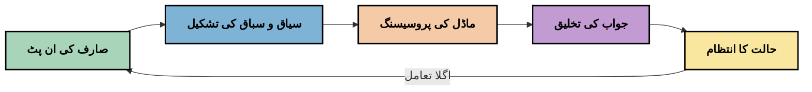
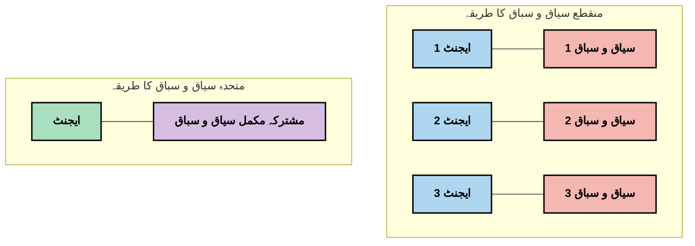
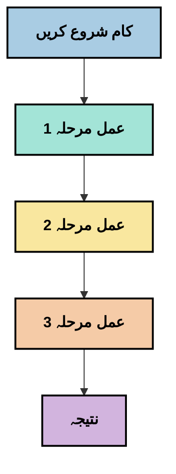
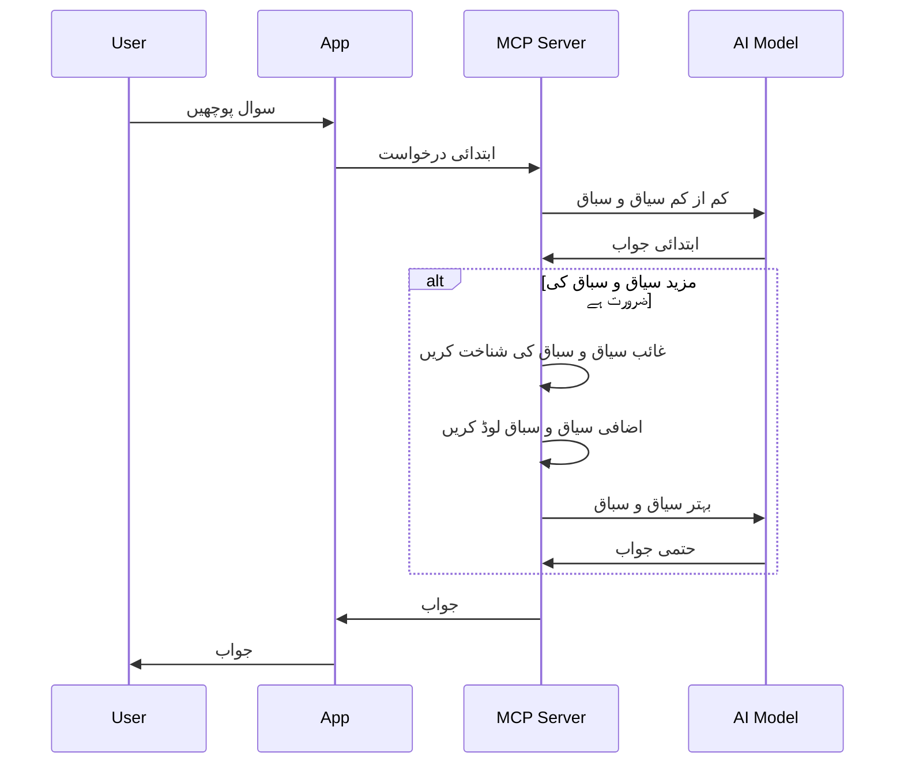
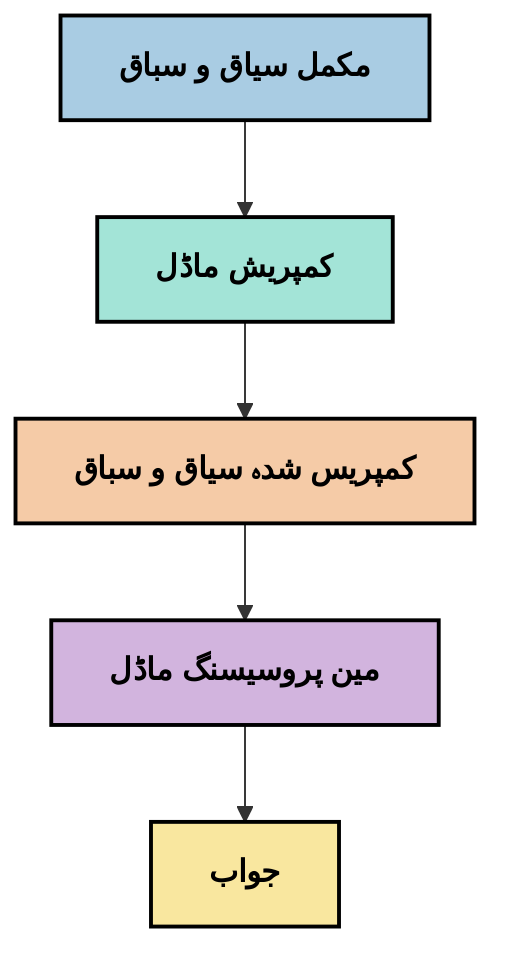
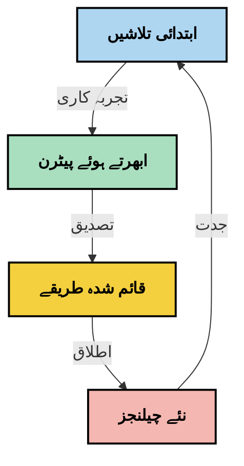

# کانٹیکسٹ انجینئرنگ: MCP ایکوسسٹم میں ایک ابھرنا ہوا تصور

## جائزہ

کانٹیکسٹ انجینئرنگ AI کے میدان میں ایک ابھرتا ہوا تصور ہے جو اس بات کی تحقیق کرتا ہے کہ معلومات کس طرح منظم کی جاتی ہیں، فراہم کی جاتی ہیں، اور کلائنٹس اور AI خدمات کے درمیان بات چیت کے دوران کس طرح برقرار رکھی جاتی ہیں۔ جیسے جیسے ماڈل کانٹیکسٹ پروٹوکول (MCP) ایکوسسٹم ترقی کرتا ہے، کانٹیکسٹ کو مؤثر طریقے سے منظم کرنے کا طریقہ سمجھنا زیادہ اہم ہوتا جا رہا ہے۔ یہ ماڈیول کانٹیکسٹ انجینئرنگ کے تصور کا تعارف کراتا ہے اور MCP اطلاق میں اس کی ممکنہ تطبیقات کا جائزہ لیتا ہے۔

## سیکھنے کے اہداف

اس ماڈیول کے آخر تک، آپ ان باتوں کے قابل ہوں گے:

- کانٹیکسٹ انجینئرنگ کے ابھرتے ہوئے تصور کو سمجھیں اور MCP اطلاقات میں اس کے ممکنہ کردار کو جانیں
- کانٹیکسٹ مینجمنٹ میں کلیدی چیلنجز کی نشاندہی کریں جنہیں MCP پروٹوکول ڈیزائن حل کرتا ہے
- بہتر کانٹیکسٹ ہینڈلنگ کے ذریعے ماڈل کی کارکردگی کو بڑھانے کی تکنیکوں کا جائزہ لیں
- کانٹیکسٹ کی مؤثریت کو ماپنے اور جانچنے کے طریقے غور کریں
- MCP فریم ورک کے ذریعے AI تجربات کو بہتر بنانے کے لیے ان ابھرتے ہوئے تصورات کو لاگو کریں

## کانٹیکسٹ انجینئرنگ کا تعارف

کانٹیکسٹ انجینئرنگ ایک ابھرتا ہوا تصور ہے جو صارفین، ایپلیکیشنز، اور AI ماڈلز کے درمیان معلومات کے بہاؤ کے ارادی ڈیزائن اور انتظام پر مرکوز ہے۔ پرامپٹ انجینئرنگ جیسے مستحکم شعبوں کے برعکس، کانٹیکسٹ انجینئرنگ ابھی بھی ماہرین کی جانب سے اس وقت تعریف کی جا رہی ہے جب وہ AI ماڈلز کو صحیح وقت پر صحیح معلومات فراہم کرنے کے منفرد چیلنجز کو حل کرنے کی کوشش کر رہے ہیں۔

جیسے جیسے بڑے زبان کے ماڈلز (LLMs) ترقی کر چکے ہیں، کانٹیکسٹ کی اہمیت بڑھتی جا رہی ہے۔ ہم جو کانٹیکسٹ فراہم کرتے ہیں اس کی معیار، مطابقت، اور ساخت براہ راست ماڈل کے نتائج کو متاثر کرتی ہے۔ کانٹیکسٹ انجینئرنگ اس تعلق کو دریافت کرتی ہے اور مؤثر کانٹیکسٹ مینجمنٹ کے لیے اصول تیار کرنے کی کوشش کرتی ہے۔

> "2025 میں، وہاں موجود ماڈلز انتہائی ذہین ہیں۔ لیکن سب سے ذہین انسان بھی اس کام کو مؤثر طریقے سے انجام نہیں دے سکے گا جب تک کہ جو کام وہ کر رہے ہیں اس کا کانٹیکسٹ نہ ہو… 'کانٹیکسٹ انجینئرنگ' پرامپٹ انجینئرنگ کی اگلی سطح ہے۔ یہ خودکار طور پر ایک متحرک نظام میں یہ کرنے کے بارے میں ہے۔" — والڈن یان، کوگنیشن AI

کانٹیکسٹ انجینئرنگ میں شامل ہو سکتا ہے:

1. **کانٹیکسٹ کا انتخاب**: کسی مخصوص کام کے لیے کون سی معلومات متعلقہ ہیں اس کا تعین کرنا
2. **کانٹیکسٹ کی ساخت بندی**: معلومات کو منظم کرنا تاکہ ماڈل کی سمجھ بہتر ہو سکے
3. **کانٹیکسٹ کی ترسیل**: معلومات کو ماڈلز کو بھیجنے کے طریقہ اور وقت کو بہتر بنانا
4. **کانٹیکسٹ کا انتظام**: وقت کے ساتھ کانٹیکسٹ کی حالت اور ارتقاء کا انتظام کرنا
5. **کانٹیکسٹ کی جانچ**: کانٹیکسٹ کی مؤثریت کو ناپنا اور بہتر بنانا

یہ توجہ کے علاقے خاص طور پر MCP ایکوسسٹم کے لیے اہم ہیں، جو ایپلیکیشنز کو LLMs کو کانٹیکسٹ فراہم کرنے کا معیاری طریقہ فراہم کرتا ہے۔


## کانٹیکسٹ کے سفر کا نقطہ نظر

کانٹیکسٹ انجینئرنگ کو دیکھنے کا ایک طریقہ یہ ہے کہ MCP نظام میں معلومات کس طرح سفر کرتی ہے:



### کانٹیکسٹ کے سفر کے اہم مراحل:

1. **صارف کی ان پٹ**: صارف سے خام معلومات (متن، تصاویر، دستاویزات)
2. **کانٹیکسٹ کی تشکیل**: صارف کی ان پٹ کو نظام کے کانٹیکسٹ، مکالمے کی تاریخ، اور دیگر بازیافت شدہ معلومات کے ساتھ ملانا
3. **ماڈل کی پروسیسنگ**: AI ماڈل تشکیل شدہ کانٹیکسٹ کو پروسیس کرتا ہے
4. **ردعمل کی تخلیق**: ماڈل فراہم کردہ کانٹیکسٹ کی بنیاد پر نتائج تیار کرتا ہے
5. **حالت کا انتظام**: نظام بات چیت کی بنیاد پر اپنی اندرونی حالت کو اپ ڈیٹ کرتا ہے

یہ نقطہ نظر AI نظاموں میں کانٹیکسٹ کی متحرک نوعیت کو اجاگر کرتا ہے اور ہر مرحلے پر معلومات کے بہترین انتظام کے طریقوں پر اہم سوالات اٹھاتا ہے۔

## کانٹیکسٹ انجینئرنگ میں ابھرتے ہوئے اصول

جیسے جیسے کانٹیکسٹ انجینئرنگ کا شعبہ شکل اختیار کر رہا ہے، کچھ ابتدائی اصول ماہرین سے سامنے آ رہے ہیں۔ یہ اصول MCP کے نفاذ کے انتخاب میں مدد دے سکتے ہیں:

### اصول 1: کانٹیکسٹ کو مکمل طور پر شیئر کریں

کانٹیکسٹ کو نظام کے تمام اجزاء کے درمیان مکمل طور پر شیئر کیا جانا چاہیے نہ کہ مختلف ایجنٹس یا عملوں میں بکھرا ہوا۔ جب کانٹیکسٹ تقسیم شدہ ہوتا ہے، تو نظام کے ایک حصے میں کیے گئے فیصلے دوسرے حصے کے فیصلوں سے متصادم ہو سکتے ہیں۔



MCP اطلاقات میں، یہ تجویز کرتا ہے کہ ایسے نظام ڈیزائن کیے جائیں جہاں کانٹیکسٹ پوری پائپ لائن میں بغیر رکاوٹ بہتا ہے نہ کہ اسے جزوی طور پر رکھا جائے۔

### اصول 2: پہچانیں کہ کارروائیاں ضمنی فیصلے لے کر آتی ہیں

ماڈل کا ہر عمل ضمنی طور پر یہ فیصلہ کرتا ہے کہ کانٹیکسٹ کو کیسے سمجھا جائے۔ جب مختلف اجزاء مختلف کانٹیکسٹس پر عمل کرتے ہیں تو یہ ضمنی فیصلے متصادم ہو سکتے ہیں، جس سے غیر مستقل نتائج پیدا ہوتے ہیں۔

اس اصول کے MCP اطلاقات کے لیے اہم مضمرات ہیں:
- پیچیدہ کاموں کی لائنر پروسیسنگ کو ترجیح دیں بجائے اس کے کہ بکھرے ہوئے کانٹیکسٹ کے ساتھ متوازی عمل کریں
- یقینی بنائیں کہ تمام فیصلہ سازی والے نکات کو ایک ہی کانٹیکسچوال معلومات تک رسائی حاصل ہو
- ایسے نظام ڈیزائن کریں جہاں بعد کے مراحل پچھلے فیصلوں کا مکمل کانٹیکسٹ دیکھ سکیں

### اصول 3: کانٹیکسٹ کی گہرائی کو ونڈو کی حدود کے ساتھ توازن میں رکھیں

جیسے جیسے بات چیت اور عمل طویل ہوتے جاتے ہیں، کانٹیکسٹ ونڈوز آخر کار بھر جاتی ہیں۔ مؤثر کانٹیکسٹ انجینئرنگ وسیع کانٹیکسٹ اور تکنیکی حدود کے درمیان توازن کے طریقے تلاش کرتی ہے۔

ممکنہ طریقے شامل ہیں:
- کانٹیکسٹ کمپریشن جو اہم معلومات کو برقرار رکھتے ہوئے ٹوکن کے استعمال کو کم کرتا ہے
- موجودہ ضروریات کے مطابق کانٹیکسٹ کا تدریجی لوڈنگ
- گزشتہ بات چیت کا خلاصہ نکالنا جبکہ اہم فیصلے اور حقائق محفوظ رکھنا

## کانٹیکسٹ چیلنجز اور MCP پروٹوکول ڈیزائن

ماڈل کانٹیکسٹ پروٹوکول (MCP) کو کانٹیکسٹ مینجمنٹ کے منفرد چیلنجز کے مدنظر ڈیزائن کیا گیا تھا۔ ان چیلنجز کو سمجھنا MCP پروٹوکول ڈیزائن کے کلیدی پہلوؤں کی وضاحت میں مدد دیتا ہے:


### چیلنج 1: کانٹیکسٹ ونڈو کی حدود
زیادہ تر AI ماڈلز کی کانٹیکسٹ ونڈو کی ایک مقررہ حد ہوتی ہے، جو ایک وقت میں پروسیس کی جانے والی معلومات کی مقدار کو محدود کرتی ہے۔

**MCP ڈیزائن کا جواب:** 
- پروٹوکول ایسا ڈھانچہ فراہم کرتا ہے جو منظم، وسائل پر مبنی کانٹیکسٹ کی مؤثر حوالہ دہی کی اجازت دیتا ہے
- وسائل کو صفحہ بندی کیا جا سکتا ہے اور تدریجی طور پر لوڈ کیا جا سکتا ہے

### چیلنج 2: مطابقت کا تعین
یہ طے کرنا مشکل ہے کہ کانٹیکسٹ میں کونسی معلومات سب سے زیادہ متعلقہ ہیں۔

**MCP ڈیزائن کا جواب:**
- لچکدار اوزار ضرورت کی بنیاد پر معلومات کی متحرک بازیافت کی اجازت دیتے ہیں
- منظم شدہ پرامپٹس کانٹیکسٹ کو مستقل انداز میں ترتیب دینے کی سہولت دیتے ہیں

### چیلنج 3: کانٹیکسٹ کی مستقل مزاجی
بات چیت کے دوران حالت کا انتظام کانٹیکسٹ کے احتیاط سے سراغ لگانے کا متقاضی ہے۔

**MCP ڈیزائن کا جواب:**
- معیاری سیشن مینجمنٹ
- کانٹیکسٹ کے ارتقاء کے لیے واضح طے شدہ انٹریکشن پیٹرنز

### چیلنج 4: ملٹی ماڈل کانٹیکسٹ
مختلف قسم کے ڈیٹا (متن، تصاویر، منظم ڈیٹا) مختلف ہینڈلنگ کے متقاضی ہیں۔

**MCP ڈیزائن کا جواب:**
- پروٹوکول ڈیزائن مختلف مواد کی اقسام کو سہولت دیتا ہے
- ملٹی ماڈل معلومات کی معیاری نمائندگی

### چیلنج 5: سیکیورٹی اور پرائیویسی
کانٹیکسٹ میں اکثر حساس معلومات شامل ہوتی ہیں جن کا تحفظ ضروری ہوتا ہے۔

**MCP ڈیزائن کا جواب:**
- کلائنٹ اور سرور کی ذمہ داریوں کے درمیان واضح حدود
- ڈیٹا کے انکشاف کو کم کرنے کے لیے مقامی پروسیسنگ کے اختیارات

ان چیلنجز کو سمجھنا اور MCP کے ان کے حل کو سمجھنا کانٹیکسٹ انجینئرنگ کی زیادہ پیش رفت تکنیکوں کی تلاش کے لیے بنیاد فراہم کرتا ہے۔

## ابھرتے ہوئے کانٹیکسٹ انجینئرنگ کے طریقے

جیسے جیسے کانٹیکسٹ انجینئرنگ کا شعبہ ترقی کر رہا ہے، کئی امید افزا طریقے سامنے آ رہے ہیں۔ یہ موجودہ خیالات کی نمائندگی کرتے ہیں نہ کہ مستحکم بہترین عمل، اور یہ ممکن ہے کہ MCP کے نفاذ کے ساتھ تجربہ کے ساتھ مزید ترقی پائیں۔

### 1. سنگل-تھریڈڈ لائنر پروسیسنگ

متعدد ایجنٹوں کی ساختوں کے برعکس جو کانٹیکسٹ کو تقسیم کرتی ہیں، کچھ ماہرین یہ پاتے ہیں کہ سنگل-تھریڈڈ لائنر پروسیسنگ مزید مستقل نتائج دیتی ہے۔ یہ متحدہ کانٹیکسٹ کے اصول کے مطابق ہے۔



اگرچہ یہ طریقہ متوازی پروسیسنگ کے مقابلے میں کم مؤثر لگ سکتا ہے، یہ اکثر زیادہ مربوط اور قابل اعتماد نتائج فراہم کرتا ہے کیونکہ ہر مرحلہ پچھلے فیصلوں کی مکمل سمجھ پر مبنی ہوتا ہے۔

### 2. کانٹیکسٹ چنکنگ اور ترجیحی تقسیم

بڑے کانٹیکسٹس کو قابل انتظام حصوں میں تقسیم کرنا اور اہم ترین حصوں کو ترجیح دینا۔

```python
# اصطلاحاتی مثال: سیاق و سباق کو ٹکڑوں میں تقسیم کرنا اور ترجیح دینا
def process_with_chunked_context(documents, query):
    # ۱. دستاویزات کو چھوٹے ٹکڑوں میں تقسیم کریں
    chunks = chunk_documents(documents)
    
    # ۲. ہر ٹکڑے کے لیے مطابقت کے اسکور حساب کریں
    scored_chunks = [(chunk, calculate_relevance(chunk, query)) for chunk in chunks]
    
    # ۳. ٹکڑوں کو مطابقت کے اسکور کے مطابق ترتیب دیں
    sorted_chunks = sorted(scored_chunks, key=lambda x: x[1], reverse=True)
    
    # ۴. سب سے زیادہ مطابقت رکھنے والے ٹکڑوں کو سیاق و سباق کے طور پر استعمال کریں
    context = create_context_from_chunks([chunk for chunk, score in sorted_chunks[:5]])
    
    # ۵. ترجیح دیے گئے سیاق و سباق کے ساتھ عمل کریں
    return generate_response(context, query)
```

مندرجہ بالا تصور یہ ظاہر کرتا ہے کہ ہم کس طرح بڑے دستاویزات کو قابل انتظام حصوں میں توڑ سکتے ہیں اور صرف سب سے زیادہ متعلقہ حصے کانٹیکسٹ کے لیے منتخب کر سکتے ہیں۔ یہ طریقہ کانٹیکسٹ ونڈو کی حدود کے اندر کام کرنے میں مدد کر سکتا ہے جبکہ بڑے علم کے ذرائع سے فائدہ اٹھاتا ہے۔

### 3. تدریجی کانٹیکسٹ لوڈنگ

ضروریات کے مطابق کانٹیکسٹ کو تدریجاً لوڈ کرنا بجائے اس کے کہ ایک بار میں سب کچھ لوڈ کیا جائے۔



تدریجی کانٹیکسٹ لوڈنگ کم از کم کانٹیکسٹ سے شروع ہوتی ہے اور صرف جب ضرورت ہو تو بڑھائی جاتی ہے۔ یہ سادہ سوالات کے لیے ٹوکن کے استعمال کو نمایاں طور پر کم کر سکتا ہے جبکہ پیچیدہ سوالات کو سنبھالنے کی صلاحیت برقرار رکھتا ہے۔

### 4. کانٹیکسٹ کمپریشن اور خلاصہ سازی

کانٹیکسٹ کے حجم کو کم کرنا جبکہ اہم معلومات کو محفوظ رکھنا۔



کانٹیکسٹ کمپریشن پر توجہ مرکوز ہے:
- غیر ضروری معلومات کو ہٹانا
- لمبے مواد کا خلاصہ کرنا
- کلیدی حقائق اور تفصیلات نکالنا
- اہم کانٹیکسٹ عناصر کا تحفظ
- ٹوکن کی مؤثریت کو بہتر بنانا

یہ طریقہ خاص طور پر طویل بات چیت کو کانٹیکسٹ ونڈوز کے اندر برقرار رکھنے یا بڑے دستاویزات کو مؤثر طریقے سے پروسیس کرنے کے لیے قیمتی ہو سکتا ہے۔ کچھ ماہرین کانٹیکسٹ کمپریشن اور بات چیت کی تاریخ کے خلاصہ سازی کے لیے مخصوص ماڈلز استعمال کر رہے ہیں۔


## تجرباتی کانٹیکسٹ انجینئرنگ کے امور

جیسے جیسے ہم کانٹیکسٹ انجینئرنگ کے ابھرتے ہوئے شعبے کی تلاش کرتے ہیں، MCP کے نفاذ کے سلسلے میں کام کرتے ہوئے چند غور طلب امور قابل توجہ ہیں۔ یہ لازم بہترین طریقے نہیں بلکہ ان دریافتوں کے علاقے ہیں جو آپ کے مخصوص استعمال کے معاملے میں بہتری لا سکتے ہیں۔

### اپنے کانٹیکسٹ کے اہداف کو سمجھیں

پیچیدہ کانٹیکسٹ مینجمنٹ حل نافذ کرنے سے پہلے واضح کریں کہ آپ کیا حاصل کرنے کی کوشش کر رہے ہیں:
- کامیابی کے لیے ماڈل کو کس مخصوص معلومات کی ضرورت ہے؟
- کون سی معلومات ضروری ہیں اور کون سی ضمنی؟
- آپ کی کارکردگی کی حدود کیا ہیں (تاخیر، ٹوکن کی حدود، اخراجات)؟

### پرت دار کانٹیکسٹ کے طریقوں کو دریافت کریں

کچھ ماہرین ایسے کانٹیکسٹ کو کامیاب پا رہے ہیں جو تصوری طبقات میں ترتیب دیا گیا ہو:
- **مرکزی پرت**: وہ ضروری معلومات جو ماڈل کو ہمیشہ چاہیے ہوتی ہے
- **صورتحال کی پرت**: موجودہ بات چیت کے لیے مخصوص کانٹیکسٹ
- **معاون پرت**: اضافی معلومات جو مددگار ہو سکتی ہے
- **فالبیک پرت**: وہ معلومات جو صرف ضرورت پڑنے پر پہنچائی جاتی ہے

### بازیافت کی حکمت عملیوں کی تحقیق کریں

آپ کے کانٹیکسٹ کی مؤثریت اکثر اس بات پر منحصر ہوتی ہے کہ آپ معلومات کیسے بازیافت کرتے ہیں:
- معنوی تلاش اور ایمبیڈنگز برائے تجویز کے اعتبار سے متعلق معلومات تلاش کرنا
- مخصوص حقائق کی تفصیلات کے لیے کی ورڈ پر مبنی تلاش
- مخلوط طریقے جو متعدد بازیافت کے طریقے جوڑتے ہیں
- میٹا ڈیٹا کی فلٹرنگ جو زمرے، تاریخوں، یا ذرائع کی بنیاد پر دائرہ کو محدود کرتی ہے

### کانٹیکسٹ کی ہم آہنگی کے ساتھ تجربہ کریں

آپ کے کانٹیکسٹ کی ساخت اور بہاؤ ماڈل کی فہم کو متاثر کر سکتے ہیں:
- متعلقہ معلومات کو گروپ بنانا
- مستقل فارمیٹنگ اور تنظیم کا استعمال
- منطقی یا زمانی ترتیب کی پابندی جہاں مناسب ہو
- متضاد معلومات سے بچاؤ

### ملٹی ایجنٹ کی ساختوں کے فائدے اور نقصانات کا موازنہ کریں

اگرچہ متعدد ایجنٹ کی ساختیں کئی AI فریم ورکس میں مقبول ہیں، کانٹیکسٹ مینجمنٹ کے حوالے سے ان کے ساتھ اہم چیلنجز بھی آتے ہیں:
- کانٹیکسٹ کے ٹکڑوں میں تقسیم سے ایجنٹوں کے درمیان غیر مستقل فیصلے ہو سکتے ہیں
- متوازی پروسیسنگ سے ایسے تضادات پیدا ہو سکتے ہیں جنہیں حل کرنا مشکل ہوتا ہے
- ایجنٹوں کے درمیان رابطے کی زیادہ خرچ کارکردگی کے فائدے کم کر سکتی ہے
- ہم آہنگی برقرار رکھنے کے لیے پیچیدہ حالت کا انتظام ضروری ہے

کئی صورتوں میں، واحد ایجنٹ کے ساتھ جامع کانٹیکسٹ مینجمنٹ، متعدد خصوصی ایجنٹوں کے مقابلے میں زیادہ قابل اعتماد نتائج دے سکتا ہے جن کا کانٹیکسٹ بکھرا ہوا ہو۔

### جانچ کے طریقے تیار کریں

وقت کے ساتھ کانٹیکسٹ انجینئرنگ کو بہتر بنانے کے لیے، غور کریں کہ آپ کامیابی کو کیسے ناپیں گے:
- مختلف کانٹیکسٹ ساختوں کا A/B آزمائش کرنا
- ٹوکن کے استعمال اور ردعمل کے وقت کی نگرانی
- صارف کی اطمینان اور کام کی تکمیل کی شرح کا سراغ لگانا
- جب اور کیوں کانٹیکسٹ حکمت عملی ناکام ہوتی ہے اس کا تجزیہ

یہ غور طلب امور کانٹیکسٹ انجینئرنگ کے شعبے میں سرگرم دریافت کے علاقے کی نمائندگی کرتے ہیں۔ جیسے جیسے یہ شعبہ بالغ ہوتا ہے، مزید واضح پیٹرنز اور طریقے سامنے آ سکتے ہیں۔

## کانٹیکسٹ کی مؤثریت کی پیمائش: ایک ارتقا پذیر فریم ورک

جیسے ہی کانٹیکسٹ انجینئرنگ ایک تصور کے طور پر ابھرتی ہے، ماہرین اس بات کی تحقیق شروع کر رہے ہیں کہ ہم اس کی مؤثریت کیسے ناپ سکتے ہیں۔ ابھی تک کوئی مستحکم فریم ورک موجود نہیں ہے، لیکن مختلف میٹرکس پر غور کیا جا رہا ہے جو مستقبل کے کام کی رہنمائی کر سکتے ہیں۔

### ممکنہ پیمائش کے پہلو


#### 1. ان پٹ کی افادیت سے متعلق امور

- **کانٹیکسٹ سے جواب کا تناسب**: جواب کے حجم کے لحاظ سے کتنا کانٹیکسٹ درکار ہے؟
- **ٹوکن کا استعمال**: فراہم کردہ کانٹیکسٹ ٹوکنز میں سے کتنے فیصد جواب کو متاثر کرتے ہیں؟
- **کانٹیکسٹ کی کمی**: ہم کتنی مؤثر طریقے سے خام معلومات کو کمپریس کر سکتے ہیں؟

#### 2. کارکردگی سے متعلق امور

- **تاخیر پر اثر**: کانٹیکسٹ مینجمنٹ جواب کے وقت کو کیسے متاثر کرتا ہے؟
- **ٹوکن کی معیشت**: کیا ہم ٹوکن کے استعمال کو مؤثر طریقے سے بہتر بنا رہے ہیں؟
- **بازیافت کی درستگی**: بازیافت شدہ معلومات کتنی متعلقہ ہے؟
- **وسائل کا استعمال**: کون سے کمپیوٹیشنل وسائل درکار ہیں؟

#### 3. معیار سے متعلق امور

- **جواب کی مطابقت**: جواب سوال کو کتنی اچھی طرح خطاب کرتا ہے؟
- **حقائق کی درستگی**: کیا کانٹیکسٹ مینجمنٹ حقائق کی درستگی کو بہتر بناتا ہے؟
- **استقلال**: کیا مشابہ سوالات کے جوابات مستقل ہیں؟
- **ہلوسینیشن کی شرح**: کیا بہتر کانٹیکسٹ ہالوسینیشن کو کم کرتا ہے؟

#### 4. صارف کے تجربے سے متعلق امور

- **فالو اپ کی شرح**: صارفین کو وضاحت کی کتنی بار ضرورت پڑتی ہے؟
- **کام کی تکمیل**: کیا صارفین اپنے مقاصد حاصل کرنے میں کامیاب ہوتے ہیں؟
- **اطمینان کے اشاریے**: صارفین اپنے تجربے کو کیسا درجہ دیتے ہیں؟

### پیمائش کے تجرباتی طریقے

MCP نفاذ میں کانٹیکسٹ انجینئرنگ کے تجربے کے دوران، ان تجرباتی طریقوں پر غور کریں:

1. **بنیادی موازنہ**: زیادہ پیچیدہ طریقوں کو آزمانے سے پہلے سادہ کانٹیکسٹ طریقوں سے ایک بنیاد قائم کریں

2. **تھوڑے تھوڑے تبدیلیاں**: کانٹیکسٹ مینجمنٹ کے ایک پہلو کو ایک وقت میں بدلیں تاکہ اثرات کو علحدہ کیا جا سکے

3. **صارف مرکزیت جانچ**: مقداری میٹرکس کو معیاری صارف فیڈ بیک کے ساتھ جوڑیں

4. **ناکامی کا تجزیہ**: ان معاملات کا جائزہ لیں جہاں کانٹیکسٹ حکمت عملی ناکام ہو جاتی ہے تاکہ ممکنہ بہتریوں کو سمجھا جا سکے

5. **کثیر جہتی تشخیص**: افادیت، معیار، اور صارف کے تجربے کے درمیان توازن کو مدنظر رکھیں

یہ تجرباتی، کثیر جہتی پیمائش کا طریقہ کانٹیکسٹ انجینئرنگ کی ابھرتی ہوئی نوعیت کے مطابق ہے۔

## اختتامی خیالات

کانٹیکسٹ انجینئرنگ ایک ابھرتا ہوا شعبہ ہے جو مؤثر MCP اطلاقات کے لیے مرکزی حیثیت اختیار کر سکتا ہے۔ اپنے نظام میں معلومات کے بہاؤ کے بارے میں سوچ سمجھ کر، آپ AI تجربات کو زیادہ مؤثر، درست، اور صارفین کے لیے قیمتی بنا سکتے ہیں۔

اس ماڈیول میں بیان کی گئی تکنیکیں اور طریقے ابتدائی خیالات کی نمائندگی کرتے ہیں، مستحکم طریقے نہیں۔ جیسے جیسے AI کی صلاحیتیں بڑھیں گی اور ہماری سمجھ گہری ہوگی، کانٹیکسٹ انجینئرنگ ایک زیادہ واضح شعبہ بن سکتا ہے۔ ابھی کے لیے، تجربہ اور محتاط پیمائش سب سے زیادہ نتیجہ خیز طریقے لگتے ہیں۔

## ممکنہ مستقبل کے رجحانات

کانٹیکسٹ انجینئرنگ کا شعبہ ابھی ابتدائی مراحل میں ہے، لیکن متعدد پرامید رجحانات سامنے آ رہے ہیں:

- کانٹیکسٹ انجینئرنگ کے اصول ماڈل کی کارکردگی، افادیت، صارف کے تجربے، اور اعتبار پر نمایاں اثر ڈال سکتے ہیں
- جامع کانٹیکسٹ مینجمنٹ کے ساتھ سنگل-تھریڈڈ طریقے بہت سے استعمال کے معاملات میں ملٹی ایجنٹ ساختوں سے بہتر ہو سکتے ہیں
- مخصوص کانٹیکسٹ کمپریشن ماڈلز AI پائپ لائنز میں معیاری اجزاء بن سکتے ہیں
- کانٹیکسٹ کی مکملت اور ٹوکن کی حدود کے درمیان توازن کانٹیکسٹ ہینڈلنگ میں جدت طرازی کو آگے بڑھائے گا
- جیسے جیسے ماڈلز مؤثر انسانی طرز کی گفتگو میں ماہر ہوتے جائیں گے، حقیقی ملٹی ایجنٹ تعاون زیادہ قابل عمل ہو جائے گا
- MCP کے نفاذ موجودہ تجربات سے سامنے آنے والے کانٹیکسٹ مینجمنٹ نمونوں کو معیاری بنانے کے لیے ترقی کریں گے



## وسائل

### سرکاری MCP وسائل
- [Model Context Protocol Website](https://modelcontextprotocol.io/)
- [Model Context Protocol Specification](https://github.com/modelcontextprotocol/modelcontextprotocol)

- [MCP دستاویزات](https://modelcontextprotocol.io/docs)
- [MCP C# SDK](https://github.com/modelcontextprotocol/csharp-sdk)
- [MCP Python SDK](https://github.com/modelcontextprotocol/python-sdk)
- [MCP TypeScript SDK](https://github.com/modelcontextprotocol/typescript-sdk)
- [MCP انسپی کٹر](https://github.com/modelcontextprotocol/inspector) - MCP سرورز کے لیے بصری جانچ کا آلہ

### سیاق و سباق کی انجینئرنگ کے مضامین
- [کثیر ایجنٹس نہ بنائیں: سیاق و سباق کی انجینئرنگ کے اصول](https://cognition.ai/blog/dont-build-multi-agents) - والڈن  یان کی سیاق و سباق کی انجینئرنگ کے اصولوں پر بصیرت
- [ایجنٹس بنانے کے لیے ایک عملی رہنمائی](https://cdn.openai.com/business-guides-and-resources/a-practical-guide-to-building-agents.pdf) - OpenAI کا مؤثر ایجنٹ ڈیزائن پر رہنمائی
- [مؤثر ایجنٹس کی تعمیر](https://www.anthropic.com/engineering/building-effective-agents) - Anthropic کا ایجنٹ ترقی کا طریقہ کار

### متعلقہ تحقیق
- [بڑے زبان کے ماڈلز کے لیے متحرک بازیافت میں اضافہ](https://arxiv.org/abs/2310.01487) - متحرک بازیافت کے طریقوں پر تحقیق
- [درمیان میں کھو گیا: زبان کے ماڈلز طویل سیاق و سباق کیسے استعمال کرتے ہیں](https://arxiv.org/abs/2307.03172) - سیاق و سباق کے عمل کاری کے نمونوں پر اہم تحقیق
- [CLIP لیٹنٹس کے ساتھ درجہ بندی شدہ متن پر مبنی تصویر سازی](https://arxiv.org/abs/2204.06125) - DALL-E 2 کا مقالہ جس میں سیاق و سباق کی ترتیب کے بارے میں بصیرت
- [بڑے زبان ماڈل کے فن تعمیر میں سیاق و سباق کے کردار کی کھوج](https://aclanthology.org/2023.findings-emnlp.124/) - سیاق و سباق کے انتظام پر حالیہ تحقیق
- [کثیر ایجنٹ تعاون: ایک جائزہ](https://arxiv.org/abs/2304.03442) - کثیر ایجنٹ نظام اور ان کے چیلنجز پر تحقیق

### اضافی ذرائع
- [سیاق و سباق ونڈو کی اصلاح کی تکنیکیں](https://learn.microsoft.com/en-us/azure/ai-services/openai/concepts/context-window)
- [ترقی یافتہ RAG تکنیکیں](https://www.microsoft.com/en-us/research/blog/retrieval-augmented-generation-rag-and-frontier-models/)
- [سیمانٹک کرنل دستاویزات](https://github.com/microsoft/semantic-kernel)
- [سیاق و سباق کے انتظام کے لیے AI ٹول کٹ](https://github.com/microsoft/aitoolkit)

## آگے کیا ہے

- [5.15 MCP کسٹم ٹرانسپورٹ](../mcp-transport/README.md)

---

<!-- CO-OP TRANSLATOR DISCLAIMER START -->
**ڈس کلیمر**:
یہ دستاویز AI ترجمہ سروس [Co-op Translator](https://github.com/Azure/co-op-translator) کے ذریعے ترجمہ کی گئی ہے۔ جبکہ ہم درستگی کے لیے کوشاں ہیں، براہ کرم اس بات سے آگاہ رہیں کہ خودکار ترجمے میں غلطیاں یا عدم درستیاں ہو سکتی ہیں۔ اصل دستاویز اپنے مادری زبان میں مستند ماخذ سمجھی جائے گی۔ حساس معلومات کے لیے پیشہ ور انسانی ترجمہ کی سفارش کی جاتی ہے۔ اس ترجمے کے استعمال سے پیدا ہونے والی کسی بھی غلط فہمی یا غلط تشریح کی ذمہ داری ہم قبول نہیں کرتے۔
<!-- CO-OP TRANSLATOR DISCLAIMER END -->