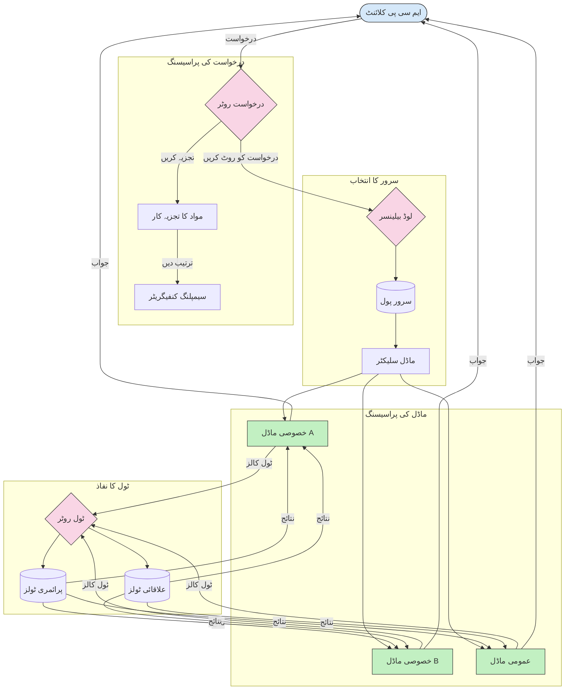

# ماڈل کانٹیکسٹ پروٹوکول میں راؤٹنگ

راؤٹنگ MCP ماحولیاتی نظام کے اندر درخواستوں کو مناسب ماڈلز، ٹولز، یا خدمات کی طرف بھیجنے کے لیے ضروری ہے۔

## تعارف

ماڈل کانٹیکسٹ پروٹوکول (MCP) میں راؤٹنگ مختلف معیار جیسے مواد کی قسم، صارف کا سیاق و سباق، اور نظام کا بوجھ کی بنیاد پر درخواستوں کو سب سے موزوں ماڈلز یا خدمات کی طرف بھیجنے کا عمل ہے۔ یہ مؤثر پروسیسنگ اور بہترین وسائل کے استعمال کو یقینی بناتا ہے۔

## سیکھنے کے مقاصد

اس سبق کے اختتام تک، آپ قابل ہوں گے:

- MCP میں راؤٹنگ کے اصولوں کو سمجھنا۔
- مواد کی بنیاد پر راؤٹنگ کو نافذ کرنا تاکہ درخواستوں کو مخصوص خدمات کی طرف بھیج سکیں۔
- وسائل کے بہتر استعمال کے لیے ذہین لوڈ بیلنسنگ حکمت عملیوں کا اطلاق کرنا۔
- درخواست کے سیاق و سباق کی بنیاد پر متحرک ٹول راؤٹنگ کو نافذ کرنا۔

## مواد کی بنیاد پر راؤٹنگ

مواد کی بنیاد پر راؤٹنگ درخواستوں کو ان کی مواد کی بنیاد پر مخصوص خدمات کی طرف بھیجتی ہے۔ مثال کے طور پر، کوڈ جنریشن سے متعلق درخواستیں ایک مخصوص کوڈ ماڈل کو بھیجی جا سکتی ہیں، جبکہ تخلیقی تحریر کی درخواستیں تخلیقی تحریر کے ماڈل کو بھیجی جاتی ہیں۔

آئیے مختلف پروگرامنگ زبانوں میں ایک مثال دیکھتے ہیں۔

<details>
<summary>.NET</summary>

```csharp
// .NET Example: Content-based routing in MCP
public class ContentBasedRouter
{
    private readonly Dictionary<string, McpClient> _specializedClients;
    private readonly RoutingClassifier _classifier;
    
    public ContentBasedRouter()
    {
        // Initialize specialized clients for different domains
        _specializedClients = new Dictionary<string, McpClient>
        {
            ["code"] = new McpClient("https://code-specialized-mcp.com"),
            ["creative"] = new McpClient("https://creative-specialized-mcp.com"),
            ["scientific"] = new McpClient("https://scientific-specialized-mcp.com"),
            ["general"] = new McpClient("https://general-mcp.com")
        };
        
        // Initialize content classifier
        _classifier = new RoutingClassifier();
    }
    
    public async Task<McpResponse> RouteAndProcessAsync(string prompt, IDictionary<string, object> parameters = null)
    {
        // Classify the prompt to determine the best specialized service
        string category = await _classifier.ClassifyPromptAsync(prompt);
        
        // Get the appropriate client or fall back to general
        var client = _specializedClients.ContainsKey(category) 
            ? _specializedClients[category] 
            : _specializedClients["general"];
            
        Console.WriteLine($"Routing request to {category} specialized service");
        
        // Send request to the selected service
        return await client.SendPromptAsync(prompt, parameters);
    }
    
    // Simple classifier for routing decisions
    private class RoutingClassifier
    {
        public Task<string> ClassifyPromptAsync(string prompt)
        {
            prompt = prompt.ToLowerInvariant();
            
            if (prompt.Contains("code") || prompt.Contains("function") || 
                prompt.Contains("program") || prompt.Contains("algorithm"))
            {
                return Task.FromResult("code");
            }
            
            if (prompt.Contains("story") || prompt.Contains("creative") || 
                prompt.Contains("imagine") || prompt.Contains("design"))
            {
                return Task.FromResult("creative");
            }
            
            if (prompt.Contains("science") || prompt.Contains("research") || 
                prompt.Contains("analyze") || prompt.Contains("study"))
            {
                return Task.FromResult("scientific");
            }
            
            return Task.FromResult("general");
        }
    }
}
```

پچھلے کوڈ میں، ہم نے:

- ایک `ContentBasedRouter` کلاس بنائی ہے جو پرامپٹ کے مواد کی بنیاد پر درخواستوں کو راؤٹ کرتی ہے۔
- مختلف شعبوں (کوڈ، تخلیقی، علمی، عمومی) کے لیے مخصوص کلائنٹس کو انیشیالائز کیا۔
- ایک سادہ کلاسیفائر نافذ کیا جو پرامپٹ کی قسم کا تعین کرتا ہے اور اسے مناسب مخصوص خدمت کی طرف بھیجتا ہے۔
- اگر کوئی مخصوص خدمت دستیاب نہ ہو تو درخواستوں کو عمومی خدمت کی طرف بھیجنے کے لیے فال بیک میکنزم استعمال کیا۔
- مؤثر طریقے سے درخواستوں کو سنبھالنے کے لیے غیر ہم وقت ساز پروسیسنگ نافذ کی۔
- مخصوص MCP کلائنٹس کی فہرست بنانے کے لیے ڈکشنری استعمال کی۔
- ایک سادہ کلاسیفائر نافذ کیا جو پرامپٹ کا تجزیہ کر کے مناسب قسم واپس کرتا ہے۔
- درخواست بھیجنے اور جواب وصول کرنے کے لیے مخصوص کلائنٹ کا استعمال کیا۔
- ایسے معاملات کو سنبھالا جہاں پرامپٹ کسی مخصوص قسم سے مطابقت نہیں رکھتا، انہیں عمومی خدمت کی طرف راؤٹ کیا۔

</details>

## ذہین لوڈ بیلنسنگ

لوڈ بیلنسنگ وسائل کے استعمال کو بہتر بناتا ہے اور MCP خدمات کے لئے اعلی دستیابی کو یقینی بناتا ہے۔ لوڈ بیلنسنگ کو مختلف طریقوں سے نافذ کیا جا سکتا ہے، جیسے راؤنڈ رابن، وزن شدہ جواب وقت، یا مواد آگاہ حکمت عملیاں۔

آئیے نیچے دی گئی مثال دیکھتے ہیں جو درج ذیل حکمت عملیاں استعمال کرتی ہے:

- **راؤنڈ رابن**: درخواستوں کو دستیاب سرورز کے درمیان برابر تقسیم کرتا ہے۔
- **وزن شدہ جواب وقت**: سرورز کو ان کے اوسط جواب وقت کی بنیاد پر درخواستیں بھیجتا ہے۔
- **مواد آگاہ**: درخواستوں کو ان کے مواد کی بنیاد پر مخصوص سرورز کی طرف بھیجتا ہے۔

<details>
<summary>Java</summary>

```java
// جاوا کی مثال: MCP سرورز کے لئے ذہین لوڈ بیلنسنگ
public class McpLoadBalancer {
    private final List<McpServerNode> serverNodes;
    private final LoadBalancingStrategy strategy;
    
    public McpLoadBalancer(List<McpServerNode> nodes, LoadBalancingStrategy strategy) {
        this.serverNodes = new ArrayList<>(nodes);
        this.strategy = strategy;
    }
    
    public McpResponse processRequest(McpRequest request) {
        // حکمت عملی کی بنیاد پر بہترین سرور منتخب کریں
        McpServerNode selectedNode = strategy.selectNode(serverNodes, request);
        
        try {
            // درخواست کو منتخب شدہ نوڈ پر بھیجیں
            return selectedNode.processRequest(request);
        } catch (Exception e) {
            // ناکامی کو سنبھالیں - دوبارہ کوشش یا بیک اپ منطق نافذ کریں
            System.err.println("Error processing request on node " + selectedNode.getId() + ": " + e.getMessage());
            
            // نوڈ کو ممکنہ طور پر غیر صحت مند نشان زد کریں
            selectedNode.recordFailure();
            
            // بیک اپ کے طور پر اگلے بہترین نوڈ کو آزمائیں
            List<McpServerNode> remainingNodes = new ArrayList<>(serverNodes);
            remainingNodes.remove(selectedNode);
            
            if (!remainingNodes.isEmpty()) {
                McpServerNode fallbackNode = strategy.selectNode(remainingNodes, request);
                return fallbackNode.processRequest(request);
            } else {
                throw new RuntimeException("All MCP server nodes failed to process the request");
            }
        }
    }
    
    // نوڈ صحت چیک کا کام
    public void startHealthChecks(Duration interval) {
        ScheduledExecutorService scheduler = Executors.newScheduledThreadPool(1);
        scheduler.scheduleAtFixedRate(() -> {
            for (McpServerNode node : serverNodes) {
                try {
                    boolean isHealthy = node.checkHealth();
                    System.out.println("Node " + node.getId() + " health status: " + 
                                      (isHealthy ? "HEALTHY" : "UNHEALTHY"));
                } catch (Exception e) {
                    System.err.println("Health check failed for node " + node.getId());
                    node.setHealthy(false);
                }
            }
        }, 0, interval.toMillis(), TimeUnit.MILLISECONDS);
    }
    
    // لوڈ بیلنسنگ حکمت عملیوں کے لئے انٹرفیس
    public interface LoadBalancingStrategy {
        McpServerNode selectNode(List<McpServerNode> nodes, McpRequest request);
    }
    
    // راؤنڈ روبن حکمت عملی
    public static class RoundRobinStrategy implements LoadBalancingStrategy {
        private AtomicInteger counter = new AtomicInteger(0);
        
        @Override
        public McpServerNode selectNode(List<McpServerNode> nodes, McpRequest request) {
            List<McpServerNode> healthyNodes = nodes.stream()
                .filter(McpServerNode::isHealthy)
                .collect(Collectors.toList());
            
            if (healthyNodes.isEmpty()) {
                throw new RuntimeException("No healthy nodes available");
            }
            
            int index = counter.getAndIncrement() % healthyNodes.size();
            return healthyNodes.get(index);
        }
    }
    
    // وزن دار جواب وقت کی حکمت عملی
    public static class ResponseTimeStrategy implements LoadBalancingStrategy {
        @Override
        public McpServerNode selectNode(List<McpServerNode> nodes, McpRequest request) {
            return nodes.stream()
                .filter(McpServerNode::isHealthy)
                .min(Comparator.comparing(McpServerNode::getAverageResponseTime))
                .orElseThrow(() -> new RuntimeException("No healthy nodes available"));
        }
    }
    
    // مواد سے آگاہ حکمت عملی
    public static class ContentAwareStrategy implements LoadBalancingStrategy {
        @Override
        public McpServerNode selectNode(List<McpServerNode> nodes, McpRequest request) {
            // درخواست کی خصوصیات کا تعین کریں
            boolean isCodeRequest = request.getPrompt().contains("code") || 
                                   request.getAllowedTools().contains("codeInterpreter");
            
            boolean isCreativeRequest = request.getPrompt().contains("creative") || 
                                       request.getPrompt().contains("story");
            
            // خصوصی نوڈز تلاش کریں
            Optional<McpServerNode> specializedNode = nodes.stream()
                .filter(McpServerNode::isHealthy)
                .filter(node -> {
                    if (isCodeRequest && node.getSpecialization().equals("code")) {
                        return true;
                    }
                    if (isCreativeRequest && node.getSpecialization().equals("creative")) {
                        return true;
                    }
                    return false;
                })
                .findFirst();
            
            // خصوصی نوڈ یا کم سے کم لوڈ شدہ نوڈ واپس کریں
            return specializedNode.orElse(
                nodes.stream()
                    .filter(McpServerNode::isHealthy)
                    .min(Comparator.comparing(McpServerNode::getCurrentLoad))
                    .orElseThrow(() -> new RuntimeException("No healthy nodes available"))
            );
        }
    }
}
```

پچھلے کوڈ میں، ہم نے:

- ایک `McpLoadBalancer` کلاس بنائی جو MCP سرور نوڈز کی فہرست کو منظم کرتی ہے اور منتخب لوڈ بیلنسنگ حکمت عملی کی بنیاد پر درخواستوں کو راؤٹ کرتی ہے۔
- مختلف لوڈ بیلنسنگ حکمت عملیاں نافذ کیں: `RoundRobinStrategy`, `ResponseTimeStrategy`, اور `ContentAwareStrategy`۔
- سرور نوڈز کی صحت کی جانچ کے لیے `ScheduledExecutorService` استعمال کی۔
- صحت کی جانچ کا میکنزم نافذ کیا جو نوڈز کو صحت مند یا غیر صحت مند مارک کرتا ہے۔
- درخواستوں کو ہینڈل کرنے کے دوران خرابی سنبھالنے اور فال بیک لاجک استعمال کی تاکہ اعلی دستیابی کو یقینی بنایا جا سکے۔
- `McpServerNode` کلاس استعمال کی جو ہر MCP سرور نوڈ کی صحت، اوسط جواب وقت، اور موجودہ بوجھ کی نمائندگی کرتا ہے۔
- `McpRequest` کلاس نافذ کی جو درخواست کی تفصیلات جیسے پرامپٹ اور اجازت شدہ ٹولز کو محفوظ کرتی ہے۔
- صحت کی حالت اور تخصیص کی بنیاد پر نوڈز کو فلٹر اور منتخب کرنے کے لئے جاوا اسٹریمز کا استعمال کیا۔

</details>

## متحرک ٹول راؤٹنگ

ٹول راؤٹنگ اس بات کو یقینی بناتی ہے کہ ٹول کالز سیاق و سباق کی بنیاد پر سب سے مناسب خدمت کی طرف بھیجی جائیں۔ مثال کے طور پر، موسمیاتی ٹول کال کو صارف کی جگہ کی بنیاد پر علاقائی اینڈ پوائنٹ پر بھیجنا ہو سکتا ہے، یا کیلکولیٹر ٹول کو API کے مخصوص ورژن کا استعمال کرنا ہو۔

آئیے ایک مثال دیکھتے ہیں جو درخواست کے تجزیے، علاقائی اینڈ پوائنٹس، اور ورژننگ سپورٹ کی بنیاد پر متحرک ٹول راؤٹنگ کو ظاہر کرتی ہے۔

<details>
<summary>Python</summary>

```python
# پائتھون کی مثال: درخواست کے تجزیے کی بنیاد پر متحرک ٹول روٹنگ
class McpToolRouter:
    def __init__(self):
        # دستیاب ٹول اینڈپوائنٹس کو رجسٹر کریں
        self.tool_endpoints = {
            "weatherTool": "https://weather-service.example.com/api",
            "calculatorTool": "https://calculator-service.example.com/compute",
            "databaseTool": "https://database-service.example.com/query",
            "searchTool": "https://search-service.example.com/search"
        }
        
        # عالمی تقسیم کے لیے علاقائی اینڈپوائنٹس
        self.regional_endpoints = {
            "us": {
                "weatherTool": "https://us-west.weather-service.example.com/api",
                "searchTool": "https://us.search-service.example.com/search"
            },
            "europe": {
                "weatherTool": "https://eu.weather-service.example.com/api",
                "searchTool": "https://eu.search-service.example.com/search"
            },
            "asia": {
                "weatherTool": "https://asia.weather-service.example.com/api",
                "searchTool": "https://asia.search-service.example.com/search"
            }
        }
        
        # ٹول ورژننگ کی حمایت
        self.tool_versions = {
            "weatherTool": {
                "default": "v2",
                "v1": "https://weather-service.example.com/api/v1",
                "v2": "https://weather-service.example.com/api/v2",
                "beta": "https://weather-service.example.com/api/beta"
            }
        }
    
    async def route_tool_request(self, tool_name, parameters, user_context=None):
        """Route a tool request to the appropriate endpoint based on context"""
        endpoint = self._select_endpoint(tool_name, parameters, user_context)
        
        if not endpoint:
            raise ValueError(f"No endpoint available for tool: {tool_name}")
        
        # منتخب کردہ اینڈپوائنٹ پر اصل درخواست انجام دیں
        return await self._execute_tool_request(endpoint, tool_name, parameters)
    
    def _select_endpoint(self, tool_name, parameters, user_context=None):
        """Select the most appropriate endpoint based on context"""
        # رجسٹری سے بنیادی اینڈپوائنٹ
        if tool_name not in self.tool_endpoints:
            return None
            
        base_endpoint = self.tool_endpoints[tool_name]
        
        # چیک کریں کہ آیا ہمیں مخصوص ٹول ورژن استعمال کرنے کی ضرورت ہے
        if tool_name in self.tool_versions:
            version_info = self.tool_versions[tool_name]
            
            # مخصوص ورژن یا ڈیفالٹ کا استعمال کریں
            requested_version = parameters.get("_version", version_info["default"])
            if requested_version in version_info:
                base_endpoint = version_info[requested_version]
        
        # اگر صارف کے علاقے کا علم ہو تو علاقائی روٹنگ کی جانچ کریں
        if user_context and "region" in user_context:
            user_region = user_context["region"]
            
            if user_region in self.regional_endpoints:
                regional_tools = self.regional_endpoints[user_region]
                
                if tool_name in regional_tools:
                    # علاقے کے مخصوص اینڈپوائنٹ کا استعمال کریں
                    return regional_tools[tool_name]
        
        # ڈیٹا قیام کے تقاضوں کی جانچ کریں
        if user_context and "data_residency" in user_context:
            # یہ منطق کو نافذ کرے گا تاکہ ڈیٹا مخصوص دائرہ اختیار میں رہے
            pass
        
        # لیٹنسی کی بنیاد پر روٹنگ کی جانچ کریں
        if user_context and "latency_sensitive" in user_context and user_context["latency_sensitive"]:
            # یہ منطق کو نافذ کرے گا تاکہ کم از کم لیٹنسی والا اینڈپوائنٹ منتخب کیا جا سکے
            pass
            
        return base_endpoint
        
    async def _execute_tool_request(self, endpoint, tool_name, parameters):
        """Execute the actual tool request to the selected endpoint"""
        try:
            async with aiohttp.ClientSession() as session:
                async with session.post(
                    endpoint,
                    json={"toolName": tool_name, "parameters": parameters},
                    headers={"Content-Type": "application/json"}
                ) as response:
                    if response.status == 200:
                        result = await response.json()
                        return result
                    else:
                        error_text = await response.text()
                        raise Exception(f"Tool execution failed: {error_text}")
        except Exception as e:
            # دوبارہ کوشش کی منطق یا بیک اپ حکمت عملی نافذ کریں
            print(f"Error executing tool {tool_name} at {endpoint}: {str(e)}")
            raise
```

پچھلے کوڈ میں، ہم نے:

- ایک `McpToolRouter` کلاس بنائی جو درخواست کے تجزیے، علاقائی اینڈ پوائنٹس، اور ورژننگ سپورٹ کی بنیاد پر ٹول راؤٹنگ کی مینجمنٹ کرتی ہے۔
- دستیاب ٹول اینڈ پوائنٹس اور عالمی تقسیم کے لیے علاقائی اینڈ پوائنٹس کو رجسٹر کیا۔
- متحرک راؤٹنگ لاجک نافذ کی جو صارف کے سیاق و سباق، جیسے علاقہ اور ڈیٹا رہائش کے تقاضوں کی بنیاد پر مناسب اینڈ پوائنٹ کو منتخب کرتی ہے۔
- ٹولز کے لیے ورژننگ سپورٹ نافذ کی، جو صارفین کو اجازت دیتا ہے کہ وہ مطلوبہ ٹول کا ورژن منتخب کریں۔
- غیر ہم وقت ساز HTTP درخواستیں استعمال کیں تاکہ ٹول کالز کو انجام دیا جا سکے اور جوابات کو سنبھالا جا سکے۔

</details>

## MCP میں سیمپلنگ اور راؤٹنگ کا فن تعمیر

سیمپلنگ ماڈل کانٹیکسٹ پروٹوکول (MCP) کا ایک اہم جزو ہے جو مؤثر درخواست پروسیسنگ اور راؤٹنگ کی اجازت دیتا ہے۔ یہ آنے والی درخواستوں کا تجزیہ کرتا ہے تاکہ مختلف معیار جیسے مواد کی قسم، صارف کا سیاق و سباق، اور نظام کا بوجھ کی بنیاد پر انہیں سنبھالنے کے لیے سب سے مناسب ماڈل یا خدمت کا تعین کیا جا سکے۔

سیمپلنگ اور راؤٹنگ کو ملا کر ایک مضبوط فن تعمیر بنایا جا سکتا ہے جو وسائل کے استعمال کو بہتر بناتا ہے اور اعلی دستیابی کو یقینی بناتا ہے۔ سیمپلنگ عمل درخواستوں کو درجہ بندی کے لیے استعمال کیا جا سکتا ہے، جبکہ راؤٹنگ انہیں مناسب ماڈلز یا خدمات کی طرف بھیجتی ہے۔

ذیل میں دیا گیا خاکہ دکھاتا ہے کہ MCP کے جامع فن تعمیر میں سیمپلنگ اور راؤٹنگ کس طرح ساتھ کام کرتے ہیں:



## آگے کیا ہے

- [5.6 سیمپلنگ](../mcp-sampling/README.md)

---

<!-- CO-OP TRANSLATOR DISCLAIMER START -->
**ڈس کلیمر**:
یہ دستاویز AI ترجمہ سروس [Co-op Translator](https://github.com/Azure/co-op-translator) کے ذریعے ترجمہ کی گئی ہے۔ جبکہ ہم درستگی کے لیے کوشاں ہیں، براہ کرم اس بات سے آگاہ رہیں کہ خودکار ترجمے میں غلطیاں یا عدم درستیاں ہو سکتی ہیں۔ اصل دستاویز اپنے مادری زبان میں مستند ماخذ سمجھی جائے گی۔ حساس معلومات کے لیے پیشہ ور انسانی ترجمہ کی سفارش کی جاتی ہے۔ اس ترجمے کے استعمال سے پیدا ہونے والی کسی بھی غلط فہمی یا غلط تشریح کی ذمہ داری ہم قبول نہیں کرتے۔
<!-- CO-OP TRANSLATOR DISCLAIMER END -->