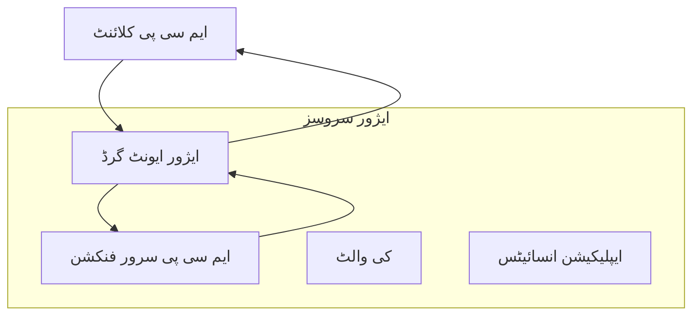
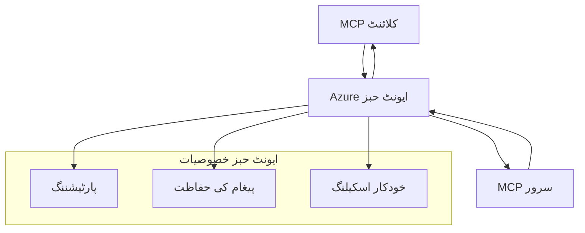

# MCP کسٹم ٹرانسپورٹس - جدید نفاذ گائیڈ

ماڈل کونٹیکسٹ پروٹوکول (MCP) نقل و حمل کے طریقوں میں لچک فراہم کرتا ہے، جو خصوصی کاروباری ماحول کے لیے کسٹم نفاذ کی اجازت دیتا ہے۔ یہ جدید گائیڈ کسٹم ٹرانسپورٹ نفاذات کو آزور ایونٹ گرڈ اور آزور ایونٹ حبز کی عملی مثالوں کے ذریعے دریافت کرتا ہے تاکہ اسکیل ایبل، کلاؤڈ-نیٹو MCP حل تیار کیے جا سکیں۔

> **آگے کی نظر:** یہ گائیڈ **MCP Specification 2025-11-25** کے خلاف لکھی گئی ہے، جہاں ہر سیشن کے لیے سیشن آرڈر کو محفوظ رکھنا ضروری ہے (نیچے Message Protocol دیکھیں)۔ `2026-07-28` ریلیز کینڈیڈیٹ پروٹوکول سطح کے سیشن کو مکمل طور پر ہٹا دیتا ہے اور `Mcp-Method`/`Mcp-Name` ہیڈرز کی ضرورت رکھتا ہے تاکہ گیٹ ویز اور کسٹم ٹرانسپورٹس ہر درخواست کے حساب سے روٹنگ کر سکیں نہ کہ ہر سیشن کے حساب سے۔ مزید معلومات کے لیے [MCP میں تبدیلیاں: 2026-07-28 ریلیز کینڈیڈیٹ](../../01-CoreConcepts/mcp-2026-07-28-release-candidate.md) دیکھیں۔

## تعارف

جبکہ MCP کے معیار کے مطابق ٹرانسپورٹس (stdio اور HTTP streaming) زیادہ تر استعمال کے لیے کافی ہیں، کاروباری ماحول میں بہتر اسکیل ایبلیٹی، اعتمادیت، اور موجودہ کلاؤڈ انفراسٹرکچر میں انضمام کے لیے اکثر مخصوص ٹرانسپورٹ میکنزم کی ضرورت ہوتی ہے۔ کسٹم ٹرانسپورٹس MCP کو کلاؤڈ-نیٹو میسجنگ خدمات سے فائدہ اٹھانے کے قابل بناتے ہیں تاکہ غیر ہم وقت مواصلات، ایونٹ سے چلنے والی آرکیٹیکچرز، اور تقسیم شدہ پروسیسنگ کی جائیں۔

یہ سبق جدید MCP وضاحت (2025-11-25)، آزور میسجنگ سروسز، اور قائم شدہ کاروباری انضمامی نمونوں پر مبنی جدید ٹرانسپورٹ نفاذات کا جائزہ لیتا ہے۔

### **MCP ٹرانسپورٹ آرکیٹیکچر**

**MCP وضاحت (2025-11-25) سے:**

- **معیاری ٹرانسپورٹس**: stdio (تجویز کردہ)، ریموٹ صورتحال کے لیے HTTP streaming
- **کسٹم ٹرانسپورٹس**: کوئی بھی ٹرانسپورٹ جو MCP میسج ایکسچینج پروٹوکول کو نافذ کرتا ہو
- **میسج فارمیٹ**: JSON-RPC 2.0 MCP-مخصوص توسیعات کے ساتھ
- **دو طرفہ رابطہ**: نوٹیفیکیشنز اور جوابات کے لیے مکمل ڈوپلیکس کمیونیکیشن ضروری

## سیکھنے کے مقاصد

اس جدید سبق کے اختتام تک، آپ اہل ہوں گے کہ:

- **کسٹم ٹرانسپورٹ کی ضروریات کو سمجھیں**: کسی بھی ٹرانسپورٹ لیئر پر MCP پروٹوکول نافذ کریں اور تعمیل برقرار رکھیں
- **Azure Event Grid ٹرانسپورٹ بنائیں**: Azure Event Grid استعمال کرتے ہوئے ایونٹ سے چلنے والے MCP سرورز تخلیق کریں تاکہ بغیر سرور کی وسعت ہو سکے
- **Azure Event Hubs ٹرانسپورٹ نافذ کریں**: Azure Event Hubs کا استعمال کرتے ہوئے ریئل ٹائم اسٹریمنگ کے لیے اعلی تھروپٹ MCP حل ڈیزائن کریں
- **کاروباری نمونے نافذ کریں**: موجودہ Azure انفراسٹرکچر اور سیکیورٹی ماڈلز کے ساتھ کسٹم ٹرانسپورٹس کو مربوط کریں
- **ٹرانسپورٹ کی اعتمادیت سنبھالیں**: میسج کی پائیداری، ترتیب، اور خرابیوں سے نمٹنے کو کاروباری صورتحال کے مطابق نافذ کریں
- **کارکردگی کو بہتر بنائیں**: پیمانے، تاخیر، اور تھروپٹ کی ضروریات کے لیے ٹرانسپورٹ حل ڈیزائن کریں

## **ٹرانسپورٹ کی ضروریات**

### **MCP وضاحت (2025-11-25) سے بنیادی ضروریات:**

```yaml
Message Protocol:
  format: "JSON-RPC 2.0 with MCP extensions"
  bidirectional: "Full duplex communication required"
  ordering: "Message ordering must be preserved per session"
  
Transport Layer:
  reliability: "Transport MUST handle connection failures gracefully"
  security: "Transport MUST support secure communication"
  identification: "Each session MUST have unique identifier"
  
Custom Transport:
  compliance: "MUST implement complete MCP message exchange"
  extensibility: "MAY add transport-specific features"
  interoperability: "MUST maintain protocol compatibility"
```

## **Azure Event Grid ٹرانسپورٹ نفاذ**

Azure Event Grid ایک بغیر سرور کا ایونٹ روٹنگ سروس فراہم کرتا ہے جو ایونٹ سے چلنے والی MCP آرکیٹیکچرز کے لیے مثالی ہے۔ یہ نفاذ دکھاتا ہے کہ کس طرح اسکیل ایبل، کم مربوط MCP سسٹمز بنائے جا سکتے ہیں۔

### **آرکیٹیکچر کا جائزہ**



### **C# نفاذ - Event Grid ٹرانسپورٹ**

```csharp
using Azure.Messaging.EventGrid;
using Microsoft.Extensions.Azure;
using System.Text.Json;

public class EventGridMcpTransport : IMcpTransport
{
    private readonly EventGridPublisherClient _publisher;
    private readonly string _topicEndpoint;
    private readonly string _clientId;
    
    public EventGridMcpTransport(string topicEndpoint, string accessKey, string clientId)
    {
        _publisher = new EventGridPublisherClient(
            new Uri(topicEndpoint), 
            new AzureKeyCredential(accessKey));
        _topicEndpoint = topicEndpoint;
        _clientId = clientId;
    }
    
    public async Task SendMessageAsync(McpMessage message)
    {
        var eventGridEvent = new EventGridEvent(
            subject: $"mcp/{_clientId}",
            eventType: "MCP.MessageReceived",
            dataVersion: "1.0",
            data: JsonSerializer.Serialize(message))
        {
            Id = Guid.NewGuid().ToString(),
            EventTime = DateTimeOffset.UtcNow
        };
        
        await _publisher.SendEventAsync(eventGridEvent);
    }
    
    public async Task<McpMessage> ReceiveMessageAsync(CancellationToken cancellationToken)
    {
        // Event Grid is push-based, so implement webhook receiver
        // This would typically be handled by Azure Functions trigger
        throw new NotImplementedException("Use EventGridTrigger in Azure Functions");
    }
}

// Azure Function for receiving Event Grid events
[FunctionName("McpEventGridReceiver")]
public async Task<IActionResult> HandleEventGridMessage(
    [EventGridTrigger] EventGridEvent eventGridEvent,
    ILogger log)
{
    try
    {
        var mcpMessage = JsonSerializer.Deserialize<McpMessage>(
            eventGridEvent.Data.ToString());
        
        // Process MCP message
        var response = await _mcpServer.ProcessMessageAsync(mcpMessage);
        
        // Send response back via Event Grid
        await _transport.SendMessageAsync(response);
        
        return new OkResult();
    }
    catch (Exception ex)
    {
        log.LogError(ex, "Error processing Event Grid MCP message");
        return new BadRequestResult();
    }
}
```

### **TypeScript نفاذ - Event Grid ٹرانسپورٹ**

```typescript
import { EventGridPublisherClient, AzureKeyCredential } from "@azure/eventgrid";
import { McpTransport, McpMessage } from "./mcp-types";

export class EventGridMcpTransport implements McpTransport {
    private publisher: EventGridPublisherClient;
    private clientId: string;
    
    constructor(
        private topicEndpoint: string,
        private accessKey: string,
        clientId: string
    ) {
        this.publisher = new EventGridPublisherClient(
            topicEndpoint,
            new AzureKeyCredential(accessKey)
        );
        this.clientId = clientId;
    }
    
    async sendMessage(message: McpMessage): Promise<void> {
        const event = {
            id: crypto.randomUUID(),
            source: `mcp-client-${this.clientId}`,
            type: "MCP.MessageReceived",
            time: new Date(),
            data: message
        };
        
        await this.publisher.sendEvents([event]);
    }
    
    // ایونٹ پر مبنی وصولی بذریعہ ایژور فنکشنز
    onMessage(handler: (message: McpMessage) => Promise<void>): void {
        // عمل درآمد کے لیے ایژور فنکشنز ایونٹ گرڈ ٹرگر استعمال کیا جائے گا
        // یہ ویب ہک وصول کنندہ کے لیے ایک تصوری انٹرفیس ہے
    }
}

// ایژور فنکشنز عمل درآمد
import { app, InvocationContext, EventGridEvent } from "@azure/functions";

app.eventGrid("mcpEventGridHandler", {
    handler: async (event: EventGridEvent, context: InvocationContext) => {
        try {
            const mcpMessage = event.data as McpMessage;
            
            // MCP پیغام کو پراسیس کریں
            const response = await mcpServer.processMessage(mcpMessage);
            
            // ایونٹ گرڈ کے ذریعے جواب بھیجیں
            await transport.sendMessage(response);
            
        } catch (error) {
            context.error("Error processing MCP message:", error);
            throw error;
        }
    }
});
```

### **Python نفاذ - Event Grid ٹرانسپورٹ**

```python
from azure.eventgrid import EventGridPublisherClient, EventGridEvent
from azure.core.credentials import AzureKeyCredential
import asyncio
import json
from typing import Callable, Optional
import uuid
from datetime import datetime

class EventGridMcpTransport:
    def __init__(self, topic_endpoint: str, access_key: str, client_id: str):
        self.client = EventGridPublisherClient(
            topic_endpoint, 
            AzureKeyCredential(access_key)
        )
        self.client_id = client_id
        self.message_handler: Optional[Callable] = None
    
    async def send_message(self, message: dict) -> None:
        """Send MCP message via Event Grid"""
        event = EventGridEvent(
            data=message,
            subject=f"mcp/{self.client_id}",
            event_type="MCP.MessageReceived",
            data_version="1.0"
        )
        
        await self.client.send(event)
    
    def on_message(self, handler: Callable[[dict], None]) -> None:
        """Register message handler for incoming events"""
        self.message_handler = handler

# ایزور فنکشنز کا نفاذ
import azure.functions as func
import logging

def main(event: func.EventGridEvent) -> None:
    """Azure Functions Event Grid trigger for MCP messages"""
    try:
        # ایونٹ گرڈ ایونٹ سے MCP پیغام کو پارس کریں
        mcp_message = json.loads(event.get_body().decode('utf-8'))
        
        # MCP پیغام کو پروسیس کریں
        response = process_mcp_message(mcp_message)
        
        # جواب دوبارہ ایونٹ گرڈ کے ذریعے بھیجیں
        # (نفاذ نیا ایونٹ گرڈ کلائنٹ بنائے گا)
        
    except Exception as e:
        logging.error(f"Error processing MCP Event Grid message: {e}")
        raise
```

## **Azure Event Hubs ٹرانسپورٹ نفاذ**

Azure Event Hubs اعلی تھروپٹ، ریئل ٹائم اسٹریمنگ کی صلاحیت فراہم کرتا ہے جو کم تاخیر اور زیادہ میسج حجم کی ضرورت والے MCP منظرناموں کے لیے موزوں ہے۔

### **آرکیٹیکچر کا جائزہ**



### **C# نفاذ - Event Hubs ٹرانسپورٹ**

```csharp
using Azure.Messaging.EventHubs;
using Azure.Messaging.EventHubs.Producer;
using Azure.Messaging.EventHubs.Consumer;
using System.Text;

public class EventHubsMcpTransport : IMcpTransport, IDisposable
{
    private readonly EventHubProducerClient _producer;
    private readonly EventHubConsumerClient _consumer;
    private readonly string _consumerGroup;
    private readonly CancellationTokenSource _cancellationTokenSource;
    
    public EventHubsMcpTransport(
        string connectionString, 
        string eventHubName,
        string consumerGroup = "$Default")
    {
        _producer = new EventHubProducerClient(connectionString, eventHubName);
        _consumer = new EventHubConsumerClient(
            consumerGroup, 
            connectionString, 
            eventHubName);
        _consumerGroup = consumerGroup;
        _cancellationTokenSource = new CancellationTokenSource();
    }
    
    public async Task SendMessageAsync(McpMessage message)
    {
        var messageBody = JsonSerializer.Serialize(message);
        var eventData = new EventData(Encoding.UTF8.GetBytes(messageBody));
        
        // Add MCP-specific properties
        eventData.Properties.Add("MessageType", message.Method ?? "response");
        eventData.Properties.Add("MessageId", message.Id);
        eventData.Properties.Add("Timestamp", DateTimeOffset.UtcNow);
        
        await _producer.SendAsync(new[] { eventData });
    }
    
    public async Task StartReceivingAsync(
        Func<McpMessage, Task> messageHandler)
    {
        await foreach (PartitionEvent partitionEvent in _consumer.ReadEventsAsync(
            _cancellationTokenSource.Token))
        {
            try
            {
                var messageBody = Encoding.UTF8.GetString(
                    partitionEvent.Data.EventBody.ToArray());
                var mcpMessage = JsonSerializer.Deserialize<McpMessage>(messageBody);
                
                await messageHandler(mcpMessage);
            }
            catch (Exception ex)
            {
                // Handle deserialization or processing errors
                Console.WriteLine($"Error processing message: {ex.Message}");
            }
        }
    }
    
    public void Dispose()
    {
        _cancellationTokenSource?.Cancel();
        _producer?.DisposeAsync().AsTask().Wait();
        _consumer?.DisposeAsync().AsTask().Wait();
        _cancellationTokenSource?.Dispose();
    }
}
```

### **TypeScript نفاذ - Event Hubs ٹرانسپورٹ**

```typescript
import { 
    EventHubProducerClient, 
    EventHubConsumerClient, 
    EventData 
} from "@azure/event-hubs";

export class EventHubsMcpTransport implements McpTransport {
    private producer: EventHubProducerClient;
    private consumer: EventHubConsumerClient;
    private isReceiving = false;
    
    constructor(
        private connectionString: string,
        private eventHubName: string,
        private consumerGroup: string = "$Default"
    ) {
        this.producer = new EventHubProducerClient(
            connectionString, 
            eventHubName
        );
        this.consumer = new EventHubConsumerClient(
            consumerGroup,
            connectionString,
            eventHubName
        );
    }
    
    async sendMessage(message: McpMessage): Promise<void> {
        const eventData: EventData = {
            body: JSON.stringify(message),
            properties: {
                messageType: message.method || "response",
                messageId: message.id,
                timestamp: new Date().toISOString()
            }
        };
        
        await this.producer.sendBatch([eventData]);
    }
    
    async startReceiving(
        messageHandler: (message: McpMessage) => Promise<void>
    ): Promise<void> {
        if (this.isReceiving) return;
        
        this.isReceiving = true;
        
        const subscription = this.consumer.subscribe({
            processEvents: async (events, context) => {
                for (const event of events) {
                    try {
                        const messageBody = event.body as string;
                        const mcpMessage: McpMessage = JSON.parse(messageBody);
                        
                        await messageHandler(mcpMessage);
                        
                        // کم از کم ایک بار ترسیل کے لیے چیک پوائنٹ کو اپ ڈیٹ کریں
                        await context.updateCheckpoint(event);
                    } catch (error) {
                        console.error("Error processing Event Hubs message:", error);
                    }
                }
            },
            processError: async (err, context) => {
                console.error("Event Hubs error:", err);
            }
        });
    }
    
    async close(): Promise<void> {
        this.isReceiving = false;
        await this.producer.close();
        await this.consumer.close();
    }
}
```

### **Python نفاذ - Event Hubs ٹرانسپورٹ**

```python
from azure.eventhub import EventHubProducerClient, EventHubConsumerClient
from azure.eventhub import EventData
import json
import asyncio
from typing import Callable, Dict, Any
import logging

class EventHubsMcpTransport:
    def __init__(
        self, 
        connection_string: str, 
        eventhub_name: str,
        consumer_group: str = "$Default"
    ):
        self.producer = EventHubProducerClient.from_connection_string(
            connection_string, 
            eventhub_name=eventhub_name
        )
        self.consumer = EventHubConsumerClient.from_connection_string(
            connection_string,
            consumer_group=consumer_group,
            eventhub_name=eventhub_name
        )
        self.is_receiving = False
    
    async def send_message(self, message: Dict[str, Any]) -> None:
        """Send MCP message via Event Hubs"""
        event_data = EventData(json.dumps(message))
        
        # MCP کی مخصوص خصوصیات شامل کریں
        event_data.properties = {
            "messageType": message.get("method", "response"),
            "messageId": message.get("id"),
            "timestamp": "2025-01-14T10:30:00Z"  # حقیقی ٹائم اسٹیمپ استعمال کریں
        }
        
        async with self.producer:
            event_data_batch = await self.producer.create_batch()
            event_data_batch.add(event_data)
            await self.producer.send_batch(event_data_batch)
    
    async def start_receiving(
        self, 
        message_handler: Callable[[Dict[str, Any]], None]
    ) -> None:
        """Start receiving MCP messages from Event Hubs"""
        if self.is_receiving:
            return
        
        self.is_receiving = True
        
        async with self.consumer:
            await self.consumer.receive(
                on_event=self._on_event_received(message_handler),
                starting_position="-1"  # آغاز سے شروع کریں
            )
    
    def _on_event_received(self, handler: Callable):
        """Internal event handler wrapper"""
        async def handle_event(partition_context, event):
            try:
                # ایونٹ ہیبز ایونٹ سے MCP پیغام کو پارس کریں
                message_body = event.body_as_str(encoding='UTF-8')
                mcp_message = json.loads(message_body)
                
                # MCP پیغام کو پروسیس کریں
                await handler(mcp_message)
                
                # کم از کم ایک بار ڈیلیوری کے لیے چیکپوائنٹ کو اپ ڈیٹ کریں
                await partition_context.update_checkpoint(event)
                
            except Exception as e:
                logging.error(f"Error processing Event Hubs message: {e}")
        
        return handle_event
    
    async def close(self) -> None:
        """Clean up transport resources"""
        self.is_receiving = False
        await self.producer.close()
        await self.consumer.close()
```

## **جدید ٹرانسپورٹ نمونے**

### **میسج پائیداری اور اعتمادیت**

```csharp
// Implementing message durability with retry logic
public class ReliableTransportWrapper : IMcpTransport
{
    private readonly IMcpTransport _innerTransport;
    private readonly RetryPolicy _retryPolicy;
    
    public async Task SendMessageAsync(McpMessage message)
    {
        await _retryPolicy.ExecuteAsync(async () =>
        {
            try
            {
                await _innerTransport.SendMessageAsync(message);
            }
            catch (TransportException ex) when (ex.IsRetryable)
            {
                // Log and retry
                throw;
            }
        });
    }
}
```

### **ٹرانسپورٹ سیکیورٹی انضمام**

```csharp
// Integrating Azure Key Vault for transport security
public class SecureTransportFactory
{
    private readonly SecretClient _keyVaultClient;
    
    public async Task<IMcpTransport> CreateEventGridTransportAsync()
    {
        var accessKey = await _keyVaultClient.GetSecretAsync("EventGridAccessKey");
        var topicEndpoint = await _keyVaultClient.GetSecretAsync("EventGridTopic");
        
        return new EventGridMcpTransport(
            topicEndpoint.Value.Value,
            accessKey.Value.Value,
            Environment.MachineName
        );
    }
}
```

### **ٹرانسپورٹ کی نگرانی اور مشاہدہ کاری**

```csharp
// Adding telemetry to custom transports
public class ObservableTransport : IMcpTransport
{
    private readonly IMcpTransport _transport;
    private readonly ILogger _logger;
    private readonly TelemetryClient _telemetryClient;
    
    public async Task SendMessageAsync(McpMessage message)
    {
        using var activity = Activity.StartActivity("MCP.Transport.Send");
        activity?.SetTag("transport.type", "EventGrid");
        activity?.SetTag("message.method", message.Method);
        
        var stopwatch = Stopwatch.StartNew();
        
        try
        {
            await _transport.SendMessageAsync(message);
            
            _telemetryClient.TrackDependency(
                "EventGrid",
                "SendMessage",
                DateTime.UtcNow.Subtract(stopwatch.Elapsed),
                stopwatch.Elapsed,
                true
            );
        }
        catch (Exception ex)
        {
            _telemetryClient.TrackException(ex);
            throw;
        }
    }
}
```

## **کاروباری انضمام کے منظرنامے**

### **منظرنامہ 1: تقسیم شدہ MCP پروسیسنگ**

Azure Event Grid کا استعمال کرتے ہوئے MCP درخواستیں متعدد پروسیسنگ نوڈز میں تقسیم کرنا:

```yaml
Architecture:
  - MCP Client sends requests to Event Grid topic
  - Multiple Azure Functions subscribe to process different tool types
  - Results aggregated and returned via separate response topic
  
Benefits:
  - Horizontal scaling based on message volume
  - Fault tolerance through redundant processors
  - Cost optimization with serverless compute
```

### **منظرنامہ 2: ریئل ٹائم MCP اسٹریمنگ**

Azure Event Hubs کے ذریعے تیز رفتاری سے MCP تعاملات:

```yaml
Architecture:
  - MCP Client streams continuous requests via Event Hubs
  - Stream Analytics processes and routes messages
  - Multiple consumers handle different aspect of processing
  
Benefits:
  - Low latency for real-time scenarios
  - High throughput for batch processing
  - Built-in partitioning for parallel processing
```

### **منظرنامہ 3: ہائبرڈ ٹرانسپورٹ آرکیٹیکچر**

مختلف استعمال کے لیے متعدد ٹرانسپورٹس کو یکجا کرنا:

```csharp
public class HybridMcpTransport : IMcpTransport
{
    private readonly IMcpTransport _realtimeTransport; // Event Hubs
    private readonly IMcpTransport _batchTransport;    // Event Grid
    private readonly IMcpTransport _fallbackTransport; // HTTP Streaming
    
    public async Task SendMessageAsync(McpMessage message)
    {
        // Route based on message characteristics
        var transport = message.Method switch
        {
            "tools/call" when IsRealtime(message) => _realtimeTransport,
            "resources/read" when IsBatch(message) => _batchTransport,
            _ => _fallbackTransport
        };
        
        await transport.SendMessageAsync(message);
    }
}
```

## **کارکردگی بہتر بنانا**

### **Event Grid کے لیے میسج بیچنگ**

```csharp
public class BatchingEventGridTransport : IMcpTransport
{
    private readonly List<McpMessage> _messageBuffer = new();
    private readonly Timer _flushTimer;
    private const int MaxBatchSize = 100;
    
    public async Task SendMessageAsync(McpMessage message)
    {
        lock (_messageBuffer)
        {
            _messageBuffer.Add(message);
            
            if (_messageBuffer.Count >= MaxBatchSize)
            {
                _ = Task.Run(FlushMessages);
            }
        }
    }
    
    private async Task FlushMessages()
    {
        List<McpMessage> toSend;
        lock (_messageBuffer)
        {
            toSend = new List<McpMessage>(_messageBuffer);
            _messageBuffer.Clear();
        }
        
        if (toSend.Any())
        {
            var events = toSend.Select(CreateEventGridEvent);
            await _publisher.SendEventsAsync(events);
        }
    }
}
```

### **Event Hubs کے لیے پارٹیشننگ حکمت عملی**

```csharp
public class PartitionedEventHubsTransport : IMcpTransport
{
    public async Task SendMessageAsync(McpMessage message)
    {
        // Partition by client ID for session affinity
        var partitionKey = ExtractClientId(message);
        
        var eventData = new EventData(JsonSerializer.SerializeToUtf8Bytes(message))
        {
            PartitionKey = partitionKey
        };
        
        await _producer.SendAsync(new[] { eventData });
    }
}
```

## **کسٹم ٹرانسپورٹس کی جانچ**

### **ٹیسٹ ڈبلز کے ساتھ یونٹ ٹیسٹنگ**

```csharp
[Test]
public async Task EventGridTransport_SendMessage_PublishesCorrectEvent()
{
    // Arrange
    var mockPublisher = new Mock<EventGridPublisherClient>();
    var transport = new EventGridMcpTransport(mockPublisher.Object);
    var message = new McpMessage { Method = "tools/list", Id = "test-123" };
    
    // Act
    await transport.SendMessageAsync(message);
    
    // Assert
    mockPublisher.Verify(
        x => x.SendEventAsync(
            It.Is<EventGridEvent>(e => 
                e.EventType == "MCP.MessageReceived" &&
                e.Subject == "mcp/test-client"
            )
        ),
        Times.Once
    );
}
```

### **Azure Test Containers کے ساتھ انضمامی ٹیسٹنگ**

```csharp
[Test]
public async Task EventHubsTransport_IntegrationTest()
{
    // Using Testcontainers for integration testing
    var eventHubsContainer = new EventHubsContainer()
        .WithEventHub("test-hub");
    
    await eventHubsContainer.StartAsync();
    
    var transport = new EventHubsMcpTransport(
        eventHubsContainer.GetConnectionString(),
        "test-hub"
    );
    
    // Test message round-trip
    var sentMessage = new McpMessage { Method = "test", Id = "123" };
    McpMessage receivedMessage = null;
    
    await transport.StartReceivingAsync(msg => {
        receivedMessage = msg;
        return Task.CompletedTask;
    });
    
    await transport.SendMessageAsync(sentMessage);
    await Task.Delay(1000); // Allow for message processing
    
    Assert.That(receivedMessage?.Id, Is.EqualTo("123"));
}
```

## **بہترین طریقے اور رہنما اصول**

### **ٹرانسپورٹ ڈیزائن اصول**

1. **آئڈیمپوٹنسی**: نقلیں سنبھالنے کے لیے میسج پروسیسنگ کو آئڈیمپوٹنٹ بنائیں
2. **خرابیوں کا انتظام**: جامع خرابیوں کی ہینڈلنگ اور ڈیڈ لیٹر قطاریں نافذ کریں
3. **نگرانی**: تفصیلی ٹیلیٹمیٹری اور صحت کی جانچ شامل کریں
4. **سیکیورٹی**: منیجڈ آئیڈنٹٹیز اور کم از کم مراعات والا رسائی استعمال کریں
5. **کارکردگی**: مخصوص تاخیر اور تھروپٹ کی ضروریات کے لیے ڈیزائن کریں

### **Azure-مخصوص سفارشات**

1. **منیجڈ آئیڈنٹیٹی استعمال کریں**: پروڈکشن میں کنکشن اسٹرنگز سے گریز کریں
2. **سرکٹ بریکرز نافذ کریں**: Azure سروس کی بندش سے بچاؤ کے لیے
3. **لاگتوں کی نگرانی کریں**: میسج حجم اور پروسیسنگ کی لاگت کا تعاقب کریں
4. **اسکیل کے لیے منصوبہ بندی کریں**: پارٹیشننگ اور اسکیلنگ کی حکمت عملی جلد تیار کریں
5. **مکمل ٹیسٹنگ کریں**: Azure DevTest Labs استعمال کریں

## **نتیجہ**

کسٹم MCP ٹرانسپورٹس Azure کی میسجنگ خدمات کا استعمال کرتے ہوئے طاقتور کاروباری منظرنامے ممکن بناتے ہیں۔ Event Grid یا Event Hubs ٹرانسپورٹس نافذ کر کے، آپ اسکیل ایبل، قابل اعتماد MCP حل بنا سکتے ہیں جو موجودہ Azure انفراسٹرکچر کے ساتھ بدون کسی رکاوٹ کے مربوط ہوتے ہیں۔

فراہم کردہ مثالیں MCP پروٹوکول کی تعمیل اور Azure کے بہترین طریقوں کو برقرار رکھتے ہوئے کسٹم ٹرانسپورٹس نافذ کرنے کے لیے پروڈکشن تیار شدہ نمونے دکھاتی ہیں۔

## **اضافی وسائل**

- [MCP Specification 2025-11-25](https://modelcontextprotocol.io/specification/2025-11-25/)
- [Azure Event Grid Documentation](https://docs.microsoft.com/azure/event-grid/)
- [Azure Event Hubs Documentation](https://docs.microsoft.com/azure/event-hubs/)
- [Azure Functions Event Grid Trigger](https://docs.microsoft.com/azure/azure-functions/functions-bindings-event-grid)
- [Azure SDK for .NET](https://github.com/Azure/azure-sdk-for-net)
- [Azure SDK for TypeScript](https://github.com/Azure/azure-sdk-for-js)
- [Azure SDK for Python](https://github.com/Azure/azure-sdk-for-python)

---

> *یہ گائیڈ MCP سسٹمز کی پیداوار کے لیے عملی نفاذ نمونوں پر مرکوز ہے۔ ہمیشہ اپنے مخصوص تقاضوں اور Azure سروس کی حدود کے مطابق ٹرانسپورٹ نفاذات کی تصدیق کریں۔*
> **موجودہ معیار**: یہ گائیڈ [MCP Specification 2025-11-25](https://modelcontextprotocol.io/specification/2025-11-25/) کے مطابق ٹرانسپورٹ کی ضروریات اور کاروباری ماحول کے لیے جدید ٹرانسپورٹ نمونوں کی عکاسی کرتا ہے۔


## آگے کیا ہے
- [6. کمیونٹی کی شراکتیں](../../06-CommunityContributions/README.md)

---

<!-- CO-OP TRANSLATOR DISCLAIMER START -->
**ڈس کلیمر**:
یہ دستاویز AI ترجمہ سروس [Co-op Translator](https://github.com/Azure/co-op-translator) کے ذریعے ترجمہ کی گئی ہے۔ جبکہ ہم درستگی کے لیے کوشاں ہیں، براہ کرم اس بات سے آگاہ رہیں کہ خودکار ترجمے میں غلطیاں یا عدم درستیاں ہو سکتی ہیں۔ اصل دستاویز اپنے مادری زبان میں مستند ماخذ سمجھی جائے گی۔ حساس معلومات کے لیے پیشہ ور انسانی ترجمہ کی سفارش کی جاتی ہے۔ اس ترجمے کے استعمال سے پیدا ہونے والی کسی بھی غلط فہمی یا غلط تشریح کی ذمہ داری ہم قبول نہیں کرتے۔
<!-- CO-OP TRANSLATOR DISCLAIMER END -->