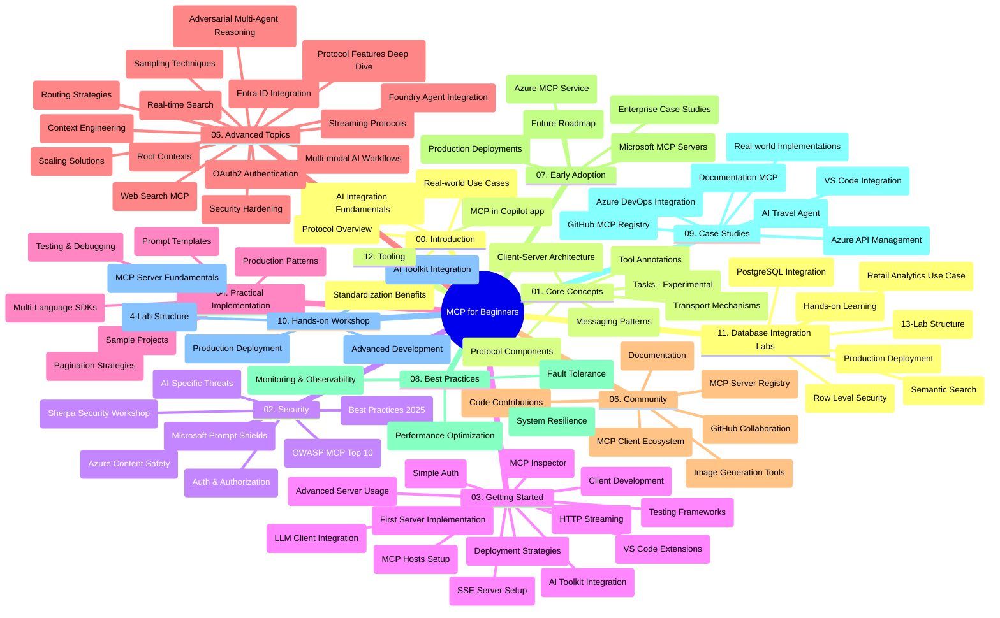

# ماڈل کانٹیکسٹ پروٹوکول (MCP) برائے مبتدی - مطالعہ گائیڈ

یہ مطالعہ گائیڈ "ماڈل کانٹیکسٹ پروٹوکول (MCP) برائے مبتدی" نصاب کے لیے ریپوزٹری کے ڈھانچے اور مواد کا جائزہ فراہم کرتا ہے۔ اس گائیڈ کو استعمال کرتے ہوئے ریپوزٹری میں مؤثر طریقے سے نیویگیٹ کریں اور دستیاب وسائل سے زیادہ سے زیادہ فائدہ اٹھائیں۔

## ریپوزٹری کا جائزہ

ماڈل کانٹیکسٹ پروٹوکول (MCP) اے آئی ماڈلز اور کلائنٹ ایپلیکیشنز کے درمیان تعاملات کے لیے ایک معیاری فریم ورک ہے۔ ابتدا میں Anthropic نے اسے تخلیق کیا تھا، MCP اب وسیع MCP کمیونٹی کے ذریعہ آفیشل GitHub آرگنائزیشن کے ذریعے مأںٹین کیا جاتا ہے۔ یہ ریپوزٹری C#، جاوا، جاوا اسکرپٹ، پائتھن، اور ٹائپ اسکرپٹ میں عملی کوڈ کی مثالوں کے ساتھ ایک جامع نصاب فراہم کرتی ہے، جو AI ڈویلپرز، سسٹم آرکیٹیکٹس، اور سافٹ ویئر انجینئرز کے لیے ڈیزائن کیا گیا ہے۔

## بصری نصابی نقشہ

## ریپوزٹری کا ڈھانچہ

ریپوزٹری بارہ اہم حصوں میں منظم ہے، ہر ایک MCP کے مختلف پہلوؤں پر توجہ مرکوز کرتا ہے:

1. **تعارف (00-Introduction/)**
   - ماڈل کانٹیکسٹ پروٹوکول کا جائزہ
   - AI پائپ لائنز میں معیاری بنانے کی اہمیت
   - عملی استعمال کے کیسز اور فوائد

2. **بنیادی تصورات (01-CoreConcepts/)**
   - کلائنٹ-سرور آرکیٹیکچر
   - کلیدی پروٹوکول اجزاء
   - MCP میں پیغام رسانی کے پیٹرنز
   - مستقبل کی جھلک: [MCP میں کیا تبدیل ہو رہا ہے: 2026-07-28 ریلیز کینڈیڈیٹ](./01-CoreConcepts/mcp-2026-07-28-release-candidate.md) — اسٹیٹ لیس پروٹوکول کور، ایکسٹینشنز فریم ورک، اور آنے والی وضاحت ورژن میں Roots/Sampling/Logging کی متوقع کمی

3. **سیکیورٹی (02-Security/)**
   - MCP مبنی نظاموں میں سیکیورٹی خطرات
   - نفاذ کو محفوظ بنانے کے بہترین طریقے
   - تصدیق اور اجازت کے حکمت عملی
   - **جامع سیکیورٹی دستاویزات**:
     - MCP سیکیورٹی بہترین طریقے 2025
     - Azure مواد کی حفاظت کے نفاذ کی گائیڈ
     - MCP سیکیورٹی کنٹرولز اور تکنیکس
     - MCP بہترین طریقے فوری حوالہ
   - **اہم سیکیورٹی موضوعات**:
     - پرامپٹ انجیکشن اور ٹول زہر آلود حملے
     - سیشن ہای جیکنگ اور مغالطہ ڈپٹی مسائل
     - ٹوکن پاس تھرو کی کمزوریاں
     - ضرورت سے زیادہ اجازتیں اور رسائی کنٹرول
     - AI اجزاء کے لیے سپلائی چین سیکیورٹی
     - مائیکروسافٹ پرامپٹ شیلڈز انٹیگریشن

4. **شروع کرنا (03-GettingStarted/)**
   - ماحول کی ترتیب اور کنفیگریشن
   - بنیادی MCP سرور اور کلائنٹ بنانا
   - موجودہ ایپلیکیشنز کے ساتھ انٹیگریشن
   - شامل سیکشنز:
     - پہلا سرور نفاذ
     - کلائنٹ ترقی
     - LLM کلائنٹ انٹیگریشن
     - VS کوڈ انٹیگریشن
     - سرور-سینٹ ایونٹس (SSE) سرور
     - جدید سرور استعمال
     - HTTP سٹریمنگ
     - AI ٹول کٹ انٹیگریشن
     - جانچنے کی حکمت عملی
     - تعیناتی کے رہنما اصول

5. **عملی نفاذ (04-PracticalImplementation/)**
   - مختلف پروگرامنگ زبانوں میں SDKs کا استعمال
   - ڈیبگنگ، جانچ، اور تصدیق کی تکنیکس
   - قابلِ استعمال پرامپٹ ٹیمپلیٹس اور ورک فلو تیار کرنا
   - نفاذ کی مثالوں کے ساتھ نمونہ منصوبے

6. **جدید موضوعات (05-AdvancedTopics/)**
   - کانٹیکسٹ انجینئرنگ تکنیکس
   - فاؤنڈری ایجنٹ انٹیگریشن
   - کثیر النوع AI ورک فلو
   - OAuth2 تصدیق کے مظاہرے
   - حقیقی وقت کی تلاش کی صلاحیتیں
   - حقیقی وقت کی سٹریمنگ
   - روٹ کانٹیکسٹس کا نفاذ
   - روٹنگ حکمت عملی
   - سیمپلنگ تکنیکس
   - اسکیلنگ طریقے
   - سیکیورٹی تحفظات
   - Entra ID سیکیورٹی انٹیگریشن
   - ویب سرچ انٹیگریشن
   - مخالف کثیر ایجنٹ استدلال (ڈبیٹ پیٹرنز)

7. **کمیونٹی تعاون (06-CommunityContributions/)**
   - کوڈ اور دستاویزات میں تعاون کیسے کریں
   - GitHub کے ذریعے تعاون کرنا
   - کمیونٹی کی جانب سے بہتریاں اور تاثرات
   - مختلف MCP کلائنٹس کا استعمال (Claude ڈیسک ٹاپ، Cline، VSCode)
   - مقبول MCP سرورز کے ساتھ کام کرنا بشمول امیج جنریشن

8. **ابتدائی اپنانے سے سبق (07-LessonsfromEarlyAdoption/)**
   - حقیقی دنیا کی تعمیل اور کامیابی کی کہانیاں
   - MCP مبنی حل کی تعمیر اور تعیناتی
   - رجحانات اور مستقبل کا روڈ میپ
   - **مائیکروسافٹ MCP سرورز گائیڈ**: 10 پروڈکشن-ریڈی مائیکروسافٹ MCP سرورز کا جامع گائیڈ بشمول:
     - Microsoft Learn Docs MCP Server
     - Azure MCP Server (15+ خصوصی کنیکٹرز)
     - GitHub MCP Server
     - Azure DevOps MCP Server
     - MarkItDown MCP Server
     - SQL Server MCP Server
     - Playwright MCP Server
     - Dev Box MCP Server
     - Microsoft Foundry MCP Server
     - Microsoft 365 Agents Toolkit MCP Server

9. **بہترین طریقے (08-BestPractices/)**
   - کارکردگی کی بہتری اور اصلاح
   - فالٹ-ٹولرینٹ MCP سسٹمز کی ڈیزائننگ
   - جانچ اور قوت برداشت کی حکمت عملی

10. **کیس اسٹڈیز (09-CaseStudy/)**
    - **سات جامع کیس اسٹڈیز** جو MCP کی کثیر الجہتی ظاہر کرتی ہیں:
    - **Azure AI ٹریول ایجنٹس**: Azure OpenAI اور AI سرچ کے ساتھ کثیر ایجنٹ آرکیسٹریشن
    - **Azure DevOps انٹیگریشن**: یوٹیوب ڈیٹا اپڈیٹس کے ساتھ ورک فلو خودکار بنانا
    - **حقیقی وقت دستاویز کی بازیافت**: پائتھن کنسول کلائنٹ کے ساتھ HTTP سٹریمنگ
    - **تفاعلی مطالعہ منصوبہ جنریٹر**: Chainlit ویب ایپ کے ساتھ گفتگویی AI
    - **ان ایڈیٹر دستاویزات**: VS کوڈ انٹیگریشن کے ساتھ GitHub Copilot ورک فلو
    - **Azure API مینجمنٹ**: مائیکروسافٹ MCP سرور تخلیق کے ساتھ انٹرپرائز API انٹیگریشن
    - **GitHub MCP رجسٹری**: ایکو سسٹم کی ترقی اور ایجنٹیک انٹیگریشن پلیٹ فارم
    - انٹرپرائز انٹیگریشن، ڈویلپر کی پیداواریت، اور ایکو سسٹم کی ترقی پر پھیلے ہوئے نفاذ کی مثالیں

11. **عملی ورکشاپ (10-StreamliningAIWorkflowsBuildingAnMCPServerWithAIToolkit/)**
    - MCP کو AI ٹول کٹ کے ساتھ جوڑنے والی جامع عملی ورکشاپ
    - ذہین ایپلیکیشنز بنانا جو AI ماڈلز کو حقیقی دنیا کے اوزاروں سے ملاتی ہیں
    - بنیادیات، کسٹم سرور ترقی، اور پیداوار تعیناتی حکمت عملیوں پر عملی ماڈیولز
    - **لیب کا ڈھانچہ**:
      - لیب 1: MCP سرور کے بنیادی اصول
      - لیب 2: جدید MCP سرور کی ترقی
      - لیب 3: AI ٹول کٹ انٹیگریشن
      - لیب 4: پیداوار کی تعیناتی اور اسکیلنگ
    - قدم بہ قدم ہدایات کے ساتھ لیب پر مبنی سیکھنے کا طریقہ

12. **MCP سرور ڈیٹا بیس انٹیگریشن لیبس (11-MCPServerHandsOnLabs/)**
    - پیداواری MCP سرورز بنانے کے لیے جامع 13-لیب لرننگ راہ، PostgreSQL انٹیگریشن کے ساتھ
    - **حقیقی دنیا کی ریٹیل انالیٹکس نفاذ** زوا ریٹیل استعمال کے کیس کے ساتھ
    - **انٹرپرائز درجے کے پیٹرنز** بشمول رو لیول سیکیورٹی (RLS)، سیمینٹک سرچ، اور کثیر کرایہ دار ڈیٹا رسائی
    - **مکمل لیب ڈھانچہ**:
      - **لیب 00-03: بنیادیات** - تعارف، آرکیٹیکچر، سیکیورٹی، ماحول کی ترتیب
      - **لیب 04-06: MCP سرور کی تعمیر** - ڈیٹا بیس ڈیزائن، MCP سرور نفاذ، ٹول کی ترقی
      - **لیب 07-09: جدید خصوصیات** - سیمینٹک سرچ، جانچ اور ڈیبگنگ، VS کوڈ انٹیگریشن

      - **لیب 10-12: پیداوار اور بہترین طریقے** - تنصیب، نگرانی، اصلاح
    - **شامل ٹیکنالوجیز**: FastMCP فریم ورک، PostgreSQL، Azure OpenAI، Azure Container Apps، Application Insights
    - **تعلیمی نتائج**: پیداوار کے لیے تیار MCP سرورز، ڈیٹا بیس انٹیگریشن کے نمونے، AI کی مدد سے تجزیات، انٹرپرائز سیکیورٹی

13. **ٹولنگ (12-tooling/)**
    - سیکھیں کہ کیسے MCP کو کوپائلٹ ایپ اور دیگر ٹولز میں استعمال کیا جائے

## اضافی وسائل

ذخیرہ میں معاون وسائل شامل ہیں:

- **تصاویر کا فولڈر**: نصاب میں استعمال ہونے والے خاکے اور تصویریں شامل ہیں
- **ترجمے**: دستاویزات کے خودکار ترجموں کے ساتھ کثیراللسانی تعاون
- **سرکاری MCP وسائل**:
  - [MCP دستاویزات](https://modelcontextprotocol.io/)
  - [MCP وضاحت](https://spec.modelcontextprotocol.io/)
  - [MCP گٹہب ذخیرہ](https://github.com/modelcontextprotocol)

## اس ذخیرہ کا استعمال کیسے کریں

1. **ترتیب وار سیکھنا**: منظم تعلیمی تجربے کے لیے ابواب کو ترتیب سے (00 سے 11 تک) پڑھیں۔
2. **زبان خاص توجہ**: اگر آپ کسی خاص پروگرامنگ زبان میں دلچسپی رکھتے ہیں تو اپنی پسندیدہ زبان میں نمونہ جات کے فولڈرز کو دیکھیں۔
3. **عملی نفاذ**: "شروع کرنا" سیکشن سے آغاز کریں تاکہ اپنا ماحول ترتیب دیں اور اپنا پہلا MCP سرور اور کلائنٹ تیار کریں۔
4. **اعلی درجے کی تحقیق**: جب آپ بنیادی امور میں ماہر ہو جائیں تو جدید موضوعات میں غوطہ لگائیں تاکہ علم میں اضافہ ہو۔
5. **کمیونٹی کی شرکت**: MCP کمیونٹی میں شامل ہوں، گٹ ہب مباحثوں اور ڈسکارڈ چینلز کے ذریعے ماہرین اور ساتھی ڈیولپرز سے جڑیں۔

## MCP کلائنٹس اور ٹولز

نصاب میں مختلف MCP کلائنٹس اور ٹولز شامل ہیں:

1. **سرکاری کلائنٹس**:
   - Visual Studio Code 
   - Visual Studio Code میں MCP
   - Claude ڈیسک ٹاپ
   - VSCode میں Claude
   - Claude API

2. **کمیونٹی کلائنٹس**:
   - Cline (ٹرمینل کی بنیاد پر)
   - Cursor (کوڈ ایڈیٹر)
   - ChatMCP
   - Windsurf

3. **MCP مینجمنٹ ٹولز**:
   - MCP CLI
   - MCP منیجر
   - MCP لنکر
   - MCP روٹر

## معروف MCP سرورز

ذخیرہ مختلف MCP سرورز متعارف کراتا ہے، جن میں شامل ہیں:

1. **سرکاری مائیکروسافٹ MCP سرورز**:
   - Microsoft Learn Docs MCP سرور
   - Azure MCP سرور (15+ خصوصی کنیکٹرز)
   - GitHub MCP سرور
   - Azure DevOps MCP سرور
   - MarkItDown MCP سرور
   - SQL Server MCP سرور
   - Playwright MCP سرور
   - Dev Box MCP سرور
   - Microsoft Foundry MCP سرور
   - Microsoft 365 Agents Toolkit MCP سرور

2. **سرکاری حوالہ سرورز**:
   - فائل سسٹم
   - Fetch
   - میموری
   - تسلسل سوچنا

3. **تصویر سازی**:
   - Azure OpenAI DALL-E 3
   - Stable Diffusion WebUI
   - Replicate

4. **ڈیولپمنٹ ٹولز**:
   - Git MCP
   - ٹرمینل کنٹرول
   - کوڈ اسسٹنٹ

5. **خصوصی سرورز**:
   - Salesforce
   - Microsoft Teams
   - Jira اور Confluence

## تعاون

یہ ذخیرہ کمیونٹی سے تعاون کا خیرمقدم کرتا ہے۔ مؤثر طریقے سے MCP ماحولیاتی نظام میں تعاون کرنے کے لیے کمیونٹی تعاون کے سیکشن کو دیکھیں۔

----

*یہ مطالعہ رہنما آخری بار 5 فروری، 2026 کو اپ ڈیٹ ہوا تھا، جو تازہ ترین MCP وضاحت 2025-11-25 کی عکاسی کرتا ہے اور اس تاریخ کے بحیثیت اس ذخیرہ کا جائزہ فراہم کرتا ہے۔ ذخیرہ کا مواد اس تاریخ کے بعد اپ ڈیٹ ہو سکتا ہے۔*

*ضمیمہ (2 جولائی، 2026): `2026-07-28` MCP وضاحت ریلیز کینڈیڈیٹ پر ایک درس [01-CoreConcepts](./01-CoreConcepts/mcp-2026-07-28-release-candidate.md) کے تحت شامل کیا گیا؛ نصاب کی بنیادی حد 2025-11-25 برقرار ہے جب تک کہ نئی وضاحت جاری نہیں ہوتی۔*

---

<!-- CO-OP TRANSLATOR DISCLAIMER START -->
**ڈس کلیمر**:
یہ دستاویز AI ترجمہ سروس [Co-op Translator](https://github.com/Azure/co-op-translator) کے ذریعے ترجمہ کی گئی ہے۔ جبکہ ہم درستگی کے لیے کوشاں ہیں، براہ کرم اس بات سے آگاہ رہیں کہ خودکار ترجمے میں غلطیاں یا عدم درستیاں ہو سکتی ہیں۔ اصل دستاویز اپنے مادری زبان میں مستند ماخذ سمجھی جائے گی۔ حساس معلومات کے لیے پیشہ ور انسانی ترجمہ کی سفارش کی جاتی ہے۔ اس ترجمے کے استعمال سے پیدا ہونے والی کسی بھی غلط فہمی یا غلط تشریح کی ذمہ داری ہم قبول نہیں کرتے۔
<!-- CO-OP TRANSLATOR DISCLAIMER END -->