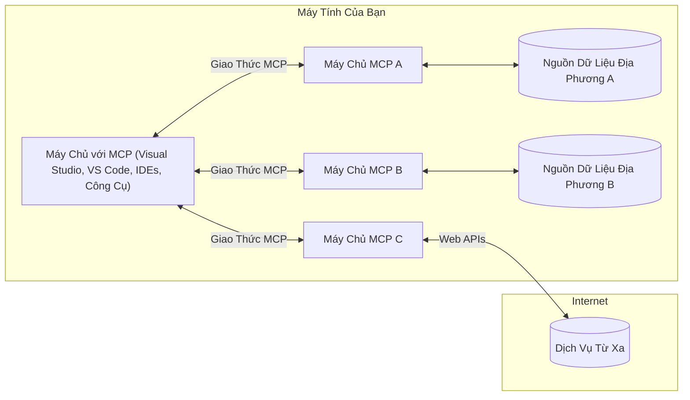

# Khái niệm cốt lõi MCP: Làm chủ Giao thức Ngữ cảnh Mô hình cho Tích hợp AI

[](https://youtu.be/earDzWGtE84)

_(Nhấp vào hình ảnh trên để xem video bài học này)_

[Giao thức Ngữ cảnh Mô hình (MCP)](https://github.com/modelcontextprotocol) là một khuôn khổ tiêu chuẩn hóa mạnh mẽ tối ưu hóa giao tiếp giữa Các Mô hình Ngôn ngữ Lớn (LLMs) và các công cụ, ứng dụng, cũng như nguồn dữ liệu bên ngoài.  
Hướng dẫn này sẽ giúp bạn hiểu các khái niệm cốt lõi của MCP. Bạn sẽ học về kiến trúc client-server, các thành phần thiết yếu, cơ chế giao tiếp và các thực hành triển khai tốt nhất.

- **Sự đồng ý rõ ràng của người dùng**: Mọi truy cập dữ liệu và thao tác đều cần sự chấp thuận rõ ràng của người dùng trước khi thực hiện. Người dùng phải hiểu rõ dữ liệu nào sẽ bị truy cập và các hành động sẽ được thực hiện, cùng với quyền kiểm soát chi tiết về quyền hạn và sự cho phép.

- **Bảo vệ quyền riêng tư dữ liệu**: Dữ liệu người dùng chỉ được lộ ra khi có sự đồng ý rõ ràng và phải được bảo vệ bởi các kiểm soát truy cập mạnh mẽ xuyên suốt vòng đời tương tác. Việc triển khai cần ngăn chặn truyền dữ liệu trái phép và duy trì ranh giới bảo mật nghiêm ngặt.

- **An toàn khi thực thi công cụ**: Mỗi lần gọi công cụ cần có sự đồng ý rõ ràng của người dùng với hiểu biết đầy đủ về chức năng, tham số và tác động tiềm năng của công cụ. Ranh giới bảo mật vững chắc phải ngăn chặn các thao tác công cụ không an toàn, không mong muốn hoặc ác ý.

- **Bảo mật lớp truyền tải**: Tất cả kênh giao tiếp nên sử dụng cơ chế mã hóa và xác thực phù hợp. Các kết nối từ xa cần triển khai giao thức truyền tải an toàn và quản lý thông tin xác thực đúng đắn.

#### Hướng dẫn triển khai:

- **Quản lý quyền hạn**: Triển khai hệ thống quyền hạn chi tiết cho phép người dùng kiểm soát máy chủ, công cụ và tài nguyên được truy cập  
- **Xác thực & Ủy quyền**: Sử dụng các phương pháp xác thực an toàn (OAuth, khóa API) với quản lý token và hết hạn hợp lý  
- **Xác thực đầu vào**: Kiểm tra các tham số và dữ liệu đầu vào theo các sơ đồ đã định nghĩa để ngăn chặn tấn công chèn mã  
- **Ghi log kiểm toán**: Duy trì nhật ký đầy đủ các hoạt động để giám sát an ninh và tuân thủ

## Tổng quan

Bài học này khám phá kiến trúc nền tảng và các thành phần tạo nên hệ sinh thái Giao thức Ngữ cảnh Mô hình (MCP). Bạn sẽ hiểu về kiến trúc client-server, các thành phần chính, và cơ chế giao tiếp vận hành các tương tác MCP.

## Mục tiêu học tập chính

Kết thúc bài học này, bạn sẽ:

- Hiểu kiến trúc client-server của MCP.  
- Xác định vai trò và trách nhiệm của Host, Client, và Server.  
- Phân tích các tính năng cốt lõi khiến MCP là lớp tích hợp linh hoạt.  
- Học cách thông tin chảy trong hệ sinh thái MCP.  
- Nhận kiến thức thực tế qua ví dụ mã trong .NET, Java, Python, và JavaScript.

## Kiến trúc MCP: Cái nhìn sâu hơn

Hệ sinh thái MCP được xây dựng dựa trên mô hình client-server. Cấu trúc mô-đun này cho phép ứng dụng AI tương tác hiệu quả với công cụ, cơ sở dữ liệu, API và tài nguyên ngữ cảnh. Dưới đây là phân tích thành phần kiến trúc cốt lõi.

Về cơ bản, MCP theo kiến trúc client-server nơi ứng dụng chủ (host) có thể kết nối đến nhiều máy chủ:



- **MCP Hosts**: Các chương trình như VSCode, Claude Desktop, IDEs, hoặc công cụ AI muốn truy cập dữ liệu qua MCP  
- **MCP Clients**: Các client giao thức duy trì kết nối 1:1 với server  
- **MCP Servers**: Các chương trình nhẹ cung cấp các khả năng cụ thể qua Giao thức Ngữ cảnh Mô hình tiêu chuẩn  
- **Nguồn dữ liệu cục bộ**: Các tập tin, cơ sở dữ liệu, dịch vụ trên máy tính mà server MCP có thể truy cập an toàn  
- **Dịch vụ từ xa**: Các hệ thống bên ngoài có sẵn qua internet mà server MCP kết nối qua API.

Giao thức MCP là một tiêu chuẩn đang phát triển với phiên bản đánh số theo ngày (định dạng YYYY-MM-DD). Phiên bản hiện tại là **2025-11-25**. Bạn có thể xem cập nhật mới nhất tại [đặc tả giao thức](https://modelcontextprotocol.io/specification/2025-11-25/)

> **Nhìn về phía trước:** bản thử nghiệm phiên bản đặc tả tiếp theo, **2026-07-28**, được công bố vào tháng 5 năm 2026 và dự kiến phát hành ngày 28 tháng 7 năm 2026. Phiên bản này làm cho giao thức bất trạng thái ở lớp truyền tải (loại bỏ bước bắt tay `initialize` và mã session), chính thức hóa khung Mở rộng, và loại bỏ Roots, Sampling, Logging để thay bằng mẫu mới. Xem [Những thay đổi trong MCP: Bản thử nghiệm 2026-07-28](./mcp-2026-07-28-release-candidate.md) để biết chi tiết.

### 1. Hosts

Trong Giao thức Ngữ cảnh Mô hình (MCP), **Hosts** là các ứng dụng AI đóng vai trò giao diện chính mà người dùng tương tác với giao thức. Hosts phối hợp và quản lý các kết nối đến nhiều server MCP bằng cách tạo các client MCP riêng cho mỗi kết nối server. Ví dụ về Hosts bao gồm:

- **Ứng dụng AI**: Claude Desktop, Visual Studio Code, Claude Code  
- **Môi trường phát triển**: IDEs và trình soạn thảo mã với tích hợp MCP  
- **Ứng dụng tùy chỉnh**: Đại lý AI và công cụ xây dựng theo mục đích riêng

**Hosts** là ứng dụng phối hợp các tương tác với mô hình AI. Chúng:

- **Điều phối mô hình AI**: Thực thi hoặc tương tác với LLM để tạo phản hồi và phối hợp luồng công việc AI  
- **Quản lý kết nối client**: Tạo và duy trì một client MCP cho mỗi kết nối server MCP  
- **Kiểm soát giao diện người dùng**: Xử lý luồng hội thoại, tương tác với người dùng, và trình bày phản hồi  
- **Thi hành bảo mật**: Kiểm soát quyền hạn, ràng buộc bảo mật, và xác thực  
- **Xử lý sự đồng ý của người dùng**: Quản lý việc người dùng phê duyệt chia sẻ dữ liệu và thực thi công cụ

### 2. Clients

**Clients** là các thành phần thiết yếu duy trì kết nối một-một chuyên biệt giữa Hosts và server MCP. Mỗi client MCP được host khởi tạo để kết nối một server MCP cụ thể, đảm bảo kênh giao tiếp rõ ràng và bảo mật. Nhiều clients cho phép một host kết nối đến nhiều server đồng thời.

**Clients** là bộ phận kết nối trong ứng dụng host. Chúng:

- **Giao tiếp giao thức**: Gửi yêu cầu JSON-RPC 2.0 tới server kèm prompts và hướng dẫn  
- **Đàm phán tính năng**: Thương lượng các đặc tính hỗ trợ và phiên bản giao thức với server khi khởi tạo  
- **Thực thi công cụ**: Quản lý yêu cầu thực thi công cụ từ mô hình và xử lý phản hồi  
- **Cập nhật thời gian thực**: Xử lý thông báo và cập nhật nhanh từ server  
- **Xử lý phản hồi**: Xử lý và định dạng phản hồi server để hiển thị cho người dùng

### 3. Servers

**Servers** là các chương trình cung cấp ngữ cảnh, công cụ và năng lực cho các client MCP. Chúng có thể chạy cục bộ (trên cùng máy với Host) hoặc từ xa (trên nền tảng bên ngoài), chịu trách nhiệm xử lý yêu cầu client và cung cấp phản hồi có cấu trúc. Servers cung cấp chức năng cụ thể qua Giao thức Ngữ cảnh Mô hình chuẩn hóa.

**Servers** là dịch vụ cung cấp ngữ cảnh và năng lực. Chúng:

- **Đăng ký tính năng**: Đăng ký và cung cấp các thực thể (tài nguyên, prompts, công cụ) cho client  
- **Xử lý yêu cầu**: Nhận và thực thi các gọi công cụ, yêu cầu tài nguyên, và prompts từ client  
- **Cung cấp ngữ cảnh**: Cung cấp thông tin và dữ liệu ngữ cảnh để nâng cao phản hồi mô hình  
- **Quản lý trạng thái**: Duy trì trạng thái phiên và xử lý các tương tác có trạng thái khi cần  
- **Thông báo thời gian thực**: Gửi thông báo về thay đổi tính năng và cập nhật tới client kết nối

Server có thể do bất kỳ ai phát triển để mở rộng năng lực mô hình với chức năng chuyên biệt, hỗ trợ triển khai cục bộ và từ xa.

### 4. Các thực thể Server

Server trong Giao thức Ngữ cảnh Mô hình (MCP) cung cấp ba **thực thể** cốt lõi định nghĩa các khối xây dựng cơ bản cho tương tác phong phú giữa client, host và mô hình ngôn ngữ. Các thực thể này xác định loại thông tin ngữ cảnh và hành động có thể thực hiện qua giao thức.

Server MCP có thể cung cấp tùy kết hợp ba thực thể cốt lõi sau:

#### Tài nguyên

**Tài nguyên** là nguồn dữ liệu cung cấp thông tin ngữ cảnh cho ứng dụng AI. Chúng đại diện cho nội dung tĩnh hoặc động có thể giúp nâng cao sự hiểu biết và quyết định của mô hình:

- **Dữ liệu ngữ cảnh**: Thông tin có cấu trúc và ngữ cảnh dùng cho mô hình AI  
- **Cơ sở tri thức**: Kho tài liệu, bài viết, sách hướng dẫn, và nghiên cứu  
- **Nguồn dữ liệu cục bộ**: Tập tin, cơ sở dữ liệu và thông tin hệ thống địa phương  
- **Dữ liệu bên ngoài**: Phản hồi từ API, dịch vụ web, và dữ liệu hệ thống từ xa  
- **Nội dung động**: Dữ liệu thời gian thực cập nhật theo điều kiện bên ngoài

Tài nguyên được nhận dạng qua URI và hỗ trợ khám phá qua `resources/list` và truy xuất qua `resources/read`:

```text
file://documents/project-spec.md
database://production/users/schema
api://weather/current
```

#### Prompts

**Prompts** là các mẫu tái sử dụng giúp cấu trúc các tương tác với mô hình ngôn ngữ. Chúng cung cấp các mẫu tương tác chuẩn hóa và quy trình làm việc dạng mẫu:

- **Tương tác theo mẫu**: Tin nhắn và khởi đầu hội thoại được cấu trúc sẵn  
- **Mẫu quy trình làm việc**: Chuỗi tiêu chuẩn cho các tác vụ và tương tác phổ biến  
- **Ví dụ ít lần (few-shot)**: Mẫu dựa trên ví dụ để hướng dẫn mô hình  
- **Prompts hệ thống**: Prompts cơ bản xác định hành vi và ngữ cảnh mô hình  
- **Mẫu động**: Prompts có tham số hóa điều chỉnh theo ngữ cảnh cụ thể

Prompts hỗ trợ thay thế biến và có thể được khám phá qua `prompts/list` và truy xuất bằng `prompts/get`:

```markdown
Generate a {{task_type}} for {{product}} targeting {{audience}} with the following requirements: {{requirements}}
```

#### Công cụ

**Công cụ** là các hàm thực thi mà mô hình AI có thể gọi để thực hiện các thao tác cụ thể. Chúng đại diện cho "động từ" trong hệ sinh thái MCP, cho phép mô hình tương tác với hệ thống bên ngoài:

- **Hàm có thể thực thi**: Các thao tác riêng biệt mà mô hình có thể gọi kèm tham số cụ thể  
- **Tích hợp hệ thống bên ngoài**: Gọi API, truy vấn cơ sở dữ liệu, thao tác tập tin, tính toán  
- **Định danh duy nhất**: Mỗi công cụ có tên, mô tả, và sơ đồ tham số riêng biệt  
- **I/O có cấu trúc**: Công cụ nhận tham số đã xác thực và trả về phản hồi có kiểu dữ liệu cụ thể  
- **Năng lực hành động**: Cho phép mô hình thực hiện hành động thực tế và truy xuất dữ liệu sống

Công cụ được định nghĩa bằng JSON Schema để kiểm tra tham số và khám phá qua `tools/list`, thực thi qua `tools/call`. Công cụ còn có thể kèm **biểu tượng** như metadata để cải thiện trình bày giao diện người dùng.

**Chú thích công cụ**: Công cụ hỗ trợ chú thích hành vi (ví dụ, `readOnlyHint`, `destructiveHint`) để mô tả công cụ chỉ đọc hoặc có khả năng gây hại, giúp client đưa ra quyết định thực thi phù hợp.

Ví dụ định nghĩa công cụ:

```typescript
server.tool(
  "search_products", 
  {
    query: z.string().describe("Search query for products"),
    category: z.string().optional().describe("Product category filter"),
    max_results: z.number().default(10).describe("Maximum results to return")
  }, 
  async (params) => {
    // Thực hiện tìm kiếm và trả về kết quả có cấu trúc
    return await productService.search(params);
  }
);
```

## Các thực thể Client

Trong Giao thức Ngữ cảnh Mô hình (MCP), **clients** có thể cung cấp các thực thể cho phép server yêu cầu năng lực bổ sung từ ứng dụng host. Những thực thể phía client này cho phép triển khai server phong phú hơn, tương tác hơn, có khả năng truy cập năng lực mô hình AI và tương tác người dùng.

### Sampling

> **Thông báo ngừng hỗ trợ:** bản thử nghiệm `2026-07-28` đánh dấu Sampling bị ngừng hỗ trợ để ưu tiên tích hợp trực tiếp với API nhà cung cấp LLM. Sampling vẫn hoạt động trong `2025-11-25` và ít nhất một năm sau khi bị ngừng, nhưng thiết kế mới nên ưu tiên mẫu thay thế. Xem [Những thay đổi trong MCP: Bản thử nghiệm 2026-07-28](./mcp-2026-07-28-release-candidate.md).

**Sampling** cho phép server yêu cầu hoàn thành từ mô hình ngôn ngữ trong ứng dụng AI của client. Thực thể này giúp server tiếp cận năng lực LLM mà không cần nhúng SDK hoặc quản lý mô hình riêng:

- **Truy cập độc lập mô hình**: Server có thể yêu cầu hoàn thành mà không cần tích hợp SDK LLM hoặc quản lý mô hình  
- **AI khởi tạo bởi server**: Cho phép server tự động sinh nội dung sử dụng mô hình AI của client  
- **Tương tác LLM đệ quy**: Hỗ trợ kịch bản phức tạp khi server cần trợ giúp AI để xử lý  
- **Tạo nội dung động**: Server tạo phản hồi ngữ cảnh bằng mô hình của host  
- **Hỗ trợ gọi công cụ**: Server có thể bao gồm tham số `tools` và `toolChoice` để mô hình client gọi công cụ trong quá trình sampling

Sampling được khởi tạo qua phương thức `sampling/complete`, nơi server gửi yêu cầu hoàn thành đến client.

### Roots

> **Thông báo ngừng hỗ trợ:** bản thử nghiệm `2026-07-28` đánh dấu Roots bị ngừng hỗ trợ để ưu tiên tham số công cụ, URI tài nguyên, hoặc cấu hình server. Roots vẫn hoạt động trong `2025-11-25` và ít nhất một năm sau khi bị ngừng. Xem [Những thay đổi trong MCP: Bản thử nghiệm 2026-07-28](./mcp-2026-07-28-release-candidate.md).

**Roots** cung cấp cách chuẩn hóa để client công bố giới hạn hệ thống tập tin cho server, giúp server hiểu thư mục và tập tin mà chúng được phép truy cập:

- **Giới hạn hệ thống tập tin**: Xác định ranh giới hoạt động của server trong hệ thống tập tin  
- **Kiểm soát truy cập**: Giúp server biết thư mục và tập tin nào có thể truy cập  
- **Cập nhật động**: Client có thể thông báo server khi danh sách roots thay đổi  
- **Nhận dạng theo URI**: Roots sử dụng URI bắt đầu bằng `file://` để xác định thư mục và tập tin có thể truy cập

Roots được khám phá qua phương thức `roots/list`, client gửi `notifications/roots/list_changed` khi roots thay đổi.

### Elicitation  

**Elicitation** cho phép server yêu cầu thêm thông tin hoặc xác nhận từ người dùng qua giao diện client:

- **Yêu cầu nhập liệu người dùng**: Server có thể hỏi thêm thông tin cần thiết để thực thi công cụ  
- **Hộp thoại xác nhận**: Yêu cầu sự chấp thuận từ người dùng cho các thao tác nhạy cảm hoặc tác động lớn  
- **Luồng làm việc tương tác**: Cho phép server tạo tương tác từng bước với người dùng  
- **Thu thập tham số động**: Thu thập tham số thiếu hoặc tùy chọn trong quá trình thực thi công cụ

Yêu cầu elicitation được gửi bằng phương thức `elicitation/request` để thu thập thông tin người dùng qua giao diện client.

**Elicitation chế độ URL**: Server cũng có thể yêu cầu tương tác người dùng qua URL, cho phép dẫn người dùng tới trang web bên ngoài để xác thực, xác nhận, hoặc nhập dữ liệu.

### Logging
> **Thông báo ngừng hỗ trợ:** phiên bản ứng viên phát hành `2026-07-28` đánh dấu Logging là tính năng bị ngừng hỗ trợ, thay vào đó sử dụng `stderr` cho các giao thức stdio và OpenTelemetry cho khả năng quan sát có cấu trúc. Tính năng Logging vẫn hoạt động trong phiên bản `2025-11-25` và ít nhất là một năm sau bất kỳ thông báo ngừng hỗ trợ nào. Xem [Những thay đổi trong MCP: Phiên bản ứng viên phát hành 2026-07-28](./mcp-2026-07-28-release-candidate.md).

**Logging** cho phép các máy chủ gửi thông điệp nhật ký có cấu trúc đến các khách hàng để phục vụ việc gỡ lỗi, giám sát và quan sát vận hành:

- **Hỗ trợ Gỡ lỗi**: Cho phép máy chủ cung cấp các nhật ký thực thi chi tiết để xử lý sự cố
- **Giám sát Vận hành**: Gửi cập nhật trạng thái và số liệu hiệu năng đến khách hàng
- **Báo cáo Lỗi**: Cung cấp ngữ cảnh lỗi chi tiết và thông tin chẩn đoán
- **Lưu vết Kiểm toán**: Tạo nhật ký toàn diện về các hoạt động và quyết định của máy chủ

Các thông điệp Logging được gửi đến khách hàng để cung cấp tính minh bạch vào hoạt động của máy chủ và hỗ trợ việc gỡ lỗi.

## Luồng Thông tin trong MCP

Giao thức Ngữ cảnh Mô hình (Model Context Protocol - MCP) định nghĩa một luồng thông tin có cấu trúc giữa host, client, server và mô hình. Hiểu luồng này giúp làm rõ cách yêu cầu người dùng được xử lý và cách các công cụ cũng như dữ liệu bên ngoài được tích hợp vào phản hồi của mô hình.

- **Host Khởi tạo Kết nối**  
  Ứng dụng host (như IDE hoặc giao diện chat) thiết lập kết nối tới máy chủ MCP, thường qua STDIO, WebSocket hoặc một giao thức vận chuyển được hỗ trợ khác.

- **Đàm phán Khả năng**  
  Khách hàng (nhúng trong host) và máy chủ trao đổi thông tin về các tính năng, công cụ, tài nguyên và phiên bản giao thức được hỗ trợ. Điều này đảm bảo cả hai bên hiểu các khả năng sẵn có cho phiên làm việc.

- **Yêu cầu Người dùng**  
  Người dùng tương tác với host (ví dụ, nhập prompt hoặc lệnh). Host thu thập dữ liệu đầu vào này và chuyển nó cho khách hàng để xử lý.

- **Sử dụng Tài nguyên hoặc Công cụ**  
  - Khách hàng có thể yêu cầu thêm ngữ cảnh hoặc tài nguyên từ máy chủ (như file, mục cơ sở dữ liệu, hoặc bài viết cơ sở kiến thức) để làm giàu hiểu biết của mô hình.  
  - Nếu mô hình xác định cần một công cụ (ví dụ để lấy dữ liệu, thực hiện phép tính, hoặc gọi API), khách hàng gửi yêu cầu gọi công cụ đến máy chủ, chỉ định tên công cụ và tham số.

- **Thực thi bởi Máy chủ**  
  Máy chủ nhận yêu cầu tài nguyên hoặc công cụ, thực hiện các thao tác cần thiết (như chạy hàm, truy vấn cơ sở dữ liệu, hoặc lấy file) và trả về kết quả cho khách hàng dưới định dạng có cấu trúc.

- **Tạo Phản hồi**  
  Khách hàng tích hợp các phản hồi từ máy chủ (dữ liệu tài nguyên, kết quả công cụ, ...) vào tương tác mô hình đang diễn ra. Mô hình sử dụng thông tin này để tạo ra phản hồi toàn diện và phù hợp ngữ cảnh.

- **Trình bày Kết quả**  
  Host nhận kết quả cuối cùng từ khách hàng và hiển thị cho người dùng, thường bao gồm cả văn bản mô hình tạo ra và bất kỳ kết quả nào từ việc chạy công cụ hoặc tra cứu tài nguyên.

Luồng này cho phép MCP hỗ trợ các ứng dụng AI tiên tiến, tương tác linh hoạt, và am hiểu ngữ cảnh bằng cách kết nối mượt mà các mô hình với công cụ và nguồn dữ liệu bên ngoài.

## Kiến trúc & Các Lớp Giao Thức

MCP bao gồm hai lớp kiến trúc riêng biệt hoạt động cùng nhau để cung cấp một khung giao tiếp hoàn chỉnh:

### Lớp Dữ liệu

**Lớp Dữ liệu** thực hiện giao thức MCP cốt lõi sử dụng **JSON-RPC 2.0** làm nền tảng. Lớp này định nghĩa cấu trúc thông điệp, ngữ nghĩa và mô hình tương tác:

#### Thành phần chính:

- **Giao thức JSON-RPC 2.0**: Tất cả giao tiếp sử dụng định dạng thông điệp JSON-RPC 2.0 chuẩn hóa cho các cuộc gọi phương thức, phản hồi và thông báo  
- **Quản lý Vòng đời**: Xử lý khởi tạo kết nối, đàm phán khả năng và kết thúc phiên giữa khách hàng và máy chủ  
- **Nguyên thủy Máy chủ**: Cho phép máy chủ cung cấp chức năng lõi thông qua công cụ, tài nguyên và prompt  
- **Nguyên thủy Khách hàng**: Cho phép máy chủ yêu cầu lấy mẫu từ LLM, thu thập đầu vào người dùng và gửi thông điệp nhật ký  
- **Thông báo Thời gian thực**: Hỗ trợ thông báo không đồng bộ cho cập nhật động mà không cần polling

#### Tính năng chính:

- **Đàm phán Phiên bản Giao thức**: Sử dụng định dạng phiên bản theo ngày (YYYY-MM-DD) để đảm bảo tương thích  
- **Khám phá Khả năng**: Khách hàng và máy chủ trao đổi thông tin về các tính năng hỗ trợ trong quá trình khởi tạo  
- **Phiên có Trạng thái**: Duy trì trạng thái kết nối qua nhiều tương tác để liên tục ngữ cảnh

### Lớp Vận chuyển

**Lớp Vận chuyển** quản lý kênh giao tiếp, đóng gói thông điệp và xác thực giữa các thành phần MCP:

#### Các cơ chế vận chuyển được hỗ trợ:

1. **Vận chuyển STDIO**:  
   - Sử dụng luồng nhập/xuất tiêu chuẩn cho giao tiếp trực tiếp giữa các tiến trình  
   - Tối ưu cho các tiến trình cục bộ trên cùng một máy không tốn chi phí mạng  
   - Thường được dùng cho triển khai máy chủ MCP cục bộ

2. **Vận chuyển HTTP Đa luồng**:  
   - Sử dụng HTTP POST để gửi thông điệp từ khách hàng đến máy chủ  
   - Tùy chọn sử dụng Server-Sent Events (SSE) để truyền dữ liệu từ máy chủ về khách hàng  
   - Cho phép giao tiếp máy chủ từ xa qua mạng  
   - Hỗ trợ xác thực HTTP tiêu chuẩn (token bearer, khóa API, header tùy chỉnh)  
   - MCP khuyến nghị OAuth cho việc xác thực dựa trên token bảo mật

#### Trừu tượng Vận chuyển:

Lớp vận chuyển trừu tượng hóa chi tiết giao tiếp khỏi lớp dữ liệu, cho phép dùng cùng định dạng thông điệp JSON-RPC 2.0 trên tất cả cơ chế vận chuyển. Trừu tượng này giúp ứng dụng dễ dàng chuyển đổi giữa máy chủ cục bộ và máy chủ từ xa mượt mà.

### Các Cân nhắc Bảo mật

Triển khai MCP phải tuân thủ nhiều nguyên tắc bảo mật quan trọng nhằm đảm bảo các tương tác trên toàn bộ giao thức an toàn, đáng tin cậy và bảo mật:

- **Sự Đồng ý và Kiểm soát của Người dùng**: Người dùng phải cung cấp sự đồng ý rõ ràng trước khi dữ liệu được truy cập hoặc thao tác được thực hiện. Họ nên có quyền kiểm soát rõ ràng những dữ liệu được chia sẻ và hành động nào được phép, được hỗ trợ bởi giao diện trực quan để xem xét và phê duyệt các hoạt động.

- **Bảo mật Dữ liệu**: Dữ liệu người dùng chỉ được tiết lộ khi có sự đồng ý rõ ràng và phải được bảo vệ bằng các kiểm soát truy cập phù hợp. Triển khai MCP phải ngăn chặn truyền dữ liệu trái phép và đảm bảo quyền riêng tư được duy trì xuyên suốt các tương tác.

- **An toàn Công cụ**: Trước khi gọi công cụ nào, phải có sự đồng ý rõ ràng của người dùng. Người dùng cần hiểu rõ chức năng của từng công cụ và phải thực thi các giới hạn bảo mật nghiêm ngặt để ngăn chặn việc thực thi công cụ không an toàn hoặc ngoài dự kiến.

Bằng việc tuân thủ các nguyên tắc bảo mật này, MCP bảo đảm sự tin tưởng, quyền riêng tư và an toàn của người dùng được duy trì trong tất cả tương tác giao thức đồng thời cho phép tích hợp AI mạnh mẽ.

## Ví dụ Mã nguồn: Các Thành phần Chính

Dưới đây là ví dụ mã nguồn trong một số ngôn ngữ lập trình phổ biến minh họa cách triển khai các thành phần quan trọng của máy chủ MCP và công cụ.

### Ví dụ .NET: Tạo máy chủ MCP đơn giản với công cụ

Ví dụ mã .NET thực tiễn dưới đây minh họa cách triển khai máy chủ MCP đơn giản với các công cụ tùy chỉnh. Ví dụ này trình bày cách định nghĩa và đăng ký công cụ, xử lý yêu cầu, và kết nối máy chủ sử dụng Giao thức Ngữ cảnh Mô hình.

```csharp
using System;
using System.Threading.Tasks;
using ModelContextProtocol.Server;
using ModelContextProtocol.Server.Transport;
using ModelContextProtocol.Server.Tools;

public class WeatherServer
{
    public static async Task Main(string[] args)
    {
        // Create an MCP server
        var server = new McpServer(
            name: "Weather MCP Server",
            version: "1.0.0"
        );
        
        // Register our custom weather tool
        server.AddTool<string, WeatherData>("weatherTool", 
            description: "Gets current weather for a location",
            execute: async (location) => {
                // Call weather API (simplified)
                var weatherData = await GetWeatherDataAsync(location);
                return weatherData;
            });
        
        // Connect the server using stdio transport
        var transport = new StdioServerTransport();
        await server.ConnectAsync(transport);
        
        Console.WriteLine("Weather MCP Server started");
        
        // Keep the server running until process is terminated
        await Task.Delay(-1);
    }
    
    private static async Task<WeatherData> GetWeatherDataAsync(string location)
    {
        // This would normally call a weather API
        // Simplified for demonstration
        await Task.Delay(100); // Simulate API call
        return new WeatherData { 
            Temperature = 72.5,
            Conditions = "Sunny",
            Location = location
        };
    }
}

public class WeatherData
{
    public double Temperature { get; set; }
    public string Conditions { get; set; }
    public string Location { get; set; }
}
```

### Ví dụ Java: Các thành phần máy chủ MCP

Ví dụ này trình bày cùng một máy chủ MCP và đăng ký công cụ như ví dụ .NET phía trên, nhưng được triển khai bằng Java.

```java
import io.modelcontextprotocol.server.McpServer;
import io.modelcontextprotocol.server.McpToolDefinition;
import io.modelcontextprotocol.server.transport.StdioServerTransport;
import io.modelcontextprotocol.server.tool.ToolExecutionContext;
import io.modelcontextprotocol.server.tool.ToolResponse;

public class WeatherMcpServer {
    public static void main(String[] args) throws Exception {
        // Tạo một máy chủ MCP
        McpServer server = McpServer.builder()
            .name("Weather MCP Server")
            .version("1.0.0")
            .build();
            
        // Đăng ký một công cụ thời tiết
        server.registerTool(McpToolDefinition.builder("weatherTool")
            .description("Gets current weather for a location")
            .parameter("location", String.class)
            .execute((ToolExecutionContext ctx) -> {
                String location = ctx.getParameter("location", String.class);
                
                // Lấy dữ liệu thời tiết (đơn giản hóa)
                WeatherData data = getWeatherData(location);
                
                // Trả về phản hồi đã định dạng
                return ToolResponse.content(
                    String.format("Temperature: %.1f°F, Conditions: %s, Location: %s", 
                    data.getTemperature(), 
                    data.getConditions(), 
                    data.getLocation())
                );
            })
            .build());
        
        // Kết nối máy chủ sử dụng giao thức stdio
        try (StdioServerTransport transport = new StdioServerTransport()) {
            server.connect(transport);
            System.out.println("Weather MCP Server started");
            // Giữ máy chủ chạy cho đến khi quá trình bị kết thúc
            Thread.currentThread().join();
        }
    }
    
    private static WeatherData getWeatherData(String location) {
        // Việc triển khai sẽ gọi một API thời tiết
        // Đơn giản hóa cho mục đích ví dụ
        return new WeatherData(72.5, "Sunny", location);
    }
}

class WeatherData {
    private double temperature;
    private String conditions;
    private String location;
    
    public WeatherData(double temperature, String conditions, String location) {
        this.temperature = temperature;
        this.conditions = conditions;
        this.location = location;
    }
    
    public double getTemperature() {
        return temperature;
    }
    
    public String getConditions() {
        return conditions;
    }
    
    public String getLocation() {
        return location;
    }
}
```

### Ví dụ Python: Xây dựng máy chủ MCP

Ví dụ này sử dụng fastmcp, vui lòng đảm bảo cài đặt trước:

```python
pip install fastmcp
```
Code Sample:

```python
#!/usr/bin/env python3
import asyncio
from fastmcp import FastMCP
from fastmcp.transports.stdio import serve_stdio

# Tạo một máy chủ FastMCP
mcp = FastMCP(
    name="Weather MCP Server",
    version="1.0.0"
)

@mcp.tool()
def get_weather(location: str) -> dict:
    """Gets current weather for a location."""
    return {
        "temperature": 72.5,
        "conditions": "Sunny",
        "location": location
    }

# Phương pháp thay thế sử dụng lớp
class WeatherTools:
    @mcp.tool()
    def forecast(self, location: str, days: int = 1) -> dict:
        """Gets weather forecast for a location for the specified number of days."""
        return {
            "location": location,
            "forecast": [
                {"day": i+1, "temperature": 70 + i, "conditions": "Partly Cloudy"}
                for i in range(days)
            ]
        }

# Đăng ký công cụ lớp
weather_tools = WeatherTools()

# Khởi động máy chủ
if __name__ == "__main__":
    asyncio.run(serve_stdio(mcp))
```

### Ví dụ JavaScript: Tạo máy chủ MCP

Ví dụ này cho thấy cách tạo máy chủ MCP trong JavaScript và cách đăng ký hai công cụ liên quan đến thời tiết.

```javascript
// Sử dụng SDK chính thức của Giao thức Ngữ cảnh Mẫu
import { McpServer } from "@modelcontextprotocol/sdk/server/mcp.js";
import { StdioServerTransport } from "@modelcontextprotocol/sdk/server/stdio.js";
import { z } from "zod"; // Để xác thực tham số

// Tạo một máy chủ MCP
const server = new McpServer({
  name: "Weather MCP Server",
  version: "1.0.0"
});

// Định nghĩa một công cụ dự báo thời tiết
server.tool(
  "weatherTool",
  {
    location: z.string().describe("The location to get weather for")
  },
  async ({ location }) => {
    // Thông thường sẽ gọi API thời tiết
    // Đơn giản hóa để trình diễn
    const weatherData = await getWeatherData(location);
    
    return {
      content: [
        { 
          type: "text", 
          text: `Temperature: ${weatherData.temperature}°F, Conditions: ${weatherData.conditions}, Location: ${weatherData.location}` 
        }
      ]
    };
  }
);

// Định nghĩa một công cụ dự báo
server.tool(
  "forecastTool",
  {
    location: z.string(),
    days: z.number().default(3).describe("Number of days for forecast")
  },
  async ({ location, days }) => {
    // Thông thường sẽ gọi API thời tiết
    // Đơn giản hóa để trình diễn
    const forecast = await getForecastData(location, days);
    
    return {
      content: [
        { 
          type: "text", 
          text: `${days}-day forecast for ${location}: ${JSON.stringify(forecast)}` 
        }
      ]
    };
  }
);

// Các hàm trợ giúp
async function getWeatherData(location) {
  // Mô phỏng cuộc gọi API
  return {
    temperature: 72.5,
    conditions: "Sunny",
    location: location
  };
}

async function getForecastData(location, days) {
  // Mô phỏng cuộc gọi API
  return Array.from({ length: days }, (_, i) => ({
    day: i + 1,
    temperature: 70 + Math.floor(Math.random() * 10),
    conditions: i % 2 === 0 ? "Sunny" : "Partly Cloudy"
  }));
}

// Kết nối máy chủ sử dụng giao thức stdio
const transport = new StdioServerTransport();
server.connect(transport).catch(console.error);

console.log("Weather MCP Server started");
```

Ví dụ JavaScript này minh họa cách tạo máy chủ MCP sử dụng SDK Giao thức Ngữ cảnh Mô hình. Nó cho thấy cách đăng ký hai công cụ có tên `weatherTool` và `forecastTool` và cung cấp chúng cho khách hàng MCP thông qua `StdioServerTransport`.

## Bảo mật và Ủy quyền

MCP bao gồm một số khái niệm và cơ chế tích hợp để quản lý bảo mật và ủy quyền xuyên suốt giao thức:

1. **Kiểm soát Quyền Công cụ**:  
  Khách hàng có thể chỉ định công cụ nào mô hình được phép sử dụng trong phiên làm việc. Điều này đảm bảo chỉ những công cụ được ủy quyền rõ ràng mới có thể truy cập, giảm thiểu rủi ro thao tác không mong muốn hoặc không an toàn. Quyền có thể được cấu hình linh hoạt dựa trên sở thích người dùng, chính sách tổ chức, hoặc ngữ cảnh tương tác.

2. **Xác thực**:  
  Máy chủ có thể yêu cầu xác thực trước khi cho phép truy cập công cụ, tài nguyên hoặc thao tác nhạy cảm. Điều này có thể bao gồm khóa API, token OAuth hoặc các phương thức xác thực khác. Xác thực đúng cách đảm bảo chỉ khách hàng và người dùng đáng tin cậy mới được kích hoạt các khả năng phía máy chủ.

3. **Kiểm tra**:  
  Kiểm tra tham số được thực thi đối với tất cả các yêu cầu gọi công cụ. Mỗi công cụ định nghĩa kiểu dữ liệu, định dạng và ràng buộc mong đợi cho tham số, và máy chủ xác nhận các yêu cầu tới tương ứng. Điều này ngăn đầu vào không hợp lệ hoặc có thể gây hại đến các triển khai công cụ và duy trì tính toàn vẹn thực thi.

4. **Giới hạn Tốc độ**:  
  Để ngăn ngừa lạm dụng và đảm bảo sử dụng công bằng tài nguyên máy chủ, MCP có thể áp dụng giới hạn tốc độ cho các cuộc gọi công cụ và truy cập tài nguyên. Giới hạn có thể áp dụng theo người dùng, phiên làm việc hoặc toàn hệ thống, giúp bảo vệ khỏi các cuộc tấn công từ chối dịch vụ hoặc việc tiêu thụ tài nguyên quá mức.

Bằng cách kết hợp các cơ chế trên, MCP tạo nền tảng an toàn cho việc tích hợp mô hình ngôn ngữ với công cụ và nguồn dữ liệu bên ngoài, đồng thời cung cấp cho người dùng và nhà phát triển quyền kiểm soát chi tiết về truy cập và sử dụng.

## Thông điệp Giao thức & Luồng Giao tiếp

Giao tiếp MCP sử dụng thông điệp **JSON-RPC 2.0** có cấu trúc giúp tương tác rõ ràng và đáng tin cậy giữa host, khách hàng và máy chủ. Giao thức định nghĩa các mẫu thông điệp cụ thể cho các loại thao tác khác nhau:

### Các loại thông điệp cốt lõi:

#### **Thông điệp Khởi tạo**  
- **Yêu cầu `initialize`**: Thiết lập kết nối và đàm phán phiên bản giao thức cùng khả năng  
- **Phản hồi `initialize`**: Xác nhận các tính năng hỗ trợ và thông tin máy chủ  
- **`notifications/initialized`**: Báo hiệu khởi tạo hoàn tất và phiên sẵn sàng sử dụng

#### **Thông điệp Khám phá**  
- **Yêu cầu `tools/list`**: Tìm các công cụ sẵn có từ máy chủ  
- **Yêu cầu `resources/list`**: Liệt kê các tài nguyên (nguồn dữ liệu) có sẵn  
- **Yêu cầu `prompts/list`**: Lấy các mẫu prompt có sẵn

#### **Thông điệp Thực thi**  
- **Yêu cầu `tools/call`**: Thực thi một công cụ cụ thể với tham số được cung cấp  
- **Yêu cầu `resources/read`**: Lấy nội dung từ một tài nguyên cụ thể  
- **Yêu cầu `prompts/get`**: Lấy mẫu prompt với tham số tùy chọn

#### **Thông điệp Phía Khách hàng**  
- **Yêu cầu `sampling/complete`**: Máy chủ yêu cầu hoàn thành LLM từ khách hàng  
- **`elicitation/request`**: Máy chủ yêu cầu đầu vào người dùng qua giao diện khách hàng  
- **Thông điệp Logging**: Máy chủ gửi thông điệp nhật ký có cấu trúc đến khách hàng

#### **Thông báo**  
- **`notifications/tools/list_changed`**: Máy chủ thông báo khách hàng về thay đổi công cụ  
- **`notifications/resources/list_changed`**: Máy chủ thông báo khách hàng về thay đổi tài nguyên  
- **`notifications/prompts/list_changed`**: Máy chủ thông báo khách hàng về thay đổi prompt

### Cấu trúc Thông điệp:

Tất cả thông điệp MCP tuân theo định dạng JSON-RPC 2.0 với:  
- **Thông điệp Yêu cầu**: Bao gồm `id`, `method`, và `params` tùy chọn  
- **Thông điệp Phản hồi**: Bao gồm `id` và hoặc `result`, hoặc `error`  
- **Thông báo**: Bao gồm `method` và `params` tùy chọn (không có `id` và không cần phản hồi)

Giao tiếp có cấu trúc này đảm bảo các tương tác đáng tin cậy, có thể theo dõi và mở rộng, hỗ trợ các kịch bản nâng cao như cập nhật thời gian thực, chuỗi công cụ, và xử lý lỗi mạnh mẽ.

### Tác vụ (Thử nghiệm)

> **Nhìn về phía trước:** phiên bản ứng viên phát hành `2026-07-28` sẽ đưa Tác vụ (Tasks) ra khỏi phần lõi thử nghiệm thành phần mở rộng riêng biệt với vòng đời tái thiết kế (`tasks/get`, `tasks/update`, `tasks/cancel`; `tasks/list` sẽ bị loại bỏ). Nếu bạn xây dựng dựa trên API thử nghiệm mô tả dưới đây, hãy lên kế hoạch di chuyển. Xem [Những thay đổi trong MCP: Phiên bản ứng viên phát hành 2026-07-28](./mcp-2026-07-28-release-candidate.md).

**Tác vụ** là một tính năng thử nghiệm cung cấp các bộ đóng gói thực thi bền bỉ cho phép truy xuất kết quả và theo dõi trạng thái chậm trễ đối với các yêu cầu MCP:

- **Hoạt động Chạy lâu**: Theo dõi các phép tính tốn tài nguyên, tự động hóa quy trình làm việc và xử lý theo lô  
- **Kết quả Trì hoãn**: Poll trạng thái tác vụ và nhận kết quả khi thao tác hoàn tất  
- **Theo dõi Trạng thái**: Giám sát tiến trình tác vụ qua các trạng thái vòng đời định nghĩa  
- **Hoạt động Đa bước**: Hỗ trợ các quy trình phức tạp trải dài nhiều tương tác

Tác vụ bao quanh các yêu cầu MCP chuẩn để cho phép mô hình mẫu thực thi không đồng bộ cho các thao tác không thể hoàn thành ngay lập tức.

## Những điểm chính cần ghi nhớ

- **Kiến trúc**: MCP sử dụng kiến trúc client-server, trong đó các host quản lý nhiều kết nối khách hàng đến máy chủ  
- **Các Thành phần**: Hệ sinh thái bao gồm host (ứng dụng AI), khách hàng (kết nối giao thức), và máy chủ (cung cấp khả năng)  
- **Cơ chế Vận chuyển**: Giao tiếp hỗ trợ STDIO (cục bộ) và HTTP đa luồng với SSE tùy chọn (từ xa)  
- **Nguyên thủy Cốt lõi**: Máy chủ phơi bày công cụ (hàm thực thi), tài nguyên (nguồn dữ liệu), và prompt (mẫu)  
- **Nguyên thủy Khách hàng**: Máy chủ có thể yêu cầu lấy mẫu (hoàn thành LLM với hỗ trợ gọi công cụ), thu thập (đầu vào người dùng bao gồm chế độ URL), điểm khởi (ranh giới hệ thống tệp), và Logging từ khách hàng  
- **Tính năng Thử nghiệm**: Tác vụ cung cấp bộ đóng gói thực thi bền bỉ cho các hoạt động chạy lâu  
- **Nền tảng Giao thức**: Xây dựng trên JSON-RPC 2.0 với phiên bản theo ngày (hiện tại: 2025-11-25)  
- **Khả năng Thời gian thực**: Hỗ trợ thông báo cho cập nhật động và đồng bộ thời gian thực  
- **Bảo mật Ưu tiên**: Sự đồng ý rõ ràng của người dùng, bảo vệ quyền riêng tư dữ liệu, và vận chuyển an toàn là yêu cầu cốt lõi

## Bài tập

Thiết kế một công cụ MCP đơn giản sẽ hữu ích trong lĩnh vực của bạn. Xác định:
1. Công cụ đó sẽ được đặt tên là gì  
2. Công cụ sẽ nhận những tham số nào  
3. Công cụ sẽ trả về kết quả ra sao  
4. Mô hình sẽ sử dụng công cụ này như thế nào để giải quyết vấn đề người dùng


---

## Tiếp theo

Tiếp: [Chương 2: Bảo mật](../02-Security/README.md)
Tò mò điều gì sẽ đến sau `2025-11-25`? Đọc [Những Thay Đổi Trong MCP: Phiên Bản Ứng Cử Viên Ngày 28-07-2026](./mcp-2026-07-28-release-candidate.md).

---

<!-- CO-OP TRANSLATOR DISCLAIMER START -->
**Tuyên bố miễn trừ trách nhiệm**:
Tài liệu này đã được dịch bằng dịch vụ dịch thuật AI [Co-op Translator](https://github.com/Azure/co-op-translator). Mặc dù chúng tôi cố gắng đảm bảo độ chính xác, xin lưu ý rằng bản dịch tự động có thể chứa lỗi hoặc sai sót. Tài liệu gốc bằng ngôn ngữ gốc nên được coi là nguồn tin chính thức. Đối với thông tin quan trọng, nên sử dụng dịch vụ dịch thuật chuyên nghiệp bởi con người. Chúng tôi không chịu trách nhiệm về bất kỳ hiểu lầm hoặc giải thích sai nào phát sinh từ việc sử dụng bản dịch này.
<!-- CO-OP TRANSLATOR DISCLAIMER END -->