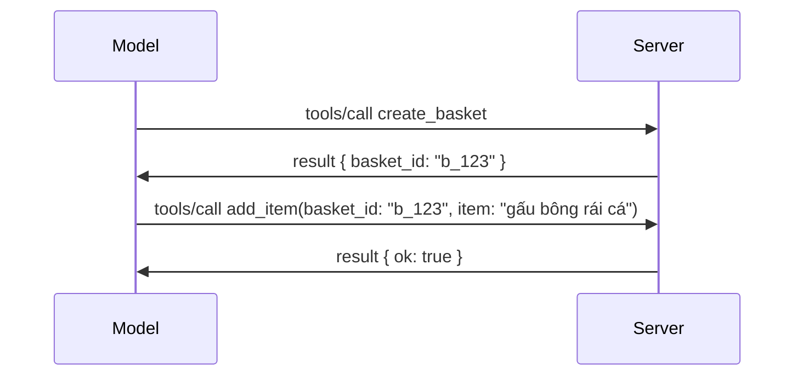

# Những thay đổi trong MCP: Bản Release Candidate ngày 28-07-2026

> **Trạng thái:** Release Candidate. Đặc tả `2026-07-28` chưa hoàn chỉnh tại thời điểm viết. Nó được công bố ngày 21 tháng 5 năm 2026 và dự kiến phát hành ngày 28 tháng 7 năm 2026. Mọi nội dung trong bài học này mô tả release candidate; kiểm tra [bản thảo đặc tả](https://modelcontextprotocol.io/specification/draft) và [nhật ký thay đổi](https://modelcontextprotocol.io/specification/draft/changelog) để biết trạng thái mới nhất trước khi bạn phát triển dựa trên nó. Phần còn lại của chương trình học này được viết dựa trên bản phát hành ổn định hiện tại, **MCP Specification 2025-11-25**, và sẽ được cập nhật khi `2026-07-28` phát hành.

## Tổng Quan

`2026-07-28` là bản sửa đổi lớn nhất của MCP kể từ khi ra mắt. Sáu Đề xuất Nâng cấp Đặc tả (SEP) bỏ bỏ phiên cấp độ giao thức và làm MCP trở thành giao thức không trạng thái ở lớp truyền tải, mở rộng trở thành cơ chế phiên bản chính thức, và một số tính năng bạn đã học trước đó trong chương trình này (Roots, Sampling, Logging) được đánh dấu lỗi thời theo chính sách vòng đời mới. Bài học này tóm tắt những thay đổi, tại sao chúng quan trọng, và ý nghĩa của chúng với mã bạn đã viết trên `2025-11-25`.

Nguồn: [Release Candidate Đặc tả MCP 2026-07-28](https://blog.modelcontextprotocol.io/posts/2026-07-28-release-candidate/) (Blog Model Context Protocol, David Soria Parra và Den Delimarsky).

## Mục Tiêu Học Tập

Sau bài học này, bạn sẽ có thể:

- Giải thích lý do MCP chuyển sang giao thức không trạng thái và vấn đề nó giải quyết cho các triển khai mở rộng theo chiều ngang.
- Mô tả cách thay thế quy trình bắt tay `initialize`/`initialized` và header `Mcp-Session-Id`.
- Nhận biết các header mới `Mcp-Method` và `Mcp-Name` cùng metadata bộ nhớ đệm `ttlMs`/`cacheScope`.
- Nhận diện khung Extensions và hai extensions được phát hành kèm theo: MCP Apps và Tasks.
- Liệt kê sáu SEP ủy quyền làm cứng sự liên kết OAuth 2.0 / OIDC.
- Xác định những tính năng lõi (Roots, Sampling, Logging) hiện được đánh dấu lỗi thời, và ý nghĩa thực tiễn của điều đó.
- Giải thích thay đổi Full JSON Schema 2020-12 cho công cụ `inputSchema`/`outputSchema`.

## Giao thức Không Trạng thái

Thay đổi chính: MCP trở thành giao thức không trạng thái ở lớp giao thức.

### Trước đây (2025-11-25): các phiên khoá bạn với một phiên bản máy chủ

Gọi một công cụ qua Streamable HTTP bắt đầu bằng quy trình bắt tay `initialize`. Máy chủ phản hồi với header `Mcp-Session-Id` mà mọi yêu cầu sau đó phải mang:

```http
POST /mcp HTTP/1.1
Mcp-Session-Id: 1868a90c-3a3f-4f5b
Content-Type: application/json

{"jsonrpc":"2.0","id":2,"method":"tools/call",
 "params":{"name":"search","arguments":{"q":"otters"}}}
```

Vì phiên bị ràng buộc với phiên bản máy chủ phát hành nó, các triển khai mở rộng theo chiều ngang cần **định tuyến dính** tại bộ cân bằng tải và cần một **kho lưu phiên chia sẻ** cho các phiên bản máy chủ.

### Bây giờ (2026-07-28): mỗi yêu cầu là tự chứa

```http
POST /mcp HTTP/1.1
MCP-Protocol-Version: 2026-07-28
Mcp-Method: tools/call
Mcp-Name: search
Content-Type: application/json

{"jsonrpc":"2.0","id":1,"method":"tools/call",
 "params":{"name":"search","arguments":{"q":"otters"},
           "_meta":{"io.modelcontextprotocol/clientInfo":{"name":"my-app","version":"1.0"}}}}
```

Bất kỳ phiên bản máy chủ nào cũng có thể xử lý yêu cầu này. Những thay đổi chính:

- **Quy trình bắt tay `initialize`/`initialized` bị loại bỏ** ([SEP-2575](https://github.com/modelcontextprotocol/modelcontextprotocol/pull/2575)). Phiên bản giao thức, thông tin khách hàng, và khả năng khách hàng chuyển vào `_meta` trên mỗi yêu cầu. Một phương thức mới `server/discover` cho phép khách hàng lấy thông tin khả năng máy chủ khi cần.
- **Header `Mcp-Session-Id` và phiên cấp độ giao thức bị loại bỏ** ([SEP-2567](https://github.com/modelcontextprotocol/modelcontextprotocol/pull/2567)). Định tuyến dính và kho lưu phiên chia sẻ không còn cần thiết ở lớp giao thức.

### Giao thức không trạng thái, ứng dụng có trạng thái

Loại bỏ phiên cấp độ giao thức không có nghĩa là máy chủ của bạn không thể có trạng thái. Mẫu đề xuất giống như APIs HTTP truyền thống: tạo một handle rõ ràng (ví dụ `basket_id`, `browser_id`) từ một cuộc gọi công cụ, và để mô hình truyền handle đó trở lại như một đối số thông thường trong các cuộc gọi tiếp theo.



Điều này làm cho trạng thái được mô hình nhìn thấy và hợp lý thay vì ẩn trong metadata truyền tải, và bất kỳ phiên bản máy chủ nào cũng có thể xử lý cuộc gọi.

### Yêu cầu server đến client, cấu trúc lại

Giao thức không trạng thái vẫn cần cách để máy chủ yêu cầu khách hàng trong quá trình xử lý cuộc gọi (ví dụ, lời nhắc lấy thông tin):

- **Yêu cầu khởi tạo bởi máy chủ chỉ có thể được gửi khi máy chủ đang xử lý yêu cầu khách hàng** ([SEP-2260](https://github.com/modelcontextprotocol/modelcontextprotocol/pull/2260)) — trước đây là khuyến nghị, giờ là bắt buộc. Người dùng không bao giờ bị hỏi bất ngờ.
- **Yêu cầu đa lượt đi** ([SEP-2322](https://github.com/modelcontextprotocol/modelcontextprotocol/pull/2322)) thay thế cho việc giữ kết nối SSE mở. Thay vào đó, máy chủ trả về `InputRequiredResult`:

  ```json
  {
    "resultType": "inputRequired",
    "inputRequests": {
      "confirm": {
        "type": "elicitation",
        "message": "Delete 3 files?",
        "schema": { "type": "boolean" }
      }
    },
    "requestState": "eyJzdGVwIjoxLCJmaWxlcyI6WyJhIiwiYiIsImMiXX0="
  }
  ```

  Khách hàng thu thập câu trả lời và gửi lại cuộc gọi gốc với `inputResponses` cộng `requestState` phản hồi. Mọi phiên bản máy chủ đều có thể xử lý lại vì mọi thứ cần thiết có trong dữ liệu tải.

### Định tuyến được, bộ nhớ đệm được, theo dõi được

Ba thay đổi nhỏ giúp vận hành lưu lượng không trạng thái dễ dàng hơn:

- **Headers `Mcp-Method` và `Mcp-Name` bắt buộc trên Streamable HTTP** ([SEP-2243](https://github.com/modelcontextprotocol/modelcontextprotocol/pull/2243)), cho phép cân bằng tải, gateway, và giới hạn tốc độ định tuyến dựa trên thao tác mà không cần phân tích nội dung JSON. Máy chủ từ chối yêu cầu khi headers và nội dung xung đột.
- **`tools/list` và kết quả đọc tài nguyên mang `ttlMs` và `cacheScope`** ([SEP-2549](https://github.com/modelcontextprotocol/modelcontextprotocol/pull/2549)), mô hình theo HTTP `Cache-Control`. Khách hàng biết danh sách bao lâu thì còn mới và có an toàn chia sẻ cho nhiều người dùng hay không, mà không cần luồng SSE sống lâu để nhận thay đổi.
- **Tài liệu hóa truyền tải ngữ cảnh theo chuẩn W3C Trace Context trong `_meta`** ([SEP-414](https://github.com/modelcontextprotocol/modelcontextprotocol/pull/414)), cố định tên khóa `traceparent`, `tracestate`, và `baggage` để một truy vết phân tán có thể theo dõi cuộc gọi qua SDK khách hàng, máy chủ MCP, và hệ thống hạ nguồn trong backend tương thích [OpenTelemetry](https://opentelemetry.io/).

## Extensions Trở Thành Chính Thức

Extensions đã tồn tại không chính thức trong `2025-11-25`. [SEP-2133](https://github.com/modelcontextprotocol/modelcontextprotocol/pull/2133) chính thức hóa chúng:

- Extensions được nhận diện qua ID theo dạng reverse-DNS.
- Chúng được thương lượng qua bản đồ `extensions` trong khả năng của client và server.
- Chúng sống trong những kho lưu trữ riêng `ext-*` với người duy trì ủy quyền và phiên bản độc lập với đặc tả lõi.
- Quy trình Extensions Track mới cho phép chúng đi từ thử nghiệm đến chính thức trong SEP.

Bản phát hành này kèm theo hai extension chính thức.

### MCP Apps: giao diện người dùng kết xuất trên máy chủ

[MCP Apps](https://blog.modelcontextprotocol.io/posts/2026-01-26-mcp-apps/) ([SEP-1865](https://github.com/modelcontextprotocol/modelcontextprotocol/pull/1865)) cho phép máy chủ phát hành giao diện HTML tương tác mà host kết xuất trong iframe có sandbox. Công cụ khai báo mẫu giao diện UI trước để host có thể tải trước, lưu bộ nhớ đệm, và kiểm tra bảo mật trước khi chạy. Bạn đã học cơ bản về điều này trong [Bài 15: MCP Apps](../03-GettingStarted/15-mcp-apps/README.md) — trong khung Extensions, MCP Apps giờ là extension chính thức thay vì tính năng lõi thử nghiệm.

### Tasks trở thành extension

Tasks phát hành như tính năng lõi thử nghiệm trong `2025-11-25`. Sử dụng thực tế cho thấy cần thiết kế lại để phù hợp nên đúng chỗ của nó là một extension: [Tasks extension](https://github.com/modelcontextprotocol/modelcontextprotocol/pull/2663) tái cấu trúc vòng đời xoay quanh mô hình không trạng thái — máy chủ có thể trả lời `tools/call` bằng một handle tác vụ, và khách hàng điều khiển tiến trình với `tasks/get`, `tasks/update`, và `tasks/cancel`. Tạo tác vụ do máy chủ chỉ định: khách hàng quảng cáo extension, máy chủ quyết định khi nào cuộc gọi chạy dưới dạng tác vụ. Lệnh `tasks/list` bị loại bỏ hoàn toàn vì không thể giới hạn an toàn nếu không có phiên.

> **Ghi chú di cư:** nếu bạn đã triển khai API Tasks thử nghiệm `2025-11-25`, bạn sẽ cần di cư sang vòng đời extension mới — không tương thích ngược.

## Tăng Cường Ủy Quyền

Sáu SEP củng cố [đặc tả ủy quyền](https://modelcontextprotocol.io/specification/draft/basic/authorization) để phù hợp chặt chẽ hơn với triển khai thực tế OAuth 2.0 / OpenID Connect:

| SEP | Thay đổi |
|---|---|
| [SEP-2468](https://github.com/modelcontextprotocol/modelcontextprotocol/pull/2468) | Khách hàng phải xác thực tham số `iss` trong phản hồi ủy quyền theo [RFC 9207](https://www.rfc-editor.org/rfc/rfc9207), giảm thiểu các cuộc tấn công hoán đổi thông tin thường gặp trong kiểu mô hình MCP một khách hàng nhiều máy chủ. Phiên bản tương lai sẽ yêu cầu từ chối phản hồi thiếu `iss`. |
| [SEP-837](https://github.com/modelcontextprotocol/modelcontextprotocol/pull/837) | Khách hàng khai báo loại ứng dụng OpenID Connect `application_type` trong đăng ký khách hàng động, tránh máy chủ ủy quyền gán mặc định client desktop/CLI thành `"web"` và từ chối URI redirect localhost. |
| [SEP-2352](https://github.com/modelcontextprotocol/modelcontextprotocol/pull/2352) | Khách hàng liên kết thông tin đăng ký với `issuer` của máy chủ ủy quyền cấp và đăng ký lại khi tài nguyên di chuyển qua các máy chủ ủy quyền khác nhau. |
| [SEP-2207](https://github.com/modelcontextprotocol/modelcontextprotocol/pull/2207) | Tài liệu cách yêu cầu refresh token từ máy chủ ủy quyền kiểu OpenID Connect. |
| [SEP-2350](https://github.com/modelcontextprotocol/modelcontextprotocol/pull/2350) | Làm rõ việc tích lũy phạm vi trong ủy quyền nâng cao. |
| [SEP-2351](https://github.com/modelcontextprotocol/modelcontextprotocol/pull/2351) | Làm rõ hậu tố khám phá `.well-known`. |

Nếu bạn xây dựng máy chủ ủy quyền MCP ngay hôm nay, hãy bắt đầu cung cấp `iss` trên phản hồi ủy quyền — xem [02-Security](../02-Security/README.md) cho hướng dẫn ủy quyền hiện hành mà điều này sẽ dựa vào.

## Roots, Sampling và Logging Bị Đánh Dấu Lỗi Thời

Theo [chính sách vòng đời tính năng mới](https://github.com/modelcontextprotocol/modelcontextprotocol/pull/2577) ([SEP-2577](https://github.com/modelcontextprotocol/modelcontextprotocol/pull/2577)), ba nguyên thủy lõi client bạn đã học trong [Core Concepts](./README.md#roots) được chuyển sang trạng thái **Deprecated**:

| Tính năng | Thay thế đề xuất |
|---|---|
| Roots | Tham số công cụ, URI tài nguyên hoặc cấu hình máy chủ |
| Sampling | Tích hợp trực tiếp với API nhà cung cấp LLM |
| Logging | `stderr` cho truyền tải stdio; OpenTelemetry cho quan sát cấu trúc |

Đây là **deprecation chỉ mang tính chú thích**: các phương thức, kiểu và cờ khả năng vẫn hoạt động trong bản phát hành này và mọi phiên bản đặc tả phát hành trong vòng một năm. Việc xóa bỏ chúng sẽ cần một SEP riêng theo chính sách vòng đời — nên hiện tại không gây hỏng trong các ví dụ [Sampling](../03-GettingStarted/14-sampling/README.md) của bạn, nhưng máy chủ mới nên ưu tiên các mẫu thay thế ở trên.

## Full JSON Schema 2020-12 cho Công cụ

`inputSchema` và `outputSchema` công cụ được nâng cấp lên đầy đủ [JSON Schema 2020-12](https://json-schema.org/draft/2020-12) ([SEP-2106](https://github.com/modelcontextprotocol/modelcontextprotocol/pull/2106)):

- Input schema vẫn giữ ràng buộc gốc `type: "object"` nhưng giờ cho phép kết hợp (`oneOf`, `anyOf`, `allOf`), điều kiện, và tham chiếu (`$ref`, `$defs`).
- Output schema không giới hạn, và `structuredContent` có thể là bất kỳ giá trị JSON nào thay vì chỉ là đối tượng.
- Các cài đặt thực thi không được tự động phân giải tham chiếu `$ref` URI bên ngoài và nên giới hạn độ sâu schema và thời gian xác thực (để tránh tấn công từ chối dịch vụ nếu xác thực schema phía máy chủ).

Riêng mã lỗi cho tài nguyên thiếu thay đổi từ mã MCP tùy chỉnh `-32002` sang chuẩn JSON-RPC `-32602` (Invalid Params) ([SEP-2164](https://github.com/modelcontextprotocol/modelcontextprotocol/pull/2164)). Nếu client của bạn đối chiếu giá trị literal `-32002`, bạn cần cập nhật.

## Định Hướng Phát Triển Giao Thức Từ Đây

Bản phát hành này chứa các thay đổi phá vỡ tương thích, mà người duy trì MCP không muốn trở thành chuẩn trong tương lai. Ba SEP quản trị nhằm ngăn chặn lặp lại:

- **Chính sách vòng đời tính năng** cho phép mỗi tính năng có lộ trình Active → Deprecated → Removed với ít nhất mười hai tháng giữa giai đoạn deprecated và có thể loại bỏ sớm nhất.
- **Khung Extensions** cho phép các khả năng mới phát hành dưới dạng extension tùy chọn và ổn định tại đó trước khi (nếu có) chuyển vào đặc tả lõi.
- Một SEP theo Tiêu chuẩn Chuẩn không thể đạt trạng thái Cuối cùng cho đến khi một kịch bản phù hợp được đưa vào [bộ kiểm thử tuân thủ](https://github.com/modelcontextprotocol/conformance) ([SEP-2484](https://github.com/modelcontextprotocol/modelcontextprotocol/pull/2484)) — cùng bộ kiểm thử mà [hệ thống cấp bậc SDK](https://github.com/modelcontextprotocol/modelcontextprotocol/pull/1777) đánh giá các SDK chính thức.

## Lịch Phát Hành và Xác Thực

- Ứng viên phát hành đã được khóa vào ngày 21 tháng 5 năm 2026.
- Đặc tả cuối cùng dự kiến phát hành vào ngày 28 tháng 7 năm 2026.
- Khoảng thời gian mười tuần giữa hai mốc cho phép người duy trì SDK và các nhà triển khai khách hàng xác thực các thay đổi với các khối lượng công việc thực tế; Các SDK cấp 1 dự kiến sẽ phát hành hỗ trợ trong khoảng thời gian này theo [hệ thống cấp bậc SDK](https://modelcontextprotocol.io/docs/sdk).
- Theo dõi toàn bộ tập hợp các thay đổi trong [bản thảo đặc tả](https://modelcontextprotocol.io/specification/draft) và [nhật ký thay đổi](https://modelcontextprotocol.io/specification/draft/changelog).

## Ý Nghĩa Cho Khóa Học Này

Mọi thứ bạn đã học cho đến nay trong khóa học này nhắm tới **2025-11-25**, vẫn là đặc tả ổn định hiện tại cho đến khi bản phát hành `2026-07-28` có hiệu lực. Cụ thể:

- **Phiên làm việc và quy trình `initialize` handshake** (đã đề cập trong [Khái niệm Cốt lõi](./README.md) và [Bài học 6: HTTP Streaming](../03-GettingStarted/06-http-streaming/README.md)) vẫn hoạt động như đã mô tả hôm nay, nhưng dự kiến sẽ được thay thế bằng mô hình yêu cầu không trạng thái ở trên khi bạn nâng cấp lên SDK tương thích `2026-07-28`.
- **Sampling và Roots** (cũng đã đề cập trong [Khái niệm Cốt lõi](./README.md)) vẫn hoạt động đầy đủ nhưng đã bị ngừng sử dụng — các thiết kế mới nên ưu tiên các mẫu thay thế đã liệt kê ở trên.
- **Tính năng Tasks thử nghiệm**, nếu bạn đã sử dụng, sẽ cần được chuyển sang vòng đời mới của phần mở rộng Tasks.
- **Ứng dụng MCP** ([Bài học 15](../03-GettingStarted/15-mcp-apps/README.md)) không bị ảnh hưởng về mặt thực tế; nó chỉ đơn giản được di chuyển dưới khung Extensions chính thức.

## Tài Nguyên Bổ Sung

- [Ứng viên phát hành Đặc tả MCP 2026-07-28 (bài đăng blog)](https://blog.modelcontextprotocol.io/posts/2026-07-28-release-candidate/)
- [Tương Lai của Giao Thức MCP](https://blog.modelcontextprotocol.io/posts/2025-12-19-mcp-transport-future/)
- [Bản Thảo Đặc tả MCP](https://modelcontextprotocol.io/specification/draft)
- [Nhật ký Thay đổi Bản Thảo MCP](https://modelcontextprotocol.io/specification/draft/changelog)
- [Hướng Dẫn SEP](https://modelcontextprotocol.io/community/sep-guidelines)
- [Hệ Thống Cấp Bậc SDK MCP](https://modelcontextprotocol.io/docs/sdk)

## Bước Tiếp Theo

Quay lại [Khái niệm Cốt lõi](./README.md) hoặc tiếp tục đến [Bảo mật](../02-Security/README.md) để xem hướng dẫn `2025-11-25` hiện tại được bản đồ hóa như thế nào với những gì sắp tới.

---

<!-- CO-OP TRANSLATOR DISCLAIMER START -->
**Tuyên bố miễn trừ trách nhiệm**:
Tài liệu này đã được dịch bằng dịch vụ dịch thuật AI [Co-op Translator](https://github.com/Azure/co-op-translator). Mặc dù chúng tôi cố gắng đảm bảo độ chính xác, xin lưu ý rằng bản dịch tự động có thể chứa lỗi hoặc sai sót. Tài liệu gốc bằng ngôn ngữ gốc nên được coi là nguồn tin chính thức. Đối với thông tin quan trọng, nên sử dụng dịch vụ dịch thuật chuyên nghiệp bởi con người. Chúng tôi không chịu trách nhiệm về bất kỳ hiểu lầm hoặc giải thích sai nào phát sinh từ việc sử dụng bản dịch này.
<!-- CO-OP TRANSLATOR DISCLAIMER END -->