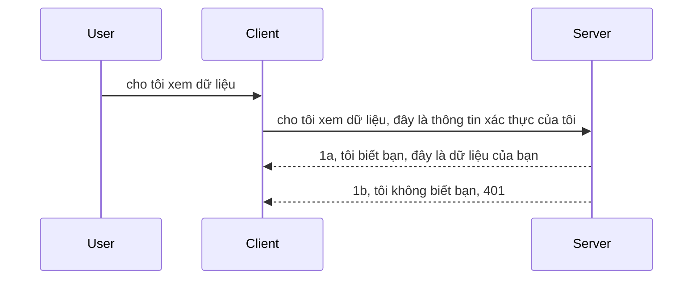

# Xác thực đơn giản

SDK MCP hỗ trợ sử dụng OAuth 2.1, thực ra là một quy trình khá phức tạp bao gồm các khái niệm như máy chủ xác thực, máy chủ tài nguyên, gửi thông tin đăng nhập, lấy mã, trao đổi mã lấy token bearer cho đến khi bạn cuối cùng có thể lấy dữ liệu tài nguyên. Nếu bạn chưa quen với OAuth mà thực sự là một điều tuyệt vời cần triển khai, thì nên bắt đầu với một mức xác thực cơ bản và dần dần xây dựng lên độ bảo mật tốt hơn và tốt hơn. Đó là lý do chương này tồn tại, để xây dựng bạn lên các xác thực nâng cao hơn.

## Xác thực, chúng ta nói đến điều gì?

Xác thực là tên ngắn của quá trình xác thực danh tính và ủy quyền. Ý tưởng là chúng ta cần làm hai việc:

- **Xác thực (Authentication)**, là quá trình xác định xem liệu chúng ta có cho phép một người vào nhà của mình, họ có quyền được "ở đây", tức là có quyền truy cập vào máy chủ tài nguyên nơi các tính năng MCP Server của chúng ta hoạt động.
- **Ủy quyền (Authorization)**, là quá trình tìm hiểu xem người dùng có nên có quyền truy cập các tài nguyên cụ thể mà họ yêu cầu, ví dụ như các đơn hàng hoặc các sản phẩm này hay họ chỉ được phép đọc nội dung mà không được xóa chẳng hạn.

## Thông tin đăng nhập: cách chúng ta xác định hệ thống biết ta là ai

Hầu hết các nhà phát triển web đều bắt đầu nghĩ đến việc cung cấp thông tin đăng nhập cho máy chủ, thường là một bí mật cho biết họ có được phép ở đây hay không "Xác thực". Thông tin đăng nhập này thường là một phiên bản mã hóa base64 của tên đăng nhập và mật khẩu hoặc một khóa API xác định duy nhất một người dùng cụ thể.

Điều này liên quan đến việc gửi nó qua một header gọi là "Authorization" như sau:

```json
{ "Authorization": "secret123" }
```

Thông thường đây được gọi là xác thực cơ bản (basic authentication). Quy trình tổng thể hoạt động như sau:



Bây giờ chúng ta đã hiểu nó hoạt động như thế nào từ góc độ quy trình, vậy làm thế nào để chúng ta triển khai nó? Hầu hết các máy chủ web có khái niệm gọi là middleware, một đoạn code chạy trong phần yêu cầu có thể kiểm tra thông tin đăng nhập, và nếu thông tin đăng nhập hợp lệ thì cho phép yêu cầu đi qua. Nếu yêu cầu không có thông tin đăng nhập hợp lệ thì bạn sẽ nhận được lỗi xác thực. Hãy xem cách triển khai điều này:

**Python**

```python
class AuthMiddleware(BaseHTTPMiddleware):
    async def dispatch(self, request, call_next):

        has_header = request.headers.get("Authorization")
        if not has_header:
            print("-> Missing Authorization header!")
            return Response(status_code=401, content="Unauthorized")

        if not valid_token(has_header):
            print("-> Invalid token!")
            return Response(status_code=403, content="Forbidden")

        print("Valid token, proceeding...")
       
        response = await call_next(request)
        # thêm bất kỳ tiêu đề khách hàng nào hoặc thay đổi phản hồi theo một cách nào đó
        return response


starlette_app.add_middleware(CustomHeaderMiddleware)
```

Ở đây chúng ta có:

- Tạo middleware gọi là `AuthMiddleware` với phương thức `dispatch` được máy chủ web gọi.
- Thêm middleware vào máy chủ web:

    ```python
    starlette_app.add_middleware(AuthMiddleware)
    ```

- Viết logic kiểm tra xem header Authorization có tồn tại không và bí mật gửi đến có hợp lệ hay không:

    ```python
    has_header = request.headers.get("Authorization")
    if not has_header:
        print("-> Missing Authorization header!")
        return Response(status_code=401, content="Unauthorized")

    if not valid_token(has_header):
        print("-> Invalid token!")
        return Response(status_code=403, content="Forbidden")
    ```

    nếu bí mật tồn tại và hợp lệ thì ta cho phép yêu cầu đi qua bằng cách gọi `call_next` và trả về phản hồi.

    ```python
    response = await call_next(request)
    # thêm bất kỳ tiêu đề khách hàng nào hoặc thay đổi phản hồi theo một cách nào đó
    return response
    ```

Cách hoạt động là nếu có một yêu cầu web được gửi tới máy chủ thì middleware sẽ được kích hoạt và dựa trên cách triển khai, nó sẽ cho phép yêu cầu đi qua hoặc trả về lỗi báo rằng client không được phép tiếp tục.

**TypeScript**

Ở đây chúng ta tạo middleware với framework phổ biến Express và chặn yêu cầu trước khi đến MCP Server. Dưới đây là mã cho việc đó:

```typescript
function isValid(secret) {
    return secret === "secret123";
}

app.use((req, res, next) => {
    // 1. Header xác thực có mặt?
    if(!req.headers["Authorization"]) {
        res.status(401).send('Unauthorized');
    }
    
    let token = req.headers["Authorization"];

    // 2. Kiểm tra tính hợp lệ.
    if(!isValid(token)) {
        res.status(403).send('Forbidden');
    }

   
    console.log('Middleware executed');
    // 3. Chuyển yêu cầu đến bước tiếp theo trong quy trình yêu cầu.
    next();
});
```

Trong code này chúng ta:

1. Kiểm tra xem header Authorization có tồn tại không, nếu không sẽ gửi lỗi 401.
2. Đảm bảo thông tin đăng nhập/token hợp lệ, nếu không sẽ gửi lỗi 403.
3. Cuối cùng chuyển tiếp yêu cầu trong pipeline và trả về tài nguyên được yêu cầu.

## Bài tập: Triển khai xác thực

Hãy lấy kiến thức chúng ta có và thử triển khai nó. Kế hoạch như sau:

Máy chủ

- Tạo máy chủ web và một instance MCP.
- Triển khai middleware cho máy chủ.

Client

- Gửi yêu cầu web với thông tin đăng nhập qua header.

### -1- Tạo máy chủ web và instance MCP

> **Nhìn trước:** ví dụ TypeScript dưới đây theo dõi các transport HTTP trong một map `transports` được khóa bởi `mcp-session-id`, theo **MCP Specification 2025-11-25**. Phiên bản ứng viên phát hành `2026-07-28` bỏ qua handshake `initialize` và session ID hoàn toàn, nên map transport theo phiên này sẽ biến mất để chuyển sang yêu cầu tự chứa, không trạng thái. Xem [Có gì thay đổi trong MCP: Phiên bản ứng viên 2026-07-28](../../01-CoreConcepts/mcp-2026-07-28-release-candidate.md).

Bước đầu tiên, chúng ta cần tạo instance máy chủ web và máy chủ MCP.

**Python**

Ở đây tạo instance MCP server, tạo ứng dụng web starlette và host nó bằng uvicorn.

```python
# tạo máy chủ MCP

app = FastMCP(
    name="MCP Resource Server",
    instructions="Resource Server that validates tokens via Authorization Server introspection",
    host=settings["host"],
    port=settings["port"],
    debug=True
)

# tạo ứng dụng web starlette
starlette_app = app.streamable_http_app()

# phục vụ ứng dụng qua uvicorn
async def run(starlette_app):
    import uvicorn
    config = uvicorn.Config(
            starlette_app,
            host=app.settings.host,
            port=app.settings.port,
            log_level=app.settings.log_level.lower(),
        )
    server = uvicorn.Server(config)
    await server.serve()

run(starlette_app)
```

Trong đoạn code này chúng ta:

- Tạo MCP Server.
- Tạo ứng dụng web starlette từ MCP Server, `app.streamable_http_app()`.
- Host và phục vụ ứng dụng web bằng uvicorn `server.serve()`.

**TypeScript**

Ở đây tạo instance MCP Server.

```typescript
const server = new McpServer({
      name: "example-server",
      version: "1.0.0"
    });

    // ... thiết lập tài nguyên máy chủ, công cụ và lời nhắc ...
```

Việc tạo MCP Server này sẽ cần diễn ra trong định nghĩa route POST /mcp, vậy hãy lấy đoạn code trên và di chuyển như sau:

```typescript
import express from "express";
import { randomUUID } from "node:crypto";
import { McpServer } from "@modelcontextprotocol/sdk/server/mcp.js";
import { StreamableHTTPServerTransport } from "@modelcontextprotocol/sdk/server/streamableHttp.js";
import { isInitializeRequest } from "@modelcontextprotocol/sdk/types.js"

const app = express();
app.use(express.json());

// Bản đồ để lưu trữ các kết nối theo ID phiên
const transports: { [sessionId: string]: StreamableHTTPServerTransport } = {};

// Xử lý các yêu cầu POST cho giao tiếp từ client đến server
app.post('/mcp', async (req, res) => {
  // Kiểm tra ID phiên đã tồn tại
  const sessionId = req.headers['mcp-session-id'] as string | undefined;
  let transport: StreamableHTTPServerTransport;

  if (sessionId && transports[sessionId]) {
    // Tái sử dụng kết nối đã tồn tại
    transport = transports[sessionId];
  } else if (!sessionId && isInitializeRequest(req.body)) {
    // Yêu cầu khởi tạo mới
    transport = new StreamableHTTPServerTransport({
      sessionIdGenerator: () => randomUUID(),
      onsessioninitialized: (sessionId) => {
        // Lưu kết nối theo ID phiên
        transports[sessionId] = transport;
      },
      // Bảo vệ tái liên kết DNS bị tắt theo mặc định để tương thích ngược. Nếu bạn đang chạy server này
      // cục bộ, hãy chắc chắn thiết lập:
      // enableDnsRebindingProtection: true,
      // allowedHosts: ['127.0.0.1'],
    });

    // Dọn dẹp kết nối khi đóng
    transport.onclose = () => {
      if (transport.sessionId) {
        delete transports[transport.sessionId];
      }
    };
    const server = new McpServer({
      name: "example-server",
      version: "1.0.0"
    });

    // ... thiết lập tài nguyên server, công cụ, và lời nhắc ...

    // Kết nối đến server MCP
    await server.connect(transport);
  } else {
    // Yêu cầu không hợp lệ
    res.status(400).json({
      jsonrpc: '2.0',
      error: {
        code: -32000,
        message: 'Bad Request: No valid session ID provided',
      },
      id: null,
    });
    return;
  }

  // Xử lý yêu cầu
  await transport.handleRequest(req, res, req.body);
});

// Trình xử lý có thể tái sử dụng cho các yêu cầu GET và DELETE
const handleSessionRequest = async (req: express.Request, res: express.Response) => {
  const sessionId = req.headers['mcp-session-id'] as string | undefined;
  if (!sessionId || !transports[sessionId]) {
    res.status(400).send('Invalid or missing session ID');
    return;
  }
  
  const transport = transports[sessionId];
  await transport.handleRequest(req, res);
};

// Xử lý yêu cầu GET cho thông báo từ server đến client qua SSE
app.get('/mcp', handleSessionRequest);

// Xử lý yêu cầu DELETE để kết thúc phiên làm việc
app.delete('/mcp', handleSessionRequest);

app.listen(3000);
```

Bây giờ bạn thấy việc tạo MCP Server được di chuyển vào trong `app.post("/mcp")`.

Hãy chuyển sang bước tiếp theo là tạo middleware để có thể xác thực thông tin đăng nhập gửi đến.

### -2- Triển khai middleware cho máy chủ

Tiếp theo, chúng ta sẽ tạo middleware để tìm kiếm thông tin đăng nhập trong header `Authorization` và xác thực nó. Nếu hợp lệ, yêu cầu sẽ được xử lý tiếp (ví dụ: liệt kê công cụ, đọc tài nguyên hoặc các chức năng MCP mà client yêu cầu).

**Python**

Để tạo middleware, chúng ta cần tạo một lớp kế thừa từ `BaseHTTPMiddleware`. Có hai phần thú vị:

- Yêu cầu `request` mà chúng ta đọc thông tin header từ đó.
- `call_next` là callback cần gọi nếu client gửi thông tin đăng nhập mà chúng ta chấp nhận.

Đầu tiên, cần xử lý trường hợp thiếu header `Authorization`:

```python
has_header = request.headers.get("Authorization")

# không có tiêu đề, trả về lỗi 401, nếu không thì tiếp tục.
if not has_header:
    print("-> Missing Authorization header!")
    return Response(status_code=401, content="Unauthorized")
```

Ở đây ta gửi thông báo 401 unauthorized khi client không xác thực đúng.

Tiếp theo, nếu có thông tin đăng nhập được gửi, ta cần kiểm tra tính hợp lệ như sau:

```python
 if not valid_token(has_header):
    print("-> Invalid token!")
    return Response(status_code=403, content="Forbidden")
```

Lưu ý ta gửi thông báo 403 forbidden ở trên. Đây là toàn bộ middleware triển khai tất cả những gì đã đề cập:

```python
class AuthMiddleware(BaseHTTPMiddleware):
    async def dispatch(self, request, call_next):

        has_header = request.headers.get("Authorization")
        if not has_header:
            print("-> Missing Authorization header!")
            return Response(status_code=401, content="Unauthorized")

        if not valid_token(has_header):
            print("-> Invalid token!")
            return Response(status_code=403, content="Forbidden")

        print("Valid token, proceeding...")
        print(f"-> Received {request.method} {request.url}")
        response = await call_next(request)
        response.headers['Custom'] = 'Example'
        return response

```

Tuyệt vời, nhưng hàm `valid_token` thì sao? Đây là nó:

```python
# KHÔNG sử dụng cho sản xuất - hãy cải thiện nó !!
def valid_token(token: str) -> bool:
    # loại bỏ tiền tố "Bearer "
    if token.startswith("Bearer "):
        token = token[7:]
        return token == "secret-token"
    return False
```

Đương nhiên cần cải thiện thêm.

QUAN TRỌNG: Bạn KHÔNG BAO GIỜ nên để bí mật như thế trong code. Nên lấy giá trị so sánh từ nguồn dữ liệu hoặc từ một nhà cung cấp dịch vụ nhận dạng (IDP) hoặc tốt hơn, để IDP đứng ra xác thực.

**TypeScript**

Để triển khai với Express, ta cần gọi phương thức `use` nhận các hàm middleware.

Chúng ta cần:

- Tương tác với biến request để kiểm tra thông tin đăng nhập ở thuộc tính `Authorization`.
- Xác thực thông tin đăng nhập, nếu hợp lệ cho phép yêu cầu tiếp tục và client thực hiện các tính năng MCP được yêu cầu.

Ở đây, ta kiểm tra xem header `Authorization` có tồn tại không, nếu không, ngừng yêu cầu:

```typescript
if(!req.headers["authorization"]) {
    res.status(401).send('Unauthorized');
    return;
}
```

Nếu header không gửi ngay từ đầu, bạn nhận lỗi 401.

Tiếp đến, kiểm tra thông tin đăng nhập có hợp lệ không, nếu không lại ngừng yêu cầu với thông báo khác:

```typescript
if(!isValid(token)) {
    res.status(403).send('Forbidden');
    return;
} 
```

Bạn sẽ nhận lỗi 403.

Đây là toàn bộ mã:

```typescript
app.use((req, res, next) => {
    console.log('Request received:', req.method, req.url, req.headers);
    console.log('Headers:', req.headers["authorization"]);
    if(!req.headers["authorization"]) {
        res.status(401).send('Unauthorized');
        return;
    }
    
    let token = req.headers["authorization"];

    if(!isValid(token)) {
        res.status(403).send('Forbidden');
        return;
    }  

    console.log('Middleware executed');
    next();
});
```

Chúng ta đã thiết lập máy chủ web để chấp nhận middleware kiểm tra thông tin đăng nhập mà client hi vọng gửi đến. Còn client thì sao?

### -3- Gửi yêu cầu web với thông tin đăng nhập qua header

Chúng ta cần đảm bảo client truyền thông tin đăng nhập qua header. Vì ta dùng client MCP nên cần tìm cách làm điều này.

**Python**

Với client, ta cần truyền header với thông tin đăng nhập như sau:

```python
# ĐỪNG mã hóa cứng giá trị, ít nhất hãy đặt nó trong biến môi trường hoặc lưu trữ an toàn hơn
token = "secret-token"

async with streamablehttp_client(
        url = f"http://localhost:{port}/mcp",
        headers = {"Authorization": f"Bearer {token}"}
    ) as (
        read_stream,
        write_stream,
        session_callback,
    ):
        async with ClientSession(
            read_stream,
            write_stream
        ) as session:
            await session.initialize()
      
            # TODO, những gì bạn muốn thực hiện ở phía client, ví dụ liệt kê công cụ, gọi công cụ v.v.
```

Lưu ý cách ta điền thuộc tính `headers` như `headers = {"Authorization": f"Bearer {token}"}`.

**TypeScript**

Có thể giải quyết trong hai bước:

1. Tạo một đối tượng cấu hình chứa thông tin đăng nhập.
2. Truyền đối tượng cấu hình này cho transport.

```typescript

// ĐỪNG cứng mã hóa giá trị như ví dụ ở đây. Tối thiểu hãy để nó như một biến môi trường và sử dụng thứ gì đó như dotenv (trong chế độ phát triển).
let token = "secret123"

// định nghĩa một đối tượng tùy chọn giao vận khách hàng
let options: StreamableHTTPClientTransportOptions = {
  sessionId: sessionId,
  requestInit: {
    headers: {
      "Authorization": "secret123"
    }
  }
};

// truyền đối tượng tùy chọn cho giao vận
async function main() {
   const transport = new StreamableHTTPClientTransport(
      new URL(serverUrl),
      options
   );
```

Ở đây bạn thấy ta phải tạo `options` và đặt header trong thuộc tính `requestInit`.

QUAN TRỌNG: Vậy làm thế nào để cải thiện từ đây? Triển khai hiện tại có một số vấn đề. Đầu tiên, việc gửi thông tin đăng nhập như vậy khá rủi ro trừ khi ít nhất bạn dùng HTTPS. Dù vậy, thông tin đăng nhập có thể bị đánh cắp nên bạn cần một hệ thống cho phép dễ thu hồi token và thêm các kiểm tra như token đến từ đâu trên thế giới, yêu cầu xảy ra quá thường xuyên (hành vi bot), nói chung còn nhiều lo ngại khác.

Tuy nhiên, với các API rất đơn giản mà bạn không muốn ai cũng có thể gọi API mà không xác thực thì cách làm này là khởi đầu tốt.

Với điều đó, hãy tăng cường bảo mật bằng cách dùng định dạng chuẩn hóa như JSON Web Token, còn gọi là JWT hay token "JOT".

## JSON Web Token, JWT

Vậy ta muốn cải thiện so với việc gửi thông tin đăng nhập đơn giản. Cải tiến ngay lập tức khi dùng JWT là gì?

- **Cải thiện bảo mật**. Trong xác thực cơ bản, bạn gửi lại tên đăng nhập và mật khẩu dưới dạng base64 (hoặc gửi khóa API) lặp đi lặp lại làm tăng rủi ro. Với JWT, bạn gửi tên đăng nhập và mật khẩu một lần để lấy token rồi gửi token này, token còn có thời hạn hết hạn rõ ràng. JWT cho phép kiểm soát truy cập chi tiết bằng vai trò, phạm vi và quyền.
- **Không trạng thái và khả năng mở rộng**. JWT tự chứa toàn bộ thông tin người dùng, loại bỏ việc lưu trữ trạng thái phiên máy chủ. Token cũng có thể được xác thực cục bộ.
- **Khả năng liên kết và liên bang hóa**. JWT là trung tâm của Open ID Connect và dùng với các nhà cung cấp dịch vụ nhận dạng phổ biến như Entra ID, Google Identity và Auth0. Chúng còn cho phép đăng nhập một lần (SSO) và nhiều tiện ích khác đạt tiêu chuẩn doanh nghiệp.
- **Tính mô-đun và linh hoạt**. JWT còn có thể dùng với API Gateway như Azure API Management, NGINX và nhiều công nghệ khác. Nó hỗ trợ kịch bản xác thực sử dụng và giao tiếp máy chủ-dịch vụ bao gồm giả mạo và ủy quyền.
- **Hiệu suất và bộ nhớ đệm**. JWT có thể được lưu bộ nhớ đệm sau khi giải mã, giảm việc phân tích trên mỗi lần yêu cầu. Điều này giúp ứng dụng có lưu lượng cao tăng thông lượng và giảm tải cho hạ tầng.
- **Tính năng nâng cao**. JWT cũng hỗ trợ introspection (kiểm tra tính hợp lệ trên server) và thu hồi (làm token không còn hợp lệ).

Với tất cả các lợi ích trên, hãy cùng xem cách nâng cấp triển khai của ta lên tầm cao mới.

## Chuyển xác thực cơ bản thành JWT

Nên làm những bước thay đổi chính:

- **Học cách tạo token JWT** và chuẩn bị sẵn để gửi từ client đến server.
- **Xác thực token JWT**, nếu hợp lệ cho phép client truy cập tài nguyên.
- **Lưu trữ token an toàn**. Cách ta lưu giữ token.
- **Bảo vệ các route**. Ta cần bảo vệ route và các tính năng MCP cụ thể.
- **Thêm refresh token**. Tạo token có thời hạn ngắn nhưng có token làm mới dài hạn để lấy token mới khi hết hạn. Đảm bảo có endpoint làm mới và chiến lược xoay vòng token.

### -1- Tạo token JWT

Trước tiên, token JWT có các phần:

- **header**, thuật toán và loại token.
- **payload**, các claims, ví dụ như sub (người dùng hoặc thực thể đại diện, thường là userid trong xác thực), exp (thời gian hết hạn), role (vai trò).
- **signature**, được ký bằng bí mật hoặc khóa riêng tư.

Chúng ta cần tạo header, payload và token mã hóa.

**Python**

```python

import jwt
import jwt
from jwt.exceptions import ExpiredSignatureError, InvalidTokenError
import datetime

# Khóa bí mật dùng để ký JWT
secret_key = 'your-secret-key'

header = {
    "alg": "HS256",
    "typ": "JWT"
}

# thông tin người dùng và các tuyên bố cùng thời gian hết hạn của nó
payload = {
    "sub": "1234567890",               # Chủ đề (ID người dùng)
    "name": "User Userson",                # Tuyên bố tùy chỉnh
    "admin": True,                     # Tuyên bố tùy chỉnh
    "iat": datetime.datetime.utcnow(),# Thời điểm phát hành
    "exp": datetime.datetime.utcnow() + datetime.timedelta(hours=1)  # Thời gian hết hạn
}

# mã hóa nó
encoded_jwt = jwt.encode(payload, secret_key, algorithm="HS256", headers=header)
```

Trong đoạn code trên ta đã:

- Định nghĩa header với thuật toán HS256 và loại là JWT.
- Tạo payload chứa subject hoặc user id, tên người dùng, vai trò, thời gian phát hành và thời gian hết hạn, bao gồm khía cạnh giới hạn thời gian.

**TypeScript**

Ở đây ta cần một số phụ thuộc giúp tạo token JWT.

Phụ thuộc

```sh

npm install jsonwebtoken
npm install --save-dev @types/jsonwebtoken
```

Bây giờ đã có, hãy tạo header, payload và từ đó tạo token mã hóa.

```typescript
import jwt from 'jsonwebtoken';

const secretKey = 'your-secret-key'; // Sử dụng biến môi trường trong sản xuất

// Định nghĩa payload
const payload = {
  sub: '1234567890',
  name: 'User usersson',
  admin: true,
  iat: Math.floor(Date.now() / 1000), // Được phát hành lúc
  exp: Math.floor(Date.now() / 1000) + 60 * 60 // Hết hạn trong 1 giờ
};

// Định nghĩa phần header (tùy chọn, jsonwebtoken thiết lập mặc định)
const header = {
  alg: 'HS256',
  typ: 'JWT'
};

// Tạo token
const token = jwt.sign(payload, secretKey, {
  algorithm: 'HS256',
  header: header
});

console.log('JWT:', token);
```

Token này:

Ký bằng HS256
Có hiệu lực trong 1 giờ
Bao gồm các claims như sub, name, admin, iat, exp.

### -2- Xác thực token

Ta cũng cần xác thực token, việc này nên làm trên server để đảm bảo client gửi token hợp lệ. Có nhiều kiểm tra cần thực hiện, từ xác thực cấu trúc đến tính hợp lệ. Bạn cũng nên thêm các kiểm tra khác xem người dùng có trong hệ thống của bạn không và hơn thế nữa.

Để xác thực token, ta cần giải mã trước để đọc rồi bắt đầu kiểm tra tính hợp lệ của nó:

**Python**

```python

# Giải mã và xác minh JWT
try:
    decoded = jwt.decode(token, secret_key, algorithms=["HS256"])
    print("✅ Token is valid.")
    print("Decoded claims:")
    for key, value in decoded.items():
        print(f"  {key}: {value}")
except ExpiredSignatureError:
    print("❌ Token has expired.")
except InvalidTokenError as e:
    print(f"❌ Invalid token: {e}")

```

Trong đoạn mã này, chúng ta gọi `jwt.decode` sử dụng token, khóa bí mật và thuật toán đã chọn làm đầu vào. Hãy chú ý cách chúng ta sử dụng cấu trúc try-catch vì việc xác thực không thành công sẽ dẫn đến lỗi được ném ra.

**TypeScript**

Ở đây chúng ta cần gọi `jwt.verify` để lấy phiên bản giải mã của token mà chúng ta có thể phân tích tiếp. Nếu cuộc gọi này thất bại, điều đó có nghĩa là cấu trúc của token không đúng hoặc nó không còn hợp lệ nữa.

```typescript

try {
  const decoded = jwt.verify(token, secretKey);
  console.log('Decoded Payload:', decoded);
} catch (err) {
  console.error('Token verification failed:', err);
}
```

NOTE: như đã đề cập trước đó, chúng ta nên thực hiện các kiểm tra bổ sung để đảm bảo token này chỉ đến một người dùng trong hệ thống của chúng ta và đảm bảo người dùng đó có các quyền mà nó tuyên bố có.

Tiếp theo, hãy cùng tìm hiểu về kiểm soát truy cập dựa trên vai trò, còn được biết đến là RBAC.

## Thêm kiểm soát truy cập dựa trên vai trò

Ý tưởng là chúng ta muốn biểu đạt rằng các vai trò khác nhau sẽ có các quyền khác nhau. Ví dụ, chúng ta giả định một quản trị viên có thể làm mọi thứ, người dùng bình thường có thể đọc/ghi và khách chỉ có thể đọc. Do đó, đây là một số mức quyền có thể có:

- Admin.Write
- User.Read
- Guest.Read

Hãy xem cách chúng ta có thể triển khai kiểm soát như vậy bằng middleware. Middleware có thể được thêm vào từng tuyến đường cụ thể cũng như cho tất cả các tuyến.

**Python**

```python
from starlette.middleware.base import BaseHTTPMiddleware
from starlette.responses import JSONResponse
import jwt

# ĐỪNG để bí mật trong mã như thế này, đây chỉ là để minh họa. Hãy đọc nó từ một nơi an toàn.
SECRET_KEY = "your-secret-key" # đặt cái này vào biến môi trường
REQUIRED_PERMISSION = "User.Read"

class JWTPermissionMiddleware(BaseHTTPMiddleware):
    async def dispatch(self, request, call_next):
        auth_header = request.headers.get("Authorization")
        if not auth_header or not auth_header.startswith("Bearer "):
            return JSONResponse({"error": "Missing or invalid Authorization header"}, status_code=401)

        token = auth_header.split(" ")[1]
        try:
            decoded = jwt.decode(token, SECRET_KEY, algorithms=["HS256"])
        except jwt.ExpiredSignatureError:
            return JSONResponse({"error": "Token expired"}, status_code=401)
        except jwt.InvalidTokenError:
            return JSONResponse({"error": "Invalid token"}, status_code=401)

        permissions = decoded.get("permissions", [])
        if REQUIRED_PERMISSION not in permissions:
            return JSONResponse({"error": "Permission denied"}, status_code=403)

        request.state.user = decoded
        return await call_next(request)


```

Có một vài cách khác nhau để thêm middleware như dưới đây:

```python

# Phương án 1: thêm middleware trong khi xây dựng ứng dụng starlette
middleware = [
    Middleware(JWTPermissionMiddleware)
]

app = Starlette(routes=routes, middleware=middleware)

# Phương án 2: thêm middleware sau khi ứng dụng starlette đã được xây dựng
starlette_app.add_middleware(JWTPermissionMiddleware)

# Phương án 3: thêm middleware cho từng route
routes = [
    Route(
        "/mcp",
        endpoint=..., # trình xử lý
        middleware=[Middleware(JWTPermissionMiddleware)]
    )
]
```

**TypeScript**

Chúng ta có thể dùng `app.use` và một middleware sẽ chạy cho tất cả các yêu cầu.

```typescript
app.use((req, res, next) => {
    console.log('Request received:', req.method, req.url, req.headers);
    console.log('Headers:', req.headers["authorization"]);

    // 1. Kiểm tra xem tiêu đề ủy quyền đã được gửi chưa

    if(!req.headers["authorization"]) {
        res.status(401).send('Unauthorized');
        return;
    }
    
    let token = req.headers["authorization"];

    // 2. Kiểm tra xem mã thông báo có hợp lệ không
    if(!isValid(token)) {
        res.status(403).send('Forbidden');
        return;
    }  

    // 3. Kiểm tra xem người dùng mã thông báo có tồn tại trong hệ thống của chúng tôi không
    if(!isExistingUser(token)) {
        res.status(403).send('Forbidden');
        console.log("User does not exist");
        return;
    }
    console.log("User exists");

    // 4. Xác minh mã thông báo có quyền thích hợp không
    if(!hasScopes(token, ["User.Read"])){
        res.status(403).send('Forbidden - insufficient scopes');
    }

    console.log("User has required scopes");

    console.log('Middleware executed');
    next();
});

```

Có khá nhiều việc chúng ta có thể và middleware CẦN làm, cụ thể là:

1. Kiểm tra xem header authorization có tồn tại hay không
2. Kiểm tra token có hợp lệ không, chúng ta gọi `isValid` là một phương thức tự viết để kiểm tra tính toàn vẹn và hợp lệ của JWT token.
3. Xác thực người dùng tồn tại trong hệ thống, chúng ta nên kiểm tra điều này.

   ```typescript
    // người dùng trong CSDL
   const users = [
     "user1",
     "User usersson",
   ]

   function isExistingUser(token) {
     let decodedToken = verifyToken(token);

     // TODO, kiểm tra xem người dùng có tồn tại trong CSDL không
     return users.includes(decodedToken?.name || "");
   }
   ```

   Ở trên, chúng ta đã tạo danh sách `users` rất đơn giản, tất nhiên phải lưu trong cơ sở dữ liệu.

4. Ngoài ra, chúng ta cũng nên kiểm tra token có quyền phù hợp hay không.

   ```typescript
   if(!hasScopes(token, ["User.Read"])){
        res.status(403).send('Forbidden - insufficient scopes');
   }
   ```

   Trong đoạn mã trên từ middleware, chúng ta kiểm tra token có quyền User.Read, nếu không có thì gửi lỗi 403. Dưới đây là phương thức trợ giúp `hasScopes`.

   ```typescript
   function hasScopes(scope: string, requiredScopes: string[]) {
     let decodedToken = verifyToken(scope);
    return requiredScopes.every(scope => decodedToken?.scopes.includes(scope));
  }
   ```

Have a think which additional checks you should be doing, but these are the absolute minimum of checks you should be doing.

Using Express as a web framework is a common choice. There are helpers library when you use JWT so you can write less code.

- `express-jwt`, helper library that provides a middleware that helps decode your token.
- `express-jwt-permissions`, this provides a middleware `guard` that helps check if a certain permission is on the token.

Here's what these libraries can look like when used:

```typescript
const express = require('express');
const jwt = require('express-jwt');
const guard = require('express-jwt-permissions')();

const app = express();
const secretKey = 'your-secret-key'; // put this in env variable

// Decode JWT and attach to req.user
app.use(jwt({ secret: secretKey, algorithms: ['HS256'] }));

// Check for User.Read permission
app.use(guard.check('User.Read'));

// multiple permissions
// app.use(guard.check(['User.Read', 'Admin.Access']));

app.get('/protected', (req, res) => {
  res.json({ message: `Welcome ${req.user.name}` });
});

// Error handler
app.use((err, req, res, next) => {
  if (err.code === 'permission_denied') {
    return res.status(403).send('Forbidden');
  }
  next(err);
});

```

Bây giờ bạn đã thấy middleware có thể dùng cho cả xác thực và phân quyền, còn MCP thì sao, nó có làm thay đổi cách chúng ta làm auth không? Hãy cùng tìm hiểu trong phần tiếp theo.

### -3- Thêm RBAC vào MCP

Bạn đã thấy cho đến giờ chúng ta có thể thêm RBAC thông qua middleware, tuy nhiên với MCP thì không có cách dễ dàng để thêm RBAC theo từng tính năng MCP, vậy chúng ta phải làm gì? Chúng ta chỉ cần thêm mã kiểm tra trong trường hợp này xem client có quyền gọi một công cụ cụ thể hay không:

Bạn có một vài lựa chọn khác nhau để thực hiện RBAC theo tính năng, ví dụ như:

- Thêm kiểm tra cho từng công cụ, tài nguyên, prompt mà bạn cần kiểm tra cấp độ quyền.

   **python**

   ```python
   @tool()
   def delete_product(id: int):
      try:
          check_permissions(role="Admin.Write", request)
      catch:
        pass # khách hàng không được phép, phát sinh lỗi xác thực
   ```

   **typescript**

   ```typescript
   server.registerTool(
    "delete-product",
    {
      title: Delete a product",
      description: "Deletes a product",
      inputSchema: { id: z.number() }
    },
    async ({ id }) => {
      
      try {
        checkPermissions("Admin.Write", request);
        // làm, gửi id đến productService và điểm nhập từ xa
      } catch(Exception e) {
        console.log("Authorization error, you're not allowed");  
      }

      return {
        content: [{ type: "text", text: `Deletected product with id ${id}` }]
      };
    }
   );
   ```


- Sử dụng phương pháp server nâng cao và các request handler để giảm thiểu số nơi cần thực hiện kiểm tra.

   **Python**

   ```python
   
   tool_permission = {
      "create_product": ["User.Write", "Admin.Write"],
      "delete_product": ["Admin.Write"]
   }

   def has_permission(user_permissions, required_permissions) -> bool:
      # user_permissions: danh sách quyền của người dùng
      # required_permissions: danh sách quyền cần thiết cho công cụ
      return any(perm in user_permissions for perm in required_permissions)

   @server.call_tool()
   async def handle_call_tool(
     name: str, arguments: dict[str, str] | None
   ) -> list[types.TextContent]:
    # Giả sử request.user.permissions là danh sách các quyền của người dùng
     user_permissions = request.user.permissions
     required_permissions = tool_permission.get(name, [])
     if not has_permission(user_permissions, required_permissions):
        # Ném lỗi "Bạn không có quyền gọi công cụ {name}"
        raise Exception(f"You don't have permission to call tool {name}")
     # tiếp tục và gọi công cụ
     # ...
   ```   
   

   **TypeScript**

   ```typescript
   function hasPermission(userPermissions: string[], requiredPermissions: string[]): boolean {
       if (!Array.isArray(userPermissions) || !Array.isArray(requiredPermissions)) return false;
       // Trả về true nếu người dùng có ít nhất một quyền cần thiết
       
       return requiredPermissions.some(perm => userPermissions.includes(perm));
   }
  
   server.setRequestHandler(CallToolRequestSchema, async (request) => {
      const { params: { name } } = request;
  
      let permissions = request.user.permissions;
  
      if (!hasPermission(permissions, toolPermissions[name])) {
         return new Error(`You don't have permission to call ${name}`);
      }
  
      // tiếp tục..
   });
   ```

   Lưu ý, bạn cần đảm bảo middleware của bạn gán token đã giải mã cho thuộc tính user trong request để đoạn mã trên trở nên đơn giản.

### Tóm tắt

Bây giờ chúng ta đã bàn về cách thêm hỗ trợ RBAC nói chung và cho MCP nói riêng, đã đến lúc thử triển khai bảo mật tự mình để đảm bảo bạn đã hiểu các khái niệm đã trình bày.

## Bài tập 1: Xây dựng một server mcp và client mcp sử dụng xác thực cơ bản

Ở đây bạn sẽ áp dụng những gì đã học về gửi thông tin đăng nhập qua header.

## Giải pháp 1

[Solution 1](./code/basic/README.md)

## Bài tập 2: Nâng cấp giải pháp từ Bài tập 1 sử dụng JWT

Dùng giải pháp đầu tiên nhưng lần này cải tiến hơn.

Thay vì dùng Basic Auth, hãy dùng JWT.

## Giải pháp 2

[Solution 2](./solution/jwt-solution/README.md)

## Thách thức

Thêm RBAC theo từng công cụ như đã mô tả trong phần "Thêm RBAC vào MCP".

## Tổng kết

Hy vọng bạn đã học được rất nhiều trong chương này, từ không có bảo mật, đến bảo mật cơ bản, tới JWT và cách thêm nó vào MCP.

Chúng ta đã xây dựng nền tảng vững chắc với JWT tuỳ chỉnh, nhưng khi mở rộng, chúng ta sẽ chuyển sang mô hình định danh chuẩn. Việc áp dụng IdP như Entra hoặc Keycloak cho phép chúng ta chuyển giao việc phát hành token, xác thực và quản lý vòng đời token cho nền tảng đáng tin cậy — giúp chúng ta tập trung vào logic ứng dụng và trải nghiệm người dùng.

Về điều này, chúng ta có [chương nâng cao hơn về Entra](../../05-AdvancedTopics/mcp-security-entra/README.md)

## Tiếp theo

- Tiếp theo: [Cài đặt MCP Hosts](../12-mcp-hosts/README.md)

---

<!-- CO-OP TRANSLATOR DISCLAIMER START -->
**Tuyên bố miễn trừ trách nhiệm**:
Tài liệu này đã được dịch bằng dịch vụ dịch thuật AI [Co-op Translator](https://github.com/Azure/co-op-translator). Mặc dù chúng tôi cố gắng đảm bảo độ chính xác, xin lưu ý rằng bản dịch tự động có thể chứa lỗi hoặc sai sót. Tài liệu gốc bằng ngôn ngữ gốc nên được coi là nguồn tin chính thức. Đối với thông tin quan trọng, nên sử dụng dịch vụ dịch thuật chuyên nghiệp bởi con người. Chúng tôi không chịu trách nhiệm về bất kỳ hiểu lầm hoặc giải thích sai nào phát sinh từ việc sử dụng bản dịch này.
<!-- CO-OP TRANSLATOR DISCLAIMER END -->