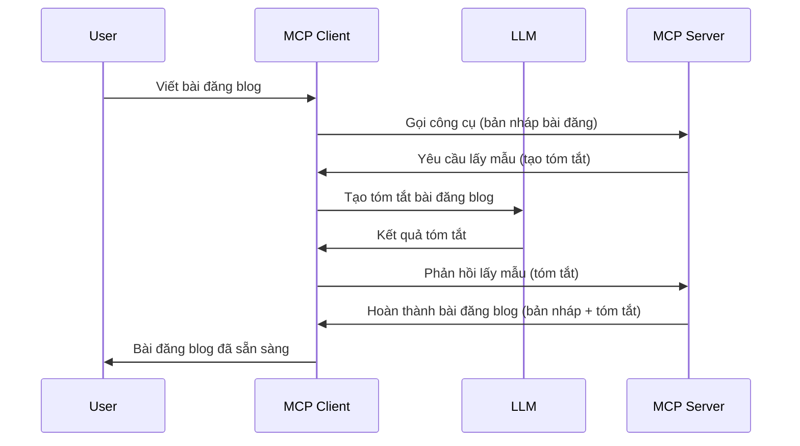

# Sampling - ủy quyền tính năng cho Client

> **Thông báo ngừng hỗ trợ:** bản phát hành ứng viên đặc tả MCP `2026-07-28` đánh dấu Sampling là tính năng ngừng hỗ trợ để ưu tiên tích hợp trực tiếp với API nhà cung cấp LLM. Sampling vẫn hoạt động trong `2025-11-25` và ít nhất một năm sau bất kỳ ngừng hỗ trợ chính thức nào, do đó mọi nội dung trong bài học này vẫn còn hợp lệ — nhưng các thiết kế máy chủ mới nên xem xét mẫu thay thế. Xem [Có gì thay đổi trong MCP: Ứng viên phát hành 2026-07-28](../../01-CoreConcepts/mcp-2026-07-28-release-candidate.md).

Đôi khi, bạn cần MCP Client và MCP Server phối hợp cùng nhau để đạt được mục tiêu chung. Có thể bạn gặp trường hợp Server cần đến sự trợ giúp của LLM nằm trên client. Trong trường hợp này, sampling là lựa chọn bạn nên dùng.

Hãy khám phá một số trường hợp sử dụng và cách xây dựng giải pháp liên quan đến sampling.

## Tổng quan

Trong bài học này, chúng ta tập trung giải thích khi nào và ở đâu nên sử dụng Sampling và cách cấu hình nó.

## Mục tiêu học tập

Trong chương này, chúng ta sẽ:

- Giải thích Sampling là gì và khi nào nên dùng.
- Hướng dẫn cách cấu hình Sampling trong MCP.
- Cung cấp ví dụ về Sampling trong thực tế.

## Sampling là gì và tại sao dùng nó?

Sampling là một tính năng nâng cao hoạt động theo cách sau:



### Yêu cầu sampling

Ok, giờ chúng ta đã có cái nhìn tổng quan về một kịch bản hợp lý, hãy nói về yêu cầu sampling mà server gửi lại cho client. Đây là cách một yêu cầu như vậy có thể trông trong định dạng JSON-RPC:

```json
{
  "jsonrpc": "2.0",
  "id": 1,
  "method": "sampling/createMessage",
  "params": {
    "messages": [
      {
        "role": "user",
        "content": {
          "type": "text",
          "text": "Create a blog post summary of the following blog post: <BLOG POST>"
        }
      }
    ],
    "modelPreferences": {
      "hints": [
        {
          "name": "claude-3-sonnet"
        }
      ],
      "intelligencePriority": 0.8,
      "speedPriority": 0.5
    },
    "systemPrompt": "You are a helpful assistant.",
    "maxTokens": 100
  }
}
```

Có vài điểm đáng chú ý:

- Prompt, dưới content -> text, là đoạn prompt của chúng ta, là hướng dẫn để LLM tóm tắt nội dung bài blog.

- **modelPreferences**. Phần này đơn giản là tùy chọn, một đề xuất cấu hình nên dùng với LLM. Người dùng có thể chọn theo đề xuất hoặc thay đổi. Ở đây có đề xuất về model sử dụng, độ ưu tiên tốc độ và trí tuệ.
- **systemPrompt**, đây là prompt hệ thống bình thường của bạn, cung cấp cá tính cho LLM và chứa hướng dẫn.
- **maxTokens**, thuộc tính khác dùng để chỉ số token được đề xuất cho nhiệm vụ này.

### Phản hồi sampling

Phản hồi này là kết quả MCP Client gửi lại MCP Server sau khi client gọi LLM, chờ phản hồi và xây dựng thông điệp này. Đây là cách nó có thể trông trong JSON-RPC:

```json
{
  "jsonrpc": "2.0",
  "id": 1,
  "result": {
    "role": "assistant",
    "content": {
      "type": "text",
      "text": "Here's your abstract <ABSTRACT>"
    },
    "model": "gpt-5",
    "stopReason": "endTurn"
  }
}
```

Lưu ý phản hồi là một bản trừu tượng của bài blog như chúng ta đã yêu cầu. Cũng lưu ý model dùng không phải cái đã yêu cầu mà là "gpt-5" thay vì "claude-3-sonnet". Điều này minh họa người dùng có thể thay đổi ý định về model dùng và yêu cầu sampling chỉ là đề xuất.

Ok, giờ ta hiểu luồng chính rồi, và nhiệm vụ hữu ích để dùng nó là "tạo + tóm tắt bài blog", ta xem cần làm gì để hoạt động.

### Các loại thông điệp

Thông điệp Sampling không chỉ giới hạn ở văn bản mà còn có thể gửi ảnh và audio. Đây là cách JSON-RPC khác biệt:

**Văn bản**

```json
{
  "type": "text",
  "text": "The message content"
}
```

**Nội dung ảnh**

```json
{
  "type": "image",
  "data": "base64-encoded-image-data",
  "mimeType": "image/jpeg"
}
```

**Nội dung âm thanh**

```json
{
  "type": "audio",
  "data": "base64-encoded-audio-data",
  "mimeType": "audio/wav"
}
```

> NOTE: để biết thông tin chi tiết hơn về Sampling, xem [tài liệu chính thức](https://modelcontextprotocol.io/specification/2025-11-25/client/sampling)

## Cách cấu hình Sampling trên Client

> Lưu ý: nếu bạn chỉ xây dựng server, không cần làm nhiều bước này.

Trên client, bạn cần chỉ định tính năng sau như sau:

```json
{
  "capabilities": {
    "sampling": {}
  }
}
```

Điều này sẽ được lấy khi client bạn chọn khởi tạo cùng server.

## Ví dụ về Sampling trong thực tế - Tạo bài Blog

Hãy cùng viết code server sampling, ta cần làm các bước sau:

1. Tạo một công cụ trên Server.
1. Công cụ đó tạo yêu cầu sampling.
1. Công cụ chờ phản hồi sampling từ client.
1. Sau đó, công cụ tạo kết quả.

Xem mã từng bước:

### -1- Tạo công cụ

**python**

```python
@mcp.tool()
async def create_blog(title: str, content: str, ctx: Context[ServerSession, None]) -> str:
    """Create a blog post and generate a summary"""

```

### -2- Tạo yêu cầu sampling

Mở rộng công cụ với mã sau:

**python**

```python
post = BlogPost(
        id=len(posts) + 1,
        title=title,
        content=content,
        abstract=""
    )

prompt = f"Create an abstract of the following blog post: title: {title} and draft: {content} "

result = await ctx.session.create_message(
        messages=[
            SamplingMessage(
                role="user",
                content=TextContent(type="text", text=prompt),
            )
        ],
        max_tokens=100,
)

```

### -3- Chờ phản hồi và trả về kết quả

**python**

```python
post.abstract = result.content.text

posts.append(post)

# trả về sản phẩm hoàn chỉnh
return json.dumps({
    "id": post.title,
    "abstract": post.abstract
})
```

### -4- Mã đầy đủ

**python**

```python
from starlette.applications import Starlette
from starlette.routing import Mount, Host

from mcp.server.fastmcp import Context, FastMCP

from mcp.server.session import ServerSession
from mcp.types import SamplingMessage, TextContent

import json


from uuid import uuid4
from typing import List
from pydantic import BaseModel


mcp = FastMCP("Blog post generator")

# app = FastAPI()

posts = []

class BlogPost(BaseModel):
    id: int
    title: str
    content: str
    abstract: str

posts: List[BlogPost] = []

@mcp.tool()
async def create_blog(title: str, content: str, ctx: Context[ServerSession, None]) -> str:
    """Create a blog post and generate a summary"""

    post = BlogPost(
        id=len(posts) + 1,
        title=title,
        content=content,
        abstract=""
    )

    prompt = f"Create an abstract of the following blog post: title: {title} and draft: {content} "

    result = await ctx.session.create_message(
        messages=[
            SamplingMessage(
                role="user",
                content=TextContent(type="text", text=prompt),
            )
        ],
        max_tokens=100,
    )

    post.abstract = result.content.text

    posts.append(post)

    # trả về bài đăng blog hoàn chỉnh
    return json.dumps({
        "id": post.title,
        "abstract": post.abstract
    })

if __name__ == "__main__":
    print("Starting server...")
    # mcp.run()
    mcp.run(transport="streamable-http")

# chạy ứng dụng với: python server.py
```

### -5- Kiểm thử trong Visual Studio Code

Để kiểm thử trong Visual Studio Code, làm theo:

1. Khởi động server trong terminal
1. Thêm nó vào *mcp.json* (và đảm bảo nó đã chạy) ví dụ như sau:

   ```json
   "servers": {
      "blog-server": {
        "type": "http",
        "url": "http://localhost:8000/mcp"
      }
   }
   ```

1. Gõ prompt:

   ```text
   create a blog post named "Where Python comes from", the content is "Python is actually named after Monty Python Flying Circus"
   ```

1. Cho phép sampling diễn ra. Lần đầu thử bạn sẽ thấy một hộp thoại bổ sung cần chấp nhận, sau đó sẽ thấy hộp thoại bình thường yêu cầu bạn chạy công cụ

1. Kiểm tra kết quả. Bạn sẽ thấy kết quả được hiển thị đẹp trong GitHub Copilot Chat, cũng có thể xem phản hồi JSON thô.

**Thêm**. Công cụ Visual Studio Code hỗ trợ sampling rất tốt. Bạn có thể cấu hình truy cập Sampling cho server đã cài bằng cách:

1. Vào phần extension.
1. Chọn biểu tượng bánh răng cho server bạn đã cài trong mục "MCP SERVERS - INSTALLED".
1. Chọn "Configure Model Access", tại đây bạn có thể chọn Model nào GitHub Copilot được phép dùng khi sampling. Cũng có thể xem toàn bộ yêu cầu sampling gần đây bằng cách chọn "Show Sampling requests".

## Bài tập

Trong bài tập này, bạn sẽ xây dựng Sampling hơi khác, cụ thể là một tích hợp sampling hỗ trợ tạo mô tả sản phẩm. Đây là kịch bản:

**Kịch bản**: Nhân viên văn phòng hậu cần cho một trang thương mại điện tử cần giúp, tốn quá nhiều thời gian tạo mô tả sản phẩm. Do đó bạn xây dựng giải pháp gọi một công cụ "create_product" với các tham số "title" và "keywords" và nó sẽ tạo ra một sản phẩm hoàn chỉnh bao gồm trường "description" được điền bởi LLM của client.

TIP: dùng kiến thức đã học để xây dựng server và công cụ này qua yêu cầu sampling.

## Giải pháp

[Giải pháp](./solution/README.md)

## Những điểm chính rút ra

Sampling là tính năng mạnh mẽ cho phép server ủy nhiệm nhiệm vụ cho client khi cần đến sự trợ giúp của LLM.

## Tiếp theo

- [Chương 4 - Triển khai thực tế](../../04-PracticalImplementation/README.md)

---

<!-- CO-OP TRANSLATOR DISCLAIMER START -->
**Tuyên bố miễn trừ trách nhiệm**:
Tài liệu này đã được dịch bằng dịch vụ dịch thuật AI [Co-op Translator](https://github.com/Azure/co-op-translator). Mặc dù chúng tôi cố gắng đảm bảo độ chính xác, xin lưu ý rằng bản dịch tự động có thể chứa lỗi hoặc sai sót. Tài liệu gốc bằng ngôn ngữ gốc nên được coi là nguồn tin chính thức. Đối với thông tin quan trọng, nên sử dụng dịch vụ dịch thuật chuyên nghiệp bởi con người. Chúng tôi không chịu trách nhiệm về bất kỳ hiểu lầm hoặc giải thích sai nào phát sinh từ việc sử dụng bản dịch này.
<!-- CO-OP TRANSLATOR DISCLAIMER END -->