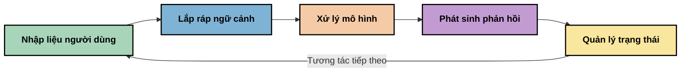
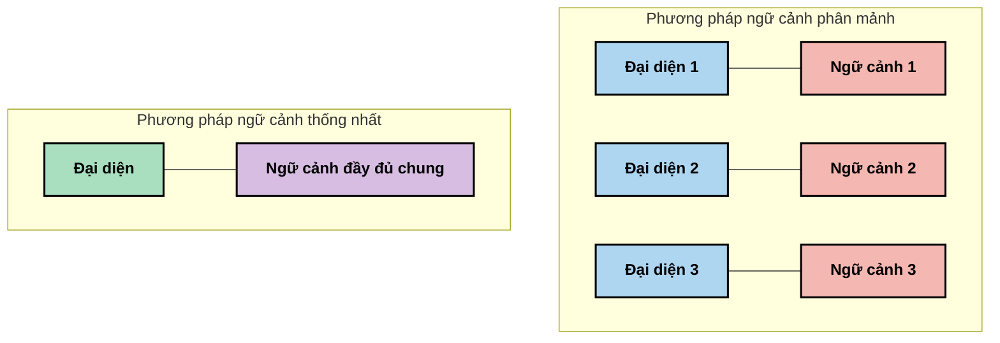
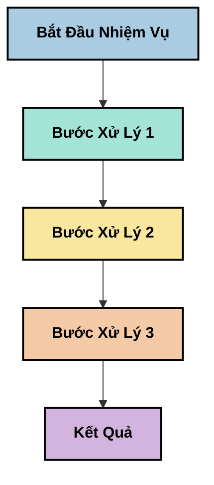
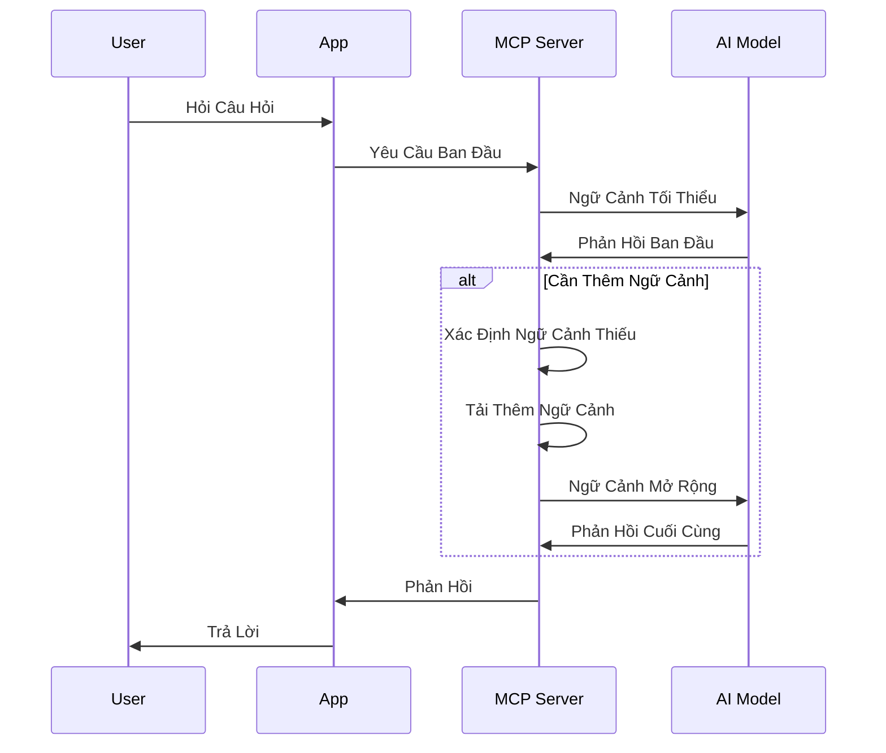
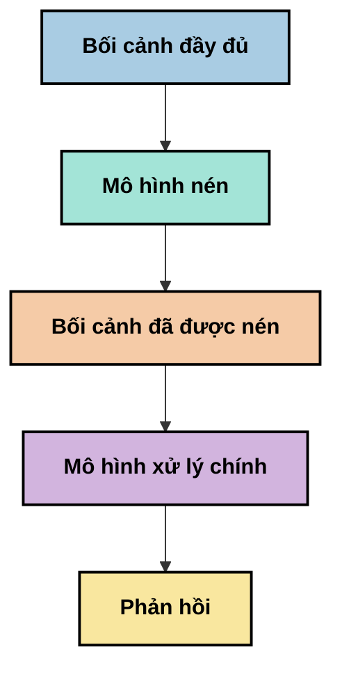
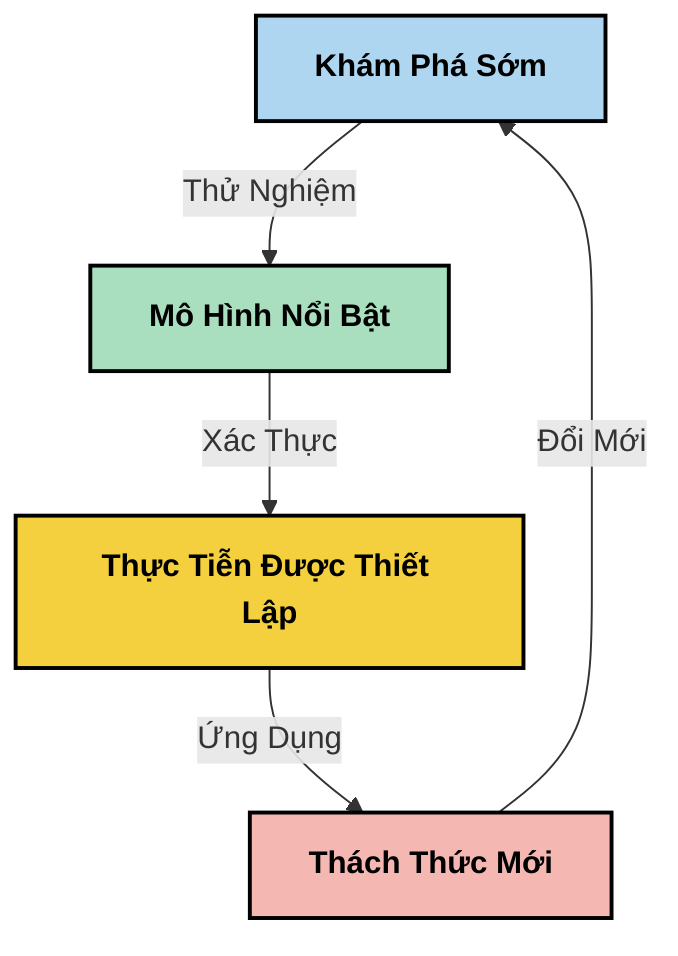

# Kỹ thuật Ngữ cảnh: Một Khái niệm Mới Nổi trong Hệ sinh thái MCP

## Tổng quan

Kỹ thuật ngữ cảnh là một khái niệm mới nổi trong lĩnh vực AI, khám phá cách thông tin được cấu trúc, truyền tải và duy trì trong suốt các tương tác giữa khách hàng và dịch vụ AI. Khi hệ sinh thái Giao thức Ngữ cảnh Mô hình (MCP) phát triển, việc hiểu cách quản lý ngữ cảnh một cách hiệu quả trở nên ngày càng quan trọng. Mô-đun này giới thiệu khái niệm kỹ thuật ngữ cảnh và khám phá các ứng dụng tiềm năng của nó trong các triển khai MCP.

## Mục tiêu học tập

Kết thúc mô-đun này, bạn sẽ có khả năng:

- Hiểu được khái niệm mới nổi về kỹ thuật ngữ cảnh và vai trò tiềm năng của nó trong các ứng dụng MCP
- Nhận diện những thách thức chính trong quản lý ngữ cảnh mà thiết kế giao thức MCP hướng tới giải quyết
- Khám phá các kỹ thuật cải thiện hiệu suất mô hình thông qua xử lý ngữ cảnh tốt hơn
- Xem xét các phương pháp đo lường và đánh giá hiệu quả của ngữ cảnh
- Áp dụng các khái niệm mới nổi này để nâng cao trải nghiệm AI qua khung MCP

## Giới thiệu về Kỹ thuật Ngữ cảnh

Kỹ thuật ngữ cảnh là một khái niệm mới nổi tập trung vào thiết kế có chủ đích và quản lý luồng thông tin giữa người dùng, ứng dụng và các mô hình AI. Khác với các lĩnh vực đã được thiết lập như kỹ thuật prompts, kỹ thuật ngữ cảnh vẫn đang được các nhà thực hành định nghĩa khi họ làm việc để giải quyết các thách thức đặc thù trong việc cung cấp thông tin đúng cho mô hình AI vào đúng thời điểm.

Khi các mô hình ngôn ngữ lớn (LLMs) phát triển, tầm quan trọng của ngữ cảnh ngày càng trở nên rõ ràng. Chất lượng, tính liên quan và cấu trúc của ngữ cảnh chúng ta cung cấp ảnh hưởng trực tiếp đến đầu ra của mô hình. Kỹ thuật ngữ cảnh khám phá mối quan hệ này và tìm cách phát triển các nguyên tắc để quản lý ngữ cảnh hiệu quả.

> "Năm 2025, các mô hình hiện rất thông minh. Nhưng ngay cả con người thông minh nhất cũng không thể làm việc hiệu quả nếu không có ngữ cảnh của những gì họ được yêu cầu làm... ‘Kỹ thuật ngữ cảnh’ là cấp độ tiếp theo của kỹ thuật prompt. Đó là làm điều này một cách tự động trong một hệ thống động." — Walden Yan, Cognition AI

Kỹ thuật ngữ cảnh có thể bao gồm:

1. **Lựa chọn Ngữ cảnh**: Xác định thông tin nào có liên quan cho một nhiệm vụ cụ thể
2. **Cấu trúc Ngữ cảnh**: Tổ chức thông tin để tối đa hóa khả năng hiểu của mô hình
3. **Truyền tải Ngữ cảnh**: Tối ưu cách thức và thời điểm truyền thông tin tới mô hình
4. **Duy trì Ngữ cảnh**: Quản lý trạng thái và sự thay đổi của ngữ cảnh theo thời gian
5. **Đánh giá Ngữ cảnh**: Đo lường và cải thiện hiệu quả của ngữ cảnh

Các lĩnh vực này rất liên quan đến hệ sinh thái MCP, vốn cung cấp một phương thức tiêu chuẩn để các ứng dụng cung cấp ngữ cảnh cho các LLM.


## Góc nhìn về Hành trình Ngữ cảnh

Một cách hình dung kỹ thuật ngữ cảnh là theo dõi hành trình thông tin đi qua hệ thống MCP:



### Các giai đoạn chính trong Hành trình Ngữ cảnh:

1. **Đầu vào người dùng**: Thông tin thô từ người dùng (văn bản, hình ảnh, tài liệu)
2. **Lắp ráp Ngữ cảnh**: Kết hợp đầu vào người dùng với ngữ cảnh hệ thống, lịch sử hội thoại và các thông tin truy xuất khác
3. **Xử lý Mô hình**: Mô hình AI xử lý ngữ cảnh đã được lắp ráp
4. **Tạo phản hồi**: Mô hình tạo ra đầu ra dựa trên ngữ cảnh được cung cấp
5. **Quản lý Trạng thái**: Hệ thống cập nhật trạng thái nội bộ dựa trên tương tác

Góc nhìn này làm nổi bật tính động của ngữ cảnh trong các hệ thống AI và đặt ra những câu hỏi quan trọng về cách quản lý thông tin tốt nhất ở mỗi giai đoạn.

## Các nguyên tắc mới nổi trong Kỹ thuật Ngữ cảnh

Khi lĩnh vực kỹ thuật ngữ cảnh định hình, một số nguyên tắc ban đầu đang bắt đầu ló dạng từ các nhà thực hành. Những nguyên tắc này có thể giúp định hướng lựa chọn trong triển khai MCP:

### Nguyên tắc 1: Chia sẻ Ngữ cảnh một cách Toàn diện

Ngữ cảnh nên được chia sẻ đầy đủ giữa tất cả các thành phần của hệ thống thay vì phân mảnh qua nhiều tác tử hoặc quy trình. Khi ngữ cảnh bị phân tán, các quyết định được đưa ra trong một phần của hệ thống có thể xung đột với các quyết định ở phần khác.



Trong các ứng dụng MCP, điều này gợi ý thiết kế các hệ thống mà ngữ cảnh chảy trôi liên tục qua toàn bộ quy trình thay vì bị chia nhỏ.

### Nguyên tắc 2: Nhận diện Rằng Hành động mang theo Quyết định Ngầm

Mỗi hành động mà mô hình thực hiện đều chứa đựng các quyết định ngầm về cách giải thích ngữ cảnh. Khi nhiều thành phần hoạt động trên các ngữ cảnh khác nhau, những quyết định ngầm này có thể mâu thuẫn, dẫn đến kết quả không nhất quán.

Nguyên tắc này có ý nghĩa quan trọng đối với các ứng dụng MCP:
- Ưu tiên xử lý tuyến tính các nhiệm vụ phức tạp thay vì thực thi song song với ngữ cảnh phân mảnh
- Đảm bảo tất cả các điểm quyết định đều truy cập cùng một thông tin ngữ cảnh
- Thiết kế hệ thống để các bước sau có thể xem toàn bộ ngữ cảnh từ các quyết định trước đó

### Nguyên tắc 3: Cân bằng Độ sâu Ngữ cảnh với Giới hạn Cửa sổ

Khi các cuộc hội thoại và quy trình ngày càng dài, cửa sổ ngữ cảnh cuối cùng bị tràn. Kỹ thuật ngữ cảnh hiệu quả khám phá các phương pháp để quản lý sự căng thẳng giữa ngữ cảnh toàn diện và các giới hạn kỹ thuật.

Các phương pháp đang được nghiên cứu bao gồm:
- Nén ngữ cảnh giữ lại thông tin thiết yếu trong khi giảm thiểu sử dụng token
- Tải ngữ cảnh tiến dần dựa trên mức độ liên quan với nhu cầu hiện tại
- Tóm tắt các tương tác trước đó trong khi bảo tồn các quyết định và sự kiện then chốt

## Thách thức Ngữ cảnh và Thiết kế Giao thức MCP

Giao thức Ngữ cảnh Mô hình (MCP) được thiết kế với nhận thức về những thách thức đặc thù trong quản lý ngữ cảnh. Hiểu những thách thức này giúp giải thích các khía cạnh chính trong thiết kế giao thức MCP:


### Thách thức 1: Giới hạn Cửa sổ Ngữ cảnh
Hầu hết các mô hình AI có kích thước cửa sổ ngữ cảnh cố định, hạn chế lượng thông tin chúng có thể xử lý một lúc.

**Phản hồi Thiết kế MCP:** 
- Giao thức hỗ trợ ngữ cảnh có cấu trúc dựa trên tài nguyên có thể được tham chiếu hiệu quả
- Các nguồn lực có thể được phân trang và tải xuống một cách tiến dần

### Thách thức 2: Xác định Tính Liên quan
Xác định thông tin nào là phù hợp nhất để đưa vào ngữ cảnh là khó khăn.

**Phản hồi Thiết kế MCP:**
- Công cụ linh hoạt cho phép truy xuất thông tin động dựa trên nhu cầu
- Các prompt có cấu trúc giúp tổ chức ngữ cảnh nhất quán

### Thách thức 3: Duy trì Ngữ cảnh
Quản lý trạng thái qua các tương tác đòi hỏi theo dõi cẩn thận ngữ cảnh.

**Phản hồi Thiết kế MCP:**
- Quản lý phiên chuẩn hóa
- Các mẫu tương tác được xác định rõ ràng cho sự phát triển của ngữ cảnh

### Thách thức 4: Ngữ cảnh Đa phương thức
Các loại dữ liệu khác nhau (văn bản, hình ảnh, dữ liệu có cấu trúc) cần được xử lý khác nhau.

**Phản hồi Thiết kế MCP:**
- Thiết kế giao thức hỗ trợ nhiều loại nội dung khác nhau
- Đại diện tiêu chuẩn hóa cho thông tin đa phương thức

### Thách thức 5: An ninh và Quyền riêng tư
Ngữ cảnh thường chứa thông tin nhạy cảm cần được bảo vệ.

**Phản hồi Thiết kế MCP:**
- Ranh giới rõ ràng giữa trách nhiệm của khách hàng và máy chủ
- Tùy chọn xử lý cục bộ để giảm thiểu rủi ro phơi bày dữ liệu

Hiểu những thách thức này và cách MCP xử lý giúp tạo nền tảng cho việc khám phá các kỹ thuật kỹ thuật ngữ cảnh tiên tiến hơn.

## Các phương pháp kỹ thuật Ngữ cảnh mới nổi

Khi lĩnh vực kỹ thuật ngữ cảnh phát triển, một số phương pháp đầy hứa hẹn đang nổi lên. Đây là tư duy hiện thời chứ không phải là các thực hành đã được thiết lập, và có thể sẽ tiến triển khi chúng ta có thêm kinh nghiệm với các triển khai MCP.

### 1. Xử lý Tuyến tính Đơn luồng

Trái ngược với kiến trúc đa tác tử phân phối ngữ cảnh, một số nhà thực hành thấy rằng xử lý tuyến tính đơn luồng tạo ra kết quả nhất quán hơn. Điều này phù hợp với nguyên tắc duy trì ngữ cảnh thống nhất.



Mặc dù cách tiếp cận này có thể ít hiệu quả hơn so với xử lý song song, nó thường tạo ra kết quả mạch lạc và tin cậy hơn vì mỗi bước xây dựng trên sự hiểu biết đầy đủ về các quyết định trước đó.

### 2. Phân đoạn và Ưu tiên Ngữ cảnh

Phân nhỏ ngữ cảnh lớn thành các phần có thể quản lý và ưu tiên những phần quan trọng nhất.

```python
# Ví dụ khái niệm: Chia nhỏ và ưu tiên ngữ cảnh
def process_with_chunked_context(documents, query):
    # 1. Chia tài liệu thành các đoạn nhỏ hơn
    chunks = chunk_documents(documents)
    
    # 2. Tính điểm liên quan cho mỗi đoạn
    scored_chunks = [(chunk, calculate_relevance(chunk, query)) for chunk in chunks]
    
    # 3. Sắp xếp các đoạn theo điểm liên quan
    sorted_chunks = sorted(scored_chunks, key=lambda x: x[1], reverse=True)
    
    # 4. Sử dụng các đoạn có liên quan nhất làm ngữ cảnh
    context = create_context_from_chunks([chunk for chunk, score in sorted_chunks[:5]])
    
    # 5. Xử lý với ngữ cảnh đã được ưu tiên
    return generate_response(context, query)
```

Khái niệm trên minh họa cách ta có thể chia tài liệu lớn thành các phần nhỏ hơn và chỉ chọn những phần liên quan nhất cho ngữ cảnh. Phương pháp này giúp làm việc trong giới hạn cửa sổ ngữ cảnh trong khi vẫn tận dụng các cơ sở tri thức lớn.

### 3. Tải Ngữ cảnh Tiến dần

Tải ngữ cảnh dần dần khi cần thay vì tải hết một lúc.



Tải ngữ cảnh tiến dần bắt đầu với ngữ cảnh tối thiểu và chỉ mở rộng khi cần thiết. Điều này có thể giảm đáng kể việc sử dụng token cho các truy vấn đơn giản trong khi vẫn giữ khả năng xử lý các câu hỏi phức tạp.

### 4. Nén và Tóm tắt Ngữ cảnh

Giảm kích thước ngữ cảnh trong khi giữ lại thông tin thiết yếu.



Nén ngữ cảnh tập trung vào:
- Loại bỏ thông tin trùng lặp
- Tóm tắt nội dung dài
- Trích xuất các sự kiện và chi tiết chính
- Bảo tồn các yếu tố ngữ cảnh quan trọng
- Tối ưu hóa hiệu quả sử dụng token

Phương pháp này đặc biệt quý giá cho việc duy trì các cuộc hội thoại dài trong các cửa sổ ngữ cảnh hoặc xử lý tài liệu lớn hiệu quả. Một số nhà thực hành dùng các mô hình chuyên biệt cho việc nén và tóm tắt lịch sử hội thoại.


## Các cân nhắc khám phá trong Kỹ thuật Ngữ cảnh

Khi khám phá lĩnh vực kỹ thuật ngữ cảnh mới nổi, có một số cân nhắc đáng nhớ khi làm việc với các triển khai MCP. Đây không phải là các thực hành bắt buộc mà là các lĩnh vực khám phá có thể mang lại cải tiến trong trường hợp sử dụng cụ thể của bạn.

### Xác định Mục tiêu Ngữ cảnh của bạn

Trước khi triển khai các giải pháp quản lý ngữ cảnh phức tạp, hãy trình bày rõ những gì bạn muốn đạt được:
- Mô hình cần thông tin cụ thể nào để thành công?
- Thông tin nào là thiết yếu và thông tin nào là phụ trợ?
- Hạn chế hiệu suất của bạn là gì (độ trễ, giới hạn token, chi phí)?

### Khám phá các Phương pháp Ngữ cảnh Lớp

Một số nhà thực hành thành công với ngữ cảnh được sắp xếp theo các lớp khái niệm:
- **Lớp Cốt lõi**: Thông tin thiết yếu mà mô hình luôn cần
- **Lớp Tình huống**: Ngữ cảnh đặc thù cho tương tác hiện tại
- **Lớp Hỗ trợ**: Thông tin bổ sung có thể hữu ích
- **Lớp Dự phòng**: Thông tin chỉ truy cập khi cần thiết

### Tìm hiểu các Chiến lược Truy xuất

Hiệu quả ngữ cảnh thường phụ thuộc vào cách bạn truy xuất thông tin:
- Tìm kiếm ngữ nghĩa và embeddings để tìm thông tin liên quan về mặt khái niệm
- Tìm kiếm dựa trên từ khóa cho các chi tiết cụ thể
- Phương pháp hỗn hợp kết hợp nhiều cách truy xuất
- Lọc metadata để thu hẹp phạm vi theo danh mục, ngày tháng hoặc nguồn

### Thử nghiệm với Tính mạch lạc của Ngữ cảnh

Cấu trúc và luồng của ngữ cảnh có thể ảnh hưởng đến khả năng hiểu của mô hình:
- Gom nhóm thông tin có liên quan với nhau
- Sử dụng định dạng và tổ chức nhất quán
- Duy trì trình tự logic hoặc theo thời gian khi thích hợp
- Tránh thông tin mâu thuẫn

### Đánh giá sự đánh đổi của Kiến trúc Đa tác tử

Mặc dù kiến trúc đa tác tử phổ biến trong nhiều khung AI, nó có những thách thức đáng kể cho việc quản lý ngữ cảnh:
- Phân mảnh ngữ cảnh có thể dẫn đến các quyết định không nhất quán giữa các tác tử
- Xử lý song song có thể tạo ra xung đột khó hòa giải
- Chi phí giao tiếp giữa các tác tử có thể bù đắp lợi ích hiệu suất
- Quản lý trạng thái phức tạp cần thiết để duy trì tính mạch lạc

Trong nhiều trường hợp, cách tiếp cận đơn tác tử với quản lý ngữ cảnh toàn diện có thể tạo ra kết quả đáng tin cậy hơn so với nhiều tác tử chuyên biệt với ngữ cảnh phân mảnh.

### Phát triển phương pháp Đánh giá

Để cải thiện kỹ thuật ngữ cảnh theo thời gian, hãy cân nhắc cách bạn đo lường thành công:
- Thử nghiệm A/B với các cấu trúc ngữ cảnh khác nhau
- Giám sát việc sử dụng token và thời gian phản hồi
- Theo dõi sự hài lòng của người dùng và tỷ lệ hoàn thành nhiệm vụ
- Phân tích khi nào và tại sao các chiến lược ngữ cảnh thất bại

Những cân nhắc này đại diện cho các lĩnh vực khám phá tích cực trong không gian kỹ thuật ngữ cảnh. Khi lĩnh vực này trưởng thành, những mẫu và thực hành rõ ràng hơn nhiều khả năng sẽ xuất hiện.

## Đo lường Hiệu quả Ngữ cảnh: Khung Đang Phát triển

Khi kỹ thuật ngữ cảnh trở thành một khái niệm, các nhà thực hành bắt đầu khám phá cách đo lường hiệu quả của nó. Hiện chưa có khung chuẩn nào, nhưng nhiều chỉ số đang được cân nhắc để hỗ trợ công việc trong tương lai.

### Các Chiều Đo lường Tiềm năng


#### 1. Cân nhắc Hiệu quả Đầu vào

- **Tỷ lệ Ngữ cảnh - Phản hồi**: Bao nhiêu ngữ cảnh cần thiết so với kích thước phản hồi?
- **Sử dụng Token**: Tỷ lệ phần trăm token ngữ cảnh có vẻ ảnh hưởng đến phản hồi?
- **Giảm ngữ cảnh**: Hiệu quả nén thông tin thô như thế nào?

#### 2. Cân nhắc Hiệu suất

- **Ảnh hưởng Độ trễ**: Quản lý ngữ cảnh ảnh hưởng thế nào đến thời gian phản hồi?
- **Kinh tế Token**: Chúng ta có tối ưu hóa việc sử dụng token hiệu quả không?
- **Độ chính xác Truy xuất**: Thông tin truy xuất có liên quan đến mức nào?
- **Sử dụng Tài nguyên**: Yêu cầu tài nguyên tính toán như thế nào?

#### 3. Cân nhắc Chất lượng

- **Tính liên quan của phản hồi**: Phản hồi phù hợp thế nào với truy vấn?
- **Độ chính xác thực tế**: Quản lý ngữ cảnh cải thiện độ chính xác thực tế không?
- **Tính nhất quán**: Phản hồi có nhất quán với các truy vấn tương tự không?
- **Tỷ lệ ảo tưởng**: Ngữ cảnh tốt hơn có giảm sai lệch của mô hình không?

#### 4. Cân nhắc Trải nghiệm Người dùng

- **Tỷ lệ theo dõi**: Người dùng cần làm rõ bao nhiêu lần?
- **Hoàn thành nhiệm vụ**: Người dùng có hoàn thành mục tiêu không?
- **Chỉ số hài lòng**: Người dùng đánh giá trải nghiệm thế nào?

### Các phương pháp thăm dò đo lường

Khi thử nghiệm kỹ thuật ngữ cảnh trong các triển khai MCP, hãy cân nhắc các cách tiếp cận thăm dò sau:

1. **So sánh Cơ sở**: Thiết lập cơ sở với các phương pháp ngữ cảnh đơn giản trước khi thử các phương pháp phức tạp hơn

2. **Thay đổi Từng phần**: Thay đổi một khía cạnh quản lý ngữ cảnh một lúc để cô lập ảnh hưởng của nó

3. **Đánh giá Trung tâm Người dùng**: Kết hợp chỉ số định lượng với phản hồi định tính của người dùng

4. **Phân tích Thất bại**: Xem xét các trường hợp chiến lược ngữ cảnh thất bại để hiểu cải tiến tiềm năng

5. **Đánh giá Đa chiều**: Cân nhắc sự đánh đổi giữa hiệu quả, chất lượng và trải nghiệm người dùng

Cách tiếp cận thử nghiệm, đa mặt này phù hợp với bản chất mới nổi của kỹ thuật ngữ cảnh.

## Kết luận

Kỹ thuật ngữ cảnh là một lĩnh vực khám phá mới nổi có thể trở thành trung tâm trong các ứng dụng MCP hiệu quả. Bằng cách xem xét có chủ đích cách thông tin luân chuyển qua hệ thống của bạn, bạn có thể tạo ra những trải nghiệm AI hiệu quả, chính xác và có giá trị hơn đối với người dùng.

Các kỹ thuật và phương pháp được trình bày trong mô-đun này là suy nghĩ ban đầu trong lĩnh vực này, chưa phải là thực hành đã được công nhận. Kỹ thuật ngữ cảnh có thể phát triển thành một ngành khoa học rõ ràng hơn khi khả năng AI tiến bộ và sự hiểu biết của chúng ta sâu sắc hơn. Hiện tại, thí nghiệm kết hợp với đo lường cẩn thận dường như là cách tiếp cận hiệu quả nhất.

## Hướng đi Tiềm năng trong Tương lai

Lĩnh vực kỹ thuật ngữ cảnh vẫn còn trong giai đoạn đầu, nhưng một số hướng đi hứa hẹn đang xuất hiện:

- Các nguyên tắc kỹ thuật ngữ cảnh có thể ảnh hưởng lớn đến hiệu suất mô hình, hiệu quả, trải nghiệm người dùng và độ tin cậy
- Phương pháp đơn luồng với quản lý ngữ cảnh toàn diện có thể vượt trội kiến trúc đa tác tử trong nhiều trường hợp sử dụng
- Các mô hình nén ngữ cảnh chuyên biệt có thể trở thành thành phần tiêu chuẩn trong các pipeline AI
- Sự căng thẳng giữa tính toàn diện của ngữ cảnh và giới hạn token có khả năng thúc đẩy đổi mới trong xử lý ngữ cảnh
- Khi mô hình trở nên thành thạo hơn trong giao tiếp hiệu quả giống con người, sự phối hợp đa tác tử thực sự có thể khả thi hơn
- Các triển khai MCP có thể phát triển để tiêu chuẩn hóa các mẫu quản lý ngữ cảnh nảy sinh từ các thí nghiệm hiện tại



## Tài nguyên

### Tài nguyên chính thức của MCP
- [Trang web Giao thức Ngữ cảnh Mô hình](https://modelcontextprotocol.io/)
- [Đặc tả Giao thức Ngữ cảnh Mô hình](https://github.com/modelcontextprotocol/modelcontextprotocol)
- [Tài liệu MCP](https://modelcontextprotocol.io/docs)
- [MCP C# SDK](https://github.com/modelcontextprotocol/csharp-sdk)
- [MCP Python SDK](https://github.com/modelcontextprotocol/python-sdk)
- [MCP TypeScript SDK](https://github.com/modelcontextprotocol/typescript-sdk)
- [MCP Inspector](https://github.com/modelcontextprotocol/inspector) - Công cụ kiểm thử trực quan cho các máy chủ MCP

### Bài viết về Kỹ thuật Ngữ cảnh
- [Đừng xây dựng đa tác nhân: Nguyên tắc của Kỹ thuật Ngữ cảnh](https://cognition.ai/blog/dont-build-multi-agents) - Những hiểu biết của Walden Yan về các nguyên tắc kỹ thuật ngữ cảnh
- [Hướng dẫn Thực tế để Xây dựng Tác nhân](https://cdn.openai.com/business-guides-and-resources/a-practical-guide-to-building-agents.pdf) - Hướng dẫn của OpenAI về thiết kế tác nhân hiệu quả
- [Xây dựng Tác nhân Hiệu quả](https://www.anthropic.com/engineering/building-effective-agents) - Cách tiếp cận của Anthropic trong phát triển tác nhân

### Nghiên cứu Liên quan
- [Tăng cường Truy xuất Động cho Các Mô hình Ngôn ngữ Lớn](https://arxiv.org/abs/2310.01487) - Nghiên cứu về các phương pháp truy xuất động
- [Lạc Giữa: Cách Các Mô hình Ngôn ngữ Sử dụng Ngữ cảnh Dài](https://arxiv.org/abs/2307.03172) - Nghiên cứu quan trọng về các kiểu xử lý ngữ cảnh
- [Tạo Ảnh Có Điều kiện Văn bản Phân cấp với CLIP Latents](https://arxiv.org/abs/2204.06125) - Bài báo DALL-E 2 với những hiểu biết về cấu trúc ngữ cảnh
- [Khám phá Vai trò của Ngữ cảnh trong Kiến trúc Mô hình Ngôn ngữ Lớn](https://aclanthology.org/2023.findings-emnlp.124/) - Nghiên cứu gần đây về cách xử lý ngữ cảnh
- [Hợp tác Đa tác nhân: Tổng quan](https://arxiv.org/abs/2304.03442) - Nghiên cứu về hệ thống đa tác nhân và những thách thức của chúng

### Tài nguyên Bổ sung
- [Kỹ thuật Tối ưu Cửa sổ Ngữ cảnh](https://learn.microsoft.com/en-us/azure/ai-services/openai/concepts/context-window)
- [Kỹ thuật RAG Nâng cao](https://www.microsoft.com/en-us/research/blog/retrieval-augmented-generation-rag-and-frontier-models/)
- [Tài liệu Semantic Kernel](https://github.com/microsoft/semantic-kernel)
- [Bộ Công cụ AI cho Quản lý Ngữ cảnh](https://github.com/microsoft/aitoolkit)

## Tiếp theo là gì

- [5.15 MCP Giao thức Tùy chỉnh](../mcp-transport/README.md)

---

<!-- CO-OP TRANSLATOR DISCLAIMER START -->
**Tuyên bố miễn trừ trách nhiệm**:
Tài liệu này đã được dịch bằng dịch vụ dịch thuật AI [Co-op Translator](https://github.com/Azure/co-op-translator). Mặc dù chúng tôi cố gắng đảm bảo độ chính xác, xin lưu ý rằng bản dịch tự động có thể chứa lỗi hoặc sai sót. Tài liệu gốc bằng ngôn ngữ gốc nên được coi là nguồn tin chính thức. Đối với thông tin quan trọng, nên sử dụng dịch vụ dịch thuật chuyên nghiệp bởi con người. Chúng tôi không chịu trách nhiệm về bất kỳ hiểu lầm hoặc giải thích sai nào phát sinh từ việc sử dụng bản dịch này.
<!-- CO-OP TRANSLATOR DISCLAIMER END -->