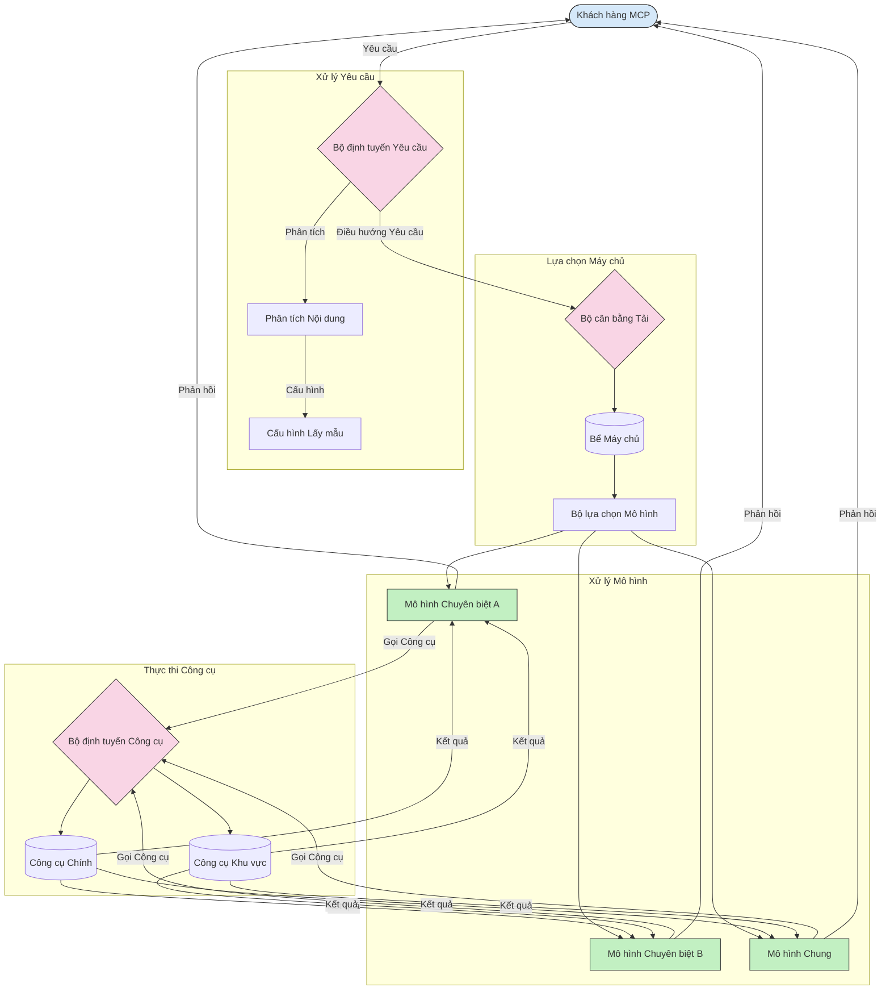

# Điều hướng trong Giao thức Ngữ cảnh Mô hình

Điều hướng là yếu tố thiết yếu để định hướng các yêu cầu đến các mô hình, công cụ, hoặc dịch vụ phù hợp trong hệ sinh thái MCP.

## Giới thiệu

Điều hướng trong Giao thức Ngữ cảnh Mô hình (MCP) liên quan đến việc định hướng các yêu cầu đến các mô hình hoặc dịch vụ thích hợp nhất dựa trên các tiêu chí khác nhau như loại nội dung, ngữ cảnh người dùng và tải hệ thống. Điều này đảm bảo xử lý hiệu quả và tận dụng tài nguyên tối ưu.

## Mục tiêu học tập

Kết thúc bài học này, bạn sẽ có thể:

- Hiểu các nguyên tắc của điều hướng trong MCP.
- Triển khai điều hướng dựa trên nội dung để định hướng các yêu cầu đến các dịch vụ chuyên biệt.
- Áp dụng các chiến lược cân bằng tải thông minh để tối ưu hóa việc sử dụng tài nguyên.
- Triển khai điều hướng công cụ động dựa trên ngữ cảnh yêu cầu.

## Điều hướng dựa trên nội dung

Điều hướng dựa trên nội dung định hướng các yêu cầu đến các dịch vụ chuyên biệt dựa trên nội dung của yêu cầu. Ví dụ, các yêu cầu liên quan đến tạo mã có thể được điều hướng đến một mô hình mã chuyên biệt, trong khi các yêu cầu viết sáng tạo có thể được gửi đến một mô hình viết sáng tạo.

Hãy xem ví dụ triển khai trong các ngôn ngữ lập trình khác nhau.

<details>
<summary>.NET</summary>

```csharp
// .NET Example: Content-based routing in MCP
public class ContentBasedRouter
{
    private readonly Dictionary<string, McpClient> _specializedClients;
    private readonly RoutingClassifier _classifier;
    
    public ContentBasedRouter()
    {
        // Initialize specialized clients for different domains
        _specializedClients = new Dictionary<string, McpClient>
        {
            ["code"] = new McpClient("https://code-specialized-mcp.com"),
            ["creative"] = new McpClient("https://creative-specialized-mcp.com"),
            ["scientific"] = new McpClient("https://scientific-specialized-mcp.com"),
            ["general"] = new McpClient("https://general-mcp.com")
        };
        
        // Initialize content classifier
        _classifier = new RoutingClassifier();
    }
    
    public async Task<McpResponse> RouteAndProcessAsync(string prompt, IDictionary<string, object> parameters = null)
    {
        // Classify the prompt to determine the best specialized service
        string category = await _classifier.ClassifyPromptAsync(prompt);
        
        // Get the appropriate client or fall back to general
        var client = _specializedClients.ContainsKey(category) 
            ? _specializedClients[category] 
            : _specializedClients["general"];
            
        Console.WriteLine($"Routing request to {category} specialized service");
        
        // Send request to the selected service
        return await client.SendPromptAsync(prompt, parameters);
    }
    
    // Simple classifier for routing decisions
    private class RoutingClassifier
    {
        public Task<string> ClassifyPromptAsync(string prompt)
        {
            prompt = prompt.ToLowerInvariant();
            
            if (prompt.Contains("code") || prompt.Contains("function") || 
                prompt.Contains("program") || prompt.Contains("algorithm"))
            {
                return Task.FromResult("code");
            }
            
            if (prompt.Contains("story") || prompt.Contains("creative") || 
                prompt.Contains("imagine") || prompt.Contains("design"))
            {
                return Task.FromResult("creative");
            }
            
            if (prompt.Contains("science") || prompt.Contains("research") || 
                prompt.Contains("analyze") || prompt.Contains("study"))
            {
                return Task.FromResult("scientific");
            }
            
            return Task.FromResult("general");
        }
    }
}
```

Trong đoạn mã ở trên, chúng ta đã:

- Tạo một lớp `ContentBasedRouter` điều hướng các yêu cầu dựa trên nội dung của prompt.
- Khởi tạo các client chuyên biệt cho các lĩnh vực khác nhau (mã, sáng tạo, khoa học, tổng quát).
- Triển khai một bộ phân loại đơn giản để xác định hạng mục của prompt và điều hướng nó đến dịch vụ chuyên biệt phù hợp.
- Sử dụng cơ chế dự phòng để điều hướng các yêu cầu đến dịch vụ tổng quát nếu không có dịch vụ chuyên biệt nào sẵn có.
- Triển khai xử lý bất đồng bộ để xử lý các yêu cầu hiệu quả.
- Sử dụng dictionary để ánh xạ các hạng mục nội dung đến các client MCP chuyên biệt.
- Triển khai một bộ phân loại đơn giản phân tích prompt và trả về hạng mục phù hợp.
- Sử dụng client chuyên biệt để gửi yêu cầu và nhận phản hồi.
- Xử lý các trường hợp prompt không khớp với bất kỳ hạng mục chuyên biệt nào bằng cách điều hướng đến dịch vụ tổng quát.

</details>

## Cân bằng tải thông minh

Cân bằng tải tối ưu hóa việc sử dụng tài nguyên và đảm bảo tính khả dụng cao cho các dịch vụ MCP. Có nhiều cách để triển khai cân bằng tải, chẳng hạn như vòng tròn (round-robin), thời gian phản hồi có trọng số, hoặc chiến lược nhận biết nội dung.

Hãy xem ví dụ triển khai dưới đây sử dụng các chiến lược sau:

- **Vòng tròn (Round Robin)**: Phân phối yêu cầu đều trên các máy chủ có sẵn.
- **Thời gian phản hồi có trọng số**: Điều hướng các yêu cầu đến các máy chủ dựa trên thời gian phản hồi trung bình của họ.
- **Nhận biết nội dung (Content-Aware)**: Điều hướng các yêu cầu đến các máy chủ chuyên biệt dựa trên nội dung của yêu cầu.

<details>
<summary>Java</summary>

```java
// Ví dụ Java: Cân bằng tải thông minh cho các máy chủ MCP
public class McpLoadBalancer {
    private final List<McpServerNode> serverNodes;
    private final LoadBalancingStrategy strategy;
    
    public McpLoadBalancer(List<McpServerNode> nodes, LoadBalancingStrategy strategy) {
        this.serverNodes = new ArrayList<>(nodes);
        this.strategy = strategy;
    }
    
    public McpResponse processRequest(McpRequest request) {
        // Chọn máy chủ tốt nhất dựa trên chiến lược
        McpServerNode selectedNode = strategy.selectNode(serverNodes, request);
        
        try {
            // Điều hướng yêu cầu đến nút đã chọn
            return selectedNode.processRequest(request);
        } catch (Exception e) {
            // Xử lý lỗi - triển khai logic thử lại hoặc dự phòng
            System.err.println("Error processing request on node " + selectedNode.getId() + ": " + e.getMessage());
            
            // Đánh dấu nút như có thể không khỏe mạnh
            selectedNode.recordFailure();
            
            // Thử nút tốt tiếp theo làm phương án dự phòng
            List<McpServerNode> remainingNodes = new ArrayList<>(serverNodes);
            remainingNodes.remove(selectedNode);
            
            if (!remainingNodes.isEmpty()) {
                McpServerNode fallbackNode = strategy.selectNode(remainingNodes, request);
                return fallbackNode.processRequest(request);
            } else {
                throw new RuntimeException("All MCP server nodes failed to process the request");
            }
        }
    }
    
    // Nhiệm vụ kiểm tra sức khỏe nút
    public void startHealthChecks(Duration interval) {
        ScheduledExecutorService scheduler = Executors.newScheduledThreadPool(1);
        scheduler.scheduleAtFixedRate(() -> {
            for (McpServerNode node : serverNodes) {
                try {
                    boolean isHealthy = node.checkHealth();
                    System.out.println("Node " + node.getId() + " health status: " + 
                                      (isHealthy ? "HEALTHY" : "UNHEALTHY"));
                } catch (Exception e) {
                    System.err.println("Health check failed for node " + node.getId());
                    node.setHealthy(false);
                }
            }
        }, 0, interval.toMillis(), TimeUnit.MILLISECONDS);
    }
    
    // Giao diện cho các chiến lược cân bằng tải
    public interface LoadBalancingStrategy {
        McpServerNode selectNode(List<McpServerNode> nodes, McpRequest request);
    }
    
    // Chiến lược luân phiên
    public static class RoundRobinStrategy implements LoadBalancingStrategy {
        private AtomicInteger counter = new AtomicInteger(0);
        
        @Override
        public McpServerNode selectNode(List<McpServerNode> nodes, McpRequest request) {
            List<McpServerNode> healthyNodes = nodes.stream()
                .filter(McpServerNode::isHealthy)
                .collect(Collectors.toList());
            
            if (healthyNodes.isEmpty()) {
                throw new RuntimeException("No healthy nodes available");
            }
            
            int index = counter.getAndIncrement() % healthyNodes.size();
            return healthyNodes.get(index);
        }
    }
    
    // Chiến lược thời gian phản hồi có trọng số
    public static class ResponseTimeStrategy implements LoadBalancingStrategy {
        @Override
        public McpServerNode selectNode(List<McpServerNode> nodes, McpRequest request) {
            return nodes.stream()
                .filter(McpServerNode::isHealthy)
                .min(Comparator.comparing(McpServerNode::getAverageResponseTime))
                .orElseThrow(() -> new RuntimeException("No healthy nodes available"));
        }
    }
    
    // Chiến lược nhận biết nội dung
    public static class ContentAwareStrategy implements LoadBalancingStrategy {
        @Override
        public McpServerNode selectNode(List<McpServerNode> nodes, McpRequest request) {
            // Xác định đặc điểm yêu cầu
            boolean isCodeRequest = request.getPrompt().contains("code") || 
                                   request.getAllowedTools().contains("codeInterpreter");
            
            boolean isCreativeRequest = request.getPrompt().contains("creative") || 
                                       request.getPrompt().contains("story");
            
            // Tìm các nút chuyên biệt
            Optional<McpServerNode> specializedNode = nodes.stream()
                .filter(McpServerNode::isHealthy)
                .filter(node -> {
                    if (isCodeRequest && node.getSpecialization().equals("code")) {
                        return true;
                    }
                    if (isCreativeRequest && node.getSpecialization().equals("creative")) {
                        return true;
                    }
                    return false;
                })
                .findFirst();
            
            // Trả về nút chuyên biệt hoặc nút tải nhẹ nhất
            return specializedNode.orElse(
                nodes.stream()
                    .filter(McpServerNode::isHealthy)
                    .min(Comparator.comparing(McpServerNode::getCurrentLoad))
                    .orElseThrow(() -> new RuntimeException("No healthy nodes available"))
            );
        }
    }
}
```

Trong đoạn mã ở trên, chúng ta đã:

- Tạo một lớp `McpLoadBalancer` quản lý danh sách các nút máy chủ MCP và điều hướng các yêu cầu dựa trên chiến lược cân bằng tải được chọn.
- Triển khai các chiến lược cân bằng tải khác nhau: `RoundRobinStrategy`, `ResponseTimeStrategy`, và `ContentAwareStrategy`.
- Sử dụng `ScheduledExecutorService` để kiểm tra sức khỏe các nút máy chủ định kỳ.
- Triển khai cơ chế kiểm tra sức khỏe đánh dấu các nút là khỏe mạnh hoặc không khỏe mạnh dựa trên phản hồi kiểm tra sức khỏe.
- Xử lý việc xử lý yêu cầu với quản lý lỗi và logic dự phòng để đảm bảo tính khả dụng cao.
- Sử dụng lớp `McpServerNode` để biểu diễn các nút máy chủ MCP riêng lẻ, bao gồm trạng thái sức khỏe, thời gian phản hồi trung bình, và tải hiện tại.
- Triển khai lớp `McpRequest` để đóng gói chi tiết yêu cầu như prompt và công cụ được phép sử dụng.
- Sử dụng Java Streams để lọc và chọn các nút dựa trên trạng thái sức khỏe và chuyên môn.

</details>

## Điều hướng công cụ động

Điều hướng công cụ đảm bảo các cuộc gọi công cụ được định hướng đến dịch vụ phù hợp nhất dựa trên ngữ cảnh. Ví dụ, một cuộc gọi công cụ thời tiết có thể cần được điều hướng đến điểm cuối khu vực dựa trên vị trí người dùng, hoặc một công cụ máy tính có thể cần sử dụng một phiên bản API cụ thể.

Hãy xem ví dụ triển khai minh họa điều hướng công cụ động dựa trên phân tích yêu cầu, các điểm cuối khu vực, và hỗ trợ phiên bản.

<details>
<summary>Python</summary>

```python
# Ví dụ Python: Định tuyến công cụ động dựa trên phân tích yêu cầu
class McpToolRouter:
    def __init__(self):
        # Đăng ký các điểm cuối công cụ có sẵn
        self.tool_endpoints = {
            "weatherTool": "https://weather-service.example.com/api",
            "calculatorTool": "https://calculator-service.example.com/compute",
            "databaseTool": "https://database-service.example.com/query",
            "searchTool": "https://search-service.example.com/search"
        }
        
        # Điểm cuối khu vực cho phân phối toàn cầu
        self.regional_endpoints = {
            "us": {
                "weatherTool": "https://us-west.weather-service.example.com/api",
                "searchTool": "https://us.search-service.example.com/search"
            },
            "europe": {
                "weatherTool": "https://eu.weather-service.example.com/api",
                "searchTool": "https://eu.search-service.example.com/search"
            },
            "asia": {
                "weatherTool": "https://asia.weather-service.example.com/api",
                "searchTool": "https://asia.search-service.example.com/search"
            }
        }
        
        # Hỗ trợ phiên bản công cụ
        self.tool_versions = {
            "weatherTool": {
                "default": "v2",
                "v1": "https://weather-service.example.com/api/v1",
                "v2": "https://weather-service.example.com/api/v2",
                "beta": "https://weather-service.example.com/api/beta"
            }
        }
    
    async def route_tool_request(self, tool_name, parameters, user_context=None):
        """Route a tool request to the appropriate endpoint based on context"""
        endpoint = self._select_endpoint(tool_name, parameters, user_context)
        
        if not endpoint:
            raise ValueError(f"No endpoint available for tool: {tool_name}")
        
        # Thực hiện yêu cầu thực tế đến điểm cuối được chọn
        return await self._execute_tool_request(endpoint, tool_name, parameters)
    
    def _select_endpoint(self, tool_name, parameters, user_context=None):
        """Select the most appropriate endpoint based on context"""
        # Điểm cuối cơ sở từ đăng ký
        if tool_name not in self.tool_endpoints:
            return None
            
        base_endpoint = self.tool_endpoints[tool_name]
        
        # Kiểm tra xem chúng ta có cần sử dụng phiên bản công cụ cụ thể không
        if tool_name in self.tool_versions:
            version_info = self.tool_versions[tool_name]
            
            # Sử dụng phiên bản được chỉ định hoặc mặc định
            requested_version = parameters.get("_version", version_info["default"])
            if requested_version in version_info:
                base_endpoint = version_info[requested_version]
        
        # Kiểm tra định tuyến khu vực nếu biết vùng người dùng
        if user_context and "region" in user_context:
            user_region = user_context["region"]
            
            if user_region in self.regional_endpoints:
                regional_tools = self.regional_endpoints[user_region]
                
                if tool_name in regional_tools:
                    # Sử dụng điểm cuối theo vùng
                    return regional_tools[tool_name]
        
        # Kiểm tra yêu cầu lưu trú dữ liệu
        if user_context and "data_residency" in user_context:
            # Điều này sẽ triển khai logic để đảm bảo dữ liệu nằm trong quyền tài phán quy định
            pass
        
        # Kiểm tra định tuyến dựa trên độ trễ
        if user_context and "latency_sensitive" in user_context and user_context["latency_sensitive"]:
            # Điều này sẽ triển khai logic để chọn điểm cuối có độ trễ thấp nhất
            pass
            
        return base_endpoint
        
    async def _execute_tool_request(self, endpoint, tool_name, parameters):
        """Execute the actual tool request to the selected endpoint"""
        try:
            async with aiohttp.ClientSession() as session:
                async with session.post(
                    endpoint,
                    json={"toolName": tool_name, "parameters": parameters},
                    headers={"Content-Type": "application/json"}
                ) as response:
                    if response.status == 200:
                        result = await response.json()
                        return result
                    else:
                        error_text = await response.text()
                        raise Exception(f"Tool execution failed: {error_text}")
        except Exception as e:
            # Triển khai logic thử lại hoặc chiến lược dự phòng
            print(f"Error executing tool {tool_name} at {endpoint}: {str(e)}")
            raise
```

Trong đoạn mã ở trên, chúng ta đã:

- Tạo một lớp `McpToolRouter` quản lý điều hướng công cụ dựa trên phân tích yêu cầu, các điểm cuối khu vực, và hỗ trợ phiên bản.
- Đăng ký các điểm cuối công cụ có sẵn và các điểm cuối khu vực cho phân phối toàn cầu.
- Triển khai logic điều hướng động lựa chọn điểm cuối phù hợp dựa trên ngữ cảnh người dùng, như khu vực và yêu cầu lưu trữ dữ liệu.
- Triển khai hỗ trợ phiên bản cho các công cụ, cho phép người dùng chỉ định phiên bản công cụ muốn sử dụng.
- Sử dụng các yêu cầu HTTP bất đồng bộ để thực thi các cuộc gọi công cụ và xử lý phản hồi.

</details>

## Kiến trúc Lấy mẫu và Điều hướng trong MCP

Lấy mẫu là một thành phần quan trọng của Giao thức Ngữ cảnh Mô hình (MCP) cho phép xử lý và điều hướng yêu cầu hiệu quả. Nó liên quan đến việc phân tích các yêu cầu đến để xác định mô hình hoặc dịch vụ phù hợp nhất để xử lý, dựa trên các tiêu chí khác nhau như loại nội dung, ngữ cảnh người dùng và tải hệ thống.

Lấy mẫu và điều hướng có thể được kết hợp để tạo ra một kiến trúc vững chắc tối ưu hóa việc sử dụng tài nguyên và đảm bảo tính khả dụng cao. Quá trình lấy mẫu có thể được sử dụng để phân loại các yêu cầu, trong khi điều hướng sẽ định hướng chúng đến các mô hình hoặc dịch vụ phù hợp.

Sơ đồ dưới đây minh họa cách lấy mẫu và điều hướng hoạt động cùng nhau trong một kiến trúc MCP toàn diện:



## Tiếp theo

- [5.6 Sampling](../mcp-sampling/README.md)

---

<!-- CO-OP TRANSLATOR DISCLAIMER START -->
**Tuyên bố miễn trừ trách nhiệm**:
Tài liệu này đã được dịch bằng dịch vụ dịch thuật AI [Co-op Translator](https://github.com/Azure/co-op-translator). Mặc dù chúng tôi cố gắng đảm bảo độ chính xác, xin lưu ý rằng bản dịch tự động có thể chứa lỗi hoặc sai sót. Tài liệu gốc bằng ngôn ngữ gốc nên được coi là nguồn tin chính thức. Đối với thông tin quan trọng, nên sử dụng dịch vụ dịch thuật chuyên nghiệp bởi con người. Chúng tôi không chịu trách nhiệm về bất kỳ hiểu lầm hoặc giải thích sai nào phát sinh từ việc sử dụng bản dịch này.
<!-- CO-OP TRANSLATOR DISCLAIMER END -->