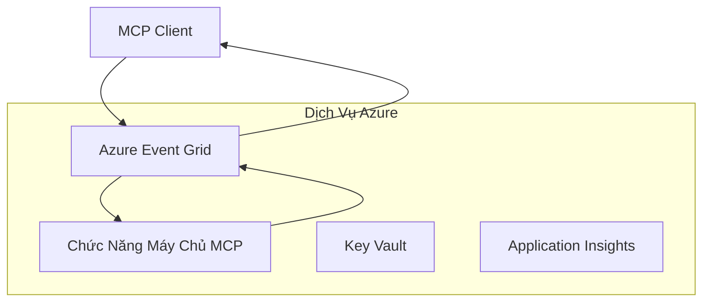
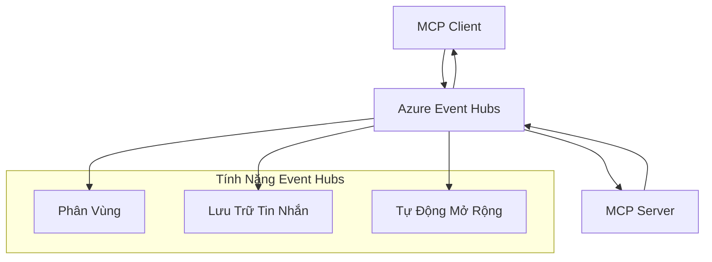

# MCP Custom Transports - Hướng Dẫn Triển Khai Nâng Cao

Model Context Protocol (MCP) cung cấp sự linh hoạt trong các cơ chế truyền tải, cho phép triển khai tùy chỉnh cho các môi trường doanh nghiệp chuyên biệt. Hướng dẫn nâng cao này khám phá các triển khai truyền tải tùy chỉnh sử dụng Azure Event Grid và Azure Event Hubs như các ví dụ thực tế để xây dựng các giải pháp MCP có khả năng mở rộng và bản địa trên đám mây.

> **Nhìn về phía trước:** hướng dẫn này viết dựa trên **MCP Specification 2025-11-25**, trong đó thứ tự phiên làm việc phải được bảo toàn theo từng phiên (xem Giao Thức Tin Nhắn bên dưới). Phiên bản thử nghiệm `2026-07-28` loại bỏ hoàn toàn phiên ở cấp giao thức và yêu cầu các header `Mcp-Method`/`Mcp-Name` để các cổng và truyền tải tùy chỉnh có thể định tuyến theo từng yêu cầu thay vì theo phiên. Xem thêm [Có gì thay đổi trong MCP: Phiên bản thử nghiệm 2026-07-28](../../01-CoreConcepts/mcp-2026-07-28-release-candidate.md).

## Giới thiệu

Trong khi các truyền tải tiêu chuẩn của MCP (stdio và HTTP streaming) phục vụ hầu hết các trường hợp sử dụng, các môi trường doanh nghiệp thường yêu cầu các cơ chế truyền tải chuyên biệt để cải thiện khả năng mở rộng, độ tin cậy và tích hợp với hạ tầng đám mây hiện có. Truyền tải tùy chỉnh cho phép MCP tận dụng các dịch vụ nhắn tin bản địa đám mây để giao tiếp bất đồng bộ, kiến trúc hướng sự kiện và xử lý phân tán.

Bài học này khám phá các triển khai truyền tải nâng cao dựa trên tiêu chuẩn MCP mới nhất (2025-11-25), dịch vụ nhắn tin Azure và các mẫu tích hợp doanh nghiệp được thiết lập.

### **Kiến Trúc Truyền Tải MCP**

**Trích từ MCP Specification (2025-11-25):**

- **Truyền tải tiêu chuẩn**: stdio (khuyến nghị), HTTP streaming (cho các trường hợp từ xa)
- **Truyền tải tùy chỉnh**: Bất kỳ truyền tải nào triển khai giao thức trao đổi tin nhắn MCP
- **Định dạng tin nhắn**: JSON-RPC 2.0 với các phần mở rộng đặc thù MCP
- **Giao tiếp hai chiều**: Yêu cầu truyền thông song công đầy đủ cho thông báo và phản hồi

## Mục tiêu học tập

Sau bài học nâng cao này, bạn sẽ có thể:

- **Hiểu các yêu cầu truyền tải tùy chỉnh**: Triển khai giao thức MCP qua bất kỳ lớp truyền tải nào trong khi đảm bảo tuân thủ
- **Xây dựng truyền tải Azure Event Grid**: Tạo các máy chủ MCP hướng sự kiện sử dụng Azure Event Grid để có khả năng mở rộng không máy chủ
- **Triển khai truyền tải Azure Event Hubs**: Thiết kế giải pháp MCP thông lượng cao sử dụng Azure Event Hubs cho streaming thời gian thực
- **Áp dụng các mẫu doanh nghiệp**: Tích hợp truyền tải tùy chỉnh với hạ tầng Azure và mô hình bảo mật hiện có
- **Xử lý độ tin cậy truyền tải**: Triển khai tính bền vững tin nhắn, bảo toàn thứ tự và xử lý lỗi cho các kịch bản doanh nghiệp
- **Tối ưu hiệu suất**: Thiết kế giải pháp truyền tải đáp ứng yêu cầu về quy mô, độ trễ và thông lượng

## **Yêu cầu truyền tải**

### **Yêu cầu cốt lõi từ MCP Specification (2025-11-25):**

```yaml
Message Protocol:
  format: "JSON-RPC 2.0 with MCP extensions"
  bidirectional: "Full duplex communication required"
  ordering: "Message ordering must be preserved per session"
  
Transport Layer:
  reliability: "Transport MUST handle connection failures gracefully"
  security: "Transport MUST support secure communication"
  identification: "Each session MUST have unique identifier"
  
Custom Transport:
  compliance: "MUST implement complete MCP message exchange"
  extensibility: "MAY add transport-specific features"
  interoperability: "MUST maintain protocol compatibility"
```

## **Triển khai Truyền tải Azure Event Grid**

Azure Event Grid cung cấp dịch vụ định tuyến sự kiện không máy chủ lý tưởng cho kiến trúc MCP hướng sự kiện. Triển khai này minh họa cách xây dựng hệ thống MCP có khả năng mở rộng, kết nối lỏng lẻo.

### **Tổng quan Kiến trúc**



### **Triển khai C# - Truyền tải Event Grid**

```csharp
using Azure.Messaging.EventGrid;
using Microsoft.Extensions.Azure;
using System.Text.Json;

public class EventGridMcpTransport : IMcpTransport
{
    private readonly EventGridPublisherClient _publisher;
    private readonly string _topicEndpoint;
    private readonly string _clientId;
    
    public EventGridMcpTransport(string topicEndpoint, string accessKey, string clientId)
    {
        _publisher = new EventGridPublisherClient(
            new Uri(topicEndpoint), 
            new AzureKeyCredential(accessKey));
        _topicEndpoint = topicEndpoint;
        _clientId = clientId;
    }
    
    public async Task SendMessageAsync(McpMessage message)
    {
        var eventGridEvent = new EventGridEvent(
            subject: $"mcp/{_clientId}",
            eventType: "MCP.MessageReceived",
            dataVersion: "1.0",
            data: JsonSerializer.Serialize(message))
        {
            Id = Guid.NewGuid().ToString(),
            EventTime = DateTimeOffset.UtcNow
        };
        
        await _publisher.SendEventAsync(eventGridEvent);
    }
    
    public async Task<McpMessage> ReceiveMessageAsync(CancellationToken cancellationToken)
    {
        // Event Grid is push-based, so implement webhook receiver
        // This would typically be handled by Azure Functions trigger
        throw new NotImplementedException("Use EventGridTrigger in Azure Functions");
    }
}

// Azure Function for receiving Event Grid events
[FunctionName("McpEventGridReceiver")]
public async Task<IActionResult> HandleEventGridMessage(
    [EventGridTrigger] EventGridEvent eventGridEvent,
    ILogger log)
{
    try
    {
        var mcpMessage = JsonSerializer.Deserialize<McpMessage>(
            eventGridEvent.Data.ToString());
        
        // Process MCP message
        var response = await _mcpServer.ProcessMessageAsync(mcpMessage);
        
        // Send response back via Event Grid
        await _transport.SendMessageAsync(response);
        
        return new OkResult();
    }
    catch (Exception ex)
    {
        log.LogError(ex, "Error processing Event Grid MCP message");
        return new BadRequestResult();
    }
}
```

### **Triển khai TypeScript - Truyền tải Event Grid**

```typescript
import { EventGridPublisherClient, AzureKeyCredential } from "@azure/eventgrid";
import { McpTransport, McpMessage } from "./mcp-types";

export class EventGridMcpTransport implements McpTransport {
    private publisher: EventGridPublisherClient;
    private clientId: string;
    
    constructor(
        private topicEndpoint: string,
        private accessKey: string,
        clientId: string
    ) {
        this.publisher = new EventGridPublisherClient(
            topicEndpoint,
            new AzureKeyCredential(accessKey)
        );
        this.clientId = clientId;
    }
    
    async sendMessage(message: McpMessage): Promise<void> {
        const event = {
            id: crypto.randomUUID(),
            source: `mcp-client-${this.clientId}`,
            type: "MCP.MessageReceived",
            time: new Date(),
            data: message
        };
        
        await this.publisher.sendEvents([event]);
    }
    
    // Nhận sự kiện theo sự kiện qua Azure Functions
    onMessage(handler: (message: McpMessage) => Promise<void>): void {
        // Việc triển khai sẽ sử dụng Azure Functions Event Grid trigger
        // Đây là giao diện khái niệm cho bộ nhận webhook
    }
}

// Triển khai Azure Functions
import { app, InvocationContext, EventGridEvent } from "@azure/functions";

app.eventGrid("mcpEventGridHandler", {
    handler: async (event: EventGridEvent, context: InvocationContext) => {
        try {
            const mcpMessage = event.data as McpMessage;
            
            // Xử lý tin nhắn MCP
            const response = await mcpServer.processMessage(mcpMessage);
            
            // Gửi phản hồi qua Event Grid
            await transport.sendMessage(response);
            
        } catch (error) {
            context.error("Error processing MCP message:", error);
            throw error;
        }
    }
});
```

### **Triển khai Python - Truyền tải Event Grid**

```python
from azure.eventgrid import EventGridPublisherClient, EventGridEvent
from azure.core.credentials import AzureKeyCredential
import asyncio
import json
from typing import Callable, Optional
import uuid
from datetime import datetime

class EventGridMcpTransport:
    def __init__(self, topic_endpoint: str, access_key: str, client_id: str):
        self.client = EventGridPublisherClient(
            topic_endpoint, 
            AzureKeyCredential(access_key)
        )
        self.client_id = client_id
        self.message_handler: Optional[Callable] = None
    
    async def send_message(self, message: dict) -> None:
        """Send MCP message via Event Grid"""
        event = EventGridEvent(
            data=message,
            subject=f"mcp/{self.client_id}",
            event_type="MCP.MessageReceived",
            data_version="1.0"
        )
        
        await self.client.send(event)
    
    def on_message(self, handler: Callable[[dict], None]) -> None:
        """Register message handler for incoming events"""
        self.message_handler = handler

# Triển khai Azure Functions
import azure.functions as func
import logging

def main(event: func.EventGridEvent) -> None:
    """Azure Functions Event Grid trigger for MCP messages"""
    try:
        # Phân tích thông điệp MCP từ sự kiện Event Grid
        mcp_message = json.loads(event.get_body().decode('utf-8'))
        
        # Xử lý thông điệp MCP
        response = process_mcp_message(mcp_message)
        
        # Gửi phản hồi trở lại qua Event Grid
        # (Triển khai sẽ tạo client Event Grid mới)
        
    except Exception as e:
        logging.error(f"Error processing MCP Event Grid message: {e}")
        raise
```

## **Triển khai Truyền tải Azure Event Hubs**

Azure Event Hubs cung cấp khả năng streaming thời gian thực với thông lượng cao cho các kịch bản MCP yêu cầu độ trễ thấp và lưu lượng tin nhắn lớn.

### **Tổng quan Kiến trúc**



### **Triển khai C# - Truyền tải Event Hubs**

```csharp
using Azure.Messaging.EventHubs;
using Azure.Messaging.EventHubs.Producer;
using Azure.Messaging.EventHubs.Consumer;
using System.Text;

public class EventHubsMcpTransport : IMcpTransport, IDisposable
{
    private readonly EventHubProducerClient _producer;
    private readonly EventHubConsumerClient _consumer;
    private readonly string _consumerGroup;
    private readonly CancellationTokenSource _cancellationTokenSource;
    
    public EventHubsMcpTransport(
        string connectionString, 
        string eventHubName,
        string consumerGroup = "$Default")
    {
        _producer = new EventHubProducerClient(connectionString, eventHubName);
        _consumer = new EventHubConsumerClient(
            consumerGroup, 
            connectionString, 
            eventHubName);
        _consumerGroup = consumerGroup;
        _cancellationTokenSource = new CancellationTokenSource();
    }
    
    public async Task SendMessageAsync(McpMessage message)
    {
        var messageBody = JsonSerializer.Serialize(message);
        var eventData = new EventData(Encoding.UTF8.GetBytes(messageBody));
        
        // Add MCP-specific properties
        eventData.Properties.Add("MessageType", message.Method ?? "response");
        eventData.Properties.Add("MessageId", message.Id);
        eventData.Properties.Add("Timestamp", DateTimeOffset.UtcNow);
        
        await _producer.SendAsync(new[] { eventData });
    }
    
    public async Task StartReceivingAsync(
        Func<McpMessage, Task> messageHandler)
    {
        await foreach (PartitionEvent partitionEvent in _consumer.ReadEventsAsync(
            _cancellationTokenSource.Token))
        {
            try
            {
                var messageBody = Encoding.UTF8.GetString(
                    partitionEvent.Data.EventBody.ToArray());
                var mcpMessage = JsonSerializer.Deserialize<McpMessage>(messageBody);
                
                await messageHandler(mcpMessage);
            }
            catch (Exception ex)
            {
                // Handle deserialization or processing errors
                Console.WriteLine($"Error processing message: {ex.Message}");
            }
        }
    }
    
    public void Dispose()
    {
        _cancellationTokenSource?.Cancel();
        _producer?.DisposeAsync().AsTask().Wait();
        _consumer?.DisposeAsync().AsTask().Wait();
        _cancellationTokenSource?.Dispose();
    }
}
```

### **Triển khai TypeScript - Truyền tải Event Hubs**

```typescript
import { 
    EventHubProducerClient, 
    EventHubConsumerClient, 
    EventData 
} from "@azure/event-hubs";

export class EventHubsMcpTransport implements McpTransport {
    private producer: EventHubProducerClient;
    private consumer: EventHubConsumerClient;
    private isReceiving = false;
    
    constructor(
        private connectionString: string,
        private eventHubName: string,
        private consumerGroup: string = "$Default"
    ) {
        this.producer = new EventHubProducerClient(
            connectionString, 
            eventHubName
        );
        this.consumer = new EventHubConsumerClient(
            consumerGroup,
            connectionString,
            eventHubName
        );
    }
    
    async sendMessage(message: McpMessage): Promise<void> {
        const eventData: EventData = {
            body: JSON.stringify(message),
            properties: {
                messageType: message.method || "response",
                messageId: message.id,
                timestamp: new Date().toISOString()
            }
        };
        
        await this.producer.sendBatch([eventData]);
    }
    
    async startReceiving(
        messageHandler: (message: McpMessage) => Promise<void>
    ): Promise<void> {
        if (this.isReceiving) return;
        
        this.isReceiving = true;
        
        const subscription = this.consumer.subscribe({
            processEvents: async (events, context) => {
                for (const event of events) {
                    try {
                        const messageBody = event.body as string;
                        const mcpMessage: McpMessage = JSON.parse(messageBody);
                        
                        await messageHandler(mcpMessage);
                        
                        // Cập nhật điểm kiểm tra cho giao hàng ít nhất một lần
                        await context.updateCheckpoint(event);
                    } catch (error) {
                        console.error("Error processing Event Hubs message:", error);
                    }
                }
            },
            processError: async (err, context) => {
                console.error("Event Hubs error:", err);
            }
        });
    }
    
    async close(): Promise<void> {
        this.isReceiving = false;
        await this.producer.close();
        await this.consumer.close();
    }
}
```

### **Triển khai Python - Truyền tải Event Hubs**

```python
from azure.eventhub import EventHubProducerClient, EventHubConsumerClient
from azure.eventhub import EventData
import json
import asyncio
from typing import Callable, Dict, Any
import logging

class EventHubsMcpTransport:
    def __init__(
        self, 
        connection_string: str, 
        eventhub_name: str,
        consumer_group: str = "$Default"
    ):
        self.producer = EventHubProducerClient.from_connection_string(
            connection_string, 
            eventhub_name=eventhub_name
        )
        self.consumer = EventHubConsumerClient.from_connection_string(
            connection_string,
            consumer_group=consumer_group,
            eventhub_name=eventhub_name
        )
        self.is_receiving = False
    
    async def send_message(self, message: Dict[str, Any]) -> None:
        """Send MCP message via Event Hubs"""
        event_data = EventData(json.dumps(message))
        
        # Thêm các thuộc tính riêng cho MCP
        event_data.properties = {
            "messageType": message.get("method", "response"),
            "messageId": message.get("id"),
            "timestamp": "2025-01-14T10:30:00Z"  # Sử dụng dấu thời gian thực tế
        }
        
        async with self.producer:
            event_data_batch = await self.producer.create_batch()
            event_data_batch.add(event_data)
            await self.producer.send_batch(event_data_batch)
    
    async def start_receiving(
        self, 
        message_handler: Callable[[Dict[str, Any]], None]
    ) -> None:
        """Start receiving MCP messages from Event Hubs"""
        if self.is_receiving:
            return
        
        self.is_receiving = True
        
        async with self.consumer:
            await self.consumer.receive(
                on_event=self._on_event_received(message_handler),
                starting_position="-1"  # Bắt đầu từ đầu
            )
    
    def _on_event_received(self, handler: Callable):
        """Internal event handler wrapper"""
        async def handle_event(partition_context, event):
            try:
                # Phân tích thông điệp MCP từ sự kiện Event Hubs
                message_body = event.body_as_str(encoding='UTF-8')
                mcp_message = json.loads(message_body)
                
                # Xử lý thông điệp MCP
                await handler(mcp_message)
                
                # Cập nhật điểm kiểm tra để giao hàng ít nhất một lần
                await partition_context.update_checkpoint(event)
                
            except Exception as e:
                logging.error(f"Error processing Event Hubs message: {e}")
        
        return handle_event
    
    async def close(self) -> None:
        """Clean up transport resources"""
        self.is_receiving = False
        await self.producer.close()
        await self.consumer.close()
```

## **Mẫu truyền tải nâng cao**

### **Tính bền vững và độ tin cậy tin nhắn**

```csharp
// Implementing message durability with retry logic
public class ReliableTransportWrapper : IMcpTransport
{
    private readonly IMcpTransport _innerTransport;
    private readonly RetryPolicy _retryPolicy;
    
    public async Task SendMessageAsync(McpMessage message)
    {
        await _retryPolicy.ExecuteAsync(async () =>
        {
            try
            {
                await _innerTransport.SendMessageAsync(message);
            }
            catch (TransportException ex) when (ex.IsRetryable)
            {
                // Log and retry
                throw;
            }
        });
    }
}
```

### **Tích hợp bảo mật truyền tải**

```csharp
// Integrating Azure Key Vault for transport security
public class SecureTransportFactory
{
    private readonly SecretClient _keyVaultClient;
    
    public async Task<IMcpTransport> CreateEventGridTransportAsync()
    {
        var accessKey = await _keyVaultClient.GetSecretAsync("EventGridAccessKey");
        var topicEndpoint = await _keyVaultClient.GetSecretAsync("EventGridTopic");
        
        return new EventGridMcpTransport(
            topicEndpoint.Value.Value,
            accessKey.Value.Value,
            Environment.MachineName
        );
    }
}
```

### **Giám sát và quan sát truyền tải**

```csharp
// Adding telemetry to custom transports
public class ObservableTransport : IMcpTransport
{
    private readonly IMcpTransport _transport;
    private readonly ILogger _logger;
    private readonly TelemetryClient _telemetryClient;
    
    public async Task SendMessageAsync(McpMessage message)
    {
        using var activity = Activity.StartActivity("MCP.Transport.Send");
        activity?.SetTag("transport.type", "EventGrid");
        activity?.SetTag("message.method", message.Method);
        
        var stopwatch = Stopwatch.StartNew();
        
        try
        {
            await _transport.SendMessageAsync(message);
            
            _telemetryClient.TrackDependency(
                "EventGrid",
                "SendMessage",
                DateTime.UtcNow.Subtract(stopwatch.Elapsed),
                stopwatch.Elapsed,
                true
            );
        }
        catch (Exception ex)
        {
            _telemetryClient.TrackException(ex);
            throw;
        }
    }
}
```

## **Kịch bản tích hợp doanh nghiệp**

### **Kịch bản 1: Xử lý MCP phân tán**

Sử dụng Azure Event Grid để phân phối các yêu cầu MCP qua nhiều nút xử lý:

```yaml
Architecture:
  - MCP Client sends requests to Event Grid topic
  - Multiple Azure Functions subscribe to process different tool types
  - Results aggregated and returned via separate response topic
  
Benefits:
  - Horizontal scaling based on message volume
  - Fault tolerance through redundant processors
  - Cost optimization with serverless compute
```

### **Kịch bản 2: Streaming MCP thời gian thực**

Sử dụng Azure Event Hubs cho các tương tác MCP tần suất cao:

```yaml
Architecture:
  - MCP Client streams continuous requests via Event Hubs
  - Stream Analytics processes and routes messages
  - Multiple consumers handle different aspect of processing
  
Benefits:
  - Low latency for real-time scenarios
  - High throughput for batch processing
  - Built-in partitioning for parallel processing
```

### **Kịch bản 3: Kiến trúc truyền tải lai**

Kết hợp nhiều truyền tải cho các trường hợp sử dụng khác nhau:

```csharp
public class HybridMcpTransport : IMcpTransport
{
    private readonly IMcpTransport _realtimeTransport; // Event Hubs
    private readonly IMcpTransport _batchTransport;    // Event Grid
    private readonly IMcpTransport _fallbackTransport; // HTTP Streaming
    
    public async Task SendMessageAsync(McpMessage message)
    {
        // Route based on message characteristics
        var transport = message.Method switch
        {
            "tools/call" when IsRealtime(message) => _realtimeTransport,
            "resources/read" when IsBatch(message) => _batchTransport,
            _ => _fallbackTransport
        };
        
        await transport.SendMessageAsync(message);
    }
}
```

## **Tối ưu hiệu suất**

### **Gộp tin nhắn cho Event Grid**

```csharp
public class BatchingEventGridTransport : IMcpTransport
{
    private readonly List<McpMessage> _messageBuffer = new();
    private readonly Timer _flushTimer;
    private const int MaxBatchSize = 100;
    
    public async Task SendMessageAsync(McpMessage message)
    {
        lock (_messageBuffer)
        {
            _messageBuffer.Add(message);
            
            if (_messageBuffer.Count >= MaxBatchSize)
            {
                _ = Task.Run(FlushMessages);
            }
        }
    }
    
    private async Task FlushMessages()
    {
        List<McpMessage> toSend;
        lock (_messageBuffer)
        {
            toSend = new List<McpMessage>(_messageBuffer);
            _messageBuffer.Clear();
        }
        
        if (toSend.Any())
        {
            var events = toSend.Select(CreateEventGridEvent);
            await _publisher.SendEventsAsync(events);
        }
    }
}
```

### **Chiến lược phân vùng cho Event Hubs**

```csharp
public class PartitionedEventHubsTransport : IMcpTransport
{
    public async Task SendMessageAsync(McpMessage message)
    {
        // Partition by client ID for session affinity
        var partitionKey = ExtractClientId(message);
        
        var eventData = new EventData(JsonSerializer.SerializeToUtf8Bytes(message))
        {
            PartitionKey = partitionKey
        };
        
        await _producer.SendAsync(new[] { eventData });
    }
}
```

## **Kiểm thử truyền tải tùy chỉnh**

### **Kiểm thử đơn vị với đối tượng thay thế**

```csharp
[Test]
public async Task EventGridTransport_SendMessage_PublishesCorrectEvent()
{
    // Arrange
    var mockPublisher = new Mock<EventGridPublisherClient>();
    var transport = new EventGridMcpTransport(mockPublisher.Object);
    var message = new McpMessage { Method = "tools/list", Id = "test-123" };
    
    // Act
    await transport.SendMessageAsync(message);
    
    // Assert
    mockPublisher.Verify(
        x => x.SendEventAsync(
            It.Is<EventGridEvent>(e => 
                e.EventType == "MCP.MessageReceived" &&
                e.Subject == "mcp/test-client"
            )
        ),
        Times.Once
    );
}
```

### **Kiểm thử tích hợp với Azure Test Containers**

```csharp
[Test]
public async Task EventHubsTransport_IntegrationTest()
{
    // Using Testcontainers for integration testing
    var eventHubsContainer = new EventHubsContainer()
        .WithEventHub("test-hub");
    
    await eventHubsContainer.StartAsync();
    
    var transport = new EventHubsMcpTransport(
        eventHubsContainer.GetConnectionString(),
        "test-hub"
    );
    
    // Test message round-trip
    var sentMessage = new McpMessage { Method = "test", Id = "123" };
    McpMessage receivedMessage = null;
    
    await transport.StartReceivingAsync(msg => {
        receivedMessage = msg;
        return Task.CompletedTask;
    });
    
    await transport.SendMessageAsync(sentMessage);
    await Task.Delay(1000); // Allow for message processing
    
    Assert.That(receivedMessage?.Id, Is.EqualTo("123"));
}
```

## **Thực hành tốt nhất và hướng dẫn**

### **Nguyên tắc thiết kế truyền tải**

1. **Tính idempotent**: Đảm bảo xử lý tin nhắn có thể lặp lại để xử lý trùng lặp
2. **Xử lý lỗi**: Triển khai xử lý lỗi toàn diện và hàng đợi thư chết
3. **Giám sát**: Thêm telemetry chi tiết và kiểm tra sức khỏe
4. **Bảo mật**: Sử dụng managed identities và quyền truy cập tối thiểu
5. **Hiệu suất**: Thiết kế theo yêu cầu độ trễ và thông lượng cụ thể của bạn

### **Khuyến nghị đặc thù Azure**

1. **Sử dụng Managed Identity**: Tránh dùng chuỗi kết nối trong môi trường sản xuất
2. **Triển khai Circuit Breakers**: Bảo vệ chống lại sự cố dịch vụ Azure
3. **Giám sát chi phí**: Theo dõi khối lượng tin nhắn và chi phí xử lý
4. **Lập kế hoạch cho quy mô**: Thiết kế chiến lược phân vùng và mở rộng sớm
5. **Kiểm thử kỹ lưỡng**: Sử dụng Azure DevTest Labs để kiểm thử toàn diện

## **Kết luận**

Các truyền tải MCP tùy chỉnh cho phép triển khai các kịch bản doanh nghiệp mạnh mẽ sử dụng dịch vụ nhắn tin Azure. Bằng cách triển khai truyền tải Event Grid hoặc Event Hubs, bạn có thể xây dựng các giải pháp MCP có khả năng mở rộng và đáng tin cậy, tích hợp liền mạch với hạ tầng Azure hiện có.

Các ví dụ cung cấp các mẫu sẵn sàng sử dụng trong sản xuất cho việc triển khai truyền tải tùy chỉnh đồng thời tuân thủ giao thức MCP và các thực hành tốt nhất của Azure.

## **Tài nguyên bổ sung**

- [MCP Specification 2025-11-25](https://modelcontextprotocol.io/specification/2025-11-25/)
- [Tài liệu Azure Event Grid](https://docs.microsoft.com/azure/event-grid/)
- [Tài liệu Azure Event Hubs](https://docs.microsoft.com/azure/event-hubs/)
- [Azure Functions Event Grid Trigger](https://docs.microsoft.com/azure/azure-functions/functions-bindings-event-grid)
- [Azure SDK cho .NET](https://github.com/Azure/azure-sdk-for-net)
- [Azure SDK cho TypeScript](https://github.com/Azure/azure-sdk-for-js)
- [Azure SDK cho Python](https://github.com/Azure/azure-sdk-for-python)

---

> *Hướng dẫn này tập trung vào các mẫu triển khai thực tiễn cho hệ thống MCP sản xuất. Luôn xác thực các triển khai truyền tải phù hợp với yêu cầu cụ thể và giới hạn dịch vụ Azure của bạn.*
> **Tiêu chuẩn hiện tại**: Hướng dẫn phản ánh [MCP Specification 2025-11-25](https://modelcontextprotocol.io/specification/2025-11-25/) các yêu cầu truyền tải và các mẫu truyền tải nâng cao cho môi trường doanh nghiệp.


## Tiếp theo
- [6. Đóng góp Cộng đồng](../../06-CommunityContributions/README.md)

---

<!-- CO-OP TRANSLATOR DISCLAIMER START -->
**Tuyên bố miễn trừ trách nhiệm**:
Tài liệu này đã được dịch bằng dịch vụ dịch thuật AI [Co-op Translator](https://github.com/Azure/co-op-translator). Mặc dù chúng tôi cố gắng đảm bảo độ chính xác, xin lưu ý rằng bản dịch tự động có thể chứa lỗi hoặc sai sót. Tài liệu gốc bằng ngôn ngữ gốc nên được coi là nguồn tin chính thức. Đối với thông tin quan trọng, nên sử dụng dịch vụ dịch thuật chuyên nghiệp bởi con người. Chúng tôi không chịu trách nhiệm về bất kỳ hiểu lầm hoặc giải thích sai nào phát sinh từ việc sử dụng bản dịch này.
<!-- CO-OP TRANSLATOR DISCLAIMER END -->