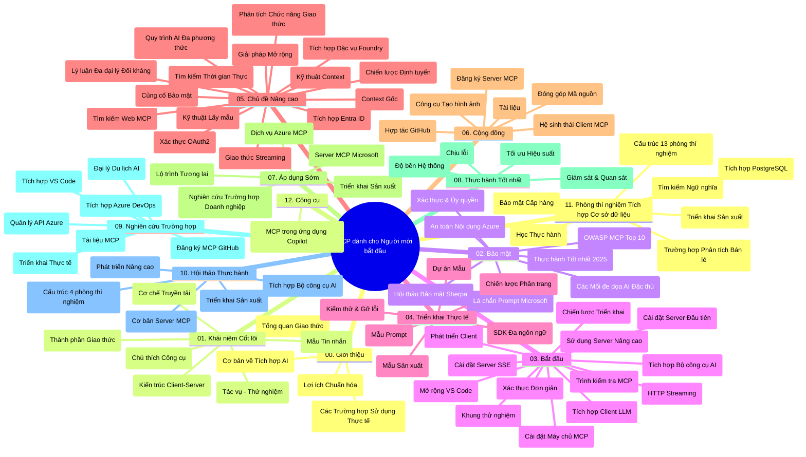

# Giao thức Bối cảnh Mô hình (MCP) cho Người mới bắt đầu - Hướng dẫn học

Hướng dẫn học này cung cấp tổng quan về cấu trúc và nội dung của kho lưu trữ cho chương trình "Giao thức Bối cảnh Mô hình (MCP) cho Người mới bắt đầu". Sử dụng hướng dẫn này để điều hướng kho lưu trữ một cách hiệu quả và tận dụng tối đa các tài nguyên có sẵn.

## Tổng quan kho lưu trữ

Giao thức Bối cảnh Mô hình (MCP) là một khuôn khổ chuẩn hóa cho các tương tác giữa các mô hình AI và ứng dụng khách. Ban đầu được tạo bởi Anthropic, MCP hiện được cộng đồng MCP rộng lớn hơn duy trì thông qua tổ chức chính thức trên GitHub. Kho lưu trữ này cung cấp một chương trình học toàn diện với các ví dụ mã thực hành bằng C#, Java, JavaScript, Python và TypeScript, thiết kế dành cho các nhà phát triển AI, kiến trúc sư hệ thống và kỹ sư phần mềm.

## Bản đồ chương trình học trực quan

## Cấu trúc kho lưu trữ

Kho lưu trữ được tổ chức thành mười hai phần chính, mỗi phần tập trung vào các khía cạnh khác nhau của MCP:

1. **Giới thiệu (00-Introduction/)**
   - Tổng quan về Giao thức Bối cảnh Mô hình
   - Tại sao việc chuẩn hóa lại quan trọng trong các pipeline AI
   - Các trường hợp sử dụng và lợi ích thực tiễn

2. **Khái niệm cốt lõi (01-CoreConcepts/)**
   - Kiến trúc khách-chủ
   - Các thành phần chính của giao thức
   - Các kiểu mẫu tin nhắn trong MCP
   - Nhìn về phía trước: [Những thay đổi trong MCP: Bản thử nghiệm phát hành 2026-07-28](./01-CoreConcepts/mcp-2026-07-28-release-candidate.md) — lõi giao thức không trạng thái, khuôn khổ Extensions, và kế hoạch loại bỏ Roots/Sampling/Logging trong phiên bản đặc tả tiếp theo

3. **Bảo mật (02-Security/)**
   - Các mối đe dọa an ninh trong hệ thống dựa trên MCP
   - Các thực hành tốt nhất để bảo mật triển khai
   - Chiến lược xác thực và ủy quyền
   - **Tài liệu bảo mật toàn diện**:
     - Thực hành bảo mật MCP tốt nhất 2025
     - Hướng dẫn triển khai Azure Content Safety
     - Các kiểm soát và kỹ thuật bảo mật MCP
     - Tham khảo nhanh các thực hành tốt nhất MCP
   - **Chủ đề bảo mật chính**:
     - Tấn công tiêm lệnh (prompt injection) và đầu độc công cụ
     - Chiếm quyền phiên và vấn đề confused deputy
     - Lỗ hổng chuyển token
     - Quyền truy cập và kiểm soát quá mức
     - An ninh chuỗi cung ứng cho các thành phần AI
     - Tích hợp Microsoft Prompt Shields

4. **Bắt đầu (03-GettingStarted/)**
   - Cài đặt và cấu hình môi trường
   - Tạo máy chủ và ứng dụng khách MCP cơ bản
   - Tích hợp với các ứng dụng hiện có
   - Bao gồm các phần về:
     - Triển khai máy chủ đầu tiên
     - Phát triển ứng dụng khách
     - Tích hợp ứng dụng khách LLM
     - Tích hợp với VS Code
     - Máy chủ sử dụng Server-Sent Events (SSE)
     - Sử dụng nâng cao máy chủ
     - Streaming HTTP
     - Tích hợp Bộ công cụ AI (AI Toolkit)
     - Chiến lược kiểm thử
     - Hướng dẫn triển khai

5. **Triển khai thực tế (04-PracticalImplementation/)**
   - Sử dụng SDK trên các ngôn ngữ lập trình khác nhau
   - Kỹ thuật gỡ lỗi, kiểm thử và xác thực
   - Tạo mẫu lời nhắc và quy trình làm việc có thể tái sử dụng
   - Dự án mẫu với ví dụ triển khai

6. **Chủ đề nâng cao (05-AdvancedTopics/)**
   - Kỹ thuật kỹ sư bối cảnh
   - Tích hợp tác nhân Foundry
   - Quy trình làm việc AI đa phương thức
   - Demo xác thực OAuth2
   - Khả năng tìm kiếm thời gian thực
   - Streaming thời gian thực
   - Triển khai bối cảnh gốc (Root contexts)
   - Chiến lược định tuyến
   - Kỹ thuật lấy mẫu (Sampling)
   - Phương pháp mở rộng
   - Các cân nhắc về bảo mật
   - Tích hợp bảo mật Entra ID
   - Tích hợp tìm kiếm web
   - Lập luận đa tác nhân đối kháng (mô hình tranh luận)

7. **Đóng góp cộng đồng (06-CommunityContributions/)**
   - Cách đóng góp mã và tài liệu
   - Hợp tác qua GitHub
   - Cải tiến và phản hồi do cộng đồng điều khiển
   - Sử dụng các ứng dụng khách MCP khác nhau (Claude Desktop, Cline, VSCode)
   - Làm việc với các máy chủ MCP phổ biến kể cả tạo hình ảnh

8. **Bài học từ áp dụng sớm (07-LessonsfromEarlyAdoption/)**
   - Các triển khai thực tế và câu chuyện thành công
   - Xây dựng và triển khai giải pháp dựa trên MCP
   - Xu hướng và lộ trình tương lai
   - **Hướng dẫn máy chủ MCP Microsoft**: Hướng dẫn toàn diện về 10 máy chủ MCP Microsoft sẵn sàng sản xuất bao gồm:
     - Máy chủ MCP Microsoft Learn Docs
     - Máy chủ MCP Azure (hơn 15 connector chuyên biệt)
     - Máy chủ MCP GitHub
     - Máy chủ MCP Azure DevOps
     - Máy chủ MCP MarkItDown
     - Máy chủ MCP SQL Server
     - Máy chủ MCP Playwright
     - Máy chủ MCP Dev Box
     - Máy chủ MCP Microsoft Foundry
     - Máy chủ MCP Bộ công cụ tác nhân Microsoft 365

9. **Thực hành tốt nhất (08-BestPractices/)**
   - Tối ưu hiệu năng và hiệu quả hoạt động
   - Thiết kế hệ thống MCP chịu lỗi
   - Chiến lược kiểm thử và khả năng phục hồi

10. **Nghiên cứu tình huống (09-CaseStudy/)**
    - **Bảy nghiên cứu tình huống toàn diện** thể hiện tính linh hoạt của MCP trong nhiều bối cảnh:
    - **Đại lý du lịch Azure AI**: Điều phối đa tác nhân với Azure OpenAI và AI Search
    - **Tích hợp Azure DevOps**: Tự động hóa quy trình workflow với cập nhật dữ liệu YouTube
    - **Truy xuất tài liệu thời gian thực**: Ứng dụng dòng lệnh Python với streaming HTTP
    - **Trình tạo kế hoạch học tập tương tác**: Ứng dụng web Chainlit với AI hội thoại
    - **Tài liệu trong trình soạn thảo**: Tích hợp VS Code với workflow GitHub Copilot
    - **Quản lý API Azure**: Tích hợp API doanh nghiệp với việc tạo máy chủ MCP
    - **Đăng ký MCP GitHub**: Phát triển hệ sinh thái và nền tảng tích hợp tác nhân
    - Ví dụ triển khai trải dài từ tích hợp doanh nghiệp, năng suất nhà phát triển, đến phát triển hệ sinh thái

11. **Hội thảo thực hành (10-StreamliningAIWorkflowsBuildingAnMCPServerWithAIToolkit/)**
    - Hội thảo thực hành toàn diện kết hợp MCP với Bộ công cụ AI
    - Xây dựng ứng dụng thông minh kết nối mô hình AI với công cụ thế giới thực
    - Các mô-đun thực tiễn về nền tảng, phát triển máy chủ tùy chỉnh, và chiến lược triển khai sản xuất
    - **Cấu trúc phòng lab**:
      - Lab 1: Nền tảng máy chủ MCP
      - Lab 2: Phát triển máy chủ MCP nâng cao
      - Lab 3: Tích hợp Bộ công cụ AI
      - Lab 4: Triển khai sản xuất và mở rộng
    - Phương pháp học qua lab kèm hướng dẫn từng bước

12. **Phòng lab tích hợp cơ sở dữ liệu máy chủ MCP (11-MCPServerHandsOnLabs/)**
    - **Lộ trình học 13 phòng lab toàn diện** xây dựng máy chủ MCP sẵn sàng sản xuất tích hợp PostgreSQL
    - **Triển khai phân tích bán lẻ thực tế** sử dụng trường hợp Zava Retail
    - **Mẫu mô hình cấp doanh nghiệp** bao gồm Bảo mật Cấp dòng (RLS), tìm kiếm ngữ nghĩa, và truy cập dữ liệu đa người thuê
    - **Cấu trúc phòng lab hoàn chỉnh**:
      - **Labs 00-03: Nền tảng** - Giới thiệu, Kiến trúc, Bảo mật, Cài đặt môi trường
      - **Labs 04-06: Xây dựng máy chủ MCP** - Thiết kế cơ sở dữ liệu, Triển khai máy chủ MCP, Phát triển công cụ
      - **Labs 07-09: Tính năng nâng cao** - Tìm kiếm ngữ nghĩa, Kiểm thử & Gỡ lỗi, Tích hợp VS Code
      - **Labs 10-12: Sản xuất & Thực hành tốt nhất** - Triển khai, Giám sát, Tối ưu hóa
    - **Công nghệ áp dụng**: Framework FastMCP, PostgreSQL, Azure OpenAI, Azure Container Apps, Application Insights
    - **Kết quả học tập**: Máy chủ MCP sẵn sàng sản xuất, mẫu tích hợp cơ sở dữ liệu, phân tích AI, bảo mật cấp doanh nghiệp

13. **Công cụ (12-tooling/)**
    - Học cách sử dụng MCP trong ứng dụng Copilot và các công cụ khác

## Tài nguyên bổ sung

Kho lưu trữ bao gồm các tài nguyên hỗ trợ:

- **Thư mục hình ảnh**: Chứa sơ đồ và minh họa được sử dụng xuyên suốt chương trình học
- **Bản dịch**: Hỗ trợ đa ngôn ngữ với tài liệu tự động dịch
- **Tài nguyên MCP chính thức**:
  - [Tài liệu MCP](https://modelcontextprotocol.io/)
  - [Đặc tả MCP](https://spec.modelcontextprotocol.io/)
  - [Kho lưu trữ MCP GitHub](https://github.com/modelcontextprotocol)

## Cách sử dụng kho lưu trữ này

1. **Học tuần tự**: Theo dõi các chương theo thứ tự (00 đến 11) để có trải nghiệm học tập có cấu trúc.
2. **Tập trung theo ngôn ngữ**: Nếu bạn quan tâm đến một ngôn ngữ lập trình cụ thể, khám phá các thư mục mẫu để xem các triển khai trong ngôn ngữ bạn chọn.
3. **Triển khai thực hành**: Bắt đầu với phần "Bắt đầu" để thiết lập môi trường và tạo máy chủ và ứng dụng khách MCP đầu tiên của bạn.
4. **Khám phá nâng cao**: Khi đã nắm vững căn bản, hãy đi sâu vào các chủ đề nâng cao để mở rộng kiến thức.
5. **Tham gia cộng đồng**: Tham gia cộng đồng MCP qua các thảo luận GitHub và kênh Discord để kết nối với chuyên gia và các nhà phát triển khác.

## Ứng dụng khách và công cụ MCP

Chương trình học bao gồm các ứng dụng khách và công cụ MCP khác nhau:

1. **Ứng dụng khách chính thức**:
   - Visual Studio Code
   - MCP trên Visual Studio Code
   - Claude Desktop
   - Claude trên VSCode
   - Claude API

2. **Ứng dụng khách cộng đồng**:
   - Cline (dòng lệnh)
   - Cursor (trình soạn thảo mã)
   - ChatMCP
   - Windsurf

3. **Công cụ quản lý MCP**:
   - MCP CLI
   - MCP Manager
   - MCP Linker
   - MCP Router

## Máy chủ MCP phổ biến

Kho lưu trữ giới thiệu nhiều máy chủ MCP khác nhau, bao gồm:

1. **Máy chủ MCP chính thức của Microsoft**:
   - Máy chủ MCP Microsoft Learn Docs
   - Máy chủ MCP Azure (hơn 15 connector chuyên biệt)
   - Máy chủ MCP GitHub
   - Máy chủ MCP Azure DevOps
   - Máy chủ MCP MarkItDown
   - Máy chủ MCP SQL Server
   - Máy chủ MCP Playwright
   - Máy chủ MCP Dev Box
   - Máy chủ MCP Microsoft Foundry
   - Máy chủ MCP Bộ công cụ tác nhân Microsoft 365

2. **Máy chủ tham chiếu chính thức**:
   - Filesystem
   - Fetch
   - Memory
   - Sequential Thinking

3. **Tạo hình ảnh**:
   - Azure OpenAI DALL-E 3
   - Stable Diffusion WebUI
   - Replicate

4. **Công cụ phát triển**:
   - Git MCP
   - Terminal Control
   - Code Assistant

5. **Máy chủ chuyên biệt**:
   - Salesforce
   - Microsoft Teams
   - Jira & Confluence

## Đóng góp

Kho lưu trữ này hoan nghênh sự đóng góp từ cộng đồng. Xem phần Đóng góp cộng đồng để biết hướng dẫn cách đóng góp hiệu quả cho hệ sinh thái MCP.

----

*Hướng dẫn học này được cập nhật lần cuối vào ngày 5 tháng 2 năm 2026, phản ánh đặc tả MCP mới nhất 2025-11-25 và cung cấp tổng quan về kho lưu trữ tính đến ngày đó. Nội dung kho lưu trữ có thể được cập nhật sau ngày này.*

*Bổ sung (2 tháng 7, 2026): một bài học về Bản thử nghiệm phát hành Đặc tả MCP `2026-07-28` đã được thêm vào phần [01-CoreConcepts](./01-CoreConcepts/mcp-2026-07-28-release-candidate.md); nền tảng chương trình học vẫn giữ là 2025-11-25 cho đến khi đặc tả mới được phát hành.*

---

<!-- CO-OP TRANSLATOR DISCLAIMER START -->
**Tuyên bố miễn trừ trách nhiệm**:
Tài liệu này đã được dịch bằng dịch vụ dịch thuật AI [Co-op Translator](https://github.com/Azure/co-op-translator). Mặc dù chúng tôi cố gắng đảm bảo độ chính xác, xin lưu ý rằng bản dịch tự động có thể chứa lỗi hoặc sai sót. Tài liệu gốc bằng ngôn ngữ gốc nên được coi là nguồn tin chính thức. Đối với thông tin quan trọng, nên sử dụng dịch vụ dịch thuật chuyên nghiệp bởi con người. Chúng tôi không chịu trách nhiệm về bất kỳ hiểu lầm hoặc giải thích sai nào phát sinh từ việc sử dụng bản dịch này.
<!-- CO-OP TRANSLATOR DISCLAIMER END -->